# Session 16 - CI/CD & GitHub Actions - Homework

A complete CI/CD demo project built on GitHub Actions, using the course's
`10-final-cicd-pipeline` as the starting point and pushing it further, all the way to a
Kubernetes deployment. The application is a small **calculator REST API** (Flask + gunicorn).
Each `git push` that touches this folder sets the pipeline off:

```
git push ──► lint + unit tests ──► build artifact ─┐
                                └► security check ─┴► docker build + smoke test
                                                       ──► push image to GHCR ──► deploy to Kubernetes (kind)
             └──────────────────── CI ───────────────────────────────────────┘ └─────────── CD ───────────┘
```

| What | Where |
|---|---|
| Live workflow (the copy GitHub runs) | [`/.github/workflows/session16-cicd.yml`](../../.github/workflows/session16-cicd.yml) at the repo root |
| Reference copy of the workflow | [`.github/workflows/session16-cicd.yml`](.github/workflows/session16-cicd.yml) (identical) |
| Green pipeline run (push) | https://github.com/tanishkothari9/DevOps/actions/runs/37659659275 |
| Deliberately failing run (`break_tests=true`) | https://github.com/tanishkothari9/DevOps/actions/runs/37659678309 |
| Green run again after the "fix" | https://github.com/tanishkothari9/DevOps/actions/runs/37661496486 |
| Container image | https://github.com/tanishkothari9/DevOps/pkgs/container/session16-calculator |

> **Why the workflow sits at the repo root:** GitHub only looks for workflows in
> `<repo>/.github/workflows/`. This homework lives in a sub-folder of a bigger repo, so the
> live workflow is kept at the root and it uses `paths:` filters plus
> `defaults.run.working-directory` so that it only reacts to this folder and runs inside it.
> A copy of it is kept in this folder too, so the project can be read on its own.

---

## Project structure

```
CICD-GitHub-Actions/
├── app/
│   ├── calculator.py        # pure business logic: add / subtract / multiply / divide
│   └── main.py              # Flask API: /, /health, /api/<operation>?a=&b=
├── tests/
│   ├── test_calculator.py   # unit tests for the logic
│   └── test_api.py          # API tests through Flask's test client
├── k8s/                     # namespace, deployment (2 replicas, probes, limits), service
├── .github/workflows/session16-cicd.yml   # reference copy of the pipeline
├── build.sh                 # packages the app into build/ (uploaded as an artifact)
├── Dockerfile               # python:3.12-slim, non-root user, gunicorn
├── requirements.txt         # runtime deps (flask, gunicorn)
├── requirements-dev.txt     # CI deps (pytest, pytest-cov, flake8)
├── .flake8  pytest.ini  .dockerignore  .gitignore
├── screenshots/             # every screenshot used in this README
└── outputs/                 # raw text output of every command shown in the screenshots
```

---

## 1. CI vs CD

| | **Continuous Integration (CI)** | **Continuous Delivery / Deployment (CD)** |
|---|---|---|
| Question it answers | "Is this commit good?" | "Get the good commit to users" |
| Runs | on every push / PR | after CI has passed |
| In this pipeline | `test` (lint + pytest), `build`, `security-check`, `docker-build` | `push-image` (**delivery**: a versioned image lands in a registry), `deploy` (**deployment**: that image is rolled out to Kubernetes automatically) |
| Output | test reports, build artifact, a tested Docker image | image `ghcr.io/tanishkothari9/session16-calculator:<git-sha>`, pods running in a cluster |

**Continuous Delivery** means every green commit leaves behind a deployable artifact (here: the
GHCR image). **Continuous Deployment** goes one step further and deploys it without a human
pressing a button (here: the `deploy` job).

## 2. The CI/CD pipeline

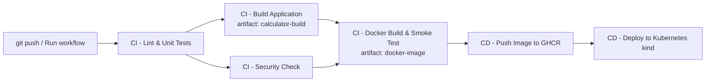

| # | Job | needs | What it does |
|---|---|---|---|
| 1 | `test` - CI - Lint & Unit Tests | - | flake8, pytest with coverage, uploads `test-reports` (JUnit XML + coverage XML) |
| 2 | `build` - CI - Build Application | `test` | `./build.sh` → uploads `calculator-build` artifact |
| 3 | `security-check` - CI - Security Check | `test` | fails if `.env`, `*.pem` or `*.key` files are committed (runs **in parallel** with `build`) |
| 4 | `docker-build` - CI - Docker Build & Smoke Test | `build`, `security-check` | builds the image, runs it and curls `/health`, saves it as the `docker-image` artifact |
| 5 | `push-image` - CD - Push Image to GHCR | `docker-build` | logs in to `ghcr.io` with `GITHUB_TOKEN`, pushes `:<sha>` and `:latest` |
| 6 | `deploy` - CD - Deploy to Kubernetes (kind) | `push-image` | creates a throw-away kind cluster on the runner, pulls the image from GHCR, waits for rollout, curls the service |

Because the image is built **once** in job 4 and moved between jobs as an artifact, the exact
image that passed the smoke test is the one that gets pushed and deployed.

## 3. GitHub Actions concepts - explained and shown in the real workflow

### GitHub Actions
GitHub Actions is GitHub's built-in automation platform. You describe a pipeline in YAML,
commit it under `.github/workflows/`, and GitHub runs it on its own machines whenever an
event (push, PR, manual click, schedule...) occurs.

### Workflow
A workflow is one YAML file = one automated process. It defines **when** it runs (`on:`) and
**what** runs (`jobs:`).

```yaml
name: Session 16 - CI/CD Pipeline
on:
  push:
    branches: [main]
    paths:
      - "DevOps-main/CICD-GitHub-Actions/**"
      - "!DevOps-main/CICD-GitHub-Actions/**.md" # docs / evidence-only commits don't redeploy
      - "!DevOps-main/CICD-GitHub-Actions/screenshots/**"
      - "!DevOps-main/CICD-GitHub-Actions/outputs/**"
      - ".github/workflows/session16-cicd.yml"
  workflow_dispatch:            # manual "Run workflow" button
    inputs:
      break_tests:              # used for the failure demo in section 8
        type: boolean
        default: false

permissions:
  contents: read                # least privilege; jobs ask for more only when they need it

defaults:
  run:
    working-directory: DevOps-main/CICD-GitHub-Actions
```

### Jobs
A job is a group of steps that runs on **one fresh runner**. Jobs run in parallel unless
`needs:` sets up an order. The pipeline uses all three shapes:

```yaml
  build:
    needs: test                          # sequential: only after tests pass
  security-check:
    needs: test                          # fan-out: runs at the same time as build
  docker-build:
    needs: [build, security-check]       # fan-in: waits for BOTH
  deploy:
    needs: push-image
    env:
      IMAGE: ${{ needs.push-image.outputs.image }}   # job output passed between jobs
```

### Steps
Steps are the individual commands inside a job; they run in order on the same machine and share
its filesystem. A step either **uses** a ready-made action or **runs** a shell command:

```yaml
    steps:
      - name: Checkout source code
        uses: actions/checkout@v6            # reusable action from the Marketplace
      - name: Setup Python 3.12
        uses: actions/setup-python@v6
        with:
          python-version: "3.12"
          cache: pip
      - name: Lint (flake8)
        run: flake8 app tests                # plain shell command
```

### Runners
A runner is the machine that executes a job. Every job here uses a **GitHub-hosted runner**
(`runs-on: ubuntu-latest`): a brand-new Ubuntu VM with Docker, kubectl, Python and so on
already installed, thrown away once the job ends. (A self-hosted runner would be a machine you
register yourself, with `runs-on: self-hosted`.) The first job prints details about its runner:

```
CI - Lint & Unit Tests | Runner name : GitHub Actions 1000000141
CI - Lint & Unit Tests | Runner OS   : Linux (X64)
CI - Lint & Unit Tests | Event       : push by tanishkothari9
```

### Secrets
Secrets are encrypted values (passwords, tokens) that the workflow can read through
`${{ secrets.NAME }}`. GitHub **masks** them, so a secret printed to the log shows up as `***`.

This project uses only the built-in **`GITHUB_TOKEN`**. GitHub creates it fresh for every run,
it expires when the job finishes, and its permissions come from the `permissions:` block.
`packages: write` lets it push to GHCR:

```yaml
  push-image:
    permissions:
      contents: read
      packages: write
    steps:
      - name: Secrets demo - GITHUB_TOKEN is masked in logs
        env:
          GH_TOKEN: ${{ secrets.GITHUB_TOKEN }}
        run: |
          echo "Secret available : $([ -n "$GH_TOKEN" ] && echo yes || echo no)"
          echo "Secret length    : ${#GH_TOKEN} characters"
          echo "Printing secret  : $GH_TOKEN"
      - name: Login to GitHub Container Registry
        env:
          GH_TOKEN: ${{ secrets.GITHUB_TOKEN }}
        run: echo "$GH_TOKEN" | docker login ghcr.io -u "${{ github.actor }}" --password-stdin
```

What the real log shows:

```
CD - Push Image to GHCR | Secret available : yes
CD - Push Image to GHCR | Secret length    : 377 characters
CD - Push Image to GHCR | Printing secret  : ***
```

The same token is used again in the `deploy` job to create an image pull secret
inside the temporary kind cluster (`packages: read`), so Kubernetes can pull the image from GHCR.

**Adding your own repository secret** (for example a Docker Hub token). I didn't create one
for this demo, since `GITHUB_TOKEN` covers everything it needs:
1. Repo → **Settings → Secrets and variables → Actions → New repository secret**
   (or run `gh secret set DOCKERHUB_TOKEN` from the CLI).
2. Give it a name such as `DOCKERHUB_TOKEN` and paste the value. After saving it can't be viewed again, only replaced.
3. Use it in a step with `password: ${{ secrets.DOCKERHUB_TOKEN }}`. It is masked in logs just like `GITHUB_TOKEN`,
   and workflows triggered from forks don't receive it.

### Artifacts
Artifacts are files a job uploads so that later jobs (or people) can download them after the
runner has been destroyed. This pipeline uploads three:

| Artifact | Uploaded by | Contents | Used by |
|---|---|---|---|
| `test-reports` | test | `junit.xml`, `coverage.xml` (uploaded even when tests fail: `if: always()`) | people / reporting |
| `calculator-build` | build | packaged app + `build-info.txt` + `calculator-app.tar.gz` | people / release |
| `docker-image` | docker-build | `image.tar.gz` (the tested image) | `push-image` job (`actions/download-artifact`) |

```yaml
      - name: Upload build artifact
        uses: actions/upload-artifact@v6
        with:
          name: calculator-build
          path: ${{ env.APP_DIR }}/build/   # NB: `path` is NOT affected by working-directory
```

### Build
Two kinds of build happen: `build.sh` packages the Python app into `build/`, and the
`docker-build` job builds the container image (`docker build --build-arg APP_VERSION=<sha>`).
That bakes the commit SHA into the image, so `/health` reports exactly which commit is running.

### Test
`flake8` (lint) followed by `pytest` with coverage. There are **15 tests at 100% coverage**: unit tests for
`calculator.py` and API tests for every endpoint, including the error paths (divide by zero,
missing or non-numeric parameters, unknown operation). Because `build` has `needs: test`, a single
failing test stops everything after it (see section 8).

---

## 4. Application source

`app/calculator.py` holds the logic (taken from the course's final pipeline); `app/main.py` wraps it in an API:

| Endpoint | Example | Response |
|---|---|---|
| `GET /` | | app name, version, list of operations |
| `GET /health` | | `{"status":"ok","version":"<git sha>"}` |
| `GET /api/<op>?a=&b=` | `/api/add?a=10&b=5` | `{"a":10.0,"b":5.0,"operation":"add","result":15.0}` |
| errors | `/api/divide?a=1&b=0` | `400 {"error":"Cannot divide by zero"}` |

## 5. Dockerfile

```dockerfile
FROM python:3.12-slim

ARG APP_VERSION=dev

LABEL org.opencontainers.image.source="https://github.com/tanishkothari9/DevOps" \
      org.opencontainers.image.description="Session 16 - CI/CD demo calculator API"

ENV PYTHONDONTWRITEBYTECODE=1 \
    PYTHONUNBUFFERED=1 \
    APP_VERSION=${APP_VERSION}

WORKDIR /app

COPY requirements.txt .
RUN pip install --no-cache-dir -r requirements.txt

COPY app ./app

RUN useradd --uid 10001 --no-create-home appuser
USER 10001

EXPOSE 8000

CMD ["gunicorn", "--bind", "0.0.0.0:8000", "--workers", "2", "app.main:app"]
```

- `python:3.12-slim` base; requirements are copied and installed **before** the code, so the dependency layer stays cached when only the code changes.
- `--no-cache-dir` keeps pip's download cache out of the image; `.dockerignore` keeps tests, k8s files and screenshots out of the build context.
- The app runs as the unprivileged user `10001` under gunicorn (2 workers) instead of Flask's dev server.
- `APP_VERSION` is a build argument: CI passes the git SHA so the running container can say which commit it is.

The `org.opencontainers.image.source` label ties the GHCR package to this repository, which
lets the workflow's `GITHUB_TOKEN` push to it and pull from it.

---

## 6. Running every stage locally

```bash
python3.12 -m venv .venv && source .venv/bin/activate
pip install -r requirements-dev.txt
flake8 app tests && pytest -v --cov=app --cov-report=term-missing   # CI: test
./build.sh                                                          # CI: build
docker build --build-arg APP_VERSION=local -t session16-calculator:local .   # CI: docker-build
docker run -d -p 18016:8000 session16-calculator:local && curl localhost:18016/health
minikube image load session16-calculator:local                      # CD: deploy (local cluster)
kubectl apply -f k8s/ && kubectl rollout status deploy/session16-calculator -n cicd
```

**Lint + tests** - flake8 is clean, 15 tests pass, 100% coverage:

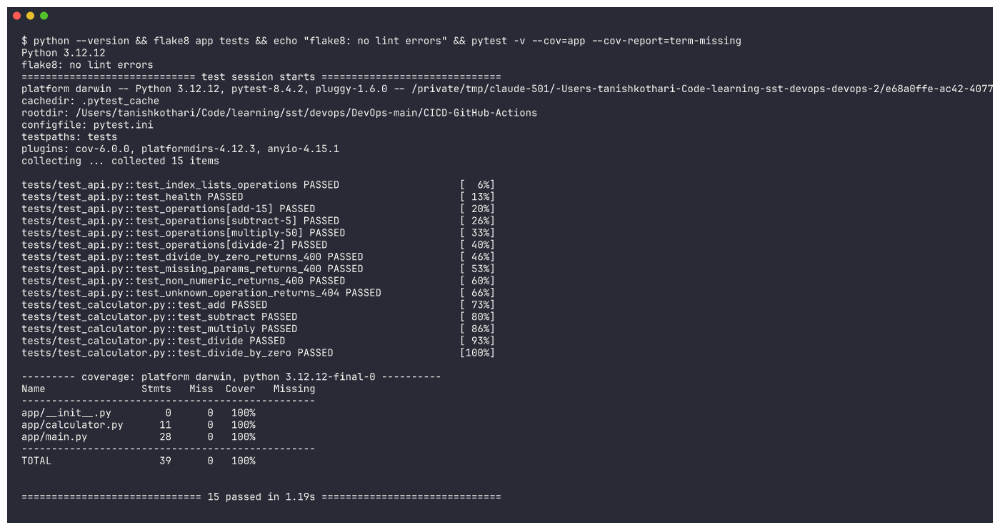

**Build script** - produces the same `build/` folder that CI uploads as an artifact:

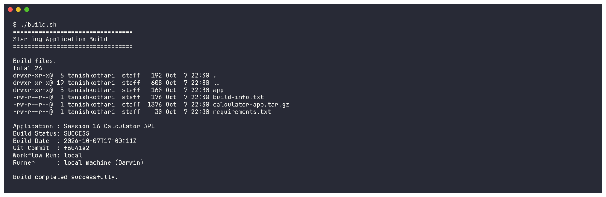

**Docker build** ([full output](outputs/03-docker-build.txt)):

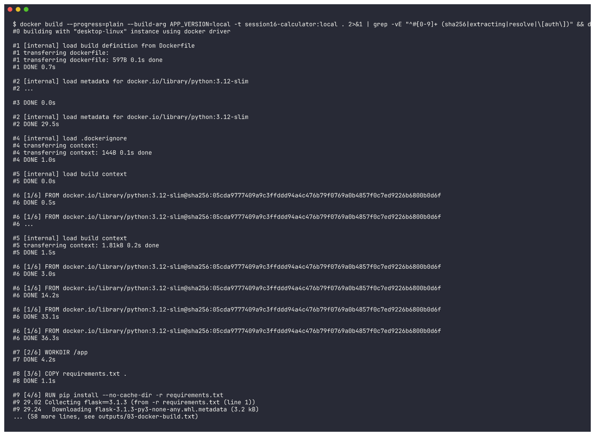

**Running the container** - every endpoint answers, and the process runs as the unprivileged `appuser` (uid 10001):

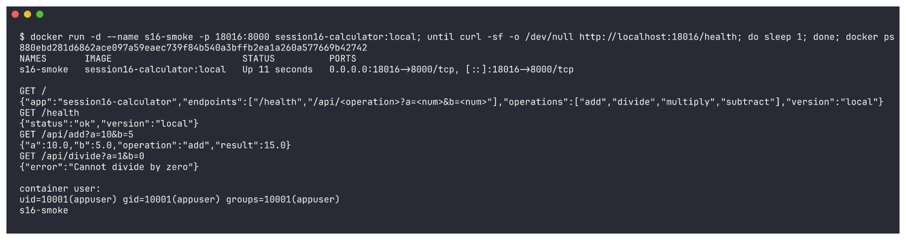

**Deploy to the local minikube cluster** (namespace `cicd`, image loaded with `minikube image load`):

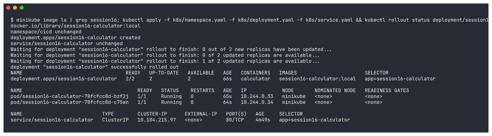

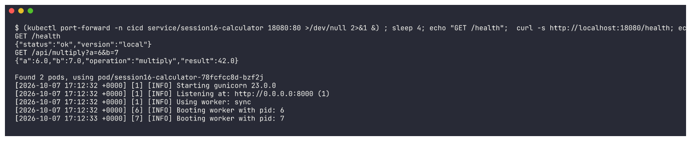

> The first attempt on the shared minikube node went into a restart loop: under load gunicorn needed
> more than 30s to start, and the liveness probe killed it first. I added a `startupProbe` (up to 150s),
> 3s probe timeouts and a higher CPU limit, and it has rolled out cleanly ever since.

---

## 7. Pipeline execution on GitHub Actions

Run [#37659659275](https://github.com/tanishkothari9/DevOps/actions/runs/37659659275), triggered
by `git push`. All 6 jobs are green, and the graph shows the fan-out/fan-in from `needs:`:

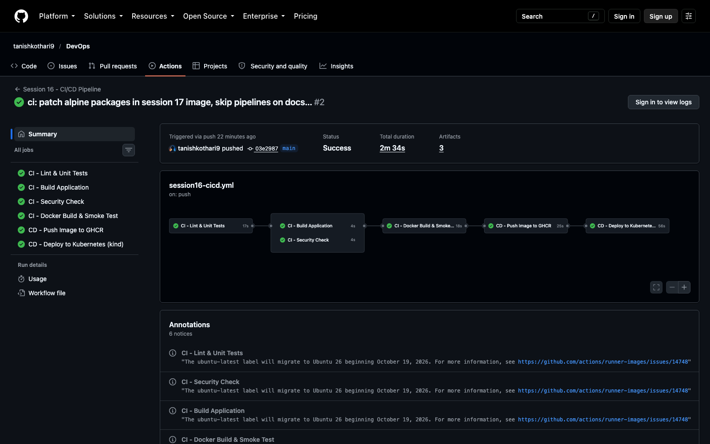

`gh run view` lists the jobs and the 3 artifacts:

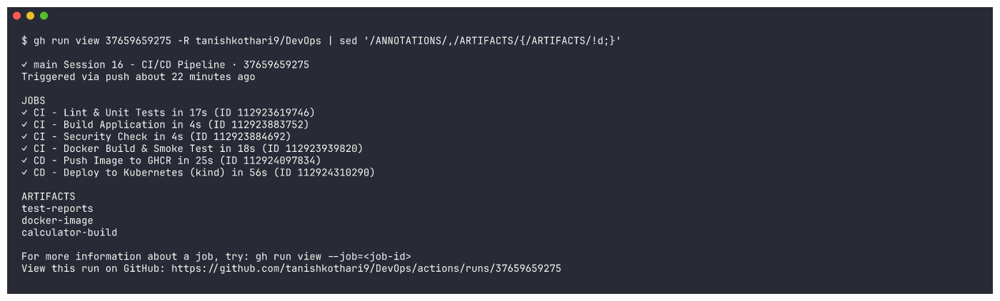

Key lines from each job's log (`gh run view <id> --log | grep ...`; GitHub only shows logs in the browser after you sign in):

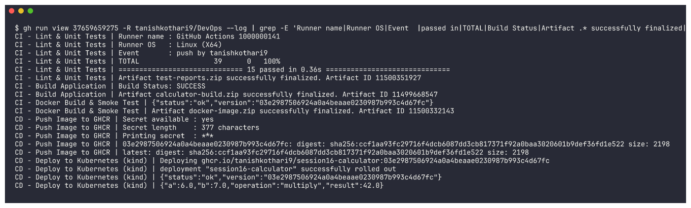

```
CI - Lint & Unit Tests | TOTAL                  39      0   100%
CI - Lint & Unit Tests | ============================== 15 passed in 0.36s ==============================
CI - Build Application | Build Status: SUCCESS
CI - Build Application | Artifact calculator-build.zip successfully finalized. Artifact ID 11499668547
CI - Docker Build & Smoke Test | {"status":"ok","version":"03e2987506924a0a4beaae0230987b993c4d67fc"}
CD - Push Image to GHCR | Printing secret  : ***
CD - Push Image to GHCR | 03e2987506924a0a4beaae0230987b993c4d67fc: digest: sha256:ccf1aa93fc29716f4dcb6087dd3cb817371f92a0baa3020601b9def36fd1e522 size: 2198
CD - Deploy to Kubernetes (kind) | Deploying ghcr.io/tanishkothari9/session16-calculator:03e2987506924a0a4beaae0230987b993c4d67fc
CD - Deploy to Kubernetes (kind) | deployment "session16-calculator" successfully rolled out
CD - Deploy to Kubernetes (kind) | {"a":6.0,"b":7.0,"operation":"multiply","result":42.0}
```

**Artifacts** - downloading them with `gh run download` shows exactly what the runner produced
(`build-info.txt` records the commit, run ID and runner name):

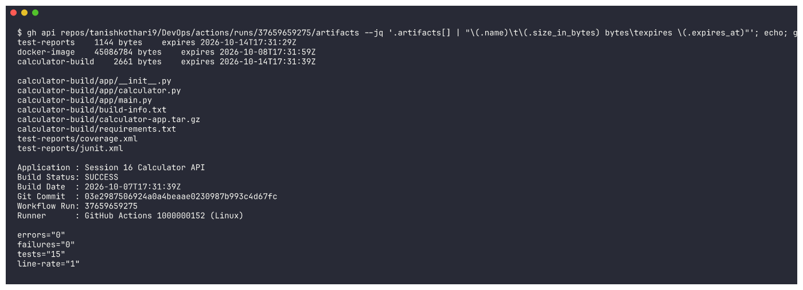

**Container registry (GHCR)** - the image the `push-image` job published is public and can be
pulled. It's `linux/amd64`, carries the commit SHA in `APP_VERSION`, and runs as user `10001`:

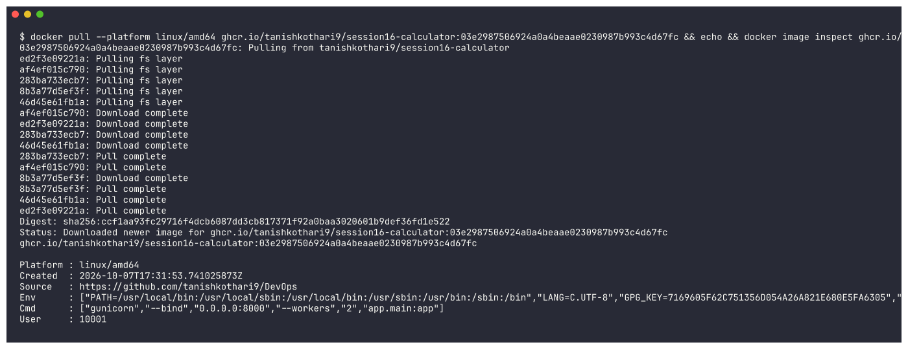

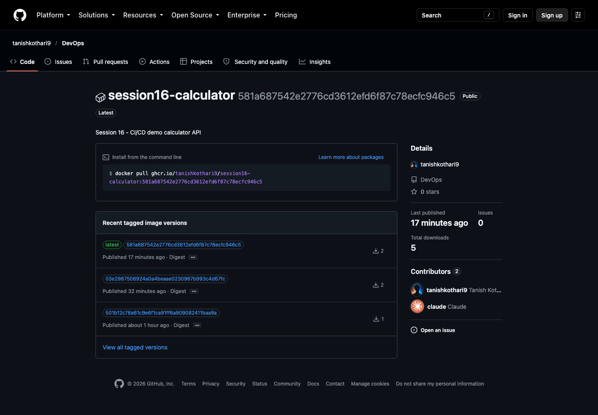

> `latest` and the newest SHA tag (`581a687...`) come from the manual green run in section 8,
> which built whatever commit `main` pointed to at that moment (other homework folders share this repo).

---

## 8. Failure scenario - a failing test stops the pipeline

The course's failure exercise is to change `add()` into `return a + b + 1` and push. So that
broken code never has to be committed, the workflow takes a `break_tests` input that makes the
same change **only inside the runner's checkout**:

```yaml
      - name: Inject bug (break_tests=true)
        if: inputs.break_tests
        run: |
          sed -i 's/return a + b$/return a + b + 1/' app/calculator.py
          echo "::warning::break_tests=true -> add() now returns a + b + 1"
```

```bash
gh workflow run session16-cicd.yml -R tanishkothari9/DevOps -f break_tests=true    # -> red
gh workflow run session16-cicd.yml -R tanishkothari9/DevOps -f break_tests=false   # -> green
```

Run [#37659678309](https://github.com/tanishkothari9/DevOps/actions/runs/37659678309): the test job fails,
and **every job after it is skipped**, so nothing is built, pushed or deployed:

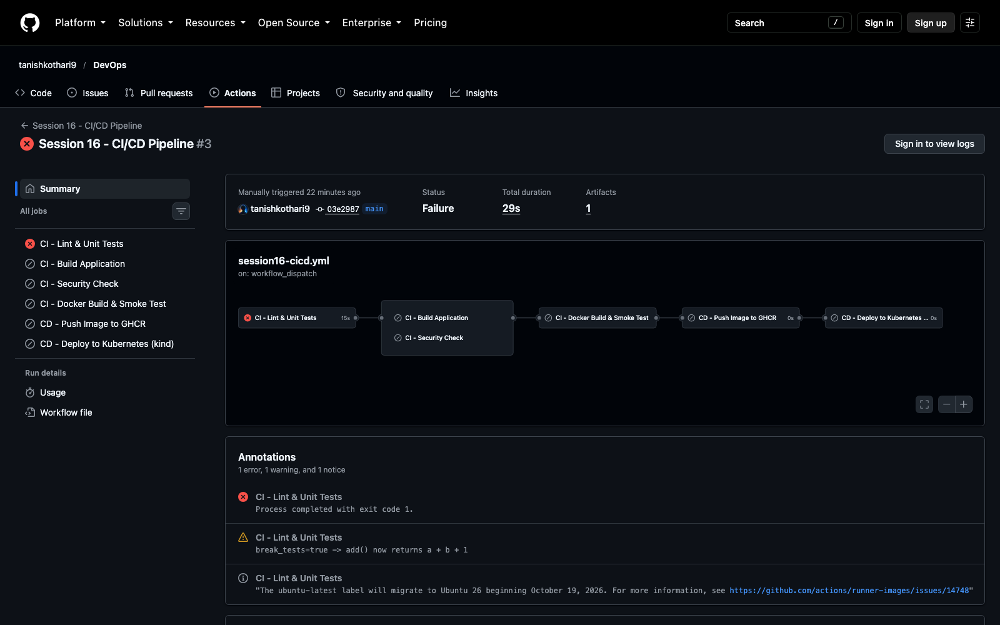

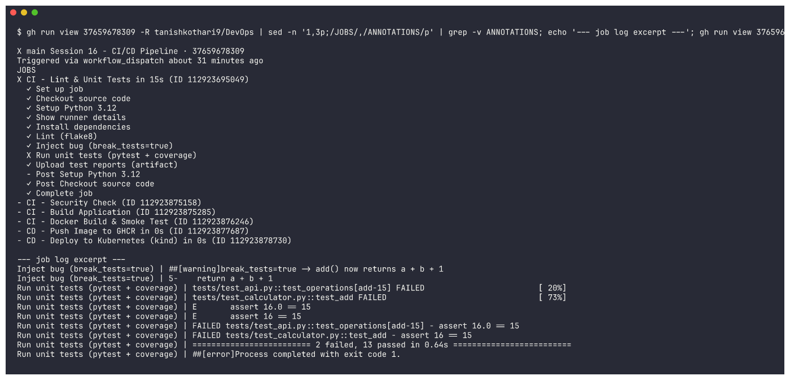

```
Run unit tests (pytest + coverage) | FAILED tests/test_api.py::test_operations[add-15] - assert 16.0 == 15
Run unit tests (pytest + coverage) | FAILED tests/test_calculator.py::test_add - assert 16 == 15
Run unit tests (pytest + coverage) | ========================= 2 failed, 13 passed in 0.64s =========================
Run unit tests (pytest + coverage) | ##[error]Process completed with exit code 1.
```

Running it again without the bug (run [#37661496486](https://github.com/tanishkothari9/DevOps/actions/runs/37661496486)) goes all the way through to a deployment:

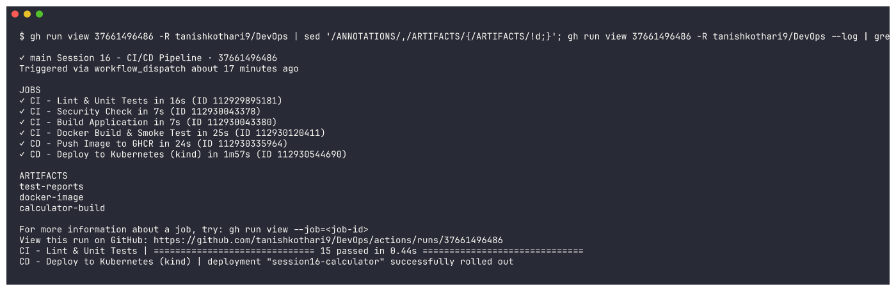

---

## What I understood

- **CI** keeps `main` releasable: every push is linted, tested and built automatically, and a failure stops the pipeline right there.
  **CD** turns a green commit into a versioned image in a registry (delivery) and then into running pods (deployment), with nobody clicking anything.
- A **workflow** is a YAML file containing **jobs**. Each job is a list of **steps** and runs on its own fresh **runner**,
  so passing anything between jobs needs either **artifacts** (files) or **job outputs** (small strings).
- `needs:` turns a set of jobs into a pipeline. Fan-out (`build` and `security-check` side by side) saves time;
  fan-in (`docker-build` needs both) means nothing ships until every check is green.
- **Secrets** never belong in the repo. `GITHUB_TOKEN` is generated for each run, is scoped by `permissions:`, expires when the run ends, and is masked in logs.
- Building the image once and passing that exact image along (as an artifact, then via the registry) means what gets tested is what gets deployed.

> Note: the run pages show a GitHub notice that `ubuntu-latest` moves to Ubuntu 26 on 19 Oct 2026. It is informational and doesn't affect this pipeline.
