# Cloud & Terraform in Action - Session 19

An end-to-end Terraform project that builds a small but complete AWS environment: a **VPC**, a **public subnet**, an **Internet
Gateway + route table**, a **security group**, an **EC2 web server**, and an **S3 bucket**. The whole thing is then inspected,
verified and destroyed with Terraform.

The project demonstrates every item from the task: providers, variables, resources, outputs, dependencies, AWS
infrastructure, Terraform state, `terraform plan`, `terraform apply` and `terraform destroy`.

Every output and screenshot below comes from commands I actually ran. The raw text of each command is in
[`outputs/`](outputs/) and the terminal screenshots are in [`screenshots/`](screenshots/).

> **Note - where this was run:** no AWS account credentials are configured on this machine, so the project was applied
> against **[LocalStack](https://github.com/localstack/localstack)**. LocalStack is a local AWS emulator that runs in Docker and serves the
> EC2, S3, IAM and STS APIs on `http://localhost:4566`. The Terraform code is ordinary AWS code. The only
> LocalStack-specific part is a block in `provider.tf` controlled by one variable (`use_localstack`), and
> setting it to `false` deploys the same code to real AWS (see [Running against real AWS](#running-against-real-aws)).
> Because LocalStack only emulates the APIs, the EC2 instance is not a real VM: its public IP cannot be reached and the
> `user_data` script does not actually run. Everything Terraform manages (IDs, CIDRs, routes, rules, state, dependencies) behaves as it would on AWS.

## Contents

- [Architecture](#architecture)
- [Resources created](#resources-created)
- [Project structure](#project-structure)
- [Terraform concepts demonstrated](#terraform-concepts-demonstrated)
  - [Providers](#1-providers) | [Variables](#2-variables) | [Resources](#3-resources) | [Outputs](#4-outputs) | [Dependencies](#5-dependencies) | [State](#6-terraform-state)
- [Commands and screenshots](#commands-and-screenshots)
- [Troubleshooting log](#troubleshooting-log)
- [Running against real AWS](#running-against-real-aws)
- [Command cheat sheet](#command-cheat-sheet)
- [What I learned](#what-i-learned)

## Architecture

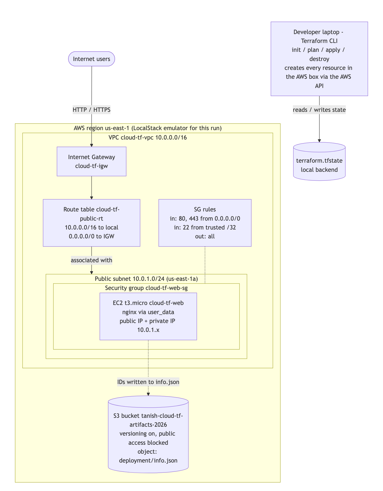

The same diagram as Mermaid source ([`architecture/architecture.mmd`](architecture/architecture.mmd)). GitHub renders it:

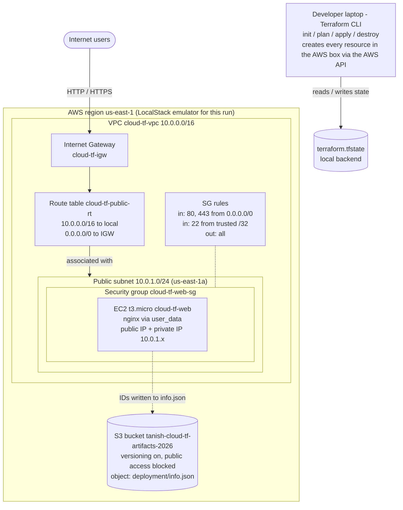
```mermaid
flowchart TB
    dev["Developer laptop - Terraform CLI<br/>init / plan / apply / destroy<br/>creates every resource in the AWS box via the AWS API"]
    state[("terraform.tfstate<br/>local backend")]
    user(["Internet users"])

    subgraph aws["AWS region us-east-1 (LocalStack emulator for this run)"]
        direction TB
        subgraph vpc["VPC cloud-tf-vpc 10.0.0.0/16"]
            direction TB
            igw["Internet Gateway<br/>cloud-tf-igw"]
            rt["Route table cloud-tf-public-rt<br/>10.0.0.0/16 to local<br/>0.0.0.0/0 to IGW"]
            subgraph subnet["Public subnet 10.0.1.0/24 (us-east-1a)"]
                subgraph sg["Security group cloud-tf-web-sg"]
                    ec2["EC2 t3.micro cloud-tf-web<br/>nginx via user_data<br/>public IP + private IP 10.0.1.x"]
                end
            end
            rules["SG rules<br/>in: 80, 443 from 0.0.0.0/0<br/>in: 22 from trusted /32<br/>out: all"]
        end
        s3[("S3 bucket tanish-cloud-tf-artifacts-2026<br/>versioning on, public access blocked<br/>object: deployment/info.json")]
    end

    dev -- "reads / writes state" --> state
    user -- "HTTP / HTTPS" --> igw
    igw --> rt
    rt -- "associated with" --> subnet
    rules -.- sg
    ec2 -. "IDs written to info.json" .-> s3
```

Traffic flow: users on the internet reach the **Internet Gateway**. The **public route table** (associated with the
subnet) sends `0.0.0.0/0` through the IGW, which makes the subnet public. The **security group** allows only ports 80/443
from anywhere and 22 from one trusted CIDR. The **EC2 instance** gets a private IP from `10.0.1.0/24` and a public IP,
because the subnet has `map_public_ip_on_launch = true`. Terraform also writes a `deployment/info.json` object into the
**S3 bucket** that records the IDs of the VPC, subnet and instance.

## Resources created

| # | Terraform address | AWS resource | Key settings |
|---|---|---|---|
| 1 | `aws_vpc.main` | VPC | `10.0.0.0/16`, DNS support + hostnames on |
| 2 | `aws_subnet.public` | Subnet | `10.0.1.0/24` in `us-east-1a`, auto-assign public IP |
| 3 | `aws_internet_gateway.main` | Internet Gateway | Attached to the VPC |
| 4 | `aws_route_table.public` | Route table | `0.0.0.0/0 -> IGW` (plus the implicit `local` route) |
| 5 | `aws_route_table_association.public` | Route table association | Public route table <-> public subnet |
| 6 | `aws_security_group.web` | Security group | In: 80, 443 from `0.0.0.0/0`; 22 from `allowed_ssh_cidr`. Out: all |
| 7 | `aws_instance.web` | EC2 instance | `t3.micro`, IMDSv2 required, encrypted 8 GiB gp3 root volume, nginx `user_data` |
| 8 | `aws_s3_bucket.artifacts` | S3 bucket | `force_destroy = true` |
| 9 | `aws_s3_bucket_versioning.artifacts` | Bucket versioning | Enabled |
| 10 | `aws_s3_bucket_public_access_block.artifacts` | Public access block | All four settings `true` |
| 11 | `aws_s3_object.deployment_info` | S3 object | `deployment/info.json` with the VPC, subnet and instance IDs |

## Project structure

```text
Cloud-Terraform-Project/
|-- versions.tf        # terraform block: required_version, required_providers (+ commented remote backend)
|-- provider.tf        # AWS provider: region, default_tags, LocalStack switch
|-- variables.tf       # all input variables (types, defaults, validation)
|-- terraform.tfvars   # values for this environment
|-- network.tf         # VPC, subnet, internet gateway, route table, association
|-- security.tf        # security group
|-- compute.tf         # EC2 instance (implicit + explicit dependencies)
|-- storage.tf         # S3 bucket, versioning, public access block, object
|-- outputs.tf         # output values
|-- .gitignore         # .terraform/, *.tfstate*, *.tfplan
|-- architecture/
|   |-- architecture.mmd        # Mermaid source of the diagram
|   |-- architecture.png        # rendered diagram
|   |-- terraform-graph.dot     # `terraform graph` output
|   `-- terraform-graph.png     # rendered dependency graph
|-- outputs/           # raw text of every command run
`-- screenshots/       # terminal screenshots of every command run
```

Splitting the code by concern (network / security / compute / storage) is purely for readability. Terraform loads every
`*.tf` file in the directory as one configuration.

---

## Terraform concepts demonstrated

### 1. Providers

A **provider** is the plugin that turns HCL resources into API calls. `versions.tf` pins Terraform and the provider version, and
`provider.tf` configures it:

```hcl
terraform {
  required_version = ">= 1.6.0"

  required_providers {
    aws = {
      source  = "hashicorp/aws"
      version = "~> 6.0"
    }
  }

  # State is stored locally in terraform.tfstate (default "local" backend).
  # For a team setup, switch to a remote backend, e.g.:
  #
  # backend "s3" {
  #   bucket       = "my-terraform-state-bucket"
  #   key          = "cloud-terraform-project/terraform.tfstate"
  #   region       = "us-east-1"
  #   encrypt      = true
  #   use_lockfile = true # S3-native state locking
  # }
}
```

```hcl
# AWS provider.
#
# use_localstack = true  -> every API call goes to LocalStack (a local AWS emulator
#                           running in Docker on port 4566) with dummy credentials.
# use_localstack = false -> all overrides below switch off and the provider talks to
#                           real AWS using the credentials from `aws configure`,
#                           AWS_PROFILE or environment variables.
provider "aws" {
  region = var.aws_region

  # ---- LocalStack overrides (disabled when use_localstack = false) ----
  access_key                  = var.use_localstack ? "test" : null
  secret_key                  = var.use_localstack ? "test" : null
  skip_credentials_validation = var.use_localstack
  skip_metadata_api_check     = var.use_localstack
  skip_requesting_account_id  = var.use_localstack
  s3_use_path_style           = var.use_localstack

  dynamic "endpoints" {
    for_each = var.use_localstack ? [var.localstack_endpoint] : []
    content {
      ec2 = endpoints.value
      s3  = endpoints.value
      iam = endpoints.value
      sts = endpoints.value
    }
  }
  # ---------------------------------------------------------------------

  # Tags added to every resource this provider creates.
  default_tags {
    tags = {
      Project     = var.project_name
      Environment = var.environment
      ManagedBy   = "Terraform"
      Session     = "19"
    }
  }
}
```

- `version = "~> 6.0"` allows any 6.x release but never 7.0. `terraform init` resolved it to **v6.67.0** and recorded it in
  `.terraform.lock.hcl`.
- `default_tags` adds `Project`, `Environment`, `ManagedBy` and `Session` tags to **every** resource automatically. The CLI
  verification below filters on `tag:Project=cloud-tf`, which only works because of these tags.
- The LocalStack block is driven by `var.use_localstack`. A `dynamic "endpoints"` block is generated only when the variable is
  `true`, and the `null` credentials / `false` flags make the provider behave normally when it is `false`.

### 2. Variables

All inputs are declared in `variables.tf` with a **type**, a **description**, and a **default** where it makes sense. Values that must be
chosen per environment (`ami_id`, `bucket_name`, `allowed_ssh_cidr`) have no default, so Terraform refuses to run without
them. `vpc_cidr` has a **validation** rule that uses `cidrhost()`.

```hcl
# ---------- General ----------
variable "aws_region" {
  description = "AWS region to deploy into."
  type        = string
  default     = "us-east-1"
}

variable "project_name" {
  description = "Prefix used in resource names and tags."
  type        = string
  default     = "cloud-tf"
}

variable "environment" {
  description = "Environment name (dev / staging / prod)."
  type        = string
  default     = "dev"
}

# ---------- Networking ----------
variable "vpc_cidr" {
  description = "CIDR block of the VPC."
  type        = string
  default     = "10.0.0.0/16"

  validation {
    condition     = can(cidrhost(var.vpc_cidr, 0))
    error_message = "vpc_cidr must be a valid IPv4 CIDR block, e.g. 10.0.0.0/16."
  }
}

variable "public_subnet_cidr" {
  description = "CIDR block of the public subnet (must sit inside vpc_cidr)."
  type        = string
  default     = "10.0.1.0/24"
}

variable "availability_zone_suffix" {
  description = "AZ letter for the subnet; combined with the region, e.g. us-east-1 + a."
  type        = string
  default     = "a"
}

variable "allowed_ssh_cidr" {
  description = "Only this CIDR may SSH (port 22) into the instance. Use your own public IP/32."
  type        = string
}

# ---------- Compute ----------
variable "ami_id" {
  description = "AMI ID for the EC2 instance (region specific)."
  type        = string
}

variable "instance_type" {
  description = "EC2 instance type."
  type        = string
  default     = "t3.micro"
}

variable "key_name" {
  description = "Existing EC2 key pair name for SSH. null = no key pair attached."
  type        = string
  default     = null
}

# ---------- Storage ----------
variable "bucket_name" {
  description = "Globally unique S3 bucket name."
  type        = string
}

# ---------- LocalStack ----------
variable "use_localstack" {
  description = "Send AWS API calls to LocalStack (local AWS emulator) instead of real AWS."
  type        = bool
  default     = false
}

variable "localstack_endpoint" {
  description = "LocalStack edge endpoint, only used when use_localstack = true."
  type        = string
  default     = "http://localhost:4566"
}
```

The values for this run are in `terraform.tfvars` (loaded automatically):

```hcl
aws_region   = "us-east-1"
project_name = "cloud-tf"
environment  = "dev"

vpc_cidr           = "10.0.0.0/16"
public_subnet_cidr = "10.0.1.0/24"
allowed_ssh_cidr   = "203.0.113.25/32" # replace with <your-public-ip>/32

# ami-760aaa0f is an Amazon Linux AMI that LocalStack ships in its mock image
# catalogue. For real AWS use a current Amazon Linux 2023 AMI for your region
# (see README -> "Running against real AWS").
ami_id        = "ami-760aaa0f"
instance_type = "t3.micro"

bucket_name = "tanish-cloud-tf-artifacts-2026"

# No AWS account credentials are configured on this machine, so the project is
# applied against LocalStack. Set to false to deploy to a real AWS account.
use_localstack = true
```

Variable precedence, from lowest to highest: default in `variables.tf` < `TF_VAR_name` environment variable < `terraform.tfvars` <
`*.auto.tfvars` < `-var-file=...` / `-var 'name=value'` on the command line.

### 3. Resources

Resources are the infrastructure objects. Each has a **type** (`aws_vpc`) and a **local name** (`main`), which together form
the address `aws_vpc.main`.

**network.tf**

```hcl
# VPC - the private network that holds everything else.
resource "aws_vpc" "main" {
  cidr_block           = var.vpc_cidr
  enable_dns_support   = true
  enable_dns_hostnames = true

  tags = {
    Name = "${var.project_name}-vpc"
  }
}

# Public subnet in one AZ. Instances launched here get a public IP automatically.
# Implicit dependency: references aws_vpc.main.id, so it is created after the VPC.
resource "aws_subnet" "public" {
  vpc_id                  = aws_vpc.main.id
  cidr_block              = var.public_subnet_cidr
  availability_zone       = "${var.aws_region}${var.availability_zone_suffix}"
  map_public_ip_on_launch = true

  tags = {
    Name = "${var.project_name}-public-subnet"
    Tier = "public"
  }
}

# Internet Gateway - the VPC's door to the internet.
resource "aws_internet_gateway" "main" {
  vpc_id = aws_vpc.main.id

  tags = {
    Name = "${var.project_name}-igw"
  }
}

# Route table that sends all non-local traffic (0.0.0.0/0) to the Internet Gateway.
resource "aws_route_table" "public" {
  vpc_id = aws_vpc.main.id

  route {
    cidr_block = "0.0.0.0/0"
    gateway_id = aws_internet_gateway.main.id
  }

  tags = {
    Name = "${var.project_name}-public-rt"
  }
}

# Associating the route table with the subnet is what makes the subnet "public".
resource "aws_route_table_association" "public" {
  subnet_id      = aws_subnet.public.id
  route_table_id = aws_route_table.public.id
}
```

**security.tf**

```hcl
# Security group (stateful, instance-level firewall) for the web server.
resource "aws_security_group" "web" {
  name        = "${var.project_name}-web-sg"
  description = "Allow HTTP/HTTPS from anywhere and SSH from one trusted CIDR"
  vpc_id      = aws_vpc.main.id

  ingress {
    description = "HTTP"
    from_port   = 80
    to_port     = 80
    protocol    = "tcp"
    cidr_blocks = ["0.0.0.0/0"]
  }

  ingress {
    description = "HTTPS"
    from_port   = 443
    to_port     = 443
    protocol    = "tcp"
    cidr_blocks = ["0.0.0.0/0"]
  }

  ingress {
    description = "SSH from trusted CIDR only"
    from_port   = 22
    to_port     = 22
    protocol    = "tcp"
    cidr_blocks = [var.allowed_ssh_cidr]
  }

  egress {
    description = "All outbound traffic"
    from_port   = 0
    to_port     = 0
    protocol    = "-1"
    cidr_blocks = ["0.0.0.0/0"]
  }

  tags = {
    Name = "${var.project_name}-web-sg"
  }
}
```

**compute.tf**

```hcl
# EC2 web server in the public subnet.
resource "aws_instance" "web" {
  ami                    = var.ami_id
  instance_type          = var.instance_type
  key_name               = var.key_name
  subnet_id              = aws_subnet.public.id        # implicit dependency
  vpc_security_group_ids = [aws_security_group.web.id] # implicit dependency

  # Installs nginx on first boot and writes a page that names the S3 bucket
  # (referencing the bucket is another implicit dependency).
  user_data = <<-EOT
    #!/bin/bash
    dnf install -y nginx
    echo "<h1>${var.project_name} web server</h1><p>Artifacts bucket: ${aws_s3_bucket.artifacts.bucket}</p>" > /usr/share/nginx/html/index.html
    systemctl enable --now nginx
  EOT

  metadata_options {
    http_tokens = "required" # IMDSv2 only
  }

  root_block_device {
    volume_type = "gp3"
    volume_size = 8
    encrypted   = true
  }

  # Explicit dependency: nothing above references the Internet Gateway or the
  # route table association, but the user_data script needs internet access
  # (dnf install) the moment the instance boots, so the public route must
  # exist before the instance is created.
  depends_on = [
    aws_internet_gateway.main,
    aws_route_table_association.public,
  ]

  tags = {
    Name = "${var.project_name}-web"
  }
}
```

**storage.tf**

```hcl
# S3 bucket for application artifacts.
resource "aws_s3_bucket" "artifacts" {
  bucket        = var.bucket_name
  force_destroy = true # allow `terraform destroy` even when the bucket holds objects

  tags = {
    Name = var.bucket_name
  }
}

resource "aws_s3_bucket_versioning" "artifacts" {
  bucket = aws_s3_bucket.artifacts.id

  versioning_configuration {
    status = "Enabled"
  }
}

resource "aws_s3_bucket_public_access_block" "artifacts" {
  bucket = aws_s3_bucket.artifacts.id

  block_public_acls       = true
  block_public_policy     = true
  ignore_public_acls      = true
  restrict_public_buckets = true
}

# A small object describing the deployment. It references the EC2 instance and
# VPC IDs, so Terraform creates it only after those exist (implicit dependency).
resource "aws_s3_object" "deployment_info" {
  bucket       = aws_s3_bucket.artifacts.id
  key          = "deployment/info.json"
  content_type = "application/json"
  content = jsonencode({
    project     = var.project_name
    environment = var.environment
    vpc_id      = aws_vpc.main.id
    subnet_id   = aws_subnet.public.id
    instance_id = aws_instance.web.id
  })
}
```

### 4. Outputs

Outputs expose useful values after `apply` for people, scripts (`terraform output -raw ...`), and other Terraform configurations
(via `terraform_remote_state`).

```hcl
output "vpc_id" {
  description = "ID of the VPC."
  value       = aws_vpc.main.id
}

output "vpc_cidr" {
  description = "CIDR block of the VPC."
  value       = aws_vpc.main.cidr_block
}

output "public_subnet_id" {
  description = "ID of the public subnet."
  value       = aws_subnet.public.id
}

output "internet_gateway_id" {
  description = "ID of the Internet Gateway."
  value       = aws_internet_gateway.main.id
}

output "route_table_id" {
  description = "ID of the public route table."
  value       = aws_route_table.public.id
}

output "security_group_id" {
  description = "ID of the web security group."
  value       = aws_security_group.web.id
}

output "instance_id" {
  description = "ID of the EC2 instance."
  value       = aws_instance.web.id
}

output "instance_private_ip" {
  description = "Private IP of the EC2 instance."
  value       = aws_instance.web.private_ip
}

output "instance_public_ip" {
  description = "Public IP of the EC2 instance."
  value       = aws_instance.web.public_ip
}

output "web_url" {
  description = "URL of the web server."
  value       = "http://${aws_instance.web.public_ip}"
}

output "s3_bucket_name" {
  description = "Name of the artifacts bucket."
  value       = aws_s3_bucket.artifacts.bucket
}

output "s3_bucket_arn" {
  description = "ARN of the artifacts bucket."
  value       = aws_s3_bucket.artifacts.arn
}

output "deployment_info_object" {
  description = "S3 URI of the deployment info object."
  value       = "s3://${aws_s3_bucket.artifacts.bucket}/${aws_s3_object.deployment_info.key}"
}
```

### 5. Dependencies

Terraform builds a **dependency graph** and creates resources in the right order, running independent ones in parallel.

**Implicit dependencies** come from references. When one resource uses another resource's attribute, Terraform knows the
referenced one must exist first:

| Resource | References | So it waits for |
|---|---|---|
| `aws_subnet.public` | `aws_vpc.main.id` | VPC |
| `aws_internet_gateway.main` | `aws_vpc.main.id` | VPC |
| `aws_route_table.public` | `aws_vpc.main.id`, `aws_internet_gateway.main.id` | VPC, IGW |
| `aws_route_table_association.public` | `aws_subnet.public.id`, `aws_route_table.public.id` | Subnet, route table |
| `aws_security_group.web` | `aws_vpc.main.id` | VPC |
| `aws_instance.web` | `aws_subnet.public.id`, `aws_security_group.web.id`, `aws_s3_bucket.artifacts.bucket` (in `user_data`) | Subnet, SG, bucket |
| `aws_s3_bucket_versioning/public_access_block` | `aws_s3_bucket.artifacts.id` | Bucket |
| `aws_s3_object.deployment_info` | bucket, VPC, subnet and **instance** IDs | Bucket, VPC, subnet, instance |

**Explicit dependency** (`depends_on`): `aws_instance.web` does not reference the Internet Gateway or the route table
association, but its `user_data` runs `dnf install nginx` on first boot, which needs a working internet route. Without
`depends_on`, Terraform could start the instance before the `0.0.0.0/0 -> IGW` route was associated with the subnet. So:

```hcl
  depends_on = [
    aws_internet_gateway.main,
    aws_route_table_association.public,
  ]
```

The ordering can be seen in the apply log: `aws_instance.web: Creating...` starts only **after**
`aws_route_table_association.public: Creation complete`, and `aws_s3_object.deployment_info` is created last. Destroy runs
in exactly the reverse order.

**Dependency graph** produced by `terraform graph` (rendered from [`architecture/terraform-graph.dot`](architecture/terraform-graph.dot)).
An arrow `A -> B` means "A depends on B":

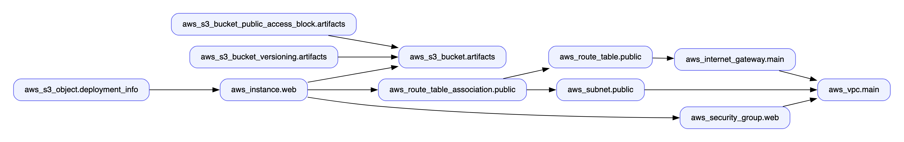

> `terraform graph` prints a transitively reduced graph. The explicit `aws_instance.web -> aws_internet_gateway.main` edge
> is not drawn because the instance already reaches the IGW through `route_table_association -> route_table -> internet_gateway`.

### 6. Terraform state

`terraform.tfstate` is Terraform's record of which real object (`vpc-dccd99bd`, `i-cbcf74dc7adec72bf`, ...) belongs to which
resource address, plus all of its attributes. `plan` compares **configuration** vs **state** vs **real infrastructure** to work out
the changes.

- This project uses the default **local backend** (`terraform.tfstate` in the project folder). State can hold sensitive values,
  so `*.tfstate*` is in `.gitignore`. Instead of committing the state file, I show it below with `terraform state list`,
  `terraform state show`, and a `jq` summary of the file.
- For teams, state should live in a **remote backend** with locking, e.g. the S3 backend with `use_lockfile = true`
  (commented example in `versions.tf`). Then everyone works from the same state and two `apply` runs cannot clash.
- Useful commands: `terraform state list`, `terraform state show <addr>`, `terraform state mv` (rename/move without
  recreating), `terraform state rm` (stop managing), `terraform import` (adopt an existing resource), and `terraform plan -refresh-only`
  (detect drift).

---

## Commands and screenshots

### 0. LocalStack is running

```bash
docker run -d --name localstack -p 4566:4566 \
  -e SERVICES=s3,ec2,iam,sts localstack/localstack:3.8
```

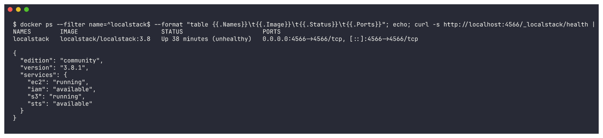

```text
$ docker ps --filter name=^localstack$ --format "table {{.Names}}\t{{.Image}}\t{{.Status}}\t{{.Ports}}"; echo; curl -s http://localhost:4566/_localstack/health | jq "{edition, version, services: (.services | with_entries(select(.value != \"disabled\")))}"
NAMES        IMAGE                       STATUS                      PORTS
localstack   localstack/localstack:3.8   Up 38 minutes (unhealthy)   0.0.0.0:4566->4566/tcp, [::]:4566->4566/tcp

{
  "edition": "community",
  "version": "3.8.1",
  "services": {
    "ec2": "running",
    "iam": "available",
    "s3": "running",
    "sts": "available"
  }
}
```

> Docker shows `(unhealthy)` only because LocalStack's built-in healthcheck command took longer than its 5 s timeout on this
> busy machine (`docker inspect` shows `Health check exceeded timeout (5s)`). The health endpoint shows EC2 and S3 running,
> and every command below used it without problems.

### 1. `terraform init` - download the provider, create the lock file


```text
$ terraform init -no-color
Initializing the backend...

Initializing provider plugins...
- Finding hashicorp/aws versions matching "~> 6.0"...
- Installing hashicorp/aws v6.67.0...
- Installed hashicorp/aws v6.67.0 (signed by HashiCorp)

Terraform has created a lock file .terraform.lock.hcl to record the provider
selections it made above. Include this file in your version control repository
so that Terraform can guarantee to make the same selections by default when
you run "terraform init" in the future.

Terraform has been successfully initialized!

You may now begin working with Terraform. Try running "terraform plan" to see
any changes that are required for your infrastructure. All Terraform commands
should now work.

If you ever set or change modules or backend configuration for Terraform,
rerun this command to reinitialize your working directory. If you forget, other
commands will detect it and remind you to do so if necessary.
```

### 2. `terraform fmt` - format the code

`fmt -check` exited with code 3 because the comments in `compute.tf` were not aligned. `terraform fmt` fixed the file, and the second
check passed.

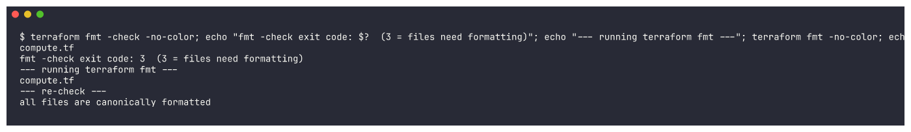

```text
$ terraform fmt -check -no-color; echo "fmt -check exit code: $?  (3 = files need formatting)"; echo "--- running terraform fmt ---"; terraform fmt -no-color; echo "--- re-check ---"; terraform fmt -check -no-color && echo "all files are canonically formatted"
compute.tf
fmt -check exit code: 3  (3 = files need formatting)
--- running terraform fmt ---
compute.tf
--- re-check ---
all files are canonically formatted
```

### 3. `terraform validate` - static checks


```text
$ terraform validate -no-color
Success! The configuration is valid.
```

### 4. `terraform plan` - preview: 11 resources to add

```bash
terraform plan -out=tfplan.tfplan
```

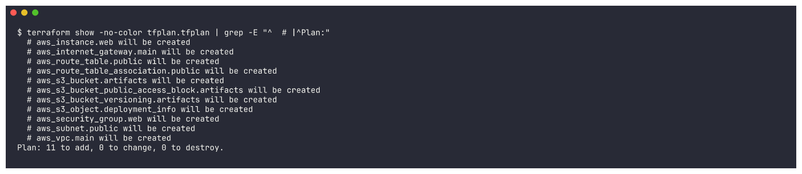

```text
$ terraform show -no-color tfplan.tfplan | grep -E "^  # |^Plan:"
  # aws_instance.web will be created
  # aws_internet_gateway.main will be created
  # aws_route_table.public will be created
  # aws_route_table_association.public will be created
  # aws_s3_bucket.artifacts will be created
  # aws_s3_bucket_public_access_block.artifacts will be created
  # aws_s3_bucket_versioning.artifacts will be created
  # aws_s3_object.deployment_info will be created
  # aws_security_group.web will be created
  # aws_subnet.public will be created
  # aws_vpc.main will be created
Plan: 11 to add, 0 to change, 0 to destroy.
```

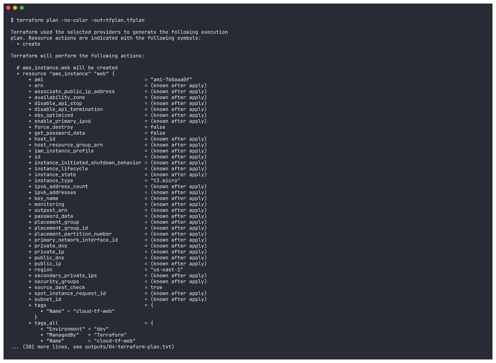

<details>
<summary>Full output (436 lines) - click to expand</summary>

```text
$ terraform plan -no-color -out=tfplan.tfplan

Terraform used the selected providers to generate the following execution
plan. Resource actions are indicated with the following symbols:
  + create

Terraform will perform the following actions:

  # aws_instance.web will be created
  + resource "aws_instance" "web" {
      + ami                                  = "ami-760aaa0f"
      + arn                                  = (known after apply)
      + associate_public_ip_address          = (known after apply)
      + availability_zone                    = (known after apply)
      + disable_api_stop                     = (known after apply)
      + disable_api_termination              = (known after apply)
      + ebs_optimized                        = (known after apply)
      + enable_primary_ipv6                  = (known after apply)
      + force_destroy                        = false
      + get_password_data                    = false
      + host_id                              = (known after apply)
      + host_resource_group_arn              = (known after apply)
      + iam_instance_profile                 = (known after apply)
      + id                                   = (known after apply)
      + instance_initiated_shutdown_behavior = (known after apply)
      + instance_lifecycle                   = (known after apply)
      + instance_state                       = (known after apply)
      + instance_type                        = "t3.micro"
      + ipv6_address_count                   = (known after apply)
      + ipv6_addresses                       = (known after apply)
      + key_name                             = (known after apply)
      + monitoring                           = (known after apply)
      + outpost_arn                          = (known after apply)
      + password_data                        = (known after apply)
      + placement_group                      = (known after apply)
      + placement_group_id                   = (known after apply)
      + placement_partition_number           = (known after apply)
      + primary_network_interface_id         = (known after apply)
      + private_dns                          = (known after apply)
      + private_ip                           = (known after apply)
      + public_dns                           = (known after apply)
      + public_ip                            = (known after apply)
      + region                               = "us-east-1"
      + secondary_private_ips                = (known after apply)
      + security_groups                      = (known after apply)
      + source_dest_check                    = true
      + spot_instance_request_id             = (known after apply)
      + subnet_id                            = (known after apply)
      + tags                                 = {
          + "Name" = "cloud-tf-web"
        }
      + tags_all                             = {
          + "Environment" = "dev"
          + "ManagedBy"   = "Terraform"
          + "Name"        = "cloud-tf-web"
          + "Project"     = "cloud-tf"
          + "Session"     = "19"
        }
      + tenancy                              = (known after apply)
      + user_data                            = <<-EOT
            #!/bin/bash
            dnf install -y nginx
            echo "<h1>cloud-tf web server</h1><p>Artifacts bucket: tanish-cloud-tf-artifacts-2026</p>" > /usr/share/nginx/html/index.html
            systemctl enable --now nginx
        EOT
      + user_data_base64                     = (known after apply)
      + user_data_replace_on_change          = false
      + vpc_security_group_ids               = (known after apply)

      + capacity_reservation_specification (known after apply)

      + cpu_options (known after apply)

      + ebs_block_device (known after apply)

      + enclave_options (known after apply)

      + ephemeral_block_device (known after apply)

      + instance_market_options (known after apply)

      + maintenance_options (known after apply)

      + metadata_options {
          + http_endpoint               = "enabled"
          + http_protocol_ipv6          = "disabled"
          + http_put_response_hop_limit = (known after apply)
          + http_tokens                 = "required"
          + instance_metadata_tags      = (known after apply)
        }

      + network_interface (known after apply)

      + primary_network_interface (known after apply)

      + private_dns_name_options (known after apply)

      + root_block_device {
          + delete_on_termination = true
          + device_name           = (known after apply)
          + encrypted             = true
          + iops                  = (known after apply)
          + kms_key_id            = (known after apply)
          + tags_all              = (known after apply)
          + throughput            = (known after apply)
          + volume_id             = (known after apply)
          + volume_size           = 8
          + volume_type           = "gp3"
        }

      + secondary_network_interface (known after apply)
    }

  # aws_internet_gateway.main will be created
  + resource "aws_internet_gateway" "main" {
      + arn      = (known after apply)
      + id       = (known after apply)
      + owner_id = (known after apply)
      + region   = "us-east-1"
      + tags     = {
          + "Name" = "cloud-tf-igw"
        }
      + tags_all = {
          + "Environment" = "dev"
          + "ManagedBy"   = "Terraform"
          + "Name"        = "cloud-tf-igw"
          + "Project"     = "cloud-tf"
          + "Session"     = "19"
        }
      + vpc_id   = (known after apply)
    }

  # aws_route_table.public will be created
  + resource "aws_route_table" "public" {
      + arn              = (known after apply)
      + id               = (known after apply)
      + owner_id         = (known after apply)
      + propagating_vgws = (known after apply)
      + region           = "us-east-1"
      + route            = [
          + {
              + cidr_block                 = "0.0.0.0/0"
              + gateway_id                 = (known after apply)
                # (12 unchanged attributes hidden)
            },
        ]
      + tags             = {
          + "Name" = "cloud-tf-public-rt"
        }
      + tags_all         = {
          + "Environment" = "dev"
          + "ManagedBy"   = "Terraform"
          + "Name"        = "cloud-tf-public-rt"
          + "Project"     = "cloud-tf"
          + "Session"     = "19"
        }
      + vpc_id           = (known after apply)
    }

  # aws_route_table_association.public will be created
  + resource "aws_route_table_association" "public" {
      + id             = (known after apply)
      + region         = "us-east-1"
      + route_table_id = (known after apply)
      + subnet_id      = (known after apply)
    }

  # aws_s3_bucket.artifacts will be created
  + resource "aws_s3_bucket" "artifacts" {
      + acceleration_status         = (known after apply)
      + acl                         = (known after apply)
      + arn                         = (known after apply)
      + bucket                      = "tanish-cloud-tf-artifacts-2026"
      + bucket_domain_name          = (known after apply)
      + bucket_namespace            = (known after apply)
      + bucket_prefix               = (known after apply)
      + bucket_region               = (known after apply)
      + bucket_regional_domain_name = (known after apply)
      + force_destroy               = true
      + hosted_zone_id              = (known after apply)
      + id                          = (known after apply)
      + object_lock_enabled         = (known after apply)
      + policy                      = (known after apply)
      + region                      = "us-east-1"
      + request_payer               = (known after apply)
      + tags                        = {
          + "Name" = "tanish-cloud-tf-artifacts-2026"
        }
      + tags_all                    = {
          + "Environment" = "dev"
          + "ManagedBy"   = "Terraform"
          + "Name"        = "tanish-cloud-tf-artifacts-2026"
          + "Project"     = "cloud-tf"
          + "Session"     = "19"
        }
      + website_domain              = (known after apply)
      + website_endpoint            = (known after apply)

      + cors_rule (known after apply)

      + grant (known after apply)

      + lifecycle_rule (known after apply)

      + logging (known after apply)

      + object_lock_configuration (known after apply)

      + replication_configuration (known after apply)

      + server_side_encryption_configuration (known after apply)

      + versioning (known after apply)

      + website (known after apply)
    }

  # aws_s3_bucket_public_access_block.artifacts will be created
  + resource "aws_s3_bucket_public_access_block" "artifacts" {
      + block_public_acls       = true
      + block_public_policy     = true
      + bucket                  = (known after apply)
      + id                      = (known after apply)
      + ignore_public_acls      = true
      + region                  = "us-east-1"
      + restrict_public_buckets = true
    }

  # aws_s3_bucket_versioning.artifacts will be created
  + resource "aws_s3_bucket_versioning" "artifacts" {
      + bucket = (known after apply)
      + id     = (known after apply)
      + region = "us-east-1"

      + versioning_configuration {
          + mfa_delete = (known after apply)
          + status     = "Enabled"
        }
    }

  # aws_s3_object.deployment_info will be created
  + resource "aws_s3_object" "deployment_info" {
      + acl                    = (known after apply)
      + arn                    = (known after apply)
      + bucket                 = (known after apply)
      + bucket_key_enabled     = (known after apply)
      + checksum_crc32         = (known after apply)
      + checksum_crc32c        = (known after apply)
      + checksum_crc64nvme     = (known after apply)
      + checksum_sha1          = (known after apply)
      + checksum_sha256        = (known after apply)
      + content                = (known after apply)
      + content_type           = "application/json"
      + etag                   = (known after apply)
      + force_destroy          = false
      + id                     = (known after apply)
      + key                    = "deployment/info.json"
      + kms_key_id             = (known after apply)
      + region                 = "us-east-1"
      + server_side_encryption = (known after apply)
      + storage_class          = (known after apply)
      + tags_all               = {
          + "Environment" = "dev"
          + "ManagedBy"   = "Terraform"
          + "Project"     = "cloud-tf"
          + "Session"     = "19"
        }
      + version_id             = (known after apply)
    }

  # aws_security_group.web will be created
  + resource "aws_security_group" "web" {
      + arn                    = (known after apply)
      + description            = "Allow HTTP/HTTPS from anywhere and SSH from one trusted CIDR"
      + egress                 = [
          + {
              + cidr_blocks      = [
                  + "0.0.0.0/0",
                ]
              + description      = "All outbound traffic"
              + from_port        = 0
              + ipv6_cidr_blocks = []
              + prefix_list_ids  = []
              + protocol         = "-1"
              + security_groups  = []
              + self             = false
              + to_port          = 0
            },
        ]
      + id                     = (known after apply)
      + ingress                = [
          + {
              + cidr_blocks      = [
                  + "0.0.0.0/0",
                ]
              + description      = "HTTP"
              + from_port        = 80
              + ipv6_cidr_blocks = []
              + prefix_list_ids  = []
              + protocol         = "tcp"
              + security_groups  = []
              + self             = false
              + to_port          = 80
            },
          + {
              + cidr_blocks      = [
                  + "0.0.0.0/0",
                ]
              + description      = "HTTPS"
              + from_port        = 443
              + ipv6_cidr_blocks = []
              + prefix_list_ids  = []
              + protocol         = "tcp"
              + security_groups  = []
              + self             = false
              + to_port          = 443
            },
          + {
              + cidr_blocks      = [
                  + "203.0.113.25/32",
                ]
              + description      = "SSH from trusted CIDR only"
              + from_port        = 22
              + ipv6_cidr_blocks = []
              + prefix_list_ids  = []
              + protocol         = "tcp"
              + security_groups  = []
              + self             = false
              + to_port          = 22
            },
        ]
      + name                   = "cloud-tf-web-sg"
      + name_prefix            = (known after apply)
      + owner_id               = (known after apply)
      + region                 = "us-east-1"
      + revoke_rules_on_delete = false
      + tags                   = {
          + "Name" = "cloud-tf-web-sg"
        }
      + tags_all               = {
          + "Environment" = "dev"
          + "ManagedBy"   = "Terraform"
          + "Name"        = "cloud-tf-web-sg"
          + "Project"     = "cloud-tf"
          + "Session"     = "19"
        }
      + vpc_id                 = (known after apply)
    }

  # aws_subnet.public will be created
  + resource "aws_subnet" "public" {
      + arn                                            = (known after apply)
      + assign_ipv6_address_on_creation                = false
      + availability_zone                              = "us-east-1a"
      + availability_zone_id                           = (known after apply)
      + cidr_block                                     = "10.0.1.0/24"
      + enable_dns64                                   = false
      + enable_resource_name_dns_a_record_on_launch    = false
      + enable_resource_name_dns_aaaa_record_on_launch = false
      + id                                             = (known after apply)
      + ipv6_cidr_block                                = (known after apply)
      + ipv6_cidr_block_association_id                 = (known after apply)
      + ipv6_native                                    = false
      + map_public_ip_on_launch                        = true
      + owner_id                                       = (known after apply)
      + private_dns_hostname_type_on_launch            = (known after apply)
      + region                                         = "us-east-1"
      + tags                                           = {
          + "Name" = "cloud-tf-public-subnet"
          + "Tier" = "public"
        }
      + tags_all                                       = {
          + "Environment" = "dev"
          + "ManagedBy"   = "Terraform"
          + "Name"        = "cloud-tf-public-subnet"
          + "Project"     = "cloud-tf"
          + "Session"     = "19"
          + "Tier"        = "public"
        }
      + vpc_id                                         = (known after apply)
    }

  # aws_vpc.main will be created
  + resource "aws_vpc" "main" {
      + arn                                  = (known after apply)
      + cidr_block                           = "10.0.0.0/16"
      + default_network_acl_id               = (known after apply)
      + default_route_table_id               = (known after apply)
      + default_security_group_id            = (known after apply)
      + dhcp_options_id                      = (known after apply)
      + enable_dns_hostnames                 = true
      + enable_dns_support                   = true
      + enable_network_address_usage_metrics = (known after apply)
      + id                                   = (known after apply)
      + instance_tenancy                     = "default"
      + ipv6_association_id                  = (known after apply)
      + ipv6_cidr_block                      = (known after apply)
      + ipv6_cidr_block_network_border_group = (known after apply)
      + main_route_table_id                  = (known after apply)
      + owner_id                             = (known after apply)
      + region                               = "us-east-1"
      + tags                                 = {
          + "Name" = "cloud-tf-vpc"
        }
      + tags_all                             = {
          + "Environment" = "dev"
          + "ManagedBy"   = "Terraform"
          + "Name"        = "cloud-tf-vpc"
          + "Project"     = "cloud-tf"
          + "Session"     = "19"
        }
    }

Plan: 11 to add, 0 to change, 0 to destroy.

Changes to Outputs:
  + deployment_info_object = "s3://tanish-cloud-tf-artifacts-2026/deployment/info.json"
  + instance_id            = (known after apply)
  + instance_private_ip    = (known after apply)
  + instance_public_ip     = (known after apply)
  + internet_gateway_id    = (known after apply)
  + public_subnet_id       = (known after apply)
  + route_table_id         = (known after apply)
  + s3_bucket_arn          = (known after apply)
  + s3_bucket_name         = "tanish-cloud-tf-artifacts-2026"
  + security_group_id      = (known after apply)
  + vpc_cidr               = "10.0.0.0/16"
  + vpc_id                 = (known after apply)
  + web_url                = (known after apply)

─────────────────────────────────────────────────────────────────────────────

Saved the plan to: tfplan.tfplan

To perform exactly these actions, run the following command to apply:
    terraform apply "tfplan.tfplan"
```

</details>

### 5. `terraform apply` - build the infrastructure

```bash
terraform apply -auto-approve tfplan.tfplan
```

Look at the order: the VPC and the S3 bucket start in parallel (no dependency between them). The IGW, subnet and SG wait for the VPC.
The instance waits for the route-table association (explicit `depends_on`), and the S3 object waits for the instance.

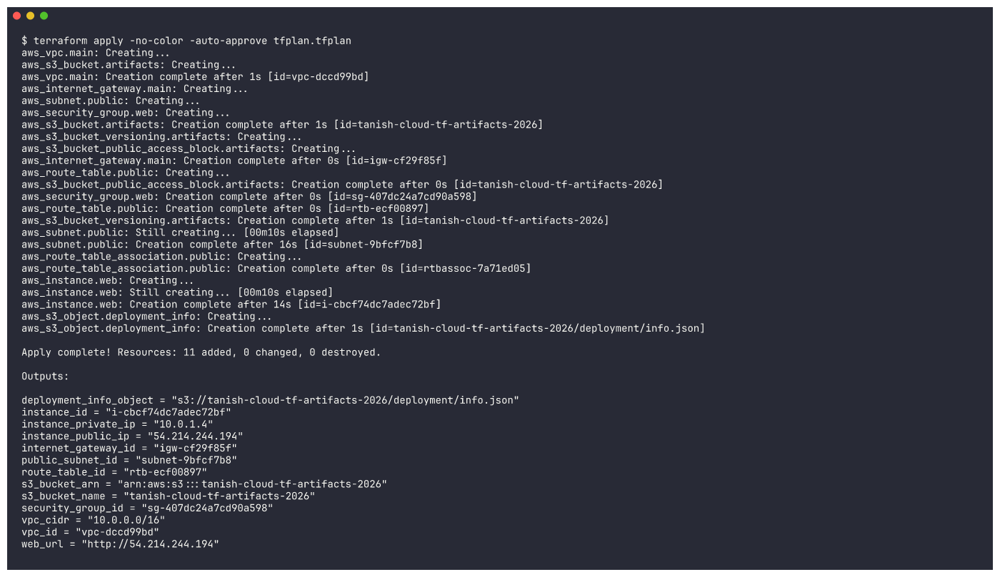

```text
$ terraform apply -no-color -auto-approve tfplan.tfplan
aws_vpc.main: Creating...
aws_s3_bucket.artifacts: Creating...
aws_vpc.main: Creation complete after 1s [id=vpc-dccd99bd]
aws_internet_gateway.main: Creating...
aws_subnet.public: Creating...
aws_security_group.web: Creating...
aws_s3_bucket.artifacts: Creation complete after 1s [id=tanish-cloud-tf-artifacts-2026]
aws_s3_bucket_versioning.artifacts: Creating...
aws_s3_bucket_public_access_block.artifacts: Creating...
aws_internet_gateway.main: Creation complete after 0s [id=igw-cf29f85f]
aws_route_table.public: Creating...
aws_s3_bucket_public_access_block.artifacts: Creation complete after 0s [id=tanish-cloud-tf-artifacts-2026]
aws_security_group.web: Creation complete after 0s [id=sg-407dc24a7cd90a598]
aws_route_table.public: Creation complete after 0s [id=rtb-ecf00897]
aws_s3_bucket_versioning.artifacts: Creation complete after 1s [id=tanish-cloud-tf-artifacts-2026]
aws_subnet.public: Still creating... [00m10s elapsed]
aws_subnet.public: Creation complete after 16s [id=subnet-9bfcf7b8]
aws_route_table_association.public: Creating...
aws_route_table_association.public: Creation complete after 0s [id=rtbassoc-7a71ed05]
aws_instance.web: Creating...
aws_instance.web: Still creating... [00m10s elapsed]
aws_instance.web: Creation complete after 14s [id=i-cbcf74dc7adec72bf]
aws_s3_object.deployment_info: Creating...
aws_s3_object.deployment_info: Creation complete after 1s [id=tanish-cloud-tf-artifacts-2026/deployment/info.json]

Apply complete! Resources: 11 added, 0 changed, 0 destroyed.

Outputs:

deployment_info_object = "s3://tanish-cloud-tf-artifacts-2026/deployment/info.json"
instance_id = "i-cbcf74dc7adec72bf"
instance_private_ip = "10.0.1.4"
instance_public_ip = "54.214.244.194"
internet_gateway_id = "igw-cf29f85f"
public_subnet_id = "subnet-9bfcf7b8"
route_table_id = "rtb-ecf00897"
s3_bucket_arn = "arn:aws:s3:::tanish-cloud-tf-artifacts-2026"
s3_bucket_name = "tanish-cloud-tf-artifacts-2026"
security_group_id = "sg-407dc24a7cd90a598"
vpc_cidr = "10.0.0.0/16"
vpc_id = "vpc-dccd99bd"
web_url = "http://54.214.244.194"
```

### 6. `terraform state list` - everything Terraform now manages

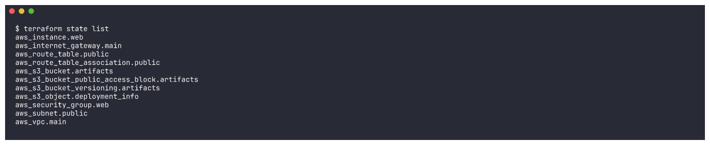

```text
$ terraform state list
aws_instance.web
aws_internet_gateway.main
aws_route_table.public
aws_route_table_association.public
aws_s3_bucket.artifacts
aws_s3_bucket_public_access_block.artifacts
aws_s3_bucket_versioning.artifacts
aws_s3_object.deployment_info
aws_security_group.web
aws_subnet.public
aws_vpc.main
```

### 7. `terraform state show` - details of individual resources

**VPC**

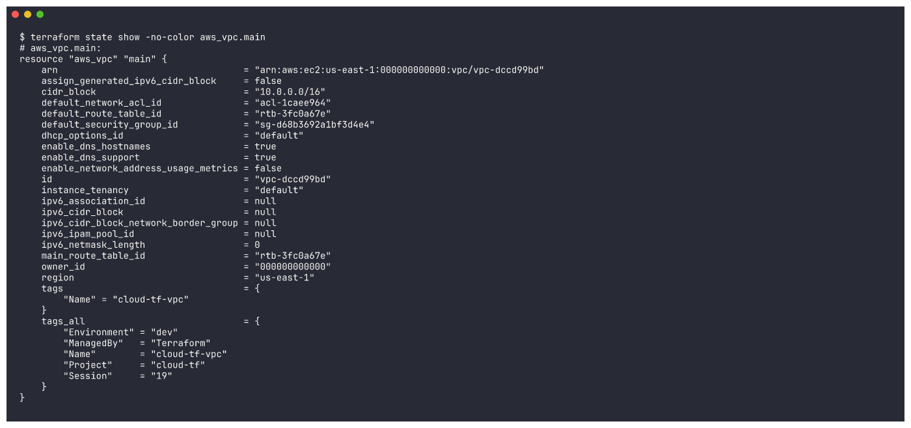

```text
$ terraform state show -no-color aws_vpc.main
# aws_vpc.main:
resource "aws_vpc" "main" {
    arn                                  = "arn:aws:ec2:us-east-1:000000000000:vpc/vpc-dccd99bd"
    assign_generated_ipv6_cidr_block     = false
    cidr_block                           = "10.0.0.0/16"
    default_network_acl_id               = "acl-1caee964"
    default_route_table_id               = "rtb-3fc0a67e"
    default_security_group_id            = "sg-d68b3692a1bf3d4e4"
    dhcp_options_id                      = "default"
    enable_dns_hostnames                 = true
    enable_dns_support                   = true
    enable_network_address_usage_metrics = false
    id                                   = "vpc-dccd99bd"
    instance_tenancy                     = "default"
    ipv6_association_id                  = null
    ipv6_cidr_block                      = null
    ipv6_cidr_block_network_border_group = null
    ipv6_ipam_pool_id                    = null
    ipv6_netmask_length                  = 0
    main_route_table_id                  = "rtb-3fc0a67e"
    owner_id                             = "000000000000"
    region                               = "us-east-1"
    tags                                 = {
        "Name" = "cloud-tf-vpc"
    }
    tags_all                             = {
        "Environment" = "dev"
        "ManagedBy"   = "Terraform"
        "Name"        = "cloud-tf-vpc"
        "Project"     = "cloud-tf"
        "Session"     = "19"
    }
}
```

**Subnet**

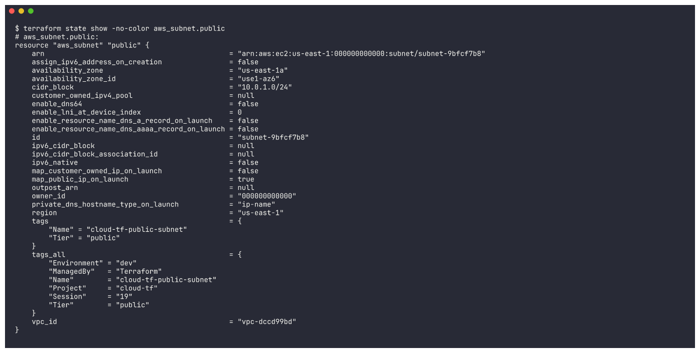

```text
$ terraform state show -no-color aws_subnet.public
# aws_subnet.public:
resource "aws_subnet" "public" {
    arn                                            = "arn:aws:ec2:us-east-1:000000000000:subnet/subnet-9bfcf7b8"
    assign_ipv6_address_on_creation                = false
    availability_zone                              = "us-east-1a"
    availability_zone_id                           = "use1-az6"
    cidr_block                                     = "10.0.1.0/24"
    customer_owned_ipv4_pool                       = null
    enable_dns64                                   = false
    enable_lni_at_device_index                     = 0
    enable_resource_name_dns_a_record_on_launch    = false
    enable_resource_name_dns_aaaa_record_on_launch = false
    id                                             = "subnet-9bfcf7b8"
    ipv6_cidr_block                                = null
    ipv6_cidr_block_association_id                 = null
    ipv6_native                                    = false
    map_customer_owned_ip_on_launch                = false
    map_public_ip_on_launch                        = true
    outpost_arn                                    = null
    owner_id                                       = "000000000000"
    private_dns_hostname_type_on_launch            = "ip-name"
    region                                         = "us-east-1"
    tags                                           = {
        "Name" = "cloud-tf-public-subnet"
        "Tier" = "public"
    }
    tags_all                                       = {
        "Environment" = "dev"
        "ManagedBy"   = "Terraform"
        "Name"        = "cloud-tf-public-subnet"
        "Project"     = "cloud-tf"
        "Session"     = "19"
        "Tier"        = "public"
    }
    vpc_id                                         = "vpc-dccd99bd"
}
```

**EC2 instance**

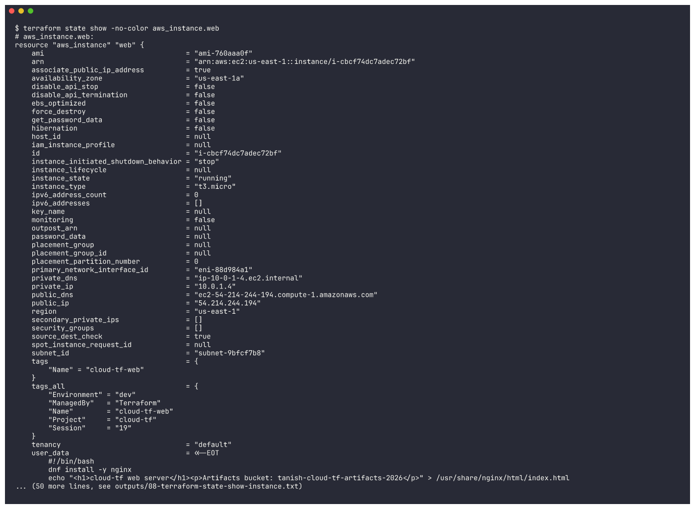

<details>
<summary>Full output (105 lines) - click to expand</summary>

```text
$ terraform state show -no-color aws_instance.web
# aws_instance.web:
resource "aws_instance" "web" {
    ami                                  = "ami-760aaa0f"
    arn                                  = "arn:aws:ec2:us-east-1::instance/i-cbcf74dc7adec72bf"
    associate_public_ip_address          = true
    availability_zone                    = "us-east-1a"
    disable_api_stop                     = false
    disable_api_termination              = false
    ebs_optimized                        = false
    force_destroy                        = false
    get_password_data                    = false
    hibernation                          = false
    host_id                              = null
    iam_instance_profile                 = null
    id                                   = "i-cbcf74dc7adec72bf"
    instance_initiated_shutdown_behavior = "stop"
    instance_lifecycle                   = null
    instance_state                       = "running"
    instance_type                        = "t3.micro"
    ipv6_address_count                   = 0
    ipv6_addresses                       = []
    key_name                             = null
    monitoring                           = false
    outpost_arn                          = null
    password_data                        = null
    placement_group                      = null
    placement_group_id                   = null
    placement_partition_number           = 0
    primary_network_interface_id         = "eni-88d984a1"
    private_dns                          = "ip-10-0-1-4.ec2.internal"
    private_ip                           = "10.0.1.4"
    public_dns                           = "ec2-54-214-244-194.compute-1.amazonaws.com"
    public_ip                            = "54.214.244.194"
    region                               = "us-east-1"
    secondary_private_ips                = []
    security_groups                      = []
    source_dest_check                    = true
    spot_instance_request_id             = null
    subnet_id                            = "subnet-9bfcf7b8"
    tags                                 = {
        "Name" = "cloud-tf-web"
    }
    tags_all                             = {
        "Environment" = "dev"
        "ManagedBy"   = "Terraform"
        "Name"        = "cloud-tf-web"
        "Project"     = "cloud-tf"
        "Session"     = "19"
    }
    tenancy                              = "default"
    user_data                            = <<-EOT
        #!/bin/bash
        dnf install -y nginx
        echo "<h1>cloud-tf web server</h1><p>Artifacts bucket: tanish-cloud-tf-artifacts-2026</p>" > /usr/share/nginx/html/index.html
        systemctl enable --now nginx
    EOT
    user_data_replace_on_change          = false
    vpc_security_group_ids               = [
        "sg-407dc24a7cd90a598",
    ]

    ebs_block_device {
        delete_on_termination = true
        device_name           = "/dev/xvda"
        encrypted             = true
        iops                  = 3000
        kms_key_id            = "arn:aws:kms:us-east-1:000000000000:key/e9360931-a156-454c-b16c-ab703a8da9a0"
        snapshot_id           = null
        tags                  = {
            "Environment" = "dev"
            "ManagedBy"   = "Terraform"
            "Project"     = "cloud-tf"
            "Session"     = "19"
        }
        tags_all              = {
            "Environment" = "dev"
            "ManagedBy"   = "Terraform"
            "Project"     = "cloud-tf"
            "Session"     = "19"
        }
        throughput            = 0
        volume_id             = "vol-bf66d268"
        volume_size           = 8
        volume_type           = "gp3"
    }

    primary_network_interface {
        delete_on_termination = true
        network_interface_id  = "eni-88d984a1"
    }

    root_block_device {
        delete_on_termination = true
        device_name           = null
        encrypted             = true
        iops                  = 0
        kms_key_id            = null
        tags_all              = {}
        throughput            = 0
        volume_id             = null
        volume_size           = 8
        volume_type           = "gp3"
    }
}
```

</details>

**Security group**

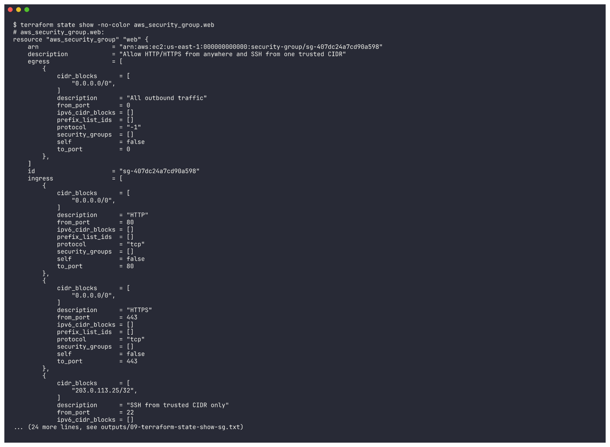

<details>
<summary>Full output (79 lines) - click to expand</summary>

```text
$ terraform state show -no-color aws_security_group.web
# aws_security_group.web:
resource "aws_security_group" "web" {
    arn                    = "arn:aws:ec2:us-east-1:000000000000:security-group/sg-407dc24a7cd90a598"
    description            = "Allow HTTP/HTTPS from anywhere and SSH from one trusted CIDR"
    egress                 = [
        {
            cidr_blocks      = [
                "0.0.0.0/0",
            ]
            description      = "All outbound traffic"
            from_port        = 0
            ipv6_cidr_blocks = []
            prefix_list_ids  = []
            protocol         = "-1"
            security_groups  = []
            self             = false
            to_port          = 0
        },
    ]
    id                     = "sg-407dc24a7cd90a598"
    ingress                = [
        {
            cidr_blocks      = [
                "0.0.0.0/0",
            ]
            description      = "HTTP"
            from_port        = 80
            ipv6_cidr_blocks = []
            prefix_list_ids  = []
            protocol         = "tcp"
            security_groups  = []
            self             = false
            to_port          = 80
        },
        {
            cidr_blocks      = [
                "0.0.0.0/0",
            ]
            description      = "HTTPS"
            from_port        = 443
            ipv6_cidr_blocks = []
            prefix_list_ids  = []
            protocol         = "tcp"
            security_groups  = []
            self             = false
            to_port          = 443
        },
        {
            cidr_blocks      = [
                "203.0.113.25/32",
            ]
            description      = "SSH from trusted CIDR only"
            from_port        = 22
            ipv6_cidr_blocks = []
            prefix_list_ids  = []
            protocol         = "tcp"
            security_groups  = []
            self             = false
            to_port          = 22
        },
    ]
    name                   = "cloud-tf-web-sg"
    name_prefix            = null
    owner_id               = "000000000000"
    region                 = "us-east-1"
    revoke_rules_on_delete = false
    tags                   = {
        "Name" = "cloud-tf-web-sg"
    }
    tags_all               = {
        "Environment" = "dev"
        "ManagedBy"   = "Terraform"
        "Name"        = "cloud-tf-web-sg"
        "Project"     = "cloud-tf"
        "Session"     = "19"
    }
    vpc_id                 = "vpc-dccd99bd"
}
```

</details>

### 8. `terraform output`

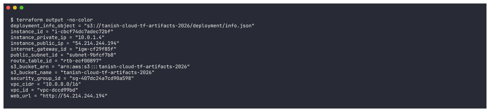

```text
$ terraform output -no-color
deployment_info_object = "s3://tanish-cloud-tf-artifacts-2026/deployment/info.json"
instance_id = "i-cbcf74dc7adec72bf"
instance_private_ip = "10.0.1.4"
instance_public_ip = "54.214.244.194"
internet_gateway_id = "igw-cf29f85f"
public_subnet_id = "subnet-9bfcf7b8"
route_table_id = "rtb-ecf00897"
s3_bucket_arn = "arn:aws:s3:::tanish-cloud-tf-artifacts-2026"
s3_bucket_name = "tanish-cloud-tf-artifacts-2026"
security_group_id = "sg-407dc24a7cd90a598"
vpc_cidr = "10.0.0.0/16"
vpc_id = "vpc-dccd99bd"
web_url = "http://54.214.244.194"
```

### 9. Verify with the AWS CLI - network

I checked the resources independently of Terraform, filtering by the `Project=cloud-tf` default tag:

```bash
export AWS_ENDPOINT_URL=http://localhost:4566   # LocalStack; omit for real AWS
F="Name=tag:Project,Values=cloud-tf"
aws ec2 describe-vpcs              --filters $F
aws ec2 describe-subnets           --filters $F
aws ec2 describe-internet-gateways --filters $F
aws ec2 describe-route-tables      --filters $F
```

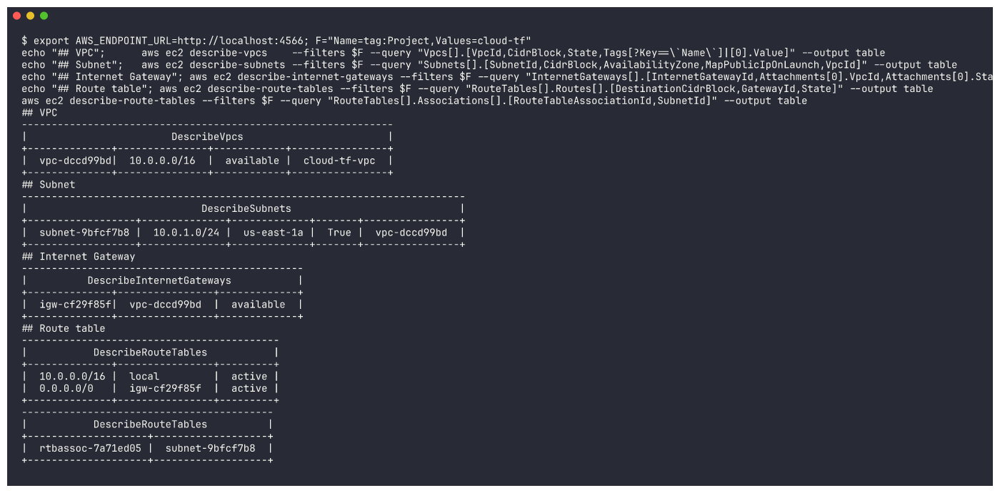

```text
$ export AWS_ENDPOINT_URL=http://localhost:4566; F="Name=tag:Project,Values=cloud-tf"
echo "## VPC";      aws ec2 describe-vpcs    --filters $F --query "Vpcs[].[VpcId,CidrBlock,State,Tags[?Key==\`Name\`]|[0].Value]" --output table
echo "## Subnet";   aws ec2 describe-subnets --filters $F --query "Subnets[].[SubnetId,CidrBlock,AvailabilityZone,MapPublicIpOnLaunch,VpcId]" --output table
echo "## Internet Gateway"; aws ec2 describe-internet-gateways --filters $F --query "InternetGateways[].[InternetGatewayId,Attachments[0].VpcId,Attachments[0].State]" --output table
echo "## Route table"; aws ec2 describe-route-tables --filters $F --query "RouteTables[].Routes[].[DestinationCidrBlock,GatewayId,State]" --output table
aws ec2 describe-route-tables --filters $F --query "RouteTables[].Associations[].[RouteTableAssociationId,SubnetId]" --output table
## VPC
--------------------------------------------------------------
|                        DescribeVpcs                        |
+--------------+---------------+------------+----------------+
|  vpc-dccd99bd|  10.0.0.0/16  |  available |  cloud-tf-vpc  |
+--------------+---------------+------------+----------------+
## Subnet
--------------------------------------------------------------------------
|                             DescribeSubnets                            |
+------------------+--------------+-------------+-------+----------------+
|  subnet-9bfcf7b8 |  10.0.1.0/24 |  us-east-1a |  True |  vpc-dccd99bd  |
+------------------+--------------+-------------+-------+----------------+
## Internet Gateway
-----------------------------------------------
|          DescribeInternetGateways           |
+--------------+----------------+-------------+
|  igw-cf29f85f|  vpc-dccd99bd  |  available  |
+--------------+----------------+-------------+
## Route table
-------------------------------------------
|           DescribeRouteTables           |
+--------------+----------------+---------+
|  10.0.0.0/16 |  local         |  active |
|  0.0.0.0/0   |  igw-cf29f85f  |  active |
+--------------+----------------+---------+
------------------------------------------
|           DescribeRouteTables          |
+--------------------+-------------------+
|  rtbassoc-7a71ed05 |  subnet-9bfcf7b8  |
+--------------------+-------------------+
```

The route table has the automatic `local` route for `10.0.0.0/16` and the `0.0.0.0/0 -> igw-...` route, and it is associated with the subnet.

### 10. Verify with the AWS CLI - security group and EC2

```bash
aws ec2 describe-security-groups --filters $F
aws ec2 describe-instances       --filters $F
```

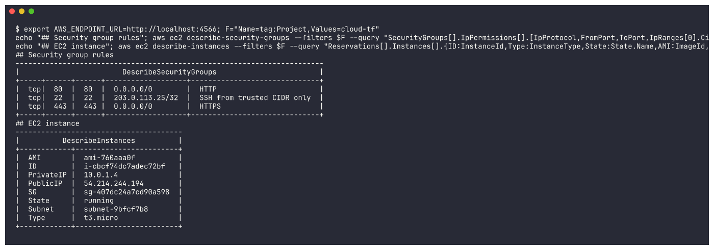

```text
$ export AWS_ENDPOINT_URL=http://localhost:4566; F="Name=tag:Project,Values=cloud-tf"
echo "## Security group rules"; aws ec2 describe-security-groups --filters $F --query "SecurityGroups[].IpPermissions[].[IpProtocol,FromPort,ToPort,IpRanges[0].CidrIp,IpRanges[0].Description]" --output table
echo "## EC2 instance"; aws ec2 describe-instances --filters $F --query "Reservations[].Instances[].{ID:InstanceId,Type:InstanceType,State:State.Name,AMI:ImageId,Subnet:SubnetId,PrivateIP:PrivateIpAddress,PublicIP:PublicIpAddress,SG:SecurityGroups[0].GroupId}" --output table
## Security group rules
------------------------------------------------------------------------
|                        DescribeSecurityGroups                        |
+-----+------+------+-------------------+------------------------------+
|  tcp|  80  |  80  |  0.0.0.0/0        |  HTTP                        |
|  tcp|  22  |  22  |  203.0.113.25/32  |  SSH from trusted CIDR only  |
|  tcp|  443 |  443 |  0.0.0.0/0        |  HTTPS                       |
+-----+------+------+-------------------+------------------------------+
## EC2 instance
---------------------------------------
|          DescribeInstances          |
+------------+------------------------+
|  AMI       |  ami-760aaa0f          |
|  ID        |  i-cbcf74dc7adec72bf   |
|  PrivateIP |  10.0.1.4              |
|  PublicIP  |  54.214.244.194        |
|  SG        |  sg-407dc24a7cd90a598  |
|  State     |  running               |
|  Subnet    |  subnet-9bfcf7b8       |
|  Type      |  t3.micro              |
+------------+------------------------+
```

### 11. Verify with the AWS CLI - S3

```bash
aws s3 ls
aws s3 ls s3://$(terraform output -raw s3_bucket_name) --recursive
aws s3 cp s3://$(terraform output -raw s3_bucket_name)/deployment/info.json -
```

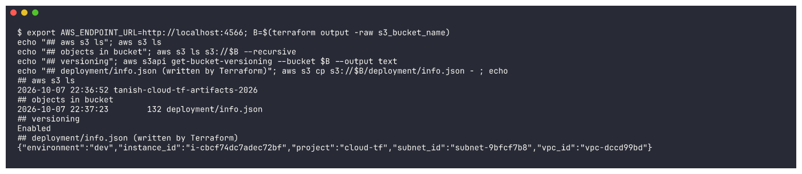

```text
$ export AWS_ENDPOINT_URL=http://localhost:4566; B=$(terraform output -raw s3_bucket_name)
echo "## aws s3 ls"; aws s3 ls
echo "## objects in bucket"; aws s3 ls s3://$B --recursive
echo "## versioning"; aws s3api get-bucket-versioning --bucket $B --output text
echo "## deployment/info.json (written by Terraform)"; aws s3 cp s3://$B/deployment/info.json - ; echo
## aws s3 ls
2026-10-07 22:36:52 tanish-cloud-tf-artifacts-2026
## objects in bucket
2026-10-07 22:37:23        132 deployment/info.json
## versioning
Enabled
## deployment/info.json (written by Terraform)
{"environment":"dev","instance_id":"i-cbcf74dc7adec72bf","project":"cloud-tf","subnet_id":"subnet-9bfcf7b8","vpc_id":"vpc-dccd99bd"}
```

The object Terraform wrote contains the real VPC, subnet and instance IDs. This is the implicit dependency doing its job.

### 12. The state file itself

```bash
jq '{version, terraform_version, serial, lineage, resource_count: (.resources|length), resources: [...]}' terraform.tfstate
```

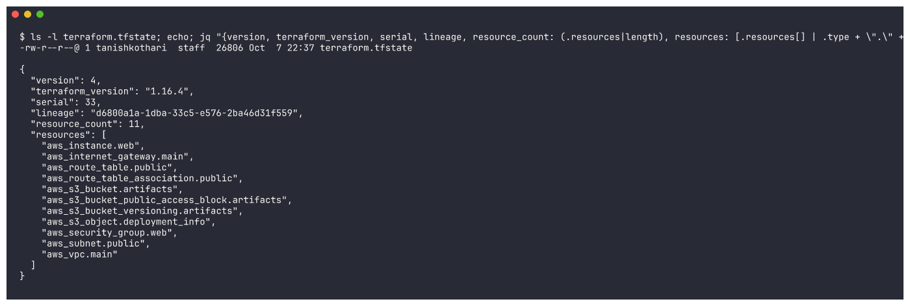

```text
$ ls -l terraform.tfstate; echo; jq "{version, terraform_version, serial, lineage, resource_count: (.resources|length), resources: [.resources[] | .type + \".\" + .name]}" terraform.tfstate
-rw-r--r--@ 1 tanishkothari  staff  26806 Oct  7 22:37 terraform.tfstate

{
  "version": 4,
  "terraform_version": "1.16.4",
  "serial": 33,
  "lineage": "d6800a1a-1dba-33c5-e576-2ba46d31f559",
  "resource_count": 11,
  "resources": [
    "aws_instance.web",
    "aws_internet_gateway.main",
    "aws_route_table.public",
    "aws_route_table_association.public",
    "aws_s3_bucket.artifacts",
    "aws_s3_bucket_public_access_block.artifacts",
    "aws_s3_bucket_versioning.artifacts",
    "aws_s3_object.deployment_info",
    "aws_security_group.web",
    "aws_subnet.public",
    "aws_vpc.main"
  ]
}
```

`serial` goes up every time the state is written. `lineage` identifies this particular state across its history.

### 13. `terraform plan` after apply - checking for drift

Right after `apply`, a new `plan` should normally say **"No changes"**. Here it reports one in-place update:

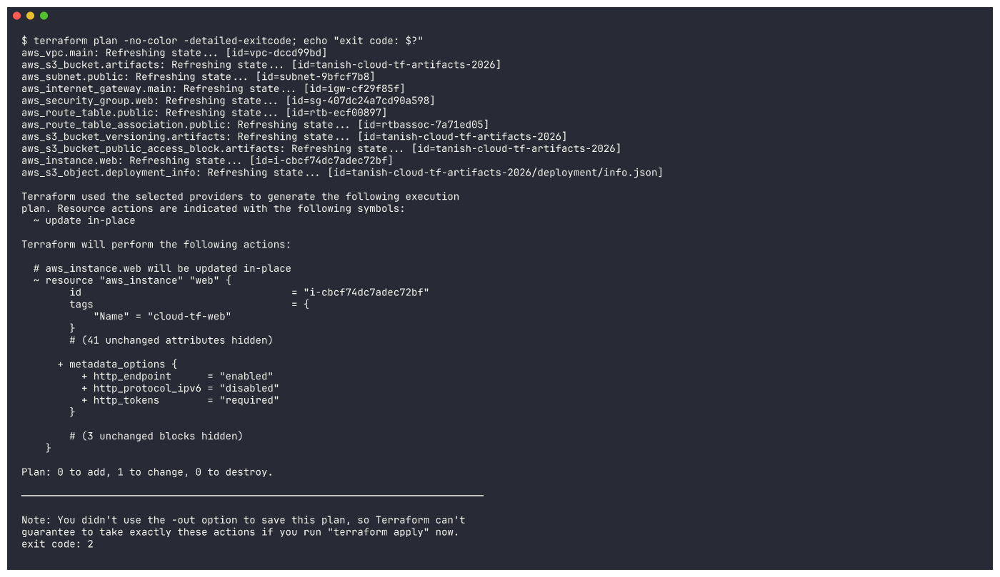

```text
$ terraform plan -no-color -detailed-exitcode; echo "exit code: $?"
aws_vpc.main: Refreshing state... [id=vpc-dccd99bd]
aws_s3_bucket.artifacts: Refreshing state... [id=tanish-cloud-tf-artifacts-2026]
aws_subnet.public: Refreshing state... [id=subnet-9bfcf7b8]
aws_internet_gateway.main: Refreshing state... [id=igw-cf29f85f]
aws_security_group.web: Refreshing state... [id=sg-407dc24a7cd90a598]
aws_route_table.public: Refreshing state... [id=rtb-ecf00897]
aws_route_table_association.public: Refreshing state... [id=rtbassoc-7a71ed05]
aws_s3_bucket_versioning.artifacts: Refreshing state... [id=tanish-cloud-tf-artifacts-2026]
aws_s3_bucket_public_access_block.artifacts: Refreshing state... [id=tanish-cloud-tf-artifacts-2026]
aws_instance.web: Refreshing state... [id=i-cbcf74dc7adec72bf]
aws_s3_object.deployment_info: Refreshing state... [id=tanish-cloud-tf-artifacts-2026/deployment/info.json]

Terraform used the selected providers to generate the following execution
plan. Resource actions are indicated with the following symbols:
  ~ update in-place

Terraform will perform the following actions:

  # aws_instance.web will be updated in-place
  ~ resource "aws_instance" "web" {
        id                                   = "i-cbcf74dc7adec72bf"
        tags                                 = {
            "Name" = "cloud-tf-web"
        }
        # (41 unchanged attributes hidden)

      + metadata_options {
          + http_endpoint      = "enabled"
          + http_protocol_ipv6 = "disabled"
          + http_tokens        = "required"
        }

        # (3 unchanged blocks hidden)
    }

Plan: 0 to add, 1 to change, 0 to destroy.

─────────────────────────────────────────────────────────────────────────────

Note: You didn't use the -out option to save this plan, so Terraform can't
guarantee to take exactly these actions if you run "terraform apply" now.
exit code: 2
```

This is a **LocalStack limitation**, not a problem in the code. LocalStack's `DescribeInstances` does not return the
instance's `MetadataOptions` (IMDSv2 settings). On every refresh Terraform therefore sees the `metadata_options` block as
missing and wants to add it back:

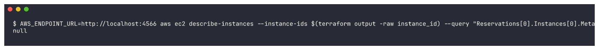

```text
$ AWS_ENDPOINT_URL=http://localhost:4566 aws ec2 describe-instances --instance-ids $(terraform output -raw instance_id) --query "Reservations[0].Instances[0].MetadataOptions"
null
```

On real AWS the API returns the instance's `MetadataOptions` (`HttpTokens: required`), so the plan is expected to show no changes. This step is still a good example of
how `plan` detects **drift**, meaning a difference between the state/config and what the cloud API reports.

### 14. `terraform graph` - the dependency graph

```bash
terraform graph > architecture/terraform-graph.dot
```

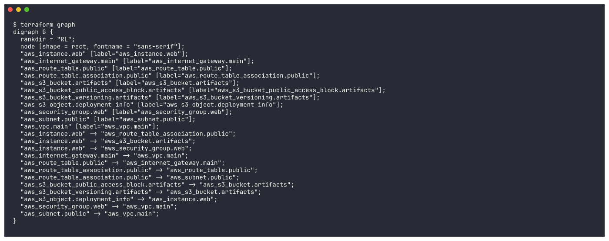

```text
$ terraform graph
digraph G {
  rankdir = "RL";
  node [shape = rect, fontname = "sans-serif"];
  "aws_instance.web" [label="aws_instance.web"];
  "aws_internet_gateway.main" [label="aws_internet_gateway.main"];
  "aws_route_table.public" [label="aws_route_table.public"];
  "aws_route_table_association.public" [label="aws_route_table_association.public"];
  "aws_s3_bucket.artifacts" [label="aws_s3_bucket.artifacts"];
  "aws_s3_bucket_public_access_block.artifacts" [label="aws_s3_bucket_public_access_block.artifacts"];
  "aws_s3_bucket_versioning.artifacts" [label="aws_s3_bucket_versioning.artifacts"];
  "aws_s3_object.deployment_info" [label="aws_s3_object.deployment_info"];
  "aws_security_group.web" [label="aws_security_group.web"];
  "aws_subnet.public" [label="aws_subnet.public"];
  "aws_vpc.main" [label="aws_vpc.main"];
  "aws_instance.web" -> "aws_route_table_association.public";
  "aws_instance.web" -> "aws_s3_bucket.artifacts";
  "aws_instance.web" -> "aws_security_group.web";
  "aws_internet_gateway.main" -> "aws_vpc.main";
  "aws_route_table.public" -> "aws_internet_gateway.main";
  "aws_route_table_association.public" -> "aws_route_table.public";
  "aws_route_table_association.public" -> "aws_subnet.public";
  "aws_s3_bucket_public_access_block.artifacts" -> "aws_s3_bucket.artifacts";
  "aws_s3_bucket_versioning.artifacts" -> "aws_s3_bucket.artifacts";
  "aws_s3_object.deployment_info" -> "aws_instance.web";
  "aws_security_group.web" -> "aws_vpc.main";
  "aws_subnet.public" -> "aws_vpc.main";
}
```

(Rendered version: [`architecture/terraform-graph.png`](architecture/terraform-graph.png), shown in [Dependencies](#5-dependencies).)

### 15. `terraform destroy` - tear everything down

```bash
terraform destroy -auto-approve
```

Destroy runs in reverse dependency order. The S3 object, versioning and public access block go first, then the instance, then the
route table association, security group and bucket, then the subnet and route table, then the IGW, and the **VPC goes last**.

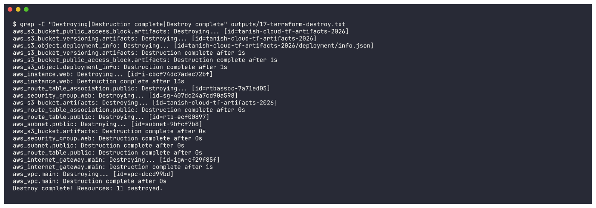

```text
$ grep -E "Destroying|Destruction complete|Destroy complete" outputs/17-terraform-destroy.txt
aws_s3_bucket_public_access_block.artifacts: Destroying... [id=tanish-cloud-tf-artifacts-2026]
aws_s3_bucket_versioning.artifacts: Destroying... [id=tanish-cloud-tf-artifacts-2026]
aws_s3_object.deployment_info: Destroying... [id=tanish-cloud-tf-artifacts-2026/deployment/info.json]
aws_s3_bucket_versioning.artifacts: Destruction complete after 1s
aws_s3_bucket_public_access_block.artifacts: Destruction complete after 1s
aws_s3_object.deployment_info: Destruction complete after 1s
aws_instance.web: Destroying... [id=i-cbcf74dc7adec72bf]
aws_instance.web: Destruction complete after 13s
aws_route_table_association.public: Destroying... [id=rtbassoc-7a71ed05]
aws_security_group.web: Destroying... [id=sg-407dc24a7cd90a598]
aws_s3_bucket.artifacts: Destroying... [id=tanish-cloud-tf-artifacts-2026]
aws_route_table_association.public: Destruction complete after 0s
aws_route_table.public: Destroying... [id=rtb-ecf00897]
aws_subnet.public: Destroying... [id=subnet-9bfcf7b8]
aws_s3_bucket.artifacts: Destruction complete after 0s
aws_security_group.web: Destruction complete after 0s
aws_subnet.public: Destruction complete after 0s
aws_route_table.public: Destruction complete after 0s
aws_internet_gateway.main: Destroying... [id=igw-cf29f85f]
aws_internet_gateway.main: Destruction complete after 1s
aws_vpc.main: Destroying... [id=vpc-dccd99bd]
aws_vpc.main: Destruction complete after 0s
Destroy complete! Resources: 11 destroyed.
```

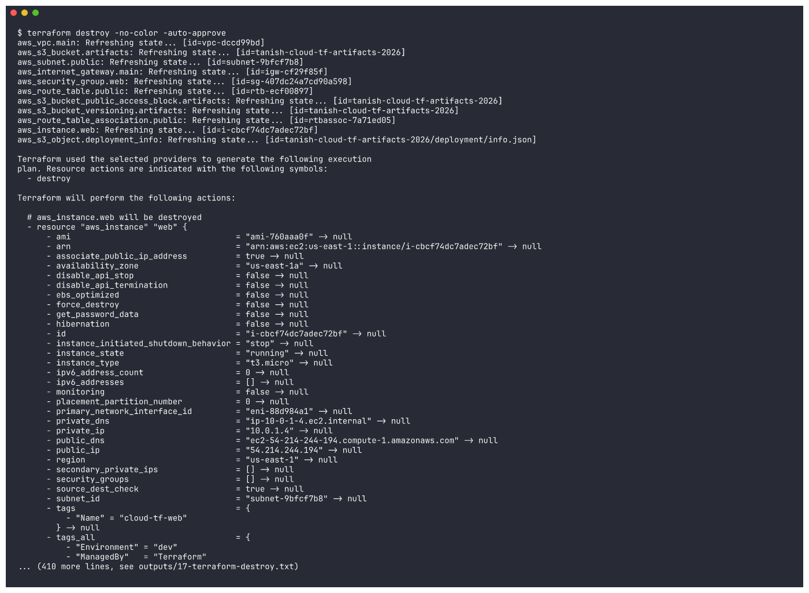

<details>
<summary>Full output (465 lines) - click to expand</summary>

```text
$ terraform destroy -no-color -auto-approve
aws_vpc.main: Refreshing state... [id=vpc-dccd99bd]
aws_s3_bucket.artifacts: Refreshing state... [id=tanish-cloud-tf-artifacts-2026]
aws_subnet.public: Refreshing state... [id=subnet-9bfcf7b8]
aws_internet_gateway.main: Refreshing state... [id=igw-cf29f85f]
aws_security_group.web: Refreshing state... [id=sg-407dc24a7cd90a598]
aws_route_table.public: Refreshing state... [id=rtb-ecf00897]
aws_s3_bucket_public_access_block.artifacts: Refreshing state... [id=tanish-cloud-tf-artifacts-2026]
aws_s3_bucket_versioning.artifacts: Refreshing state... [id=tanish-cloud-tf-artifacts-2026]
aws_route_table_association.public: Refreshing state... [id=rtbassoc-7a71ed05]
aws_instance.web: Refreshing state... [id=i-cbcf74dc7adec72bf]
aws_s3_object.deployment_info: Refreshing state... [id=tanish-cloud-tf-artifacts-2026/deployment/info.json]

Terraform used the selected providers to generate the following execution
plan. Resource actions are indicated with the following symbols:
  - destroy

Terraform will perform the following actions:

  # aws_instance.web will be destroyed
  - resource "aws_instance" "web" {
      - ami                                  = "ami-760aaa0f" -> null
      - arn                                  = "arn:aws:ec2:us-east-1::instance/i-cbcf74dc7adec72bf" -> null
      - associate_public_ip_address          = true -> null
      - availability_zone                    = "us-east-1a" -> null
      - disable_api_stop                     = false -> null
      - disable_api_termination              = false -> null
      - ebs_optimized                        = false -> null
      - force_destroy                        = false -> null
      - get_password_data                    = false -> null
      - hibernation                          = false -> null
      - id                                   = "i-cbcf74dc7adec72bf" -> null
      - instance_initiated_shutdown_behavior = "stop" -> null
      - instance_state                       = "running" -> null
      - instance_type                        = "t3.micro" -> null
      - ipv6_address_count                   = 0 -> null
      - ipv6_addresses                       = [] -> null
      - monitoring                           = false -> null
      - placement_partition_number           = 0 -> null
      - primary_network_interface_id         = "eni-88d984a1" -> null
      - private_dns                          = "ip-10-0-1-4.ec2.internal" -> null
      - private_ip                           = "10.0.1.4" -> null
      - public_dns                           = "ec2-54-214-244-194.compute-1.amazonaws.com" -> null
      - public_ip                            = "54.214.244.194" -> null
      - region                               = "us-east-1" -> null
      - secondary_private_ips                = [] -> null
      - security_groups                      = [] -> null
      - source_dest_check                    = true -> null
      - subnet_id                            = "subnet-9bfcf7b8" -> null
      - tags                                 = {
          - "Name" = "cloud-tf-web"
        } -> null
      - tags_all                             = {
          - "Environment" = "dev"
          - "ManagedBy"   = "Terraform"
          - "Name"        = "cloud-tf-web"
          - "Project"     = "cloud-tf"
          - "Session"     = "19"
        } -> null
      - tenancy                              = "default" -> null
      - user_data                            = <<-EOT
            #!/bin/bash
            dnf install -y nginx
            echo "<h1>cloud-tf web server</h1><p>Artifacts bucket: tanish-cloud-tf-artifacts-2026</p>" > /usr/share/nginx/html/index.html
            systemctl enable --now nginx
        EOT -> null
      - user_data_replace_on_change          = false -> null
      - vpc_security_group_ids               = [
          - "sg-407dc24a7cd90a598",
        ] -> null
        # (9 unchanged attributes hidden)

      - ebs_block_device {
          - delete_on_termination = true -> null
          - device_name           = "/dev/xvda" -> null
          - encrypted             = true -> null
          - iops                  = 3000 -> null
          - kms_key_id            = "arn:aws:kms:us-east-1:000000000000:key/e9360931-a156-454c-b16c-ab703a8da9a0" -> null
          - tags                  = {
              - "Environment" = "dev"
              - "ManagedBy"   = "Terraform"
              - "Project"     = "cloud-tf"
              - "Session"     = "19"
            } -> null
          - tags_all              = {
              - "Environment" = "dev"
              - "ManagedBy"   = "Terraform"
              - "Project"     = "cloud-tf"
              - "Session"     = "19"
            } -> null
          - throughput            = 0 -> null
          - volume_id             = "vol-bf66d268" -> null
          - volume_size           = 8 -> null
          - volume_type           = "gp3" -> null
            # (1 unchanged attribute hidden)
        }

      - primary_network_interface {
          - delete_on_termination = true -> null
          - network_interface_id  = "eni-88d984a1" -> null
        }

      - root_block_device {
          - delete_on_termination = true -> null
          - encrypted             = true -> null
          - iops                  = 0 -> null
          - tags                  = {} -> null
          - tags_all              = {} -> null
          - throughput            = 0 -> null
          - volume_size           = 8 -> null
          - volume_type           = "gp3" -> null
            # (3 unchanged attributes hidden)
        }
    }

  # aws_internet_gateway.main will be destroyed
  - resource "aws_internet_gateway" "main" {
      - arn      = "arn:aws:ec2:us-east-1:000000000000:internet-gateway/igw-cf29f85f" -> null
      - id       = "igw-cf29f85f" -> null
      - owner_id = "000000000000" -> null
      - region   = "us-east-1" -> null
      - tags     = {
          - "Name" = "cloud-tf-igw"
        } -> null
      - tags_all = {
          - "Environment" = "dev"
          - "ManagedBy"   = "Terraform"
          - "Name"        = "cloud-tf-igw"
          - "Project"     = "cloud-tf"
          - "Session"     = "19"
        } -> null
      - vpc_id   = "vpc-dccd99bd" -> null
    }

  # aws_route_table.public will be destroyed
  - resource "aws_route_table" "public" {
      - arn              = "arn:aws:ec2:us-east-1:000000000000:route-table/rtb-ecf00897" -> null
      - id               = "rtb-ecf00897" -> null
      - owner_id         = "000000000000" -> null
      - propagating_vgws = [] -> null
      - region           = "us-east-1" -> null
      - route            = [
          - {
              - cidr_block                 = "0.0.0.0/0"
              - gateway_id                 = "igw-cf29f85f"
                # (12 unchanged attributes hidden)
            },
        ] -> null
      - tags             = {
          - "Name" = "cloud-tf-public-rt"
        } -> null
      - tags_all         = {
          - "Environment" = "dev"
          - "ManagedBy"   = "Terraform"
          - "Name"        = "cloud-tf-public-rt"
          - "Project"     = "cloud-tf"
          - "Session"     = "19"
        } -> null
      - vpc_id           = "vpc-dccd99bd" -> null
    }

  # aws_route_table_association.public will be destroyed
  - resource "aws_route_table_association" "public" {
      - id             = "rtbassoc-7a71ed05" -> null
      - region         = "us-east-1" -> null
      - route_table_id = "rtb-ecf00897" -> null
      - subnet_id      = "subnet-9bfcf7b8" -> null
        # (1 unchanged attribute hidden)
    }

  # aws_s3_bucket.artifacts will be destroyed
  - resource "aws_s3_bucket" "artifacts" {
      - arn                         = "arn:aws:s3:::tanish-cloud-tf-artifacts-2026" -> null
      - bucket                      = "tanish-cloud-tf-artifacts-2026" -> null
      - bucket_domain_name          = "tanish-cloud-tf-artifacts-2026.s3.amazonaws.com" -> null
      - bucket_namespace            = "global" -> null
      - bucket_region               = "us-east-1" -> null
      - bucket_regional_domain_name = "tanish-cloud-tf-artifacts-2026.s3.us-east-1.amazonaws.com" -> null
      - force_destroy               = true -> null
      - hosted_zone_id              = "Z3AQBSTGFYJSTF" -> null
      - id                          = "tanish-cloud-tf-artifacts-2026" -> null
      - object_lock_enabled         = false -> null
      - region                      = "us-east-1" -> null
      - request_payer               = "BucketOwner" -> null
      - tags                        = {
          - "Name" = "tanish-cloud-tf-artifacts-2026"
        } -> null
      - tags_all                    = {
          - "Environment" = "dev"
          - "ManagedBy"   = "Terraform"
          - "Name"        = "tanish-cloud-tf-artifacts-2026"
          - "Project"     = "cloud-tf"
          - "Session"     = "19"
        } -> null
        # (3 unchanged attributes hidden)

      - grant {
          - id          = "75aa57f09aa0c8caeab4f8c24e99d10f8e7faeebf76c078efc7c6caea54ba06a" -> null
          - permissions = [
              - "FULL_CONTROL",
            ] -> null
          - type        = "CanonicalUser" -> null
            # (1 unchanged attribute hidden)
        }

      - server_side_encryption_configuration {
          - rule {
              - bucket_key_enabled = false -> null

              - apply_server_side_encryption_by_default {
                  - sse_algorithm     = "AES256" -> null
                    # (1 unchanged attribute hidden)
                }
            }
        }

      - versioning {
          - enabled    = true -> null
          - mfa_delete = false -> null
        }
    }

  # aws_s3_bucket_public_access_block.artifacts will be destroyed
  - resource "aws_s3_bucket_public_access_block" "artifacts" {
      - block_public_acls       = true -> null
      - block_public_policy     = true -> null
      - bucket                  = "tanish-cloud-tf-artifacts-2026" -> null
      - id                      = "tanish-cloud-tf-artifacts-2026" -> null
      - ignore_public_acls      = true -> null
      - region                  = "us-east-1" -> null
      - restrict_public_buckets = true -> null
    }

  # aws_s3_bucket_versioning.artifacts will be destroyed
  - resource "aws_s3_bucket_versioning" "artifacts" {
      - bucket                = "tanish-cloud-tf-artifacts-2026" -> null
      - id                    = "tanish-cloud-tf-artifacts-2026" -> null
      - region                = "us-east-1" -> null
        # (1 unchanged attribute hidden)

      - versioning_configuration {
          - mfa_delete = "Disabled" -> null
          - status     = "Enabled" -> null
        }
    }

  # aws_s3_object.deployment_info will be destroyed
  - resource "aws_s3_object" "deployment_info" {
      - arn                           = "arn:aws:s3:::tanish-cloud-tf-artifacts-2026/deployment/info.json" -> null
      - bucket                        = "tanish-cloud-tf-artifacts-2026" -> null
      - bucket_key_enabled            = false -> null
      - content                       = jsonencode(
            {
              - environment = "dev"
              - instance_id = "i-cbcf74dc7adec72bf"
              - project     = "cloud-tf"
              - subnet_id   = "subnet-9bfcf7b8"
              - vpc_id      = "vpc-dccd99bd"
            }
        ) -> null
      - content_type                  = "application/json" -> null
      - etag                          = "298ca852abb746e14cfb9b549dacf542" -> null
      - force_destroy                 = false -> null
      - id                            = "tanish-cloud-tf-artifacts-2026/deployment/info.json" -> null
      - key                           = "deployment/info.json" -> null
      - metadata                      = {} -> null
      - region                        = "us-east-1" -> null
      - server_side_encryption        = "AES256" -> null
      - storage_class                 = "STANDARD" -> null
      - tags                          = {} -> null
      - tags_all                      = {
          - "Environment" = "dev"
          - "ManagedBy"   = "Terraform"
          - "Project"     = "cloud-tf"
          - "Session"     = "19"
        } -> null
      - version_id                    = "jR0zQ3ukSGFoFcVzCH0WpVuuUayfLSKT" -> null
        # (13 unchanged attributes hidden)
    }

  # aws_security_group.web will be destroyed
  - resource "aws_security_group" "web" {
      - arn                    = "arn:aws:ec2:us-east-1:000000000000:security-group/sg-407dc24a7cd90a598" -> null
      - description            = "Allow HTTP/HTTPS from anywhere and SSH from one trusted CIDR" -> null
      - egress                 = [
          - {
              - cidr_blocks      = [
                  - "0.0.0.0/0",
                ]
              - description      = "All outbound traffic"
              - from_port        = 0
              - ipv6_cidr_blocks = []
              - prefix_list_ids  = []
              - protocol         = "-1"
              - security_groups  = []
              - self             = false
              - to_port          = 0
            },
        ] -> null
      - id                     = "sg-407dc24a7cd90a598" -> null
      - ingress                = [
          - {
              - cidr_blocks      = [
                  - "0.0.0.0/0",
                ]
              - description      = "HTTP"
              - from_port        = 80
              - ipv6_cidr_blocks = []
              - prefix_list_ids  = []
              - protocol         = "tcp"
              - security_groups  = []
              - self             = false
              - to_port          = 80
            },
          - {
              - cidr_blocks      = [
                  - "0.0.0.0/0",
                ]
              - description      = "HTTPS"
              - from_port        = 443
              - ipv6_cidr_blocks = []
              - prefix_list_ids  = []
              - protocol         = "tcp"
              - security_groups  = []
              - self             = false
              - to_port          = 443
            },
          - {
              - cidr_blocks      = [
                  - "203.0.113.25/32",
                ]
              - description      = "SSH from trusted CIDR only"
              - from_port        = 22
              - ipv6_cidr_blocks = []
              - prefix_list_ids  = []
              - protocol         = "tcp"
              - security_groups  = []
              - self             = false
              - to_port          = 22
            },
        ] -> null
      - name                   = "cloud-tf-web-sg" -> null
      - owner_id               = "000000000000" -> null
      - region                 = "us-east-1" -> null
      - revoke_rules_on_delete = false -> null
      - tags                   = {
          - "Name" = "cloud-tf-web-sg"
        } -> null
      - tags_all               = {
          - "Environment" = "dev"
          - "ManagedBy"   = "Terraform"
          - "Name"        = "cloud-tf-web-sg"
          - "Project"     = "cloud-tf"
          - "Session"     = "19"
        } -> null
      - vpc_id                 = "vpc-dccd99bd" -> null
        # (1 unchanged attribute hidden)
    }

  # aws_subnet.public will be destroyed
  - resource "aws_subnet" "public" {
      - arn                                            = "arn:aws:ec2:us-east-1:000000000000:subnet/subnet-9bfcf7b8" -> null
      - assign_ipv6_address_on_creation                = false -> null
      - availability_zone                              = "us-east-1a" -> null
      - availability_zone_id                           = "use1-az6" -> null
      - cidr_block                                     = "10.0.1.0/24" -> null
      - enable_dns64                                   = false -> null
      - enable_lni_at_device_index                     = 0 -> null
      - enable_resource_name_dns_a_record_on_launch    = false -> null
      - enable_resource_name_dns_aaaa_record_on_launch = false -> null
      - id                                             = "subnet-9bfcf7b8" -> null
      - ipv6_native                                    = false -> null
      - map_customer_owned_ip_on_launch                = false -> null
      - map_public_ip_on_launch                        = true -> null
      - owner_id                                       = "000000000000" -> null
      - private_dns_hostname_type_on_launch            = "ip-name" -> null
      - region                                         = "us-east-1" -> null
      - tags                                           = {
          - "Name" = "cloud-tf-public-subnet"
          - "Tier" = "public"
        } -> null
      - tags_all                                       = {
          - "Environment" = "dev"
          - "ManagedBy"   = "Terraform"
          - "Name"        = "cloud-tf-public-subnet"
          - "Project"     = "cloud-tf"
          - "Session"     = "19"
          - "Tier"        = "public"
        } -> null
      - vpc_id                                         = "vpc-dccd99bd" -> null
        # (4 unchanged attributes hidden)
    }

  # aws_vpc.main will be destroyed
  - resource "aws_vpc" "main" {
      - arn                                  = "arn:aws:ec2:us-east-1:000000000000:vpc/vpc-dccd99bd" -> null
      - assign_generated_ipv6_cidr_block     = false -> null
      - cidr_block                           = "10.0.0.0/16" -> null
      - default_network_acl_id               = "acl-1caee964" -> null
      - default_route_table_id               = "rtb-3fc0a67e" -> null
      - default_security_group_id            = "sg-d68b3692a1bf3d4e4" -> null
      - dhcp_options_id                      = "default" -> null
      - enable_dns_hostnames                 = true -> null
      - enable_dns_support                   = true -> null
      - enable_network_address_usage_metrics = false -> null
      - id                                   = "vpc-dccd99bd" -> null
      - instance_tenancy                     = "default" -> null
      - ipv6_netmask_length                  = 0 -> null
      - main_route_table_id                  = "rtb-3fc0a67e" -> null
      - owner_id                             = "000000000000" -> null
      - region                               = "us-east-1" -> null
      - tags                                 = {
          - "Name" = "cloud-tf-vpc"
        } -> null
      - tags_all                             = {
          - "Environment" = "dev"
          - "ManagedBy"   = "Terraform"
          - "Name"        = "cloud-tf-vpc"
          - "Project"     = "cloud-tf"
          - "Session"     = "19"
        } -> null
        # (4 unchanged attributes hidden)
    }

Plan: 0 to add, 0 to change, 11 to destroy.

Changes to Outputs:
  - deployment_info_object = "s3://tanish-cloud-tf-artifacts-2026/deployment/info.json" -> null
  - instance_id            = "i-cbcf74dc7adec72bf" -> null
  - instance_private_ip    = "10.0.1.4" -> null
  - instance_public_ip     = "54.214.244.194" -> null
  - internet_gateway_id    = "igw-cf29f85f" -> null
  - public_subnet_id       = "subnet-9bfcf7b8" -> null
  - route_table_id         = "rtb-ecf00897" -> null
  - s3_bucket_arn          = "arn:aws:s3:::tanish-cloud-tf-artifacts-2026" -> null
  - s3_bucket_name         = "tanish-cloud-tf-artifacts-2026" -> null
  - security_group_id      = "sg-407dc24a7cd90a598" -> null
  - vpc_cidr               = "10.0.0.0/16" -> null
  - vpc_id                 = "vpc-dccd99bd" -> null
  - web_url                = "http://54.214.244.194" -> null
aws_s3_bucket_public_access_block.artifacts: Destroying... [id=tanish-cloud-tf-artifacts-2026]
aws_s3_bucket_versioning.artifacts: Destroying... [id=tanish-cloud-tf-artifacts-2026]
aws_s3_object.deployment_info: Destroying... [id=tanish-cloud-tf-artifacts-2026/deployment/info.json]
aws_s3_bucket_versioning.artifacts: Destruction complete after 1s
aws_s3_bucket_public_access_block.artifacts: Destruction complete after 1s
aws_s3_object.deployment_info: Destruction complete after 1s
aws_instance.web: Destroying... [id=i-cbcf74dc7adec72bf]
aws_instance.web: Still destroying... [id=i-cbcf74dc7adec72bf, 00m10s elapsed]
aws_instance.web: Destruction complete after 13s
aws_route_table_association.public: Destroying... [id=rtbassoc-7a71ed05]
aws_security_group.web: Destroying... [id=sg-407dc24a7cd90a598]
aws_s3_bucket.artifacts: Destroying... [id=tanish-cloud-tf-artifacts-2026]
aws_route_table_association.public: Destruction complete after 0s
aws_route_table.public: Destroying... [id=rtb-ecf00897]
aws_subnet.public: Destroying... [id=subnet-9bfcf7b8]
aws_s3_bucket.artifacts: Destruction complete after 0s
aws_security_group.web: Destruction complete after 0s
aws_subnet.public: Destruction complete after 0s
aws_route_table.public: Destruction complete after 0s
aws_internet_gateway.main: Destroying... [id=igw-cf29f85f]
aws_internet_gateway.main: Destruction complete after 1s
aws_vpc.main: Destroying... [id=vpc-dccd99bd]
aws_vpc.main: Destruction complete after 0s

Destroy complete! Resources: 11 destroyed.
```

</details>

### 16. Verify everything is gone

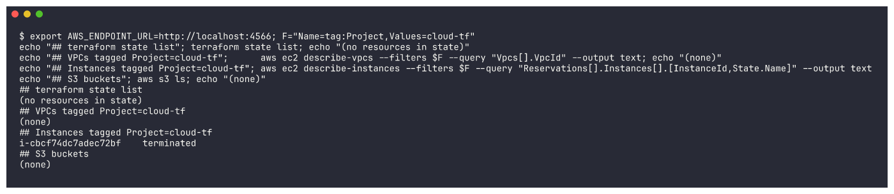

```text
$ export AWS_ENDPOINT_URL=http://localhost:4566; F="Name=tag:Project,Values=cloud-tf"
echo "## terraform state list"; terraform state list; echo "(no resources in state)"
echo "## VPCs tagged Project=cloud-tf";      aws ec2 describe-vpcs --filters $F --query "Vpcs[].VpcId" --output text; echo "(none)"
echo "## Instances tagged Project=cloud-tf"; aws ec2 describe-instances --filters $F --query "Reservations[].Instances[].[InstanceId,State.Name]" --output text
echo "## S3 buckets"; aws s3 ls; echo "(none)"
## terraform state list
(no resources in state)
## VPCs tagged Project=cloud-tf
(none)
## Instances tagged Project=cloud-tf
i-cbcf74dc7adec72bf	terminated
## S3 buckets
(none)
```

The state is empty, there are no VPCs or buckets left, and the instance shows as `terminated`. Real AWS also keeps terminated
instances visible for a while before removing them.

---

## Troubleshooting log

My first `apply` failed. I kept the real output because the fix is a useful lesson.

**Symptom:** after the VPC, subnet, IGW, route table, SG and bucket were created, the instance failed:

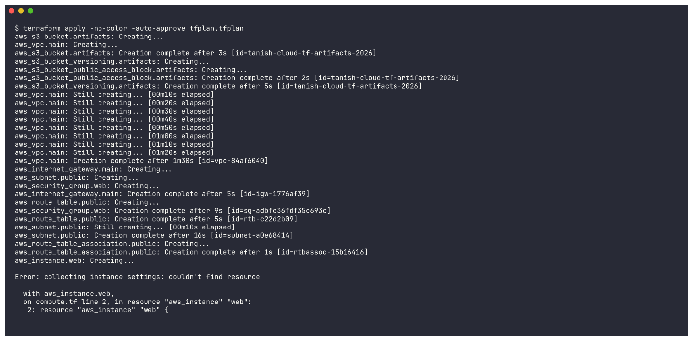

<details>
<summary>Full output (35 lines) - click to expand</summary>

```text
$ terraform apply -no-color -auto-approve tfplan.tfplan
aws_s3_bucket.artifacts: Creating...
aws_vpc.main: Creating...
aws_s3_bucket.artifacts: Creation complete after 3s [id=tanish-cloud-tf-artifacts-2026]
aws_s3_bucket_versioning.artifacts: Creating...
aws_s3_bucket_public_access_block.artifacts: Creating...
aws_s3_bucket_public_access_block.artifacts: Creation complete after 2s [id=tanish-cloud-tf-artifacts-2026]
aws_s3_bucket_versioning.artifacts: Creation complete after 5s [id=tanish-cloud-tf-artifacts-2026]
aws_vpc.main: Still creating... [00m10s elapsed]
aws_vpc.main: Still creating... [00m20s elapsed]
aws_vpc.main: Still creating... [00m30s elapsed]
aws_vpc.main: Still creating... [00m40s elapsed]
aws_vpc.main: Still creating... [00m50s elapsed]
aws_vpc.main: Still creating... [01m00s elapsed]
aws_vpc.main: Still creating... [01m10s elapsed]
aws_vpc.main: Still creating... [01m20s elapsed]
aws_vpc.main: Creation complete after 1m30s [id=vpc-84af6040]
aws_internet_gateway.main: Creating...
aws_subnet.public: Creating...
aws_security_group.web: Creating...
aws_internet_gateway.main: Creation complete after 5s [id=igw-1776af39]
aws_route_table.public: Creating...
aws_security_group.web: Creation complete after 9s [id=sg-adbfe36fdf35c693c]
aws_route_table.public: Creation complete after 5s [id=rtb-c22d2b09]
aws_subnet.public: Still creating... [00m10s elapsed]
aws_subnet.public: Creation complete after 16s [id=subnet-a0e68414]
aws_route_table_association.public: Creating...
aws_route_table_association.public: Creation complete after 1s [id=rtbassoc-15b16416]
aws_instance.web: Creating...

Error: collecting instance settings: couldn't find resource

  with aws_instance.web,
  on compute.tf line 2, in resource "aws_instance" "web":
   2: resource "aws_instance" "web" {
```

</details>

**Cause:** `ami_id` was set to `ami-df5de72bdb3b`, which does not exist in LocalStack's image catalogue. Before launching, the AWS provider
reads the AMI's details (for example its root device name, which it needs for `root_block_device`) and found nothing:

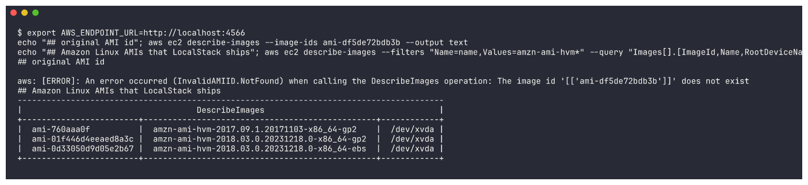

```text
$ export AWS_ENDPOINT_URL=http://localhost:4566
echo "## original AMI id"; aws ec2 describe-images --image-ids ami-df5de72bdb3b --output text
echo "## Amazon Linux AMIs that LocalStack ships"; aws ec2 describe-images --filters "Name=name,Values=amzn-ami-hvm*" --query "Images[].[ImageId,Name,RootDeviceName]" --output table
## original AMI id

aws: [ERROR]: An error occurred (InvalidAMIID.NotFound) when calling the DescribeImages operation: The image id '[['ami-df5de72bdb3b']]' does not exist
## Amazon Linux AMIs that LocalStack ships
----------------------------------------------------------------------------------------
|                                    DescribeImages                                    |
+------------------------+------------------------------------------------+------------+
|  ami-760aaa0f          |  amzn-ami-hvm-2017.09.1.20171103-x86_64-gp2    |  /dev/xvda |
|  ami-01f446d4eeaed8a3c |  amzn-ami-hvm-2018.03.0.20231218.0-x86_64-gp2  |  /dev/xvda |
|  ami-0d33050d9d05e2b67 |  amzn-ami-hvm-2018.03.0.20231218.0-x86_64-ebs  |  /dev/xvda |
+------------------------+------------------------------------------------+------------+
```

**Fix:** I changed `ami_id` in `terraform.tfvars` to `ami-760aaa0f` (an Amazon Linux AMI that LocalStack provides). I then ran
`terraform destroy` to clean up the 9 resources the failed run had created, and repeated `plan` and `apply` from scratch. Those are the
clean runs shown above.

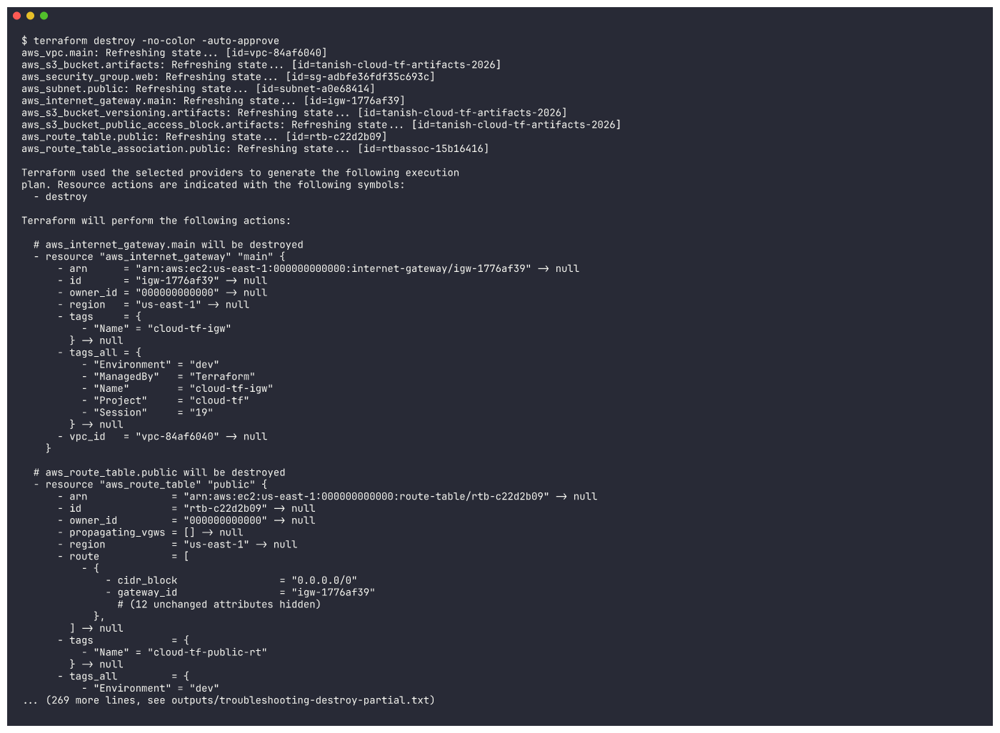

<details>
<summary>Full output (324 lines) - click to expand</summary>

```text
$ terraform destroy -no-color -auto-approve
aws_vpc.main: Refreshing state... [id=vpc-84af6040]
aws_s3_bucket.artifacts: Refreshing state... [id=tanish-cloud-tf-artifacts-2026]
aws_security_group.web: Refreshing state... [id=sg-adbfe36fdf35c693c]
aws_subnet.public: Refreshing state... [id=subnet-a0e68414]
aws_internet_gateway.main: Refreshing state... [id=igw-1776af39]
aws_s3_bucket_versioning.artifacts: Refreshing state... [id=tanish-cloud-tf-artifacts-2026]
aws_s3_bucket_public_access_block.artifacts: Refreshing state... [id=tanish-cloud-tf-artifacts-2026]
aws_route_table.public: Refreshing state... [id=rtb-c22d2b09]
aws_route_table_association.public: Refreshing state... [id=rtbassoc-15b16416]

Terraform used the selected providers to generate the following execution
plan. Resource actions are indicated with the following symbols:
  - destroy

Terraform will perform the following actions:

  # aws_internet_gateway.main will be destroyed
  - resource "aws_internet_gateway" "main" {
      - arn      = "arn:aws:ec2:us-east-1:000000000000:internet-gateway/igw-1776af39" -> null
      - id       = "igw-1776af39" -> null
      - owner_id = "000000000000" -> null
      - region   = "us-east-1" -> null
      - tags     = {
          - "Name" = "cloud-tf-igw"
        } -> null
      - tags_all = {
          - "Environment" = "dev"
          - "ManagedBy"   = "Terraform"
          - "Name"        = "cloud-tf-igw"
          - "Project"     = "cloud-tf"
          - "Session"     = "19"
        } -> null
      - vpc_id   = "vpc-84af6040" -> null
    }

  # aws_route_table.public will be destroyed
  - resource "aws_route_table" "public" {
      - arn              = "arn:aws:ec2:us-east-1:000000000000:route-table/rtb-c22d2b09" -> null
      - id               = "rtb-c22d2b09" -> null
      - owner_id         = "000000000000" -> null
      - propagating_vgws = [] -> null
      - region           = "us-east-1" -> null
      - route            = [
          - {
              - cidr_block                 = "0.0.0.0/0"
              - gateway_id                 = "igw-1776af39"
                # (12 unchanged attributes hidden)
            },
        ] -> null
      - tags             = {
          - "Name" = "cloud-tf-public-rt"
        } -> null
      - tags_all         = {
          - "Environment" = "dev"
          - "ManagedBy"   = "Terraform"
          - "Name"        = "cloud-tf-public-rt"
          - "Project"     = "cloud-tf"
          - "Session"     = "19"
        } -> null
      - vpc_id           = "vpc-84af6040" -> null
    }

  # aws_route_table_association.public will be destroyed
  - resource "aws_route_table_association" "public" {
      - id             = "rtbassoc-15b16416" -> null
      - region         = "us-east-1" -> null
      - route_table_id = "rtb-c22d2b09" -> null
      - subnet_id      = "subnet-a0e68414" -> null
        # (1 unchanged attribute hidden)
    }

  # aws_s3_bucket.artifacts will be destroyed
  - resource "aws_s3_bucket" "artifacts" {
      - arn                         = "arn:aws:s3:::tanish-cloud-tf-artifacts-2026" -> null
      - bucket                      = "tanish-cloud-tf-artifacts-2026" -> null
      - bucket_domain_name          = "tanish-cloud-tf-artifacts-2026.s3.amazonaws.com" -> null
      - bucket_namespace            = "global" -> null
      - bucket_region               = "us-east-1" -> null
      - bucket_regional_domain_name = "tanish-cloud-tf-artifacts-2026.s3.us-east-1.amazonaws.com" -> null
      - force_destroy               = true -> null
      - hosted_zone_id              = "Z3AQBSTGFYJSTF" -> null
      - id                          = "tanish-cloud-tf-artifacts-2026" -> null
      - object_lock_enabled         = false -> null
      - region                      = "us-east-1" -> null
      - request_payer               = "BucketOwner" -> null
      - tags                        = {
          - "Name" = "tanish-cloud-tf-artifacts-2026"
        } -> null
      - tags_all                    = {
          - "Environment" = "dev"
          - "ManagedBy"   = "Terraform"
          - "Name"        = "tanish-cloud-tf-artifacts-2026"
          - "Project"     = "cloud-tf"
          - "Session"     = "19"
        } -> null
        # (3 unchanged attributes hidden)

      - grant {
          - id          = "75aa57f09aa0c8caeab4f8c24e99d10f8e7faeebf76c078efc7c6caea54ba06a" -> null
          - permissions = [
              - "FULL_CONTROL",
            ] -> null
          - type        = "CanonicalUser" -> null
            # (1 unchanged attribute hidden)
        }

      - server_side_encryption_configuration {
          - rule {
              - bucket_key_enabled = false -> null

              - apply_server_side_encryption_by_default {
                  - sse_algorithm     = "AES256" -> null
                    # (1 unchanged attribute hidden)
                }
            }
        }

      - versioning {
          - enabled    = true -> null
          - mfa_delete = false -> null
        }
    }

  # aws_s3_bucket_public_access_block.artifacts will be destroyed
  - resource "aws_s3_bucket_public_access_block" "artifacts" {
      - block_public_acls       = true -> null
      - block_public_policy     = true -> null
      - bucket                  = "tanish-cloud-tf-artifacts-2026" -> null
      - id                      = "tanish-cloud-tf-artifacts-2026" -> null
      - ignore_public_acls      = true -> null
      - region                  = "us-east-1" -> null
      - restrict_public_buckets = true -> null
    }

  # aws_s3_bucket_versioning.artifacts will be destroyed
  - resource "aws_s3_bucket_versioning" "artifacts" {
      - bucket                = "tanish-cloud-tf-artifacts-2026" -> null
      - id                    = "tanish-cloud-tf-artifacts-2026" -> null
      - region                = "us-east-1" -> null
        # (1 unchanged attribute hidden)

      - versioning_configuration {
          - mfa_delete = "Disabled" -> null
          - status     = "Enabled" -> null
        }
    }

  # aws_security_group.web will be destroyed
  - resource "aws_security_group" "web" {
      - arn                    = "arn:aws:ec2:us-east-1:000000000000:security-group/sg-adbfe36fdf35c693c" -> null
      - description            = "Allow HTTP/HTTPS from anywhere and SSH from one trusted CIDR" -> null
      - egress                 = [
          - {
              - cidr_blocks      = [
                  - "0.0.0.0/0",
                ]
              - description      = "All outbound traffic"
              - from_port        = 0
              - ipv6_cidr_blocks = []
              - prefix_list_ids  = []
              - protocol         = "-1"
              - security_groups  = []
              - self             = false
              - to_port          = 0
            },
        ] -> null
      - id                     = "sg-adbfe36fdf35c693c" -> null
      - ingress                = [
          - {
              - cidr_blocks      = [
                  - "0.0.0.0/0",
                ]
              - description      = "HTTP"
              - from_port        = 80
              - ipv6_cidr_blocks = []
              - prefix_list_ids  = []
              - protocol         = "tcp"
              - security_groups  = []
              - self             = false
              - to_port          = 80
            },
          - {
              - cidr_blocks      = [
                  - "0.0.0.0/0",
                ]
              - description      = "HTTPS"
              - from_port        = 443
              - ipv6_cidr_blocks = []
              - prefix_list_ids  = []
              - protocol         = "tcp"
              - security_groups  = []
              - self             = false
              - to_port          = 443
            },
          - {
              - cidr_blocks      = [
                  - "203.0.113.25/32",
                ]
              - description      = "SSH from trusted CIDR only"
              - from_port        = 22
              - ipv6_cidr_blocks = []
              - prefix_list_ids  = []
              - protocol         = "tcp"
              - security_groups  = []
              - self             = false
              - to_port          = 22
            },
        ] -> null
      - name                   = "cloud-tf-web-sg" -> null
      - owner_id               = "000000000000" -> null
      - region                 = "us-east-1" -> null
      - revoke_rules_on_delete = false -> null
      - tags                   = {
          - "Name" = "cloud-tf-web-sg"
        } -> null
      - tags_all               = {
          - "Environment" = "dev"
          - "ManagedBy"   = "Terraform"
          - "Name"        = "cloud-tf-web-sg"
          - "Project"     = "cloud-tf"
          - "Session"     = "19"
        } -> null
      - vpc_id                 = "vpc-84af6040" -> null
        # (1 unchanged attribute hidden)
    }

  # aws_subnet.public will be destroyed
  - resource "aws_subnet" "public" {
      - arn                                            = "arn:aws:ec2:us-east-1:000000000000:subnet/subnet-a0e68414" -> null
      - assign_ipv6_address_on_creation                = false -> null
      - availability_zone                              = "us-east-1a" -> null
      - availability_zone_id                           = "use1-az6" -> null
      - cidr_block                                     = "10.0.1.0/24" -> null
      - enable_dns64                                   = false -> null
      - enable_lni_at_device_index                     = 0 -> null
      - enable_resource_name_dns_a_record_on_launch    = false -> null
      - enable_resource_name_dns_aaaa_record_on_launch = false -> null
      - id                                             = "subnet-a0e68414" -> null
      - ipv6_native                                    = false -> null
      - map_customer_owned_ip_on_launch                = false -> null
      - map_public_ip_on_launch                        = true -> null
      - owner_id                                       = "000000000000" -> null
      - private_dns_hostname_type_on_launch            = "ip-name" -> null
      - region                                         = "us-east-1" -> null
      - tags                                           = {
          - "Name" = "cloud-tf-public-subnet"
          - "Tier" = "public"
        } -> null
      - tags_all                                       = {
          - "Environment" = "dev"
          - "ManagedBy"   = "Terraform"
          - "Name"        = "cloud-tf-public-subnet"
          - "Project"     = "cloud-tf"
          - "Session"     = "19"
          - "Tier"        = "public"
        } -> null
      - vpc_id                                         = "vpc-84af6040" -> null
        # (4 unchanged attributes hidden)
    }

  # aws_vpc.main will be destroyed
  - resource "aws_vpc" "main" {
      - arn                                  = "arn:aws:ec2:us-east-1:000000000000:vpc/vpc-84af6040" -> null
      - assign_generated_ipv6_cidr_block     = false -> null
      - cidr_block                           = "10.0.0.0/16" -> null
      - default_network_acl_id               = "acl-b302e4f3" -> null
      - default_route_table_id               = "rtb-f30d1e08" -> null
      - default_security_group_id            = "sg-a521af1e0aab2768b" -> null
      - dhcp_options_id                      = "default" -> null
      - enable_dns_hostnames                 = true -> null
      - enable_dns_support                   = true -> null
      - enable_network_address_usage_metrics = false -> null
      - id                                   = "vpc-84af6040" -> null
      - instance_tenancy                     = "default" -> null
      - ipv6_netmask_length                  = 0 -> null
      - main_route_table_id                  = "rtb-f30d1e08" -> null
      - owner_id                             = "000000000000" -> null
      - region                               = "us-east-1" -> null
      - tags                                 = {
          - "Name" = "cloud-tf-vpc"
        } -> null
      - tags_all                             = {
          - "Environment" = "dev"
          - "ManagedBy"   = "Terraform"
          - "Name"        = "cloud-tf-vpc"
          - "Project"     = "cloud-tf"
          - "Session"     = "19"
        } -> null
        # (4 unchanged attributes hidden)
    }

Plan: 0 to add, 0 to change, 9 to destroy.

Changes to Outputs:
  - deployment_info_object = "s3://tanish-cloud-tf-artifacts-2026/deployment/info.json" -> null
  - internet_gateway_id    = "igw-1776af39" -> null
  - public_subnet_id       = "subnet-a0e68414" -> null
  - route_table_id         = "rtb-c22d2b09" -> null
  - s3_bucket_arn          = "arn:aws:s3:::tanish-cloud-tf-artifacts-2026" -> null
  - s3_bucket_name         = "tanish-cloud-tf-artifacts-2026" -> null
  - security_group_id      = "sg-adbfe36fdf35c693c" -> null
  - vpc_cidr               = "10.0.0.0/16" -> null
  - vpc_id                 = "vpc-84af6040" -> null
aws_s3_bucket_versioning.artifacts: Destroying... [id=tanish-cloud-tf-artifacts-2026]
aws_security_group.web: Destroying... [id=sg-adbfe36fdf35c693c]
aws_route_table_association.public: Destroying... [id=rtbassoc-15b16416]
aws_s3_bucket_public_access_block.artifacts: Destroying... [id=tanish-cloud-tf-artifacts-2026]
aws_s3_bucket_versioning.artifacts: Destruction complete after 1s
aws_s3_bucket_public_access_block.artifacts: Destruction complete after 1s
aws_route_table_association.public: Destruction complete after 1s
aws_subnet.public: Destroying... [id=subnet-a0e68414]
aws_route_table.public: Destroying... [id=rtb-c22d2b09]
aws_s3_bucket.artifacts: Destroying... [id=tanish-cloud-tf-artifacts-2026]
aws_security_group.web: Destruction complete after 2s
aws_subnet.public: Destruction complete after 1s
aws_s3_bucket.artifacts: Destruction complete after 1s
aws_route_table.public: Destruction complete after 1s
aws_internet_gateway.main: Destroying... [id=igw-1776af39]
aws_internet_gateway.main: Destruction complete after 0s
aws_vpc.main: Destroying... [id=vpc-84af6040]
aws_vpc.main: Destruction complete after 1s

Destroy complete! Resources: 9 destroyed.
```

</details>

Lesson: an `apply` that fails halfway is **not rolled back**. The resources that were created stay in the state, and Terraform
carries on from there next time. AMI IDs are region-specific (and, here, emulator-specific), which is why `ami_id` is a variable.

---

## Running against real AWS

1. Configure credentials: `aws configure` (or `export AWS_PROFILE=...`), then check with `aws sts get-caller-identity`.
2. In `terraform.tfvars`:
   - set `use_localstack = false`. This turns off the dummy credentials, `skip_*` flags, path-style S3 and the `endpoints` block
     (you can also delete the "LocalStack overrides" section from `provider.tf`);
   - set `ami_id` to a current Amazon Linux 2023 AMI for your region:
     ```bash
     aws ssm get-parameter --name /aws/service/ami-amazon-linux-latest/al2023-ami-kernel-default-x86_64 \
       --query Parameter.Value --output text
     ```
   - set `allowed_ssh_cidr` to `<your-public-ip>/32`, and optionally set `key_name` to an existing key pair;
   - change `bucket_name` to a globally unique name.
3. Run `terraform init && terraform plan -out=tfplan.tfplan && terraform apply tfplan.tfplan`, then open the `web_url` output in a browser.
4. Run `terraform destroy` when finished. A `t3.micro` and a public IPv4 address both cost money while they run.

## Command cheat sheet

| Command | Purpose |
|---|---|
| `terraform init` | Download providers/modules, configure the backend, create `.terraform.lock.hcl` |
| `terraform fmt [-check]` | Format code / check formatting (CI) |
| `terraform validate` | Static validation of the configuration |
| `terraform plan -out=tfplan.tfplan` | Preview changes and save the plan |
| `terraform apply tfplan.tfplan` | Apply exactly the saved plan |
| `terraform apply -auto-approve` | Plan + apply without the interactive "yes" |
| `terraform state list` | List managed resources |
| `terraform state show <addr>` | Show one resource's attributes from the state |
| `terraform output [-raw/-json] [name]` | Print output values |
| `terraform graph` | Dependency graph in DOT format |
| `terraform plan -refresh-only` | Detect drift without proposing config changes |
| `terraform destroy [-auto-approve]` | Delete everything in the state |

## What I learned

- **Terraform is declarative and graph-driven.** I never wrote "create the VPC first". Terraform worked out the order from the references,
  ran independent resources in parallel, and destroyed them in reverse order.
- **Implicit vs explicit dependencies.** References cover almost every case. `depends_on` is for hidden dependencies that Terraform cannot see,
  such as a boot script that needs an internet route.
- **What makes a subnet public** is its route to an Internet Gateway (through the route table association), plus a public IP on the instance.
  The subnet is not public just because of its name.
- **State is the source of truth for Terraform.** `state list/show` show what Terraform manages, and `plan` compares state against reality,
  which is how it caught the LocalStack `MetadataOptions` drift.
- **Variables + `default_tags`** make the same code reusable for dev/staging/prod and keep every resource traceable.
- **Failed applies are not rolled back.** Always read the error, fix the input, and either re-apply or clean up with `destroy`.
