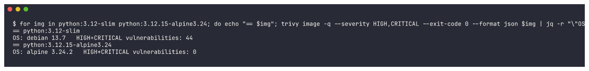
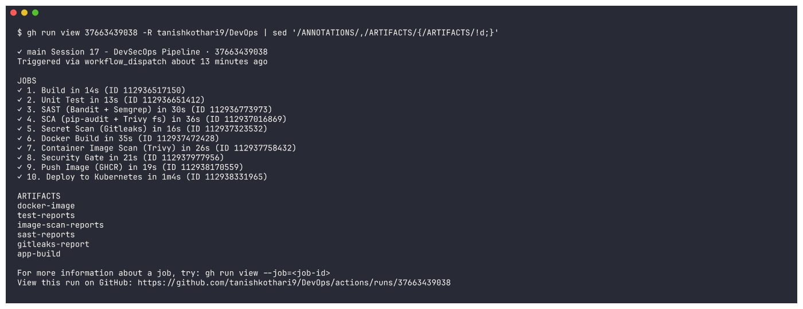

# Session 17 - Complete CI/CD & DevSecOps - Homework

A full CI/CD + DevSecOps pipeline for a small Flask app (the course's *DevSecOps Dashboard*
demo, hardened). Security checks run **inside** the pipeline, and each stage is a separate
GitHub Actions job chained with `needs:`, so a failed check stops everything after it:

```
Code ─► 1 Build ─► 2 Unit Test ─► 3 SAST ─► 4 SCA ─► 5 Secret Scan ─► 6 Docker Build
     ─► 7 Container Image Scan ─► 8 Security Gate ─► 9 Push Image (GHCR) ─► 10 Deploy to Kubernetes
```

| What | Where |
|---|---|
| Live workflow (the copy GitHub runs) | [`/.github/workflows/session17-devsecops.yml`](../../.github/workflows/session17-devsecops.yml) at the repo root |
| Reference copy | [`.github/workflows/session17-devsecops.yml`](.github/workflows/session17-devsecops.yml) (identical) |
| Green run (push) | https://github.com/tanishkothari9/DevOps/actions/runs/37662397193 |
| Gate demos: SAST / SCA / Secret / Image blocked | [37659683349](https://github.com/tanishkothari9/DevOps/actions/runs/37659683349) · [37659688505](https://github.com/tanishkothari9/DevOps/actions/runs/37659688505) · [37662419782](https://github.com/tanishkothari9/DevOps/actions/runs/37662419782) · [37659698688](https://github.com/tanishkothari9/DevOps/actions/runs/37659698688) |
| Final clean run after the demos | https://github.com/tanishkothari9/DevOps/actions/runs/37663439038 |
| Container image | https://github.com/tanishkothari9/DevOps/pkgs/container/session17-devsecops |

> GitHub only runs workflows found in `<repo>/.github/workflows/`, so the live file is at the repo root. It is
> limited to this folder with `paths:` filters and `defaults.run.working-directory: DevOps-main/DevSecOps`.

---

## Project structure

```
DevSecOps/
├── app/
│   ├── app.py                 # Flask app (health, status, greet, calculator, pipeline simulator)
│   ├── templates/index.html   # dashboard UI (from the course demo)
│   └── static/{css,js}/
├── tests/test_app.py          # 15 pytest tests (88% coverage, gate at 80%)
├── Dockerfile                 # multi-stage, pinned Alpine, non-root, no pip at runtime
├── k8s/
│   ├── namespace.yaml         # Pod Security Admission: enforce "restricted"
│   ├── deployment.yaml        # 2 replicas, securityContext, probes, limits, read-only FS
│   └── service.yaml           # ClusterIP :80 -> 5001
├── bandit.yaml                # SAST config (Bandit)
├── .semgrep/rules.yml         # SAST custom rules (Semgrep)
├── requirements-security.txt  # pinned bandit / semgrep / pip-audit
├── trivy.yaml                 # SCA + image scan + gate policy (Trivy)
├── .trivyignore               # documented risk-acceptance list (empty)
├── .gitleaks.toml             # secret scanning config (default rules + 1 custom rule)
├── requirements.txt / requirements-dev.txt / pytest.ini / .dockerignore / .gitignore
├── .github/workflows/session17-devsecops.yml
├── screenshots/   outputs/     # evidence: PNG + raw text for every command shown
```

## Stage → tool → what makes it fail

| # | Job | Tool(s) | Fails when | Evidence it leaves |
|---|---|---|---|---|
| 1 | Build | pip, `compileall`, import check | deps don't install / code doesn't compile or import | `app-build` artifact |
| 2 | Unit Test | pytest + pytest-cov | any test fails or coverage < 80% | `test-reports` (JUnit, coverage XML) |
| 3 | **SAST** | **Bandit** + **Semgrep** (`p/python`, `p/flask`, custom rules) | any Bandit issue / any blocking Semgrep result | `sast-reports` (bandit.json, semgrep.json) |
| 4 | **SCA** | **pip-audit** (PyPI/OSV advisories) + **Trivy fs** | a dependency has a known vulnerability (Trivy: HIGH/CRITICAL) | log |
| 5 | **Secret Scan** | **Gitleaks** (`dir` mode, this folder only) | any secret matches a rule | `gitleaks-report` |
| 6 | Docker Build | docker build + hardened smoke test | build fails / container is not healthy | `docker-image` (tested image tarball) |
| 7 | **Container Image Scan** | **Trivy image** (all severities) + **CycloneDX SBOM** | never: this stage *reports* | `image-scan-reports` (trivy-image.json, sbom.cdx.json) |
| 8 | **Security Gate** | jq policy on the Trivy report + `trivy config` | image has ≥1 HIGH/CRITICAL, or Dockerfile/k8s has a HIGH/CRITICAL misconfig | step summary |
| 9 | Push Image | docker + `GITHUB_TOKEN` → GHCR | only runs if the gate passed | `ghcr.io/tanishkothari9/session17-devsecops:<sha>` + `:latest` |
| 10 | Deploy to Kubernetes | kind (`helm/kind-action`), kubectl | rollout doesn't finish / service doesn't answer | step summary with pods + `/api/status` |

The image is built **once** (stage 6), saved as an artifact, and the *same* tarball is scanned,
gated and then pushed. What gets scanned is exactly what gets deployed.

---

## 1. Application

The Flask app from the course demo (`/`, `/health`, `/api/status`, `/api/greet/<name>`,
`/api/add`, `/api/calculate`, `/api/pipeline/run`), with these security fixes, each of which a scanner
would otherwise report:

| Course demo | This version | Caught by |
|---|---|---|
| `app.run(host="0.0.0.0", debug=True)` | dev server binds `127.0.0.1`, no debug; containers run **gunicorn** | Bandit B201 / B104, Semgrep custom rule |
| `random.choice/randint/uniform` | `secrets.SystemRandom()` | Bandit B311 |
| no input limits (`power` with huge exponents, unbounded names) | exponent ≤ 1000, name ≤ 50 chars, `fail_chance` clamped | unit tests |
| `datetime.utcnow()` (deprecated) | timezone-aware `datetime.now(timezone.utc)` | - |
| no security headers | `X-Content-Type-Options`, `X-Frame-Options`, `Referrer-Policy` | unit test |

## 2. Dockerfile (hardened)

```dockerfile
ARG BASE_IMAGE=python:3.12.15-alpine3.24          # pinned, small base (0 known CVEs at build time)

FROM ${BASE_IMAGE} AS builder                      # stage 1: build deps into a venv
RUN python -m venv /opt/venv
ENV PATH="/opt/venv/bin:$PATH"
COPY requirements.txt .
RUN pip install --no-cache-dir -r requirements.txt \
    && pip uninstall -y pip

FROM ${BASE_IMAGE}                                 # stage 2: runtime
...
RUN apk upgrade --no-cache \                       # pull in OS security fixes
    && python -m pip uninstall -y pip \            # no package manager left at runtime
    && addgroup -g 10001 -S app \
    && adduser -u 10001 -S -G app -H app
WORKDIR /app
COPY --from=builder /opt/venv /opt/venv
COPY app ./app
USER 10001:10001                                   # non-root
HEALTHCHECK ... CMD ["python", "-c", "...urlopen('http://127.0.0.1:5001/health')"]
CMD ["gunicorn", "--bind", "0.0.0.0:5001", "--workers", "2", "--worker-tmp-dir", "/tmp", ...]
```

(Condensed and annotated; the full file is [`Dockerfile`](Dockerfile).) Why these choices, measured with Trivy:
`python:3.12-slim` (Debian 13) had **44 HIGH** OS CVEs with no fix available yet; `python:3.12-alpine` had 0.
Adding `apk upgrade` cleared the last MEDIUM (zlib), so the final image has **0 vulnerabilities at any severity**
([`10-image-scan-trivy`](outputs/10-image-scan-trivy.txt)).



`BASE_IMAGE` is a build argument purely so the pipeline can *prove* the image gate works (section 8.4).

## 3. Security tools configuration

| File | Tool | What it configures |
|---|---|---|
| [`bandit.yaml`](bandit.yaml) | Bandit (Python SAST) | scans `app/`, excludes `tests/` (they use `assert` on purpose), no checks skipped. Bandit exits 1 on **any** issue |
| [`.semgrep/rules.yml`](.semgrep/rules.yml) | Semgrep (SAST) | 4 custom rules: Flask debug enabled, hardcoded `SECRET_KEY`, `subprocess(..., shell=True)`, `random` used for tokens. Run alongside the `p/python` + `p/flask` registry rulesets with `--error` |
| [`requirements-security.txt`](requirements-security.txt) | all | pinned tool versions: `bandit==1.9.4`, `semgrep==1.179.0`, `pip-audit==2.10.1` |
| `pip-audit -r requirements.txt --strict --desc` | pip-audit (SCA) | resolves the full dependency tree (Flask → Werkzeug, Jinja2, ...) and checks it against the PyPI/OSV advisory DB |
| [`trivy.yaml`](trivy.yaml) | Trivy | auto-loaded policy: `severity: [HIGH, CRITICAL]`, `exit-code: 1`, `ignore-unfixed: false` (unfixable CVEs still count), uses `.trivyignore` |
| [`.trivyignore`](.trivyignore) | Trivy | where accepted risks would go (`CVE-ID exp:<date>  # reason`); **empty**, nothing is suppressed |
| [`.gitleaks.toml`](.gitleaks.toml) | Gitleaks | `[extend] useDefault = true` (222 built-in rules in v8.30.1: AWS, GitHub, private keys, generic API keys...) plus a custom rule for this app's key format `dso_(?:live\|test)_<32 hex>`; generated `reports/` and PNG screenshots are allow-listed |

> **Supply-chain note.** In March 2026 `aquasecurity/trivy-action`, `setup-trivy` and Trivy releases
> v0.69.4–0.69.6 were compromised. This pipeline uses **neither action**: Trivy runs from the official
> image pinned to a known-good version (`docker run aquasec/trivy:0.75.0`), Gitleaks from
> `zricethezav/gitleaks:v8.30.1`. The only third-party actions are well-known majors:
> `actions/checkout@v6`, `actions/setup-python@v6`, `actions/upload-artifact@v6`,
> `actions/download-artifact@v7`, `helm/kind-action@v1`.

## 4. Kubernetes manifests

- **`namespace.yaml`**: namespace `devsecops` labelled `pod-security.kubernetes.io/enforce: restricted`.
  The API server **rejects** any pod that isn't hardened (see the dry-run in section 6).
- **`deployment.yaml`**: 2 replicas; pod `runAsNonRoot`, `runAsUser/Group 10001`, `seccompProfile: RuntimeDefault`;
  container `allowPrivilegeEscalation: false`, `readOnlyRootFilesystem: true` (a small `emptyDir` is mounted on `/tmp` for gunicorn),
  `capabilities.drop: [ALL]`, `automountServiceAccountToken: false`; startup/readiness/liveness probes on `/health`; CPU and memory requests and limits.
  CI swaps the image placeholder for `ghcr.io/tanishkothari9/session17-devsecops:<git-sha>`.
- **`service.yaml`**: ClusterIP, port 80 → named port `http` (5001).
- `trivy config .` (Gate 2) reports **0 misconfigurations** in the Dockerfile and all three manifests.

---

## 5. The GitHub Actions workflow (key parts)

```yaml
on:
  push:
    branches: [main]
    paths: ["DevOps-main/DevSecOps/**", "!DevOps-main/DevSecOps/**.md", ..., ".github/workflows/session17-devsecops.yml"]
  workflow_dispatch:
    inputs:
      inject_issue:            # used ONLY for the gate demos in section 8
        type: choice
        options: [none, secret, sca, sast, image]
permissions:
  contents: read               # least privilege; push/deploy jobs ask for packages: write/read
env:
  TRIVY_IMAGE: aquasec/trivy:0.75.0
  GITLEAKS_IMAGE: zricethezav/gitleaks:v8.30.1
jobs:
  build:         { name: "1. Build" }
  unit-test:     { name: "2. Unit Test",                needs: build }
  sast:          { name: "3. SAST (Bandit + Semgrep)",  needs: unit-test }
  sca:           { name: "4. SCA (pip-audit + Trivy fs)", needs: sast }
  secret-scan:   { name: "5. Secret Scan (Gitleaks)",   needs: sca }
  docker-build:  { name: "6. Docker Build",             needs: secret-scan }
  image-scan:    { name: "7. Container Image Scan (Trivy)", needs: docker-build }
  security-gate: { name: "8. Security Gate",            needs: image-scan }
  push-image:    { name: "9. Push Image (GHCR)",        needs: security-gate, permissions: { packages: write } }
  deploy:        { name: "10. Deploy to Kubernetes",    needs: push-image,    permissions: { packages: read } }
```

(Condensed. The [real file](.github/workflows/session17-devsecops.yml) has every step.) Highlights:

```yaml
# 4. SCA
- run: pip-audit -r requirements.txt --strict --desc
- run: docker run --rm -v "$PWD:/src" -w /src "$TRIVY_IMAGE" fs --scanners vuln .     # policy from trivy.yaml

# 5. Secret scan - only this folder, findings redacted in the log
- run: docker run --rm --user "$(id -u):$(id -g)" -v "$PWD:/scan" "$GITLEAKS_IMAGE" dir /scan
         --config /scan/.gitleaks.toml --redact --verbose --report-format json --report-path /scan/reports/gitleaks.json

# 8. Security gate - policy applied to the stage-7 report
- run: |
    BLOCKING=$(jq '[.Results[]?.Vulnerabilities[]? | select(.Severity=="HIGH" or .Severity=="CRITICAL")] | length' reports/trivy-image.json)
    if [ "$BLOCKING" -gt 0 ]; then ...; echo "::error::Security gate FAILED - $BLOCKING HIGH/CRITICAL vulnerabilities in the image"; exit 1; fi
- run: docker run --rm -v "$PWD:/src" -w /src "$TRIVY_IMAGE" config --exit-code 1 .   # Dockerfile + k8s misconfig

# 9. Push - GITHUB_TOKEN, never a stored password
- env: { GH_TOKEN: "${{ secrets.GITHUB_TOKEN }}" }
  run: echo "$GH_TOKEN" | docker login ghcr.io -u "${{ github.actor }}" --password-stdin

# 10. Deploy - throw-away kind cluster on the runner
- uses: helm/kind-action@v1
- run: |   # namespace + imagePullSecret built from GITHUB_TOKEN, then
    sed -i "s|image: session17-devsecops:local|image: $IMAGE|" k8s/deployment.yaml
    kubectl apply -f k8s/deployment.yaml -f k8s/service.yaml
    kubectl rollout status deployment/devsecops-dashboard -n devsecops --timeout=180s
    kubectl port-forward ... & curl /health, /api/status, POST /api/calculate
```

### Secrets
Only the built-in, short-lived **`GITHUB_TOKEN`** is used: it pushes the image (`packages: write`) and becomes the
cluster's image pull secret (`packages: read`). It is masked in logs (`***`) and expires when the job ends.
To use a stored secret instead (for example Docker Hub), you'd add it under **Settings → Secrets and variables →
Actions → New repository secret** (or `gh secret set DOCKERHUB_TOKEN`) and reference it as
`${{ secrets.DOCKERHUB_TOKEN }}`. I didn't create one for this project.

---

## 6. Running every stage locally

All tools were run on my machine at the same pinned versions (Trivy 0.75.0 and Gitleaks 8.30.1 via Homebrew;
Bandit, Semgrep and pip-audit in a Python 3.12 venv). Deployment went to the local **minikube** cluster.

```bash
pip install -r requirements-dev.txt -r requirements-security.txt
pytest -v --cov=app --cov-fail-under=80                                   # 2
bandit -c bandit.yaml -r app                                              # 3
semgrep scan --metrics=off --error --config p/python --config p/flask --config .semgrep/rules.yml app
pip-audit -r requirements.txt --strict --desc                             # 4
trivy fs --scanners vuln .
gitleaks dir . --config .gitleaks.toml --redact --verbose                 # 5
docker build -t session17-devsecops:local .                               # 6
trivy image --exit-code 0 --severity UNKNOWN,LOW,MEDIUM,HIGH,CRITICAL session17-devsecops:local   # 7
trivy image session17-devsecops:local && trivy config .                   # 8 (policy from trivy.yaml)
minikube image load session17-devsecops:local                             # 10
kubectl apply -f k8s/ && kubectl rollout status deploy/devsecops-dashboard -n devsecops
```

| Stage | Screenshot |
|---|---|
| 1. Build |  |
| 2. Unit tests: 15 passed, 88% coverage (gate 80%) |  |
| 3. SAST: Bandit, no issues |  |
| 3. SAST: Semgrep, 155 rules, 0 findings |  |
| 4. SCA: pip-audit, no known vulnerabilities |  |
| 4. SCA: Trivy fs, 0 HIGH/CRITICAL |  |
| 5. Secret scan: Gitleaks, no leaks |  |
| 6. Docker build |  |
| 6. Hardened run: read-only FS, all caps dropped, uid 10001, no pip, security headers |  |
| 7. Image scan: 0 vulnerabilities, all severities |  |
| 8. Security gate: both gates exit 0 |  |
| 10. Deploy to minikube (`devsecops` namespace, PSA restricted) |  |
| 10. Verify + PSA rejects a privileged pod |  |

Raw text for every screenshot is in [`outputs/`](outputs/). Pod Security Admission in action
(server-side dry run, nothing created):

```
$ kubectl run psa-test --image=nginx --privileged -n devsecops --dry-run=server
Error from server (Forbidden): pods "psa-test" is forbidden: violates PodSecurity "restricted:latest": privileged (container
"psa-test" must not set securityContext.privileged=true), allowPrivilegeEscalation != false (...), unrestricted capabilities
(...), runAsNonRoot != true (...), seccompProfile (...)
```

---

## 7. Successful pipeline output (GitHub Actions)

Run [#37662397193](https://github.com/tanishkothari9/DevOps/actions/runs/37662397193), triggered by `git push`. All 10 stages are green:


One line of proof from each stage (`gh run view <id> --log | grep ...`; GitHub hides logs in the browser unless you are signed in):


```
2. Unit Test | Required test coverage of 80% reached. Total coverage: 88.29%
3. SAST (Bandit + Semgrep) | No issues identified.
3. SAST (Bandit + Semgrep) | Ran 155 rules on 2 files: 0 findings.
4. SCA (pip-audit + Trivy fs) | No known vulnerabilities found
5. Secret Scan (Gitleaks) | INF no leaks found
6. Docker Build | uid=10001(app) gid=10001(app) groups=10001(app)
7. Container Image Scan (Trivy) | │ image.tar (alpine 3.24.2) │ alpine │ 0 │ - │
8. Security Gate | Blocking (HIGH+CRITICAL): 0
8. Security Gate | Gate 1 passed
8. Security Gate | Gate 2 passed
9. Push Image (GHCR) | dedab6e5c73389ef7a96f5df06578813c8df7628: digest: sha256:3923276a3068341759619c93ad952d1810193acbfa05e05b4337fcfa788cc165 size: 1993
10. Deploy to Kubernetes | deployment "devsecops-dashboard" successfully rolled out
10. Deploy to Kubernetes | {"a":6.0,"b":7.0,"expression":"6.0 × 7.0 = 42.0","operation":"multiply","result":42.0,"symbol":"×"}
```

**Security reports + SBOM** saved as artifacts and downloaded with `gh run download`:


**Container registry**: the pushed image pulled back from GHCR (`linux/amd64`, user `10001:10001`) and re-scanned
locally with the same policy (0 vulnerabilities, exit code 0):


---

## 8. Proving every gate actually blocks

A gate that has never failed proves nothing. The workflow has a `workflow_dispatch` input,
`inject_issue`, that plants one problem **at runtime, inside the runner only**. Nothing broken
or secret is ever committed:

```bash
gh workflow run session17-devsecops.yml -R tanishkothari9/DevOps -f inject_issue=sast
gh workflow run session17-devsecops.yml -R tanishkothari9/DevOps -f inject_issue=sca
gh workflow run session17-devsecops.yml -R tanishkothari9/DevOps -f inject_issue=secret
gh workflow run session17-devsecops.yml -R tanishkothari9/DevOps -f inject_issue=image
gh workflow run session17-devsecops.yml -R tanishkothari9/DevOps -f inject_issue=none     # clean run
```

| inject_issue | What gets injected (CI only) | Blocked at | Run |
|---|---|---|---|
| `sast` | writes `app/injected_unsafe.py` with `subprocess.call(..., shell=True)` and `eval()` | 3. SAST | [37659683349](https://github.com/tanishkothari9/DevOps/actions/runs/37659683349) |
| `sca` | appends `requests==2.19.0` to `requirements.txt` | 4. SCA | [37659688505](https://github.com/tanishkothari9/DevOps/actions/runs/37659688505) |
| `secret` | writes `leaked_config.py` with a generated fake AWS key ID and a fake `dso_live_` API key | 5. Secret Scan | [37662419782](https://github.com/tanishkothari9/DevOps/actions/runs/37662419782) |
| `image` | builds on the outdated `python:3.12.0-alpine3.18` base | 8. Security Gate | [37659698688](https://github.com/tanishkothari9/DevOps/actions/runs/37659698688) |

In every case the failing job is red and **every later job is skipped**: no image is pushed and nothing is deployed.

### 8.1 SAST blocks unsafe code


Bandit reports B602 (`shell=True`, **High**), B307 (`eval`, Medium) and B404; Semgrep reports
the custom rule `subprocess-shell-true` plus the registry rule. Both steps exit 1.

### 8.2 SCA blocks a vulnerable dependency


`pip-audit` resolves the whole tree and finds **37 known vulnerabilities in 3 packages** (`requests 2.19.0`
and the old `urllib3 1.23` / `idna 2.7` it pulls in). `trivy fs` independently flags `CVE-2018-18074` (HIGH).

### 8.3 Secret scan blocks a leaked credential


Gitleaks finds both keys: `aws-access-token` (built-in rule) and `devsecops-dashboard-api-key` (my custom rule).
Both values print as `REDACTED`.

> This demo also caught a bug in my own config. The first secret run
> ([37659693684](https://github.com/tanishkothari9/DevOps/actions/runs/37659693684)) showed that the custom rule
> `dso_(live|test)_...` treated the **capture group** as the secret, so only the word `live` was redacted.
> Changing it to a non-capturing group `(?:live|test)` fixed that, and the re-run above redacts the whole value.
> That first run also used a fake AWS key made only of letters A–P, which the AWS rule didn't flag; it is now
> generated with `openssl rand 10 | base32`, which matches the real key format.

### 8.4 Security gate blocks a vulnerable image


Stage 7 only *reports* (and warns that Alpine 3.18 is end-of-life). Stage 8 applies the policy:
the old base still carries `setuptools 69.0.2` (CVE-2024-6345, CVE-2025-47273) and `wheel 0.42.0` (CVE-2026-24049),
**3 HIGH**, so the gate fails and nothing is pushed.

### 8.5 Back to green
After the demos, a clean `inject_issue=none` run ([37663439038](https://github.com/tanishkothari9/DevOps/actions/runs/37663439038)) passes all 10 stages again:




---

## What I understood

- **DevSecOps = security as pipeline stages, not a separate audit.** Each scanner checks a different layer:
  SAST checks *my code*, SCA checks *other people's code that I depend on*, secret scanning checks *what I'm about to publish*,
  image scanning checks *the OS and packages I ship*, and `trivy config` checks *how it's deployed*.
- **Scanning ≠ gating.** Stage 7 produces the facts (full report + SBOM); stage 8 turns them into a yes/no decision using an
  explicit policy (0 HIGH/CRITICAL). Exceptions go into `.trivyignore` with a reason and an expiry date, instead of
  quietly lowering the threshold.
- **Shift left, fail fast.** The cheap checks (tests, SAST, SCA, secrets) run before the expensive Docker build, and
  `needs:` makes sure a failure stops everything downstream. Section 8 shows that for each gate.
- **Fix rather than suppress.** Picking Alpine over slim (44 → 0 HIGH), `apk upgrade`, removing pip, a non-root user,
  pinned dependencies and secure code patterns brought the findings to zero without ignoring anything.
- **Build once, promote the same artifact.** The image that passes the gate is byte-for-byte the one pushed to GHCR and deployed.
- **Defence in depth on Kubernetes.** Even if a bad pod spec got through CI, the `restricted` Pod Security level would reject it at the API server.

> Notes: the run pages show a GitHub notice that `ubuntu-latest` moves to Ubuntu 26 on 19 Oct 2026. It is informational only.
> The images are `linux/amd64` (built on GitHub's runners). On my arm64 Mac I pulled and scanned the pushed image but
> ran locally built arm64 images, since Docker Desktop here has no amd64 emulation.
