# Session 17: Complete CI/CD & DevSecOps

> Work in progress: the full write-up for this session is being finalised. Every screenshot below is real output from commands run on a local minikube cluster / Docker / GitHub Actions.

## Evidence

### 01-build

```bash
python --version && pip install -q -r requirements.txt && echo "dependencies installed" && python -m compileall -q app && echo "byte-compile OK" && python -c "from app.app import app; print(\"routes:\", sorted(r.rule for r in app.url_map.iter_rules()))"
```

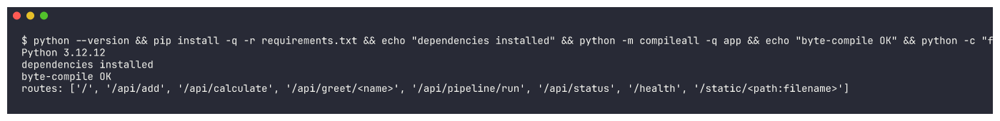

### 02-unit-test

```bash
pytest -v --cov=app --cov-report=term-missing --cov-fail-under=80
```

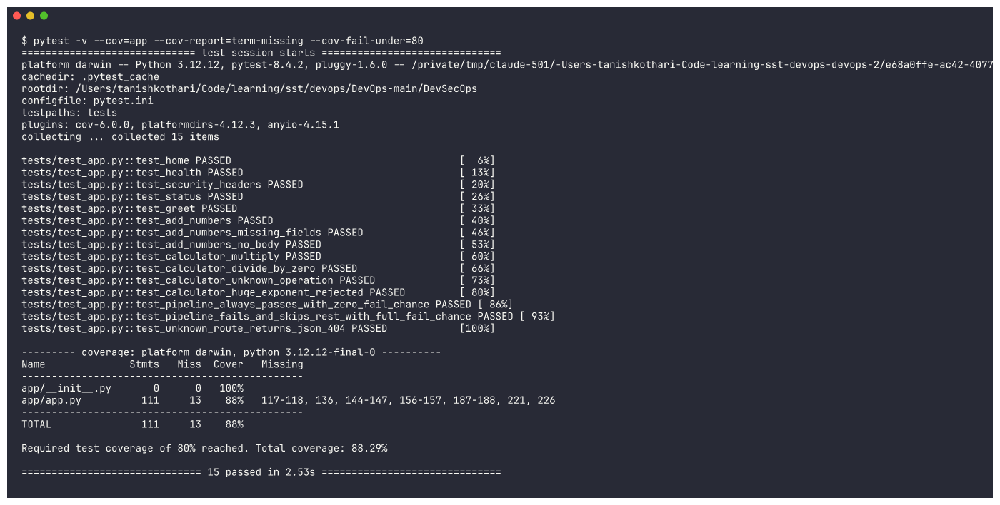

### 03-sast-bandit

```bash
bandit --version | head -1 && bandit -c bandit.yaml -r app
```

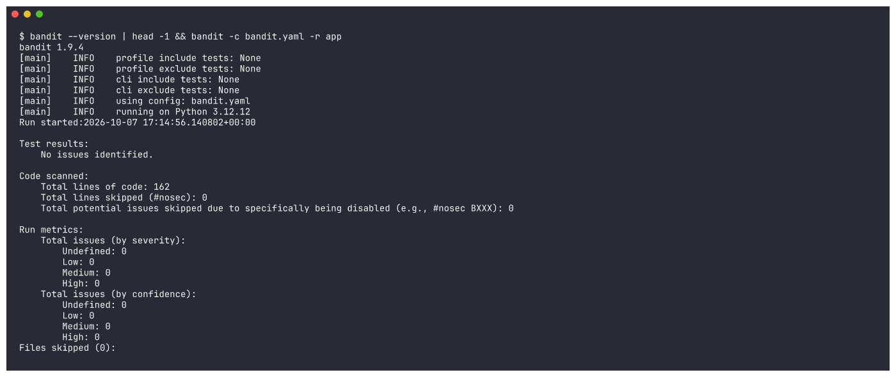

### 04-sast-semgrep

```bash
semgrep --version && semgrep scan --metrics=off --error --config p/python --config p/flask --config .semgrep/rules.yml app
```

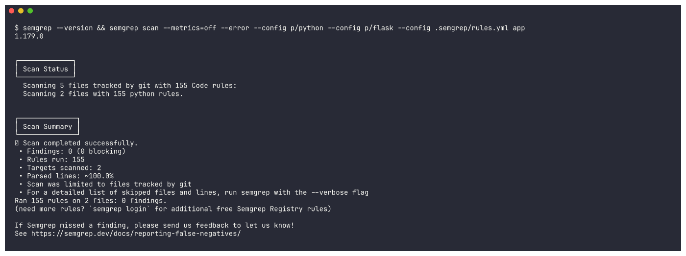

### 05-sca-pip-audit

```bash
pip-audit --version && cat requirements.txt && pip-audit -r requirements.txt --strict --desc
```

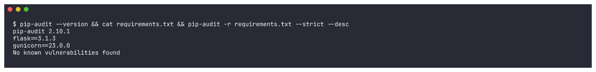

### 06-sca-trivy-fs

```bash
trivy --version | head -1 && trivy fs --scanners vuln .; echo "exit code: $?"
```

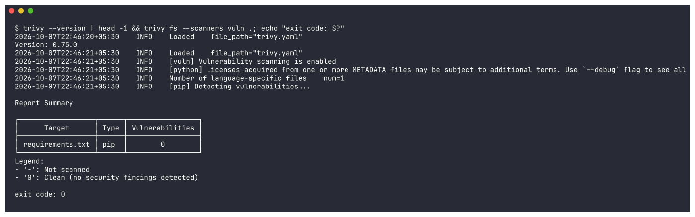

### 07-secret-scan-gitleaks

```bash
gitleaks version && gitleaks dir . --config .gitleaks.toml --redact --verbose; echo "exit code: $?"
```

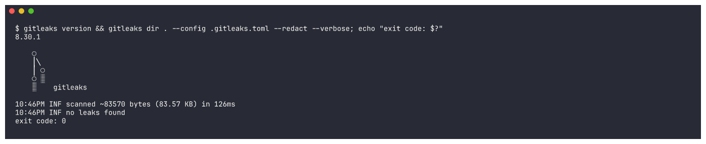

### 08-docker-build

```bash
docker build --progress=plain --build-arg APP_VERSION=local -t session17-devsecops:local . 2>&1 | grep -vE "^#[0-9]+ (sha256|extracting|resolve|\[auth\]|exporting|naming|unpacking|writing)" && docker image ls session17-devsecops
```

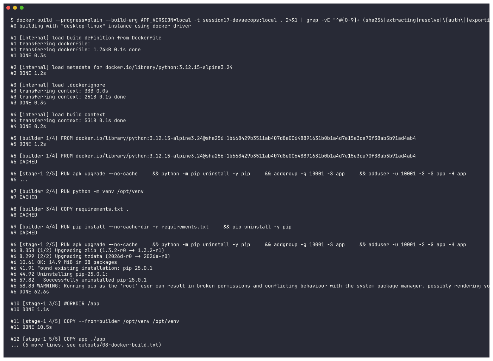

### 09-docker-run-hardened

```bash
docker run -d --name s17-smoke -p 15001:5001 --read-only --tmpfs /tmp --cap-drop ALL --security-opt no-new-privileges session17-devsecops:local; until curl -sf -o /dev/null http://localhost:15001/health; do sleep 1; done; docker ps --filter name=s17-smoke --format "table {{.Names}}\t{{.Status}}\t{{.Ports}}"; echo; curl -s http://localhost:15001/health; echo; curl -s -X POST http://localhost:15001/ ...
```

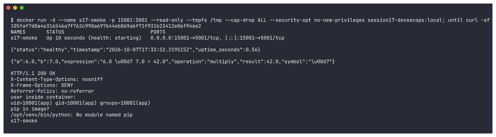

### 10-image-scan-trivy

```bash
trivy image --exit-code 0 --severity UNKNOWN,LOW,MEDIUM,HIGH,CRITICAL --table-mode summary session17-devsecops:local 2>&1 | grep -v "INFO"; echo; echo "Vulnerabilities by severity (JSON report):"; trivy image -q --exit-code 0 --severity UNKNOWN,LOW,MEDIUM,HIGH,CRITICAL --format json session17-devsecops:local | jq -r "[.Results[]?.Vulnerabilities[]?.Severity] | length as \$n | \"total=\(\$n)\""
```

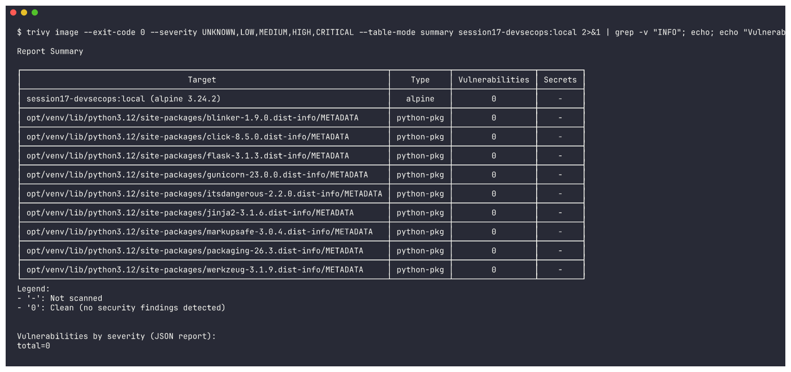

### 11-security-gate

```bash
echo "== Gate 1: image HIGH/CRITICAL (policy from trivy.yaml: severity HIGH,CRITICAL + exit-code 1) =="; trivy image -q --table-mode summary session17-devsecops:local; echo "gate 1 exit code: $?"; echo; echo "== Gate 2: Dockerfile + Kubernetes misconfigurations =="; trivy config -q .; echo "gate 2 exit code: $?"
```

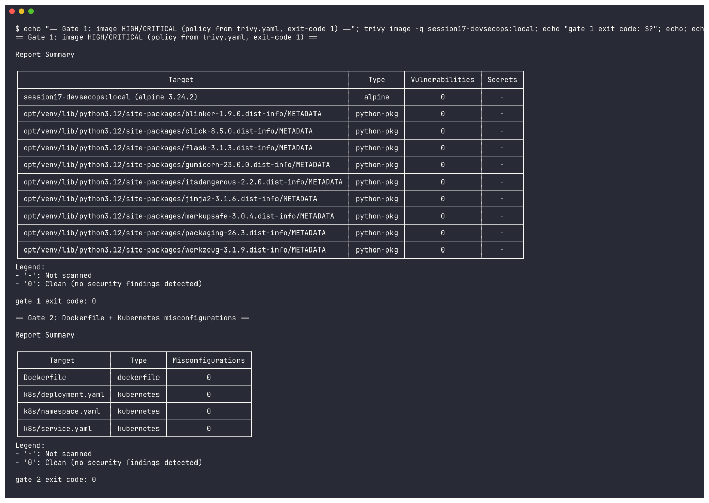

### 12-k8s-deploy-minikube

```bash
kubectl apply -f k8s/namespace.yaml -f k8s/deployment.yaml -f k8s/service.yaml && kubectl rollout status deployment/devsecops-dashboard -n devsecops --timeout=300s && kubectl get deploy,pods,svc -n devsecops -o wide && echo && kubectl get ns devsecops --show-labels
```

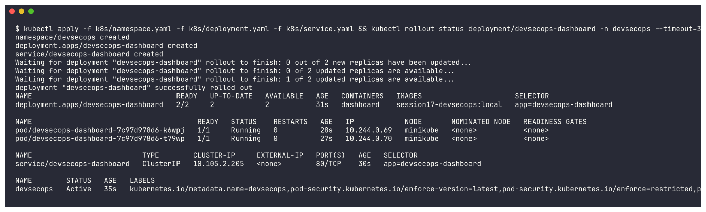

### 13-k8s-verify-minikube

```bash
(kubectl port-forward -n devsecops service/devsecops-dashboard 18081:80 >/dev/null 2>&1 &); until curl -sf -m 5 -o /dev/null http://localhost:18081/health; do sleep 1; done; echo "GET /health"; curl -s -m 10 http://localhost:18081/health; echo; echo "GET /api/status"; curl -s -m 10 http://localhost:18081/api/status; echo; echo "POST /api/calculate"; curl -s -m 10 -X POST http://localhost:18081/api ...
```

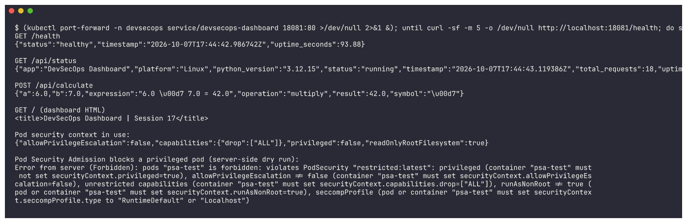

### ci-01-green-run-push

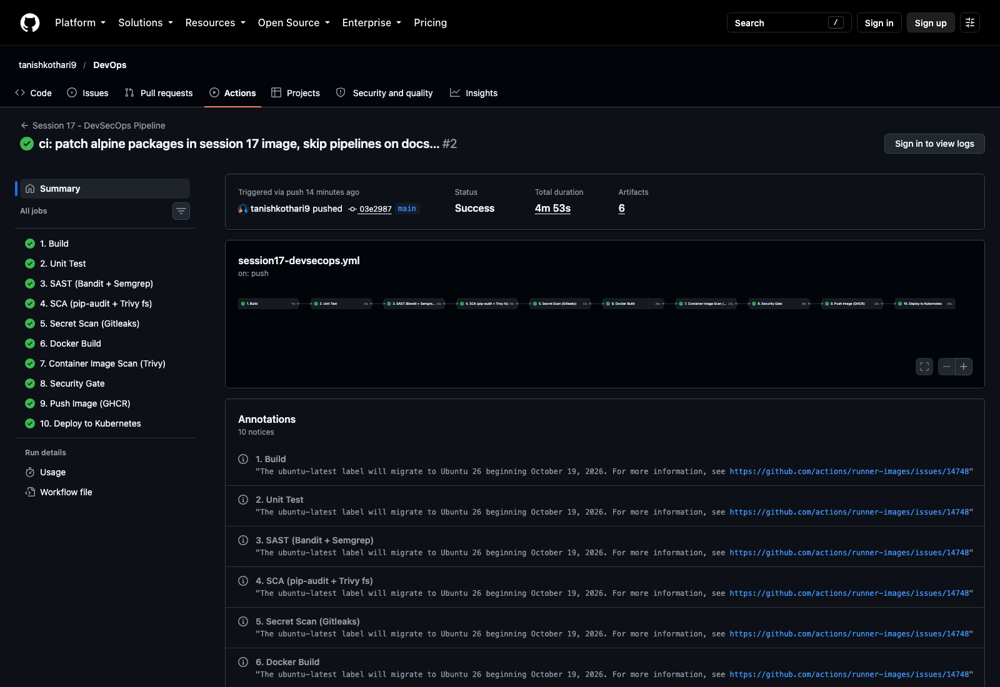

### ci-02-green-run-jobs

```bash
gh run view 37659659277 -R tanishkothari9/DevOps | sed '/ANNOTATIONS/,/ARTIFACTS/{/ARTIFACTS/!d;}'
```

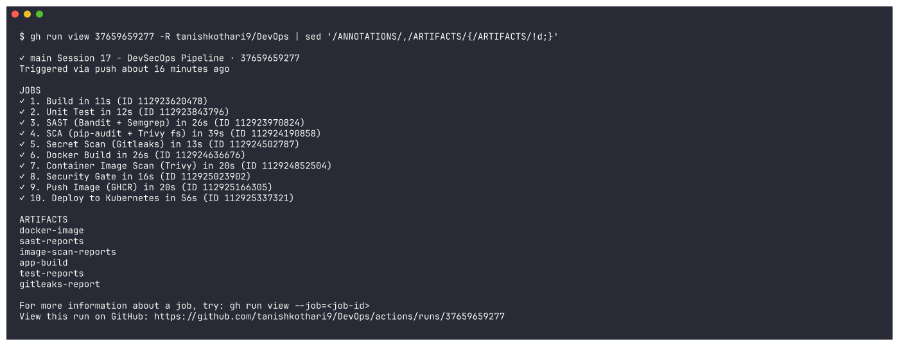

### ci-03-green-run-stage-logs

```bash
gh run view 37659659277 -R tanishkothari9/DevOps --log | grep -E 'passed in|Total coverage|No issues identified|Ran [0-9]+ rules|No known vulnerabilities|requirements.txt │|no leaks found|uid=10001|image.tar \(alpine|Blocking \(HIGH|All findings by|Gate [12] passed|digest: sha256|Deploying ghcr|successfully rolled out|status.:.healthy|result.:42' | grep -v '36;1m' | cut -f1,3- | sed -E 's/\t[0-9T: ...
```

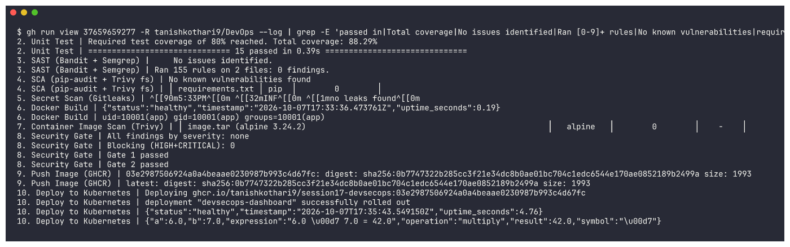

### ci-04-artifacts-reports

```bash
gh api repos/tanishkothari9/DevOps/actions/runs/37662397193/artifacts --jq '.artifacts[] | "\(.name)\t\(.size_in_bytes) bytes"'; echo; for a in sast-reports image-scan-reports gitleaks-report test-reports; do gh run download 37662397193 -R tanishkothari9/DevOps -n $a -D $a; done; find . -type f | sort; echo; echo -n 'bandit.json  -> issues: '; jq '.results | length' sast-reports/bandit.json; echo  ...
```

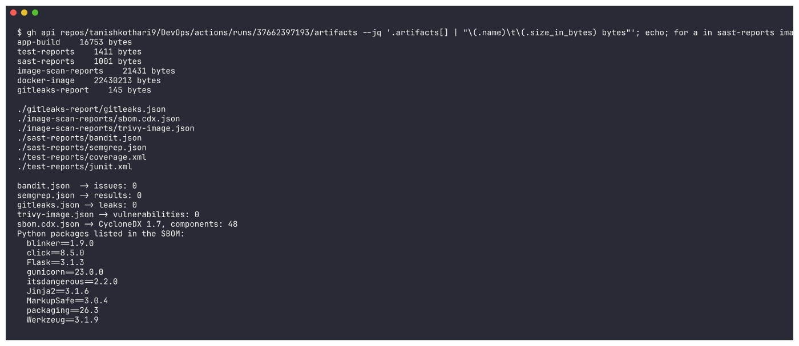

### ci-05-ghcr-image

```bash
docker pull --platform linux/amd64 ghcr.io/tanishkothari9/session17-devsecops:dedab6e5c73389ef7a96f5df06578813c8df7628 2>&1 | grep -vE 'Pulling fs|Download complete|Pull complete|Waiting|Verifying' && echo && docker image inspect ghcr.io/tanishkothari9/session17-devsecops:dedab6e5c73389ef7a96f5df06578813c8df7628 --format 'Platform : {{.Os}}/{{.Architecture}}{{println}}Created  : {{.Created}}{{prin ...
```

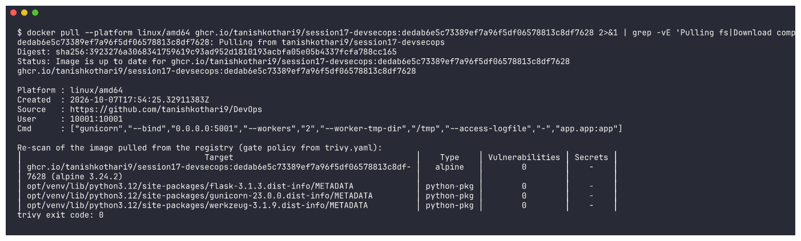

### ci-05-ghcr-package-page

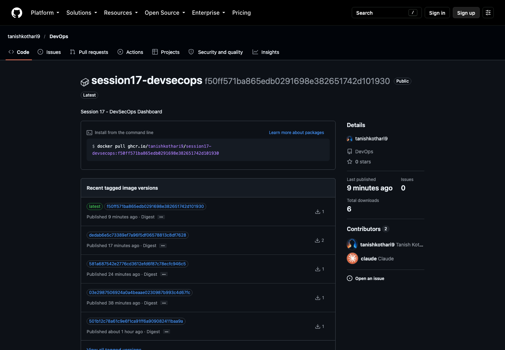

### ci-10-sast-blocked-jobs

```bash
gh run view 37659683349 -R tanishkothari9/DevOps | sed -n '1,3p;/JOBS/,/ANNOTATIONS/p' | grep -v ANNOTATIONS; gh run view 37659683349 -R tanishkothari9/DevOps --json url --jq .url
```

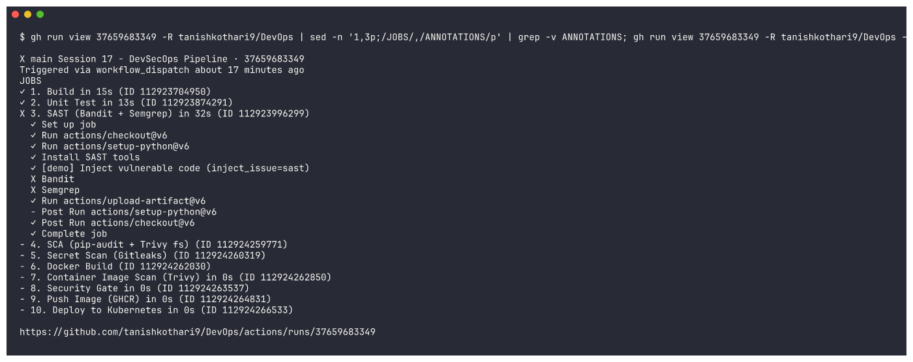

### ci-10-sast-blocked-log

```bash
gh run view 37659683349 -R tanishkothari9/DevOps --log-failed | cut -f3- | cut -c30- | grep -E '>> Issue|Severity:|  Location:|❯❯❱|Findings:|exit code'
```

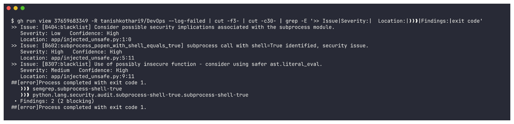

### ci-10-sast-blocked-run


### ci-11-sca-blocked-jobs

```bash
gh run view 37659688505 -R tanishkothari9/DevOps | sed -n '1,3p;/JOBS/,/ANNOTATIONS/p' | grep -v ANNOTATIONS; gh run view 37659688505 -R tanishkothari9/DevOps --json url --jq .url
```

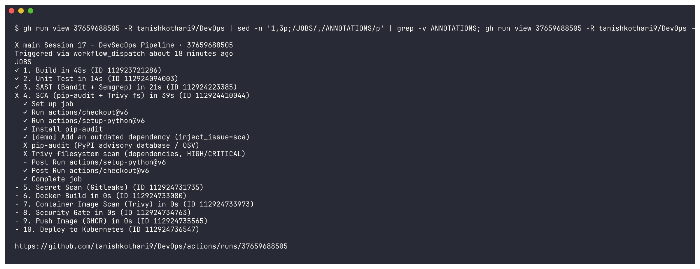

### ci-11-sca-blocked-log

```bash
gh run view 37659688505 -R tanishkothari9/DevOps --log-failed | cut -f3- | cut -c30- > /tmp/sca.log; echo '--- pip-audit (unique advisories) ---'; grep -E '^Found' /tmp/sca.log; grep -E '^(requests|urllib3|idna) ' /tmp/sca.log | awk '!s[$3]++ {printf "%-9s %-7s %-16s fix: %s\n", $1, $2, $3, $4}'; echo '--- trivy fs ---'; grep -E 'Total: [0-9]|requests +│ CVE' /tmp/sca.log | tr -s ' '; grep -c 'exi ...
```

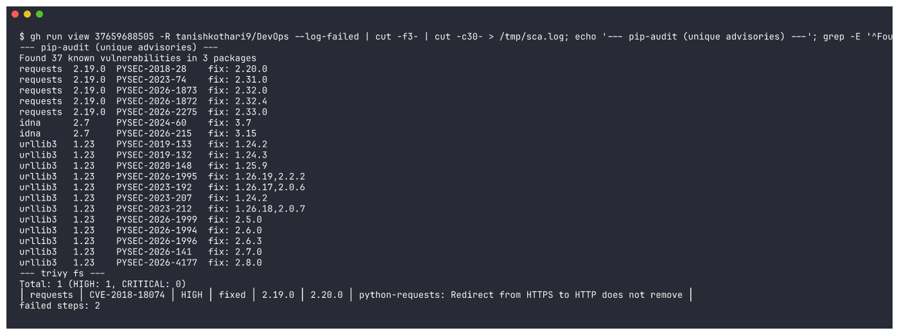

### ci-11-sca-blocked-run

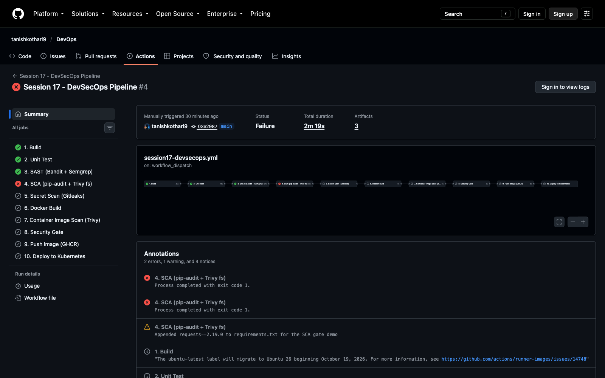

### ci-12-secret-blocked-jobs

```bash
gh run view 37662419782 -R tanishkothari9/DevOps | sed -n '1,3p;/JOBS/,/ANNOTATIONS/p' | grep -v ANNOTATIONS; gh run view 37662419782 -R tanishkothari9/DevOps --json url --jq .url
```

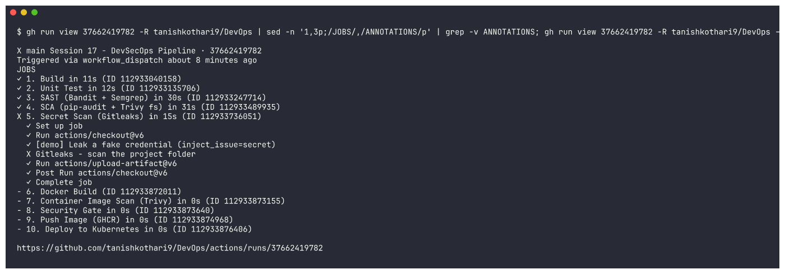

### ci-12-secret-blocked-log

```bash
gh run view 37662419782 -R tanishkothari9/DevOps --log-failed | cut -f3- | cut -c30- | sed -n '/Status: Downloaded/,$p' | tail -n +2
```

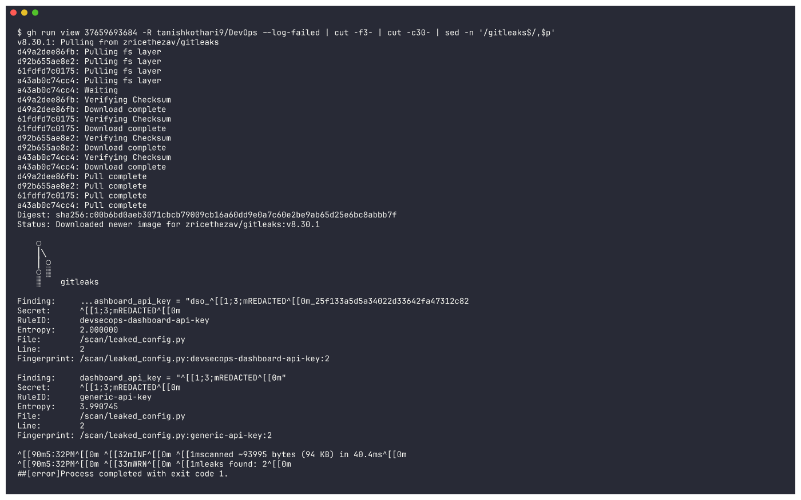

### ci-12-secret-blocked-run

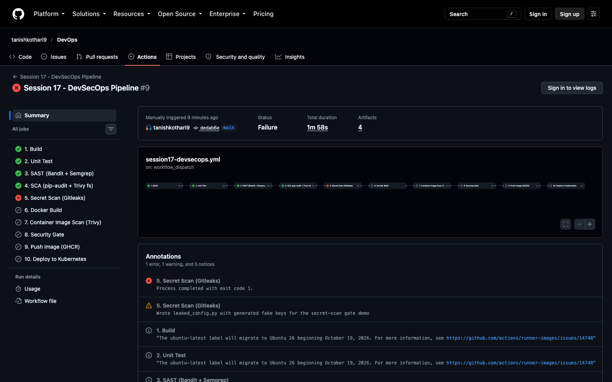

### ci-13-image-blocked-jobs

```bash
gh run view 37659698688 -R tanishkothari9/DevOps | sed -n '1,3p;/JOBS/,/ANNOTATIONS/p' | grep -v ANNOTATIONS; gh run view 37659698688 -R tanishkothari9/DevOps --json url --jq .url
```

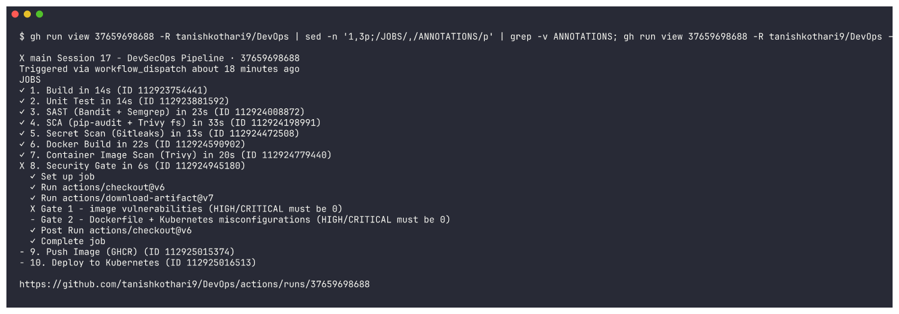

### ci-13-image-blocked-log

```bash
gh run view 37659698688 -R tanishkothari9/DevOps --log | grep -E '##\[warning\]Building|image.tar \(alpine|Total: [0-9]+ \(|All findings|Blocking|Z (HIGH|CRITICAL)	CVE|Security gate FAILED|no longer supported' | grep -v '36;1m' | cut -f1,3- | sed -E 's/\t[0-9T:.-]+Z / | /' | cut -c1-170
```

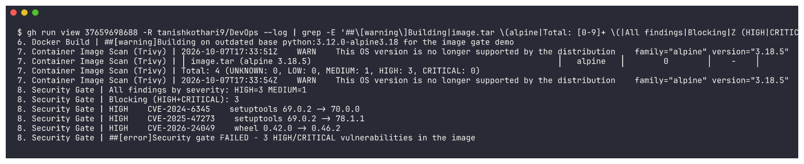

### ci-13-image-blocked-run

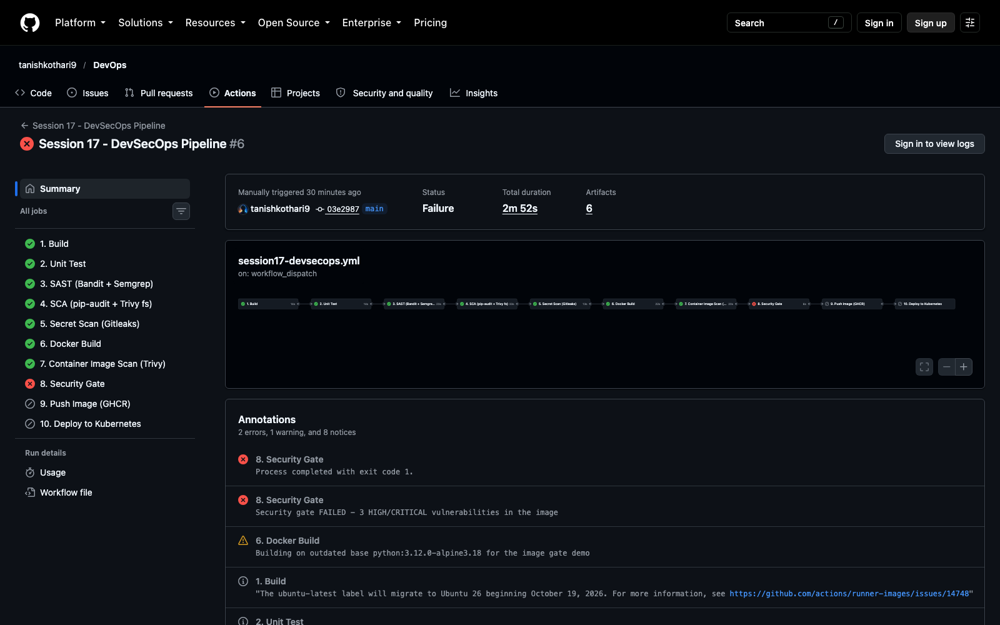

### ci-14-final-green-run

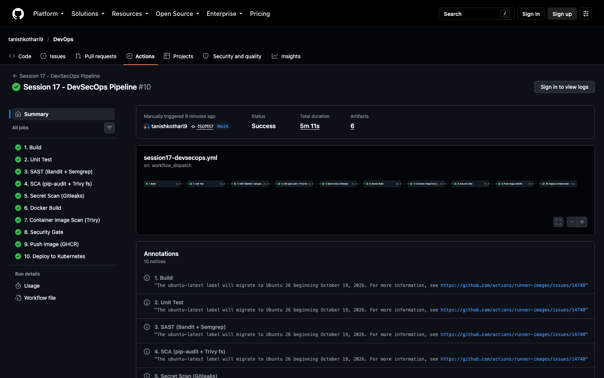
