# Docker Fundamentals - Hello World Applications

A set of six minimal "Hello World" programs, every one of them packaged into its own container image with a dedicated Dockerfile.

## Folder structure
```
Docker Fundamentals/
├── nodejs-app/     Node.js (built-in http server)
├── python-app/     Python (Flask)
├── java-app/       Java (built-in HttpServer)
├── Apache-app/     Apache HTTP Server (static page)
├── React-app/      React (built + served by Nginx)
└── nginx-app/      Nginx (static page)
```

## Ports summary
| App | Container port | Example run command |
|---|---|---|
| nodejs-app | 3000 | `docker run -p 3000:3000 nodejs-app` |
| python-app | 5000 | `docker run -p 5000:5000 python-app` |
| java-app | 8080 | `docker run -p 8080:8080 java-app` |
| Apache-app | 80 | `docker run -p 8081:80 apache-app` |
| React-app | 80 | `docker run -p 8082:80 react-app` |
| nginx-app | 80 | `docker run -p 8083:80 nginx-app` |

## Build and run each app
Each block below is meant to be executed from within the matching application folder.

### nodejs-app
```bash
cd nodejs-app
docker build -t nodejs-app .
docker run -d -p 3000:3000 nodejs-app
# open http://localhost:3000
```

### python-app
```bash
cd python-app
docker build -t python-app .
docker run -d -p 5000:5000 python-app
# open http://localhost:5000
```

### java-app
```bash
cd java-app
docker build -t java-app .
docker run -d -p 8080:8080 java-app
# open http://localhost:8080
```

### Apache-app
```bash
cd Apache-app
docker build -t apache-app .
docker run -d -p 8081:80 apache-app
# open http://localhost:8081
```

### React-app
```bash
cd React-app
docker build -t react-app .
docker run -d -p 8082:80 react-app
# open http://localhost:8082
```

### nginx-app
```bash
cd nginx-app
docker build -t nginx-app .
docker run -d -p 8083:80 nginx-app
# open http://localhost:8083
```

## Useful Docker commands
```bash
docker images            # list built images
docker ps                # list running containers
docker stop <container>  # stop a container
docker rm <container>    # remove a container
docker logs <container>  # view container logs
```

## Screenshots
For each application, include a capture of "Hello World" rendered in the browser alongside the terminal output from building and running it.

- Node.js: 
- Python: 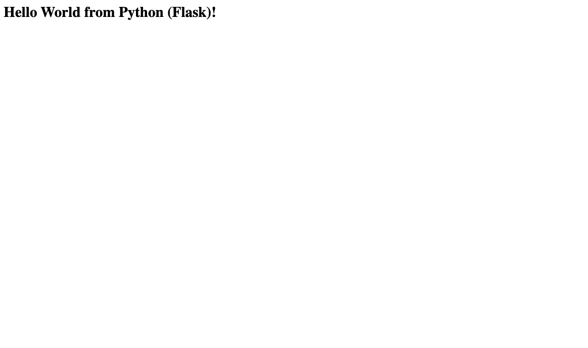
- Java: 
- Apache: 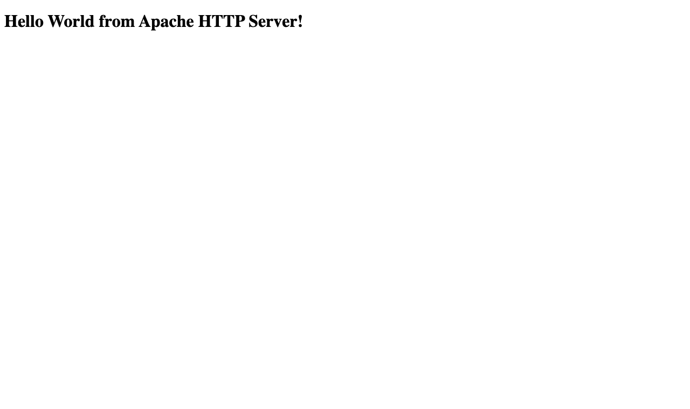
- React: 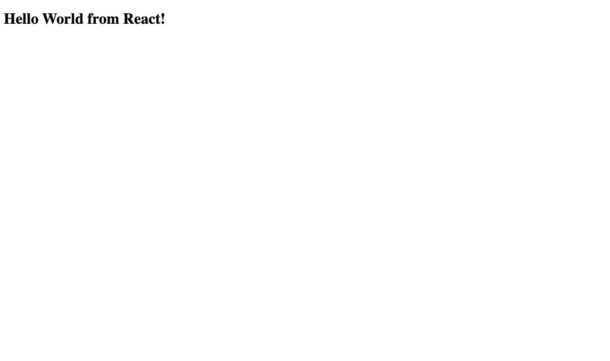
- Nginx: 

---

## Build and run evidence (terminal output)

The browser screenshots above show "Hello World" for each app. The section above also asks for the **terminal output of building and running**, so I rebuilt and ran all six apps from these exact folders and captured everything. The full text of each step is in [`outputs/`](outputs/).

> The images were tagged `hw-<app>-app` for this run. Host ports `18030-18083` were used because port `8080` on my laptop is already taken by another project. The container ports are the same as in the table above.

### 1. Build every image (`docker build`)

| App | Build output | Final image size |
|---|---|---|
| nodejs-app | 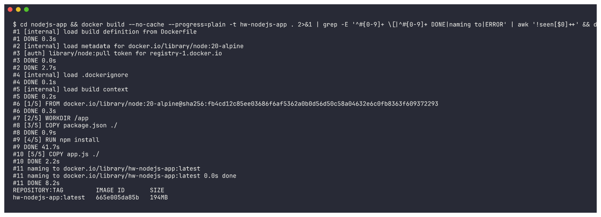 | 194MB |
| python-app | 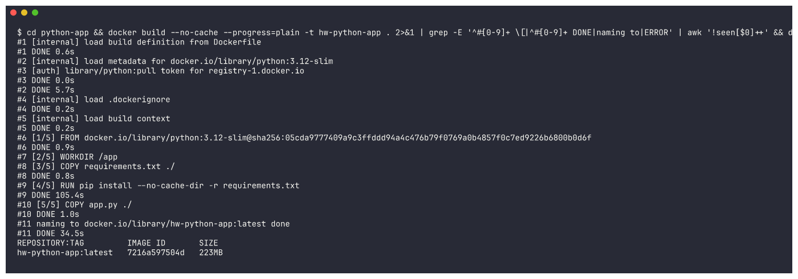 | 223MB |
| java-app | 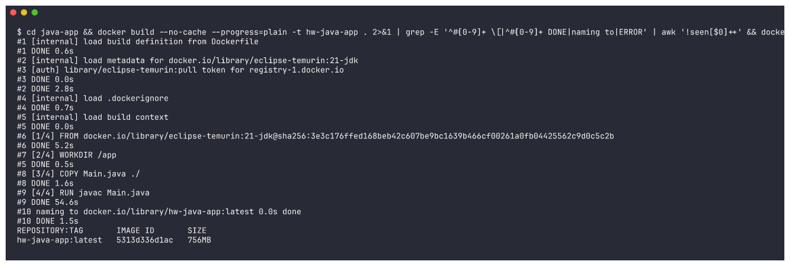 | 756MB (full JDK image) |
| Apache-app | 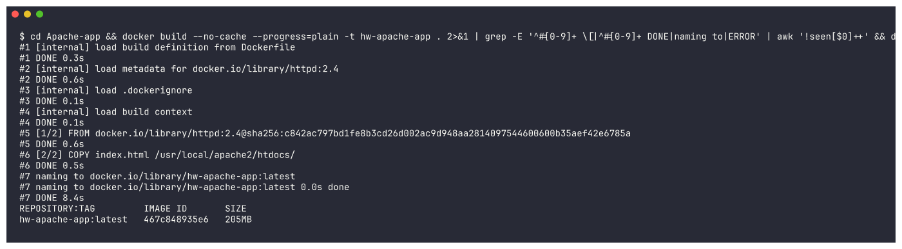 | 205MB |
| React-app | 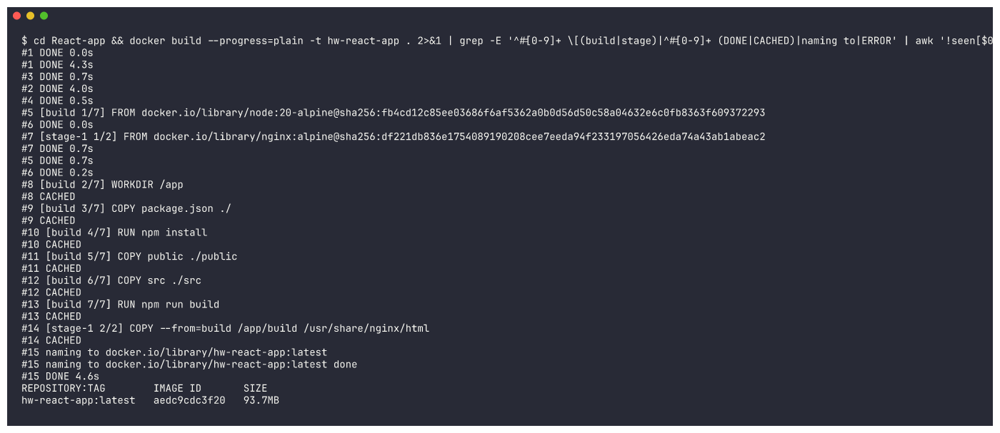 | 93.7MB (multi-stage: Node build, then Nginx) |
| nginx-app | 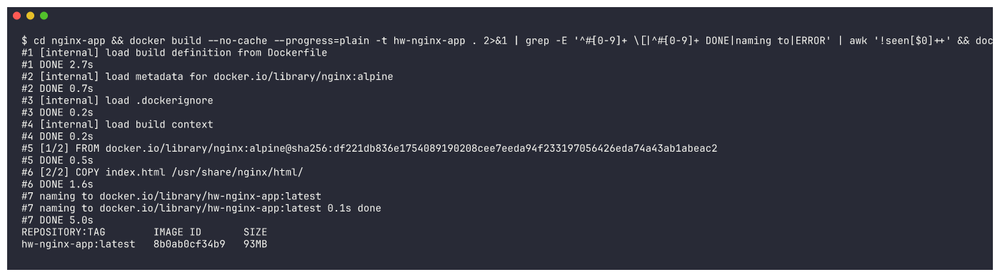 | 93MB |

### 2. Run all six containers (`docker run` + `docker ps`)

```bash
docker run -d --name hw-nodejs -p 18030:3000 hw-nodejs-app
docker run -d --name hw-python -p 18050:5000 hw-python-app
docker run -d --name hw-java   -p 18080:8080 hw-java-app
docker run -d --name hw-apache -p 18081:80   hw-apache-app
docker run -d --name hw-react  -p 18082:80   hw-react-app
docker run -d --name hw-nginx  -p 18083:80   hw-nginx-app
```

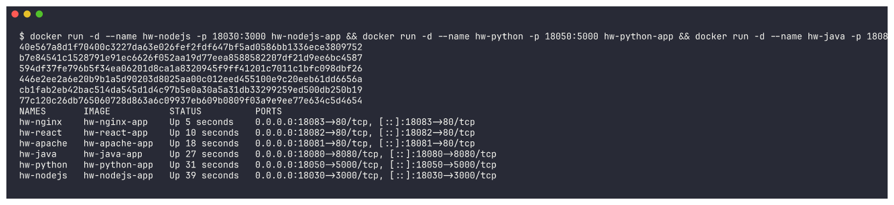

### 3. Verify "Hello World" on each web page (`curl`)

```
--- curl -s localhost:18030
<h1>Hello World from Node.js!</h1>
--- curl -s localhost:18050
<h1>Hello World from Python (Flask)!</h1>
--- curl -s localhost:18080
<h1>Hello World from Java!</h1>
--- curl -s localhost:18081
<h1>Hello World from Apache HTTP Server!</h1>
--- curl -s localhost:18083
<h1>Hello World from Nginx!</h1>
--- curl -s localhost:18082 (React: HTML shell + JS bundle)
<div id="root"></div>
bundle: /static/js/main.947e896d.js
Hello World from React!
```
The React page is rendered in the browser by JavaScript, so `curl` only gets the empty `<div id="root">` shell. To confirm the text, I fetched the built JS bundle that the page loads; it contains `Hello World from React!`. The browser screenshot above shows it rendered.

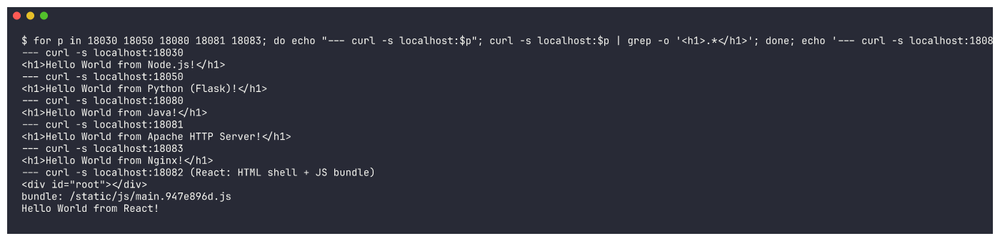

### 4. Container logs and cleanup

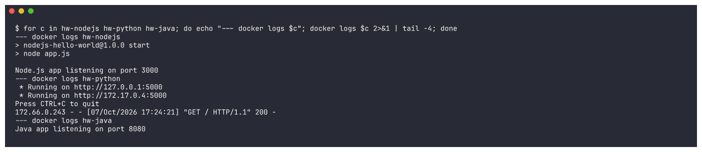

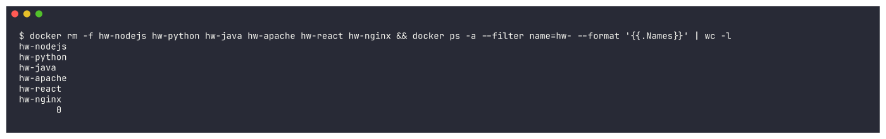
