# Docker Networking & Volumes - Homework

Exercises covering how containers network with one another, the host network driver, bind mounts, and overlay networks.

## Task 1: Docker Container Networking

Three containers were set up - frontend, backend, and database - spread over three networks, and the **backend was attached to more than one network** so that it could sit between the frontend and the database.

| Container | Image | Network(s) |
|---|---|---|
| frontend | nginx:alpine | frontend-net |
| backend | nginx:alpine | backend-net + frontend-net + db-net |
| database | nginx:alpine | db-net |

> Note: `nginx:alpine` fills in for the database tier here because there was not enough disk
> space on the VM to download the full `mysql:8.0` image. None of that changes what is being
> demonstrated - membership in several networks, name-based DNS, and isolation between
> networks all behave exactly the same.

### Create 3 networks
```bash
docker network create frontend-net
docker network create backend-net
docker network create db-net
docker network ls
```

### Create the 3 containers
```bash
docker run -d --name frontend --network frontend-net nginx:alpine
docker run -d --name database --network db-net -e MYSQL_ROOT_PASSWORD=rootpass mysql:8.0
docker run -d --name backend  --network backend-net nginx:alpine
```

### Add the backend to 2 more networks
```bash
docker network connect frontend-net backend
docker network connect db-net backend

# backend is on networks: backend-net db-net frontend-net
```

### Check connectivity
```bash
# backend -> frontend (shared frontend-net): SUCCESS
docker exec backend wget -qO- http://frontend        # returns nginx welcome page

# backend -> database (shared db-net): SUCCESS
docker exec backend nc -z database 3306              # port 3306 reachable

# frontend -> database (different networks): FAILS (isolated)
docker exec frontend nc -z database 3306             # nc: bad address 'database'
```

**What I understood:** Any two containers sharing a Docker network can find each other simply
by container name, because Docker runs DNS for them. Put them on separate networks and they
are cut off from one another. Giving the backend membership in several networks lets it reach
the frontend and the database at once, yet the frontend still has no route to the database -
exactly the arrangement a real three-tier application uses to keep its database private.

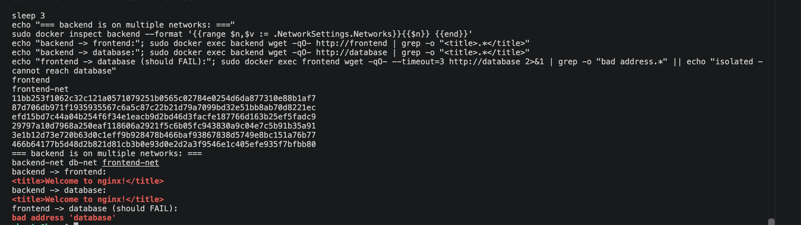

## Task 2: Host Network

```bash
docker run -d --name web-host --network host nginx:alpine
docker ps          # note: host network shows NO port mapping
curl http://localhost:80    # returns the nginx welcome page
```

**What I understood:** Running with `--network host` hands the container the host's own
networking stack, so publishing ports with `-p` becomes unnecessary and the service answers
straight away on port 80 of the host.

> Note: the image used here is `nginx:alpine` rather than `httpd:2.4`, as the VM had run out
> of disk space. Host networking behaves identically either way - the server answers on the
> host's own port 80 without any `-p` flag. Directly on a Linux host that means
> `http://localhost:80` works as expected; under Docker Desktop on Mac or Windows the bind
> happens inside the Docker VM instead of on the Mac's own localhost.

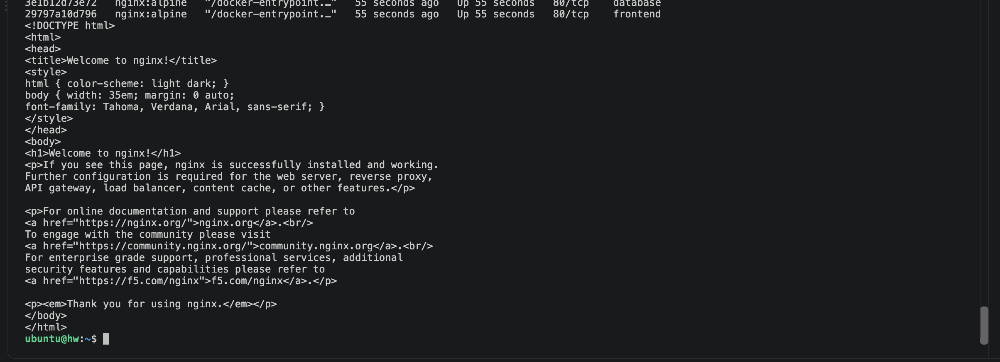

## Task 3: Bind Mount

```bash
# Create a local folder and file
mkdir site
echo "<h1>Hello students</h1>" > site/index.html

# Bind mount the folder into Nginx
docker run -d --name nginx-bind -p 8090:80 -v "$(pwd)/site":/usr/share/nginx/html:ro nginx:alpine

# Access it
curl http://localhost:8090      # <h1>Hello students</h1>

# Modify the file WITHOUT restarting the container
echo "<h1>Hello students - content updated live!</h1>" > site/index.html
curl http://localhost:8090      # <h1>Hello students - content updated live!</h1>
```

**What I understood:** A bind mount wires a directory from my own machine straight through
into the container. Whatever I change in the local copy shows up inside the container right
away, with no rebuild and no restart involved, which makes it a natural fit while developing.

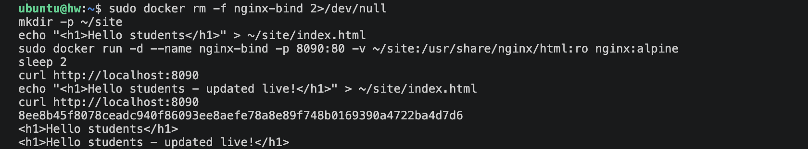

## Task 4: Overlay Network (Research)

**What it is:** Overlay networking ties together containers that are running on **separate
Docker hosts** - different machines, physical or virtual - so that they act as though they all
share one network.

**How it works:** Docker builds a virtual network stretching across several hosts. Container
traffic is wrapped up using VXLAN and carried over the real network between those hosts, which
lets a container on Host A address a container on Host B by name without either host having to
publish ports. Some cluster manager or key-value store has to back this, and in practice that
role is filled by **Docker Swarm** (or Kubernetes).

**Use cases:**
- Letting containers on different hosts in a cluster communicate.
- Docker Swarm services whose containers are spread across many nodes.
- Microservices sitting on separate servers that still need a secure path to each other.

**Bridge vs Overlay:**
| | Bridge network | Overlay network |
|---|---|---|
| Scope | Single host | Multiple hosts |
| Use case | Containers on one machine | Containers across a cluster |
| Needs orchestrator | No | Yes (Swarm/Kubernetes) |

**Example (on a Swarm):**
```bash
docker swarm init
docker network create -d overlay my-overlay
docker service create --name web --network my-overlay nginx
```

## Cleanup commands used
```bash
docker rm -f frontend backend database apache-host nginx-bind
docker network rm frontend-net backend-net db-net
```

---

## Redo with the exact images the assignment asks for

The first attempt above had to use `nginx:alpine` in place of **MySQL** (Task 1) and **Apache** (Task 2) because the VM ran out of disk space. I redid both with the real images on my laptop (Docker Desktop on macOS) and captured all the output. I also re-ran the bind mount with proof that the container was not restarted, and checked overlay networking. Full text output is in [`outputs/`](outputs/). Containers and networks have an `hw-` prefix for this run.

### Task 1 (redo): frontend + backend + **MySQL** on 3 networks

| Container | Image | Network(s) |
|---|---|---|
| hw-frontend | nginx:alpine | hw-frontend-net |
| hw-backend | nginx:alpine | hw-backend-net, **plus 2 more:** hw-frontend-net and hw-db-net |
| hw-database | **mysql:8.0** | hw-db-net |

```bash
docker network create hw-frontend-net
docker network create hw-backend-net
docker network create hw-db-net

docker run -d --name hw-frontend --network hw-frontend-net nginx:alpine
docker run -d --name hw-backend  --network hw-backend-net  nginx:alpine
docker run -d --name hw-database --network hw-db-net -e MYSQL_ROOT_PASSWORD=rootpass -e MYSQL_DATABASE=appdb mysql:8.0

# add the backend to 2 networks
docker network connect hw-frontend-net hw-backend
docker network connect hw-db-net hw-backend
```

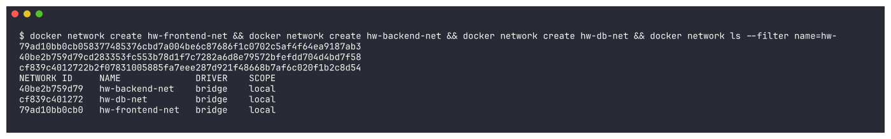
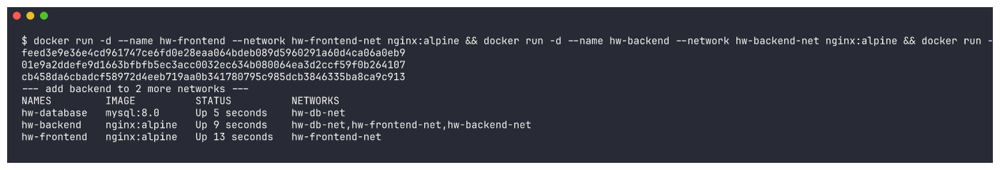

The backend has one IP on each of its three networks, and each network lists the containers attached to it:

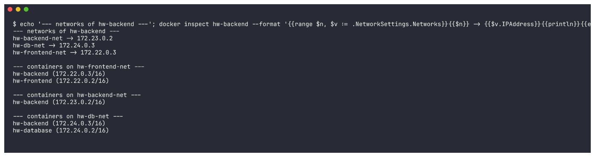

**Connectivity checks:**
```
1) backend -> frontend (share hw-frontend-net)
<title>Welcome to nginx!</title>
2 packets transmitted, 2 packets received, 0% packet loss

2) backend -> database (share hw-db-net)
hw-database (172.24.0.2:3306) open
2 packets transmitted, 2 packets received, 0% packet loss

3) MySQL query from inside the backend network namespace
mysql_version
8.0.46
Database
appdb
...

4) frontend -> database (no shared network, should FAIL)
ping: bad address 'hw-database'
nc: bad address 'hw-database'

5) frontend -> backend works (share hw-frontend-net)
<title>Welcome to nginx!</title>
```
For check 3 I ran the `mysql` client with `--network container:hw-backend`, so it shared the backend container's network stack. That shows the backend can log in to MySQL and query it, not just open port 3306.

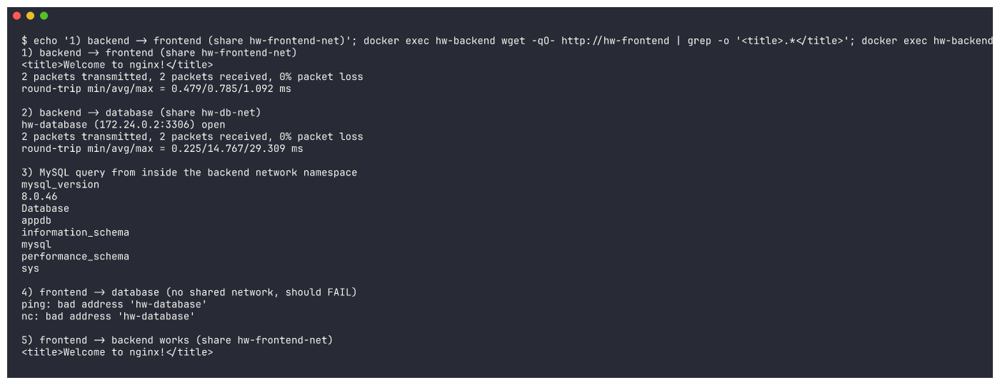

The isolation does not depend on DNS. Even with the database's IP address, the frontend cannot connect, while the backend can:
```
database IP = 172.24.0.2
--- frontend -> database by IP (different network) ---
nc: 172.24.0.2 (172.24.0.2:3306): Operation timed out
--- backend -> database by IP (shared hw-db-net) ---
172.24.0.2 (172.24.0.2:3306) open
```
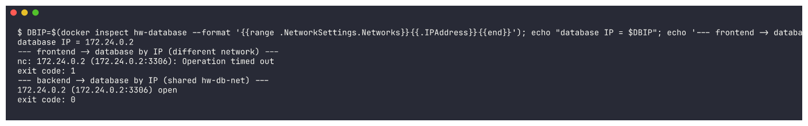

### Task 2 (redo): **Apache2 (`httpd:2.4`)** on the host network, port 80

```bash
docker pull httpd:2.4
docker run -d --name hw-apache-host --network host httpd:2.4
```
`docker ps` shows the `host` network and **no port mapping**. `docker inspect` shows `NetworkMode=host` and empty `PortBindings`, so no `-p` flag was used:

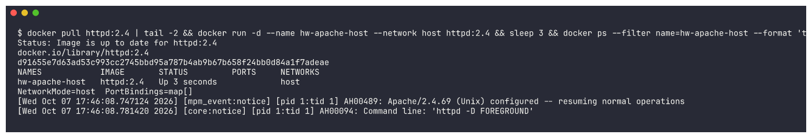

Accessing port 80:
```
--- 1) from the Docker host (Docker Desktop Linux VM network namespace) on port 80 ---
<title>It works! Apache httpd</title>
<p>It works!</p>
--- listening socket on port 80 in the host network namespace ---
tcp        0      0 :::80                   :::*                    LISTEN
--- 2) from my Mac (macOS) on port 80 ---
curl: (7) Failed to connect to localhost port 80 after 0 ms: Couldn't connect to server
```
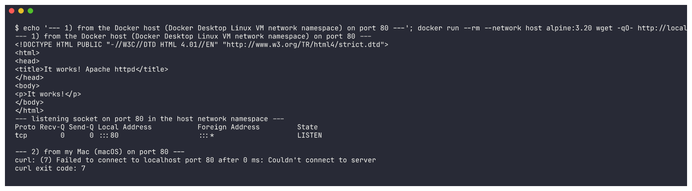

**Why it fails from macOS:** on Docker Desktop for Mac, the "host" in `--network host` is Docker Desktop's Linux VM, not macOS. Apache really is listening on port 80 of the Docker host. Any container started with `--network host` reaches it at `localhost:80`, and `netstat` shows the socket. macOS itself cannot reach it unless Docker Desktop's *Enable host networking* option (Settings > Resources > Network) is turned on. I left that setting alone. On a real Linux host, such as my Ubuntu VM in the first attempt, `curl http://localhost:80` works directly.

### Task 3 (re-run): bind mount with proof of no restart

```bash
mkdir -p site && echo '<h1>Hello students</h1>' > site/index.html
docker run -d --name hw-nginx-bind -p 18095:80 -v "$PWD/site":/usr/share/nginx/html:ro nginx:alpine
curl -s http://localhost:18095          # <h1>Hello students</h1>
```
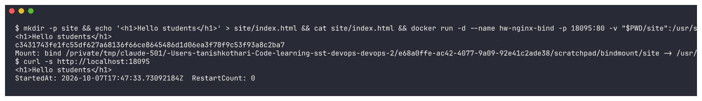

Then I edited `site/index.html` on my laptop **without touching the container**:
```
$ curl -s http://localhost:18095
<h1>Hello students - updated live without restarting the container!</h1>
--- inside the container ---
<h1>Hello students - updated live without restarting the container!</h1>
StartedAt: 2026-10-07T17:47:33.73092184Z  RestartCount: 0
```
`StartedAt` is identical before and after the edit and `RestartCount` is `0`, so the change was picked up live.

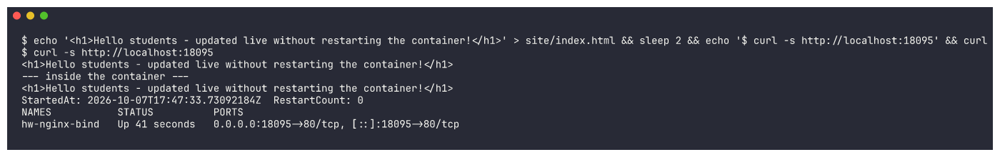

> Gotcha I hit: on my first try I ran `curl` in the same instant as the edit. Nginx returned the new text **cut off at the old file's length** (`<h1>Hello students - edi`), because Docker Desktop's macOS file sharing needs a moment to pass the new file size to the VM. A second later the full page came back. ([screenshot](screenshots/hw2-bind-02a-immediate.png))

### Task 4: overlay network, hands-on check and more research

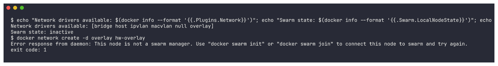

```
Network drivers available: [bridge host ipvlan macvlan null overlay]
Swarm state: inactive
$ docker network create -d overlay hw-overlay
Error response from daemon: This node is not a swarm manager. Use "docker swarm init" or "docker swarm join" ...
```
This confirms in practice what the research above says: the `overlay` driver is installed, but it only works when the engine is part of a Swarm, because Swarm's managers store and share the network's state across hosts. I did not run `swarm init` on my laptop, because it would switch the shared Docker engine into swarm mode.

**How overlay works across multiple hosts (in more detail):**
- **Control plane:** the Swarm managers keep the overlay network's definition in their Raft store, and nodes exchange container IP-to-MAC-to-host mappings over a gossip protocol, so every host knows where each container lives.
- **Data plane:** when a container on Host A sends a packet to a container on Host B, Docker's VXLAN tunnel endpoint on Host A wraps the Ethernet frame in a **VXLAN/UDP packet (port 4789)** and sends it to Host B's real IP. Host B unwraps it and delivers it to the container. To the containers it looks like a single flat L2 network.
- **Ports to open between hosts:** TCP 2377 (cluster management), TCP/UDP 7946 (node gossip), UDP 4789 (VXLAN data).
- **Service discovery and load balancing:** a service name resolves to a virtual IP, and traffic is balanced across replicas on any node. The built-in `ingress` overlay network implements the *routing mesh*, so a published port answers on every node.
- **Options:** `--attachable` lets standalone `docker run` containers join the network, not only services. `--opt encrypted` adds IPsec encryption for the VXLAN traffic between hosts.
- **Use cases:** multi-host Swarm services, microservices spread across several servers, and HA setups where replicas sit on different machines but still talk to each other by service name. (Kubernetes solves the same problem with CNI plugins such as Flannel/Calico, which often use VXLAN as well.)

```bash
# On manager (Host A)
docker swarm init --advertise-addr <hostA-ip>
docker network create -d overlay --attachable my-overlay
# On worker (Host B)
docker swarm join --token <token> <hostA-ip>:2377
# Service spread across both hosts, reachable by name over the overlay
docker service create --name web --replicas 2 --network my-overlay nginx
```

### Cleanup
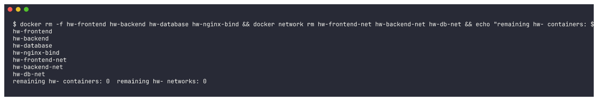
