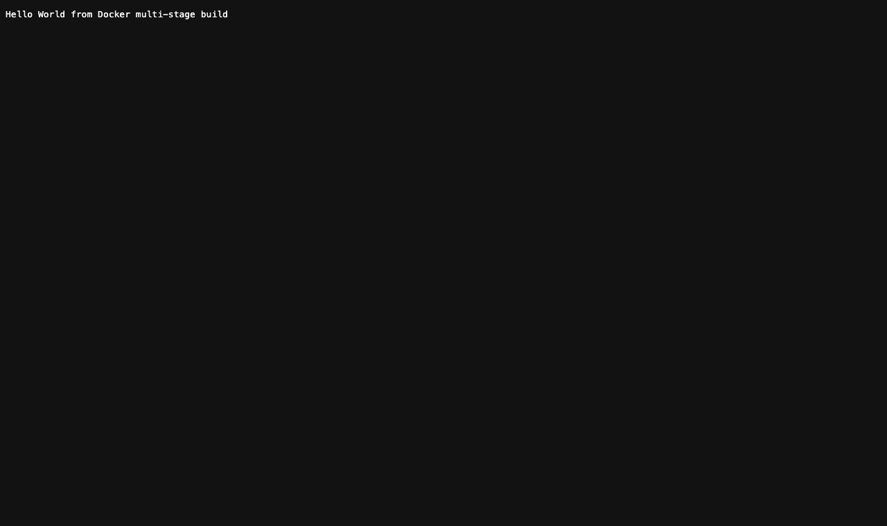
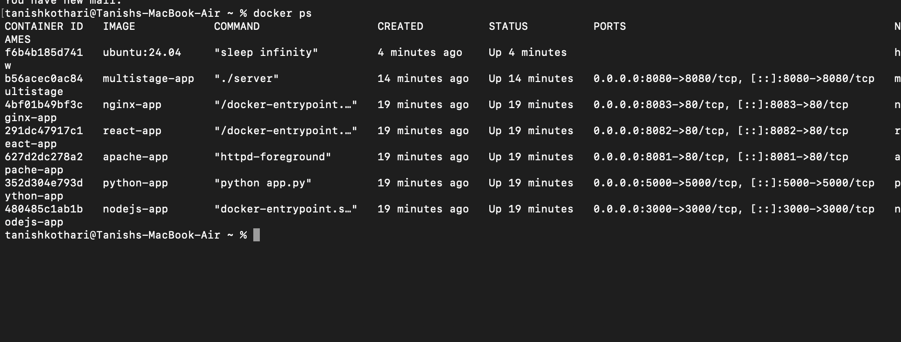

# Docker Multi-Stage Build - Homework

**Name:** Tanish Kothari
**Enrollment Number:** 24BCS10008

## Task 1: Multi-Stage Dockerfile

In a multi-stage build a single Dockerfile declares several `FROM` stages. The earlier stage
handles compilation, and the last stage pulls across nothing but the built binary, dropping it
into a minimal base image. Because everything needed to compile - in this case the entire Go
toolchain - never reaches the final stage, the resulting image stays very small.

### The application (main.go)
```go
package main

import (
	"fmt"
	"net/http"
)

func main() {
	http.HandleFunc("/", func(w http.ResponseWriter, r *http.Request) {
		fmt.Fprintln(w, "Hello World from Docker multi-stage build")
	})

	fmt.Println("Server listening on port 8080")
	http.ListenAndServe(":8080", nil)
}
```

### The multi-stage Dockerfile
```dockerfile
# ---- Stage 1: Build ----
FROM golang:1.23-alpine AS build
WORKDIR /app
COPY main.go ./
RUN CGO_ENABLED=0 go build -o server main.go

# ---- Stage 2: Run ----
FROM alpine:3.20
WORKDIR /app
COPY --from=build /app/server ./
EXPOSE 8080
CMD ["./server"]
```

### Build and run
```bash
docker build -t multistage-app .
docker run -d -p 8080:8080 --name multistage multistage-app
```

### Verify the application
```bash
$ curl http://localhost:8080
Hello World from Docker multi-stage build
```

### Verify the running container (docker ps)
```bash
$ docker ps
NAMES        IMAGE            STATUS         PORTS
multistage   multistage-app   Up 2 seconds   0.0.0.0:8080->8080/tcp
```
This confirms the app is up and serving on **port 8080**.

### Result of multi-stage build
What comes out is an image of roughly **25 MB**, the reason being that the source and the Go
compiler never leave the build stage - only the finished binary is carried into the Alpine
image at the end.

## Task 2: Screenshots

The application responding correctly when opened in a browser:



Output of `docker ps`, with the container up and mapped to port 8080:



## Task 3: Docker Application Deployment

Docker was used to deploy three applications built on different stacks; the complete sources
and their Dockerfiles live in the `Docker Fundamentals` folder:

| Application | Language / Stack | Port | Output |
|---|---|---|---|
| Node.js | Node.js (http server) | 3000 | Hello World from Node.js! |
| Python | Python (Flask) | 5000 | Hello World from Python (Flask)! |
| Java | Java (HttpServer) | 8080 | Hello World from Java! |

Example of building and running one of them, using Node.js:
```bash
cd nodejs-app
docker build -t nodejs-app .
docker run -d -p 3000:3000 nodejs-app
# open http://localhost:3000
```

Captures of each of the three applications while running:


