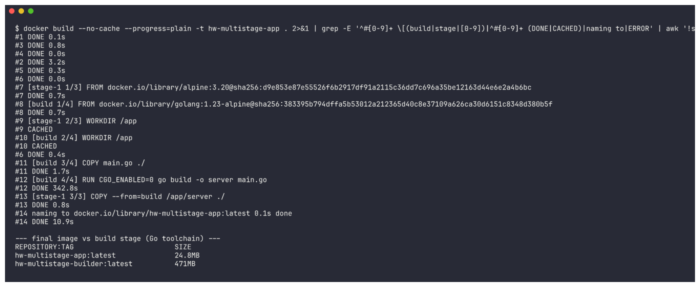
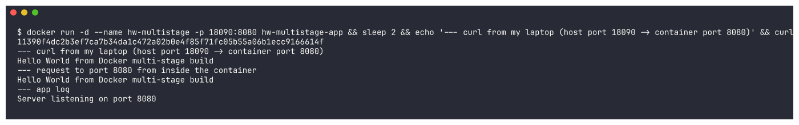
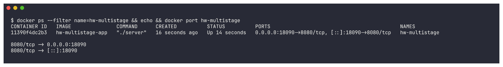
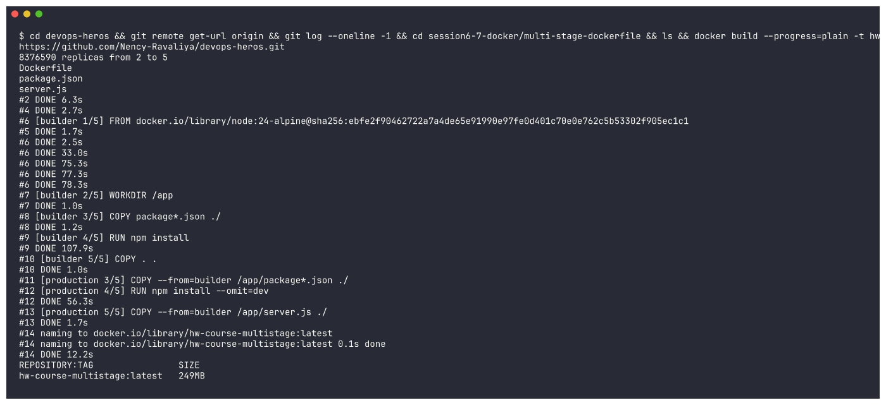
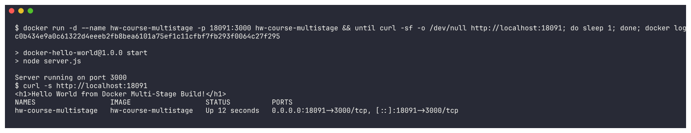

# Docker Multi-Stage Build - Homework

**Name:** Tanish Kothari
**Enrollment Number:** 24BCS10008

## Task 1: Multi-Stage Dockerfile

In a multi-stage build a single Dockerfile declares several `FROM` stages. The earlier stage
handles compilation, and the last stage pulls across nothing but the built binary, dropping it
into a minimal base image. Because everything needed to compile - in this case the entire Go
toolchain - never reaches the final stage, the resulting image stays very small.

### The application (main.go)
```go
package main

import (
	"fmt"
	"net/http"
)

func main() {
	http.HandleFunc("/", func(w http.ResponseWriter, r *http.Request) {
		fmt.Fprintln(w, "Hello World from Docker multi-stage build")
	})

	fmt.Println("Server listening on port 8080")
	http.ListenAndServe(":8080", nil)
}
```

### The multi-stage Dockerfile
```dockerfile
# ---- Stage 1: Build ----
FROM golang:1.23-alpine AS build
WORKDIR /app
COPY main.go ./
RUN CGO_ENABLED=0 go build -o server main.go

# ---- Stage 2: Run ----
FROM alpine:3.20
WORKDIR /app
COPY --from=build /app/server ./
EXPOSE 8080
CMD ["./server"]
```

### Build and run
```bash
docker build -t multistage-app .
docker run -d -p 8080:8080 --name multistage multistage-app
```

### Verify the application
```bash
$ curl http://localhost:8080
Hello World from Docker multi-stage build
```

### Verify the running container (docker ps)
```bash
$ docker ps
NAMES        IMAGE            STATUS         PORTS
multistage   multistage-app   Up 2 seconds   0.0.0.0:8080->8080/tcp
```
This confirms the app is up and serving on **port 8080**.

### Result of multi-stage build
What comes out is an image of roughly **25 MB**, the reason being that the source and the Go
compiler never leave the build stage - only the finished binary is carried into the Alpine
image at the end.

## Task 2: Screenshots

The application responding correctly when opened in a browser:


Output of `docker ps`, with the container up and mapped to port 8080:


## Task 3: Docker Application Deployment

Docker was used to deploy three applications built on different stacks; the complete sources
and their Dockerfiles live in the `Docker Fundamentals` folder:

| Application | Language / Stack | Port | Output |
|---|---|---|---|
| Node.js | Node.js (http server) | 3000 | Hello World from Node.js! |
| Python | Python (Flask) | 5000 | Hello World from Python (Flask)! |
| Java | Java (HttpServer) | 8080 | Hello World from Java! |

Example of building and running one of them, using Node.js:
```bash
cd nodejs-app
docker build -t nodejs-app .
docker run -d -p 3000:3000 nodejs-app
# open http://localhost:3000
```

Captures of each of the three applications while running:


---

## Re-verification with captured output

To back up the snippets above with real output, I rebuilt and re-ran everything and captured the terminal output. The full text is in [`outputs/`](outputs/).

> Port `8080` **on my laptop** is now used by another project, so for this re-run I published the container's port **8080** on host port **18090** (`-p 18090:8080`). The app inside the container still listens on **8080**, as `docker ps`, `docker port` and the request made from inside the container all show. The earlier `docker-ps.png` screenshot shows the original run published straight on `0.0.0.0:8080->8080/tcp`.

### Build: multi-stage keeps the image small
```bash
docker build -t hw-multistage-app .                        # final image (alpine + binary)
docker build --target build -t hw-multistage-builder .     # just the build stage, for comparison
```
```
REPOSITORY:TAG                        SIZE
hw-multistage-app:latest              24.8MB
hw-multistage-builder:latest          471MB
```
The final image is **24.8MB**, compared with **471MB** for the build stage that has the Go toolchain, so the size really is about 25MB as stated above.



### Run and access the application
```
--- curl from my laptop (host port 18090 -> container port 8080)
Hello World from Docker multi-stage build
--- request to port 8080 from inside the container
Hello World from Docker multi-stage build
--- app log
Server listening on port 8080
```


### `docker ps`: container running on port 8080
```
CONTAINER ID   IMAGE               COMMAND      CREATED          STATUS          PORTS                                           NAMES
11390f4dc2b3   hw-multistage-app   "./server"   16 seconds ago   Up 14 seconds   0.0.0.0:18090->8080/tcp, [::]:18090->8080/tcp   hw-multistage

8080/tcp -> 0.0.0.0:18090
8080/tcp -> [::]:18090
```


### Bonus: the multi-stage Dockerfile from the cloned course repo
Task 1 says to clone the repository with the multi-stage Dockerfile. I also built the course's own example from my clone of `https://github.com/Nency-Ravaliya/devops-heros` (`session6-7-docker/multi-stage-dockerfile`, a Node/Express app). It uses a `builder` stage for `npm install` and a `production` stage with `npm install --omit=dev`. That app listens on port 3000, so I published it on host port 18091:

```
Server running on port 3000
$ curl -s http://localhost:18091
<h1>Hello World from Docker Multi-Stage Build!</h1>
NAMES                  IMAGE                  STATUS          PORTS
hw-course-multistage   hw-course-multistage   Up 12 seconds   0.0.0.0:18091->3000/tcp, [::]:18091->3000/tcp
```



### Task 3 evidence: build, run and curl output
Terminal evidence for the Node.js, Python and Java deployments (plus Apache, React and Nginx) is in the Docker Fundamentals folder:


