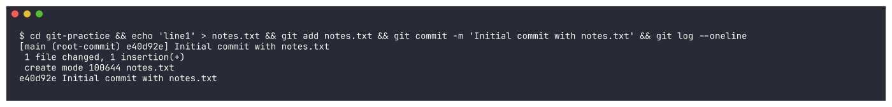
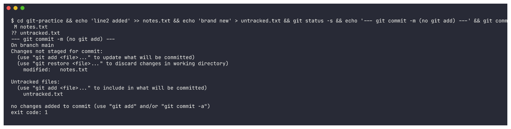
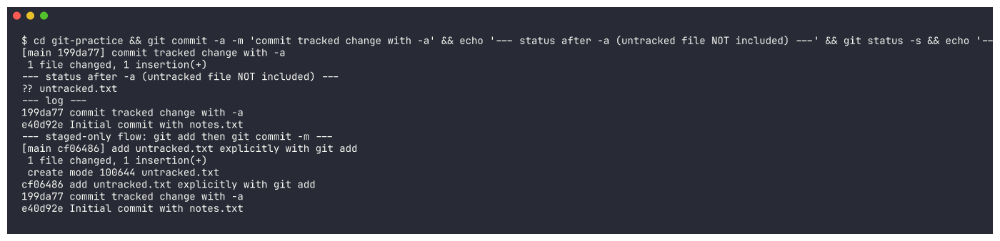
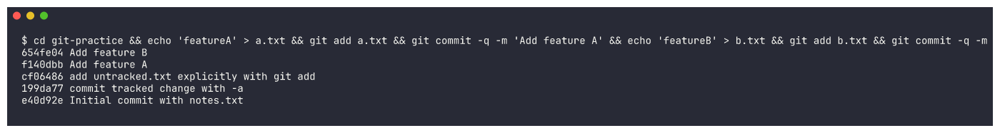
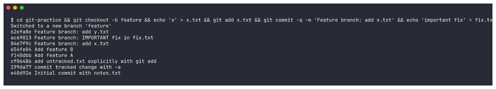
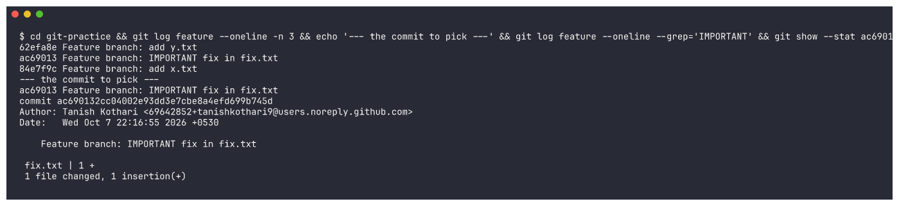
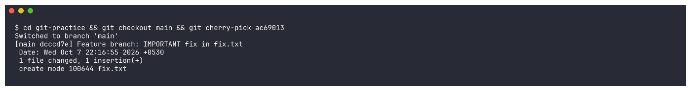
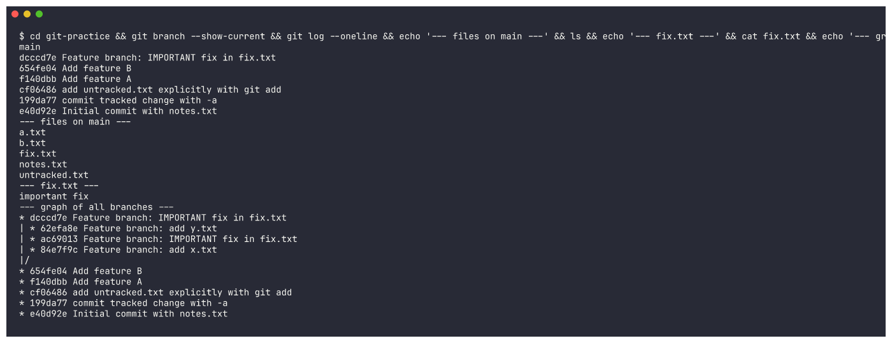

# Git Fundamentals - Homework

Worked exercises comparing `git commit -a -m` against `git commit -m`, followed by `git cherry-pick`, with every command and its real output recorded.

## Task 1: git commit -a -m vs git commit -m

### The difference
- `git commit -m "message"` records **nothing but what has already been staged** through `git add`.
- `git commit -a -m "message"` rolls two steps into one: it **stages every tracked file that was modified or deleted** and then commits them. (Worth noting: `-a` skips files git has never seen before, so untracked files still require `git add`.)

### Test and output
Begin from a file that is already committed, then edit it:
```bash
echo "line1" > notes.txt
git add notes.txt
git commit -m "Initial commit with notes.txt"

echo "line2 added" >> notes.txt
git status -s
```
Output:
```
 M notes.txt
```

Attempt a commit using only `-m`, leaving `-a` off:
```bash
$ git commit -m "try without -a"
On branch main
Changes not staged for commit:
  (use "git add <file>..." to update what will be committed)
  (use "git restore <file>..." to discard changes in working directory)
	modified:   notes.txt
```
No commit was created, since nothing had been moved into the staging area.

This time run it with `-a -m`:
```bash
$ git commit -a -m "commit tracked change with -a"
[main 2a47f0b] commit tracked change with -a
 1 file changed, 1 insertion(+)

$ git log --oneline
2a47f0b commit tracked change with -a
b16997c Initial commit with notes.txt
```

**What I understood:** Think of `-a` as a convenience flag that stages edits to already-tracked files for me, saving a separate `git add`. On its own, `git commit -m` captures only what I staged by hand. Files git has never tracked stay out of the commit either way.


## Task 2: git cherry-pick

A cherry-pick lifts **one particular commit** off another branch and replays it on the branch I am currently on, leaving the rest of that branch behind.

### Step 1 - Create commits on main
```bash
echo "featureA" > a.txt; git add a.txt; git commit -m "Add feature A"
echo "featureB" > b.txt; git add b.txt; git commit -m "Add feature B"
git log --oneline
```
```
b536f04 Add feature B
5a40d21 Add feature A
2a47f0b commit tracked change with -a
b16997c Initial commit with notes.txt
```

### Step 2 - Create a new branch and make commits on it
```bash
git checkout -b feature
echo "x" > x.txt; git add x.txt; git commit -m "Feature branch: add x.txt"
echo "important fix" > fix.txt; git add fix.txt; git commit -m "Feature branch: IMPORTANT fix in fix.txt"
echo "y" > y.txt; git add y.txt; git commit -m "Feature branch: add y.txt"
git log --oneline
```
```
7aa7fa8 Feature branch: add y.txt
48d103f Feature branch: IMPORTANT fix in fix.txt
92def40 Feature branch: add x.txt
b536f04 Add feature B
5a40d21 Add feature A
...
```

### Step 3 - Identify the specific commit
The one I am after is the IMPORTANT fix, hash `48d103f`.

### Step 4 - Cherry-pick that one commit onto main
```bash
git checkout main
git cherry-pick 48d103f
```
```
[main b7d3296] Feature branch: IMPORTANT fix in fix.txt
 1 file changed, 1 insertion(+)
 create mode 100644 fix.txt
```

### Step 5 - Verify
```bash
$ git log --oneline
b7d3296 Feature branch: IMPORTANT fix in fix.txt
b536f04 Add feature B
5a40d21 Add feature A
2a47f0b commit tracked change with -a
b16997c Initial commit with notes.txt

$ ls
a.txt  b.txt  fix.txt  notes.txt
```
Main now carries `fix.txt`, while `x.txt` and `y.txt` are **absent** - clear evidence that only the single chosen commit came across rather than the entire branch.

**What I understood:** With `cherry-pick` I can name a commit by its hash and bring just that change onto my branch, skipping a full merge. It is ideal when only one bug fix from a branch is worth having and the surrounding work is not.


## Screenshot Evidence (re-run)

The submission asks for screenshots **or** an `.md` file. To have both, I re-ran the whole exercise in a fresh throwaway repo (`git-practice/`) and captured every step. Commit hashes differ from the walkthrough above because it is a new repo. The full text output of each step is in [`outputs/`](outputs/).

### Task 1: `git commit -m` vs `git commit -a -m`

1. Initial commit:



2. Edited the tracked `notes.txt` and created a new `untracked.txt`, then ran `git commit -m` without `git add`. Git refuses (exit code 1) with `no changes added to commit (use "git add" and/or "git commit -a")`:



3. `git commit -a -m` stages and commits the modified tracked file by itself. `untracked.txt` still shows `??` afterwards, so `-a` never picks up new files. Those still need `git add` before `git commit -m`:



### Task 2: Cherry-pick

4. Two more commits on `main` (`Add feature A`, `Add feature B`), shown with `git log`:



5. Created the `feature` branch and made 3 commits on it:



6. Used `git log` to find the commit I wanted: `ac69013`, the IMPORTANT fix:



7. Switched back to `main` and ran `git cherry-pick ac69013`. Git created a new commit `dcccd7e` on main with the same change:



8. Checked the result. `main` now has `fix.txt` (content `important fix`), but `x.txt` and `y.txt` from the feature branch are not there. The graph shows only that one commit was copied:


