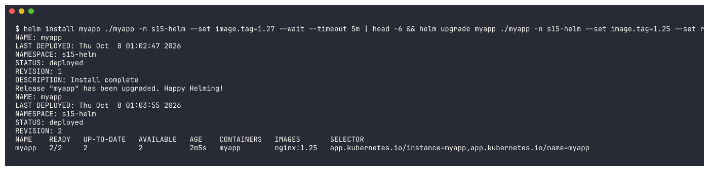
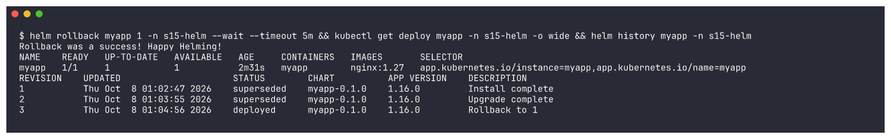
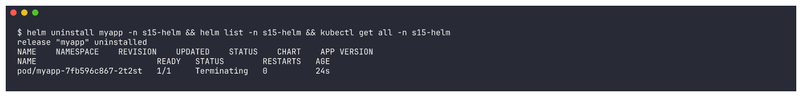
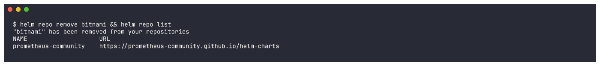
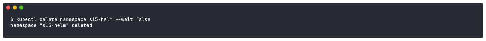

# Task 1: Helm Commands

Every Helm command from the session, executed with **Helm v4.3.0** against minikube. For each: the
command, what it does, its real output (trimmed) and a screenshot. Chart used: `myapp/`, generated with
`helm create` in this folder (release `myapp`, namespace `s15-helm`).

| Command | Purpose |
|---|---|
| `helm create` | scaffold a new chart |
| `helm lint` / `helm template` | validate / render a chart locally (no cluster needed) |
| `helm repo add / list / update / remove` | manage chart repositories |
| `helm search repo` / `helm search hub` | find charts in added repos / on Artifact Hub |
| `helm show chart` | inspect a chart from a repo |
| `helm install` | create a release (revision 1) |
| `helm list` | list releases |
| `helm status` | status + resources of one release |
| `helm get values / manifest / all` | what a release was deployed with |
| `helm upgrade` | new revision with a new chart/values |
| `helm history` | all revisions of a release |
| `helm rollback` | redeploy an older revision (as a new revision) |
| `helm uninstall` | delete the release and its resources |

---

## helm version
```bash
helm version
```
```text
version.BuildInfo{Version:"v4.3.0", GitCommit:"bec5b06ed841fe5269972d864d5177944fd5970f", GitTreeState:"clean", GoVersion:"go1.27.1", KubeClientVersion:"v1.37"}
```


## helm create
Generates a complete, working chart skeleton (an nginx Deployment, Service, ServiceAccount, optional
Ingress/HTTPRoute/HPA, a test hook, `_helpers.tpl` and `NOTES.txt`).
```bash
helm create myapp && ls -R myapp
```
```text
Creating myapp
Chart.yaml
charts
templates
values.yaml

myapp/templates:
NOTES.txt
_helpers.tpl
deployment.yaml
hpa.yaml
httproute.yaml
ingress.yaml
service.yaml
serviceaccount.yaml
tests

myapp/templates/tests:
test-connection.yaml
```


The two files you edit most:
```bash
cat myapp/Chart.yaml | grep -v "^#" | grep -v "^$"
grep -E "^replicaCount|^image:|^  repository|^  tag|^service:|^  type|^  port" myapp/values.yaml
```
```text
apiVersion: v2
name: myapp
description: A Helm chart for Kubernetes
type: application
version: 0.1.0          <- chart version
appVersion: "1.16.0"    <- app version (used as the default image tag)
---
replicaCount: 1
image:
  repository: nginx
  tag: ""               <- empty = use appVersion
service:
  type: ClusterIP
  port: 80
```


## helm lint
Checks the chart for errors and best-practice issues.
```bash
helm lint myapp
```
```text
==> Linting myapp
[INFO] Chart.yaml: icon is recommended

1 chart(s) linted, 0 chart(s) failed
```


## helm template
Renders the templates locally to plain YAML, exactly what `install` would send - great for checking
`{{ }}` substitutions without touching the cluster.
```bash
helm template demo myapp --set replicaCount=2 | grep -E "^# Source|^kind:|replicas:|image:"
```
```text
# Source: myapp/templates/serviceaccount.yaml
kind: ServiceAccount
# Source: myapp/templates/service.yaml
kind: Service
# Source: myapp/templates/deployment.yaml
kind: Deployment
  replicas: 2
          image: "nginx:1.16.0"
# Source: myapp/templates/tests/test-connection.yaml
kind: Pod
      image: busybox
```


`--set replicaCount=2` overrode `values.yaml`, and the empty tag fell back to `appVersion` 1.16.0.

---

## helm repo add / list / update
```bash
helm repo add bitnami https://charts.bitnami.com/bitnami
```
```text
"bitnami" has been added to your repositories
```


```bash
helm repo list
```
```text
NAME                	URL
prometheus-community	https://prometheus-community.github.io/helm-charts
bitnami             	https://charts.bitnami.com/bitnami
```


```bash
helm repo update bitnami
```
```text
Hang tight while we grab the latest from your chart repositories...
...Successfully got an update from the "bitnami" chart repository
Update Complete. ⎈Happy Helming!⎈
```


## helm search repo
Searches the repositories you have added (local index).
```bash
helm search repo bitnami/nginx; helm search repo nginx --versions | head -6
```
```text
NAME                            	CHART VERSION	APP VERSION	DESCRIPTION
bitnami/nginx                   	25.2.1       	1.31.6     	NGINX Open Source is a web server that can be a...
bitnami/nginx-ingress-controller	12.0.7       	1.13.1     	NGINX Ingress Controller is an Ingress controll...
bitnami/nginx-intel             	2.1.15       	0.4.9      	DEPRECATED NGINX Open Source for Intel is a lig...

NAME           	CHART VERSION	APP VERSION
bitnami/nginx  	25.2.1       	1.31.6
bitnami/nginx  	25.2.0       	1.31.6
bitnami/nginx  	25.1.15      	1.31.6
...
```


## helm search hub
Searches **Artifact Hub** (all public charts) - no `repo add` needed.
```bash
helm search hub nginx --max-col-width 60 | head -12
```
```text
URL                                                         	CHART VERSION  	APP VERSION	DESCRIPTION
https://artifacthub.io/packages/helm/cloudpirates-nginx/n...	0.16.12        	1.31.6     	Nginx is a high-performance HTTP server and reverse proxy.
https://artifacthub.io/packages/helm/bitnami/nginx          	25.2.1         	1.31.6     	NGINX Open Source is a web server that can be also used a...
...
```


## helm show chart
```bash
helm show chart bitnami/nginx | head -20
```


---

## helm install
```bash
helm install myapp ./myapp -n s15-helm --create-namespace --set image.tag=1.27
```
```text
NAME: myapp
LAST DEPLOYED: Thu Oct  8 00:28:39 2026
NAMESPACE: s15-helm
STATUS: deployed
REVISION: 1
DESCRIPTION: Install complete
NOTES:
1. Get the application URL by running these commands:
  export POD_NAME=$(kubectl get pods --namespace s15-helm -l "app.kubernetes.io/name=myapp,app.kubernetes.io/instance=myapp" ...)
  ...
```


(`--set image.tag=1.27` uses an nginx image already cached on the node.)

## helm list
```bash
helm list -n s15-helm; helm list -A | grep -E "NAME|s15"
```
```text
NAME 	NAMESPACE	REVISION	UPDATED                            	STATUS  	CHART      	APP VERSION
myapp	s15-helm 	1       	2026-10-08 00:28:39.37562 +0530 IST	deployed	myapp-0.1.0	1.16.0
```


What Helm created:
```bash
kubectl rollout status deployment/myapp -n s15-helm --timeout=240s; kubectl get all -n s15-helm
```


## helm status
```bash
helm status myapp -n s15-helm
```
```text
NAME: myapp
NAMESPACE: s15-helm
STATUS: deployed
REVISION: 1
RESOURCES:
==> v1/Service
myapp   ClusterIP   10.105.227.173   <none>        80/TCP    69s
==> v1/Deployment
myapp   1/1     1            1           68s
==> v1/Pod(related)
myapp-7fb596c867-dt8ph   1/1     Running   0          69s
==> v1/ServiceAccount
myapp   69s
```


## helm get values / manifest / all
```bash
helm get values myapp -n s15-helm              # only what I overrode
helm get values myapp -n s15-helm --all        # merged with chart defaults
```
```text
USER-SUPPLIED VALUES:
image:
  tag: "1.27"

COMPUTED VALUES:
affinity: {}
autoscaling:
  enabled: false
  maxReplicas: 100
...
```


```bash
helm get manifest myapp -n s15-helm | head -60   # the exact YAML that was applied
```


```bash
helm get all myapp -n s15-helm   # metadata + values + hooks + manifest + notes (section headers shown)
```
```text
NAME: myapp
REVISION: 1
CHART: myapp
VERSION: 0.1.0
APP_VERSION: 1.16.0
USER-SUPPLIED VALUES:
COMPUTED VALUES:
HOOKS:
# Source: myapp/templates/tests/test-connection.yaml
MANIFEST:
# Source: myapp/templates/serviceaccount.yaml
# Source: myapp/templates/service.yaml
# Source: myapp/templates/deployment.yaml
NOTES:
```


## helm upgrade
```bash
helm upgrade myapp ./myapp -n s15-helm --set image.tag=1.27 --set replicaCount=3
```
```text
Release "myapp" has been upgraded. Happy Helming!
STATUS: deployed
REVISION: 2
DESCRIPTION: Upgrade complete
```


```bash
kubectl rollout status deployment/myapp -n s15-helm --timeout=240s; kubectl get deploy,pods -n s15-helm -o wide; helm get values myapp -n s15-helm
```
```text
error: timed out waiting for the condition
deployment.apps/myapp   2/3     3            2           5m36s   myapp        nginx:1.27
pod/myapp-7fb596c867-9lqpq   1/1     Running   0               4m5s
pod/myapp-7fb596c867-dt8ph   1/1     Running   1 (3m54s ago)   5m36s
pod/myapp-7fb596c867-pwlpt   1/1     Running   0               4m5s
USER-SUPPLIED VALUES:
image:
  tag: "1.27"
replicaCount: 3
```


3 replicas were created (the 3rd was still becoming ready when the 240s `rollout status` wait ran out on
the overloaded node; all 3 Pods show `Running`).

## helm history
```bash
helm history myapp -n s15-helm
```
```text
REVISION	UPDATED                 	STATUS    	CHART      	APP VERSION	DESCRIPTION
1       	Thu Oct  8 00:28:39 2026	superseded	myapp-0.1.0	1.16.0     	Install complete
2       	Thu Oct  8 00:30:11 2026	deployed  	myapp-0.1.0	1.16.0     	Upgrade complete
```


## helm rollback - first attempt (failed, kept as real evidence)
```bash
helm rollback myapp 1 -n s15-helm
```
```text
level=WARN msg="Rollback \"myapp\" failed: could not get information about the resource: Get \"https://127.0.0.1:50992/api/v1/namespaces/s15-helm/services/myapp\": net/http: TLS handshake timeout"
Error: could not get information about the resource: ... net/http: TLS handshake timeout
REVISION  STATUS      DESCRIPTION
1         superseded  Install complete
2         superseded  Upgrade complete
3         failed      Rollback "myapp" failed: could not get information about the resource: ...
```


The Kubernetes **API server** itself timed out (shared, overloaded minikube). Note Helm still recorded the
attempt as revision 3 with status `failed` - history is never lost.

```bash
helm uninstall myapp -n s15-helm; helm list -n s15-helm; kubectl get all -n s15-helm
```


## helm rollback - re-run (success)
Once the API server was responsive again, I re-ran the install -> upgrade -> rollback cycle. `--wait`
makes Helm wait until the resources are actually ready:
```bash
helm install myapp ./myapp -n s15-helm --set image.tag=1.27 --wait --timeout 5m
helm upgrade myapp ./myapp -n s15-helm --set image.tag=1.25 --set replicaCount=2 --wait --timeout 5m
kubectl get deploy myapp -n s15-helm -o wide
```
```text
STATUS: deployed
REVISION: 1
Release "myapp" has been upgraded. Happy Helming!
REVISION: 2
NAME    READY   UP-TO-DATE   AVAILABLE   AGE    CONTAINERS   IMAGES
myapp   2/2     2            2           2m5s   myapp        nginx:1.25
```


```bash
helm rollback myapp 1 -n s15-helm --wait --timeout 5m && kubectl get deploy myapp -n s15-helm -o wide && helm history myapp -n s15-helm
```
```text
Rollback was a success! Happy Helming!
NAME    READY   UP-TO-DATE   AVAILABLE   AGE     CONTAINERS   IMAGES
myapp   1/1     1            1           2m31s   myapp        nginx:1.27
REVISION	UPDATED                 	STATUS    	CHART      	APP VERSION	DESCRIPTION
1       	Thu Oct  8 01:02:47 2026	superseded	myapp-0.1.0	1.16.0     	Install complete
2       	Thu Oct  8 01:03:55 2026	superseded	myapp-0.1.0	1.16.0     	Upgrade complete
3       	Thu Oct  8 01:04:56 2026	deployed  	myapp-0.1.0	1.16.0     	Rollback to 1
```


Back to revision 1's config (nginx:1.27, 1 replica) as new revision 3 `Rollback to 1`. The full rollback
workflow is in [../02-helm-rollback](../02-helm-rollback/README.md).

## helm uninstall
```bash
helm uninstall myapp -n s15-helm && helm list -n s15-helm && kubectl get all -n s15-helm
```
```text
release "myapp" uninstalled
NAME	NAMESPACE	REVISION	UPDATED	STATUS	CHART	APP VERSION
pod/myapp-7fb596c867-2t2st   1/1     Terminating   0          24s
```


The release is gone from `helm list` and Kubernetes is removing its Pods.

## helm repo remove (cleanup)
```bash
helm repo remove bitnami && helm repo list
```
```text
"bitnami" has been removed from your repositories
NAME                	URL
prometheus-community	https://prometheus-community.github.io/helm-charts
```


```bash
kubectl delete namespace s15-helm --wait=false
```

