# Task 2: Helm Rollback Workflow

Complete workflow: **Install -> Upgrade -> Verify -> Upgrade again -> Verify -> Rollback -> Verify**,
followed by two bonus rounds (rolling back a broken upgrade by hand, and automatic rollback with
`--rollback-on-failure`). Release `rollback-demo`, namespace `s15-rollback`, Helm v4.3.0.

## The chart (`app-chart/`, from the reference `07-install-upgrade`)

```yaml
# app-chart/values.yaml
replicaCount: 1
image:
  repository: nginx
  tag: "1.24"
```
```yaml
# app-chart/templates/deployment.yaml
apiVersion: apps/v1
kind: Deployment
metadata:
  name: {{ .Release.Name }}-app
spec:
  replicas: {{ .Values.replicaCount }}
  selector:
    matchLabels:
      app: {{ .Release.Name }}
  template:
    metadata:
      labels:
        app: {{ .Release.Name }}
    spec:
      containers:
        - name: app
          image: "{{ .Values.image.repository }}:{{ .Values.image.tag }}"
          ports:
            - containerPort: 80
```

Every revision changes **image tag and replica count**, so each step is easy to see:

| Revision | Action | Image | Replicas |
|---|---|---|---|
| 1 | install | nginx:1.24 | 1 |
| 2 | upgrade | nginx:1.25 | 2 |
| 3 | upgrade again | nginx:1.27 | 3 |
| 4 | **rollback to 2** | nginx:1.25 | 2 |

The "verify" command used after every step:
```bash
kubectl get deploy rollback-demo-app -n s15-rollback -o custom-columns=DEPLOYMENT:.metadata.name,REPLICAS:.spec.replicas,READY:.status.readyReplicas,IMAGE:.spec.template.spec.containers[0].image
kubectl get pods -n s15-rollback
helm history rollback-demo -n s15-rollback
```

---

## 1. Install (revision 1)

```bash
helm install rollback-demo ./app-chart -n s15-rollback --create-namespace
```
```text
NAME: rollback-demo
LAST DEPLOYED: Thu Oct  8 00:55:18 2026
NAMESPACE: s15-rollback
STATUS: deployed
REVISION: 1
DESCRIPTION: Install complete
```
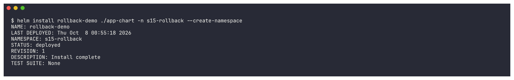

### Verify
```text
deployment "rollback-demo-app" successfully rolled out
DEPLOYMENT          REPLICAS   READY   IMAGE
rollback-demo-app   1          1       nginx:1.24
NAME                                 READY   STATUS    RESTARTS   AGE
rollback-demo-app-5666bb45b5-jpq8v   1/1     Running   0          48s
REVISION	UPDATED                 	STATUS  	CHART          	APP VERSION	DESCRIPTION
1       	Thu Oct  8 00:55:18 2026	deployed	app-chart-0.1.0	1.0        	Install complete
```
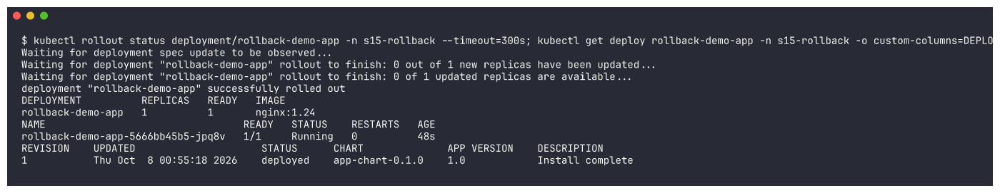

## 2. Upgrade (revision 2)

```bash
helm upgrade rollback-demo ./app-chart -n s15-rollback --set image.tag=1.25 --set replicaCount=2
```
```text
Release "rollback-demo" has been upgraded. Happy Helming!
STATUS: deployed
REVISION: 2
DESCRIPTION: Upgrade complete
```
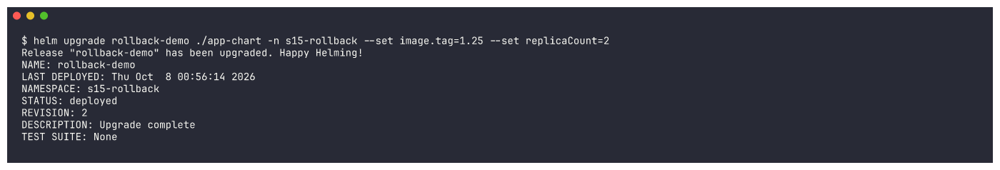

## 3. Verify

```text
deployment "rollback-demo-app" successfully rolled out
DEPLOYMENT          REPLICAS   READY   IMAGE
rollback-demo-app   2          2       nginx:1.25
NAME                                 READY   STATUS        RESTARTS   AGE
rollback-demo-app-5666bb45b5-jpq8v   1/1     Terminating   0          89s
rollback-demo-app-fd544cb86-m9zjd    1/1     Running       0          11s
rollback-demo-app-fd544cb86-zg7z9    1/1     Running       0          36s
USER-SUPPLIED VALUES:
image:
  tag: "1.25"
replicaCount: 2
REVISION	UPDATED                 	STATUS    	CHART          	APP VERSION	DESCRIPTION
1       	Thu Oct  8 00:55:18 2026	superseded	app-chart-0.1.0	1.0        	Install complete
2       	Thu Oct  8 00:56:14 2026	deployed  	app-chart-0.1.0	1.0        	Upgrade complete
```
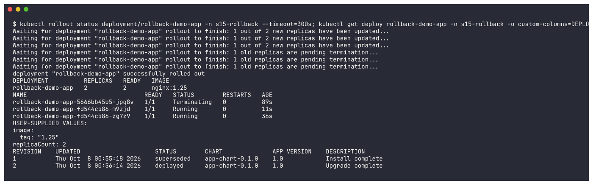

The old 1.24 Pod (`5666bb45b5`) is terminating, two new 1.25 Pods (`fd544cb86`) are running - a rolling
update done by the Deployment. Revision 1 is now `superseded`.

## 4. Upgrade again (revision 3)

```bash
helm upgrade rollback-demo ./app-chart -n s15-rollback --set image.tag=1.27 --set replicaCount=3
```
```text
Release "rollback-demo" has been upgraded. Happy Helming!
REVISION: 3
DESCRIPTION: Upgrade complete
```


## 5. Verify

```text
deployment "rollback-demo-app" successfully rolled out
DEPLOYMENT          REPLICAS   READY   IMAGE
rollback-demo-app   3          3       nginx:1.27
NAME                                 READY   STATUS        RESTARTS   AGE
rollback-demo-app-69f8564d56-95tx9   1/1     Running       0          29s
rollback-demo-app-69f8564d56-hfqjv   1/1     Running       0          16s
rollback-demo-app-69f8564d56-hnhdp   1/1     Running       0          6s
rollback-demo-app-fd544cb86-zg7z9    1/1     Terminating   0          68s
USER-SUPPLIED VALUES:
image:
  tag: "1.27"
replicaCount: 3
REVISION	UPDATED                 	STATUS    	CHART          	APP VERSION	DESCRIPTION
1       	Thu Oct  8 00:55:18 2026	superseded	app-chart-0.1.0	1.0        	Install complete
2       	Thu Oct  8 00:56:14 2026	superseded	app-chart-0.1.0	1.0        	Upgrade complete
3       	Thu Oct  8 00:56:55 2026	deployed  	app-chart-0.1.0	1.0        	Upgrade complete
```
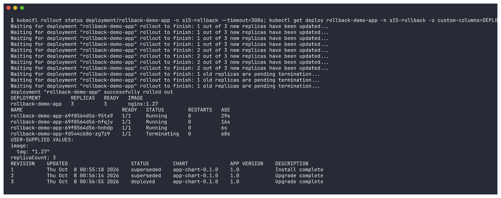

## 6. Rollback to revision 2

Suppose 1.27 / 3 replicas turned out to be a bad release. Go back to the known-good revision 2:
```bash
helm rollback rollback-demo 2 -n s15-rollback
```
```text
Rollback was a success! Happy Helming!
```
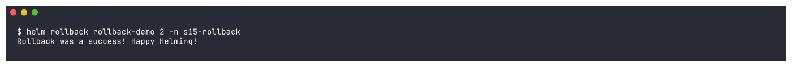

## 7. Verify

```text
deployment "rollback-demo-app" successfully rolled out
DEPLOYMENT          REPLICAS   READY   IMAGE
rollback-demo-app   2          2       nginx:1.25
NAME                                 READY   STATUS        RESTARTS   AGE
rollback-demo-app-69f8564d56-95tx9   1/1     Terminating   0          52s
rollback-demo-app-fd544cb86-4cttc    1/1     Running       0          11s
rollback-demo-app-fd544cb86-lq94k    1/1     Running       0          19s
USER-SUPPLIED VALUES:
image:
  tag: "1.25"
replicaCount: 2
REVISION	UPDATED                 	STATUS    	CHART          	APP VERSION	DESCRIPTION
1       	Thu Oct  8 00:55:18 2026	superseded	app-chart-0.1.0	1.0        	Install complete
2       	Thu Oct  8 00:56:14 2026	superseded	app-chart-0.1.0	1.0        	Upgrade complete
3       	Thu Oct  8 00:56:55 2026	superseded	app-chart-0.1.0	1.0        	Upgrade complete
4       	Thu Oct  8 00:57:27 2026	deployed  	app-chart-0.1.0	1.0        	Rollback to 2
```
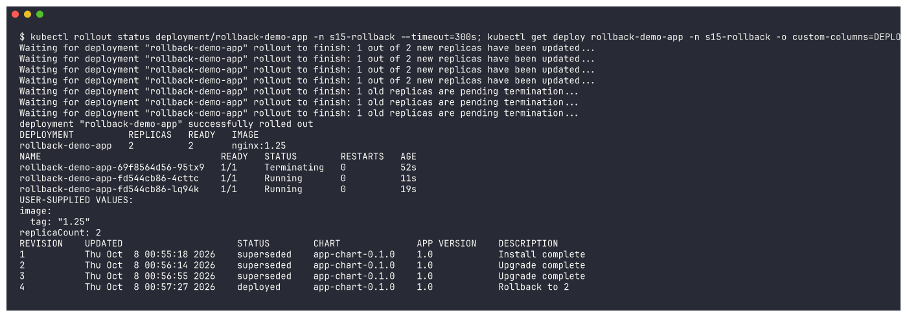

Observations:
* Image is back to **nginx:1.25** and replicas back to **2**, and `helm get values` shows revision 2's values.
* The new Pods have the **same ReplicaSet hash `fd544cb86`** as revision 2 - the Pod template is identical
  to revision 2, so Kubernetes simply scaled that old ReplicaSet back up.
* A rollback does **not** delete history: it creates a **new revision (4)** with description
  `Rollback to 2`. Revision 3 is still there (superseded), so you could even "roll forward" to it.

---

## Bonus A: a broken upgrade, rolled back by hand

```bash
helm upgrade rollback-demo ./app-chart -n s15-rollback --set image.tag=doesnotexist --set replicaCount=2
```
```text
Release "rollback-demo" has been upgraded. Happy Helming!
STATUS: deployed
REVISION: 5
DESCRIPTION: Upgrade complete
```
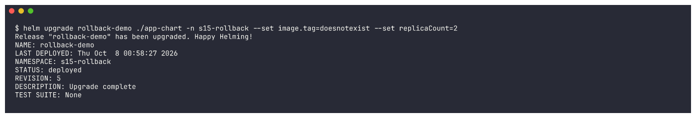

Helm reports `deployed` - by default it only checks that the manifests were **accepted** by the API
server, not that the Pods work:
```text
DEPLOYMENT          REPLICAS   READY   IMAGE
rollback-demo-app   2          2       nginx:doesnotexist
NAME                                 READY   STATUS             RESTARTS   AGE
rollback-demo-app-6d599696f7-wlfk2   0/1     ImagePullBackOff   0          43s
rollback-demo-app-fd544cb86-4cttc    1/1     Running            0          95s
rollback-demo-app-fd544cb86-lq94k    1/1     Running            0          103s
5       	Thu Oct  8 00:58:27 2026	deployed  	app-chart-0.1.0	1.0        	Upgrade complete
```
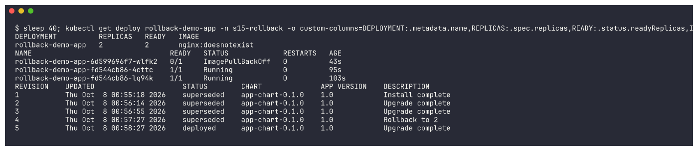

The new Pod is stuck in `ImagePullBackOff`. The app is still up only because the rolling update keeps
the old 1.25 Pods (`READY 2` counts those) until a new Pod becomes ready - which never happens.

```bash
helm rollback rollback-demo 4 -n s15-rollback
```
```text
Rollback was a success! Happy Helming!
```
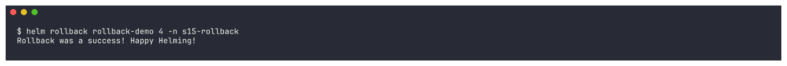

```text
deployment "rollback-demo-app" successfully rolled out
DEPLOYMENT          REPLICAS   READY   IMAGE
rollback-demo-app   2          2       nginx:1.25
rollback-demo-app-6d599696f7-wlfk2   0/1     Terminating   0          51s
5       	Thu Oct  8 00:58:27 2026	superseded	app-chart-0.1.0	1.0        	Upgrade complete
6       	Thu Oct  8 00:59:15 2026	deployed  	app-chart-0.1.0	1.0        	Rollback to 4
```
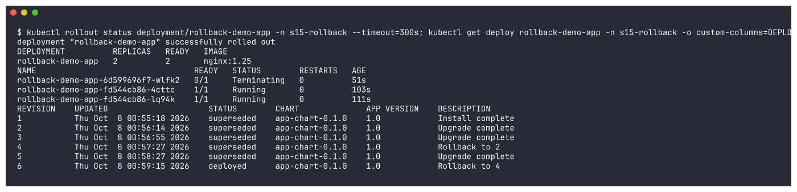

## Bonus B: automatic rollback with `--rollback-on-failure`

In Helm 3 this flag was called `--atomic`; Helm 4 renamed it `--rollback-on-failure` (it also turns on
`--wait`). If the release isn't healthy within `--timeout`, Helm rolls back by itself:
```bash
helm upgrade rollback-demo ./app-chart -n s15-rollback --set image.tag=doesnotexist --rollback-on-failure --timeout 90s
```
```text
level=WARN msg="upgrade failed" name=rollback-demo error="resource Deployment/s15-rollback/rollback-demo-app not ready. status: InProgress, message: Pending termination: 1\ncontext deadline exceeded"
Error: UPGRADE FAILED: an error occurred while rolling back the release. original upgrade error: resource Deployment/s15-rollback/rollback-demo-app not ready. status: InProgress, message: Pending termination: 1
context deadline exceeded: release rollback-demo failed: resource Deployment/s15-rollback/rollback-demo-app not ready. ...
exit code: 1
```
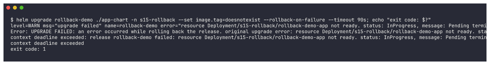

```bash
kubectl get deploy rollback-demo-app -n s15-rollback ...; helm history rollback-demo -n s15-rollback
```
```text
DEPLOYMENT          REPLICAS   READY   IMAGE
rollback-demo-app   2          1       nginx:1.25
NAME                                 READY   STATUS              RESTARTS   AGE
rollback-demo-app-6d599696f7-4xzrg   0/1     ErrImagePull        0          3m2s
rollback-demo-app-6d599696f7-wz77j   0/1     Terminating         0          84s
rollback-demo-app-fd544cb86-lq94k    1/1     Running             0          5m9s
rollback-demo-app-fd544cb86-t2rhx    0/1     ContainerCreating   0          83s
REVISION  UPDATED                   STATUS      CHART            DESCRIPTION
6         Thu Oct  8 00:59:15 2026  deployed    app-chart-0.1.0  Rollback to 4
7         Thu Oct  8 00:59:23 2026  failed      app-chart-0.1.0  Upgrade "rollback-demo" failed: resource Deployment/s15-rollback/rollback-demo-app not ready. status: InProgress, message: Pending termination...
8         Thu Oct  8 01:01:03 2026  failed      app-chart-0.1.0  Release "rollback-demo" failed: resource Deployment/s15-rollback/rollback-demo-app not ready. status: InProgress, message: Pending termination...
```
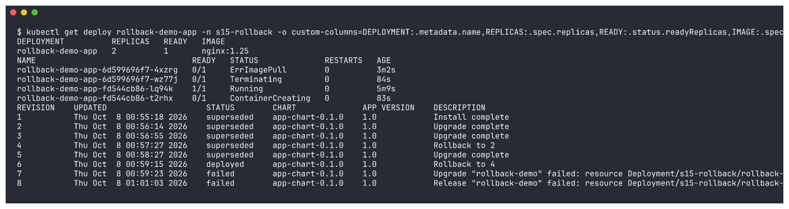

What happened, step by step:
1. Revision 7 (the bad image) was applied and Helm **waited** (up to 90s) for the Deployment to become
   ready. It never did -> `Upgrade ... failed`.
2. Because of `--rollback-on-failure`, Helm **automatically rolled back**: revision 8 re-applied the last
   good config - the Deployment is back to **`nginx:1.25`** without me running `helm rollback`.
3. The rollback itself also waits for readiness. On this heavily overloaded shared node the old Pod was
   still `Terminating` and the replacement still `ContainerCreating` when the wait ran out, so Helm
   marked revision 8 `failed` too and the command exited 1, even though the spec had already been
   reverted (and the cluster converged to 1.25 afterwards). On a healthy cluster this is a single
   command that ends in `deployed`; here it shows that Helm's "failed" means "not ready within the
   timeout", and that `--timeout` must be generous enough for the cluster you deploy to.

`helm rollback` (Bonus A) is the manual version; `--rollback-on-failure` is what you put in a CI/CD
pipeline so a broken release never stays live.

## Cleanup

```bash
helm uninstall rollback-demo -n s15-rollback && helm list -n s15-rollback && kubectl delete namespace s15-rollback --wait=false
```
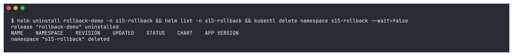

## Summary

```text
rev 1  install           nginx:1.24 x1   superseded
rev 2  upgrade           nginx:1.25 x2   superseded
rev 3  upgrade again     nginx:1.27 x3   superseded
rev 4  rollback to 2     nginx:1.25 x2   superseded   <- the rollback workflow ends here (verified)
rev 5  bad upgrade       nginx:doesnotexist           ImagePullBackOff
rev 6  rollback to 4     nginx:1.25 x2
rev 7+ --rollback-on-failure demo (see Bonus B)
```

Key points: rollback = a new revision with an old revision's config; history is never rewritten;
`helm history` tells you which revision number to go back to; Helm's `deployed` status does not mean the
Pods are healthy unless you use `--wait` / `--rollback-on-failure`.
