# Session 15: Helm

> Work in progress: the full write-up for this session is being finalised. Every screenshot below is real output from commands run on a local minikube cluster / Docker / GitHub Actions.

## 01-helm-commands

### 01-helm-version

```bash
helm version
```

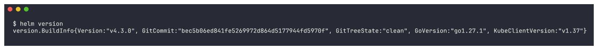

### 02-helm-create

```bash
helm create myapp && ls -R myapp
```

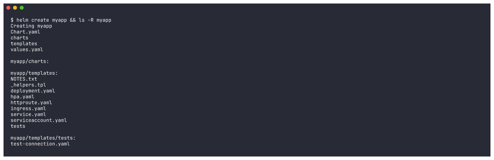

### 03-chart-files

```bash
cat myapp/Chart.yaml | grep -v "^#" | grep -v "^$"; echo ---; grep -E "^replicaCount|^image:|^  repository|^  tag|^service:|^  type|^  port" myapp/values.yaml
```

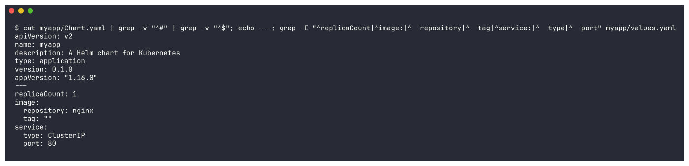

### 04-helm-lint

```bash
helm lint myapp
```

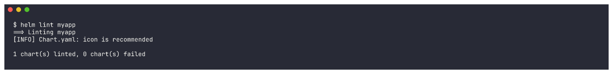

### 05-helm-template

```bash
helm template demo myapp --set replicaCount=2 | grep -E "^# Source|^kind:|replicas:|image:"
```

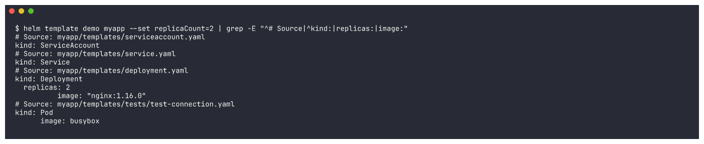

### 06-helm-repo-add

```bash
helm repo add bitnami https://charts.bitnami.com/bitnami
```

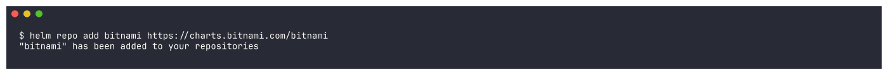

### 07-helm-repo-list

```bash
helm repo list
```

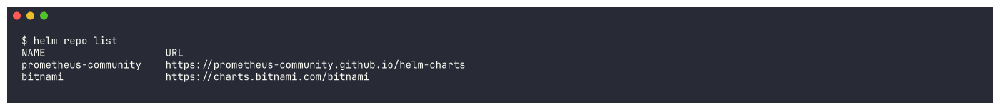

### 08-helm-repo-update

```bash
helm repo update bitnami
```

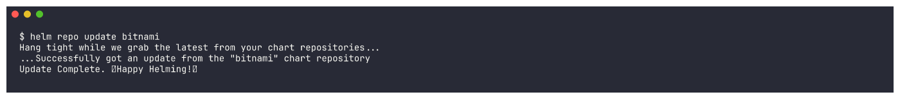

### 09-helm-search-repo

```bash
helm search repo bitnami/nginx; echo; helm search repo nginx --versions | head -6
```

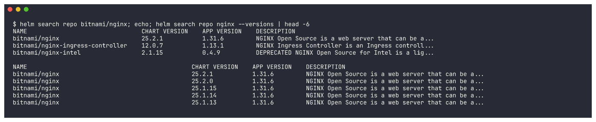

### 10-helm-search-hub

```bash
helm search hub nginx --max-col-width 60 | head -12
```

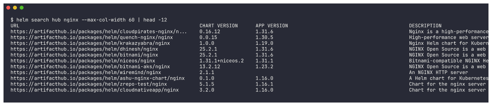

### 11-helm-show-chart

```bash
helm show chart bitnami/nginx | head -20
```

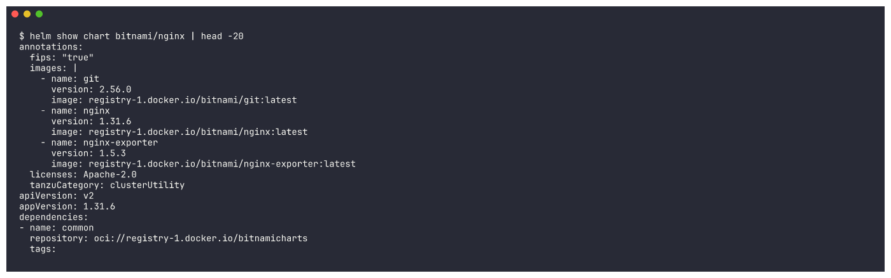

### 12-helm-install

```bash
helm install myapp ./myapp -n s15-helm --create-namespace --set image.tag=1.27
```

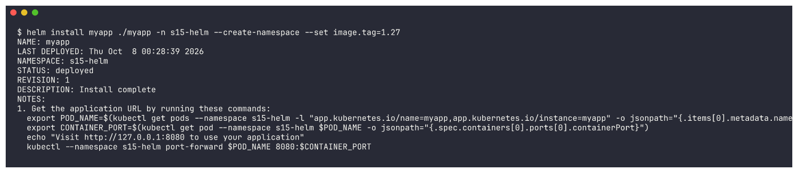

### 13-helm-list

```bash
helm list -n s15-helm; echo; helm list -A | grep -E "NAME|s15"
```

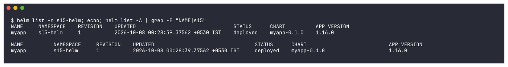

### 14-kubectl-resources

```bash
kubectl rollout status deployment/myapp -n s15-helm --timeout=240s; kubectl get all -n s15-helm
```

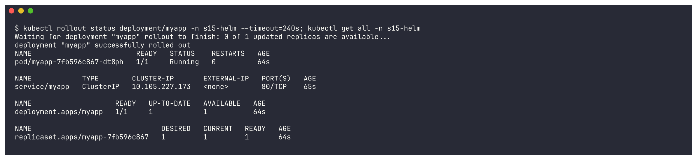

### 15-helm-status

```bash
helm status myapp -n s15-helm
```

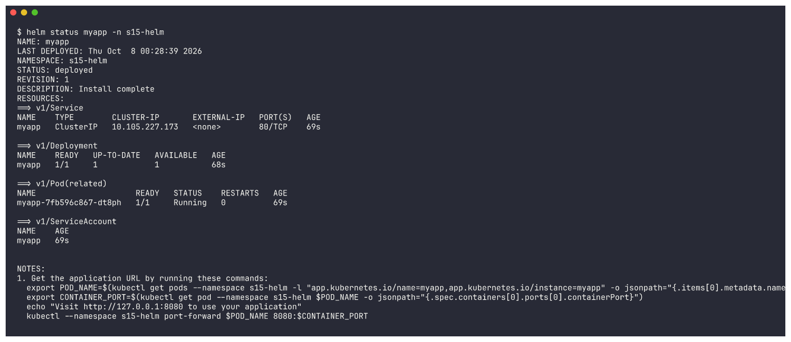

### 16-helm-get-values

```bash
helm get values myapp -n s15-helm; echo; helm get values myapp -n s15-helm --all | head -20
```

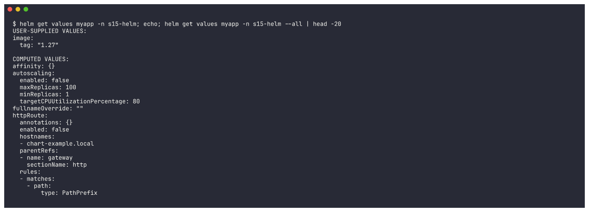

### 17-helm-get-manifest

```bash
helm get manifest myapp -n s15-helm | head -60
```

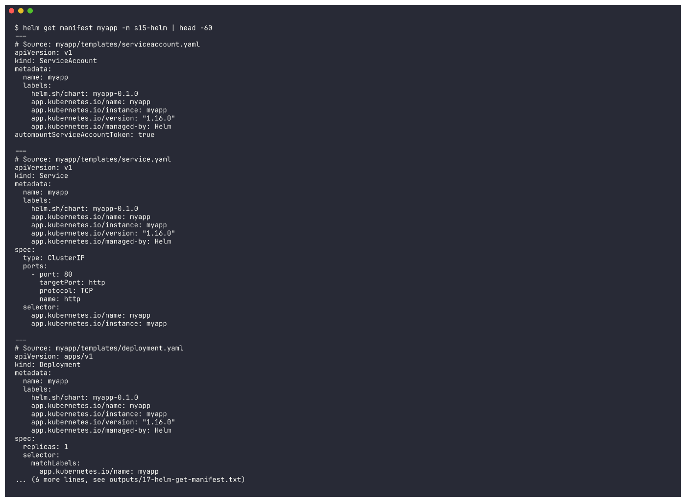

### 18-helm-get-all

```bash
helm get all myapp -n s15-helm | grep -E "^NAME|^LAST DEPLOYED|^NAMESPACE|^STATUS|^REVISION|^CHART|^VERSION|^APP_VERSION|^USER-SUPPLIED VALUES|^COMPUTED VALUES|^HOOKS|^MANIFEST|^NOTES|^# Source"
```

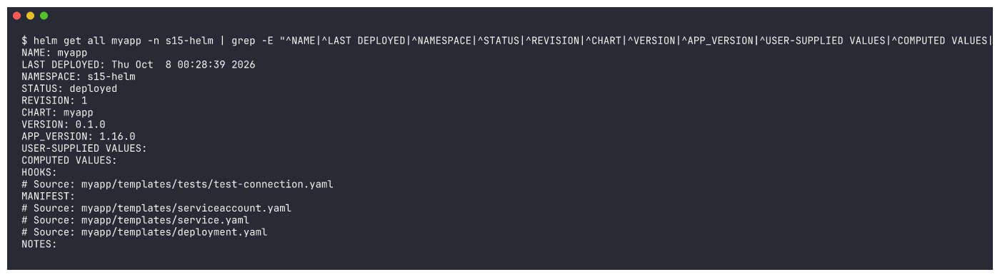

### 19-helm-upgrade

```bash
helm upgrade myapp ./myapp -n s15-helm --set image.tag=1.27 --set replicaCount=3
```

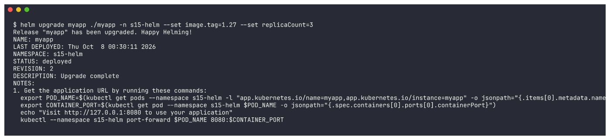

### 20-verify-upgrade

```bash
kubectl rollout status deployment/myapp -n s15-helm --timeout=240s; kubectl get deploy,pods -n s15-helm -o wide; helm get values myapp -n s15-helm
```

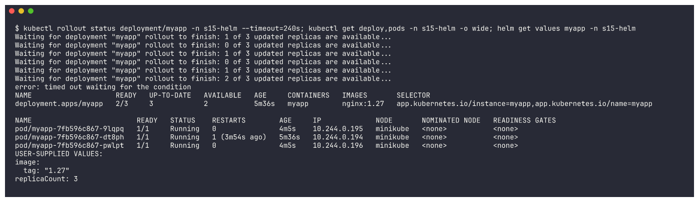

### 21-helm-history

```bash
helm history myapp -n s15-helm
```


### 22-helm-rollback

```bash
helm rollback myapp 1 -n s15-helm && kubectl rollout status deployment/myapp -n s15-helm --timeout=240s; kubectl get deploy myapp -n s15-helm; helm history myapp -n s15-helm
```

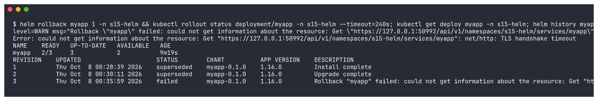

### 23-helm-uninstall

```bash
helm uninstall myapp -n s15-helm; helm list -n s15-helm; kubectl get all -n s15-helm
```

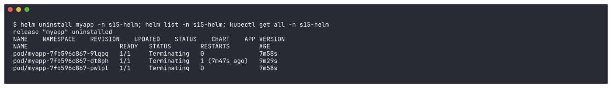
