# Task 3: Mini Project - Package and Deploy the Notes App with Helm

The reference Session 15 mini project: package a (nginx-based) "Notes" web app as a Helm chart with
separate dev and prod values, install it, upgrade it to production values, simulate a bad release and
roll it back. Release `notes-dev`, namespace `s15-notes`.

## The chart - `notes-chart/`

```text
notes-chart/
  Chart.yaml
  values.yaml          # development defaults
  values-prod.yaml     # production overrides
  templates/
    configmap.yaml
    deployment.yaml
    service.yaml
```

```bash
find notes-chart -type f | sort; cat notes-chart/Chart.yaml; cat notes-chart/values.yaml; cat notes-chart/values-prod.yaml
```
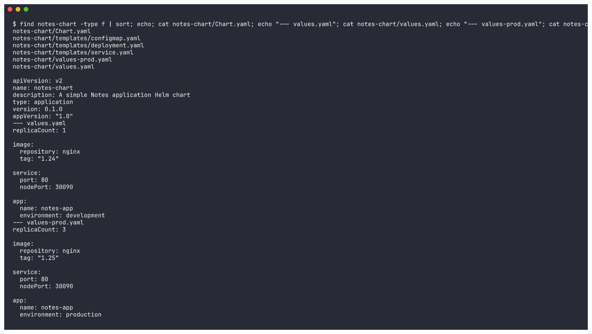

| | `values.yaml` (dev) | `values-prod.yaml` (prod) |
|---|---|---|
| `replicaCount` | 1 | 3 |
| `image` | nginx:1.24 | nginx:1.25 |
| `service.nodePort` | 30090 | 30090 |
| `app.environment` | development | production |

### Templates

`templates/configmap.yaml` - app settings, injected as env vars:
```yaml
apiVersion: v1
kind: ConfigMap
metadata:
  name: {{ .Release.Name }}-config
data:
  APP_NAME: {{ .Values.app.name | quote }}
  ENVIRONMENT: {{ .Values.app.environment | quote }}
```

`templates/deployment.yaml`:
```yaml
apiVersion: apps/v1
kind: Deployment
metadata:
  name: {{ .Release.Name }}-deploy
  labels:
    app: {{ .Release.Name }}
    environment: {{ .Values.app.environment }}
spec:
  replicas: {{ .Values.replicaCount }}
  selector:
    matchLabels:
      app: {{ .Release.Name }}
  template:
    metadata:
      labels:
        app: {{ .Release.Name }}
    spec:
      containers:
        - name: notes
          image: "{{ .Values.image.repository }}:{{ .Values.image.tag }}"
          ports:
            - containerPort: {{ .Values.service.port }}
          envFrom:
            - configMapRef:
                name: {{ .Release.Name }}-config
```

`templates/service.yaml`:
```yaml
apiVersion: v1
kind: Service
metadata:
  name: {{ .Release.Name }}-svc
spec:
  type: NodePort
  selector:
    app: {{ .Release.Name }}
  ports:
    - port: {{ .Values.service.port }}
      targetPort: {{ .Values.service.port }}
      nodePort: {{ .Values.service.nodePort }}
```

`{{ .Release.Name }}` makes every object name unique per release, so the same chart can be installed
several times (e.g. `notes-dev`, `notes-prod`) without clashes.

---

## Step 8: Lint
```bash
helm lint notes-chart; helm lint notes-chart -f notes-chart/values-prod.yaml
```
```text
==> Linting notes-chart
[INFO] Chart.yaml: icon is recommended

1 chart(s) linted, 0 chart(s) failed
==> Linting notes-chart
[INFO] Chart.yaml: icon is recommended

1 chart(s) linted, 0 chart(s) failed
```
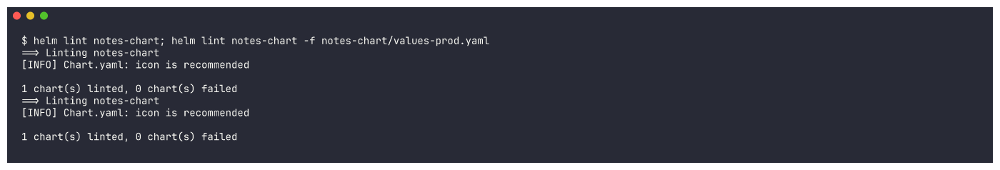

## Step 9: Render locally
```bash
helm template notes-dev notes-chart
```
```text
# Source: notes-chart/templates/configmap.yaml
kind: ConfigMap
metadata:
  name: notes-dev-config
data:
  APP_NAME: "notes-app"
  ENVIRONMENT: "development"
---
# Source: notes-chart/templates/service.yaml
kind: Service
metadata:
  name: notes-dev-svc
spec:
  type: NodePort
  ...
      nodePort: 30090
---
# Source: notes-chart/templates/deployment.yaml
kind: Deployment
metadata:
  name: notes-dev-deploy
  labels:
    app: notes-dev
    environment: development
spec:
  replicas: 1
  ...
          image: "nginx:1.24"
          envFrom:
            - configMapRef:
                name: notes-dev-config
```
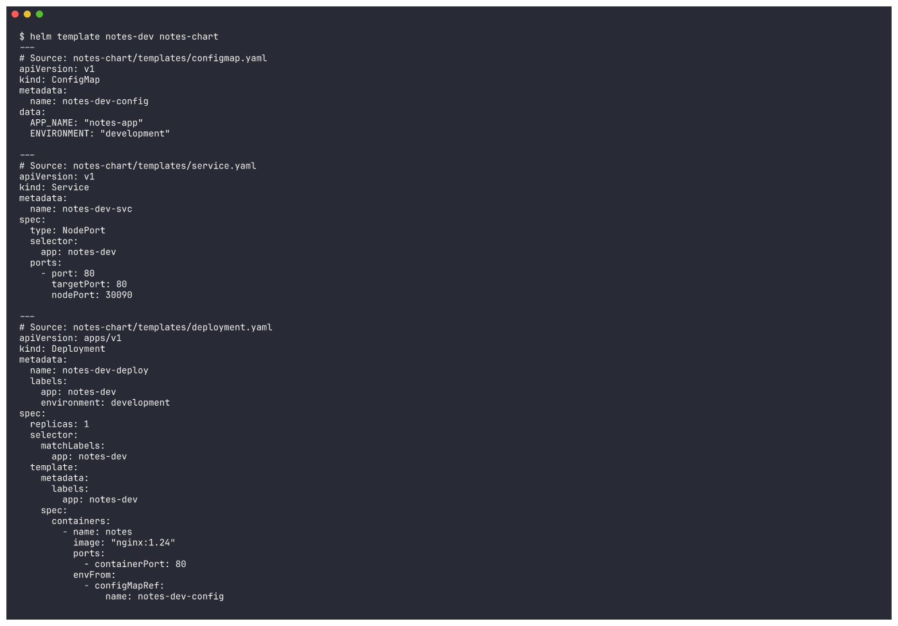

All `{{ }}` placeholders are replaced.

## Step 10: Install (development)
```bash
helm install notes-dev notes-chart -n s15-notes --create-namespace
```
```text
NAME: notes-dev
LAST DEPLOYED: Thu Oct  8 01:05:30 2026
NAMESPACE: s15-notes
STATUS: deployed
REVISION: 1
DESCRIPTION: Install complete
```
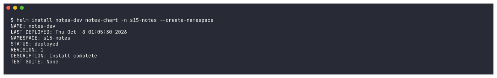

Verify:
```bash
kubectl get pods,services,configmaps -n s15-notes; kubectl get deploy notes-dev-deploy -n s15-notes -o wide
```
```text
NAME                                    READY   STATUS    RESTARTS   AGE
pod/notes-dev-deploy-74956bd987-r4n58   1/1     Running   0          1s

NAME                    TYPE       CLUSTER-IP      EXTERNAL-IP   PORT(S)        AGE
service/notes-dev-svc   NodePort   10.107.214.43   <none>        80:30090/TCP   1s

NAME                         DATA   AGE
configmap/notes-dev-config   2      1s
NAME               READY   UP-TO-DATE   AVAILABLE   AGE   CONTAINERS   IMAGES       SELECTOR
notes-dev-deploy   1/1     1            1           2s    notes        nginx:1.24   app=notes-dev
```
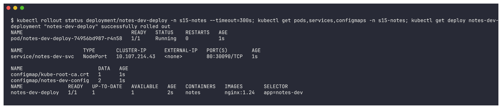

The ConfigMap values really reach the container:
```bash
kubectl exec <pod> -n s15-notes -- sh -c "echo APP_NAME=\$APP_NAME ENVIRONMENT=\$ENVIRONMENT; nginx -v"
```
```text
APP_NAME=notes-app ENVIRONMENT=development
nginx version: nginx/1.24.0
```
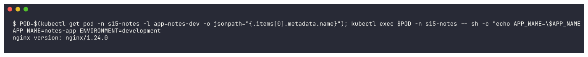

## Step 11: Upgrade to production values
```bash
helm upgrade notes-dev notes-chart -n s15-notes -f notes-chart/values-prod.yaml
```
```text
Release "notes-dev" has been upgraded. Happy Helming!
STATUS: deployed
REVISION: 2
DESCRIPTION: Upgrade complete
```
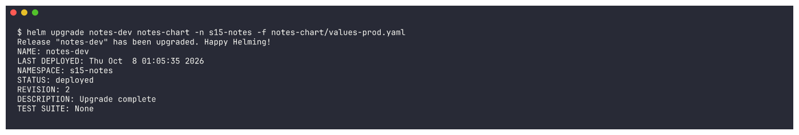

Verify 3 Pods on nginx:1.25 and the ConfigMap now says `production`:
```text
deployment "notes-dev-deploy" successfully rolled out
NAME                                READY   STATUS        RESTARTS   AGE
notes-dev-deploy-74956bd987-r4n58   1/1     Terminating   0          13s
notes-dev-deploy-bbcc464b4-7mkqw    1/1     Running       0          8s
notes-dev-deploy-bbcc464b4-9nxsz    1/1     Running       0          5s
notes-dev-deploy-bbcc464b4-l64j6    1/1     Running       0          1s
NAME               READY   UP-TO-DATE   AVAILABLE   AGE   CONTAINERS   IMAGES       SELECTOR
notes-dev-deploy   3/3     3            3           14s   notes        nginx:1.25   app=notes-dev
{"APP_NAME":"notes-app","ENVIRONMENT":"production"}
```
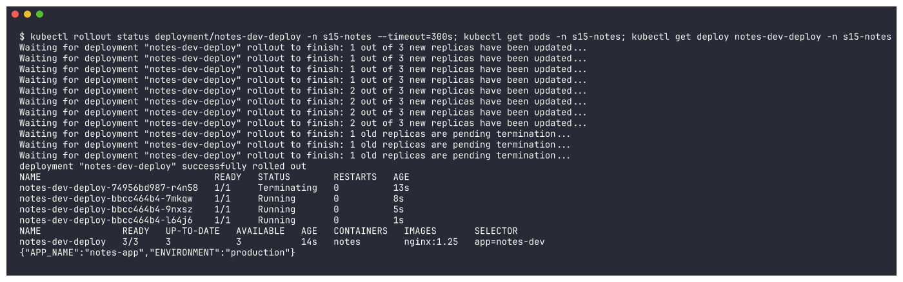

## Step 12: Release history
```bash
helm history notes-dev -n s15-notes
```
```text
REVISION	UPDATED                 	STATUS    	CHART            	APP VERSION	DESCRIPTION
1       	Thu Oct  8 01:05:30 2026	superseded	notes-chart-0.1.0	1.0        	Install complete
2       	Thu Oct  8 01:05:35 2026	deployed  	notes-chart-0.1.0	1.0        	Upgrade complete
```
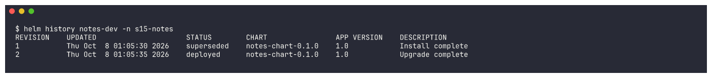

## Step 13: Simulate a bad upgrade
```bash
helm upgrade notes-dev notes-chart -n s15-notes -f notes-chart/values-prod.yaml --set image.tag=broken-tag-does-not-exist
```
```text
Release "notes-dev" has been upgraded. Happy Helming!
STATUS: deployed
REVISION: 3
```
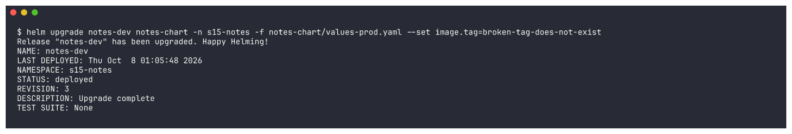

```bash
sleep 45; kubectl get pods -n s15-notes; kubectl get deploy notes-dev-deploy -n s15-notes -o wide; helm history notes-dev -n s15-notes
```
```text
NAME                                READY   STATUS             RESTARTS   AGE
notes-dev-deploy-79b4dbdffd-742ml   0/1     ImagePullBackOff   0          47s
notes-dev-deploy-bbcc464b4-7mkqw    1/1     Running            0          61s
notes-dev-deploy-bbcc464b4-9nxsz    1/1     Running            0          58s
notes-dev-deploy-bbcc464b4-l64j6    1/1     Running            0          54s
NAME               READY   UP-TO-DATE   AVAILABLE   AGE   CONTAINERS   IMAGES
notes-dev-deploy   3/3     1            3           66s   notes        nginx:broken-tag-does-not-exist
3       	Thu Oct  8 01:05:48 2026	deployed  	notes-chart-0.1.0	1.0        	Upgrade complete
```
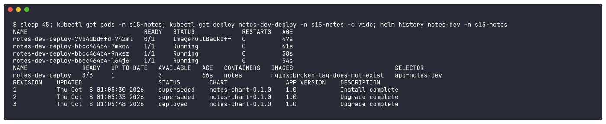

Helm says `deployed`, but the new Pod is in `ImagePullBackOff`. The rolling update protects us: the 3 old
1.25 Pods keep serving because the new Pod never becomes ready (`UP-TO-DATE 1`).

## Step 14: Roll back to revision 2
```bash
helm rollback notes-dev 2 -n s15-notes
```
```text
Rollback was a success! Happy Helming!
```
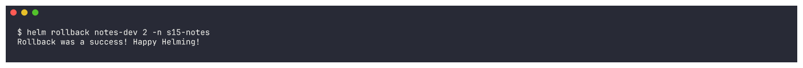

```text
deployment "notes-dev-deploy" successfully rolled out
NAME                                READY   STATUS        RESTARTS   AGE
notes-dev-deploy-79b4dbdffd-742ml   0/1     Terminating   0          51s
notes-dev-deploy-bbcc464b4-7mkqw    1/1     Running       0          65s
notes-dev-deploy-bbcc464b4-9nxsz    1/1     Running       0          62s
notes-dev-deploy-bbcc464b4-l64j6    1/1     Running       0          58s
NAME               READY   UP-TO-DATE   AVAILABLE   AGE   CONTAINERS   IMAGES
notes-dev-deploy   3/3     3            3           70s   notes        nginx:1.25
REVISION	UPDATED                 	STATUS    	CHART            	APP VERSION	DESCRIPTION
1       	Thu Oct  8 01:05:30 2026	superseded	notes-chart-0.1.0	1.0        	Install complete
2       	Thu Oct  8 01:05:35 2026	superseded	notes-chart-0.1.0	1.0        	Upgrade complete
3       	Thu Oct  8 01:05:48 2026	superseded	notes-chart-0.1.0	1.0        	Upgrade complete
4       	Thu Oct  8 01:06:38 2026	deployed  	notes-chart-0.1.0	1.0        	Rollback to 2
```
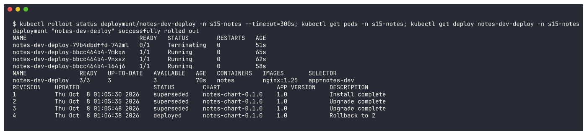

Healthy again: 3/3 on nginx:1.25, the broken Pod is terminating, and history shows revision 4
`Rollback to 2`.

### Access the app
```bash
kubectl get svc notes-dev-svc -n s15-notes
kubectl run curl-notes -n s15-notes --image=curlimages/curl:8.6.0 --restart=Never --rm -i -- curl -s -o /dev/null -w "notes-dev-svc -> HTTP %{http_code}\n" http://notes-dev-svc
minikube ssh "curl -s -o /dev/null -w \"NodePort 30090 on the node -> HTTP %{http_code}\n\" http://localhost:30090"
```
```text
NAME            TYPE       CLUSTER-IP      EXTERNAL-IP   PORT(S)        AGE
notes-dev-svc   NodePort   10.107.214.43   <none>        80:30090/TCP   72s
notes-dev-svc -> HTTP 200
NodePort 30090 on the node -> HTTP 200
```
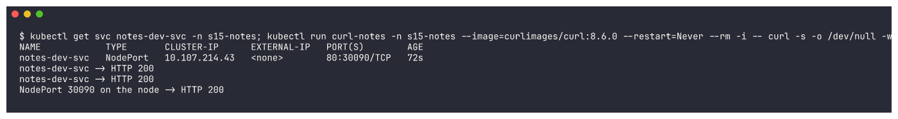

## Step 15: Clean up
```bash
helm uninstall notes-dev -n s15-notes && helm list -n s15-notes && kubectl get pods,services,configmaps -n s15-notes
```
```text
release "notes-dev" uninstalled
NAME	NAMESPACE	REVISION	UPDATED	STATUS	CHART	APP VERSION
NAME                                    READY   STATUS        RESTARTS   AGE
pod/notes-dev-deploy-79b4dbdffd-742ml   0/1     Terminating   0          60s
...
configmap/kube-root-ca.crt   1      79s
```
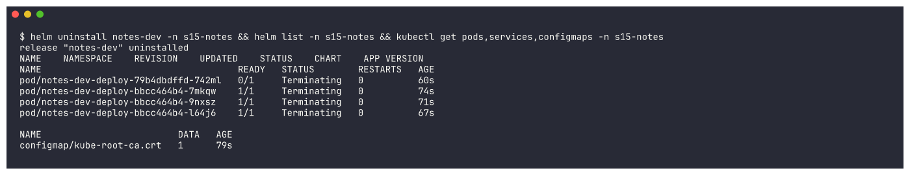

The Service and `notes-dev-config` ConfigMap are gone immediately; the Pods are terminating
(`kube-root-ca.crt` is created by Kubernetes in every namespace, not by the chart).

```bash
kubectl delete namespace s15-notes --wait=false
```
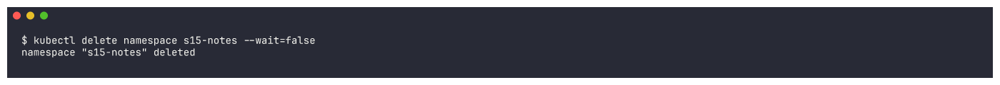

## What I practiced

```text
[PASS] Created a Helm chart (Chart.yaml, values.yaml, values-prod.yaml, 3 templates)
[PASS] Linted and rendered it locally
[PASS] Installed it (dev: 1 x nginx:1.24, ENVIRONMENT=development)
[PASS] Upgraded with production values (3 x nginx:1.25, ENVIRONMENT=production)
[PASS] Simulated a bad upgrade (ImagePullBackOff)
[PASS] Rolled back to the healthy revision 2 (new revision 4)
[PASS] Reached the app through the Service and the NodePort
[PASS] Cleaned up with helm uninstall
```
