# Session 09: Kubernetes Fundamentals

> Work in progress: the full write-up for this session is being finalised. Every screenshot below is real output from commands run on a local minikube cluster / Docker / GitHub Actions.

## Evidence

### 01-tool-versions

```bash
kubectl version && minikube version && docker version --format "Docker server: {{.Server.Version}}"
```

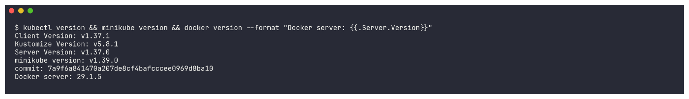

### 02-minikube-status

```bash
minikube status
```

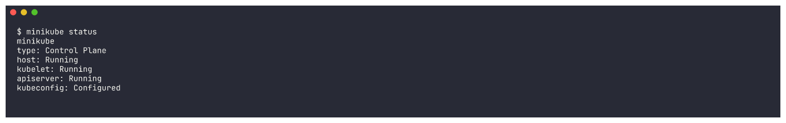

### 03-minikube-profile-list

```bash
minikube profile list
```

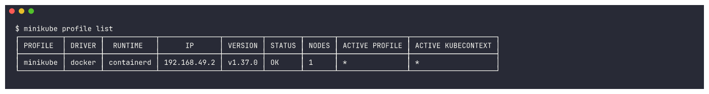

### 04-minikube-addons

```bash
minikube addons list | grep -E "ADDON NAME|enabled"
```

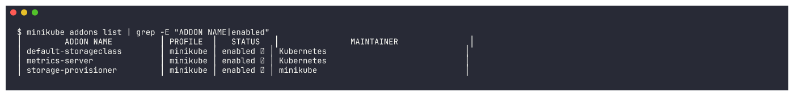

### 05-kubectl-context

```bash
kubectl config current-context && kubectl config get-contexts
```

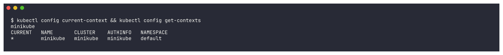

### 06-cluster-info

```bash
kubectl cluster-info
```

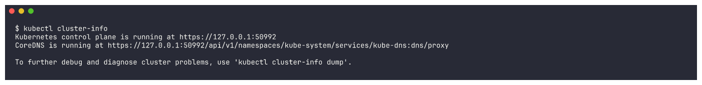

### 07-get-nodes-wide

```bash
kubectl get nodes -o wide
```

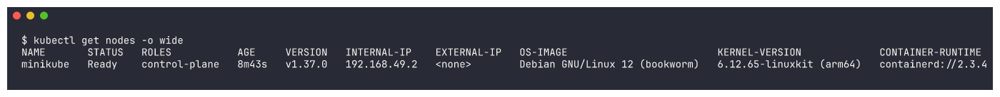

### 08-get-pods-all

```bash
kubectl get pods -A
```

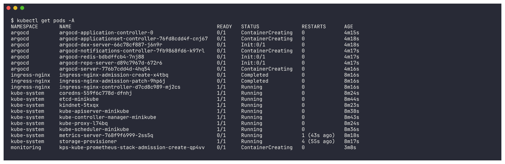

### 09-api-resources

```bash
kubectl api-resources | head -45
```

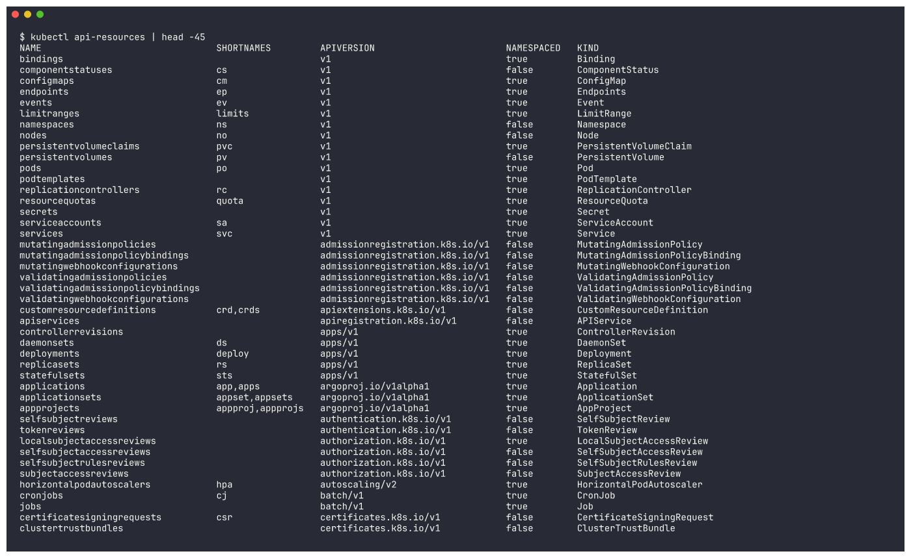

### 10-kube-system-pods

```bash
kubectl get pods -n kube-system -o wide
```

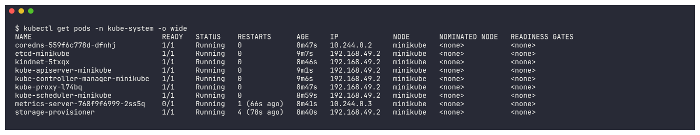

### 11-control-plane-pods

```bash
kubectl get pods -n kube-system -l tier=control-plane -L component
```

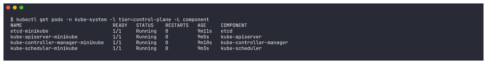

### 12-static-pod-manifests

```bash
minikube ssh -- sudo ls -l /etc/kubernetes/manifests
```

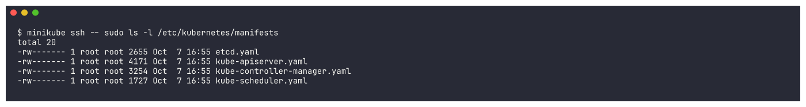

### 13-kubelet-service

```bash
minikube ssh -- "sudo SYSTEMD_URLIZE=0 systemctl status kubelet --no-pager | head -11"
```

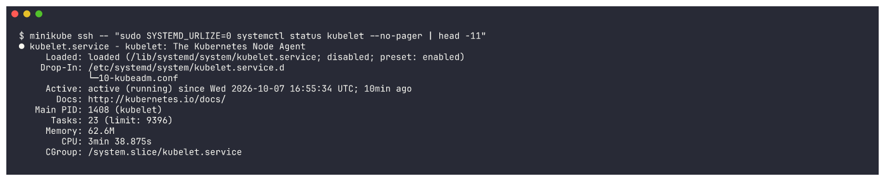

### 14-container-runtime

```bash
minikube ssh -- sudo crictl ps | head -14
```

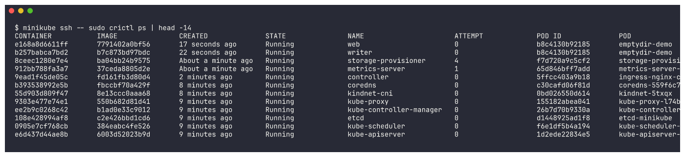

### 15-daemonsets-kube-proxy

```bash
kubectl get daemonsets -n kube-system -o wide
```

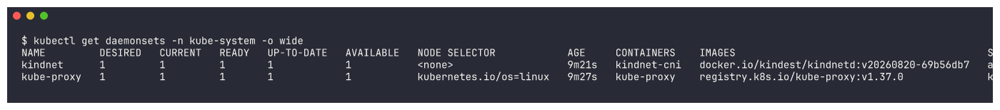

### 16-apiserver-readyz

```bash
kubectl get --raw="/readyz?verbose" | head -25
```

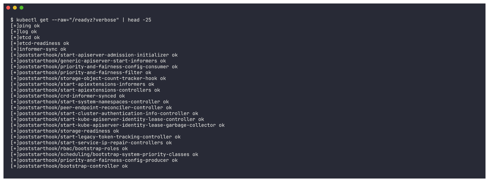

### 17-describe-node

```bash
kubectl describe node minikube | sed -n "/^Capacity:/,/^Non-terminated/p"
```

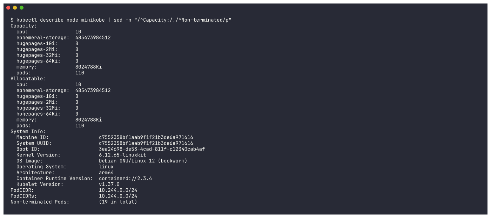

### 18-create-namespace

```bash
kubectl create namespace s09-basics && kubectl get namespaces
```

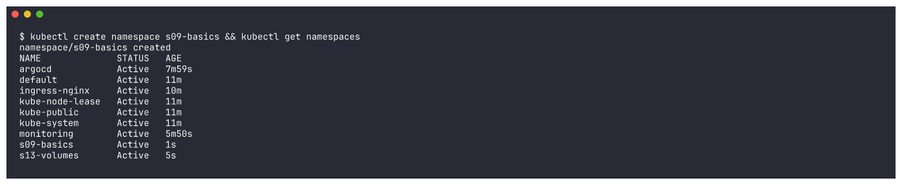

### 19-apply-pod

```bash
kubectl apply -f basic-objects/pod.yaml -n s09-basics && kubectl wait --for=condition=Ready pod/nginx-pod -n s09-basics --timeout=180s && kubectl get pods -n s09-basics -o wide --show-labels
```

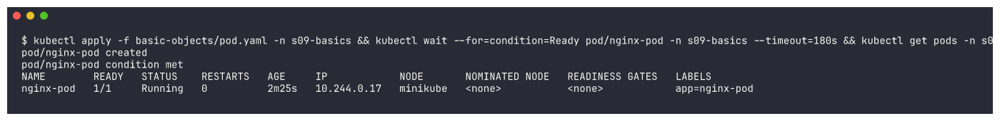

### 20-describe-pod

```bash
kubectl describe pod nginx-pod -n s09-basics | sed -n "1,12p;/^Containers:/,/Ready:/p;/^Events:/,\$p"
```

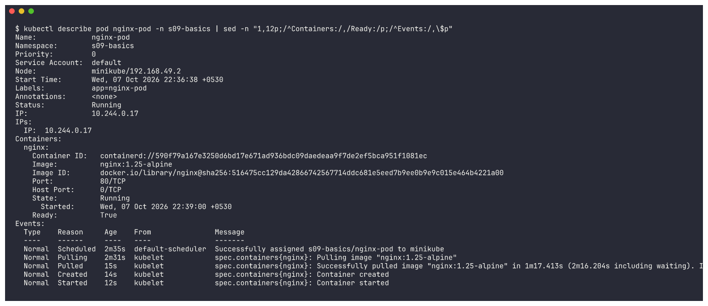

### 21-logs-exec

```bash
kubectl logs nginx-pod -n s09-basics --tail=5 && kubectl exec nginx-pod -n s09-basics -- nginx -v && kubectl exec nginx-pod -n s09-basics -- hostname
```

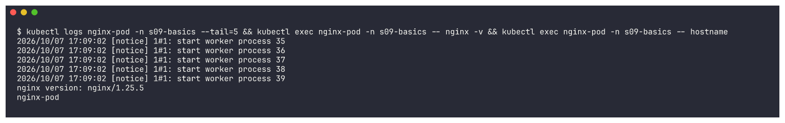

### 22-apply-replicaset

```bash
kubectl apply -f basic-objects/replicaset.yaml -n s09-basics && sleep 3 && kubectl wait --for=condition=Ready pod -l app=nginx-rs -n s09-basics --timeout=180s && kubectl get rs,pods -l app=nginx-rs -n s09-basics -o wide
```

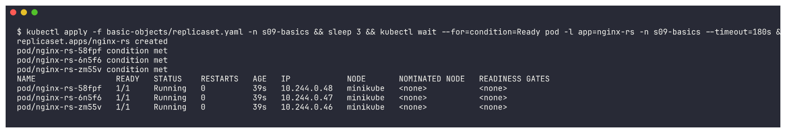

### 23-replicaset-self-healing

```bash
POD=$(kubectl get pods -l app=nginx-rs -n s09-basics -o jsonpath="{.items[0].metadata.name}"); echo "Deleting $POD"; kubectl delete pod $POD -n s09-basics; sleep 2; kubectl get pods -l app=nginx-rs -n s09-basics -o wide; kubectl get rs nginx-rs -n s09-basics
```

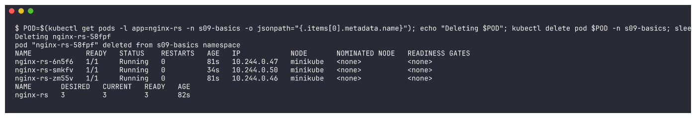

### 24-apply-deployment-service

```bash
kubectl apply -f basic-objects/deployment.yaml -f basic-objects/service.yaml -n s09-basics && kubectl rollout status deployment/web -n s09-basics --timeout=180s && kubectl get deploy,rs,pods,svc,endpoints -l app=web -n s09-basics; kubectl get svc web-svc -n s09-basics
```

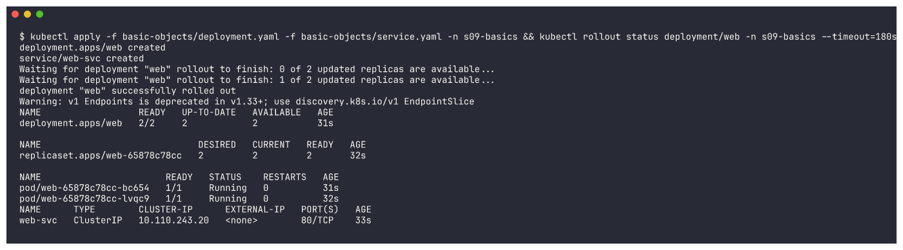

### 25-curl-service-from-pod

```bash
kubectl exec nginx-pod -n s09-basics -- wget -qO- http://web-svc | head -4
```

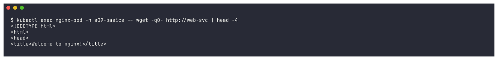

### 26-get-yaml-explain

```bash
kubectl get deployment web -n s09-basics -o yaml | sed -n "1,25p"; echo ...; kubectl explain deployment.spec.replicas
```

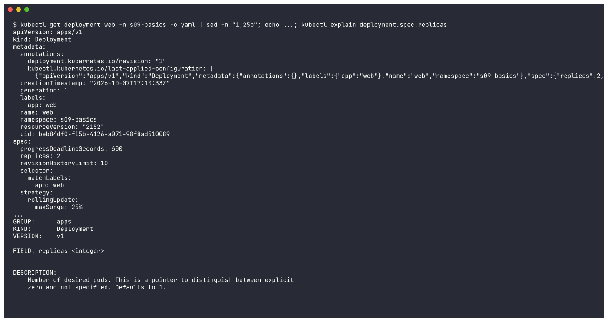

### 27-cleanup-basics

```bash
kubectl delete -f basic-objects/ -n s09-basics && kubectl get all -n s09-basics
```

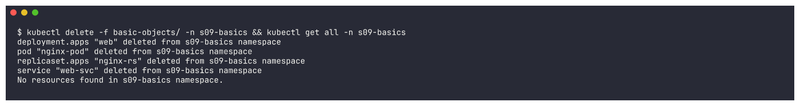

### 30-tutorial-create-deployment

```bash
kubectl create namespace s09-tutorial && kubectl create deployment kubernetes-bootcamp --image=gcr.io/google-samples/kubernetes-bootcamp:v1 -n s09-tutorial
```

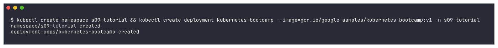

### 31-tutorial-get-deployments

```bash
kubectl rollout status deployment/kubernetes-bootcamp -n s09-tutorial --timeout=180s; kubectl get deployments -n s09-tutorial
```

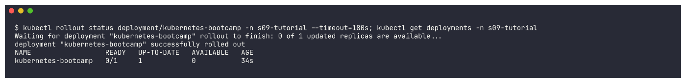

### 32-tutorial-kubectl-proxy

```bash
kubectl proxy --port=8011 >/dev/null 2>&1 & PROXY=$!; sleep 3; curl -s http://localhost:8011/version; echo; curl -s http://localhost:8011/api/v1/namespaces/s09-tutorial/pods | grep "\"name\": \"kubernetes-bootcamp" | head -1; kill $PROXY
```

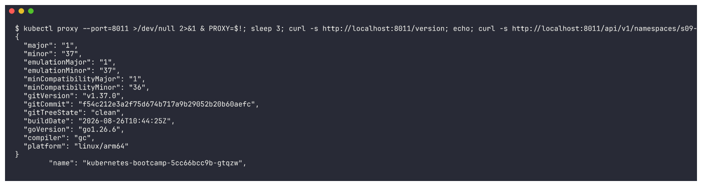

### 33-tutorial-get-describe-pods

```bash
kubectl get pods -n s09-tutorial -o wide; kubectl describe pods -n s09-tutorial | sed -n "1,8p;/^Containers:/,/Ready:/p"
```

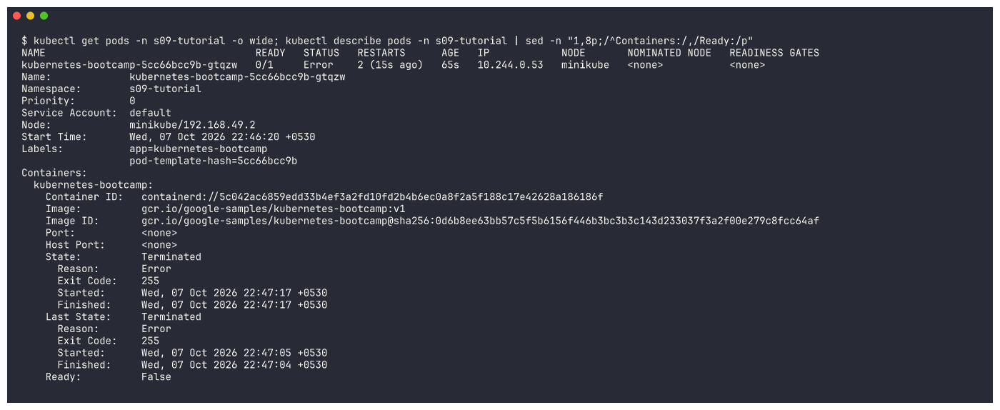

### 34-tutorial-arm64-exec-format-error

```bash
kubectl get pods -n s09-tutorial; kubectl logs deploy/kubernetes-bootcamp -n s09-tutorial; echo "node arch: $(kubectl get node minikube -o jsonpath={.status.nodeInfo.architecture})"; echo "image arch:"; docker manifest inspect -v gcr.io/google-samples/kubernetes-bootcamp:v1 | grep architecture
```

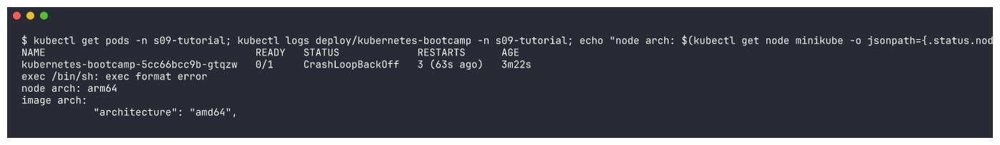

### 35-tutorial-recreate-with-multiarch-image

```bash
kubectl create deployment kubernetes-bootcamp --image=traefik/whoami:v1.10.1 -n s09-tutorial && kubectl rollout status deployment/kubernetes-bootcamp -n s09-tutorial --timeout=240s && kubectl get deployments,pods -n s09-tutorial -o wide
```

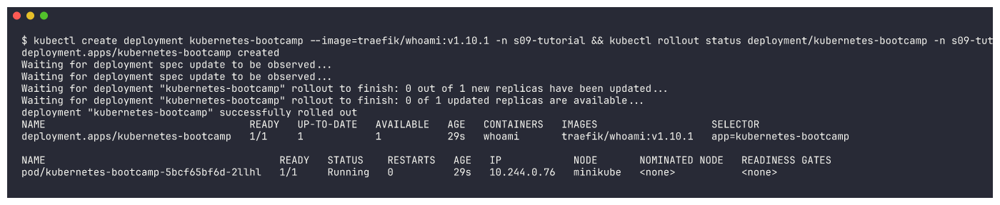

### 36-tutorial-explore-pods

```bash
kubectl get pods -n s09-tutorial -o wide; kubectl describe pods -n s09-tutorial | sed -n "1,9p;/^Containers:/,/Ready:/p;/^Events:/,\$p"
```

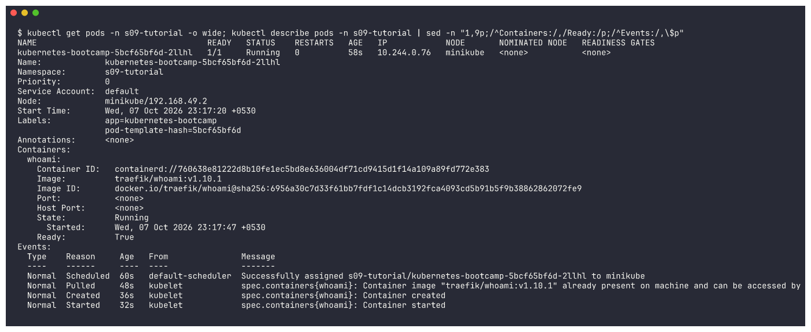

### 37-tutorial-logs

```bash
POD_NAME=$(kubectl get pods -n s09-tutorial -o go-template --template "{{range .items}}{{.metadata.name}}{{\"\n\"}}{{end}}"); echo "POD_NAME=$POD_NAME"; kubectl logs $POD_NAME -n s09-tutorial
```

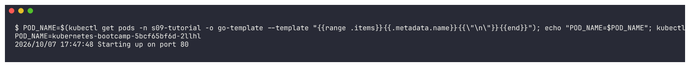

### 38-tutorial-debug-container

```bash
POD_NAME=$(kubectl get pods -n s09-tutorial -o jsonpath="{.items[0].metadata.name}"); kubectl debug -q -i $POD_NAME -n s09-tutorial --image=busybox:1.36 --target=whoami -- sh -c "echo --- env of the debug container sharing the pod network ---; hostname; echo; wget -qO- http://localhost:80"
```

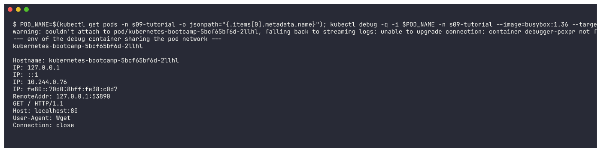

### 39-tutorial-expose-nodeport

```bash
kubectl expose deployment/kubernetes-bootcamp --type="NodePort" --port 8080 --target-port 80 -n s09-tutorial && kubectl get services -n s09-tutorial && kubectl describe services/kubernetes-bootcamp -n s09-tutorial
```

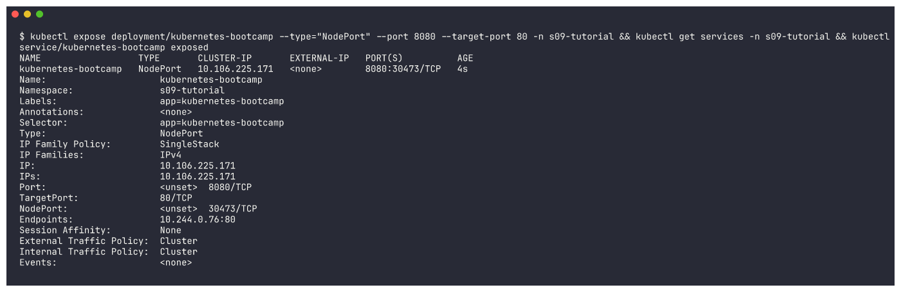

### 40-tutorial-curl-nodeport

```bash
NODE_PORT=$(kubectl get services/kubernetes-bootcamp -n s09-tutorial -o go-template="{{(index .spec.ports 0).nodePort}}"); echo "NODE_PORT=$NODE_PORT  MINIKUBE_IP=$(minikube ip)"; minikube ssh -- curl -s http://$(minikube ip):$NODE_PORT | head -3
```

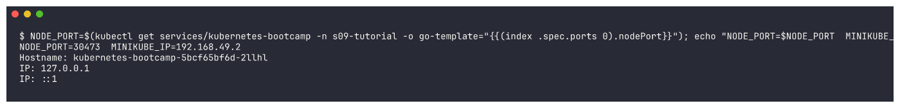

### 41-tutorial-labels

```bash
kubectl describe deployment kubernetes-bootcamp -n s09-tutorial | grep -E "^Labels|^Selector"; kubectl get pods -l app=kubernetes-bootcamp -n s09-tutorial; kubectl get services -l app=kubernetes-bootcamp -n s09-tutorial
```

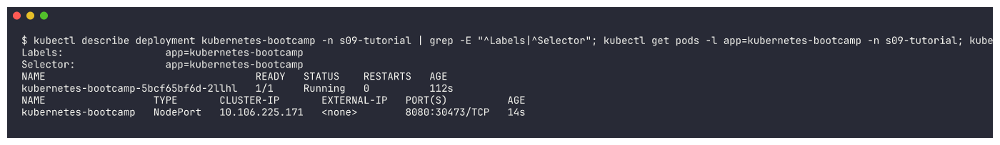

### 42-tutorial-add-label

```bash
POD_NAME=$(kubectl get pods -n s09-tutorial -o jsonpath="{.items[0].metadata.name}"); kubectl label pods $POD_NAME version=v1 -n s09-tutorial && kubectl describe pods $POD_NAME -n s09-tutorial | grep -A3 "^Labels" && kubectl get pods -l version=v1 -n s09-tutorial
```

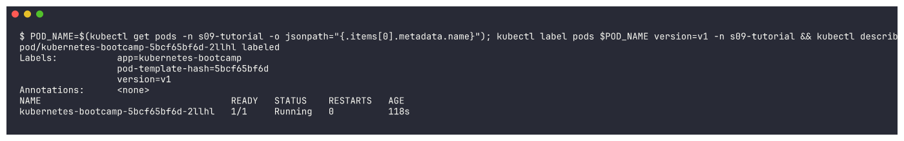

### 43-tutorial-delete-service

```bash
NODE_PORT=$(kubectl get services/kubernetes-bootcamp -n s09-tutorial -o go-template="{{(index .spec.ports 0).nodePort}}"); echo "NodePort before delete: $NODE_PORT"; kubectl delete service -l app=kubernetes-bootcamp -n s09-tutorial && kubectl get services -n s09-tutorial; echo "--- curl the old NodePort now fails:"; minikube ssh -- curl -s -m 3 http://$(minikube ip):$NODE_PORT || echo "=> connecti ...
```

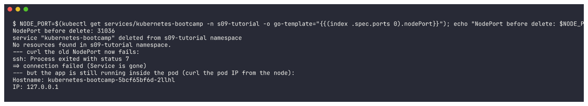

### 44-tutorial-re-expose

```bash
kubectl expose deployment/kubernetes-bootcamp --type="NodePort" --port 8080 --target-port 80 -n s09-tutorial && kubectl get rs -n s09-tutorial
```

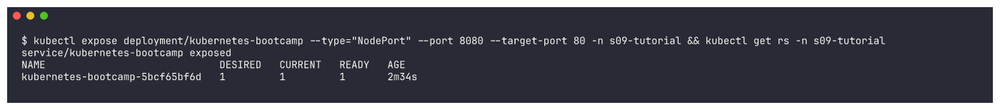

### 45-tutorial-scale-up

```bash
kubectl scale deployments/kubernetes-bootcamp --replicas=4 -n s09-tutorial && kubectl rollout status deployment/kubernetes-bootcamp -n s09-tutorial --timeout=180s && kubectl get deployments,rs -n s09-tutorial && kubectl get pods -o wide -n s09-tutorial
```

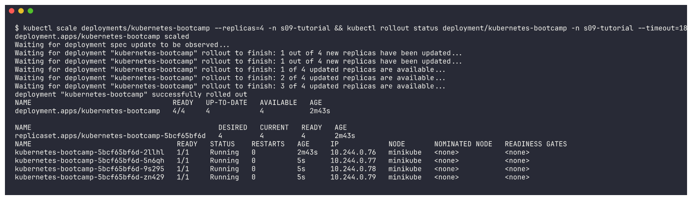

### 46-tutorial-scale-events

```bash
kubectl describe deployments/kubernetes-bootcamp -n s09-tutorial | sed -n "/^Replicas:/p;/^Events:/,\$p"; kubectl get endpointslices -n s09-tutorial
```

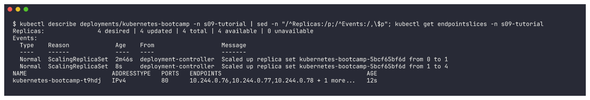

### 47-tutorial-load-balancing

```bash
NODE_PORT=$(kubectl get services/kubernetes-bootcamp -n s09-tutorial -o go-template="{{(index .spec.ports 0).nodePort}}"); minikube ssh -- "for i in \$(seq 1 12); do curl -s http://192.168.49.2:$NODE_PORT | grep Hostname; done" | sort | uniq -c
```

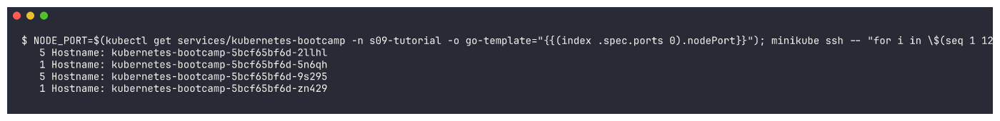

### 48-tutorial-scale-down

```bash
kubectl scale deployments/kubernetes-bootcamp --replicas=2 -n s09-tutorial && sleep 5 && kubectl get deployments -n s09-tutorial && kubectl get pods -o wide -n s09-tutorial
```

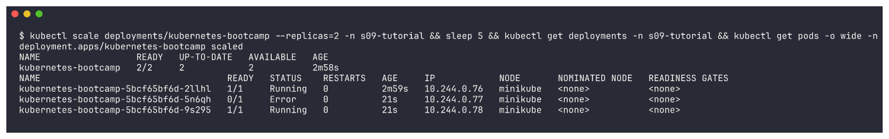

### 49-tutorial-rolling-update

```bash
kubectl set image deployments/kubernetes-bootcamp whoami=traefik/whoami:v1.10.3 -n s09-tutorial && kubectl rollout status deployments/kubernetes-bootcamp -n s09-tutorial --timeout=180s && kubectl get rs,pods -n s09-tutorial
```

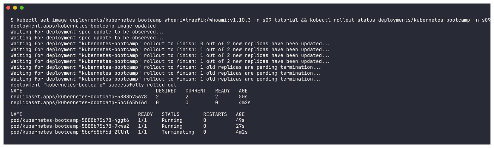

### 50-tutorial-verify-update

```bash
kubectl describe pods -n s09-tutorial | grep -E "^Name:|Image:"; kubectl rollout history deployment/kubernetes-bootcamp -n s09-tutorial
```

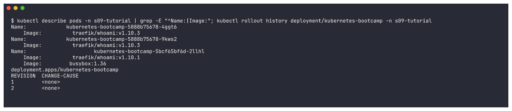

### 51-tutorial-bad-update

```bash
kubectl set image deployments/kubernetes-bootcamp whoami=traefik/whoami:v10 -n s09-tutorial && sleep 25 && kubectl get deployments -n s09-tutorial && kubectl get pods -n s09-tutorial
```

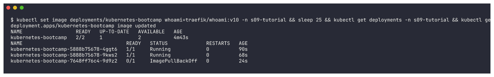

### 52-tutorial-bad-update-describe

```bash
kubectl describe pods -n s09-tutorial -l app=kubernetes-bootcamp | grep -E "^Name:|Image:|Reason:|Failed|BackOff" | head -20
```

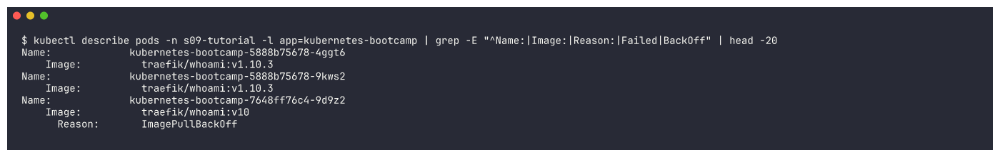

### 52b-tutorial-bad-update-events

```bash
kubectl get events -n s09-tutorial --sort-by=.lastTimestamp | grep -E "Failed|BackOff" | tail -4
```

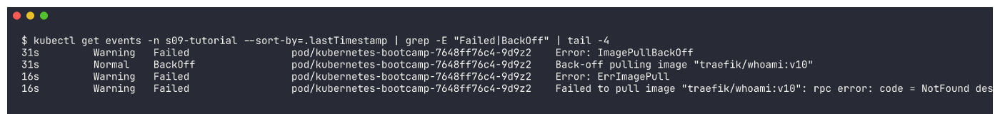

### 53-tutorial-rollout-undo

```bash
kubectl rollout undo deployments/kubernetes-bootcamp -n s09-tutorial && kubectl rollout status deployments/kubernetes-bootcamp -n s09-tutorial --timeout=120s && kubectl get pods -n s09-tutorial && kubectl describe pods -n s09-tutorial | grep "Image:" && kubectl rollout history deployment/kubernetes-bootcamp -n s09-tutorial
```

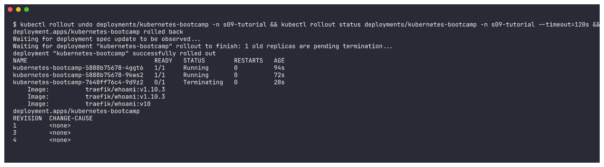

### 54-cleanup

```bash
kubectl delete namespace s09-tutorial s09-basics && kubectl get namespaces | grep s09- || echo "no s09- namespaces left"
```

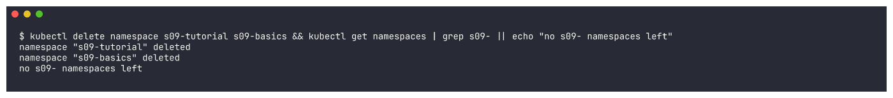
