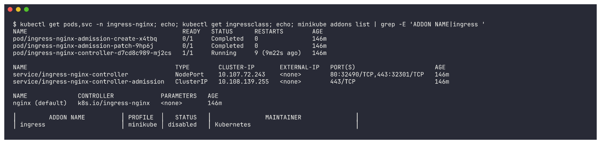
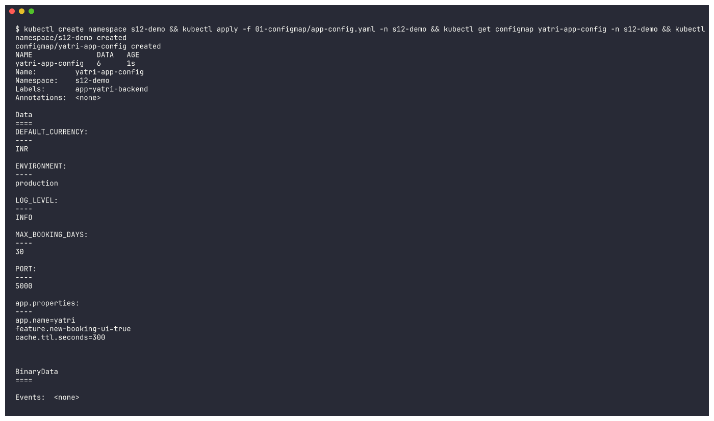
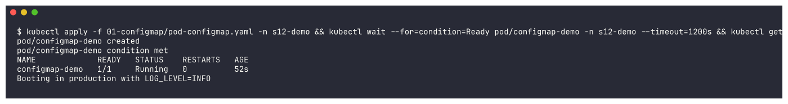
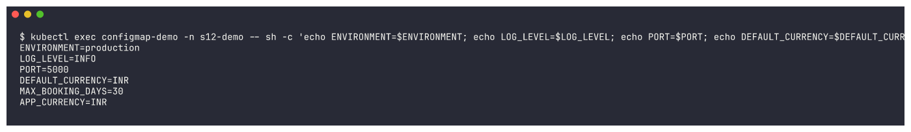
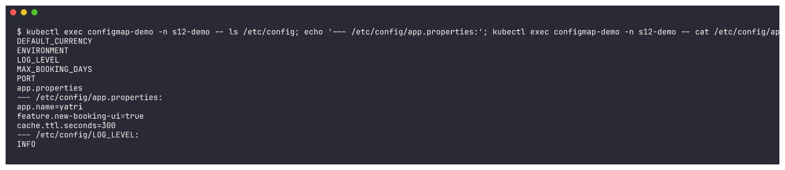

# Session 12: Kubernetes Ingress, ConfigMaps & Secrets

> Work in progress: the full write-up for this session is being finalised. Every screenshot below is real output from commands run on a local minikube cluster / Docker / GitHub Actions.

## Evidence

### 01-ingress-controller

```bash
kubectl get pods,svc -n ingress-nginx; echo; kubectl get ingressclass; echo; minikube addons list | grep -E 'ADDON NAME|ingress '
```



### 02-configmap-apply

```bash
kubectl create namespace s12-demo && kubectl apply -f 01-configmap/app-config.yaml -n s12-demo && kubectl get configmap yatri-app-config -n s12-demo && kubectl describe configmap yatri-app-config -n s12-demo
```



### 03-configmap-pod

```bash
kubectl apply -f 01-configmap/pod-configmap.yaml -n s12-demo && kubectl wait --for=condition=Ready pod/configmap-demo -n s12-demo --timeout=1200s && kubectl get pod configmap-demo -n s12-demo && kubectl logs configmap-demo -n s12-demo
```



### 04-configmap-verify-vars

```bash
kubectl exec configmap-demo -n s12-demo -- sh -c 'echo ENVIRONMENT=$ENVIRONMENT; echo LOG_LEVEL=$LOG_LEVEL; echo PORT=$PORT; echo DEFAULT_CURRENCY=$DEFAULT_CURRENCY; echo MAX_BOOKING_DAYS=$MAX_BOOKING_DAYS; echo APP_CURRENCY=$APP_CURRENCY'
```



### 05-configmap-verify-volume

```bash
kubectl exec configmap-demo -n s12-demo -- ls /etc/config; echo '--- /etc/config/app.properties:'; kubectl exec configmap-demo -n s12-demo -- cat /etc/config/app.properties; echo '--- /etc/config/LOG_LEVEL:'; kubectl exec configmap-demo -n s12-demo -- cat /etc/config/LOG_LEVEL; echo
```


