# Session 12: Kubernetes Ingress, ConfigMaps & Secrets - Homework

Hands-on on my local minikube cluster (Kubernetes v1.37.0, docker driver, macOS/arm64) with the
**ingress-nginx** controller that minikube's `ingress` addon installs. Every command below has its
real output (trimmed) and a screenshot; full text in [`outputs/`](outputs/).

| Deliverable | File(s) |
|---|---|
| ConfigMap YAML | [`01-configmap/app-config.yaml`](01-configmap/app-config.yaml), [`app-config-v2.yaml`](01-configmap/app-config-v2.yaml), [`pod-configmap.yaml`](01-configmap/pod-configmap.yaml) |
| Secret YAML | [`02-secret/db-secret.yaml`](02-secret/db-secret.yaml), [`pod-secret.yaml`](02-secret/pod-secret.yaml) |
| ConfigMap + Secret together | [`05-combined/backend-with-config.yaml`](05-combined/backend-with-config.yaml) |
| Ingress YAML (full demo) | [`03-ingress/frontend.yaml`](03-ingress/frontend.yaml), [`backend.yaml`](03-ingress/backend.yaml), [`ingress.yaml`](03-ingress/ingress.yaml), [`ingress-tls.yaml`](03-ingress/ingress-tls.yaml) |
| Ingress vs Ingress Controller | [`ingress-vs-ingress-controller/README.md`](ingress-vs-ingress-controller/README.md) |
| Troubleshooting | [`04-troubleshooting/`](04-troubleshooting/) + Task 5 below |

YAMLs are adapted from the course reference repo (`devops-heros/session-12-ingress-configmaps-secrets`).
**All Secret values in this repo are obviously fake demo values** (`dummy-password-123`, `dummy-pass-123`).

Namespaces: `s12-demo` (Tasks 1-4), `s12-ingress` (Ingress/TLS re-run), `s12-troubleshoot` (Task 5).

---

## The Ingress controller in my cluster

```bash
kubectl get pods,svc -n ingress-nginx
kubectl get ingressclass
minikube addons list | grep -E 'ADDON NAME|ingress '
```
```
pod/ingress-nginx-controller-d7cd8c989-mj2cs   1/1     Running     9 (9m22s ago)   146m
service/ingress-nginx-controller             NodePort    10.107.72.243    <none>        80:32490/TCP,443:32301/TCP   146m
service/ingress-nginx-controller-admission   ClusterIP   10.108.139.255   <none>        443/TCP                      146m

NAME              CONTROLLER             PARAMETERS   AGE
nginx (default)   k8s.io/ingress-nginx   <none>       146m

│ ingress                     │ minikube │ disabled   │ Kubernetes                             │
```


The controller was installed by `minikube start --addons=ingress` and is running (IngressClass
`nginx` is the default). Oddly, `minikube addons list` reports the addon as `disabled` - the
addon's status flag did not get saved, but the controller objects exist and work (all tests below
go through it). On the docker driver the controller's NodePort is not reachable from the Mac, so I
reach it with `kubectl port-forward svc/ingress-nginx-controller -n ingress-nginx 8081:80` and send
the `Host` header with curl (instead of editing `/etc/hosts`).

---

## Task 1: ConfigMap

[`01-configmap/app-config.yaml`](01-configmap/app-config.yaml) stores 5 key/value settings plus a
whole file (`app.properties`). [`pod-configmap.yaml`](01-configmap/pod-configmap.yaml) injects it
three ways: `envFrom` (all keys as variables), `env.valueFrom.configMapKeyRef` (one key under a
new name `APP_CURRENCY`) and a `configMap` **volume** at `/etc/config`.

**Create the ConfigMap / store configuration values**
```bash
kubectl create namespace s12-demo
kubectl apply -f 01-configmap/app-config.yaml -n s12-demo
kubectl get configmap yatri-app-config -n s12-demo
kubectl describe configmap yatri-app-config -n s12-demo
```
```
NAME               DATA   AGE
yatri-app-config   6      1s
Data
====
DEFAULT_CURRENCY:  INR
ENVIRONMENT:       production
LOG_LEVEL:         INFO
MAX_BOOKING_DAYS:  30
PORT:              5000
app.properties:
  app.name=yatri
  feature.new-booking-ui=true
  cache.ttl.seconds=300
```


**Inject into a Pod**
```bash
kubectl apply -f 01-configmap/pod-configmap.yaml -n s12-demo
kubectl logs configmap-demo -n s12-demo
```
```
pod/configmap-demo condition met
configmap-demo   1/1     Running   0          52s
Booting in production with LOG_LEVEL=INFO
```


**Verify the values inside the container**
```bash
kubectl exec configmap-demo -n s12-demo -- sh -c 'echo ENVIRONMENT=$ENVIRONMENT; echo LOG_LEVEL=$LOG_LEVEL; ...'
```
```
ENVIRONMENT=production
LOG_LEVEL=INFO
PORT=5000
DEFAULT_CURRENCY=INR
MAX_BOOKING_DAYS=30
APP_CURRENCY=INR
```


```bash
kubectl exec configmap-demo -n s12-demo -- ls /etc/config
kubectl exec configmap-demo -n s12-demo -- cat /etc/config/app.properties
kubectl exec configmap-demo -n s12-demo -- cat /etc/config/LOG_LEVEL
```
```
DEFAULT_CURRENCY
ENVIRONMENT
LOG_LEVEL
MAX_BOOKING_DAYS
PORT
app.properties
--- /etc/config/app.properties:
app.name=yatri
feature.new-booking-ui=true
cache.ttl.seconds=300
--- /etc/config/LOG_LEVEL:
INFO
```


Every key became a file in the volume; the multi-line `app.properties` key became a real config file.

**Live update: volume vs environment variables** - apply [`app-config-v2.yaml`](01-configmap/app-config-v2.yaml)
(LOG_LEVEL INFO -> DEBUG, MAX_BOOKING_DAYS 30 -> 45, cache TTL 300 -> 60) **without restarting the Pod**:
```bash
kubectl apply -f 01-configmap/app-config-v2.yaml -n s12-demo
# poll the mounted file every 10 s
kubectl exec configmap-demo -n s12-demo -- cat /etc/config/LOG_LEVEL
kubectl exec configmap-demo -n s12-demo -- sh -c 'echo LOG_LEVEL=$LOG_LEVEL MAX_BOOKING_DAYS=$MAX_BOOKING_DAYS'
```
```
00:54:19 applying app-config-v2.yaml (LOG_LEVEL INFO -> DEBUG, cache.ttl 300 -> 60)
configmap/yatri-app-config configured
00:55:04 file /etc/config/LOG_LEVEL = INFO
00:55:31 file /etc/config/LOG_LEVEL = INFO
00:55:51 file /etc/config/LOG_LEVEL = INFO
00:56:04 file /etc/config/LOG_LEVEL = DEBUG          <- volume updated by itself (~1.5 min)
--- mounted file app.properties now:
app.name=yatri
feature.new-booking-ui=true
cache.ttl.seconds=60
--- but the variable injected at start is still the old value:
LOG_LEVEL=INFO MAX_BOOKING_DAYS=30
```
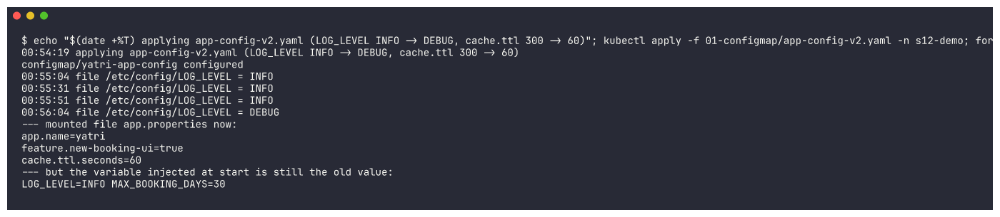

```bash
kubectl delete pod configmap-demo -n s12-demo && kubectl apply -f 01-configmap/pod-configmap.yaml -n s12-demo
kubectl exec configmap-demo -n s12-demo -- sh -c 'echo after restart: LOG_LEVEL=$LOG_LEVEL MAX_BOOKING_DAYS=$MAX_BOOKING_DAYS'
```
```
after restart: LOG_LEVEL=DEBUG MAX_BOOKING_DAYS=45
```
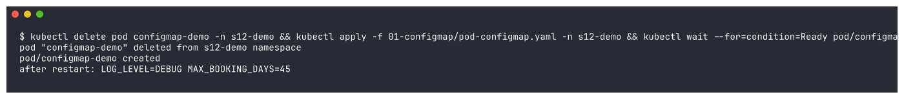

**Observation:** a ConfigMap mounted as a **volume** is refreshed in place by the kubelet (it
took ~1.5 min here - the kubelet sync period plus cache TTL); environment variables are copied
into the process **only when the container starts**, so they need a Pod restart (`kubectl rollout
restart deployment/...` for Deployments). Apps that re-read their config file can pick up changes
without a restart.

---

## Task 2: Secret

[`02-secret/db-secret.yaml`](02-secret/db-secret.yaml) holds 3 base64-encoded **dummy** values;
[`02-secret/pod-secret.yaml`](02-secret/pod-secret.yaml) injects them as env vars
(`secretKeyRef`) and as read-only files (secret volume, `defaultMode: 0400`).

**Create the Secret / store sensitive values**
```bash
kubectl apply -f 02-secret/db-secret.yaml -n s12-demo
kubectl get secret yatri-db-secret -n s12-demo
kubectl describe secret yatri-db-secret -n s12-demo
```
```
NAME              TYPE     DATA   AGE
yatri-db-secret   Opaque   3      0s
Type:  Opaque
Data
====
POSTGRES_DB:        7 bytes
POSTGRES_PASSWORD:  18 bytes
POSTGRES_USER:      9 bytes
```
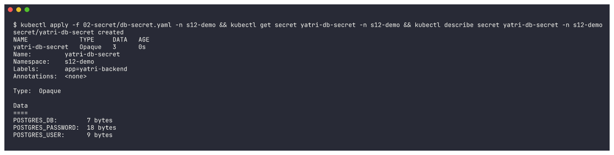

`describe` hides the values - but they are only **base64-encoded**, not encrypted:
```bash
kubectl get secret yatri-db-secret -n s12-demo -o jsonpath='{.data}'
kubectl get secret yatri-db-secret -n s12-demo -o jsonpath='{.data.POSTGRES_PASSWORD}' | base64 -d
```
```
{"POSTGRES_DB":"ZGVtb19kYg==","POSTGRES_PASSWORD":"ZHVtbXktcGFzc3dvcmQtMTIz","POSTGRES_USER":"ZGVtb191c2Vy"}
--- anyone who can read the Secret (or the YAML in git) can decode it:
dummy-password-123
```
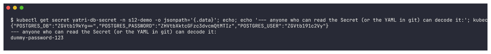

**Inject into a Pod and verify inside the container**
```bash
kubectl apply -f 02-secret/pod-secret.yaml -n s12-demo
kubectl logs secret-demo -n s12-demo
kubectl exec secret-demo -n s12-demo -- sh -c 'echo POSTGRES_USER=$POSTGRES_USER; echo POSTGRES_DB=$POSTGRES_DB; echo POSTGRES_PASSWORD=$POSTGRES_PASSWORD'
kubectl exec secret-demo -n s12-demo -- ls -lL /etc/db-creds
kubectl exec secret-demo -n s12-demo -- sh -c 'mount | grep db-creds'
```
```
Connecting to demo_db as demo_user
POSTGRES_USER=demo_user
POSTGRES_DB=demo_db
POSTGRES_PASSWORD=dummy-password-123
--- mounted as files (tmpfs, mode 0400):
-r--------    1 root     root             7 Oct  7 19:27 POSTGRES_DB
-r--------    1 root     root            18 Oct  7 19:27 POSTGRES_PASSWORD
-r--------    1 root     root             9 Oct  7 19:27 POSTGRES_USER
user=demo_user db=demo_db
tmpfs on /etc/db-creds type tmpfs (ro,relatime,size=32768k,noswap)
```
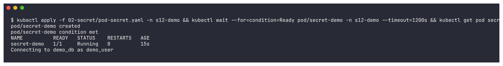
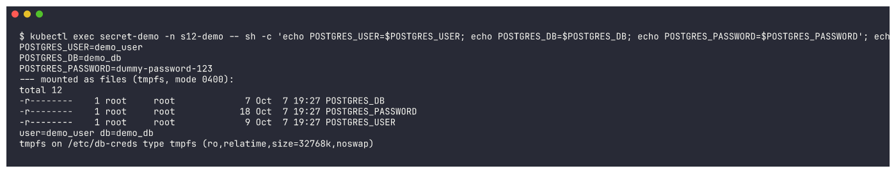

The app sees plain-text values (Kubernetes decodes base64 for it). Secret volumes live on
**tmpfs** (RAM, never written to the node's disk), read-only, with the file mode I asked for.

Generating a Secret manifest from the CLI (no hand-made base64, no newline mistakes):
```bash
kubectl create secret generic demo-cli-secret --from-literal=API_KEY=dummy-not-a-real-key -n s12-demo --dry-run=client -o yaml
```
```yaml
apiVersion: v1
data:
  API_KEY: ZHVtbXktbm90LWEtcmVhbC1rZXk=
kind: Secret
metadata:
  name: demo-cli-secret
  namespace: s12-demo
```


### Why Secrets should NOT be committed directly to Git

1. **base64 is not encryption** - as shown above, one `base64 -d` reveals the value. A Secret YAML
   in a repo is effectively a plain-text password.
2. **Git never forgets** - deleting the file later does not remove it from history, forks, clones,
   CI caches or PR diffs. A leaked credential must be **rotated**, not just removed.
3. **Repos are widely shared** - everyone with read access (and every tool/integration with read
   access) gets production credentials; public repos are scanned by bots within minutes.
4. **No access control / audit** per secret, and the same value tends to be copied to every environment.

What to do instead: keep only templates or obviously fake values in git (like this repo), add
real secret files to `.gitignore`, and inject real values at deploy time - CI/CD secret variables
(the reference repo's `azure-pipelines.yml` approach), **Sealed Secrets** / **SOPS** (encrypted
in git, decrypted only in the cluster), or an external store (**HashiCorp Vault**, **AWS Secrets
Manager** + External Secrets Operator). In the cluster: enable encryption at rest for etcd and
restrict `get secrets` with RBAC.

### ConfigMap + Secret injected together ([`05-combined/backend-with-config.yaml`](05-combined/backend-with-config.yaml))
```yaml
envFrom:
  - configMapRef:
      name: yatri-app-config     # all non-sensitive keys
  - secretRef:
      name: yatri-db-secret      # all sensitive keys
```
```bash
kubectl apply -f 05-combined/backend-with-config.yaml -n s12-demo
kubectl logs deployment/yatri-backend-combined -n s12-demo
kubectl exec deployment/yatri-backend-combined -n s12-demo -- sh -c 'echo ENVIRONMENT=$ENVIRONMENT  [ConfigMap]; ...'
```
```
deployment "yatri-backend-combined" successfully rolled out
Running with ENV=production LOG_LEVEL=DEBUG and USER=demo_user DB=demo_db
ENVIRONMENT=production [ConfigMap]
LOG_LEVEL=DEBUG [ConfigMap]
DEFAULT_CURRENCY=INR [ConfigMap]
POSTGRES_USER=demo_user [Secret]
POSTGRES_DB=demo_db [Secret]
```
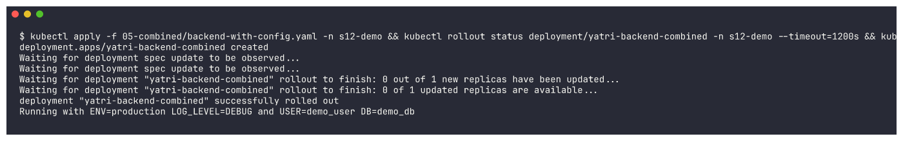
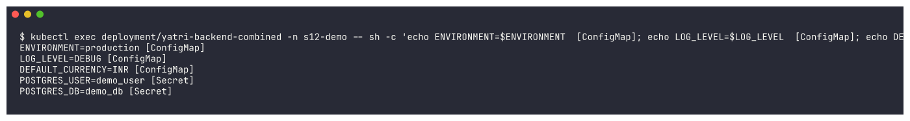

(`LOG_LEVEL=DEBUG` because the ConfigMap had already been updated to v2 in Task 1.)

---

## Task 3: Ingress - full demo (frontend + backend + ConfigMap + Secret + Ingress)

| Object | File | Details |
|---|---|---|
| Frontend | [`03-ingress/frontend.yaml`](03-ingress/frontend.yaml) | nginx x2, page served from a ConfigMap volume, ClusterIP Service `yatri-frontend-service:80` |
| Backend | [`03-ingress/backend.yaml`](03-ingress/backend.yaml) | Python HTTP API x2 reading the ConfigMap (`envFrom`) and the Secret (`secretKeyRef`); prints host header, path and serving Pod; Service `yatri-backend-service:80 -> 5000` |
| Ingress | [`03-ingress/ingress.yaml`](03-ingress/ingress.yaml) | `yatri.local/` -> frontend, `yatri.local/api` -> backend (path-based), `api.yatri.local/` -> backend (host-based) |
| TLS Ingress | [`03-ingress/ingress-tls.yaml`](03-ingress/ingress-tls.yaml) | `https://secure.yatri.local` with a self-signed cert in Secret `yatri-tls` |

**Deploy application + create Services**
```bash
kubectl apply -f 03-ingress/frontend.yaml -f 03-ingress/backend.yaml -n s12-demo
kubectl get pods,svc -n s12-demo -l 'app in (yatri-frontend,yatri-backend)'
```
```
pod/yatri-backend-578f965c76-2mv87   1/1     Running   0          17s
pod/yatri-backend-578f965c76-gq4d4   1/1     Running   0          16s
pod/yatri-frontend-d544c8744-vww6l   1/1     Running   0          18s
pod/yatri-frontend-d544c8744-wqjdm   1/1     Running   0          18s
service/yatri-backend-service    ClusterIP   10.105.202.13    <none>        80/TCP    17s
service/yatri-frontend-service   ClusterIP   10.111.156.176   <none>        80/TCP    18s
```
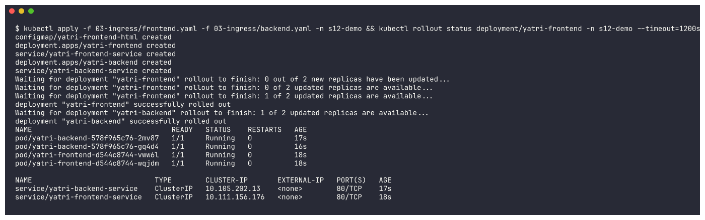

**Configure the Ingress**
```bash
kubectl apply -f 03-ingress/ingress.yaml -n s12-demo
kubectl get ingress yatri-ingress -n s12-demo
kubectl describe ingress yatri-ingress -n s12-demo
```
```
NAME            CLASS   HOSTS                         ADDRESS        PORTS   AGE
yatri-ingress   nginx   yatri.local,api.yatri.local   192.168.49.2   80      18s
Rules:
  Host             Path  Backends
  ----             ----  --------
  yatri.local
                   /api   yatri-backend-service:80 (10.244.0.40:5000,10.244.0.41:5000)
                   /      yatri-frontend-service:80 (10.244.0.38:80,10.244.0.36:80)
  api.yatri.local
                   /   yatri-backend-service:80 (10.244.0.40:5000,10.244.0.41:5000)
```
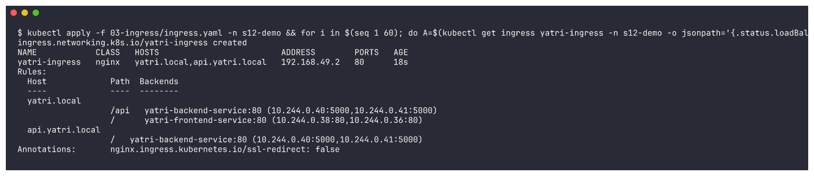

The controller picked the Ingress up and published the node IP as its ADDRESS; `describe` shows
it already resolved each rule to the Pod endpoints.

**Access the application through the Ingress - path-based routing**

My first attempt printed only the headings: the curl requests ran before the brand-new
`kubectl port-forward` was ready (I only waited a fixed 5 s on an overloaded laptop), so curl got
"connection refused" and `-s` hid the error:

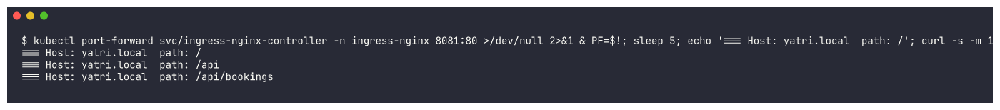

Re-run (in a fresh namespace `s12-ingress`, same YAMLs - see the setup capture below), this time
waiting until the port-forward answers before sending requests:
```bash
kubectl port-forward svc/ingress-nginx-controller -n ingress-nginx 8081:80 &
for i in $(seq 1 40); do curl -s -o /dev/null -m 2 http://localhost:8081/ && break; sleep 1; done
curl -s -H 'Host: yatri.local' http://localhost:8081/
curl -s -H 'Host: yatri.local' http://localhost:8081/api
curl -s -H 'Host: yatri.local' http://localhost:8081/api/bookings
```
```
=== Host: yatri.local  path: /
Yatri FRONTEND (nginx) - served via Ingress path "/"
=== Host: yatri.local  path: /api
Yatri BACKEND API
host header     : yatri.local
path            : /api
served by pod   : yatri-backend-578f965c76-6zccv
ENVIRONMENT     : production
DEFAULT_CURRENCY: INR
POSTGRES_USER   : demo_user
POSTGRES_DB     : demo_db
=== Host: yatri.local  path: /api/bookings
Yatri BACKEND API
host header     : yatri.local
path            : /api/bookings
served by pod   : yatri-backend-578f965c76-9xss4
```

Same host, different paths, different Services: `/` went to the nginx frontend, `/api` and
`/api/bookings` (Prefix match) went to the Python backend - which also proves the ConfigMap
(`ENVIRONMENT`, `DEFAULT_CURRENCY`) and Secret (`POSTGRES_USER`, `POSTGRES_DB`) values reached the
app. Consecutive requests were served by different backend Pods (`-6zccv`, `-9xss4`).

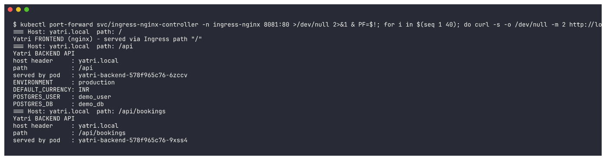

**Host-based (virtual host) routing + unknown host**
```bash
curl -s -H 'Host: api.yatri.local' http://localhost:8081/
curl -s -o /dev/null -w 'HTTP %{http_code}\n' -H 'Host: unknown.local' http://localhost:8081/
```
```
=== Host: api.yatri.local  path: /
Yatri BACKEND API
host header     : api.yatri.local
path            : /
served by pod   : yatri-backend-578f965c76-2mv87
ENVIRONMENT     : production
DEFAULT_CURRENCY: INR
POSTGRES_USER   : demo_user
POSTGRES_DB     : demo_db
=== Host: unknown.local (no rule) -> controller default backend:
HTTP 404
```
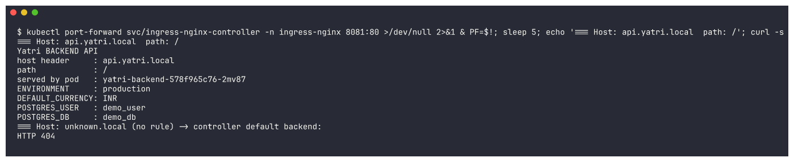

**Verify routing in the controller's access log**
```bash
kubectl logs -n ingress-nginx deploy/ingress-nginx-controller --tail=300 | grep -E 'yatri|unknown.local' | tail -5
```
```
I1007 19:29:16.776694  7 status.go:311] "updating Ingress status" namespace="s12-demo" ingress="yatri-ingress" currentValue=null newValue=[{"ip":"192.168.49.2"}]
127.0.0.1 - - [07/Oct/2026:19:29:47 +0000] "GET / HTTP/1.1" 200 226 "-" "curl/8.7.1" 78 0.262 [s12-demo-yatri-backend-service-80] [] 10.244.0.40:5000 226 0.261 200 ...
```
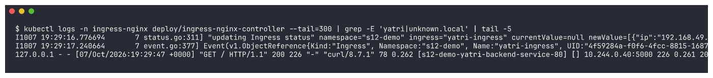

The log line shows the request for `api.yatri.local /` was sent to upstream
`[s12-demo-yatri-backend-service-80]` -> Pod `10.244.0.40:5000`.

### TLS Ingress with a self-signed certificate

```bash
openssl req -x509 -nodes -newkey rsa:2048 -days 30 -keyout $TLS_DIR/tls.key -out $TLS_DIR/tls.crt \
  -subj '/CN=secure.yatri.local/O=yatri-demo' -addext 'subjectAltName=DNS:secure.yatri.local'
openssl x509 -in $TLS_DIR/tls.crt -noout -subject -issuer -dates -ext subjectAltName
```
```
subject=CN=secure.yatri.local, O=yatri-demo
issuer=CN=secure.yatri.local, O=yatri-demo
notBefore=Oct  7 19:30:06 2026 GMT
notAfter=Nov  6 19:30:06 2026 GMT
X509v3 Subject Alternative Name:
    DNS:secure.yatri.local
```
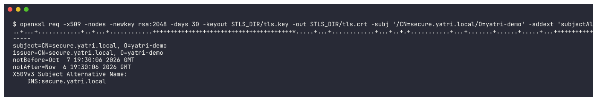

`$TLS_DIR` is a temporary folder **outside this repo** - the private key is deliberately not committed.

```bash
kubectl create secret tls yatri-tls --cert=$TLS_DIR/tls.crt --key=$TLS_DIR/tls.key -n s12-demo
kubectl describe secret yatri-tls -n s12-demo
kubectl apply -f 03-ingress/ingress-tls.yaml -n s12-demo
kubectl get ingress -n s12-demo
```
```
yatri-tls   kubernetes.io/tls   2      0s
tls.crt:  1237 bytes
tls.key:  1704 bytes
NAME                CLASS   HOSTS                         ADDRESS        PORTS     AGE
yatri-ingress       nginx   yatri.local,api.yatri.local   192.168.49.2   80        80s
yatri-ingress-tls   nginx   secure.yatri.local            192.168.49.2   80, 443   12s
TLS:
  yatri-tls terminates secure.yatri.local
```
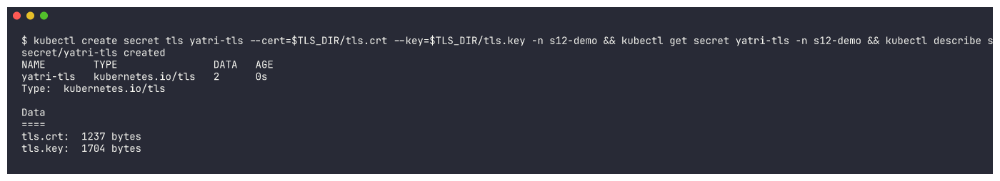
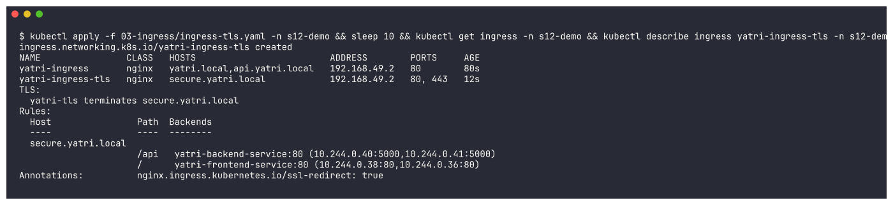

First HTTPS test - same port-forward timing problem as above (empty output):

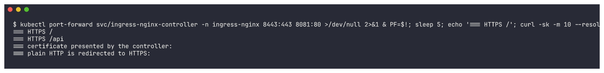


Re-run setup in namespace `s12-ingress` (ConfigMap, Secret, frontend, backend, TLS Secret from the
same cert, both Ingresses):
```bash
kubectl create namespace s12-ingress
kubectl apply -f 01-configmap/app-config.yaml -f 02-secret/db-secret.yaml -f 03-ingress/frontend.yaml -f 03-ingress/backend.yaml -n s12-ingress
kubectl create secret tls yatri-tls --cert=$TLS_DIR/tls.crt --key=$TLS_DIR/tls.key -n s12-ingress
kubectl apply -f 03-ingress/ingress.yaml -f 03-ingress/ingress-tls.yaml -n s12-ingress
kubectl get pods,svc,ingress -n s12-ingress
```
```
namespace/s12-ingress created
configmap/yatri-app-config created
secret/yatri-db-secret created
configmap/yatri-frontend-html created
deployment.apps/yatri-frontend created
service/yatri-frontend-service created
deployment.apps/yatri-backend created
service/yatri-backend-service created
secret/yatri-tls created
ingress.networking.k8s.io/yatri-ingress created
ingress.networking.k8s.io/yatri-ingress-tls created
pod/yatri-backend-578f965c76-6zccv   1/1     Running   0          47s
pod/yatri-backend-578f965c76-9xss4   1/1     Running   0          47s
pod/yatri-frontend-d544c8744-fsnqc   1/1     Running   0          47s
pod/yatri-frontend-d544c8744-wrjhl   1/1     Running   0          47s
service/yatri-backend-service    ClusterIP   10.96.191.45     <none>        80/TCP    47s
service/yatri-frontend-service   ClusterIP   10.101.192.110   <none>        80/TCP    47s
ingress.networking.k8s.io/yatri-ingress       nginx   yatri.local,api.yatri.local   192.168.49.2   80        46s
ingress.networking.k8s.io/yatri-ingress-tls   nginx   secure.yatri.local            192.168.49.2   80, 443   46s
```

(Why a new namespace: `s12-demo` was stuck in `Terminating` - the shared cluster's metrics-server
API was unavailable, which blocks namespace deletion cluster-wide - so I could not recreate it.)

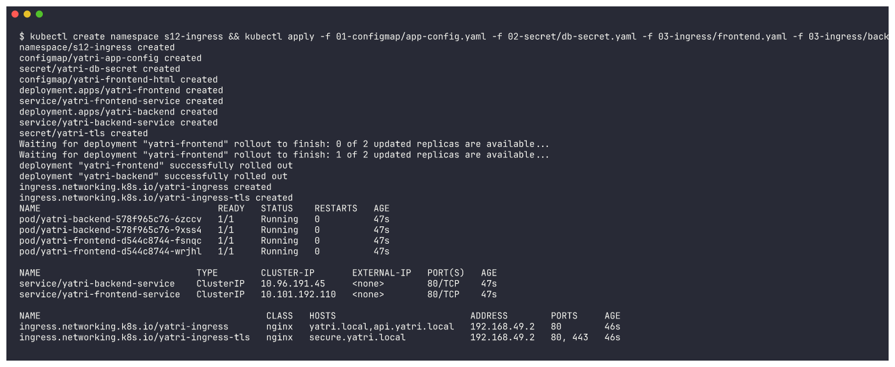

```bash
kubectl port-forward svc/ingress-nginx-controller -n ingress-nginx 8443:443 8081:80 &
curl -sk --resolve secure.yatri.local:8443:127.0.0.1 https://secure.yatri.local:8443/
curl -sk --resolve secure.yatri.local:8443:127.0.0.1 https://secure.yatri.local:8443/api
curl -vk --resolve secure.yatri.local:8443:127.0.0.1 https://secure.yatri.local:8443/ 2>&1 | grep -E 'subject:|issuer:|SSL connection|< HTTP/'
curl -sI -H 'Host: secure.yatri.local' http://localhost:8081/ | grep -iE '^HTTP|^location'
```
```
=== HTTPS /
Yatri FRONTEND (nginx) - served via Ingress path "/"
=== HTTPS /api
Yatri BACKEND API
host header     : secure.yatri.local:8443
path            : /api
served by pod   : yatri-backend-578f965c76-6zccv
=== certificate presented by the controller:
* SSL connection using TLSv1.3 / AEAD-AES256-GCM-SHA384 / [blank] / UNDEF
*  subject: CN=secure.yatri.local; O=yatri-demo
*  issuer: CN=secure.yatri.local; O=yatri-demo
< HTTP/2 200
=== plain HTTP is redirected to HTTPS:
HTTP/1.1 308 Permanent Redirect
Location: https://secure.yatri.local
```

**Observation:** the controller terminated TLS 1.3 with **my** certificate (subject = issuer =
`CN=secure.yatri.local` -> self-signed) and forwarded plain HTTP to the same frontend/backend
Services; plain HTTP to that host gets a **308 redirect** to HTTPS because of
`ssl-redirect: "true"`.

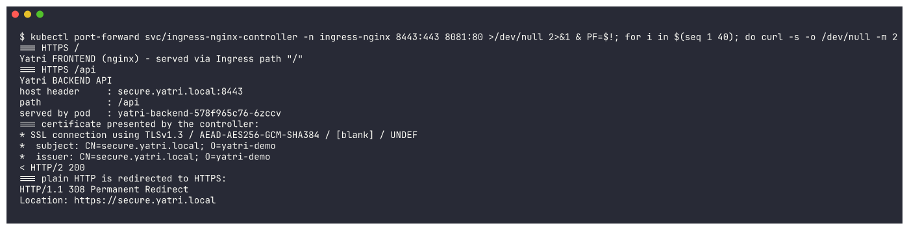


`--resolve` makes curl send `secure.yatri.local` (for SNI and the Host header) to 127.0.0.1 without
touching `/etc/hosts`; `-k` accepts the self-signed certificate.

---

## Task 4: Ingress vs Ingress Controller

See [`ingress-vs-ingress-controller/README.md`](ingress-vs-ingress-controller/README.md).
Short version: the **Ingress** is a set of routing rules (a YAML object); the **Ingress
Controller** (ingress-nginx here) is the running proxy that reads those rules and actually routes
the traffic - you need both.

---

## Task 5: Troubleshooting - "password authentication failed" (Secret with a trailing newline)

Scenario from the reference repo's `troubleshooting/secret-base64-gotcha.md`
(the "Trailing Newline Secret Bug"), reproduced for real in namespace `s12-troubleshoot`:

| File | Role |
|---|---|
| [`04-troubleshooting/postgres.yaml`](04-troubleshooting/postgres.yaml) | PostgreSQL 16 created with user `yatri_admin` / password `dummy-pass-123` (Secret via `stringData`) |
| [`04-troubleshooting/app-secret-broken.yaml`](04-troubleshooting/app-secret-broken.yaml) | the app's Secret, value made with `echo "dummy-pass-123" \| base64` |
| [`04-troubleshooting/app-client.yaml`](04-troubleshooting/app-client.yaml) | "the app": tries `psql` login every 5 s using the app Secret |
| [`04-troubleshooting/app-secret-fixed.yaml`](04-troubleshooting/app-secret-fixed.yaml) | the corrected Secret (`echo -n`) |

**Setup**
```bash
kubectl create namespace s12-troubleshoot
kubectl apply -f 04-troubleshooting/postgres.yaml -n s12-troubleshoot
kubectl apply -f 04-troubleshooting/app-secret-broken.yaml -f 04-troubleshooting/app-client.yaml -n s12-troubleshoot
kubectl get pods -n s12-troubleshoot
```
```
pod/postgres-d45dfc8ff-gkhb2   1/1     Running   0          110s
service/postgres   ClusterIP   10.98.57.54   <none>        5432/TCP   110s
data:
  DB_USER: eWF0cmlfYWRtaW4=
  DB_PASSWORD: ZHVtbXktcGFzcy0xMjMK
postgres-d45dfc8ff-gkhb2     1/1     Running   0          2m56s
yatri-app-6759575d79-w4pjb   1/1     Running   0          60s
```
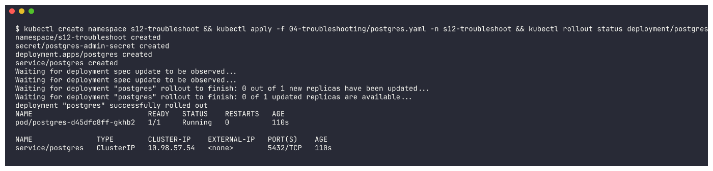
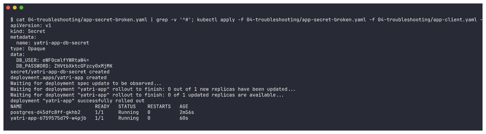

### 1. Identify the problem (BEFORE)
```bash
kubectl logs deployment/yatri-app -n s12-troubleshoot --tail=3
kubectl logs deployment/postgres -n s12-troubleshoot --tail=4
```
```
=== app logs:
psql: error: connection to server at "postgres" (10.98.57.54), port 5432 failed: FATAL:  password authentication failed for user "yatri_admin"
psql: error: connection to server at "postgres" (10.98.57.54), port 5432 failed: FATAL:  password authentication failed for user "yatri_admin"
=== postgres logs:
2026-10-07 19:33:50.030 UTC [260] FATAL:  password authentication failed for user "yatri_admin"
2026-10-07 19:33:50.030 UTC [260] DETAIL:  Connection matched file "/var/lib/postgresql/data/pg_hba.conf" line 128: "host all all all scram-sha-256"
```
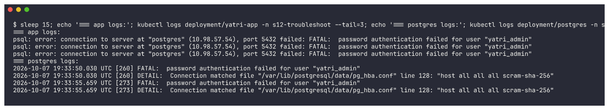

Both Pods are `Running` - Kubernetes sees nothing wrong. DNS and the network are fine too (the app
reaches `postgres` at 10.98.57.54:5432 and the server answers). The server rejects the password.

### 2. Troubleshooting commands - compare the two passwords byte by byte
```bash
kubectl get secret yatri-app-db-secret -n s12-troubleshoot -o jsonpath='{.data.DB_PASSWORD}' | base64 -d | xxd
kubectl get secret postgres-admin-secret -n s12-troubleshoot -o jsonpath='{.data.POSTGRES_PASSWORD}' | base64 -d | xxd
kubectl exec deployment/yatri-app -n s12-troubleshoot -- sh -c 'printf %s "$DB_PASSWORD" | wc -c'
```
```
=== password the APP sends (from yatri-app-db-secret):
00000000: 6475 6d6d 792d 7061 7373 2d31 3233 0a    dummy-pass-123.
=== password the DB was created with (postgres-admin-secret):
00000000: 6475 6d6d 792d 7061 7373 2d31 3233       dummy-pass-123
=== length inside the running app container:
15
```
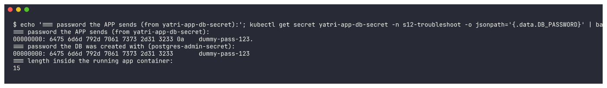

### 3. Root cause
The app's password has an extra byte **`0a` = `\n`** (15 characters instead of 14). The Secret
value was generated with plain `echo`, which appends a newline, and base64 faithfully encodes it:
```bash
echo    "dummy-pass-123" | base64
echo -n "dummy-pass-123" | base64
echo "dummy-pass-123" | xxd
```
```
echo    "dummy-pass-123" | base64  -> ZHVtbXktcGFzcy0xMjMK      <- trailing "K" = encoded \n
echo -n "dummy-pass-123" | base64  -> ZHVtbXktcGFzcy0xMjM=
00000000: 6475 6d6d 792d 7061 7373 2d31 3233 0a    dummy-pass-123.
```
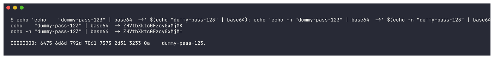

### 4. Fix the issue
Replace the value with the `echo -n` version ([`app-secret-fixed.yaml`](04-troubleshooting/app-secret-fixed.yaml)):
```bash
diff 04-troubleshooting/app-secret-broken.yaml 04-troubleshooting/app-secret-fixed.yaml
kubectl apply -f 04-troubleshooting/app-secret-fixed.yaml -n s12-troubleshoot
kubectl logs deployment/yatri-app -n s12-troubleshoot --tail=2
```
```
<   DB_PASSWORD: ZHVtbXktcGFzcy0xMjMK
---
>   DB_PASSWORD: ZHVtbXktcGFzcy0xMjM=
secret/yatri-app-db-secret configured
=== logs right after fixing the Secret (pod NOT restarted):
psql: error: ... FATAL:  password authentication failed for user "yatri_admin"
psql: error: ... FATAL:  password authentication failed for user "yatri_admin"
```
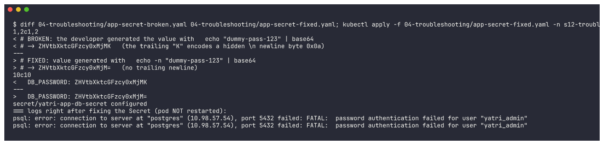

**Second lesson:** fixing the Secret is not enough - the app reads it through `envFrom`, and
environment variables are fixed when the container starts (same as the ConfigMap demo in Task 1).
The Pod has to be restarted:
```bash
kubectl rollout restart deployment/yatri-app -n s12-troubleshoot
kubectl logs deployment/yatri-app -n s12-troubleshoot --tail=3
```
```
deployment.apps/yatri-app restarted
deployment "yatri-app" successfully rolled out
postgres-d45dfc8ff-gkhb2     1/1     Running   0          4m53s
yatri-app-65bc986669-vf7c5   1/1     Running   0          31s
=== app logs after restart:
DB connection OK as yatri_admin
DB connection OK as yatri_admin
DB connection OK as yatri_admin
```
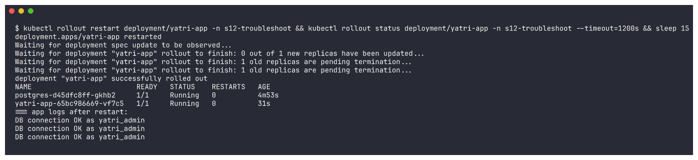

### 5. AFTER
```bash
kubectl exec deployment/yatri-app -n s12-troubleshoot -- sh -c 'printf %s "$DB_PASSWORD" | wc -c'
kubectl get secret yatri-app-db-secret -n s12-troubleshoot -o jsonpath='{.data.DB_PASSWORD}' | base64 -d | xxd
```
```
14
00000000: 6475 6d6d 792d 7061 7373 2d31 3233       dummy-pass-123
```
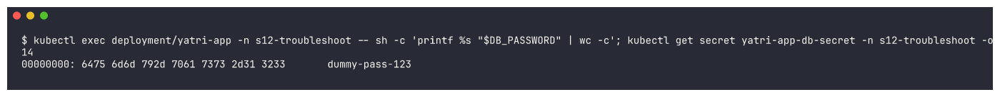


| | Before | After |
|---|---|---|
| Secret value | `ZHVtbXktcGFzcy0xMjMK` | `ZHVtbXktcGFzcy0xMjM=` |
| Bytes the app sends | 15 (`...3233 0a`) | 14 (`...3233`) |
| App log | `FATAL: password authentication failed` | `DB connection OK as yatri_admin` |

**Prevention:** always `echo -n` (or `printf %s`) when base64-encoding by hand - better, let
kubectl do it (`kubectl create secret generic --from-literal=...` or `stringData:` in YAML); after
changing a Secret used as env vars, `kubectl rollout restart` the workload; and when a password
"that is definitely correct" is rejected, compare the bytes with `xxd`.
