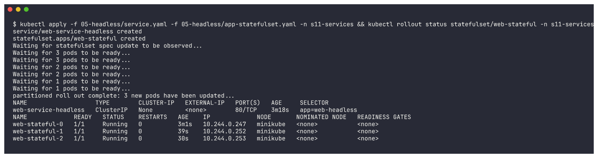
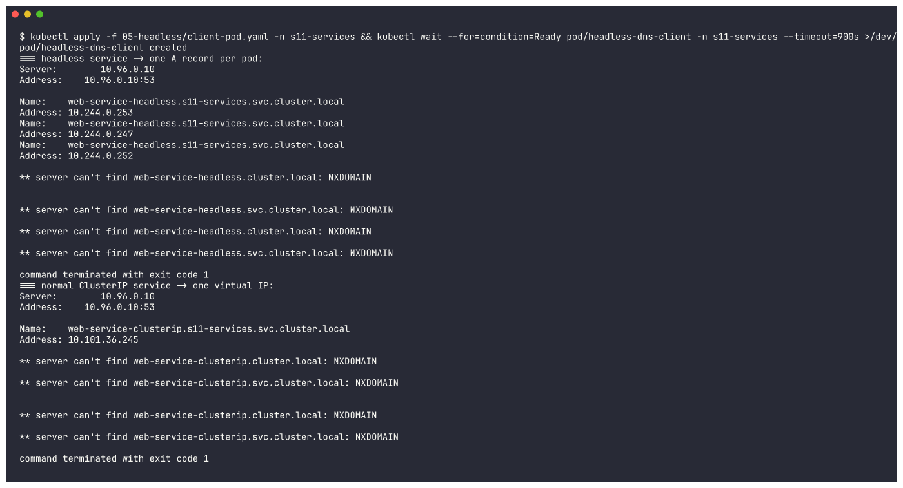
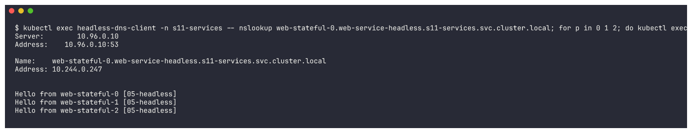
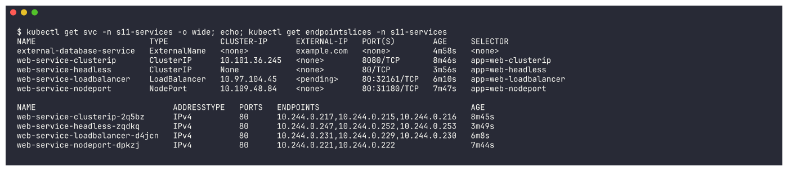
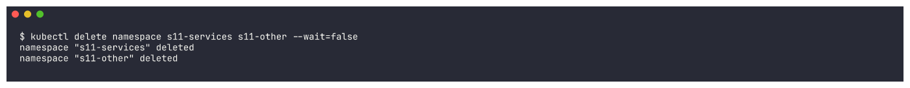

# Session 11: Kubernetes Networking & Services - Homework

All five Service types deployed and tested on my local minikube cluster (Kubernetes v1.37.0,
docker driver on macOS/arm64), plus the object comparison, FQDN and CoreDNS write-ups.

| Deliverable | Where |
|---|---|
| Service YAML files | [`01-clusterip/`](01-clusterip/) [`02-nodeport/`](02-nodeport/) [`03-loadbalancer/`](03-loadbalancer/) [`04-externalname/`](04-externalname/) [`05-headless/`](05-headless/) |
| Task 1 - 5 Service types (this file) | below |
| Task 2 - object comparison | [`object-comparison/README.md`](object-comparison/README.md) |
| Task 3 - FQDN | [`fqdn/README.md`](fqdn/README.md) |
| Task 4 - CoreDNS | [`coredns/README.md`](coredns/README.md) |
| Screenshots / raw output | [`screenshots/`](screenshots/), [`outputs/`](outputs/) |

The YAMLs come from the course reference repo (`devops-heros/session-11-kubernetes-services`).
My changes: every nginx Pod answers with its own name (`Hello from pod <name> [folder]`) so load
balancing is visible; NodePort `30080` -> `31180` (the cluster is shared); ExternalName points to
`example.com`.

Namespaces: `s11-services` (everything) and `s11-other` (to test cross-namespace DNS).
```bash
kubectl create namespace s11-services && kubectl create namespace s11-other
```


---

## 1. ClusterIP ([`01-clusterip/`](01-clusterip/))

Files: `app-deployment.yaml` (3 nginx Pods, label `app=web-clusterip`), `service.yaml`
(ClusterIP, port 8080 -> targetPort 80), `client-pod.yaml` (curl client).

**Deploy the application**
```bash
kubectl apply -f 01-clusterip/app-deployment.yaml -n s11-services
kubectl get pods -l app=web-clusterip -n s11-services -o wide
```
```
web-app-clusterip-5d984469f7-4shgn   1/1     Running   0          61s   10.244.0.216   minikube
web-app-clusterip-5d984469f7-9pdkk   1/1     Running   0          61s   10.244.0.217   minikube
web-app-clusterip-5d984469f7-g4hrl   1/1     Running   0          61s   10.244.0.215   minikube
```


**Create + verify the Service**
```bash
kubectl apply -f 01-clusterip/service.yaml -n s11-services
kubectl get svc web-service-clusterip -n s11-services -o wide
kubectl describe svc web-service-clusterip -n s11-services
```
```
NAME                    TYPE        CLUSTER-IP      EXTERNAL-IP   PORT(S)    AGE   SELECTOR
web-service-clusterip   ClusterIP   10.101.36.245   <none>        8080/TCP   1s    app=web-clusterip
Port:                     http  8080/TCP
TargetPort:               80/TCP
Endpoints:                10.244.0.217:80,10.244.0.215:80,10.244.0.216:80
```


```bash
kubectl get endpoints web-service-clusterip -n s11-services
kubectl get endpointslices -l kubernetes.io/service-name=web-service-clusterip -n s11-services -o wide
```
```
Warning: v1 Endpoints is deprecated in v1.33+; use discovery.k8s.io/v1 EndpointSlice
web-service-clusterip   10.244.0.215:80,10.244.0.216:80,10.244.0.217:80   3s
web-service-clusterip-2q5bz   IPv4          80      10.244.0.217,10.244.0.215,10.244.0.216   2s
```


The endpoints are exactly the 3 Pod IPs selected by `app=web-clusterip`. (The old `Endpoints`
API still works but is deprecated - EndpointSlices are what kube-proxy uses now.)

**Test connectivity (from inside the cluster)**
```bash
kubectl apply -f 01-clusterip/client-pod.yaml -n s11-services
kubectl exec curl-client -n s11-services -- sh -c 'for i in 1 2 3 4 5 6 7 8 9; do curl -s http://web-service-clusterip:8080; done' | sort | uniq -c
kubectl exec curl-client -n s11-services -- curl -s http://10.101.36.245:8080
kubectl exec curl-client -n s11-services -- curl -s http://web-service-clusterip.s11-services.svc.cluster.local:8080
```
```
--- by service name (x9):
   4 Hello from pod web-app-clusterip-5d984469f7-4shgn [01-clusterip]
   3 Hello from pod web-app-clusterip-5d984469f7-9pdkk [01-clusterip]
   2 Hello from pod web-app-clusterip-5d984469f7-g4hrl [01-clusterip]
--- by ClusterIP 10.101.36.245:
Hello from pod web-app-clusterip-5d984469f7-9pdkk [01-clusterip]
--- by FQDN:
Hello from pod web-app-clusterip-5d984469f7-4shgn [01-clusterip]
```


From my Mac a ClusterIP is not reachable directly; `kubectl port-forward` tunnels to it for debugging:
```bash
kubectl port-forward svc/web-service-clusterip 18080:8080 -n s11-services &
curl -s http://localhost:18080
```
```
--- from my Mac through kubectl port-forward:
Hello from pod web-app-clusterip-5d984469f7-g4hrl [01-clusterip]
```


**Observation:** one stable virtual IP / DNS name in front of 3 Pods, requests spread over all of
them. Only reachable inside the cluster - the right default for internal services.

---

## 2. NodePort ([`02-nodeport/`](02-nodeport/))

`service.yaml`: `type: NodePort`, `port: 80`, `targetPort: 80`, `nodePort: 31180`.
```bash
kubectl apply -f 02-nodeport/app-deployment.yaml -f 02-nodeport/service.yaml -n s11-services
kubectl get svc web-service-nodeport -n s11-services -o wide
kubectl get endpointslices -l kubernetes.io/service-name=web-service-nodeport -n s11-services
```
```
NAME                   TYPE       CLUSTER-IP     EXTERNAL-IP   PORT(S)        AGE   SELECTOR
web-service-nodeport   NodePort   10.109.48.84   <none>        80:31180/TCP   73s   app=web-nodeport
web-service-nodeport-dpkzj   IPv4          80      10.244.0.221,10.244.0.222   71s
```


**Test: `<NodeIP>:<NodePort>`** (from the node itself - with the docker driver on macOS the node
IP 192.168.49.2 is not routable from the Mac):
```bash
minikube ip
minikube ssh -- 'for i in 1 2 3 4; do curl -s -m 5 http://192.168.49.2:31180; done'
```
```
node IP: 192.168.49.2
Hello from pod web-app-nodeport-6d76dbbf45-4xdqg [02-nodeport]
Hello from pod web-app-nodeport-6d76dbbf45-n4wv8 [02-nodeport]
Hello from pod web-app-nodeport-6d76dbbf45-n4wv8 [02-nodeport]
Hello from pod web-app-nodeport-6d76dbbf45-4xdqg [02-nodeport]
```


**Test from my Mac** - `minikube service --url` opens a tunnel to the NodePort:
```bash
minikube service web-service-nodeport -n s11-services --url &
curl -s http://127.0.0.1:63829
```
```
http://127.0.0.1:63829
! Because you are using a Docker driver on darwin, the terminal needs to be open to run it.
--- curl http://127.0.0.1:63829 from my Mac:
Hello from pod web-app-nodeport-6d76dbbf45-n4wv8 [02-nodeport]
Hello from pod web-app-nodeport-6d76dbbf45-4xdqg [02-nodeport]
```


**Observation:** a NodePort Service is a ClusterIP Service **plus** port 31180 opened on every
node; traffic to any node on that port is load-balanced to the Pods.

---

## 3. LoadBalancer ([`03-loadbalancer/`](03-loadbalancer/))

```bash
kubectl apply -f 03-loadbalancer/app-deployment.yaml -f 03-loadbalancer/service.yaml -n s11-services
kubectl get svc web-service-loadbalancer -n s11-services -o wide
kubectl describe svc web-service-loadbalancer -n s11-services
```
```
NAME                       TYPE           CLUSTER-IP     EXTERNAL-IP   PORT(S)        AGE   SELECTOR
web-service-loadbalancer   LoadBalancer   10.97.104.45   <pending>     80:32161/TCP   50s   app=web-loadbalancer

Type:                     LoadBalancer
IP:                       10.97.104.45
Port:                     http  80/TCP
TargetPort:               80/TCP
NodePort:                 http  32161/TCP
Endpoints:                10.244.0.231:80,10.244.0.229:80,10.244.0.230:80
```


**EXTERNAL-IP stays `<pending>`:** a LoadBalancer Service asks the *cloud controller manager* to
create an external load balancer (an AWS ELB/NLB, GCP LB ...). minikube has no cloud provider, so
nobody fulfils the request. Notice it still got a ClusterIP **and** a NodePort (32161) - LoadBalancer
is built on top of NodePort. `minikube tunnel` would act as the "cloud" and assign an IP, but it
needs sudo and changes host routes, so I accessed it with `minikube service --url` instead:
```bash
minikube service web-service-loadbalancer -n s11-services --url &
for i in 1 2 3 4 5 6; do curl -s http://127.0.0.1:63933; done | sort | uniq -c
```
```
http://127.0.0.1:63933
--- curl http://127.0.0.1:63933 x6 from my Mac:
   4 Hello from pod web-app-loadbalancer-669cd69dc6-l25hr [03-loadbalancer]
   2 Hello from pod web-app-loadbalancer-669cd69dc6-nkx4x [03-loadbalancer]
web-service-loadbalancer   LoadBalancer   10.97.104.45   <pending>     80:32161/TCP   68s
```


On a real cloud cluster (e.g. EKS) EXTERNAL-IP would show a hostname like
`a1b2c3...elb.amazonaws.com` and users would hit that directly.

---

## 4. ExternalName ([`04-externalname/`](04-externalname/))

```yaml
spec:
  type: ExternalName
  externalName: example.com
```
```bash
kubectl apply -f 04-externalname/service.yaml -n s11-services
kubectl get svc external-database-service -n s11-services -o wide
kubectl get endpointslices -l kubernetes.io/service-name=external-database-service -n s11-services
```
```
NAME                        TYPE           CLUSTER-IP   EXTERNAL-IP   PORT(S)   AGE   SELECTOR
external-database-service   ExternalName   <none>       example.com   <none>    1s    <none>
No resources found in s11-services namespace.
```


```bash
kubectl apply -f 04-externalname/client-pod.yaml -n s11-services
kubectl exec dns-test-client -n s11-services -- nslookup external-database-service.s11-services.svc.cluster.local
```
```
external-database-service.s11-services.svc.cluster.local	canonical name = example.com
Name:	example.com
Address: 172.66.147.243
Name:	example.com
Address: 104.20.23.154
```


```bash
kubectl exec dns-test-client -n s11-services -- curl -sI -m 10 -H 'Host: example.com' http://external-database-service | head -5
```
```
HTTP/1.1 200 OK
Date: Wed, 07 Oct 2026 19:23:07 GMT
Content-Type: text/html; charset=utf-8
Connection: keep-alive
Server: cloudflare
```


**Observation:** no ClusterIP, no selector, no endpoints - it is pure DNS: CoreDNS answers with a
**CNAME** to `example.com`. Apps use the in-cluster name; if the external database moves, only the
Service changes. (HTTP needed the real `Host` header because the remote server routes by host name.)

---

## 5. Headless ([`05-headless/`](05-headless/))

`service.yaml` has `clusterIP: None`; `app-statefulset.yaml` is a 3-replica StatefulSet with
`serviceName: web-service-headless`.
```bash
kubectl apply -f 05-headless/service.yaml -f 05-headless/app-statefulset.yaml -n s11-services
kubectl get svc web-service-headless -n s11-services -o wide
kubectl get pods -l app=web-headless -n s11-services -o wide
```
```
NAME                   TYPE        CLUSTER-IP   EXTERNAL-IP   PORT(S)   AGE     SELECTOR
web-service-headless   ClusterIP   None         <none>        80/TCP    3m18s   app=web-headless
web-stateful-0   1/1     Running   0          3m1s   10.244.0.247
web-stateful-1   1/1     Running   0          39s    10.244.0.252
web-stateful-2   1/1     Running   0          30s    10.244.0.253
```


**DNS returns the Pod IPs, not a virtual IP:**
```bash
kubectl apply -f 05-headless/client-pod.yaml -n s11-services
kubectl exec headless-dns-client -n s11-services -- nslookup web-service-headless
kubectl exec headless-dns-client -n s11-services -- nslookup web-service-clusterip
```
```
=== headless service -> one A record per pod:
Name:	web-service-headless.s11-services.svc.cluster.local
Address: 10.244.0.253
Name:	web-service-headless.s11-services.svc.cluster.local
Address: 10.244.0.247
Name:	web-service-headless.s11-services.svc.cluster.local
Address: 10.244.0.252
** server can't find web-service-headless.cluster.local: NXDOMAIN        <- other search suffixes, see note
=== normal ClusterIP service -> one virtual IP:
Name:	web-service-clusterip.s11-services.svc.cluster.local
Address: 10.101.36.245
```


> Note: busybox `nslookup` (in the curl image) queries **every** search suffix for A and AAAA
> and prints the misses (`NXDOMAIN`) too, then exits 1 - but the answer for
> `<name>.s11-services.svc.cluster.local` is there. Details in [`coredns/README.md`](coredns/README.md).

**Per-Pod DNS names** (only with a headless Service + StatefulSet):
```bash
kubectl exec headless-dns-client -n s11-services -- nslookup web-stateful-0.web-service-headless.s11-services.svc.cluster.local
for p in 0 1 2; do kubectl exec headless-dns-client -n s11-services -- curl -s http://web-stateful-$p.web-service-headless; done
```
```
Name:	web-stateful-0.web-service-headless.s11-services.svc.cluster.local
Address: 10.244.0.247
Hello from web-stateful-0 [05-headless]
Hello from web-stateful-1 [05-headless]
Hello from web-stateful-2 [05-headless]
```


**Observation:** with `clusterIP: None` there is no load-balancing VIP; DNS hands out all Pod IPs
and each StatefulSet Pod gets its own stable name - exactly what databases/clusters need to address
a specific member (e.g. "write to `-0`, the primary").

---

## All five side by side

```bash
kubectl get svc -n s11-services -o wide
kubectl get endpointslices -n s11-services
```
```
NAME                        TYPE           CLUSTER-IP      EXTERNAL-IP   PORT(S)        AGE     SELECTOR
external-database-service   ExternalName   <none>          example.com   <none>         4m58s   <none>
web-service-clusterip       ClusterIP      10.101.36.245   <none>        8080/TCP       8m46s   app=web-clusterip
web-service-headless        ClusterIP      None            <none>        80/TCP         3m56s   app=web-headless
web-service-loadbalancer    LoadBalancer   10.97.104.45    <pending>     80:32161/TCP   6m10s   app=web-loadbalancer
web-service-nodeport        NodePort       10.109.48.84    <none>        80:31180/TCP   7m47s   app=web-nodeport

NAME                             ADDRESSTYPE   PORTS   ENDPOINTS                                AGE
web-service-clusterip-2q5bz      IPv4          80      10.244.0.217,10.244.0.215,10.244.0.216   8m45s
web-service-headless-zqdkq       IPv4          80      10.244.0.247,10.244.0.252,10.244.0.253   3m49s
web-service-loadbalancer-d4jcn   IPv4          80      10.244.0.231,10.244.0.229,10.244.0.230   6m8s
web-service-nodeport-dpkzj       IPv4          80      10.244.0.221,10.244.0.222                7m44s
```


(The ExternalName Service has no EndpointSlice at all - it never proxies traffic.)

---

## Which Service type when?

| Service type | Reachable from | How | Use it when | Example |
|---|---|---|---|---|
| **ClusterIP** (default) | inside the cluster only | virtual IP + DNS name, kube-proxy load-balances | service-to-service traffic (backend APIs, databases, caches) | `web-service-clusterip:8080` |
| **NodePort** | outside, via `<any-node-IP>:<30000-32767>` | ClusterIP + a port opened on every node | quick testing, on-prem / bare metal without a load balancer, behind your own external LB | `192.168.49.2:31180` |
| **LoadBalancer** | outside, via a cloud load balancer's IP/DNS | NodePort + ClusterIP + cloud controller provisions an external LB | exposing one service directly on AWS/GCP/Azure (each gets its own LB - costs money) | EXTERNAL-IP `<pending>` on minikube without `minikube tunnel` |
| **ExternalName** | inside the cluster | DNS CNAME only - no proxy, no endpoints | give an external dependency (managed DB, SaaS API) a stable in-cluster name so you can swap it later | `external-database-service` -> `example.com` |
| **Headless** (`clusterIP: None`) | inside the cluster | DNS returns the Pod IPs directly | StatefulSets / clients that need to reach a *specific* Pod (databases, Kafka, ZooKeeper), client-side load balancing | `web-stateful-0.web-service-headless` |
| *(Ingress - not a Service type)* | outside, HTTP/HTTPS | one controller routes by host/path to many ClusterIP Services | many web apps behind one IP / one load balancer, TLS termination | see Session 12 |

Rule of thumb: start with **ClusterIP**; expose HTTP apps to users through an **Ingress**; use
**LoadBalancer** for non-HTTP (TCP/UDP) traffic in the cloud; **NodePort** for labs; **Headless**
for StatefulSets; **ExternalName** to alias something that lives outside the cluster.

---

## Cleanup
```bash
kubectl delete namespace s11-services s11-other --wait=false
```


(The namespaces were created once more for an extra cross-namespace DNS test - see
[`fqdn/README.md`](fqdn/README.md) - and deleted again afterwards.)
