# Session 11: Kubernetes Networking & Services

> Work in progress: the full write-up for this session is being finalised. Every screenshot below is real output from commands run on a local minikube cluster / Docker / GitHub Actions.

## Evidence

### 01-create-namespaces

```bash
kubectl create namespace s11-services && kubectl create namespace s11-other
```

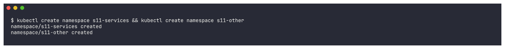

### 02-clusterip-deploy

```bash
kubectl apply -f 01-clusterip/app-deployment.yaml -n s11-services && kubectl rollout status deployment/web-app-clusterip -n s11-services --timeout=1200s && kubectl get pods -l app=web-clusterip -n s11-services -o wide
```

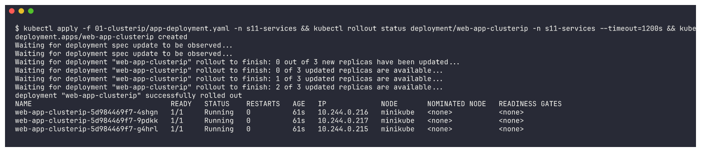

### 03-clusterip-service

```bash
kubectl apply -f 01-clusterip/service.yaml -n s11-services && kubectl get svc web-service-clusterip -n s11-services -o wide && kubectl describe svc web-service-clusterip -n s11-services | sed -n '/^Selector:/,/^Endpoints:/p'
```

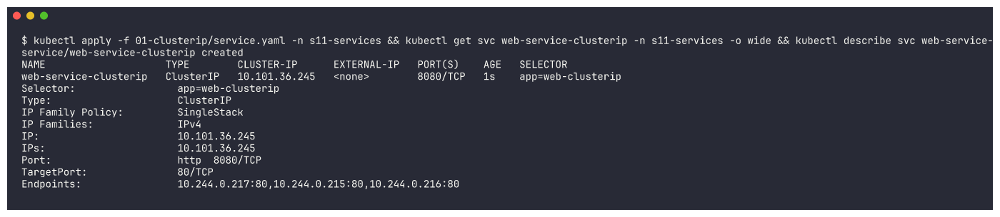

### 04-clusterip-endpoints

```bash
kubectl get endpoints web-service-clusterip -n s11-services; kubectl get endpointslices -l kubernetes.io/service-name=web-service-clusterip -n s11-services -o wide
```

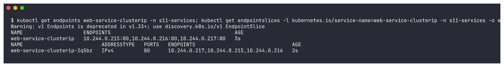

### 05-clusterip-client

```bash
kubectl apply -f 01-clusterip/client-pod.yaml -n s11-services && kubectl wait --for=condition=Ready pod/curl-client -n s11-services --timeout=900s && kubectl get pod curl-client -n s11-services -o wide
```

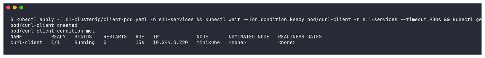

### 06-clusterip-curl

```bash
CIP=$(kubectl get svc web-service-clusterip -n s11-services -o jsonpath='{.spec.clusterIP}'); echo '--- by service name (x9):'; kubectl exec curl-client -n s11-services -- sh -c 'for i in 1 2 3 4 5 6 7 8 9; do curl -s -m 5 http://web-service-clusterip:8080; done' | sort | uniq -c; echo "--- by ClusterIP $CIP:"; kubectl exec curl-client -n s11-services -- curl -s -m 5 http://$CIP:8080; echo '--- by ...
```

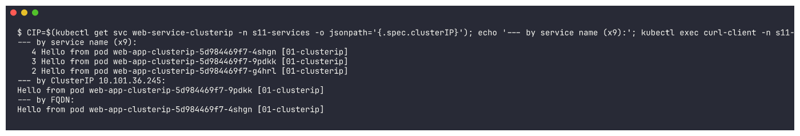

### 07-clusterip-port-forward

```bash
kubectl port-forward svc/web-service-clusterip 18080:8080 -n s11-services >/dev/null 2>&1 & PF=$!; sleep 4; echo '--- from my Mac through kubectl port-forward:'; curl -s -m 5 http://localhost:18080; kill $PF
```

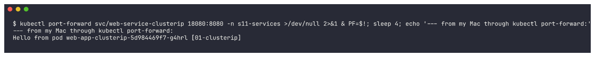

### 08-nodeport-deploy

```bash
kubectl apply -f 02-nodeport/app-deployment.yaml -f 02-nodeport/service.yaml -n s11-services && kubectl rollout status deployment/web-app-nodeport -n s11-services --timeout=1200s && kubectl get svc web-service-nodeport -n s11-services -o wide && kubectl get endpointslices -l kubernetes.io/service-name=web-service-nodeport -n s11-services
```

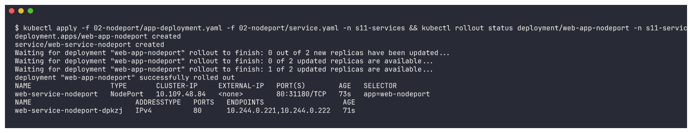

### 09-nodeport-node-ip

```bash
echo "node IP: $(minikube ip)"; minikube ssh -- 'for i in 1 2 3 4; do curl -s -m 5 http://192.168.49.2:31180; done'
```

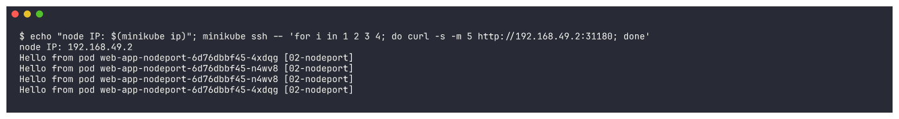

### 10-nodeport-minikube-service

```bash
minikube service web-service-nodeport -n s11-services --url > $W/np-url.txt 2>&1 & MS=$!; for i in $(seq 1 30); do grep -q http $W/np-url.txt && break; sleep 1; done; cat $W/np-url.txt; URL=$(grep -m1 -o 'http://[0-9.:]*' $W/np-url.txt); echo "--- curl $URL from my Mac:"; curl -s -m 5 $URL; curl -s -m 5 $URL; kill $MS
```

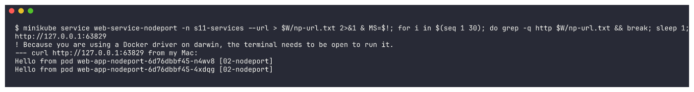

### 11-loadbalancer-deploy

```bash
kubectl apply -f 03-loadbalancer/app-deployment.yaml -f 03-loadbalancer/service.yaml -n s11-services && kubectl rollout status deployment/web-app-loadbalancer -n s11-services --timeout=1200s && sleep 5 && kubectl get svc web-service-loadbalancer -n s11-services -o wide
```

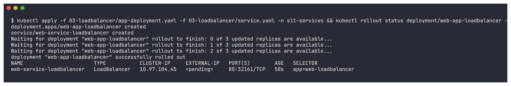

### 12-loadbalancer-describe

```bash
kubectl describe svc web-service-loadbalancer -n s11-services | sed -n '/^Type:/,/^Events:/p'
```

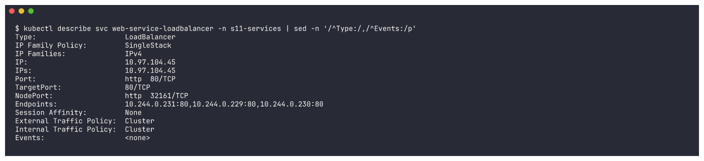

### 13-loadbalancer-minikube-service

```bash
minikube service web-service-loadbalancer -n s11-services --url > $W/lb-url.txt 2>&1 & MS=$!; for i in $(seq 1 30); do grep -q http $W/lb-url.txt && break; sleep 1; done; cat $W/lb-url.txt; URL=$(grep -m1 -o 'http://[0-9.:]*' $W/lb-url.txt); echo "--- curl $URL x6 from my Mac:"; for i in 1 2 3 4 5 6; do curl -s -m 5 $URL; done | sort | uniq -c; kill $MS; kubectl get svc web-service-loadbalancer -n ...
```

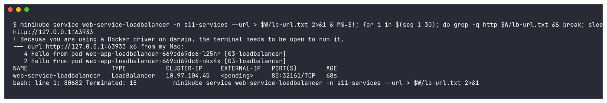

### 14-externalname-apply

```bash
kubectl apply -f 04-externalname/service.yaml -n s11-services && kubectl get svc external-database-service -n s11-services -o wide && kubectl get endpointslices -l kubernetes.io/service-name=external-database-service -n s11-services
```

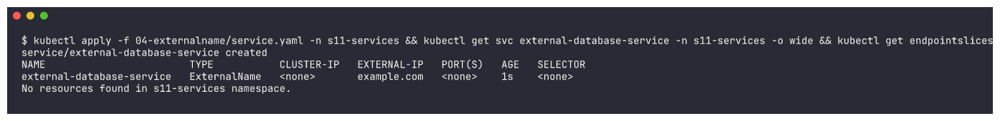

### 15-externalname-nslookup

```bash
kubectl apply -f 04-externalname/client-pod.yaml -n s11-services && kubectl wait --for=condition=Ready pod/dns-test-client -n s11-services --timeout=900s >/dev/null && kubectl exec dns-test-client -n s11-services -- nslookup external-database-service.s11-services.svc.cluster.local
```

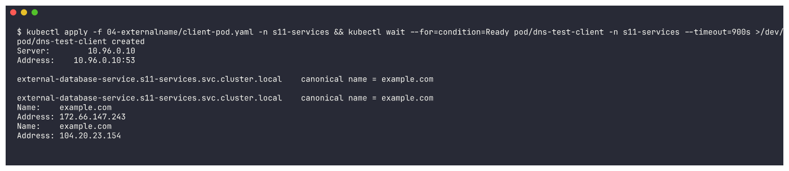

### 16-externalname-curl

```bash
kubectl exec dns-test-client -n s11-services -- curl -sI -m 10 -H 'Host: example.com' http://external-database-service | head -5
```

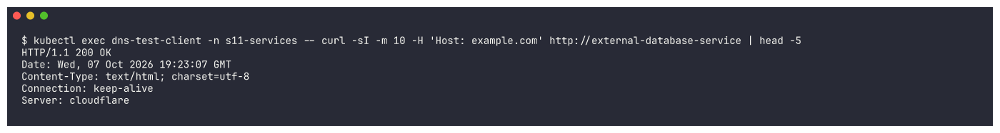
