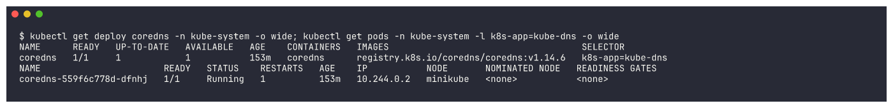
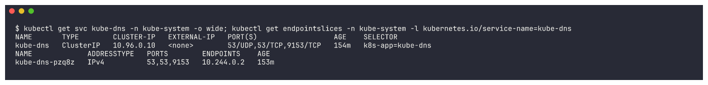
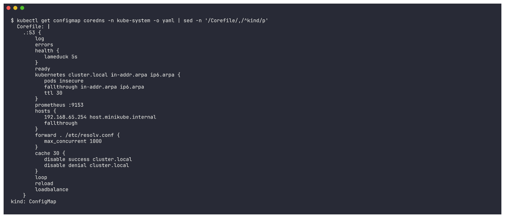
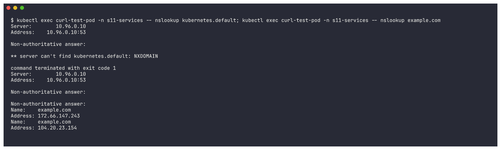
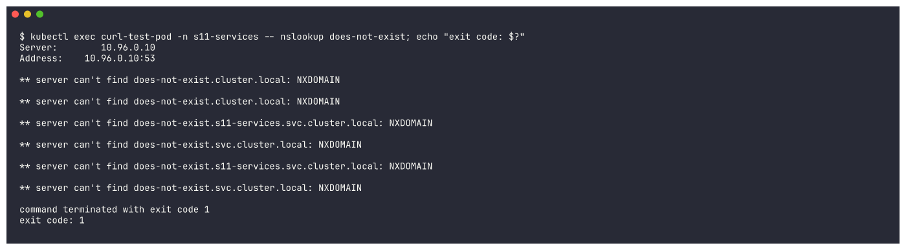
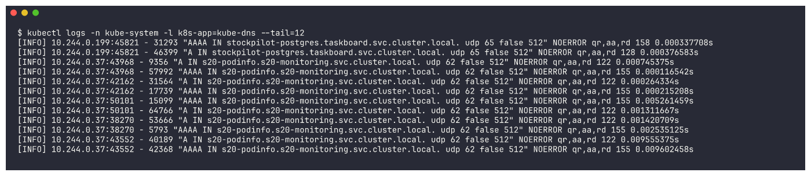
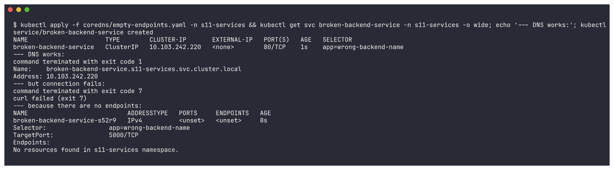
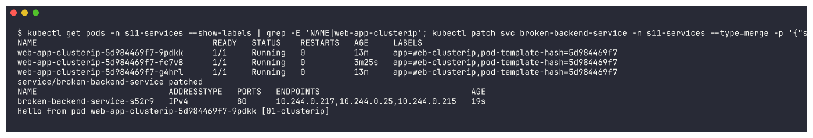

# CoreDNS

## What is CoreDNS?

**CoreDNS** is a small, fast DNS server written in Go and built entirely out of **plugins** (each
line of its config file - the `Corefile` - enables one plugin). It is a CNCF graduated project and
has been the **default cluster DNS of Kubernetes since v1.13**, replacing the older `kube-dns`
(dnsmasq + sidecars). For backwards compatibility it still runs behind a Service called
**`kube-dns`** in the `kube-system` namespace.

In my minikube cluster it runs as a **Deployment `coredns`** in `kube-system`, exposed by the
**Service `kube-dns`** (ClusterIP `10.96.0.10`, ports 53/UDP, 53/TCP, 9153/TCP for metrics).

## Why Kubernetes uses CoreDNS

- **Service discovery by name** - Pods and Services get new IPs all the time; apps need stable names.
- **Kubernetes-native** - the `kubernetes` plugin watches the API server directly, so records are
  updated within seconds when Services or Pods change (no zone files to edit).
- **Single binary, plugin based** - caching, forwarding, metrics, health checks, rewriting, logging
  are all just plugins; easy to extend.
- **Lighter and more secure than kube-dns** - one container instead of three, written in a memory
  safe language.
- **Configured with a ConfigMap** (`coredns` in `kube-system`), so it can be tuned without
  rebuilding anything (stub domains, custom hosts, upstream resolvers).

## How Service discovery works

1. You create a Service. The API server stores it and allocates a ClusterIP.
2. The EndpointSlice controller fills in the Service's EndpointSlices with the IPs of the *ready*
   Pods matching its selector.
3. CoreDNS's `kubernetes` plugin keeps a watch on Services + EndpointSlices and builds DNS records
   in memory:
   - `<svc>.<ns>.svc.cluster.local` -> A record = ClusterIP
   - headless Service -> one A record per ready Pod
   - ExternalName -> CNAME
   - named ports -> SRV records
4. kubelet writes `/etc/resolv.conf` into every Pod (`dnsPolicy: ClusterFirst`, the default) with
   `nameserver <kube-dns ClusterIP>` and a namespace-based `search` list.
5. Pods simply call `http://my-service` and the name resolves.

## How DNS queries are resolved

```
Pod (ns: s11-services) runs:  nslookup web-service-clusterip
  |
  | /etc/resolv.conf:  nameserver 10.96.0.10
  |                    search s11-services.svc.cluster.local svc.cluster.local cluster.local
  |                    options ndots:5
  |  -> name has < 5 dots, so try search suffixes first:
  |     web-service-clusterip.s11-services.svc.cluster.local ?
  v
kube-dns Service 10.96.0.10:53  --(kube-proxy DNAT)-->  a coredns Pod
  |
  |  Corefile server block ".:53" - plugins run in order:
  |    errors / health / ready
  |    kubernetes cluster.local in-addr.arpa ip6.arpa  -> authoritative for cluster.local:
  |         found Service -> answer ClusterIP  (NXDOMAIN if it does not exist)
  |    hosts { 192.168.65.254 host.minikube.internal }  (minikube addition)
  |    prometheus :9153                               -> metrics
  |    forward . /etc/resolv.conf                     -> anything NOT in cluster.local
  |                                                      (e.g. example.com) goes upstream
  |    cache 30                                       -> external answers cached 30s
  |    loop / reload / loadbalance
  v
answer: web-service-clusterip.s11-services.svc.cluster.local -> 10.x.x.x
```

## CoreDNS configuration

The real Corefile from my cluster is captured below (`kubectl get configmap coredns -n kube-system -o yaml`).
Key plugins:

| Plugin | What it does |
|---|---|
| `log` | log every query (minikube enables it by default - handy for debugging) |
| `errors` | log errors to stdout |
| `health` / `ready` | liveness (`:8080/health`) and readiness (`:8181/ready`) endpoints used by the Pod probes |
| `kubernetes cluster.local in-addr.arpa ip6.arpa` | serve cluster records + reverse lookups; `pods insecure` enables `a-b-c-d.<ns>.pod.cluster.local` records; `fallthrough` passes misses on to the next plugin |
| `hosts` | static host entries (minikube adds `host.minikube.internal`) |
| `prometheus :9153` | metrics endpoint |
| `forward . /etc/resolv.conf` | send non-cluster names to the node's upstream resolvers |
| `cache 30` | cache answers for 30 seconds (this Corefile disables caching for `cluster.local`, so cluster records are always fresh) |
| `loop` | detect and stop forwarding loops |
| `reload` | re-read the Corefile automatically when the ConfigMap changes |
| `loadbalance` | round-robin the order of A records in answers |

## How to troubleshoot DNS issues

Checklist I used (all real output below):

1. **Is CoreDNS running?** `kubectl get pods -n kube-system -l k8s-app=kube-dns -o wide`
2. **Does the kube-dns Service have endpoints?** `kubectl get svc,endpointslices -n kube-system -l k8s-app=kube-dns`
3. **What does the Pod use as DNS?** `kubectl exec <pod> -- cat /etc/resolv.conf`
4. **Can the Pod resolve the API server?** `nslookup kubernetes.default`
5. **Can it resolve my Service (short + FQDN)?** `nslookup <svc>` / `nslookup <svc>.<ns>.svc.cluster.local`
6. **Can it resolve external names?** `nslookup example.com` (tests the `forward` plugin / upstream)
7. **Wrong name / wrong namespace?** NXDOMAIN means the record does not exist - check spelling and namespace.
8. **Name resolves but the connection fails?** That is *not* a DNS problem - check the Service's
   endpoints (`kubectl get endpointslices -l kubernetes.io/service-name=<svc>`); an empty list means
   the selector matches no ready Pods (demo below with `empty-endpoints.yaml`).
9. **CoreDNS logs:** `kubectl logs -n kube-system -l k8s-app=kube-dns` - minikube's Corefile already
   has the `log` plugin, so every query and its response code is visible.
10. **Config:** `kubectl get configmap coredns -n kube-system -o yaml` - look for typos in `forward`,
    missing `kubernetes` block, etc.

---

## Hands-on (real output)

All commands were run from the `Kubernetes-Networking-Services/` folder. The test client is
[`../dns-test/curl-test-pod.yaml`](../dns-test/curl-test-pod.yaml) running in namespace `s11-services`.

### 1. Is CoreDNS running?
```bash
kubectl get deploy coredns -n kube-system -o wide
kubectl get pods -n kube-system -l k8s-app=kube-dns -o wide
```
```
NAME      READY   UP-TO-DATE   AVAILABLE   AGE    CONTAINERS   IMAGES                                    SELECTOR
coredns   1/1     1            1           153m   coredns      registry.k8s.io/coredns/coredns:v1.14.6   k8s-app=kube-dns
NAME                       READY   STATUS    RESTARTS   AGE    IP           NODE
coredns-559f6c778d-dfnhj   1/1     Running   1          153m   10.244.0.2   minikube
```


### 2. The `kube-dns` Service and its endpoints
```bash
kubectl get svc kube-dns -n kube-system -o wide
kubectl get endpointslices -n kube-system -l kubernetes.io/service-name=kube-dns
```
```
NAME       TYPE        CLUSTER-IP   EXTERNAL-IP   PORT(S)                  AGE    SELECTOR
kube-dns   ClusterIP   10.96.0.10   <none>        53/UDP,53/TCP,9153/TCP   154m   k8s-app=kube-dns
NAME             ADDRESSTYPE   PORTS        ENDPOINTS    AGE
kube-dns-pzq8z   IPv4          53,53,9153   10.244.0.2   153m
```


`10.96.0.10` is exactly the `nameserver` in every Pod's `/etc/resolv.conf`
(see [`../fqdn/README.md`](../fqdn/README.md)), and its only endpoint is the CoreDNS Pod `10.244.0.2`.

### 3. CoreDNS configuration (the real Corefile)
```bash
kubectl get configmap coredns -n kube-system -o yaml
```
```
  Corefile: |
    .:53 {
        log
        errors
        health {
           lameduck 5s
        }
        ready
        kubernetes cluster.local in-addr.arpa ip6.arpa {
           pods insecure
           fallthrough in-addr.arpa ip6.arpa
           ttl 30
        }
        prometheus :9153
        hosts {
           192.168.65.254 host.minikube.internal
           fallthrough
        }
        forward . /etc/resolv.conf {
           max_concurrent 1000
        }
        cache 30 {
           disable success cluster.local
           disable denial cluster.local
        }
        loop
        reload
        loadbalance
    }
```


### 4. Resolution tests: cluster name and external name
```bash
kubectl exec curl-test-pod -n s11-services -- nslookup kubernetes.default
kubectl exec curl-test-pod -n s11-services -- nslookup example.com
```
```
** server can't find kubernetes.default: NXDOMAIN
command terminated with exit code 1

Non-authoritative answer:
Name:	example.com
Address: 172.66.147.243
Name:	example.com
Address: 104.20.23.154
```


- `example.com` -> answered via the `forward` plugin (upstream resolver) - external DNS works.
- `kubernetes.default` -> NXDOMAIN **only because of busybox nslookup**: it sends names that
  contain a dot as-is, without the search list. The same name works with the normal resolver
  (`curl https://kubernetes.default/version` -> HTTP 200 from 10.96.0.1) and with the full name
  `kubernetes.default.svc.cluster.local.` - both shown in
  [`../fqdn/README.md`](../fqdn/README.md#3-different-namespace-short-name-fails-fqdn-works).
  Lesson for troubleshooting: when `nslookup` says NXDOMAIN, retry with the full FQDN before blaming CoreDNS.

### 5. A name that really does not exist
```bash
kubectl exec curl-test-pod -n s11-services -- nslookup does-not-exist; echo "exit code: $?"
```
```
** server can't find does-not-exist.cluster.local: NXDOMAIN
** server can't find does-not-exist.s11-services.svc.cluster.local: NXDOMAIN
** server can't find does-not-exist.svc.cluster.local: NXDOMAIN
...
command terminated with exit code 1
exit code: 1
```


All three search suffixes were tried (A and AAAA) and CoreDNS (authoritative for `cluster.local`)
answered NXDOMAIN for each - typical result of a typo or the wrong namespace.

### 6. CoreDNS logs
```bash
kubectl logs -n kube-system -l k8s-app=kube-dns --tail=12
```
```
[INFO] 10.244.0.199:45821 - 46399 "A IN stockpilot-postgres.taskboard.svc.cluster.local. udp 65 false 512" NOERROR qr,aa,rd 128 0.000376583s
[INFO] 10.244.0.37:43968 - 9356 "A IN s20-podinfo.s20-monitoring.svc.cluster.local. udp 62 false 512" NOERROR qr,aa,rd 122 0.000745375s
[INFO] 10.244.0.37:43968 - 57992 "AAAA IN s20-podinfo.s20-monitoring.svc.cluster.local. udp 62 false 512" NOERROR qr,aa,rd 155 0.000116542s
...
```


Thanks to the `log` plugin every query is logged: client Pod IP, record type (A / AAAA), the full
name asked, the response code (`NOERROR`, `NXDOMAIN`, `SERVFAIL`) and the latency. (These lines are
from other workloads sharing my cluster - it shows CoreDNS serves every namespace.)

### 7. Troubleshooting drill: "DNS works but the Service does not" ([`empty-endpoints.yaml`](empty-endpoints.yaml))

The reference repo's `troubleshooting/empty-endpoints.yaml`: a Service whose selector matches no Pods.
```bash
kubectl apply -f coredns/empty-endpoints.yaml -n s11-services
kubectl exec curl-test-pod -n s11-services -- nslookup broken-backend-service
kubectl exec curl-test-pod -n s11-services -- curl -s -m 5 http://broken-backend-service
kubectl get endpointslices -l kubernetes.io/service-name=broken-backend-service -n s11-services
kubectl describe svc broken-backend-service -n s11-services | grep -E 'Selector|TargetPort|Endpoints'
kubectl get pods -l app=wrong-backend-name -n s11-services
```
```
broken-backend-service   ClusterIP   10.103.242.220   <none>        80/TCP    1s    app=wrong-backend-name
--- DNS works:
Name:	broken-backend-service.s11-services.svc.cluster.local
Address: 10.103.242.220
--- but connection fails:
command terminated with exit code 7
curl failed (exit 7)
--- because there are no endpoints:
NAME                           ADDRESSTYPE   PORTS     ENDPOINTS   AGE
broken-backend-service-s52r9   IPv4          <unset>   <unset>     8s
Selector:                 app=wrong-backend-name
TargetPort:               5000/TCP
Endpoints:
No resources found in s11-services namespace.
```


**Diagnosis:** the name resolves (CoreDNS is fine), but curl exit 7 = connection refused, the
EndpointSlice is empty and no Pod carries `app=wrong-backend-name`. Root cause: **selector does not
match any Pod labels** (and `targetPort: 5000` does not match nginx's port 80). **Fix:** point the
selector at the real labels and the right port:
```bash
kubectl get pods -n s11-services --show-labels | grep -E 'NAME|web-app-clusterip'
kubectl patch svc broken-backend-service -n s11-services --type=merge \
  -p '{"spec":{"selector":{"app":"web-clusterip"},"ports":[{"name":"http","port":80,"targetPort":80,"protocol":"TCP"}]}}'
kubectl get endpointslices -l kubernetes.io/service-name=broken-backend-service -n s11-services
kubectl exec curl-test-pod -n s11-services -- curl -s http://broken-backend-service
```
```
web-app-clusterip-5d984469f7-9pdkk      1/1     Running   0          13m     app=web-clusterip,pod-template-hash=5d984469f7
service/broken-backend-service patched
NAME                           ADDRESSTYPE   PORTS   ENDPOINTS                               AGE
broken-backend-service-s52r9   IPv4          80      10.244.0.217,10.244.0.25,10.244.0.215   19s
Hello from pod web-app-clusterip-5d984469f7-9pdkk [01-clusterip]
```


### DNS troubleshooting cheat-sheet

| Symptom | Likely cause | Check |
|---|---|---|
| `could not resolve host` / NXDOMAIN for a Service | typo, wrong namespace, Service missing | `kubectl get svc -A \| grep name`, use `<svc>.<ns>` |
| NXDOMAIN only in busybox `nslookup` for `a.b` names | tool does not use the search list | retry with the FQDN + trailing dot, or test with `curl`/`getent hosts` |
| every lookup times out | CoreDNS down / kube-dns has no endpoints / NetworkPolicy blocks UDP 53 | `kubectl get pods,endpointslices -n kube-system -l k8s-app=kube-dns` |
| cluster names work, external names fail | upstream (`forward`) problem | `nslookup example.com`, check node `/etc/resolv.conf`, Corefile `forward` |
| name resolves, connection fails | not DNS - Service has no ready endpoints / wrong port | `kubectl get endpointslices -l kubernetes.io/service-name=<svc>` |
| intermittent `SERVFAIL` / slow lookups | CoreDNS overloaded or crashing | `kubectl logs -n kube-system -l k8s-app=kube-dns`, scale CoreDNS |
