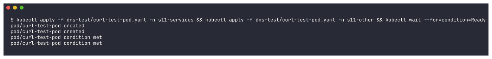
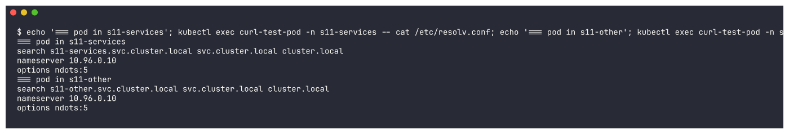
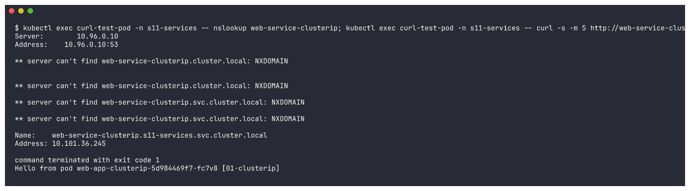
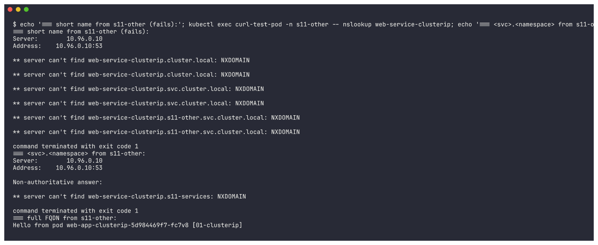
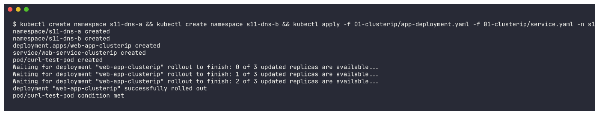
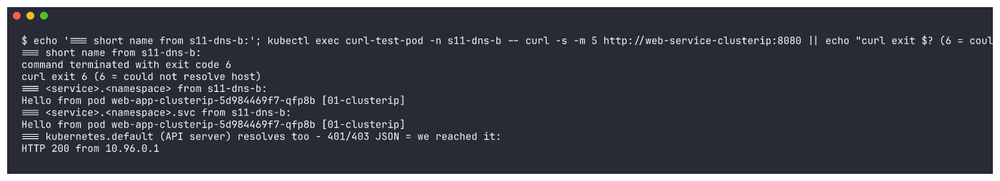
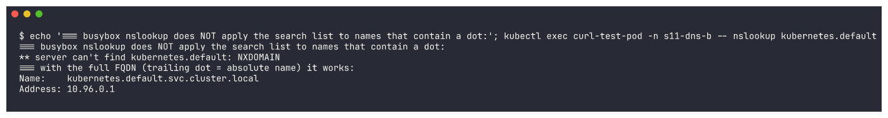
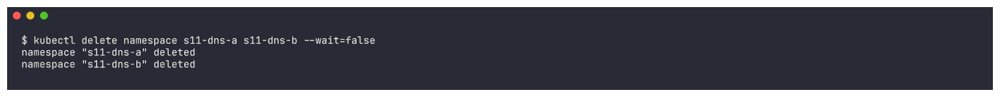
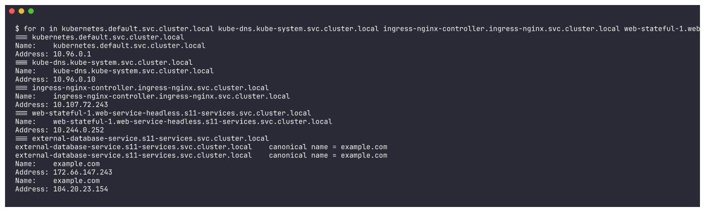
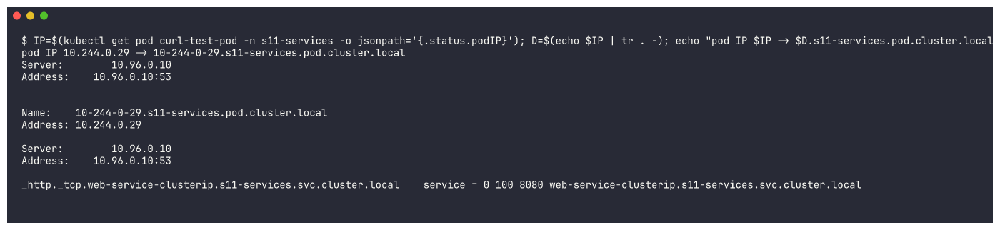

# FQDN in Kubernetes

## What is an FQDN?

A **Fully Qualified Domain Name** is the *complete* DNS name of a host - every label from the host
up to the root of the DNS tree - so it can be resolved unambiguously from anywhere.

```
www.example.com.          <- the trailing "." is the DNS root
 |     |      |
host  domain  TLD
```

A short name such as `web` is **not** fully qualified: the resolver has to guess the rest by trying
the domains listed in the `search` line of `/etc/resolv.conf`. An FQDN needs no guessing.

## Kubernetes Service DNS

Every Service gets a DNS record served by **CoreDNS** (the `kube-dns` Service in `kube-system`). Pods
are configured by the kubelet to use CoreDNS as their nameserver, so any Pod can reach any Service by
name instead of by IP.

| Service type | What the DNS name resolves to |
|---|---|
| ClusterIP / NodePort / LoadBalancer | an **A record** -> the Service's single ClusterIP |
| Headless (`clusterIP: None`) | **one A record per ready Pod** (the Pod IPs) + per-Pod names for StatefulSets |
| ExternalName | a **CNAME** -> the external host name (e.g. `example.com`) |

Named ports also get **SRV records**: `_http._tcp.web-service-clusterip.s11-services.svc.cluster.local`.

## Kubernetes DNS naming convention

```
<service-name>.<namespace>.svc.<cluster-domain>
web-service-clusterip.s11-services.svc.cluster.local
```

| Part | Meaning | Value in my cluster |
|---|---|---|
| `<service-name>` | `metadata.name` of the Service | `web-service-clusterip` |
| `<namespace>` | namespace of the Service | `s11-services` |
| `svc` | fixed - "this is a Service record" | `svc` |
| `<cluster-domain>` | set in kubelet / CoreDNS config | `cluster.local` (default) |

Other record forms:

| Object | FQDN pattern |
|---|---|
| StatefulSet Pod behind a headless Service | `<pod-name>.<headless-svc>.<ns>.svc.cluster.local` -> `web-stateful-0.web-service-headless.s11-services.svc.cluster.local` |
| Any Pod by IP (dashed) | `<a-b-c-d>.<ns>.pod.cluster.local` -> `10-244-0-29.s11-services.pod.cluster.local` |
| The API server | `kubernetes.default.svc.cluster.local` |

## Namespace-based DNS

Every Pod's `/etc/resolv.conf` contains a **search list** built from its own namespace:

```
search s11-services.svc.cluster.local svc.cluster.local cluster.local
nameserver 10.96.0.10
options ndots:5
```

So, from a Pod in namespace `s11-services`:

| You type | Resolver tries | Works? |
|---|---|---|
| `web-service-clusterip` | `web-service-clusterip.s11-services.svc.cluster.local` | yes - same namespace |
| `web-service-clusterip.s11-services` | `web-service-clusterip.s11-services.svc.cluster.local` (2nd search entry) | yes - from any namespace |
| `web-service-clusterip.s11-services.svc.cluster.local` | used as is | yes - from anywhere |

From a Pod in a **different** namespace (`s11-other`), the short name fails (it expands to
`web-service-clusterip.s11-other.svc.cluster.local`, which does not exist) - you must add at least
`.<namespace>`. This is exactly what the demo below shows.

`ndots:5` means: a name with fewer than 5 dots is first tried with every search suffix. Writing the
full FQDN *with a trailing dot* (`...cluster.local.`) skips the search list and saves DNS lookups.

## Pod-to-Service communication

1. App calls `http://web-service-clusterip:8080`.
2. The Pod's resolver appends the search suffixes and asks CoreDNS (`10.96.0.10`).
3. CoreDNS (`kubernetes` plugin, which watches Services/EndpointSlices via the API server) answers
   with the Service's ClusterIP.
4. The Pod opens a TCP connection to `ClusterIP:8080`.
5. kube-proxy's iptables rules on the node DNAT it to one of the ready Pod IPs on `targetPort` 80.

## Examples of Kubernetes FQDNs

| FQDN | Resolves to |
|---|---|
| `kubernetes.default.svc.cluster.local` | API server ClusterIP (10.96.0.1) |
| `kube-dns.kube-system.svc.cluster.local` | CoreDNS ClusterIP (10.96.0.10) |
| `web-service-clusterip.s11-services.svc.cluster.local` | ClusterIP of the 01-clusterip demo |
| `web-service-headless.s11-services.svc.cluster.local` | 3 Pod IPs of the StatefulSet |
| `web-stateful-1.web-service-headless.s11-services.svc.cluster.local` | the IP of Pod `web-stateful-1` only |
| `external-database-service.s11-services.svc.cluster.local` | CNAME `example.com` |
| `ingress-nginx-controller.ingress-nginx.svc.cluster.local` | the minikube ingress controller Service |

---

## Hands-on proof (real output)

Run from the `Kubernetes-Networking-Services/` folder. Client Pods: `curl-test-pod` in
`s11-services`, and a second copy in namespace `s11-other`
(YAML: [`../dns-test/curl-test-pod.yaml`](../dns-test/curl-test-pod.yaml)).

```bash
kubectl apply -f dns-test/curl-test-pod.yaml -n s11-services
kubectl apply -f dns-test/curl-test-pod.yaml -n s11-other
```


### 1. The search list depends on the Pod's namespace
```bash
kubectl exec curl-test-pod -n s11-services -- cat /etc/resolv.conf
kubectl exec curl-test-pod -n s11-other -- cat /etc/resolv.conf
```
```
=== pod in s11-services
search s11-services.svc.cluster.local svc.cluster.local cluster.local
nameserver 10.96.0.10
options ndots:5
=== pod in s11-other
search s11-other.svc.cluster.local svc.cluster.local cluster.local
nameserver 10.96.0.10
options ndots:5
```


### 2. Same namespace: the short name works
```bash
kubectl exec curl-test-pod -n s11-services -- nslookup web-service-clusterip
kubectl exec curl-test-pod -n s11-services -- curl -s http://web-service-clusterip:8080
```
```
** server can't find web-service-clusterip.cluster.local: NXDOMAIN
** server can't find web-service-clusterip.svc.cluster.local: NXDOMAIN
Name:	web-service-clusterip.s11-services.svc.cluster.local
Address: 10.101.36.245
command terminated with exit code 1
Hello from pod web-app-clusterip-5d984469f7-fc7v8 [01-clusterip]
```


The resolver tried the search suffixes; `web-service-clusterip.s11-services.svc.cluster.local`
was found (10.101.36.245) and curl worked. (busybox `nslookup` also prints the misses for the other
suffixes and returns exit code 1 - a quirk of that tool, not a DNS failure.)

### 3. Different namespace: short name fails, FQDN works
```bash
kubectl exec curl-test-pod -n s11-other -- nslookup web-service-clusterip
kubectl exec curl-test-pod -n s11-other -- nslookup web-service-clusterip.s11-services
kubectl exec curl-test-pod -n s11-other -- curl -s http://web-service-clusterip.s11-services.svc.cluster.local:8080
```
```
=== short name from s11-other (fails):
** server can't find web-service-clusterip.cluster.local: NXDOMAIN
** server can't find web-service-clusterip.svc.cluster.local: NXDOMAIN
** server can't find web-service-clusterip.s11-other.svc.cluster.local: NXDOMAIN
command terminated with exit code 1
=== <svc>.<namespace> from s11-other:
** server can't find web-service-clusterip.s11-services: NXDOMAIN
=== full FQDN from s11-other:
Hello from pod web-app-clusterip-5d984469f7-fc7v8 [01-clusterip]
```


The short name was expanded with **s11-other**'s suffix and does not exist there. The full FQDN works
from anywhere. The `<svc>.<namespace>` form failed **only in busybox `nslookup`**: that tool does not
apply the search list to names that already contain a dot. I proved this with a second, clean
test (fresh namespaces `s11-dns-a` = service, `s11-dns-b` = client, because the first ones were stuck
in `Terminating` on the shared cluster) using `curl`, which uses the normal system resolver:

```bash
kubectl create namespace s11-dns-a && kubectl create namespace s11-dns-b
kubectl apply -f 01-clusterip/app-deployment.yaml -f 01-clusterip/service.yaml -n s11-dns-a
kubectl apply -f dns-test/curl-test-pod.yaml -n s11-dns-b
```


```bash
kubectl exec curl-test-pod -n s11-dns-b -- curl -s http://web-service-clusterip:8080
kubectl exec curl-test-pod -n s11-dns-b -- curl -s http://web-service-clusterip.s11-dns-a:8080
kubectl exec curl-test-pod -n s11-dns-b -- curl -s http://web-service-clusterip.s11-dns-a.svc:8080
kubectl exec curl-test-pod -n s11-dns-b -- curl -sk -o /dev/null -w 'HTTP %{http_code} from %{remote_ip}\n' https://kubernetes.default/version
```
```
=== short name from s11-dns-b:
command terminated with exit code 6
curl exit 6 (6 = could not resolve host)
=== <service>.<namespace> from s11-dns-b:
Hello from pod web-app-clusterip-5d984469f7-qfp8b [01-clusterip]
=== <service>.<namespace>.svc from s11-dns-b:
Hello from pod web-app-clusterip-5d984469f7-qfp8b [01-clusterip]
=== kubernetes.default (API server) resolves too - 401/403 JSON = we reached it:
HTTP 200 from 10.96.0.1
```


So `<service>.<namespace>` **does** work across namespaces with a real resolver (the 2nd search
entry `svc.cluster.local` completes it), and `kubernetes.default` reached the API server at
10.96.0.1 (`/version` is public, so it even answered 200 rather than the 401/403 my label expected).

```bash
kubectl exec curl-test-pod -n s11-dns-b -- nslookup kubernetes.default
kubectl exec curl-test-pod -n s11-dns-b -- nslookup kubernetes.default.svc.cluster.local.
```
```
=== busybox nslookup does NOT apply the search list to names that contain a dot:
** server can't find kubernetes.default: NXDOMAIN
=== with the full FQDN (trailing dot = absolute name) it works:
Name:	kubernetes.default.svc.cluster.local
Address: 10.96.0.1
```



### 4. FQDN examples resolved from `s11-other`
```bash
for n in kubernetes.default.svc.cluster.local kube-dns.kube-system.svc.cluster.local \
         ingress-nginx-controller.ingress-nginx.svc.cluster.local \
         web-stateful-1.web-service-headless.s11-services.svc.cluster.local \
         external-database-service.s11-services.svc.cluster.local; do
  kubectl exec curl-test-pod -n s11-other -- nslookup $n; done
```
```
=== kubernetes.default.svc.cluster.local
Address: 10.96.0.1
=== kube-dns.kube-system.svc.cluster.local
Address: 10.96.0.10
=== ingress-nginx-controller.ingress-nginx.svc.cluster.local
Address: 10.107.72.243
=== web-stateful-1.web-service-headless.s11-services.svc.cluster.local
Address: 10.244.0.252
=== external-database-service.s11-services.svc.cluster.local
external-database-service.s11-services.svc.cluster.local	canonical name = example.com
Name:	example.com
Address: 172.66.147.243
```


### 5. Pod records and SRV records
```bash
kubectl exec curl-test-pod -n s11-other -- nslookup 10-244-0-29.s11-services.pod.cluster.local
kubectl exec curl-test-pod -n s11-other -- nslookup -type=srv _http._tcp.web-service-clusterip.s11-services.svc.cluster.local
```
```
pod IP 10.244.0.29 -> 10-244-0-29.s11-services.pod.cluster.local
Name:	10-244-0-29.s11-services.pod.cluster.local
Address: 10.244.0.29
_http._tcp.web-service-clusterip.s11-services.svc.cluster.local	service = 0 100 8080 web-service-clusterip.s11-services.svc.cluster.local
```


The SRV record publishes the **port** (8080) of the named port `http`, so clients can discover
host *and* port from DNS.

### Summary
- Inside one namespace: use the short name `my-svc`.
- Across namespaces: `my-svc.other-ns` (or `my-svc.other-ns.svc`).
- In config files / from anywhere: the full FQDN `my-svc.other-ns.svc.cluster.local` - unambiguous,
  and with a trailing dot it skips the search list (`ndots:5`) entirely.
