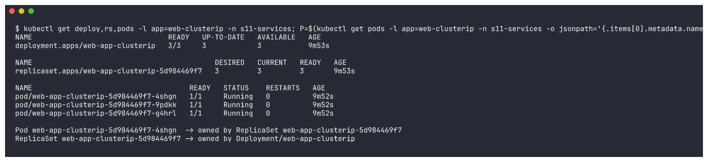
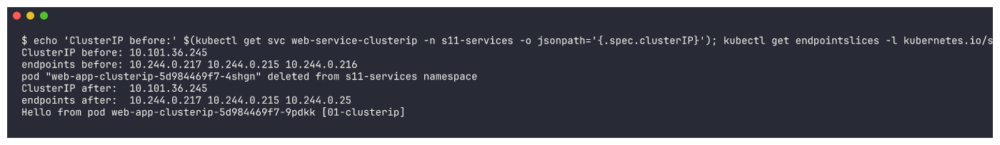
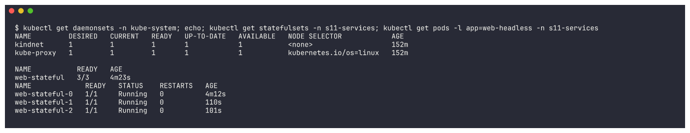

# Kubernetes Object Comparison

Theory first, then real output from my minikube cluster (namespace `s11-services`) that proves
each point. Screenshots live in [`../screenshots`](../screenshots).

---

## 1. Deployment vs ReplicaSet

| | ReplicaSet | Deployment |
|---|---|---|
| **Purpose** | Keep exactly *N* copies of a Pod template running | Manage the *lifecycle* of an application: desired version, updates, rollbacks |
| **Pod management** | Creates/deletes Pods directly to match `replicas`; owns the Pods (`ownerReferences`) | Never creates Pods itself - it creates/scales **ReplicaSets**, which create the Pods |
| **Scaling** | `kubectl scale rs <name> --replicas=N` works, but a Deployment that owns it will overwrite you | `kubectl scale deploy <name> --replicas=N` - the Deployment passes the number down to its current ReplicaSet |
| **Rolling updates** | **None.** Changing the Pod template of a ReplicaSet does *not* touch existing Pods - only newly created ones get the new template | Built in: a template change creates a **new ReplicaSet** and shifts Pods from old RS to new RS (`RollingUpdate` with `maxSurge`/`maxUnavailable`, or `Recreate`) |
| **Rollback** | Not possible (no history) | `kubectl rollout undo` - old ReplicaSets are kept (scaled to 0) as revision history (`revisionHistoryLimit`, default 10) |
| **Use directly?** | Rarely - almost always created *by* a Deployment | Yes - the normal way to run stateless apps |

**Relationship:** `Deployment  --owns-->  ReplicaSet (one per revision)  --owns-->  Pods`.
The pod-template-hash label (e.g. `web-app-clusterip-5d984469f7` in my cluster) is how each ReplicaSet tells its own
Pods apart from the Pods of the other revisions. During a rolling update you can see two ReplicaSets
at the same time (old scaling down, new scaling up) - see Session 10's rolling update demo.

---

## 2. Deployment vs DaemonSet vs StatefulSet

| | Deployment | DaemonSet | StatefulSet |
|---|---|---|---|
| **Use case** | Stateless apps: web servers, APIs, workers | One agent **per node**: log shippers, monitoring agents, CNI, kube-proxy | Stateful apps needing stable identity: databases, Kafka, ZooKeeper, Elasticsearch |
| **Pod creation** | Any order, in parallel; random names `web-7d9f-x2k4p` | Exactly one Pod on every (matching) node, created when the node joins | **Ordered**: `name-0`, then `name-1`, then `name-2` (each waits for the previous to be Ready); deleted in reverse order |
| **Pod identity** | Interchangeable, new name/IP on every restart | Tied to its node | **Sticky**: `web-stateful-0` is always `web-stateful-0`, even after rescheduling |
| **Scaling** | `replicas: N`, scheduler places Pods anywhere | No `replicas` field - scales with the **number of nodes** (control with nodeSelector / tolerations) | `replicas: N`, scale up adds the next ordinal, scale down removes the highest ordinal first |
| **Networking** | One normal (ClusterIP) Service load-balances across Pods | Often `hostNetwork`/`hostPort` (talks to the node), or a Service | Needs a **headless Service** (`clusterIP: None`) -> per-Pod DNS `web-stateful-0.web-service-headless.<ns>.svc.cluster.local` |
| **Storage** | Usually none, or one shared PVC for all replicas | Usually `hostPath` (node's logs, `/var/run`, etc.) | `volumeClaimTemplates` -> **one PVC per Pod** (`data-web-stateful-0`), re-attached to the same Pod identity after restart |
| **Update strategy** | RollingUpdate / Recreate | RollingUpdate / OnDelete | RollingUpdate (reverse ordinal, supports `partition`) / OnDelete |
| **Examples in my cluster** | `coredns` (kube-system), `web-app-clusterip` | `kube-proxy` (kube-system) | `web-stateful` (05-headless demo) |

---

## 3. ReplicaSet vs Service

| | ReplicaSet | Service |
|---|---|---|
| **Responsibility** | *Availability / count*: keeps N Pods alive, replaces crashed or deleted Pods | *Discovery / networking*: gives a set of Pods one stable virtual IP + DNS name and load-balances to them |
| **Selects Pods by** | label selector (to count & own them) | label selector (to route traffic to them) |
| **Creates Pods?** | Yes | Never |
| **Knows about traffic?** | No | Yes - that is its only job |

**Why a Service is required:** Pods are cattle - every replacement Pod gets a **new IP** (you can see
the IPs change when the ReplicaSet recreates a Pod). Clients cannot hard-code Pod IPs, and they should
not have to pick one of N replicas themselves. A Service gives:

- a **stable ClusterIP** that never changes for the life of the Service,
- a **stable DNS name** (`web-service-clusterip.s11-services.svc.cluster.local`) served by CoreDNS,
- **load balancing** across all *Ready* Pods that match its selector,
- automatic updates of its **EndpointSlice** as Pods come and go (only Ready Pods are added).

**How traffic reaches Pods:**

```
client Pod
   |  1. DNS: web-service-clusterip  -> CoreDNS -> 10.x.x.x (ClusterIP)
   v
ClusterIP:8080 (virtual - no process listens on it)
   |  2. kube-proxy on every node has programmed iptables/IPVS rules for this IP:port
   |     that DNAT the packet to ONE of the endpoints (chosen at random)
   v
EndpointSlice: 10.244.0.a:80, 10.244.0.b:80, 10.244.0.c:80   (kept up to date by the
   |                                                            endpointslice controller
   v                                                            from the label selector)
Pod (container port 80)
```

The ReplicaSet makes sure the Pods **exist**; the Service makes sure clients can **find and reach**
them. They are linked only by **labels** - neither references the other by name.

---

## Evidence from the cluster

### Deployment -> ReplicaSet -> Pod ownership
```bash
kubectl get deploy,rs,pods -l app=web-clusterip -n s11-services
# then follow .metadata.ownerReferences from a Pod upwards
```
```
deployment.apps/web-app-clusterip   3/3     3            3           9m53s
replicaset.apps/web-app-clusterip-5d984469f7   3         3         3       9m53s
pod/web-app-clusterip-5d984469f7-4shgn   1/1     Running   0          9m52s
pod/web-app-clusterip-5d984469f7-9pdkk   1/1     Running   0          9m52s
pod/web-app-clusterip-5d984469f7-g4hrl   1/1     Running   0          9m52s

Pod web-app-clusterip-5d984469f7-4shgn  -> owned by ReplicaSet web-app-clusterip-5d984469f7
ReplicaSet web-app-clusterip-5d984469f7 -> owned by Deployment/web-app-clusterip
```


### ReplicaSet replaces a Pod, the Service keeps its IP and follows the new Pod
```bash
kubectl get svc web-service-clusterip -n s11-services -o jsonpath='{.spec.clusterIP}'
kubectl get endpointslices -l kubernetes.io/service-name=web-service-clusterip -n s11-services -o jsonpath='{.items[0].endpoints[*].addresses[0]}'
kubectl delete pod <one web-app-clusterip pod> -n s11-services
# ... same two commands again, then curl the Service
```
```
ClusterIP before: 10.101.36.245
endpoints before: 10.244.0.217 10.244.0.215 10.244.0.216
pod "web-app-clusterip-5d984469f7-4shgn" deleted from s11-services namespace
ClusterIP after:  10.101.36.245
endpoints after:  10.244.0.217 10.244.0.215 10.244.0.25
Hello from pod web-app-clusterip-5d984469f7-9pdkk [01-clusterip]
```


The **ReplicaSet** did its job (a new Pod with a *new IP* `10.244.0.25` replaced `.216`), and the
**Service** did its job (same ClusterIP `10.101.36.245`, endpoint list updated automatically, clients
noticed nothing).

### DaemonSet vs StatefulSet in the same cluster
```bash
kubectl get daemonsets -n kube-system
kubectl get statefulsets -n s11-services
kubectl get pods -l app=web-headless -n s11-services
```
```
NAME         DESIRED   CURRENT   READY   UP-TO-DATE   AVAILABLE   NODE SELECTOR            AGE
kindnet      1         1         1       1            1           <none>                   152m
kube-proxy   1         1         1       1            1           kubernetes.io/os=linux   152m

NAME           READY   AGE
web-stateful   3/3     4m23s
NAME             READY   STATUS    RESTARTS   AGE
web-stateful-0   1/1     Running   0          4m12s
web-stateful-1   1/1     Running   0          110s     <- created after -0 was ready
web-stateful-2   1/1     Running   0          101s     <- created after -1 was ready
```


DaemonSets: DESIRED = number of nodes (1), no replica count. StatefulSet: ordinal names created in
order (the ages show `-0` first, then `-1`, then `-2`). More StatefulSet/DaemonSet hands-on
(PVC per Pod, stable identity after restart) is in Session 10's README
(`Kubernetes-Pods-ReplicaSets-Deployments`, Part A).
