# Session 10: Kubernetes Pods, ReplicaSets & Deployments - Homework

Everything was run on my local minikube cluster (Kubernetes v1.37.0, docker driver, arm64).
YAML files are in this folder; every command has its real output (trimmed) and a screenshot.
Full untrimmed output of every command: [`outputs/`](outputs/).

Most YAMLs are adapted from the course reference repo (`devops-heros/session10-k8s-core-objects`).
Changes I made: the pages served by nginx print **plain text** (`VERSION: v1 | pod: ...`) instead of
HTML so curl output is easy to count; NodePorts are left for Kubernetes to assign (the cluster is
shared, fixed ports could collide); for blue-green and canary I raised the readiness-probe
`timeoutSeconds` to 5 because my laptop cluster was heavily loaded (see the note at the end).

Namespaces used: `s10-core`, `s10-rolling`, `s10-bluegreen`, `s10-canary`, `s10-recreate`,
`s10-lifecycle`, `s10-troubleshoot` (all deleted at the end).

```bash
for ns in s10-core s10-rolling s10-bluegreen s10-canary s10-recreate s10-lifecycle s10-troubleshoot; do kubectl create namespace $ns; done
```
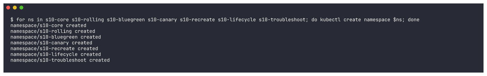

A tiny client Pod ([`curl-client.yaml`](curl-client.yaml), `curlimages/curl`) is created in each
strategy namespace and used to send traffic to the Services from inside the cluster.

---

## Part A - Core objects: Pod, ReplicaSet, StatefulSet, DaemonSet

Files: [`00-core-objects/`](00-core-objects/)

### A1. Pod basics ([`pod.yaml`](00-core-objects/pod.yaml))
```bash
kubectl apply -f 00-core-objects/pod.yaml -n s10-core
kubectl wait --for=condition=Ready pod/yatri-demo-pod -n s10-core --timeout=180s
kubectl get pod yatri-demo-pod -n s10-core -o wide --show-labels
```
```
pod/yatri-demo-pod created
pod/yatri-demo-pod condition met
NAME             READY   STATUS    RESTARTS   AGE   IP            NODE       ...   LABELS
yatri-demo-pod   1/1     Running   0          1s    10.244.0.88   minikube   ...   app=yatri-demo,tier=frontend
```
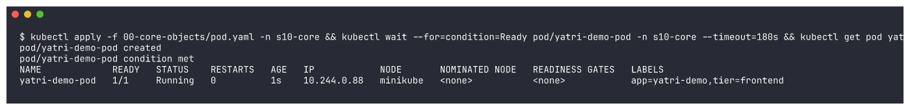

```bash
kubectl describe pod yatri-demo-pod -n s10-core     # trimmed
```
```
Status:           Running
IP:               10.244.0.88
    State:          Running
    Ready:          True
    Restart Count:  0
    Limits:     cpu: 200m  memory: 128Mi
    Requests:   cpu: 50m   memory: 64Mi
Conditions:
  PodReadyToStartContainers   True
  Initialized                 True
  Ready                       True
  ContainersReady             True
  PodScheduled                True
```
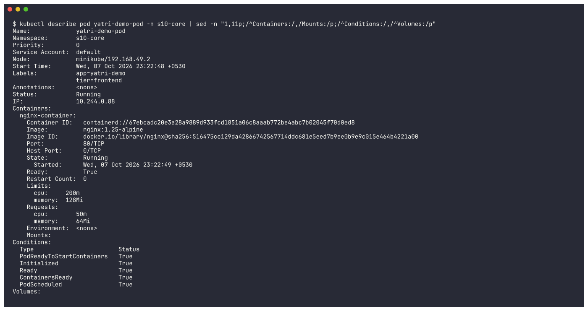

```bash
kubectl logs yatri-demo-pod -n s10-core --tail=3
kubectl exec yatri-demo-pod -n s10-core -- sh -c "hostname; nginx -v; wget -qO- localhost | grep title"
kubectl delete pod yatri-demo-pod -n s10-core && kubectl get pods -n s10-core
```
```
yatri-demo-pod
nginx version: nginx/1.25.5
<title>Welcome to nginx!</title>
pod "yatri-demo-pod" deleted from s10-core namespace
No resources found in s10-core namespace.
```
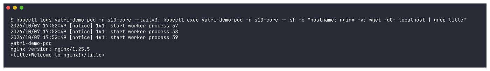
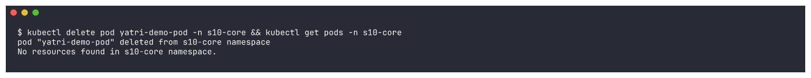

**Observation:** a bare Pod is gone for good once deleted - nothing recreates it.

### A2. ReplicaSet self-healing ([`replicaset.yaml`](00-core-objects/replicaset.yaml))
```bash
kubectl apply -f 00-core-objects/replicaset.yaml -n s10-core
kubectl get rs,pods -n s10-core -o wide
```
```
replicaset.apps/yatri-backend-rs   3         3         3       6s    backend   python:3.11-alpine3.19   app=yatri-backend
pod/yatri-backend-rs-6pcsb   1/1     Running   0          6s    10.244.0.97
pod/yatri-backend-rs-jcgwt   1/1     Running   0          5s    10.244.0.98
pod/yatri-backend-rs-qf42m   1/1     Running   0          5s    10.244.0.96
```
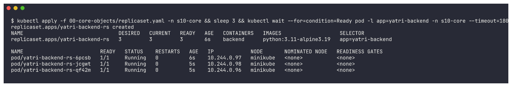

```bash
kubectl delete pod <first-pod> -n s10-core --wait=false
kubectl get pods -l app=yatri-backend -n s10-core
kubectl describe rs yatri-backend-rs -n s10-core     # events
```
```
deleting yatri-backend-rs-6pcsb ...
yatri-backend-rs-6pcsb   1/1     Terminating         0          10s
yatri-backend-rs-8r5nd   0/1     ContainerCreating   0          2s     <-- replacement
yatri-backend-rs-jcgwt   1/1     Running             0          9s
yatri-backend-rs-qf42m   1/1     Running             0          9s
Events:
  Normal  SuccessfulCreate  10s   replicaset-controller  Created pod: yatri-backend-rs-6pcsb
  Normal  SuccessfulCreate  10s   replicaset-controller  Created pod: yatri-backend-rs-qf42m
  Normal  SuccessfulCreate  10s   replicaset-controller  Created pod: yatri-backend-rs-jcgwt
  Normal  SuccessfulCreate  3s    replicaset-controller  Created pod: yatri-backend-rs-8r5nd
```
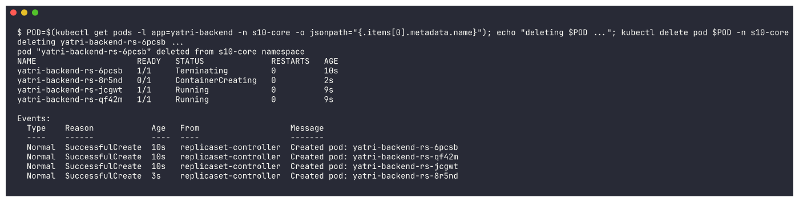

```bash
kubectl scale rs yatri-backend-rs --replicas=5 -n s10-core   # then back to 2
kubectl get pods -l app=yatri-backend -n s10-core -o custom-columns=POD:.metadata.name,OWNER-KIND:.metadata.ownerReferences[0].kind,OWNER:.metadata.ownerReferences[0].name
```
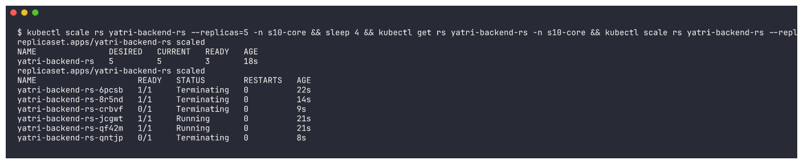
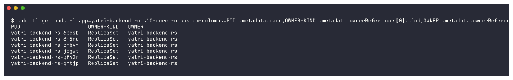

**Observation:** the ReplicaSet controller noticed 2 of 3 Pods and created `-8r5nd` within a
second. Scaling just changes `replicas`; the controller adds or removes Pods to match. Every Pod
carries an `ownerReference` to the ReplicaSet - that is how the controller knows which Pods are its own.

### A3. StatefulSet ([`statefulset.yaml`](00-core-objects/statefulset.yaml))

Headless Service `web-sts` + StatefulSet `web` (3 replicas, one 64Mi PVC each via `volumeClaimTemplates`).
I replaced the reference `mysql:5.7` (3 x 5Gi, amd64 only) with busybox that writes to its own volume.

```bash
kubectl apply -f 00-core-objects/statefulset.yaml -n s10-core
kubectl rollout status statefulset/web -n s10-core --timeout=300s
kubectl get statefulset,pods,pvc -l app=web-sts -n s10-core -o wide
```
```
Waiting for 3 pods to be ready...
Waiting for 2 pods to be ready...
Waiting for 1 pods to be ready...
partitioned roll out complete: 3 new pods have been updated...
pod/web-0   1/1     Running   0          4m46s   10.244.0.117
pod/web-1   1/1     Running   0          7s      10.244.0.118
pod/web-2   1/1     Running   0          4s      10.244.0.119
persistentvolumeclaim/data-web-0   Bound    pvc-44ed4ac4-...   64Mi   RWO   standard
persistentvolumeclaim/data-web-1   Bound    pvc-29a8a335-...   64Mi   RWO   standard
persistentvolumeclaim/data-web-2   Bound    pvc-75cc4135-...   64Mi   RWO   standard
```
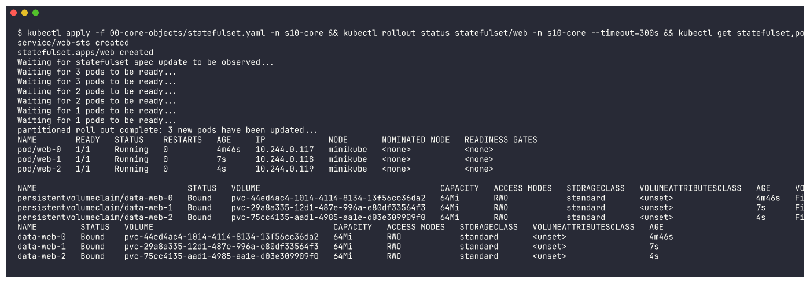
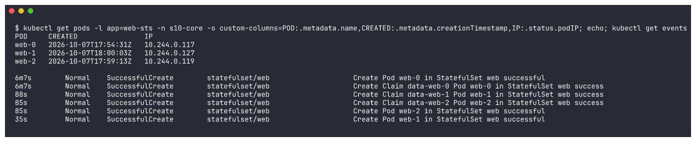

**Ordered creation:** `web-1` was only created after `web-0` was Ready, and `web-2` after `web-1`
(web-0 waited ~4.5 min for its volume because the storage provisioner was slow on my loaded
cluster - web-1 and web-2 did not start before it). Names are predictable: `web-0/1/2`, PVCs `data-web-N`.

**Stable identity + storage:**
```bash
kubectl delete pod web-1 -n s10-core
kubectl get pod web-1 -n s10-core -o wide
kubectl exec web-1 -n s10-core -- cat /data/history.log
```
```
BEFORE:
web-1   1/1     Running   0          22s   10.244.0.118
pod "web-1" deleted from s10-core namespace
AFTER (same name, same PVC, new IP):
web-1   1/1     Running   0          3s    10.244.0.127
volume claim: data-web-1
--- /data/history.log on web-1 survived the restart:
Wed Oct  7 17:59:13 UTC 2026 started as web-1
Wed Oct  7 18:00:06 UTC 2026 started as web-1
```
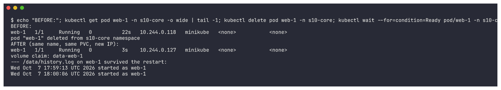

Per-Pod DNS through the headless Service:
```bash
kubectl exec web-0 -n s10-core -- nslookup web-2.web-sts.s10-core.svc.cluster.local
```
```
Name:	web-2.web-sts.s10-core.svc.cluster.local
Address: 10.244.0.119
```
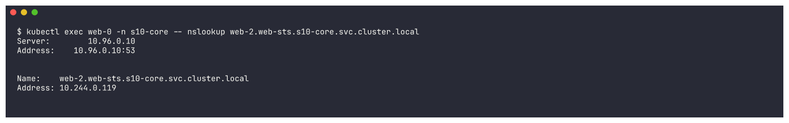

### A4. DaemonSet ([`daemonset.yaml`](00-core-objects/daemonset.yaml))
```bash
kubectl apply -f 00-core-objects/daemonset.yaml -n s10-core
kubectl get daemonset node-logging-agent -n s10-core -o wide
kubectl get pods -l app=node-logging-agent -n s10-core -o wide
kubectl logs -l app=node-logging-agent -n s10-core --tail=3
kubectl get daemonsets -A
```
```
node-logging-agent   1   1   1   1   1   <none>   4s   fluent-logger   busybox:1.36   app=node-logging-agent
node-logging-agent-nxbb4   1/1     Running   0          4s    10.244.0.128   minikube
[Wed Oct  7 18:00:13 UTC 2026] Collecting host system metrics on node-logging-agent-nxbb4
NAMESPACE     NAME                           DESIRED   CURRENT   READY
kube-system   kindnet                        1         1         1
kube-system   kube-proxy                     1         1         1
monitoring    kps-prometheus-node-exporter   1         1         1
s10-core      node-logging-agent             1         1         1
```
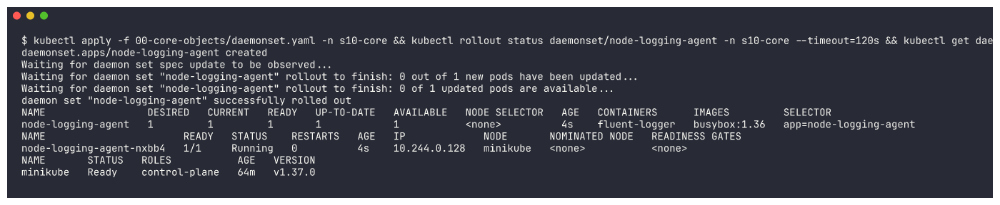
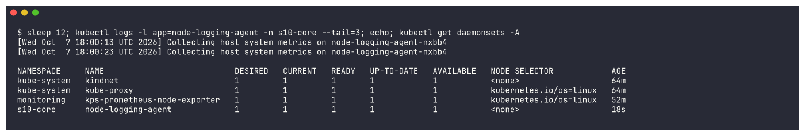

**Observation:** a DaemonSet has no `replicas` - DESIRED = number of nodes (1 on minikube). Real
examples on the same cluster: `kube-proxy`, `kindnet` (CNI) and the Prometheus node-exporter.

```bash
kubectl delete -f 00-core-objects/ -n s10-core
kubectl delete pvc data-web-0 data-web-1 data-web-2 -n s10-core --ignore-not-found
```
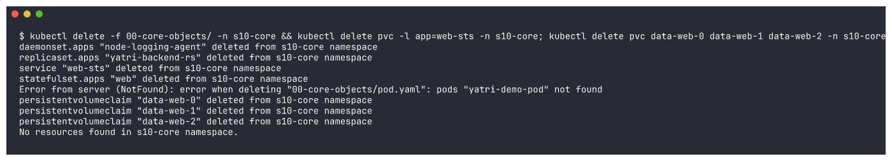

| | Pod | ReplicaSet | Deployment | StatefulSet | DaemonSet |
|---|---|---|---|---|---|
| Self-healing | no | yes | yes (via RS) | yes | yes |
| Pod names | fixed by you | random suffix | random suffix | ordinal `-0,-1,-2` | random suffix |
| Scaling | - | `replicas` | `replicas` | `replicas` (ordered) | 1 per node |
| Updates/rollback | - | no | yes | yes (reverse ordinal) | yes |
| Storage | any | shared | shared | one PVC per Pod | usually hostPath |

---

## Task 1: Deployment strategies

### 01. Rolling Update ([`01-rolling-update/`](01-rolling-update/))

`deployment-v1.yaml` (nginx 1.24, `VERSION: v1`) -> `deployment-v2.yaml` (nginx 1.25, `VERSION: v2`), 4 replicas:
```yaml
strategy:
  type: RollingUpdate
  rollingUpdate:
    maxSurge: 1        # at most 5 pods during the update
    maxUnavailable: 0  # never fewer than 4 ready pods
```

**Create the Deployment**
```bash
kubectl apply -f 01-rolling-update/deployment-v1.yaml -f 01-rolling-update/service.yaml -f curl-client.yaml -n s10-rolling
kubectl rollout status deployment/app-rolling -n s10-rolling
kubectl get deploy,rs,svc -n s10-rolling
kubectl get pods -n s10-rolling -l app=app-rolling -L version
```
```
deployment.apps/app-rolling   4/4     4            4           28s
replicaset.apps/app-rolling-65597c5cf5   4         4         4       28s
service/app-rolling-service   NodePort   10.106.174.166   <none>        80:32186/TCP   28s
app-rolling-65597c5cf5-4t74d   1/1     Running   0          27s   v1
app-rolling-65597c5cf5-fm4m8   1/1     Running   0          27s   v1
app-rolling-65597c5cf5-txht8   1/1     Running   0          27s   v1
app-rolling-65597c5cf5-wckw6   1/1     Running   0          28s   v1
```
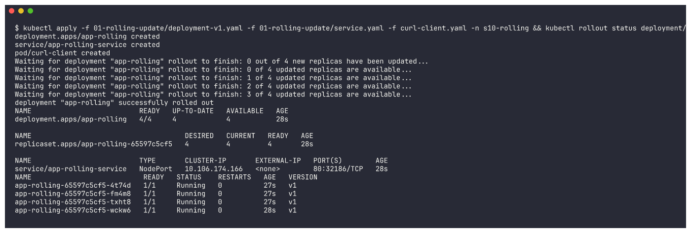

```bash
kubectl exec curl-client -n s10-rolling -- sh -c "for i in 1 2 3 4 5 6; do curl -s http://app-rolling-service; done"
```
```
VERSION: v1 | image: nginx:1.24-alpine | pod: app-rolling-65597c5cf5-4t74d
VERSION: v1 | image: nginx:1.24-alpine | pod: app-rolling-65597c5cf5-fm4m8
VERSION: v1 | image: nginx:1.24-alpine | pod: app-rolling-65597c5cf5-wckw6
...
```
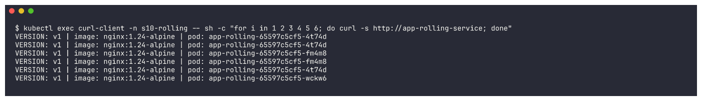

**Perform the update** - while watching the Pods (timestamped) and sending a request every 0.5 s:
```bash
kubectl get pods -n s10-rolling -l app=app-rolling -L version -w --output-watch-events | (timestamp each line) &
kubectl exec curl-client -n s10-rolling -- sh -c 'for i in $(seq 1 70); do curl -s -m 1 http://app-rolling-service || echo FAILED; sleep 0.5; done' &
kubectl apply -f 01-rolling-update/deployment-v2.yaml -n s10-rolling
kubectl rollout status deployment/app-rolling -n s10-rolling
```
```
23:32:34 ADDED      app-rolling-65597c5cf5-4t74d   1/1     Running   0          47s   v1
...
23:32:37 ADDED      app-rolling-69bb799997-nm2fz   0/1     Pending             0          0s    v2   <- 1 surge pod (5 total)
23:32:47 MODIFIED   app-rolling-69bb799997-nm2fz   1/1     Running             0          10s   v2   <- became READY
23:32:47 MODIFIED   app-rolling-65597c5cf5-4t74d   1/1     Terminating         0          60s   v1   <- only now 1 old pod goes
23:32:47 ADDED      app-rolling-69bb799997-gl456   0/1     Pending             0          0s    v2
23:33:00 MODIFIED   app-rolling-69bb799997-gl456   1/1     Running             0          13s   v2
23:33:00 MODIFIED   app-rolling-65597c5cf5-wckw6   1/1     Terminating         0          74s   v1
...
23:33:20 MODIFIED   app-rolling-69bb799997-km6gc   1/1     Running             0          8s    v2
23:33:20 MODIFIED   app-rolling-65597c5cf5-fm4m8   1/1     Terminating         0          93s   v1
```
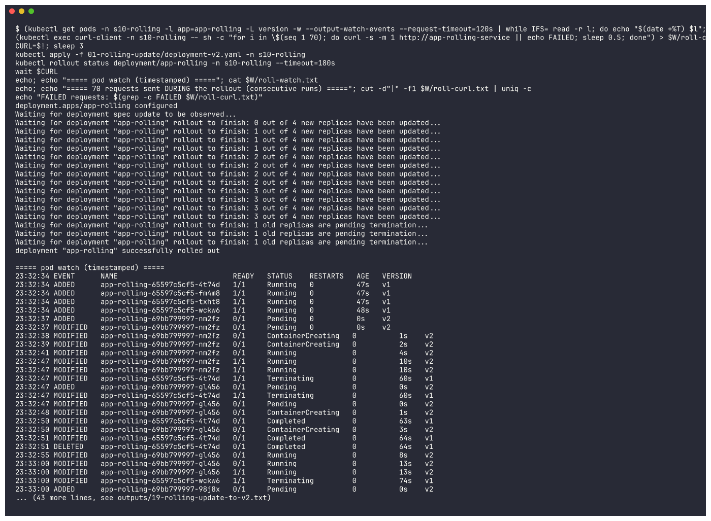

Traffic during the rollout (70 requests, consecutive runs):
```
  27 VERSION: v1
   1 VERSION: v2
  13 VERSION: v1
   1 VERSION: v2
   5 VERSION: v1
   3 VERSION: v2
   ...
   1 VERSION: v2
   1 FAILED
   1 VERSION: v2
   1 VERSION: v1
FAILED requests: 1 of 70
```
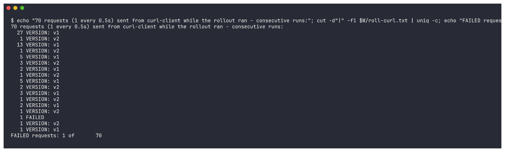

**Verify old and new Pods / ReplicaSets**
```bash
kubectl get rs -n s10-rolling -L version
kubectl get pods -n s10-rolling -l app=app-rolling -L version
kubectl get events -n s10-rolling --sort-by=.lastTimestamp | grep ScalingReplicaSet
```
```
app-rolling-65597c5cf5   0         0         0       9m28s   v1      <- old RS kept (scaled to 0) for rollback
app-rolling-69bb799997   4         4         4       8m36s   v2
Scaled up replica set app-rolling-65597c5cf5 from 0 to 4
Scaled up replica set app-rolling-69bb799997 from 0 to 1
Scaled down replica set app-rolling-65597c5cf5 from 4 to 3
Scaled up replica set app-rolling-69bb799997 from 1 to 2
Scaled down replica set app-rolling-65597c5cf5 from 3 to 2
Scaled up replica set app-rolling-69bb799997 from 2 to 3
Scaled down replica set app-rolling-65597c5cf5 from 2 to 1
Scaled up replica set app-rolling-69bb799997 from 3 to 4
Scaled down replica set app-rolling-65597c5cf5 from 1 to 0
```
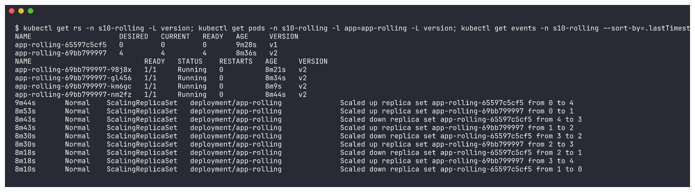

**Observation:** with `maxSurge: 1, maxUnavailable: 0` the controller always adds one v2 Pod,
waits for it to pass its readiness probe, and only then removes one v1 Pod (up / down / up / down
in the events). During the switch both versions answered. 69 of 70 requests succeeded; the single
failure happened while a v1 Pod was being terminated: kube-proxy removes the Pod from the Service a
moment *after* the Pod gets SIGTERM, and on my overloaded node that gap was long enough for one
request to hit a stopping nginx. The production fix is a `preStop` hook (e.g. `sleep 5`) so the
Pod keeps serving until it has been removed from the endpoints.

```bash
kubectl exec curl-client -n s10-rolling -- sh -c "for i in 1 2 3 4; do curl -s http://app-rolling-service; done"
kubectl rollout history deployment/app-rolling -n s10-rolling
```
```
command terminated with exit code 6
REVISION  CHANGE-CAUSE
1         <none>
2         <none>
```
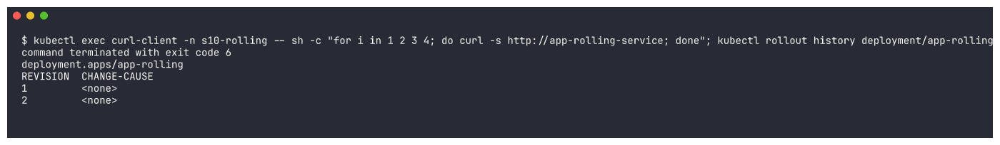

(curl exit code 6 = "could not resolve host": at that moment CoreDNS itself was `0/1` not-ready
because the shared node was overloaded - a good reminder that DNS is a dependency of every
Service call. The v2 responses are visible in the traffic capture above.)

**Rollback with `kubectl rollout undo`**
```bash
kubectl rollout undo deployment/app-rolling -n s10-rolling
kubectl rollout status deployment/app-rolling -n s10-rolling --timeout=180s
```
```
deployment.apps/app-rolling rolled back
Waiting for deployment "app-rolling" rollout to finish: 1 out of 4 new replicas have been updated...
error: timed out waiting for the condition
```
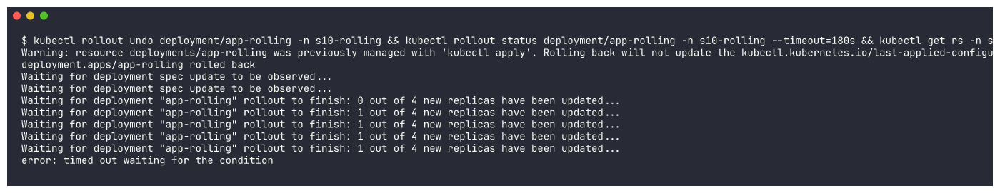

The undo itself worked, but my 3-minute wait timed out: the node was so overloaded that new Pods
took minutes to start and readiness probes (1 s timeout) were failing. Checking again after it finished:
```bash
kubectl rollout status deployment/app-rolling -n s10-rolling
kubectl get rs -n s10-rolling -L version
kubectl exec curl-client -n s10-rolling -- sh -c "for i in 1 2 3 4; do curl -s -m 3 http://app-rolling-service; done"
kubectl rollout history deployment/app-rolling -n s10-rolling
```
```
deployment "app-rolling" successfully rolled out
app-rolling-65597c5cf5   4         4         4       44m   v1     <- the OLD ReplicaSet was scaled back up
app-rolling-69bb799997   0         0         0       43m   v2
VERSION: v1 | image: nginx:1.24-alpine | pod: app-rolling-65597c5cf5-rxxms
VERSION: v1 | image: nginx:1.24-alpine | pod: app-rolling-65597c5cf5-nm9qn
REVISION  CHANGE-CAUSE
2         <none>
3         <none>
```
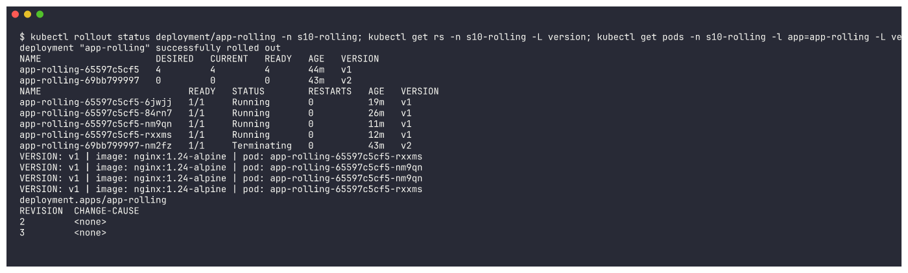

**Observation:** `rollout undo` does not rebuild anything - it scales the previous ReplicaSet
(`65597c5cf5`, v1) back up and the v2 one down, again as a rolling update. Revision 1 becomes revision 3.

```bash
kubectl delete namespace s10-rolling --wait=false
```


### 02. Blue-Green Deployment ([`02-blue-green/`](02-blue-green/))

Two complete environments run side by side; ONE Service decides which one is live, purely by its
label selector (`slot: blue` vs `slot: green`).

| File | What |
|---|---|
| `deployment-blue.yaml` | 3 Pods, labels `app=myapp, slot=blue, version=v1` (nginx 1.24) |
| `deployment-green.yaml` | 3 Pods, labels `app=myapp, slot=green, version=v2` (nginx 1.25) |
| `service-blue.yaml` | Service `myapp-service`, selector `app=myapp, slot=blue` |
| `service-green.yaml` | same Service, selector `app=myapp, slot=green` |

**Create the Blue version (live)**
```bash
kubectl apply -f 02-blue-green/deployment-blue.yaml -f 02-blue-green/service-blue.yaml -f curl-client.yaml -n s10-bluegreen
kubectl rollout status deployment/app-blue -n s10-bluegreen
kubectl get pods -n s10-bluegreen -L slot,version
```
```
deployment.apps/app-blue   3/3     3            3           5m53s
service/myapp-service   NodePort   10.98.163.188   <none>        80:30731/TCP   5m51s
app-blue-5966dff86d-jlnqs   1/1     Running   0          5m40s   blue   v1
app-blue-5966dff86d-s2pls   1/1     Running   0          5m42s   blue   v1
app-blue-5966dff86d-t5lx8   1/1     Running   0          5m40s   blue   v1
```
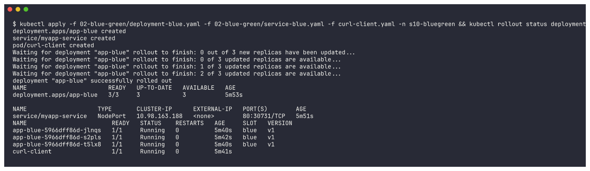

```bash
kubectl get svc myapp-service -n s10-bluegreen -o jsonpath='selector: {.spec.selector}'
kubectl get endpointslices -l kubernetes.io/service-name=myapp-service -n s10-bluegreen
kubectl exec curl-client -n s10-bluegreen -- sh -c "for i in 1 2 3 4 5 6; do curl -s -m 5 http://myapp-service; done"
```
```
selector: {"app":"myapp","slot":"blue"}
myapp-service-k8cqt   IPv4          80      10.244.0.206,10.244.0.207,10.244.0.208   5m47s
BLUE ENVIRONMENT | version: v1 | pod: app-blue-5966dff86d-s2pls
BLUE ENVIRONMENT | version: v1 | pod: app-blue-5966dff86d-jlnqs
...  (6/6 BLUE)
```
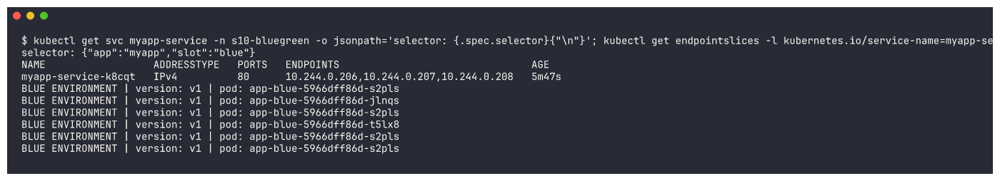

**Create the Green version (idle)**
```bash
kubectl apply -f 02-blue-green/deployment-green.yaml -n s10-bluegreen
kubectl get pods -n s10-bluegreen -L slot,version -o wide
```
```
app-blue-5966dff86d-jlnqs    1/1     Running   0   8m2s   10.244.0.208   blue    v1
app-blue-5966dff86d-s2pls    1/1     Running   0   8m4s   10.244.0.206   blue    v1
app-blue-5966dff86d-t5lx8    1/1     Running   0   8m2s   10.244.0.207   blue    v1
app-green-659cf7b84c-5vm24   1/1     Running   0   93s    10.244.0.214   green   v2
app-green-659cf7b84c-k9vqx   1/1     Running   0   94s    10.244.0.213   green   v2
app-green-659cf7b84c-ph9cb   1/1     Running   0   93s    10.244.0.212   green   v2
--- green is running but receives NO traffic yet:
BLUE ENVIRONMENT | version: v1 | pod: app-blue-5966dff86d-jlnqs   (6/6 BLUE)
```
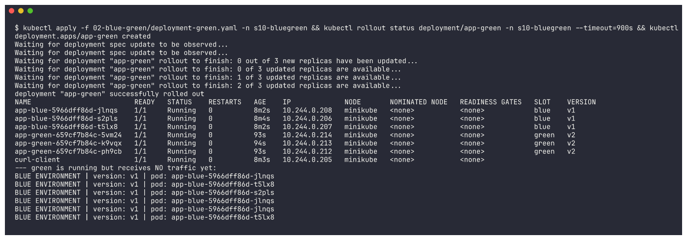

Smoke-test green directly (Pod IP) before giving it real traffic:
```bash
kubectl exec curl-client -n s10-bluegreen -- curl -s -m 5 http://$GREEN_IP
```
```
smoke-testing green pod directly at 10.244.0.214
GREEN ENVIRONMENT | version: v2 | pod: app-green-659cf7b84c-5vm24
```
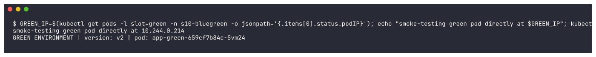

**Switch traffic** - one `kubectl apply` of the Service with the other selector:
```bash
kubectl apply -f 02-blue-green/service-green.yaml -n s10-bluegreen
kubectl get endpointslices -l kubernetes.io/service-name=myapp-service -n s10-bluegreen
kubectl exec curl-client -n s10-bluegreen -- sh -c "for i in 1 2 3 4 5 6; do curl -s -m 5 http://myapp-service; done"
```
```
00:48:50
service/myapp-service configured
selector: {"app":"myapp","slot":"green"}
myapp-service-k8cqt   IPv4          80      10.244.0.213,10.244.0.214,10.244.0.212   8m20s
GREEN ENVIRONMENT | version: v2 | pod: app-green-659cf7b84c-k9vqx
GREEN ENVIRONMENT | version: v2 | pod: app-green-659cf7b84c-ph9cb
...  (6/6 GREEN)
```
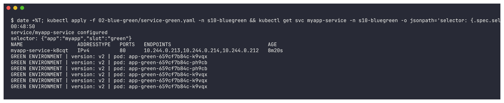

**Instant rollback** (blue is still running, so going back is the same one-liner):
```bash
kubectl apply -f 02-blue-green/service-blue.yaml -n s10-bluegreen
```
```
selector: {"app":"myapp","slot":"blue"}
BLUE ENVIRONMENT | version: v1 | pod: app-blue-5966dff86d-s2pls   (6/6 BLUE)
```
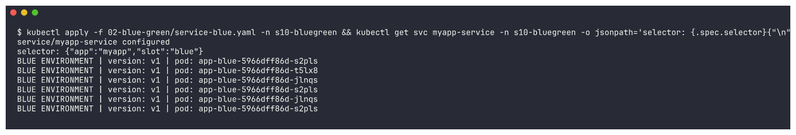

**Verify the active version / retire blue**
```bash
kubectl apply -f 02-blue-green/service-green.yaml -n s10-bluegreen
kubectl exec curl-client ... (6 requests)
kubectl scale deployment app-blue --replicas=0 -n s10-bluegreen
kubectl get deploy -n s10-bluegreen
```
```
GREEN ENVIRONMENT | version: v2 | pod: app-green-659cf7b84c-ph9cb   (6/6 GREEN)
deployment.apps/app-blue scaled
NAME        READY   UP-TO-DATE   AVAILABLE   AGE
app-blue    3/0     3            3           9m6s     <- scaling down
app-green   3/3     3            3           2m36s
```
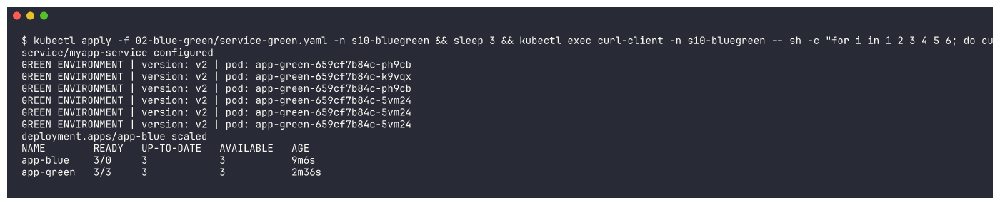


**Observation:** the Service's EndpointSlice switched from the 3 blue Pod IPs (…206/207/208) to
the 3 green Pod IPs (…212/213/214) the moment the selector changed - every request after the
switch was GREEN, with no mixed period, and rollback was just as instant. The price: during the
switch you run **double the Pods** (6 instead of 3).

### 03. Canary Deployment ([`03-canary/`](03-canary/))

Two Deployments behind ONE Service. The Service selects only `app=myapp-canary` (not `track`), so
both tracks receive traffic and the **traffic split = ratio of Pods**.

| File | Pods | Labels |
|---|---|---|
| `deployment-stable.yaml` | 9 x nginx 1.24 -> `STABLE v1` | `app=myapp-canary, track=stable, version=v1` |
| `deployment-canary.yaml` | 1 x nginx 1.25 -> `CANARY v2` | `app=myapp-canary, track=canary, version=v2` |
| `service.yaml` | selector `app: myapp-canary` | |

**Deploy the stable version**
```bash
kubectl apply -f 03-canary/deployment-stable.yaml -f 03-canary/service.yaml -f curl-client.yaml -n s10-canary
kubectl rollout status deployment/app-stable -n s10-canary
kubectl get deploy,svc -n s10-canary
```
```
deployment.apps/app-stable   9/9     9            9           2m28s
service/myapp-canary-service   NodePort   10.107.122.238   <none>        80:32241/TCP   2m27s
```
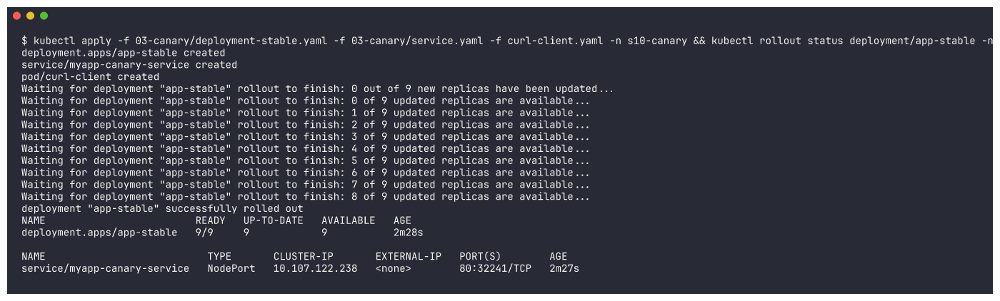

**Deploy the canary version**
```bash
kubectl apply -f 03-canary/deployment-canary.yaml -n s10-canary
kubectl get pods -n s10-canary -L track,version
```
```
app-canary   1/1     1            1           28s
app-stable   9/9     9            9           2m59s
app-canary-64df56cd69-r5whd   1/1     Running   0          28s     canary   v2
app-stable-868c799b48-7b9qb   1/1     Running   0          2m56s   stable   v1
... (9 stable pods)
```
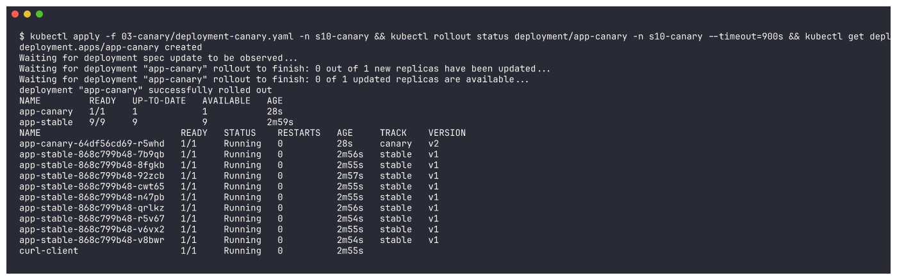

The Service now has **10 endpoints** - 9 stable + 1 canary:
```bash
kubectl get endpointslices -l kubernetes.io/service-name=myapp-canary-service -n s10-canary -o jsonpath='...'
```
```
selector: {"app":"myapp-canary"}
10.244.0.250  ready=true  pod=app-stable-868c799b48-qrlkz
...
10.244.0.4    ready=true  pod=app-canary-64df56cd69-r5whd
```
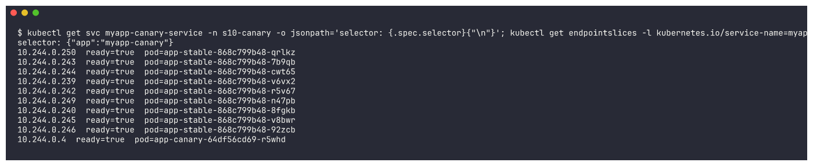

**Route a small percentage of traffic to the canary - verify both versions** (100 requests):
```bash
kubectl exec curl-client -n s10-canary -- sh -c "for i in \$(seq 1 100); do curl -s -m 5 http://myapp-canary-service || echo FAILED; done" | sort | uniq -c
```
```
100 requests to the Service with 9 stable + 1 canary pod:
  10 CANARY v2
  90 STABLE v1
```
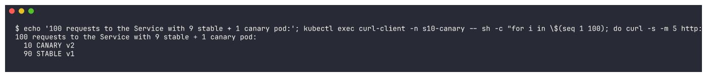

Canary looks healthy -> increase its share to ~30 % (3 canary : 7 stable):
```bash
kubectl scale deployment app-canary --replicas=3 -n s10-canary
kubectl scale deployment app-stable --replicas=7 -n s10-canary
```
```
app-canary   3/3     3            3           75s
app-stable   7/7     7            7           3m46s
100 requests with 7 stable + 3 canary pods:
  37 CANARY v2
  63 STABLE v1
```
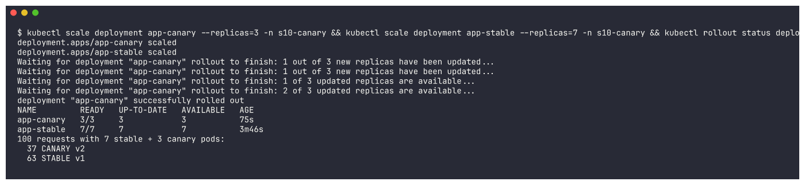

Promote the canary to 100 % (scale stable to 0):
```bash
kubectl scale deployment app-canary --replicas=4 -n s10-canary
kubectl scale deployment app-stable --replicas=0 -n s10-canary
```
```
app-canary   4/4     4            4           111s
app-stable   0/0     0            0           4m22s
100 requests after promoting the canary to 100%:
 100 CANARY v2
```
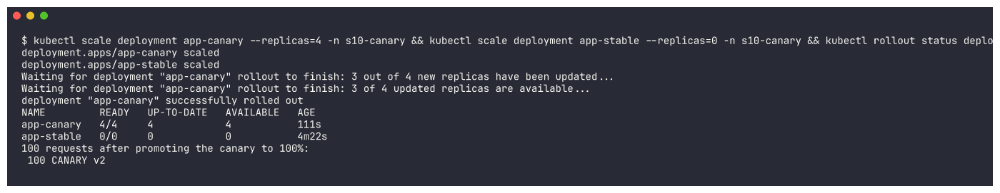


**Observation:** kube-proxy picks a random endpoint per connection, so with 1 of 10 Pods being the
canary almost exactly 10 % of requests (10/100) hit v2; with 3 of 10 it was 37/100 (~30 %, random
variation). The limitation of this replica-ratio canary: the percentage is tied to Pod counts (you
cannot do 1 % without 100 Pods) and you cannot route by user/header - that needs an Ingress
controller or service mesh (e.g. NGINX canary annotations, Istio, Argo Rollouts).

### 04. Recreate Deployment ([`04-recreate/`](04-recreate/))

```yaml
strategy:
  type: Recreate     # kill ALL old pods first, then create the new ones
```

**Deploy the application (v1)**
```bash
kubectl apply -f 04-recreate/deployment-v1.yaml -f 04-recreate/service.yaml -f curl-client.yaml -n s10-recreate
kubectl get deploy,rs,svc -n s10-recreate
kubectl get pods -n s10-recreate -l app=app-recreate -L version
```
```
deployment.apps/app-recreate   3/3     3            3           72s
replicaset.apps/app-recreate-5855d89fb9   3         3         3       72s
app-recreate-5855d89fb9-97fd4   1/1     Running   0          72s   v1
app-recreate-5855d89fb9-9s4t4   1/1     Running   0          72s   v1
app-recreate-5855d89fb9-c52wj   1/1     Running   0          73s   v1
STRATEGY: RECREATE | VERSION: v1 | pod: app-recreate-5855d89fb9-9s4t4
```
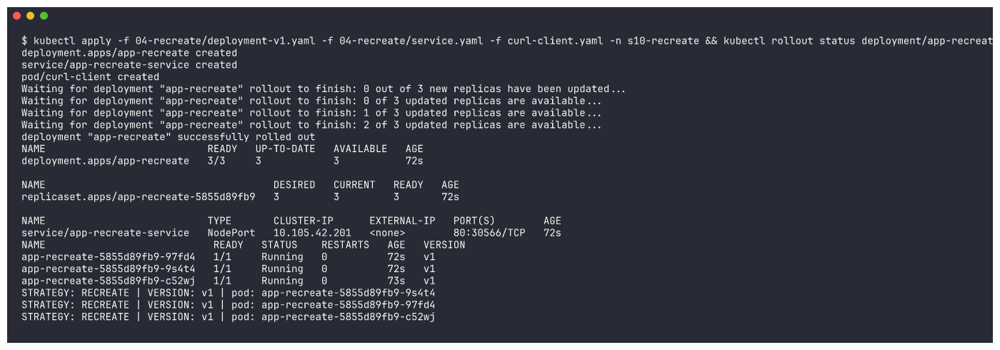

**Update the application** - watching Pods with timestamps and sending a request every 0.5 s
until v2 has answered 6 times:
```bash
kubectl get pods -n s10-recreate -l app=app-recreate -L version -w --output-watch-events | (timestamp) > rec-watch.txt &
kubectl exec curl-client -n s10-recreate -- sh -c '... curl -s -m 1 http://app-recreate-service || echo FAILED-no-pod-available ...' > rec-curl.txt &
kubectl apply -f 04-recreate/deployment-v2.yaml -n s10-recreate
kubectl rollout status deployment/app-recreate -n s10-recreate
```
```
apply v2 at 00:51:46
deployment.apps/app-recreate configured
Waiting for deployment "app-recreate" rollout to finish: 0 out of 3 new replicas have been updated...
...
deployment "app-recreate" successfully rolled out
rollout finished at 00:52:58
```
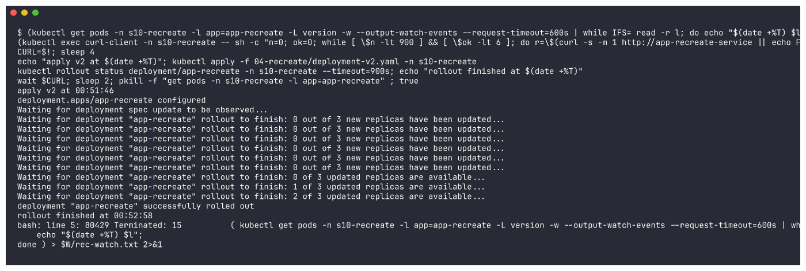

**Observe the old Pods being terminated before new Pods are created:**
```bash
cat $W/rec-watch.txt
```
```
00:51:43 ADDED      app-recreate-5855d89fb9-97fd4   1/1     Running       0          90s     v1
00:51:43 ADDED      app-recreate-5855d89fb9-9s4t4   1/1     Running       0          90s     v1
00:51:43 ADDED      app-recreate-5855d89fb9-c52wj   1/1     Running       0          91s     v1
00:51:49 MODIFIED   app-recreate-5855d89fb9-9s4t4   1/1     Terminating   0          96s     v1   <- ALL 3 old pods
00:51:49 MODIFIED   app-recreate-5855d89fb9-c52wj   1/1     Terminating   0          97s     v1   <- terminate at
00:51:49 MODIFIED   app-recreate-5855d89fb9-97fd4   1/1     Terminating   0          96s     v1   <- the same time
00:52:28 MODIFIED   app-recreate-5855d89fb9-9s4t4   0/1     Completed     0          2m15s   v1
00:52:30 MODIFIED   app-recreate-5855d89fb9-97fd4   0/1     Completed     0          2m17s   v1
00:52:32 MODIFIED   app-recreate-5855d89fb9-c52wj   0/1     Completed     0          2m20s   v1   <- last old container stopped
00:52:33 ADDED      app-recreate-74696bddfb-ncfhz   0/1     Pending       0          0s      v2   <- only NOW the new
00:52:33 ADDED      app-recreate-74696bddfb-rtl77   0/1     Pending       0          0s      v2   <- pods are created
00:52:33 ADDED      app-recreate-74696bddfb-v98ln   0/1     Pending       0          0s      v2
00:52:40 MODIFIED   app-recreate-74696bddfb-rtl77   0/1     ContainerCreating   0          7s      v2
...
00:52:55 MODIFIED   app-recreate-74696bddfb-v98ln   1/1     Running             0          22s     v2
00:52:57 MODIFIED   app-recreate-74696bddfb-ncfhz   1/1     Running             0          24s     v2
00:52:57 MODIFIED   app-recreate-74696bddfb-rtl77   1/1     Running             0          24s     v2
```
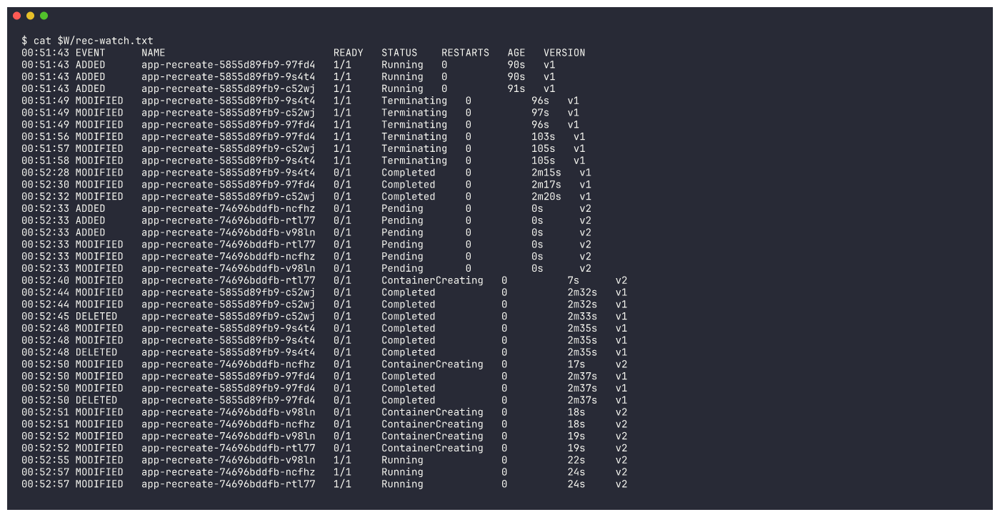

**Downtime, measured from inside the cluster:**
```bash
cut -c10- $W/rec-curl.txt | cut -d"|" -f1-2 | uniq -c
grep FAILED $W/rec-curl.txt | sed -n "1p;\$p"
```
```
requests (every 0.5s) while Recreate ran - consecutive runs:
   4 STRATEGY: RECREATE | VERSION: v1
  61 FAILED-no-pod-available
   6 STRATEGY: RECREATE | VERSION: v2

first and last failure:
19:21:51 FAILED-no-pod-available       (container clock is UTC: 00:51:51 IST)
19:22:57 FAILED-no-pod-available       (00:52:57 IST)
```
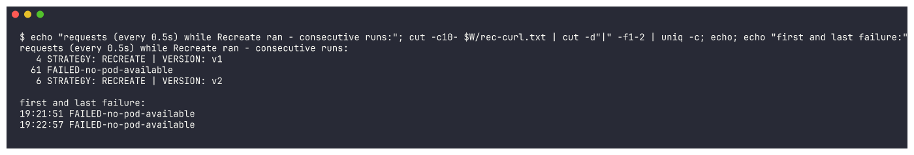

```bash
kubectl get events -n s10-recreate --sort-by=.lastTimestamp | grep -E 'ScalingReplicaSet|Killing|Started'
kubectl get rs -n s10-recreate -L version
```
```
3m9s   Normal   ScalingReplicaSet   deployment/app-recreate   Scaled up replica set app-recreate-5855d89fb9 from 0 to 3
93s    Normal   ScalingReplicaSet   deployment/app-recreate   Scaled down replica set app-recreate-5855d89fb9 from 3 to 0
91s    Normal   Killing             pod/app-recreate-5855d89fb9-c52wj    Stopping container web
91s    Normal   Killing             pod/app-recreate-5855d89fb9-9s4t4    Stopping container web
91s    Normal   Killing             pod/app-recreate-5855d89fb9-97fd4    Stopping container web
49s    Normal   ScalingReplicaSet   deployment/app-recreate   Scaled up replica set app-recreate-74696bddfb from 0 to 3
29s    Normal   Started             pod/app-recreate-74696bddfb-v98ln    Container started
app-recreate-5855d89fb9   0         0         0       3m13s   v1
app-recreate-74696bddfb   3         3         3       53s     v2
```
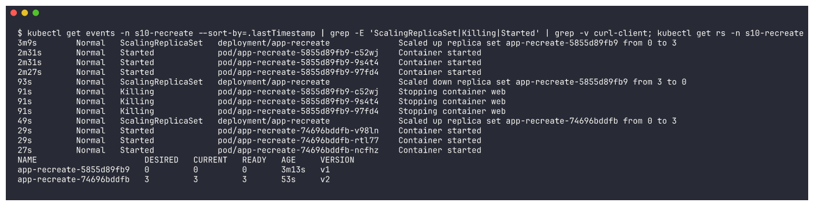


**Observation:** Recreate scaled the old ReplicaSet **3 -> 0 in one step**, waited until the old
containers had stopped, and only then scaled the new ReplicaSet **0 -> 3**. Unlike the rolling
update, v1 and v2 never ran together - but the Service had **no Pods for ~66 seconds** (61 failed
requests in a row; long because Pod start-up was slow on my overloaded node). Use Recreate only when
two versions must never run at the same time (e.g. incompatible DB schema, a single-writer app)
and a short downtime is acceptable.

### Strategy comparison (from my runs)

| Strategy | Old + new together? | Downtime seen | Extra Pods needed | Rollback | Traffic control |
|---|---|---|---|---|---|
| Rolling update | yes, briefly mixed | 1 of 70 requests failed (no preStop hook) | +1 (`maxSurge`) | `kubectl rollout undo` | none (gradual) |
| Blue-green | yes, both full size | none (0 failures in my checks) | 2x | switch the selector back (instant) | all-or-nothing |
| Canary | yes | none | +canary pods | scale canary to 0 | by replica ratio (10/90 -> 37/63 -> 100) |
| Recreate | never | ~66 s (61 failed requests) | none | redeploy old version | none |

---

## Task 2: Pod lifecycle

Files: [`pod-lifecycle/`](pod-lifecycle/) - the 12 YAMLs from the reference repo, unchanged.
Namespace `s10-lifecycle`.

**Pod phases** (`.status.phase`): `Pending` -> `Running` -> `Succeeded` / `Failed` (or `Unknown`).
The `STATUS` column of `kubectl get pods` is more detailed - it also shows container states/reasons
such as `ContainerCreating`, `Completed`, `Error`, `CrashLoopBackOff`, `ImagePullBackOff`, `Init:0/1`, `Terminating`.

For **each** YAML I did: apply -> `kubectl get pod` (status) -> `kubectl describe pod` (details,
trimmed to State / Conditions / Events) -> `kubectl logs` where useful. Applying each file:
```bash
kubectl apply -f pod-lifecycle/<file>.yaml -n s10-lifecycle && date +%T && kubectl get pods -n s10-lifecycle
```

| # | File | Apply screenshot |
|---|---|---|
| 01 | `01-running.yaml` | 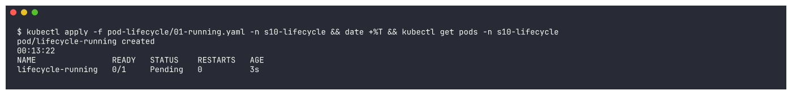 |
| 02 | `02-pending.yaml` | 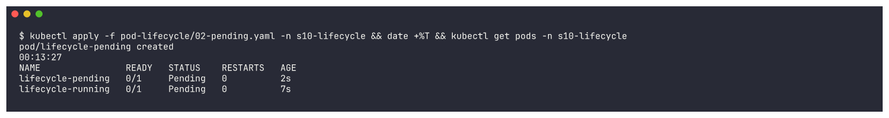 |
| 03 | `03-succeeded.yaml` | 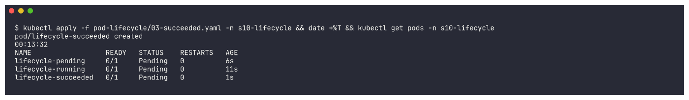 |
| 04 | `04-failed.yaml` | 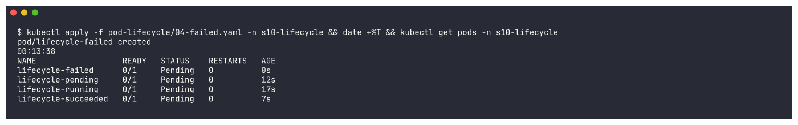 |
| 05 | `05-crashloopbackoff.yaml` | 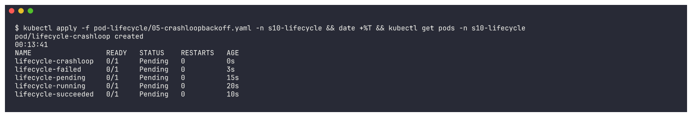 |
| 06 | `06-imagepullbackoff.yaml` | 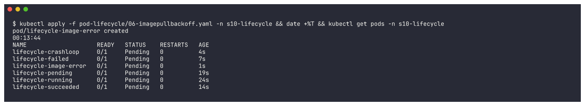 |
| 07 | `07-readiness.yaml` | 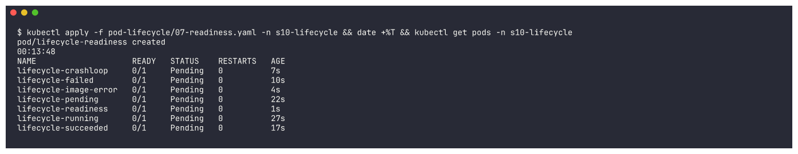 |
| 08 | `08-liveness.yaml` | 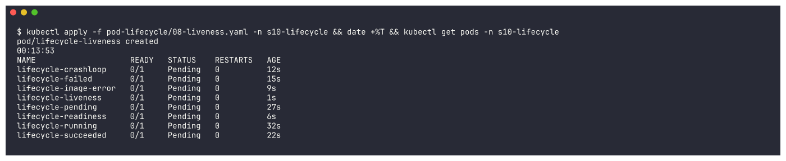 |
| 09 | `09-startup.yaml` | 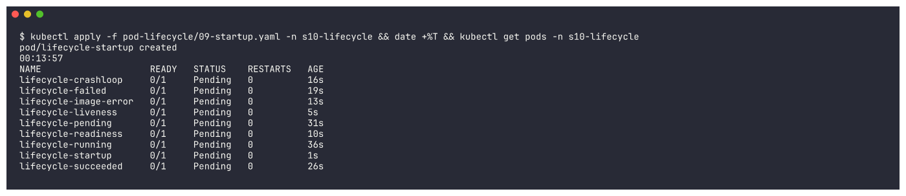 |
| 10 | `10-init-container.yaml` | 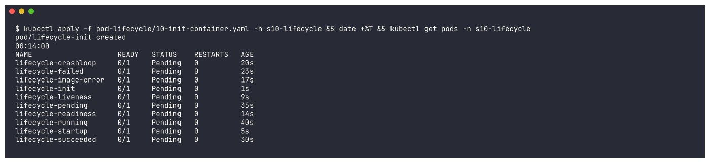 |
| 11 | `11-multi-container.yaml` | 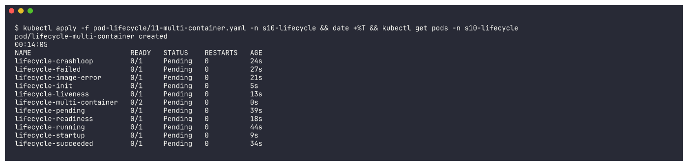 |

Overview ~3.5 minutes later:
```bash
kubectl get pods -n s10-lifecycle -o wide
```
```
00:17:06
NAME                        READY   STATUS         RESTARTS      AGE
lifecycle-crashloop         1/1     Running        2 (80s ago)   3m27s
lifecycle-failed            0/1     Error          0             3m30s
lifecycle-image-error       0/1     ErrImagePull   0             3m24s
lifecycle-init              1/1     Running        0             3m8s
lifecycle-liveness          1/1     Running        0             3m16s
lifecycle-multi-container   2/2     Running        0             3m3s
lifecycle-pending           0/1     Pending        0             3m42s
lifecycle-readiness         1/1     Running        0             3m21s
lifecycle-running           1/1     Running        0             3m47s
lifecycle-startup           0/1     Running        0             3m12s
lifecycle-succeeded         0/1     Completed      0             3m37s
```
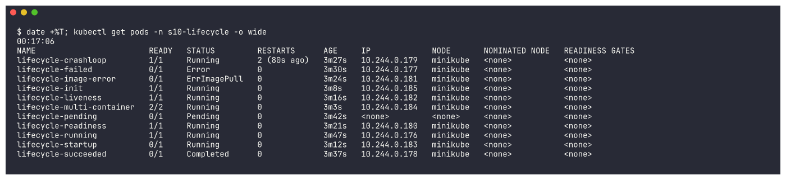

and ~17 minutes later, when the restarts/back-offs had accumulated:
```
00:30:45
lifecycle-crashloop         0/1     CrashLoopBackOff   4 (5m44s ago)   17m
lifecycle-failed            0/1     Error              0               17m
lifecycle-image-error       0/1     ImagePullBackOff   0               17m
lifecycle-init              1/1     Running            0               16m
lifecycle-liveness          1/1     Running            2 (7m48s ago)   16m
lifecycle-multi-container   2/2     Running            0               16m
lifecycle-pending           0/1     Pending            0               17m
lifecycle-readiness         1/1     Running            0               16m
lifecycle-running           1/1     Running            0               17m
lifecycle-startup           1/1     Running            1 (9m14s ago)   16m
lifecycle-succeeded         0/1     Completed          0               17m
```
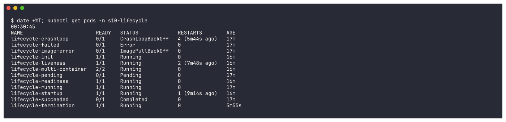

> Note on timing: my minikube node was shared with several other workloads and was heavily
> overloaded during this task (load average > 100 inside the node, kubelet briefly NotReady around
> 00:23). Pods therefore took ~2 minutes to start and the kubelet reported status changes late. The
> *sequence* of states is still exactly what each YAML is designed to show.

### 01 - Running
```bash
kubectl get pod lifecycle-running -n s10-lifecycle -o wide
kubectl describe pod lifecycle-running -n s10-lifecycle
kubectl get pod lifecycle-running -n s10-lifecycle -o jsonpath='{.status.phase} {.status.containerStatuses[0].state}'
```
```
lifecycle-running   1/1     Running   0          4m3s   10.244.0.176   minikube
Status:           Running
    State:          Running
    Ready:          True
Conditions:   PodScheduled True / Initialized True / ContainersReady True / Ready True
Events:
  Warning  FailedScheduling  4m1s  default-scheduler  0/1 nodes are available: 1 node(s) had untolerated taint(s) ...
  Normal   Scheduled         3m53s default-scheduler  Successfully assigned s10-lifecycle/lifecycle-running to minikube
  Normal   Pulled / Created / Started  kubelet  nginx:1.27
Running {"running":{"startedAt":"2026-10-07T18:45:30Z"}}
```
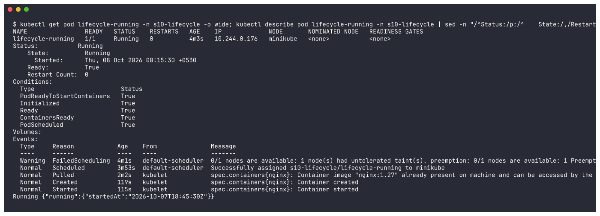

**Observed:** the normal happy path: Pending -> scheduled -> image present -> container started ->
phase `Running`, all conditions True. (The first `FailedScheduling` came from a temporary node
taint while the overloaded node was flagged; the scheduler retried 8 s later.)

### 02 - Pending
```bash
kubectl get pod lifecycle-pending -n s10-lifecycle -o wide
kubectl describe pod lifecycle-pending -n s10-lifecycle
```
```
lifecycle-pending   0/1     Pending   0          4m3s   <none>   <none>
    Requests:
      cpu:        1
      memory:     9Gi
Conditions:
  PodScheduled   False
Events:
  Warning  FailedScheduling  26s (x12 over 3m59s)  default-scheduler  0/1 nodes are available: 1 Insufficient memory.
```
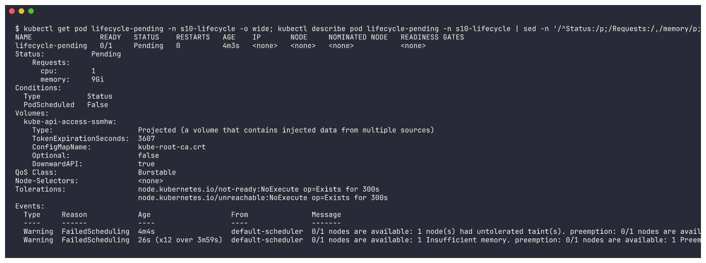

**Observed:** the Pod asks for 9 GiB of memory but the node has ~7.7 GiB, so the scheduler can
never place it: no node, no IP, `PodScheduled=False`, and it stays `Pending` forever.
Fix: lower the request or add a bigger node.

### 03 - Succeeded
```bash
kubectl get pod lifecycle-succeeded -n s10-lifecycle
kubectl describe pod lifecycle-succeeded -n s10-lifecycle
kubectl logs lifecycle-succeeded -n s10-lifecycle
```
```
lifecycle-succeeded   0/1     Completed   0          4m3s
Status:           Succeeded
    State:          Terminated
      Reason:       Completed
      Exit Code:    0
      Started:      Thu, 08 Oct 2026 00:15:30 +0530
      Finished:     Thu, 08 Oct 2026 00:15:35 +0530
Task started
Task completed successfully
```
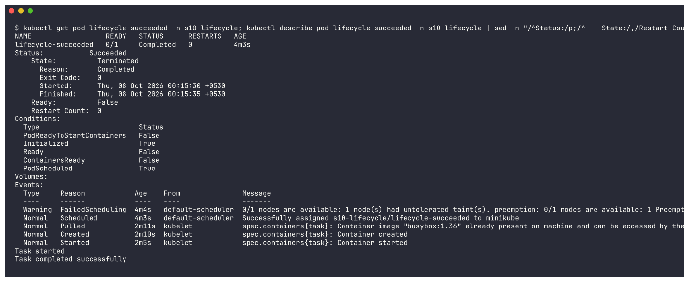

**Observed:** `restartPolicy: Never` + exit code 0 -> phase `Succeeded` (STATUS `Completed`). It ran 5 s and stopped; nothing restarts it. This is how Jobs finish.

### 04 - Failed
```
lifecycle-failed   0/1     Error    0          4m7s
Status:           Failed
    State:          Terminated
      Reason:       Error
      Exit Code:    1
Task started
Task failed
```
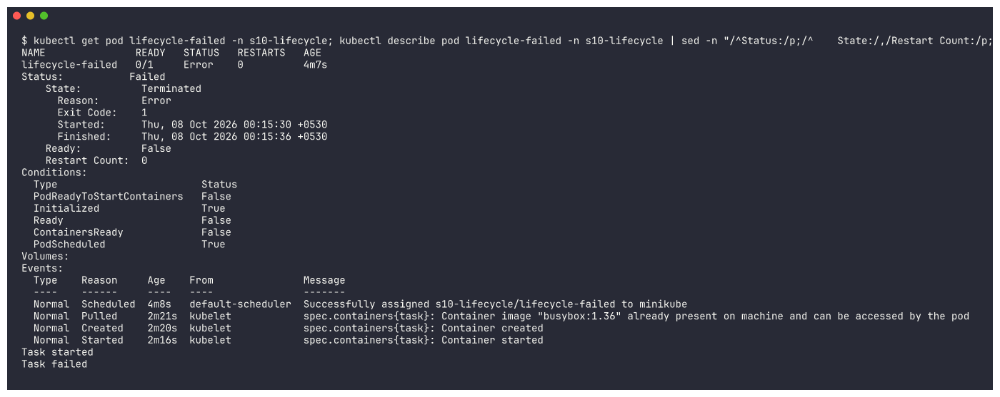

**Observed:** same as 03 but the command exits with 1 -> phase `Failed`, STATUS `Error`, no restart (`restartPolicy: Never`).

### 05 - CrashLoopBackOff
```bash
kubectl get pod lifecycle-crashloop -n s10-lifecycle
kubectl describe pod lifecycle-crashloop -n s10-lifecycle
kubectl logs lifecycle-crashloop -n s10-lifecycle --previous
```
First check (status was still catching up - shows `Running` with 2 restarts):

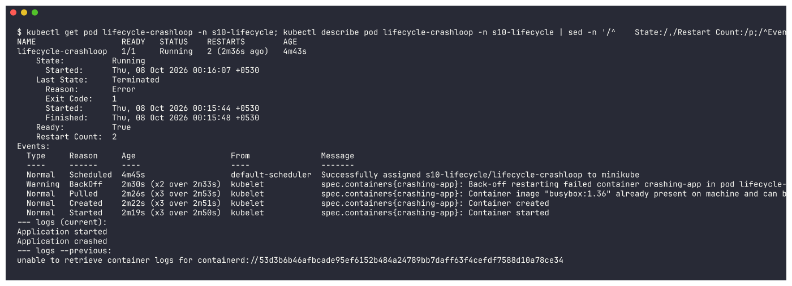

Later:
```
lifecycle-crashloop   0/1     CrashLoopBackOff   4 (5m26s ago)   16m
    State:          Waiting
      Reason:       CrashLoopBackOff
    Last State:     Terminated
      Reason:       Error
      Exit Code:    1
    Restart Count:  4
Events:
  Normal   Started    5m30s (x5 over 14m)  kubelet  Container started
  Warning  BackOff    4m43s (x3 over 14m)  kubelet  Back-off restarting failed container crashing-app ...
--- logs --previous:
Application started
Application crashed
```
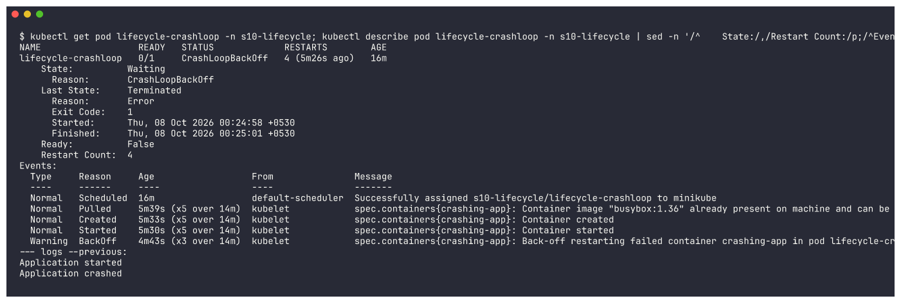

**Observed:** default `restartPolicy: Always`, the app exits 1 after 3 s, kubelet restarts it, it
crashes again... Kubelet waits longer each time (10 s, 20 s, 40 s ... up to 5 min) - that waiting
state is `CrashLoopBackOff`. `kubectl logs --previous` shows the logs of the crashed attempt - the
first thing to check for this error.

### 06 - ImagePullBackOff
```bash
kubectl get pod lifecycle-image-error -n s10-lifecycle
kubectl describe pod lifecycle-image-error -n s10-lifecycle
```
```
lifecycle-image-error   0/1     ImagePullBackOff   0          16m
    Image:          jakwehrgkaejw:kahsdfgkhj
    State:          Waiting
      Reason:       ImagePullBackOff
Events:
  Normal   Pulling    5m28s (x4 over 14m)  kubelet  Pulling image "jakwehrgkaejw:kahsdfgkhj"
  Warning  Failed     5m25s (x4 over 14m)  kubelet  Failed to pull image "jakwehrgkaejw:kahsdfgkhj": ... pull access denied,
                                                    repository does not exist or may require authorization
  Warning  Failed     5m24s (x4 over 14m)  kubelet  Error: ErrImagePull
  Normal   BackOff    4m6s (x3 over 14m)   kubelet  Back-off pulling image "jakwehrgkaejw:kahsdfgkhj"
  Warning  Failed     4m6s (x3 over 14m)   kubelet  Error: ImagePullBackOff
```
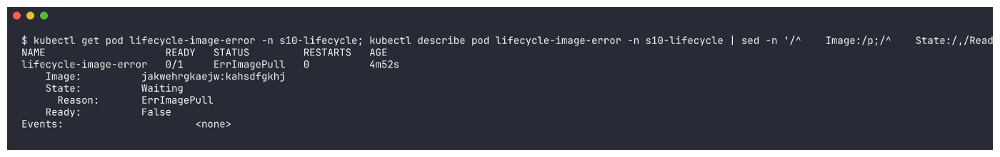
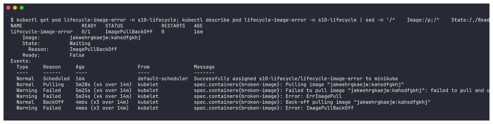

**Observed:** the image does not exist -> `ErrImagePull` on each attempt, and between attempts the
kubelet backs off -> `ImagePullBackOff`. The container never starts, so there are no logs; the
reason is only in the Events. Fix: correct image name/tag or add `imagePullSecrets` for private registries.

### 07 - Readiness probe
```bash
kubectl get pod lifecycle-readiness -n s10-lifecycle
kubectl describe pod lifecycle-readiness -n s10-lifecycle
```
```
    State:          Running
    Ready:          True
    Readiness:      http-get http://:80/ delay=5s timeout=1s period=5s successThreshold=1 failureThreshold=3
Conditions:
  Ready                       True
  ContainersReady             True
```
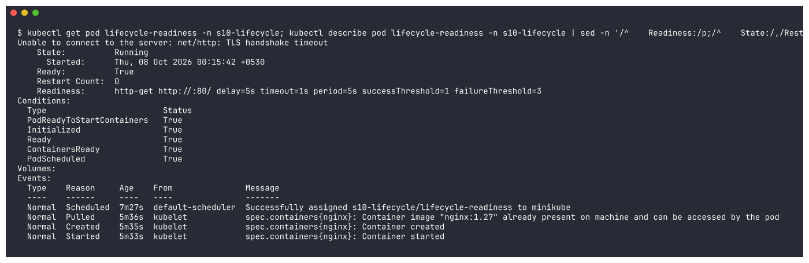

(The first `kubectl get` in that capture failed with `TLS handshake timeout` - the API server was
overloaded at that instant; the `describe` right after it worked.)

**Observed:** the container is `Running` immediately, but READY stays `0/1` until the HTTP GET on
port 80 succeeds (first check after 5 s). In the 3.5-minute overview above, readiness was already
`1/1`. Only Ready Pods are added to Service endpoints, so a readiness probe stops traffic from
reaching a Pod that is not ready yet (or temporarily unhealthy) - without restarting it.

### 08 - Liveness probe
```bash
kubectl get pod lifecycle-liveness -n s10-lifecycle
kubectl describe pod lifecycle-liveness -n s10-lifecycle
kubectl logs lifecycle-liveness -n s10-lifecycle --previous
```
```
lifecycle-liveness   1/1     Running   2 (7m38s ago)   16m
    Last State:     Terminated
      Reason:       Completed
    Restart Count:  2
    Liveness:       exec [sh -c test -f /tmp/healthy] delay=5s timeout=1s period=5s successThreshold=1 failureThreshold=2
Events:
  Warning  Unhealthy  5m12s (x4 over 14m)  kubelet  Liveness probe failed:
  Normal   Killing    4m11s (x2 over 14m)  kubelet  Container app failed liveness probe, will be restarted
--- logs --previous:
App started
Health file removed
```
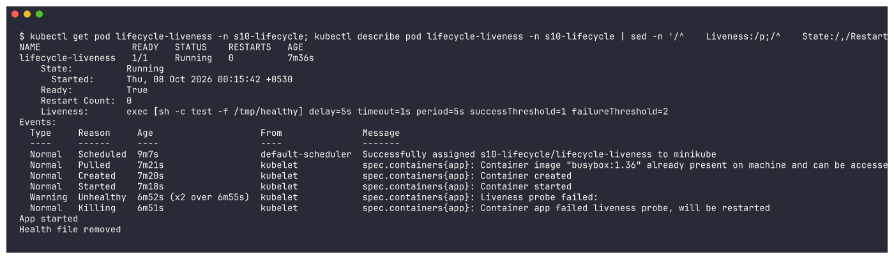
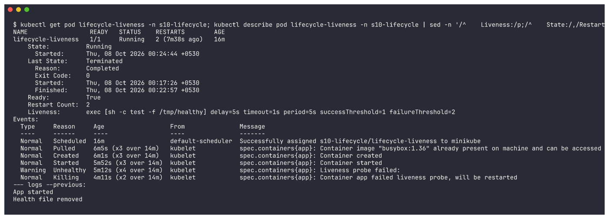

**Observed:** the app creates `/tmp/healthy`, deletes it after 20 s and keeps running (a "hung"
app). The liveness probe (`test -f /tmp/healthy`) fails twice -> kubelet **kills and restarts** the
container (Restart Count goes up). Difference to readiness: liveness *restarts*, readiness only *removes from traffic*.

### 09 - Startup probe
```bash
kubectl get pod lifecycle-startup -n s10-lifecycle
kubectl describe pod lifecycle-startup -n s10-lifecycle
kubectl logs lifecycle-startup -n s10-lifecycle
```
```
lifecycle-startup   0/1     Running   0          10m
    Startup:        exec [sh -c test -f /tmp/started] delay=0s timeout=1s period=5s successThreshold=1 failureThreshold=10
  Warning  Unhealthy  7m44s (x6 over 8m11s)  kubelet  Startup probe failed:
Application starting...
Application started
```
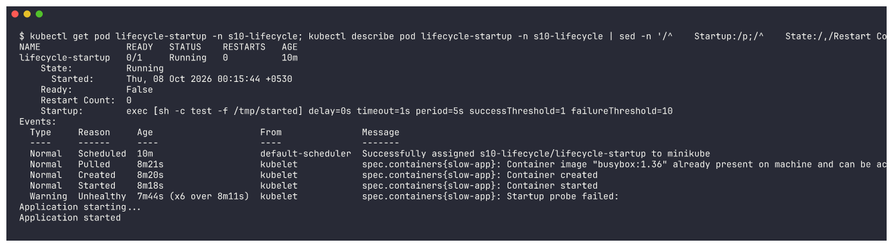

Later:
```
lifecycle-startup   1/1     Running   1 (9m10s ago)   16m
    State:          Running
    Ready:          True
    Restart Count:  1
```
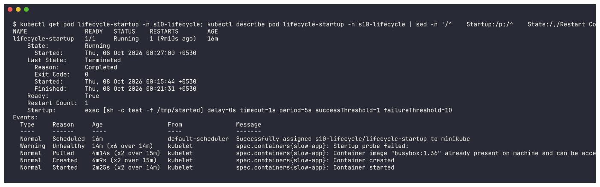

**Observed:** the app needs 30 s before `/tmp/started` exists. The startup probe allows up to
10 x 5 s = 50 s; while it is failing (`Startup probe failed` x6) the Pod is not Ready and liveness /
readiness probes are not run yet. Once it succeeds the Pod becomes `1/1`. The startup probe
protects slow-starting apps from being killed by the liveness probe. On my overloaded node the
container was additionally restarted once (the kubelet was briefly NotReady around 00:23), but it
came back and passed the startup probe.

### 10 - Init container
```bash
kubectl get pod lifecycle-init -n s10-lifecycle
kubectl describe pod lifecycle-init -n s10-lifecycle
kubectl logs lifecycle-init -c setup -n s10-lifecycle
```
```
lifecycle-init   1/1     Running   0          10m
Init Containers:
  setup:
    State:          Terminated
      Reason:       Completed
      Exit Code:    0
      Started:      Thu, 08 Oct 2026 00:15:47 +0530
      Finished:     Thu, 08 Oct 2026 00:15:57 +0530
Events:
  Normal  Started    8m39s  kubelet  spec.initContainers{setup}: Container started
  Normal  Pulled     8m28s  kubelet  spec.containers{app}: Container image "nginx:1.27" already present ...
  Normal  Started    8m22s  kubelet  spec.containers{app}: Container started
--- init container logs:
Init container running
Init complete
```
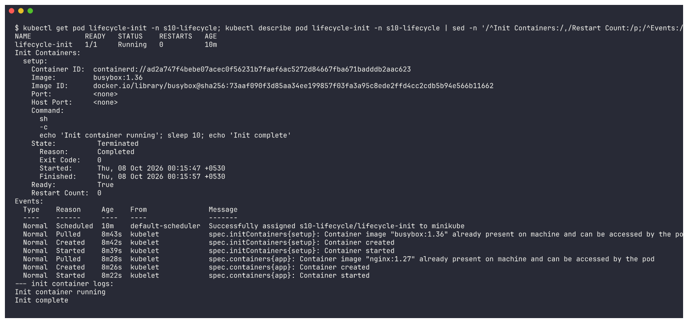

**Observed:** while the init container runs, STATUS is `Init:0/1`; the events and timestamps show
the main nginx container was only started after the init container had finished successfully
(it ran 00:15:47 -> 00:15:57). Init containers run
**in order, to completion**, before app containers - used for migrations, waiting for dependencies, config generation.

### 11 - Multi-container Pod
```bash
kubectl get pod lifecycle-multi-container -n s10-lifecycle
kubectl get pod lifecycle-multi-container -n s10-lifecycle -o jsonpath='{range .status.containerStatuses[*]}...{end}'
kubectl logs lifecycle-multi-container -c sidecar -n s10-lifecycle --tail=3
kubectl logs lifecycle-multi-container -c app -n s10-lifecycle --tail=2
```
```
lifecycle-multi-container   2/2     Running   0          10m
app ready=true {"running":{"startedAt":"2026-10-07T18:45:47Z"}}
sidecar ready=true {"running":{"startedAt":"2026-10-07T18:45:52Z"}}
--- logs -c sidecar:
Sidecar is running
Sidecar is running
--- logs -c app:
2026/10/07 18:45:47 [notice] 1#1: start worker process 36
```
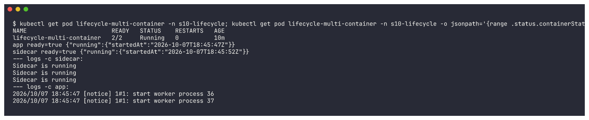

**Observed:** READY `2/2` = two containers in one Pod (same IP, same network namespace, can share
volumes). Each has its own state and logs, selected with `-c <container>`. Typical use: sidecars
(log shippers, proxies).

### 12 - Graceful termination
```bash
kubectl apply -f pod-lifecycle/12-termination.yaml -n s10-lifecycle
kubectl get pod lifecycle-termination -n s10-lifecycle
kubectl get pod lifecycle-termination -n s10-lifecycle -o jsonpath='terminationGracePeriodSeconds={.spec.terminationGracePeriodSeconds}'
```
```
lifecycle-termination   1/1     Running   0          6m9s
terminationGracePeriodSeconds=20
Application running
```
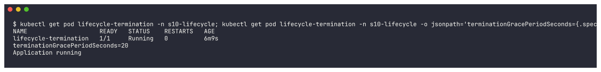

First delete attempt - my script had a bug (the variable for the log file was not exported), so
the container logs were not captured; the delete itself took over 7 minutes on the overloaded node:
```
delete started : 00:31:11
pod "lifecycle-termination" deleted from s10-lifecycle namespace
delete finished: 00:38:48
cat: /term-logs.txt: No such file or directory
```
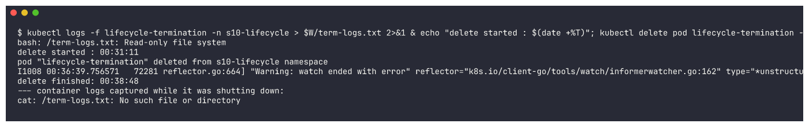

I cleaned up the other lifecycle Pods and repeated it, this time following the logs during the delete:
```bash
kubectl delete pod lifecycle-running lifecycle-pending ... lifecycle-multi-container -n s10-lifecycle --wait=false
kubectl apply -f pod-lifecycle/12-termination.yaml -n s10-lifecycle
kubectl logs -f lifecycle-termination -n s10-lifecycle > $W/term-logs.txt &
kubectl delete pod lifecycle-termination -n s10-lifecycle
cat $W/term-logs.txt
```
```
delete started : 00:46:17
pod "lifecycle-termination" deleted from s10-lifecycle namespace
delete finished: 00:48:39
--- container logs captured (kubectl logs -f) while it was shutting down:
Application running
SIGTERM received; cleaning up...
Cleanup complete
```
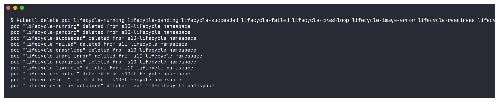
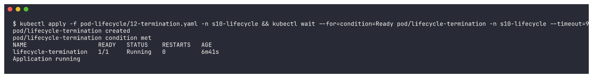
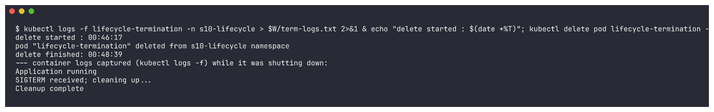

**Observed:** on `kubectl delete` the Pod goes to `Terminating`, the kubelet sends **SIGTERM**
to the container; the app's `trap` caught it, ran a 10-second cleanup and exited 0 ("Cleanup
complete"). Kubernetes waits up to `terminationGracePeriodSeconds` (20 s here) and only sends
**SIGKILL** if the process is still alive after that. Apps must handle SIGTERM to finish in-flight
work. (The whole delete took ~2 min instead of ~10 s only because the node was overloaded.)

### Pod lifecycle summary

```
           kubectl apply
                |
             Pending ---- cannot be scheduled (02: Insufficient memory) -> stays Pending
                |  scheduled, image pulled (06: bad image -> ErrImagePull / ImagePullBackOff)
                |  init containers run to completion (10: Init:0/1 -> PodInitializing)
                v
             Running ---- startup probe (09) -> readiness probe (07: Ready / NotReady)
                |          liveness probe fails (08) -> container restarted
                |          container keeps crashing (05) -> CrashLoopBackOff
                v
   exit 0 -> Succeeded (03)      exit != 0 -> Failed (04)     (restartPolicy: Never)
                |
   kubectl delete -> Terminating -> SIGTERM -> grace period -> SIGKILL (12)
```

---

## Part C - Troubleshooting drills ([`troubleshooting/`](troubleshooting/))

### Drill 1: broken image during a rolling update ([`broken-image.yaml`](troubleshooting/broken-image.yaml))

Baseline: a healthy 3-replica Deployment ([`backend-good.yaml`](troubleshooting/backend-good.yaml)).
```bash
kubectl apply -f troubleshooting/backend-good.yaml -n s10-troubleshoot
kubectl get pods -n s10-troubleshoot -L version
```
```
yatri-backend-78f5d8dfd6-8jscv   1/1     Running   0          6m58s   v1
yatri-backend-78f5d8dfd6-h5n4j   1/1     Running   0          6m55s   v1
yatri-backend-78f5d8dfd6-ppkkh   1/1     Running   0          6m54s   v1
```
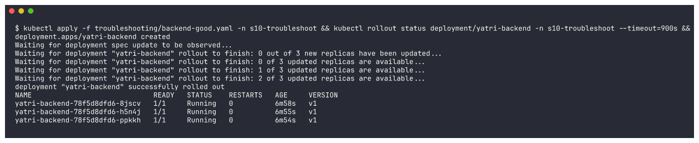

**Problem:** apply the version that points to an image tag that does not exist.
```bash
kubectl apply -f troubleshooting/broken-image.yaml -n s10-troubleshoot
kubectl rollout status deployment/yatri-backend -n s10-troubleshoot --timeout=90s
kubectl get deploy,rs -n s10-troubleshoot
kubectl get pods -n s10-troubleshoot -L version
```
```
Waiting for deployment "yatri-backend" rollout to finish: 1 out of 3 new replicas have been updated...
error: timed out waiting for the condition
deployment.apps/yatri-backend   3/3     1            3           8m36s
replicaset.apps/yatri-backend-77dbb657cd   1         1         0       91s    <- new, 0 ready
replicaset.apps/yatri-backend-78f5d8dfd6   3         3         3       8m36s  <- old, untouched
yatri-backend-77dbb657cd-8xhlz   0/1     ErrImagePull   0          90s     broken-v3
yatri-backend-78f5d8dfd6-8jscv   1/1     Running        0          8m33s   v1
yatri-backend-78f5d8dfd6-h5n4j   1/1     Running        0          8m30s   v1
yatri-backend-78f5d8dfd6-ppkkh   1/1     Running        0          8m29s   v1
```
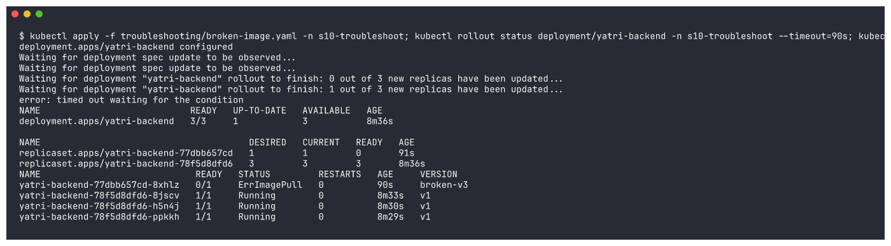

**Diagnose:**
```bash
kubectl describe pod <broken-pod> -n s10-troubleshoot
```
```
    Image:          yatri-backend:non-existent-tag-v999
    State:          Waiting
      Reason:       ErrImagePull
  Warning  Failed     52s (x2 over 78s)  kubelet  Failed to pull image "yatri-backend:non-existent-tag-v999": ... failed to resolve reference ...
  Warning  Failed     52s (x2 over 78s)  kubelet  Error: ErrImagePull
  Normal   BackOff    39s (x2 over 77s)  kubelet  Back-off pulling image "yatri-backend:non-existent-tag-v999"
  Warning  Failed     39s (x2 over 77s)  kubelet  Error: ImagePullBackOff
```
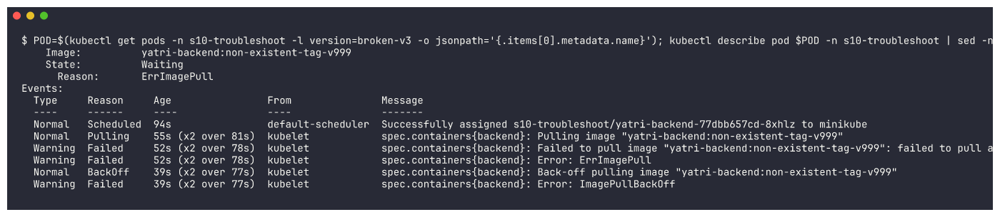

**Root cause:** wrong image reference (repository/tag does not exist). Because of
`maxSurge: 1, maxUnavailable: 0`, only one surge Pod was created; it can never become ready, so the
rollout stalls and the 3 old Pods keep serving - **no outage**.

**Fix:**
```bash
kubectl rollout undo deployment/yatri-backend -n s10-troubleshoot
kubectl get pods -n s10-troubleshoot -L version
kubectl rollout history deployment/yatri-backend -n s10-troubleshoot
```
```
deployment.apps/yatri-backend rolled back
deployment "yatri-backend" successfully rolled out
yatri-backend-77dbb657cd-8xhlz   0/1     Terminating   0          102s    broken-v3
yatri-backend-78f5d8dfd6-8jscv   1/1     Running       0          8m45s   v1
yatri-backend-78f5d8dfd6-h5n4j   1/1     Running       0          8m42s   v1
yatri-backend-78f5d8dfd6-ppkkh   1/1     Running       0          8m41s   v1
```
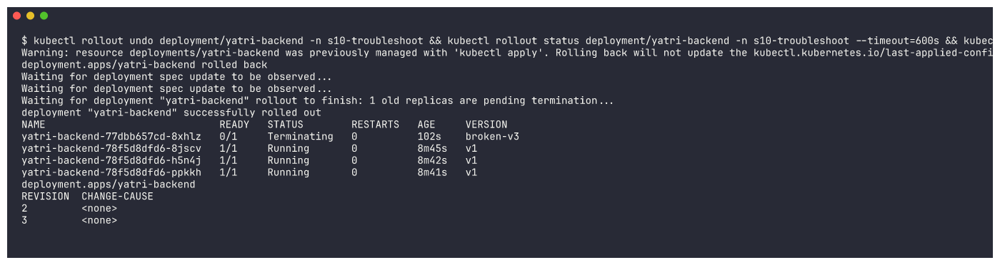

### Drill 2: selector mismatch ([`selector-mismatch.yaml`](troubleshooting/selector-mismatch.yaml))

**Problem:**
```bash
kubectl apply -f troubleshooting/selector-mismatch.yaml -n s10-troubleshoot
```
```
The Deployment "selector-error-demo" is invalid: spec.template.metadata.labels: Invalid value: {"app":"wrong-app-name"}: `selector` does not match template `labels`
```
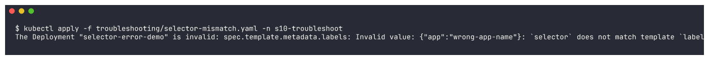

**Root cause:** `spec.selector.matchLabels` is `app: correct-app-name`, but the Pod template is
labelled `app: wrong-app-name`. A Deployment must be able to select the Pods it creates, so the API
server rejects the object before anything is created (no Pods, no events - the error is in the
`kubectl apply` output itself).

**Fix:** make the template label match the selector ([`selector-fixed.yaml`](troubleshooting/selector-fixed.yaml)):
```bash
diff troubleshooting/selector-mismatch.yaml troubleshooting/selector-fixed.yaml
kubectl apply -f troubleshooting/selector-fixed.yaml -n s10-troubleshoot
kubectl get deploy selector-error-demo -n s10-troubleshoot -o wide
```
```
<         app: wrong-app-name
---
>         app: correct-app-name
deployment.apps/selector-error-demo created
deployment "selector-error-demo" successfully rolled out
NAME                  READY   UP-TO-DATE   AVAILABLE   AGE   CONTAINERS   IMAGES              SELECTOR
selector-error-demo   1/1     1            1           62s   nginx        nginx:1.25-alpine   app=correct-app-name
```
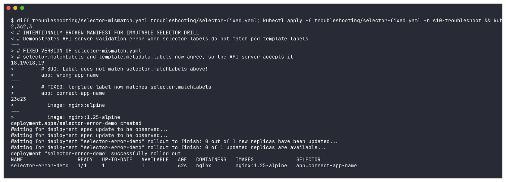

(I also pinned the image to `nginx:1.25-alpine` instead of the floating `nginx:alpine` tag.)

```bash
kubectl delete namespace s10-troubleshoot s10-core --wait=false
```
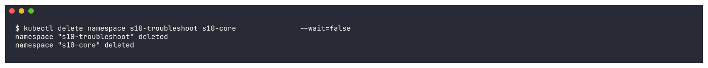

---

## Note about my environment

The minikube cluster (6 CPUs / 6.5 GB) was shared with other workloads while I did this homework,
and during Task 2 it was badly overloaded (load average > 100 inside the node, swap almost full,
the kubelet briefly NotReady). That is why some steps show long Pod start times, a timed-out
`rollout status`, a `TLS handshake timeout` and one `curl` DNS failure. I kept those outputs
as they happened and re-checked the state afterwards instead of hiding them. For the strategies
run after that point (blue-green, canary) I raised the readiness probe `timeoutSeconds` to 5 s.

## Key takeaways

- **Pod** = smallest unit, not self-healing. **ReplicaSet** keeps N Pods alive. **Deployment**
  manages ReplicaSets and adds rolling updates + rollback history.
- **Rolling update** (default): zero/low downtime, mixed versions briefly; tune `maxSurge` /
  `maxUnavailable`; add readiness probes and a `preStop` hook for truly zero failed requests.
- **Blue-green**: two full environments, switch the Service selector; instant cut-over and
  rollback, double the resources.
- **Canary**: small share of real traffic on the new version first; with plain Services the share
  is the replica ratio.
- **Recreate**: all old Pods down, then new Pods up - simple, but real downtime.
- **Pod lifecycle**: phase (Pending/Running/Succeeded/Failed) + container states/reasons
  (CrashLoopBackOff, ImagePullBackOff, ...); probes decide readiness (traffic), liveness
  (restart) and startup (grace for slow starts); `kubectl describe` events and
  `kubectl logs --previous` explain almost every failure.
