# Task 1: Kubernetes Volumes

Notes on how Kubernetes stores data, with a hands-on example for every volume type.
Everything below was run on a local **minikube** cluster (Kubernetes v1.37, containerd, default
`standard` StorageClass) in the namespace `s13-volumes`. Each command has its real output and a
screenshot under it.

## Files in this folder

| File | What it creates |
|---|---|
| `00-namespace.yaml` | Namespace `s13-volumes` |
| `01-emptydir-pod.yaml` | Pod with **2 containers** sharing one `emptyDir` |
| `02-hostpath-pod.yaml` | Pod mounting `/tmp/s13-hostpath-data` from the node (`hostPath`) |
| `03-pv.yaml` | Static **PersistentVolume** `s13-static-pv` (1Gi, `Retain`, class `manual`) |
| `04-pvc.yaml` | **PersistentVolumeClaim** `static-pvc` (500Mi, class `manual`) |
| `05-pvc-pod.yaml` | Pod that uses `static-pvc` |
| `06-dynamic-pvc.yaml` | PVC `dynamic-pvc` using **StorageClass** `standard` (dynamic provisioning) |
| `07-dynamic-deployment.yaml` | Deployment that mounts `dynamic-pvc` at `/data` |

---

## Why volumes?

A container's filesystem is **ephemeral**: when the container restarts, anything written inside it is
gone. Volumes give Pods storage that outlives a single container, and (with PersistentVolumes)
storage that outlives the Pod itself.

| Type | Lives as long as | Shared between | Typical use |
|---|---|---|---|
| `emptyDir` | the **Pod** | containers in the same Pod | scratch space, cache, sidecar hand-off |
| `hostPath` | the **node** directory | Pods on the same node | node agents, log collectors (avoid for apps) |
| PV + PVC | the **PersistentVolume** (independent of Pods) | Pods that mount the claim | databases, uploads, any app state |
| StorageClass | — (a *template* for PVs) | — | creating PVs on demand (dynamic provisioning) |

---

## 1. emptyDir

`emptyDir` is created empty when the Pod is scheduled and **deleted when the Pod is deleted**.
All containers in the Pod can mount it, which makes it the standard way for a sidecar to hand files to
the main container.

In `01-emptydir-pod.yaml`, the `writer` container (busybox) appends a line to `/shared/index.html` every
5 seconds, and the `web` container (nginx) serves the **same volume** as its web root:

```yaml
  containers:
    - name: writer
      image: busybox:1.36
      command: ["sh", "-c", "while true; do echo \"written by writer at $(date)\" >> /shared/index.html; sleep 5; done"]
      volumeMounts:
        - name: shared-data
          mountPath: /shared
    - name: web
      image: nginx:1.27
      volumeMounts:
        - name: shared-data
          mountPath: /usr/share/nginx/html
  volumes:
    - name: shared-data
      emptyDir: {}
```

```bash
kubectl apply -f 00-namespace.yaml -f 01-emptydir-pod.yaml
```
```text
namespace/s13-volumes created
pod/emptydir-demo created
```
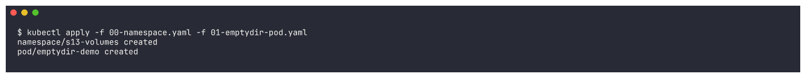

```bash
kubectl wait --for=condition=Ready pod/emptydir-demo -n s13-volumes --timeout=180s && kubectl get pod emptydir-demo -n s13-volumes -o wide
```
```text
pod/emptydir-demo condition met
NAME            READY   STATUS    RESTARTS   AGE   IP            NODE       NOMINATED NODE   READINESS GATES
emptydir-demo   2/2     Running   0          14s   10.244.0.16   minikube   <none>           <none>
```
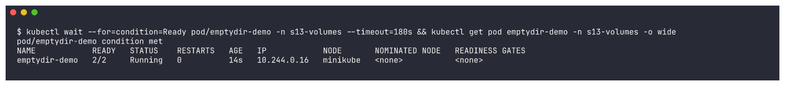

**Reading the writer's file from the *other* container (`web`):**
```bash
kubectl exec emptydir-demo -n s13-volumes -c web -- cat /usr/share/nginx/html/index.html
```
```text
written by writer at Wed Oct  7 17:06:32 UTC 2026
written by writer at Wed Oct  7 17:06:38 UTC 2026
written by writer at Wed Oct  7 17:06:43 UTC 2026
...
```
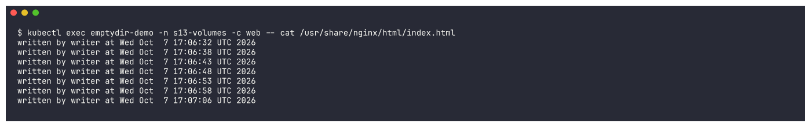

nginx serves the file the writer produced:
```bash
kubectl exec emptydir-demo -n s13-volumes -c web -- curl -s localhost
```
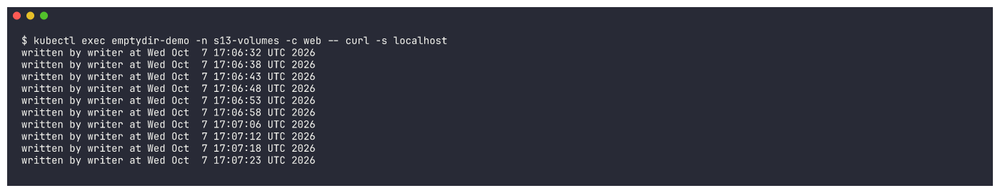

Both containers see the same file, at different mount paths:
```bash
kubectl exec emptydir-demo -n s13-volumes -c writer -- ls -l /shared
kubectl exec emptydir-demo -n s13-volumes -c web -- ls -l /usr/share/nginx/html
kubectl describe pod emptydir-demo -n s13-volumes | grep -A4 "^Volumes:"
```
```text
-rw-r--r--    1 root     root           550 Oct  7 17:07 index.html
-rw-r--r-- 1 root root 600 Oct  7 17:07 index.html
Volumes:
  shared-data:
    Type:       EmptyDir (a temporary directory that shares a pod's lifetime)
```
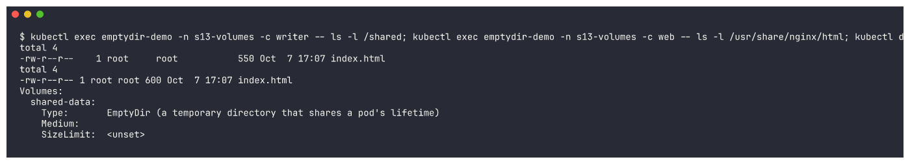

**emptyDir is lost when the Pod is deleted.** After deleting and recreating the Pod, the file starts
again from scratch (only new timestamps, the 17:06-17:07 lines are gone):
```bash
kubectl delete pod emptydir-demo -n s13-volumes && kubectl apply -f 01-emptydir-pod.yaml && \
kubectl wait --for=condition=Ready pod/emptydir-demo -n s13-volumes --timeout=120s && sleep 3 && \
kubectl exec emptydir-demo -n s13-volumes -c web -- cat /usr/share/nginx/html/index.html
```
```text
pod "emptydir-demo" deleted from s13-volumes namespace
pod/emptydir-demo created
pod/emptydir-demo condition met
written by writer at Wed Oct  7 17:09:01 UTC 2026
written by writer at Wed Oct  7 17:09:06 UTC 2026
written by writer at Wed Oct  7 17:09:11 UTC 2026
```
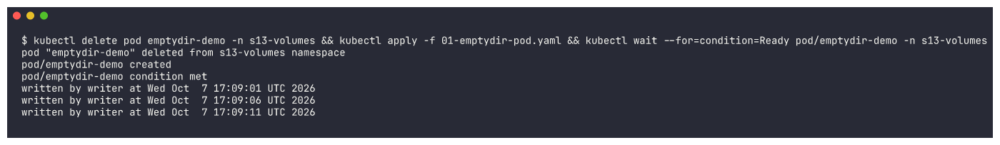

---

## 2. hostPath

`hostPath` mounts a file or directory **from the node's filesystem** into the Pod. Data survives Pod
deletion, but it is tied to that one node: if the Pod moves to another node it sees a different (empty)
directory. It also gives the Pod access to the host, so it is a security risk and is mostly used by
system agents. On minikube the "node" is the minikube container.

```yaml
  volumes:
    - name: host-storage
      hostPath:
        path: /tmp/s13-hostpath-data
        type: DirectoryOrCreate   # create the directory on the node if missing
```

```bash
kubectl apply -f 02-hostpath-pod.yaml && kubectl wait --for=condition=Ready pod/hostpath-demo -n s13-volumes --timeout=120s && kubectl get pod hostpath-demo -n s13-volumes -o wide
```
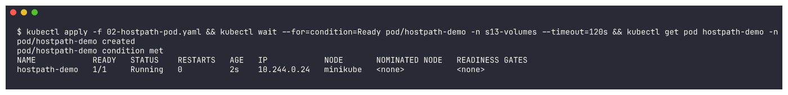

Write a file from inside the Pod:
```bash
kubectl exec hostpath-demo -n s13-volumes -- sh -c "echo hello-from-hostpath-pod > /data/hello.txt && cat /data/hello.txt"
```
```text
hello-from-hostpath-pod
```
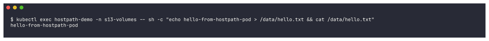

The same file is visible **directly on the node**:
```bash
minikube ssh "ls -l /tmp/s13-hostpath-data && cat /tmp/s13-hostpath-data/hello.txt"
```
```text
total 4
-rw-r--r-- 1 root root 24 Oct  7 17:09 hello.txt
hello-from-hostpath-pod
```
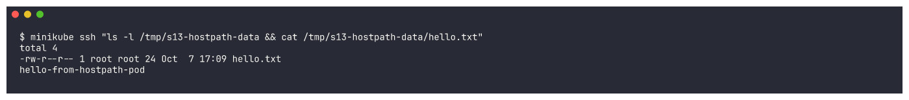

Delete the Pod, recreate it, and the file is still there (it lives on the node, not in the Pod):
```bash
kubectl delete pod hostpath-demo -n s13-volumes && kubectl apply -f 02-hostpath-pod.yaml && \
kubectl wait --for=condition=Ready pod/hostpath-demo -n s13-volumes --timeout=120s && \
kubectl exec hostpath-demo -n s13-volumes -- cat /data/hello.txt
```
```text
pod "hostpath-demo" deleted from s13-volumes namespace
pod/hostpath-demo created
pod/hostpath-demo condition met
hello-from-hostpath-pod
```
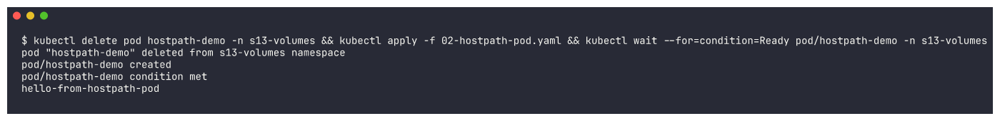

---

## 3. PersistentVolume (PV) and PersistentVolumeClaim (PVC) - static provisioning

* A **PersistentVolume** is a piece of storage in the cluster, created by an admin (or by a
  StorageClass). It is **cluster-scoped** and has a capacity, access modes and a **reclaim policy**.
* A **PersistentVolumeClaim** is a *request* for storage made by a user/app in a namespace
  ("I need 500Mi, ReadWriteOnce"). Kubernetes **binds** the claim to a matching PV.
* Pods never reference the PV directly; they reference the **claim**.

Access modes: `ReadWriteOnce` (RWO, one node read-write), `ReadOnlyMany` (ROX), `ReadWriteMany` (RWX),
`ReadWriteOncePod` (RWOP, one Pod).
Reclaim policies: `Retain` (keep data after the claim is deleted; admin cleans up) and `Delete`
(delete the underlying storage together with the PV).

> **Gotcha I hit while planning this:** minikube has a *default* StorageClass. A PVC without
> `storageClassName` gets `standard` automatically and a **new** PV is provisioned instead of binding
> to my hand-made PV. So both `03-pv.yaml` and `04-pvc.yaml` use `storageClassName: manual`.

```bash
kubectl apply -f 03-pv.yaml && kubectl get pv s13-static-pv
```
```text
persistentvolume/s13-static-pv created
NAME            CAPACITY   ACCESS MODES   RECLAIM POLICY   STATUS    CLAIM   STORAGECLASS   ...
s13-static-pv   1Gi        RWO            Retain           Pending           manual         ...
```
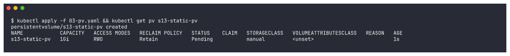

(The PV shows `Pending` for a moment right after creation, then becomes `Available`.)

Create the claim - it binds to the PV within seconds. Note the PVC asked for 500Mi but got the whole
1Gi PV (a claim binds to one whole PV that is *at least* as large as the request):
```bash
kubectl apply -f 04-pvc.yaml && sleep 3 && kubectl get pv s13-static-pv && kubectl get pvc static-pvc -n s13-volumes
```
```text
persistentvolumeclaim/static-pvc created
NAME            CAPACITY   ACCESS MODES   RECLAIM POLICY   STATUS   CLAIM                    STORAGECLASS
s13-static-pv   1Gi        RWO            Retain           Bound    s13-volumes/static-pvc   manual
NAME         STATUS   VOLUME          CAPACITY   ACCESS MODES   STORAGECLASS
static-pvc   Bound    s13-static-pv   1Gi        RWO            manual
```
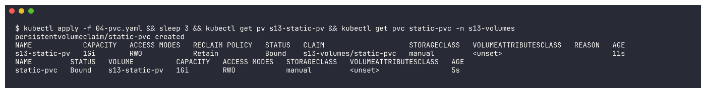

```bash
kubectl describe pvc static-pvc -n s13-volumes
```
```text
Status:        Bound
Volume:        s13-static-pv
Annotations:   pv.kubernetes.io/bind-completed: yes
Finalizers:    [kubernetes.io/pvc-protection]
Capacity:      1Gi
Access Modes:  RWO
Used By:       <none>
```
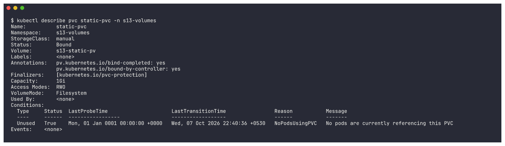

Mount the claim in a Pod and write data:
```bash
kubectl apply -f 05-pvc-pod.yaml && kubectl wait --for=condition=Ready pod/static-storage-demo -n s13-volumes --timeout=120s && \
kubectl exec static-storage-demo -n s13-volumes -- sh -c "echo student-data-on-static-pv > /data/student.txt && cat /data/student.txt"
```
```text
pod/static-storage-demo created
pod/static-storage-demo condition met
student-data-on-static-pv
```
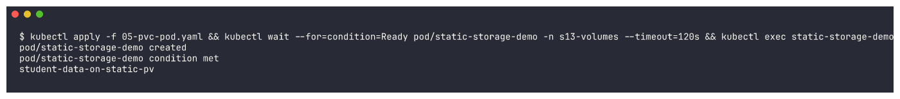

**Data survives Pod deletion:**
```bash
kubectl delete pod static-storage-demo -n s13-volumes && kubectl apply -f 05-pvc-pod.yaml && \
kubectl wait --for=condition=Ready pod/static-storage-demo -n s13-volumes --timeout=120s && \
kubectl exec static-storage-demo -n s13-volumes -- cat /data/student.txt
```
```text
pod "static-storage-demo" deleted from s13-volumes namespace
pod/static-storage-demo created
pod/static-storage-demo condition met
student-data-on-static-pv
```
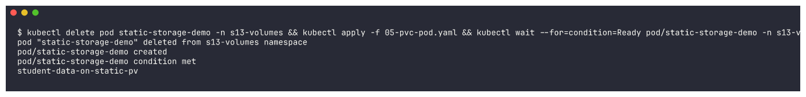

---

## 4. StorageClass

A **StorageClass** describes *how* to create storage: which **provisioner** (cloud disk, NFS, local
path...), parameters, reclaim policy and binding mode. Admins define classes such as `fast-ssd` or
`standard`; users just name the class in their PVC.

```bash
kubectl get storageclass && kubectl describe storageclass standard
```
```text
NAME                 PROVISIONER                RECLAIMPOLICY   VOLUMEBINDINGMODE   ALLOWVOLUMEEXPANSION   AGE
standard (default)   k8s.io/minikube-hostpath   Delete          Immediate           false                  17m
Name:            standard
IsDefaultClass:  Yes
Provisioner:           k8s.io/minikube-hostpath
ReclaimPolicy:         Delete
VolumeBindingMode:     Immediate
```
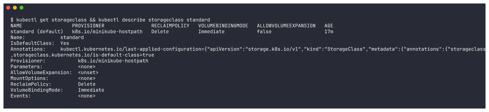

* `(default)` - PVCs that don't specify a class use this one.
* `Provisioner: k8s.io/minikube-hostpath` - minikube's provisioner creates a directory on the node per PV
  (on AWS it would be `ebs.csi.aws.com` creating an EBS volume).
* `ReclaimPolicy: Delete` - dynamically created PVs are deleted when their PVC is deleted.
* `VolumeBindingMode: Immediate` - provision as soon as the PVC is created (`WaitForFirstConsumer`
  would wait until a Pod uses it, so the volume is created in the right zone).

---

## 5. Dynamic provisioning

With dynamic provisioning **nobody creates a PV by hand**. The PVC names a StorageClass and the
provisioner creates a matching PV automatically.

```yaml
# 06-dynamic-pvc.yaml
spec:
  accessModes: [ReadWriteOnce]
  storageClassName: standard
  resources:
    requests:
      storage: 500Mi
```

```bash
kubectl apply -f 06-dynamic-pvc.yaml && sleep 5 && kubectl get pvc dynamic-pvc -n s13-volumes && kubectl get pv
```
```text
persistentvolumeclaim/dynamic-pvc created
NAME          STATUS    VOLUME   CAPACITY   ACCESS MODES   STORAGECLASS
dynamic-pvc   Pending                                      standard
NAME                                       CAPACITY   ACCESS MODES   RECLAIM POLICY   STATUS   CLAIM                     STORAGECLASS
pvc-a370513e-0f76-495d-9e63-35798a271258   500Mi      RWO            Delete           Bound    s13-volumes/dynamic-pvc   standard
s13-static-pv                              1Gi        RWO            Retain           Bound    s13-volumes/static-pvc    manual
```
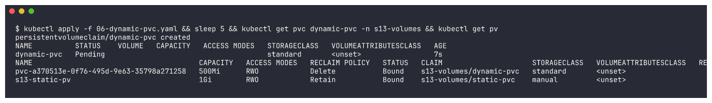

A brand-new PV `pvc-a370513e-...` (exactly 500Mi, policy `Delete`) appeared without me creating it.
The PVC events show the provisioner doing the work:
```bash
kubectl describe pvc dynamic-pvc -n s13-volumes | tail -8
```
```text
Normal  ExternalProvisioning   persistentvolume-controller  Waiting for a volume to be created either by the external provisioner 'k8s.io/minikube-hostpath' ...
Normal  Provisioning           k8s.io/minikube-hostpath_... External provisioner is provisioning volume for claim "s13-volumes/dynamic-pvc"
Normal  ProvisioningSucceeded  k8s.io/minikube-hostpath_... Successfully provisioned volume pvc-a370513e-0f76-495d-9e63-35798a271258
```
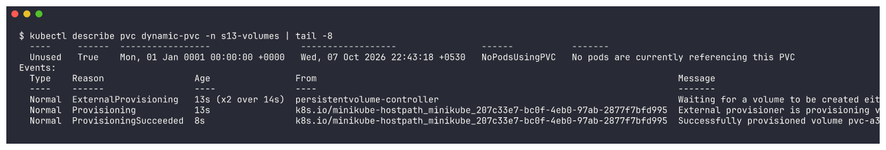

Use it from a Deployment and write some data:
```bash
kubectl apply -f 07-dynamic-deployment.yaml && kubectl rollout status deployment/dynamic-storage-app -n s13-volumes --timeout=120s && \
POD=$(kubectl get pod -n s13-volumes -l app=dynamic-storage-app -o jsonpath="{.items[0].metadata.name}") && echo "pod: $POD" && \
kubectl exec $POD -n s13-volumes -- sh -c "echo order-123-saved-at-$(date +%H:%M:%S) > /data/orders.txt && cat /data/orders.txt"
```
```text
deployment.apps/dynamic-storage-app created
deployment "dynamic-storage-app" successfully rolled out
pod: dynamic-storage-app-7dd7fffb76-s5g2p
order-123-saved-at-22:43:45
```
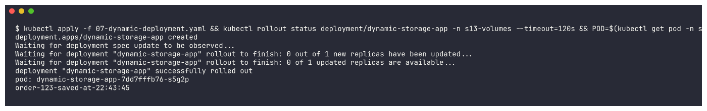

**Delete the Pod - the Deployment creates a new one, and the data is still there:**
```bash
OLD=$(kubectl get pod -n s13-volumes -l app=dynamic-storage-app -o jsonpath="{.items[0].metadata.name}") && \
kubectl delete pod $OLD -n s13-volumes && kubectl rollout status deployment/dynamic-storage-app -n s13-volumes --timeout=120s && \
NEW=$(kubectl get pod -n s13-volumes -l app=dynamic-storage-app --field-selector=status.phase=Running -o jsonpath="{.items[0].metadata.name}") && \
echo "old pod: $OLD  new pod: $NEW" && kubectl exec $NEW -n s13-volumes -- cat /data/orders.txt
```
```text
pod "dynamic-storage-app-7dd7fffb76-s5g2p" deleted from s13-volumes namespace
deployment "dynamic-storage-app" successfully rolled out
old pod: dynamic-storage-app-7dd7fffb76-s5g2p  new pod: dynamic-storage-app-7dd7fffb76-6ptlz
order-123-saved-at-22:43:45
```
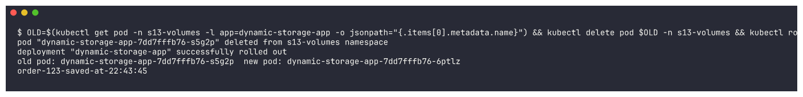

Everything together:
```bash
kubectl get pv && kubectl get pvc,pods -n s13-volumes -o wide
```
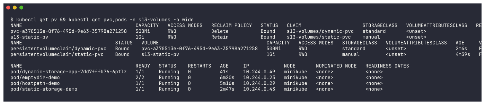

---

## 6. Reclaim policy in action (cleanup)

Deleting the namespace deletes both PVCs. The PVs then behave according to their reclaim policy:
```bash
kubectl delete namespace s13-volumes && sleep 5 && kubectl get pv
```
```text
namespace "s13-volumes" deleted
NAME                                       CAPACITY   ACCESS MODES   RECLAIM POLICY   STATUS     CLAIM
pvc-a370513e-0f76-495d-9e63-35798a271258   500Mi      RWO            Delete           Released   s13-volumes/dynamic-pvc
s13-static-pv                              1Gi        RWO            Retain           Released   s13-volumes/static-pvc
```
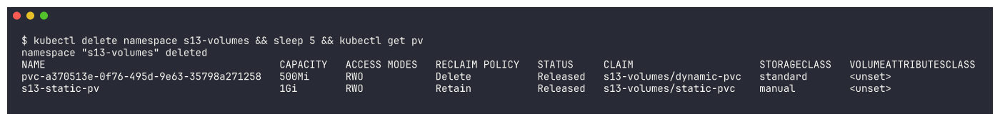

* `s13-static-pv` (**Retain**) stays as `Released`: the data is kept and an admin must clean it up
  manually. It will not be re-bound automatically.
* the dynamic PV (**Delete**) is also `Released` for a moment and is then removed by the provisioner.

The retained PV has to be deleted by hand:
```bash
kubectl delete pv s13-static-pv && kubectl get pv
```
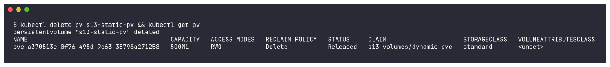

---

## Summary

| Concept | Key point I verified |
|---|---|
| emptyDir | Shared by 2 containers in one Pod; **wiped** when the Pod was recreated |
| hostPath | File visible on the node (`minikube ssh`); survived Pod recreation |
| PersistentVolume | Admin-created, cluster-scoped, `Retain` kept it as `Released` after the claim was gone |
| PersistentVolumeClaim | Bound to the matching PV (same class, enough size); data survived Pod deletion |
| StorageClass | `standard` (default) -> provisioner `k8s.io/minikube-hostpath`, policy `Delete` |
| Dynamic provisioning | PVC alone created PV `pvc-a370513e-...` automatically; data survived Pod replacement |
