# Task 2: HPA Hands-on (Horizontal Pod Autoscaler)

The **HorizontalPodAutoscaler** watches a metric (here: average CPU usage as a % of the Pods' CPU
*request*) and changes the number of replicas of a Deployment to keep it near a target.

```text
desiredReplicas = ceil( currentReplicas x currentUtilization / targetUtilization )
```

e.g. 2 Pods at 190% with a 50% target -> ceil(2 x 190 / 50) = 8 (the HPA limits how fast it grows per
step, so it went 2 -> 4 -> 8 -> 10 below).

Requirements: **metrics-server** running (provides `kubectl top` and the `metrics.k8s.io` API) and
**`resources.requests.cpu`** on the containers (otherwise there is nothing to compute a % against).

## Files

| File | What it is |
|---|---|
| `hpa.yml` | Namespace `s13-hpa-demo` + Deployment `yatri-backend` (CPU request 200m, limit 500m) + Service `yatri-backend-service` + HPA `yatri-backend-hpa` (min 2, max 10, target 50% CPU) |
| `load-generator.yaml` | Deployment of 3 busybox workers that call the Service in a tight loop |
| `load_generator.sh` | `./load_generator.sh start [workers]` / `./load_generator.sh stop` |
| `instructor-original/` | the instructor's `hpa-backend.yaml` and `load_generator.sh` that these are based on |

**Changes from the instructor's files and why:**
* The HPA spec (`yatri-backend-hpa`: min 2, max 10, 50% CPU) is exactly the instructor's `hpa-backend.yaml`.
* The instructor's files only contain the HPA and Service, not the `yatri-backend` app itself. I first tried
  the classic `registry.k8s.io/hpa-example` (php-apache) image, but it is **amd64-only** and the minikube
  node is **arm64** (Apple Silicon) - the Pods hung in `ContainerCreating` forever. So the backend is a tiny
  Python HTTP server on the multi-arch `python:3.11-alpine` image that does a CPU-heavy loop (300k
  `sqrt` calls) per request - the same idea as php-apache.
* The instructor's `load_generator.sh` runs `curl` on the laptop through `kubectl port-forward`. A
  port-forward always goes to **one** Pod, so the load would not spread over the new replicas. My version
  runs the load **inside the cluster** against the Service, so every replica gets traffic.

```yaml
# hpa.yml (HPA part)
apiVersion: autoscaling/v2
kind: HorizontalPodAutoscaler
metadata:
  name: yatri-backend-hpa
  namespace: s13-hpa-demo
spec:
  scaleTargetRef:
    apiVersion: apps/v1
    kind: Deployment
    name: yatri-backend
  minReplicas: 2
  maxReplicas: 10
  metrics:
    - type: Resource
      resource:
        name: cpu
        target:
          type: Utilization
          averageUtilization: 50
```

---

## Step 1 + 2: Deploy the application and configure the HPA

```bash
kubectl apply -f hpa.yml
```
```text
namespace/s13-hpa-demo created
deployment.apps/yatri-backend created
service/yatri-backend-service created
horizontalpodautoscaler.autoscaling/yatri-backend-hpa created
```


```bash
kubectl rollout status deployment/yatri-backend -n s13-hpa-demo --timeout=180s && kubectl get deploy,svc,hpa,pods -n s13-hpa-demo -o wide
```
```text
deployment "yatri-backend" successfully rolled out
NAME                            READY   UP-TO-DATE   AVAILABLE   AGE    CONTAINERS   IMAGES
deployment.apps/yatri-backend   2/2     2            2           110s   backend      python:3.11-alpine

NAME                                                    REFERENCE                  TARGETS              MINPODS   MAXPODS   REPLICAS
horizontalpodautoscaler.autoscaling/yatri-backend-hpa   Deployment/yatri-backend   cpu: <unknown>/50%   2         10        2
```


`<unknown>` right after creation is normal - metrics-server needs a scrape or two before the HPA has data.

## Step 3: Verify the HPA - BEFORE load

```bash
kubectl get hpa -n s13-hpa-demo
```
```text
NAME                REFERENCE                  TARGETS       MINPODS   MAXPODS   REPLICAS   AGE
yatri-backend-hpa   Deployment/yatri-backend   cpu: 5%/50%   2         10        2          3m34s
```


```bash
kubectl top pods -n s13-hpa-demo
```
```text
NAME                             CPU(cores)   MEMORY(bytes)
yatri-backend-68b645bcdb-96drk   10m          11Mi
yatri-backend-68b645bcdb-qlxdc   12m          21Mi
```


```bash
kubectl get pods -n s13-hpa-demo -o wide
```


```bash
kubectl describe hpa yatri-backend-hpa -n s13-hpa-demo
```
```text
Metrics:                                               ( current / target )
  resource cpu on pods  (as a percentage of request):  <unknown> / 50%
Min replicas:                                          2
Max replicas:                                          10
Deployment pods:                                       2 current / 2 desired
Conditions:
  AbleToScale     True    SucceededGetScale        the HPA controller was able to get the target's current scale
  ScalingActive   False   FailedGetResourceMetric  the HPA was unable to compute the replica count: ... no metrics returned from resource metrics API
```


> The describe happened to land in a moment when metrics-server was restarting (see the note on cluster
> health at the end) - `ScalingActive False / FailedGetResourceMetric` is what the HPA reports when it
> has no metrics. A few seconds earlier `kubectl get hpa` showed `5%/50%`.

Check the Service works (one request takes ~0.6s of CPU work):
```bash
kubectl run curl-test -n s13-hpa-demo --rm -i --restart=Never --image=curlimages/curl:8.6.0 -- sh -c "time curl -s http://yatri-backend-service"
```
```text
OK!
real	0m 0.64s
```


## Step 4 + 5: Deploy the load generator / increase load

```bash
./load_generator.sh start 3
```
```text
Starting 3 load-generator workers against http://yatri-backend-service ...
deployment.apps/load-generator created
deployment.apps/load-generator scaled
Load active. Watch it with: kubectl get hpa -n s13-hpa-demo -w
```


```bash
kubectl get pods -n s13-hpa-demo -l app=load-generator
```
```text
NAME                            READY   STATUS    RESTARTS   AGE
load-generator-df8dd555-9gw7d   1/1     Running   0          24s
load-generator-df8dd555-hb9sr   1/1     Running   0          25s
load-generator-df8dd555-kmg2s   1/1     Running   0          24s
```


## Step 6 + 7: Observe CPU utilization and Pod scaling - DURING load

Each snapshot ran:
```bash
date +%T; kubectl get hpa -n s13-hpa-demo; kubectl top pods -n s13-hpa-demo -l app=yatri-backend; kubectl get pods -n s13-hpa-demo -l app=yatri-backend
```

**23:17 - 23:19 (first 3 minutes):** metrics-server was restarting, so the HPA showed `<unknown>` and
could not act yet (snapshots `10-during-1` .. `10-during-4`):
```text
23:17:12
yatri-backend-hpa   Deployment/yatri-backend   cpu: <unknown>/50%   2         10        2          6m30s
error: Metrics not available for pod s13-hpa-demo/yatri-backend-68b645bcdb-96drk, age: 6m34.13559s
```


**23:23:04 - metrics are back: 190% CPU, scaling starts.** Each Pod is burning ~380m against a 200m
request; the HPA has already ordered 2 more Pods:
```text
23:23:04
NAME                REFERENCE                  TARGETS         MINPODS   MAXPODS   REPLICAS   AGE
yatri-backend-hpa   Deployment/yatri-backend   cpu: 190%/50%   2         10        2          12m

NAME                             CPU(cores)   MEMORY(bytes)
yatri-backend-68b645bcdb-96drk   378m         11Mi
yatri-backend-68b645bcdb-qlxdc   384m         15Mi

NAME                             READY   STATUS              RESTARTS   AGE
yatri-backend-68b645bcdb-6g75p   0/1     Running             0          13s
yatri-backend-68b645bcdb-96drk   1/1     Running             0          12m
yatri-backend-68b645bcdb-d5bqj   0/1     ContainerCreating   0          13s
yatri-backend-68b645bcdb-qlxdc   1/1     Running             0          12m
```


**23:23:29 - 4 replicas, and 4 more Pods being created (-> 8):**
```text
yatri-backend-hpa   Deployment/yatri-backend   cpu: 190%/50%   2         10        4          12m
...
yatri-backend-68b645bcdb-849nz   0/1     Pending             0          3s
yatri-backend-68b645bcdb-cg7xl   0/1     Pending             0          2s
yatri-backend-68b645bcdb-ghg26   0/1     Pending             0          2s
yatri-backend-68b645bcdb-lzb4w   0/1     Pending             0          2s
```


**23:25:15 - 8 replicas, load spread out: 66% average (each Pod ~120-147m):**
```text
yatri-backend-hpa   Deployment/yatri-backend   cpu: 66%/50%   2         10        8          14m
```


**23:28:49 - still above target (103%) -> scaling to the maximum, 10:**
```text
yatri-backend-hpa   Deployment/yatri-backend   cpu: 103%/50%   2         10        8          18m
yatri-backend-68b645bcdb-m6cdn   0/1     ContainerCreating   0          2s
yatri-backend-68b645bcdb-xzzqs   0/1     ContainerCreating   0          2s
```


**23:29:11 - 10/10 replicas (maxReplicas reached):**
```text
yatri-backend-hpa   Deployment/yatri-backend   cpu: 103%/50%   2         10        10         18m
```


(CPU per Pod went *up* from ~130m to ~210m between 23:25 and 23:28 because the overloaded node was
starving everything earlier; the HPA reacted by adding the last 2 replicas.)

The HPA's own record of what it did:
```bash
kubectl describe hpa yatri-backend-hpa -n s13-hpa-demo
```
```text
Metrics:                                               ( current / target )
  resource cpu on pods  (as a percentage of request):  103% (206m) / 50%
Min replicas:                                          2
Max replicas:                                          10
Deployment pods:                                       10 current / 10 desired
Conditions:
  AbleToScale     True    ReadyForNewScale  recommended size matches current size
  ScalingActive   True    ValidMetricFound  the HPA was able to successfully calculate a replica count from cpu resource utilization (percentage of request)
  ScalingLimited  True    TooManyReplicas   the desired replica count is more than the maximum replica count
Events:
  Normal   SuccessfulRescale  6m30s   horizontal-pod-autoscaler  New size: 4; reason: cpu resource utilization (percentage of request) above target
  Normal   SuccessfulRescale  5m55s   horizontal-pod-autoscaler  New size: 8; reason: cpu resource utilization (percentage of request) above target
  Normal   SuccessfulRescale  34s     horizontal-pod-autoscaler  New size: 10; reason: cpu resource utilization (percentage of request) above target
```


`ScalingLimited True / TooManyReplicas` = it would like even more Pods but is capped at `maxReplicas: 10`.

```bash
kubectl top pods -n s13-hpa-demo; kubectl get deploy yatri-backend -n s13-hpa-demo
```
```text
load-generator-df8dd555-9gw7d    50m          0Mi
load-generator-df8dd555-hb9sr    52m          1Mi
load-generator-df8dd555-kmg2s    53m          0Mi
yatri-backend-68b645bcdb-6g75p   218m         11Mi
...
NAME            READY   UP-TO-DATE   AVAILABLE   AGE
yatri-backend   10/10   10           10          18m
```


## Stop the load

```bash
./load_generator.sh stop
```
```text
Stopping load generator...
deployment.apps "load-generator" deleted from s13-hpa-demo namespace
```


## AFTER load

**23:30:00 (30s after stopping):** CPU falling (74%), still 10 replicas:
```text
yatri-backend-hpa   Deployment/yatri-backend   cpu: 74%/50%   2         10        10         19m
yatri-backend-68b645bcdb-6g75p   146m ...
```


**23:30:41:** per-Pod CPU down to 58-93m (the HPA's 74% figure lags behind `kubectl top`):


Scale-**down** is deliberately slow: by default the HPA uses a **5-minute stabilization window** for
scale-down (`behavior.scaleDown.stabilizationWindowSeconds: 300`) so a short dip in traffic doesn't
remove Pods that are needed again a minute later. Scale-up has no such window, which is why it reacted
within seconds.

**23:50:37:** the HPA had still not scaled down - because it had **no metrics at all**:
```text
yatri-backend-hpa   Deployment/yatri-backend   cpu: <unknown>/50%   2         10        10         39m
error: Metrics API not available
yatri-backend-68b645bcdb-6g75p   0/1     Running   0          27m
...
```
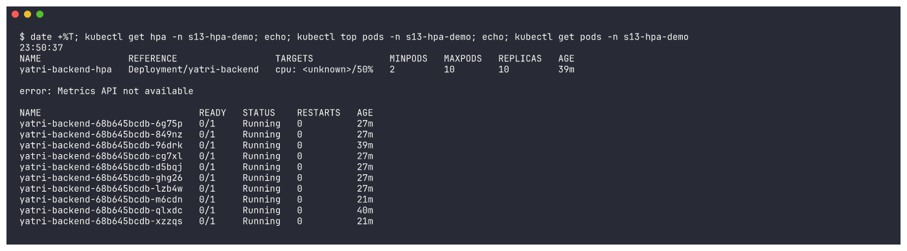

An HPA **never scales when it cannot read the metric** (it keeps the current replica count as the safe
choice), so the 10 replicas stayed.

> **What went wrong with the cluster:** this minikube node is shared with several other workloads
> (Argo CD, a Prometheus/Grafana stack, other namespaces - ~90 Pods on one node) and the host's load
> average was 20-40. The kubelet's `/metrics/resource` endpoint took up to **71 seconds** to answer
> (metrics-server gives up after 10s: `Failed to scrape node, timeout to access kubelet`), the node went
> `NotReady` twice, and metrics-server itself went into `CrashLoopBackOff` because its own liveness probe
> timed out. I did not change any cluster-wide component (it's shared), so I could only wait.
> The complete BEFORE -> DURING -> AFTER cycle, including the scale-down, is in
> [Run 2](#run-2---full-cycle-including-scale-down-0107---0120) below.

## Step 8 + 9: Captured output

All raw command output is in [`outputs/`](outputs/) and every screenshot is in
[`screenshots/`](screenshots/).

## Summary

| Phase | Time | HPA TARGETS | Replicas |
|---|---|---|---|
| Before load | 23:14 | `5%/50%` | 2 |
| Load started | 23:16 | `<unknown>` (metrics-server restarting) | 2 |
| Scale-up 1 | 23:23 | `190%/50%` | 2 -> 4 |
| Scale-up 2 | 23:23 | `190%/50%` | 4 -> 8 |
| Spread out | 23:25 | `66%/50%` | 8 |
| Scale-up 3 | 23:29 | `103%/50%` | 8 -> 10 (max) |
| Load stopped | 23:29 | `74%/50%`, Pod CPU falling | 10 |
| After | 23:50 | `<unknown>` (metrics-server down) | 10 (no scale-down without metrics) |

---

## Run 2 - full cycle including scale-down (01:07 - 01:20)

At ~01:03 the first `s13-hpa-demo` namespace was removed during a cluster cleanup (to relieve the
overloaded node) before it could scale down. Once metrics-server was healthy again I re-ran the exact
same `hpa.yml` + load generator, this time capturing the whole BEFORE -> DURING -> AFTER cycle.

### Deploy + BEFORE
```bash
kubectl apply -f hpa.yml && kubectl rollout status deployment/yatri-backend -n s13-hpa-demo --timeout=300s
```
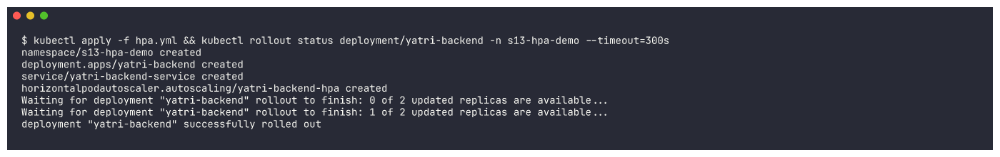

```text
01:08:47
NAME                REFERENCE                  TARGETS       MINPODS   MAXPODS   REPLICAS   AGE
yatri-backend-hpa   Deployment/yatri-backend   cpu: 1%/50%   2         10        2          84s

NAME                             CPU(cores)   MEMORY(bytes)
yatri-backend-68b645bcdb-kl6b9   8m           12Mi
yatri-backend-68b645bcdb-lb72p   2m           13Mi
```
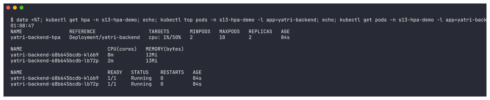

### Load on
```bash
./load_generator.sh start 3
```
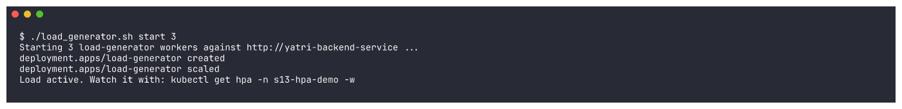

### DURING (snapshots every ~30s)

| Time | TARGETS | Replicas | Screenshot |
|---|---|---|---|
| 01:09:19 | `1%/50%` (load just started, next scrape pending) | 2 | `19-rerun-during-1` |
| 01:09:50 | `127%/50%` - Pods at 230-279m vs 200m request | 2 -> 4 (2 new Pods already Running) | `19-rerun-during-2` |
| 01:10:22 | `127%/50%` | 6 | `19-rerun-during-3` |
| 01:10:54 | `157%/50%` - load still too high for 6 Pods | 6 | `19-rerun-during-4` |
| 01:11:56 | `129%/50%` | **10 (max)** | `19-rerun-during-5` |

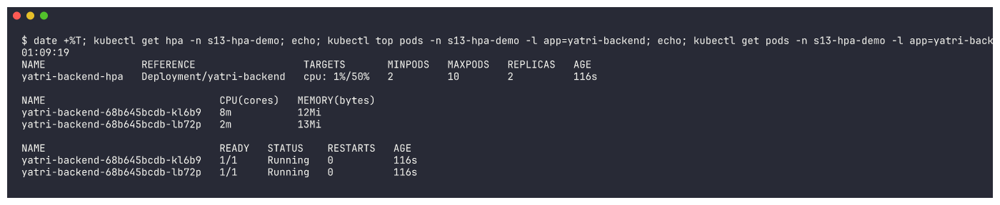
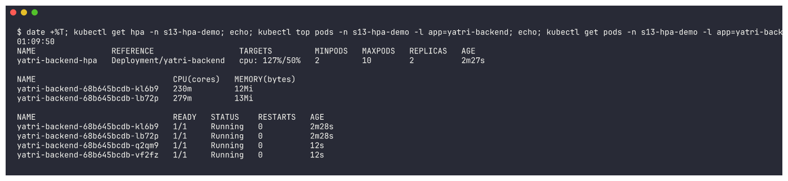
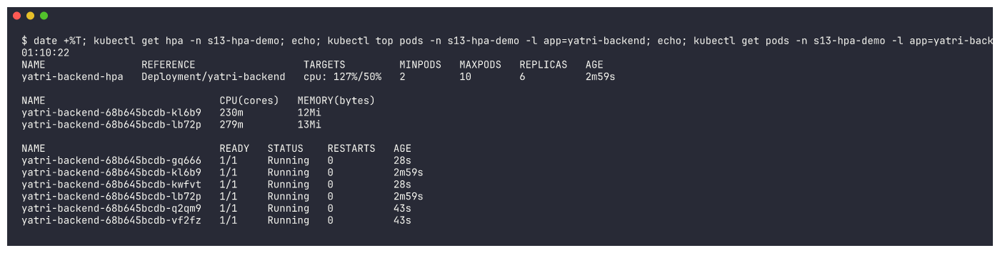
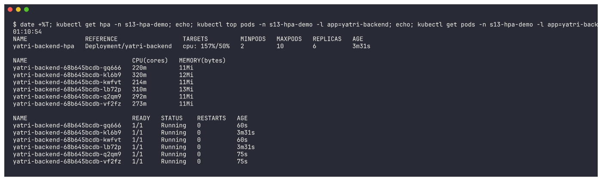
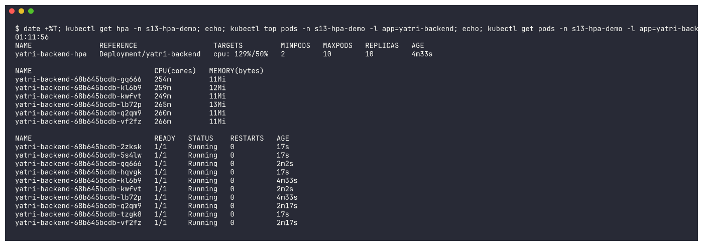

At the peak:
```text
Metrics:                                               ( current / target )
  resource cpu on pods  (as a percentage of request):  129% (258m) / 50%
Deployment pods:                                       10 current / 10 desired
  ScalingLimited  True    TooManyReplicas   the desired replica count is more than the maximum replica count
Events:
  Normal   SuccessfulRescale   2m49s   horizontal-pod-autoscaler  New size: 4; reason: cpu resource utilization (percentage of request) above target
  Normal   SuccessfulRescale   2m34s   horizontal-pod-autoscaler  New size: 6; reason: cpu resource utilization (percentage of request) above target
  Normal   SuccessfulRescale   49s     horizontal-pod-autoscaler  New size: 10; reason: cpu resource utilization (percentage of request) above target
```
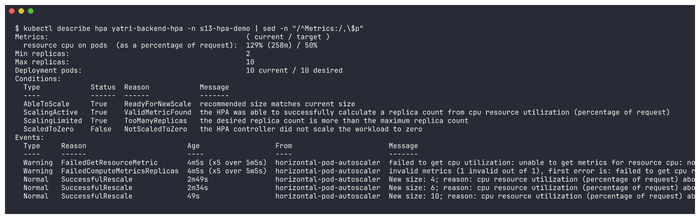

### Load off (01:12:36)
```bash
./load_generator.sh stop
```
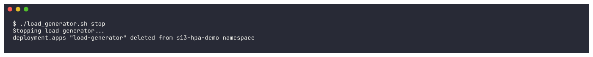

### AFTER - CPU drops, then the HPA scales back down

| Time | TARGETS | Replicas | What's happening | Screenshot |
|---|---|---|---|---|
| 01:13:32 | `101%/50%` (Pods at ~100m and falling) | 10 | metric still averaging in the last load | `22-after-1` |
| 01:14:34 | `54%/50%` (Pods at 3-4m) | 10 | load gone | `22-after-2` |
| 01:15:36 | `1%/50%` | 10 | **below target, but no scale-down yet** - stabilization window | `22-after-3` |
| 01:17:39 | `2%/50%` | 10 | still waiting | `22-after-4` |
| 01:19:41 | `1%/50%` | 10 -> 2 | 8 Pods `Terminating` | `22-after-5` |
| 01:20:13 | `0%/50%` | **2** | back at `minReplicas` | `22-after-6` |

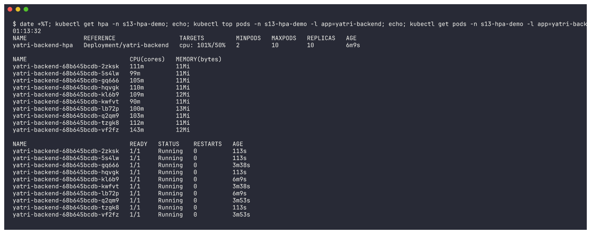
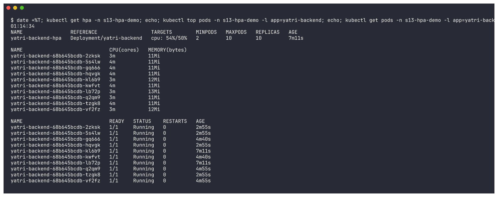

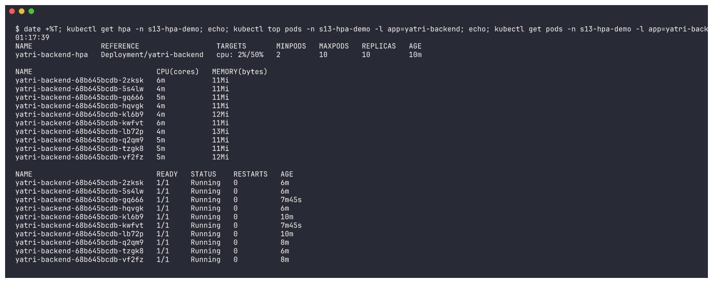

```text
01:19:41
yatri-backend-hpa   Deployment/yatri-backend   cpu: 1%/50%   2         10        10         12m
yatri-backend-68b645bcdb-2zksk   1/1     Terminating   0          8m2s
yatri-backend-68b645bcdb-5s4lw   1/1     Terminating   0          8m2s
yatri-backend-68b645bcdb-gq666   1/1     Running       0          9m47s
...
```
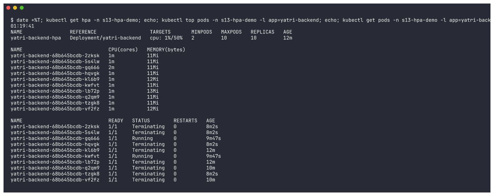

```text
01:20:13
NAME                REFERENCE                  TARGETS       MINPODS   MAXPODS   REPLICAS   AGE
yatri-backend-hpa   Deployment/yatri-backend   cpu: 0%/50%   2         10        2          12m

NAME                             READY   STATUS    RESTARTS   AGE
yatri-backend-68b645bcdb-gq666   1/1     Running   0          10m
yatri-backend-68b645bcdb-kwfvt   1/1     Running   0          10m
```


```bash
kubectl describe hpa yatri-backend-hpa -n s13-hpa-demo
```
```text
Metrics:                                               ( current / target )
  resource cpu on pods  (as a percentage of request):  0% (1m) / 50%
Deployment pods:                                       2 current / 2 desired
Conditions:
  AbleToScale     True    ScaleDownStabilized  recent recommendations were higher than current one, applying the highest recent recommendation
  ScalingActive   True    ValidMetricFound     the HPA was able to successfully calculate a replica count from cpu resource utilization (percentage of request)
  ScalingLimited  True    TooFewReplicas       the desired replica count is less than the minimum replica count
Events:
  Normal   SuccessfulRescale   10m     horizontal-pod-autoscaler  New size: 4; reason: cpu resource utilization (percentage of request) above target
  Normal   SuccessfulRescale   10m     horizontal-pod-autoscaler  New size: 6; reason: cpu resource utilization (percentage of request) above target
  Normal   SuccessfulRescale   8m40s   horizontal-pod-autoscaler  New size: 10; reason: cpu resource utilization (percentage of request) above target
  Normal   SuccessfulRescale   52s     horizontal-pod-autoscaler  New size: 2; reason: All metrics below target
```


* CPU dropped below target at ~01:14:30, but the scale-down happened at ~01:19:20: the default
  **5-minute scale-down stabilization window** at work (`ScaleDownStabilized`).
* It went straight from 10 to 2 (the minimum), not 1 - `TooFewReplicas`: the metric alone would
  want fewer Pods, but `minReplicas: 2` wins.

```bash
kubectl delete namespace s13-hpa-demo --wait=false
```
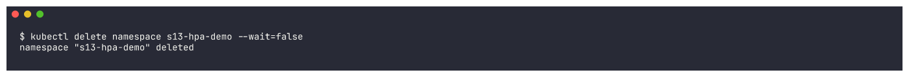

### Run 2 summary

| Phase | Time | TARGETS | Replicas |
|---|---|---|---|
| Before | 01:08 | `1%/50%` | 2 |
| During | 01:09 - 01:12 | `127%` -> `157%` -> `129%` | 2 -> 4 -> 6 -> 10 |
| Load stopped | 01:12:36 | | 10 |
| After | 01:13 - 01:19 | `101%` -> `54%` -> `1%` | 10 (stabilization window) |
| After | 01:19:20 | `0-1%` | **10 -> 2** |
