# Probes: Liveness, Readiness and Startup

Kubernetes uses probes to ask a container "are you OK?". The kubelet runs them periodically and acts on
the answer. All demos ran in the namespace `s13-probes`.

| Probe | Question it answers | What happens on failure |
|---|---|---|
| **startupProbe** | Has the app finished starting? | Liveness/readiness are **not run** until it succeeds; after `failureThreshold x periodSeconds` the container is killed and restarted |
| **livenessProbe** | Is the app still alive (not deadlocked)? | kubelet **restarts the container** |
| **readinessProbe** | Can the app take traffic right now? | Pod is marked **NotReady** and removed from Service endpoints (**no restart**) |

Probe mechanisms: `httpGet` (2xx/3xx = success), `tcpSocket` (port accepts a connection), `exec`
(command exits 0), `grpc`. Timing fields: `initialDelaySeconds`, `periodSeconds`, `timeoutSeconds`,
`failureThreshold`, `successThreshold`.

## Files

| File | Purpose |
|---|---|
| `00-namespace.yaml` | namespace `s13-probes` |
| `01-liveness.yaml` | nginx with a healthy HTTP liveness probe (from the reference repo) |
| `02-readiness.yaml` | nginx with a healthy HTTP readiness probe |
| `03-startup.yaml` | nginx with startup + liveness + readiness probes |
| `04-liveness-fail.yaml` | liveness probe on a path that returns 404 -> container gets restarted |
| `05-readiness-fail.yaml` | readiness probe that always fails + two Services to compare endpoints |
| `06-slow-startup.yaml` | app that needs 20s to start, protected by a startupProbe (exec probe) |

---

## 1. Healthy probes

```bash
kubectl apply -f 00-namespace.yaml -f 01-liveness.yaml -f 02-readiness.yaml -f 03-startup.yaml
```
```text
namespace/s13-probes created
pod/liveness-demo created
pod/readiness-demo created
pod/startup-demo created
```
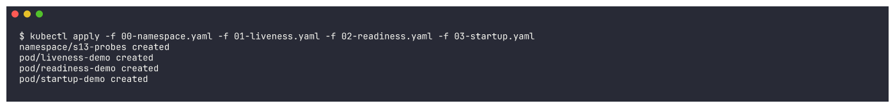

```bash
kubectl wait --for=condition=Ready pod --all -n s13-probes --timeout=180s; kubectl get pods -n s13-probes
```
```text
NAME             READY   STATUS    RESTARTS   AGE
liveness-demo    1/1     Running   0          111s
readiness-demo   1/1     Running   0          110s
startup-demo     1/1     Running   0          107s
```
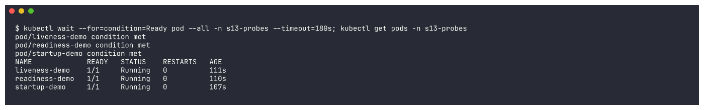

How the probes are configured, as Kubernetes sees them:
```bash
kubectl describe pod liveness-demo -n s13-probes | grep -E "Liveness|Readiness|Startup|State|Ready|Restart Count"
```
```text
    State:          Running
    Ready:          True
    Restart Count:  0
    Liveness:       http-get http://:80/ delay=5s timeout=2s period=5s successThreshold=1 failureThreshold=3
```
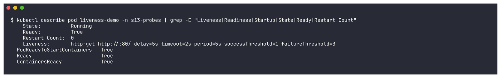

```bash
kubectl describe pod startup-demo -n s13-probes | grep -E "Liveness|Readiness|Startup|Restart Count"
```
```text
    Liveness:       http-get http://:80/ delay=0s timeout=1s period=5s successThreshold=1 failureThreshold=3
    Readiness:      http-get http://:80/ delay=0s timeout=1s period=5s successThreshold=1 failureThreshold=3
    Startup:        http-get http://:80/ delay=0s timeout=1s period=2s successThreshold=1 failureThreshold=30
```
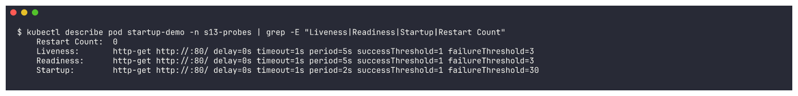

The startup probe allows up to `30 x 2s = 60s` for the app to come up before liveness takes over.

---

## 2. Failing probes

```bash
kubectl apply -f 04-liveness-fail.yaml -f 05-readiness-fail.yaml -f 06-slow-startup.yaml
```
```text
pod/liveness-fail-demo created
pod/readiness-fail-demo created
service/readiness-fail-svc created
service/readiness-demo-svc created
pod/slow-startup-demo created
```
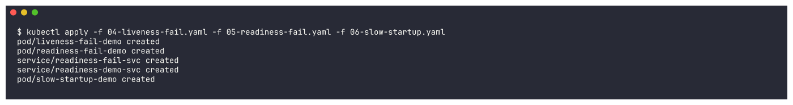

### 2a. Liveness failure -> container restarts

`04-liveness-fail.yaml` probes `/healthz-does-not-exist`, so nginx answers **404**. After 3 failures
the kubelet kills and restarts the container.

```bash
kubectl get pods liveness-fail-demo readiness-fail-demo -n s13-probes
```
```text
NAME                  READY   STATUS    RESTARTS      AGE
liveness-fail-demo    1/1     Running   1 (33s ago)   96s
readiness-fail-demo   0/1     Running   0             95s
```
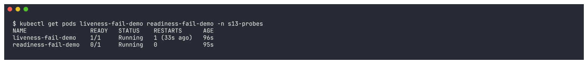

```bash
kubectl events -n s13-probes --for pod/liveness-fail-demo | tail -8
```
```text
Warning   Unhealthy   Pod/liveness-fail-demo   Liveness probe failed: Get "http://10.244.0.63:80/healthz-does-not-exist": context deadline exceeded ...
Normal    Killing     Pod/liveness-fail-demo   Container nginx failed liveness probe, will be restarted
Normal    Pulled      Pod/liveness-fail-demo   Container image "nginx:1.27" already present on machine ...
Normal    Created     Pod/liveness-fail-demo   Container created
Normal    Started     Pod/liveness-fail-demo   Container started
Warning   Unhealthy   Pod/liveness-fail-demo   Liveness probe failed: HTTP probe failed with statuscode: 404
```
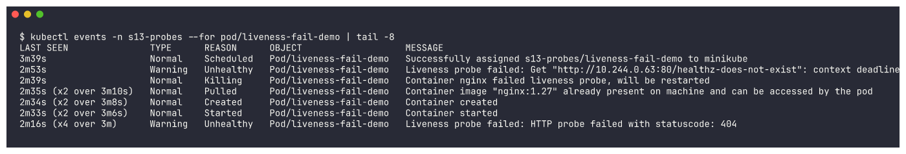

The restart cycle never ends because the probe can never pass. An hour later it had restarted 19 times
and was in `CrashLoopBackOff` (the back-off between restarts keeps growing):

```bash
kubectl get pods -n s13-probes; kubectl get pod liveness-fail-demo -n s13-probes -o jsonpath="liveness-fail-demo restartCount={.status.containerStatuses[0].restartCount}"
```
```text
NAME                  READY   STATUS             RESTARTS         AGE
liveness-demo         1/1     Running            6 (3m20s ago)    66m
liveness-fail-demo    0/1     CrashLoopBackOff   19 (2m1s ago)    63m
readiness-demo        1/1     Running            0                66m
readiness-fail-demo   0/1     Running            0                63m
slow-startup-demo     1/1     Running            1 (2m19s ago)    63m
startup-demo          1/1     Running            10 (3m14s ago)   65m
liveness-fail-demo restartCount=19
```
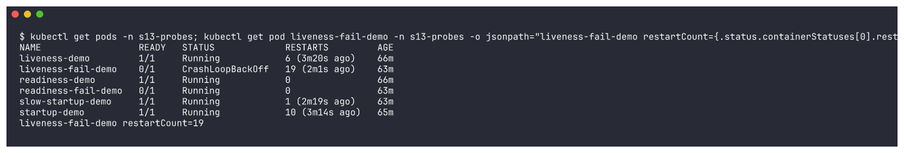

> **Real-world lesson observed here:** the *healthy* `liveness-demo` and `startup-demo` also picked up
> restarts (6 and 10). The minikube node is shared with several other workloads and the host was badly
> overloaded (load average 20-40, the node even went `NotReady` twice). Their probes use
> `timeoutSeconds: 1-2`, so when nginx answered slower than that the probe counted as failed and the
> kubelet restarted a perfectly fine container. Too-aggressive liveness timeouts cause restart storms
> under load - a good reason to give liveness probes generous timeouts/thresholds.

### 2b. Readiness failure -> no traffic, but no restart

`05-readiness-fail.yaml` probes `/not-ready` (404). The Pod stays `Running` with **0 restarts** but is
`0/1` Ready.

```bash
kubectl events -n s13-probes --for pod/readiness-fail-demo | tail -4
```
```text
Warning   Unhealthy   Pod/readiness-fail-demo   Readiness probe failed: HTTP probe failed with statuscode: 404
```
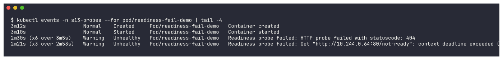

Compare the two Services - one in front of the healthy `readiness-demo`, one in front of
`readiness-fail-demo`:
```bash
kubectl get endpointslices -n s13-probes
kubectl describe svc readiness-fail-svc -n s13-probes | grep -i endpoints
kubectl describe svc readiness-demo-svc -n s13-probes | grep -i endpoints
```
```text
NAME                       ADDRESSTYPE   PORTS   ENDPOINTS     AGE
readiness-demo-svc-gxbk7   IPv4          80      10.244.0.62   3m35s
readiness-fail-svc-ckwwz   IPv4          80      10.244.0.64   3m38s

Endpoints:
Endpoints:                10.244.0.62:80
```
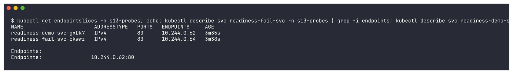

The `readiness-fail-svc` Service has **no usable endpoints** (`Endpoints:` is empty). The
EndpointSlice still lists the Pod IP, but marked `ready=false`:
```bash
kubectl get endpointslices -n s13-probes -o custom-columns=NAME:.metadata.name,SERVICE:...,IP:.endpoints[*].addresses[0],READY:.endpoints[*].conditions.ready
```
```text
NAME                       SERVICE   IP            READY
readiness-demo-svc-gxbk7   <none>    10.244.0.62   true
readiness-fail-svc-ckwwz   <none>    10.244.0.64   false
```
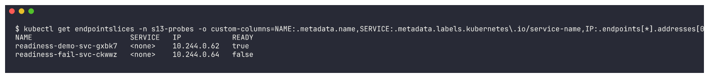

### 2c. Startup probe protecting a slow app

`06-slow-startup.yaml` sleeps 20s before creating `/tmp/started`. The startup probe (`exec: cat
/tmp/started`, every 2s, up to 30 failures) holds back the liveness and readiness probes, so the app is
not killed while it boots.

Right after creation (container still being created on the busy node):
```bash
kubectl get pod slow-startup-demo -n s13-probes
```
```text
NAME                READY   STATUS              RESTARTS   AGE
slow-startup-demo   0/1     ContainerCreating   0          20s
```
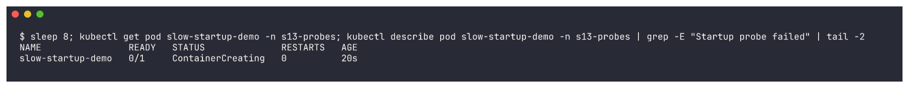

During the 20s boot it is `Running` but `0/1` (startup probe not yet passed):
```bash
kubectl get pod slow-startup-demo -n s13-probes; kubectl logs slow-startup-demo -n s13-probes
```
```text
NAME                READY   STATUS    RESTARTS   AGE
slow-startup-demo   0/1     Running   0          50s
booting (20s)...
started
```


Once `/tmp/started` exists the startup probe passes, then readiness passes -> `1/1`, with **no restart**:
```bash
kubectl get pod slow-startup-demo -n s13-probes; kubectl events -n s13-probes --for pod/slow-startup-demo
```
```text
NAME                READY   STATUS    RESTARTS   AGE
slow-startup-demo   1/1     Running   0          4m35s
```
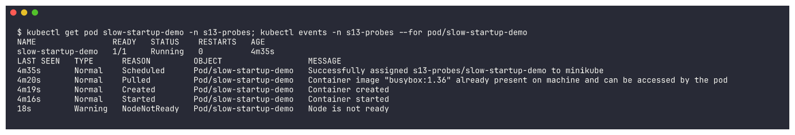

Without the startup probe, a liveness probe with a short delay would kill this container before it ever
finished booting.

---

## Cleanup

```bash
kubectl delete namespace s13-probes --wait=false
```

