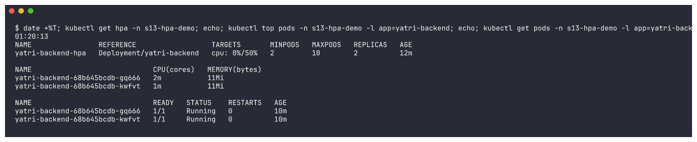
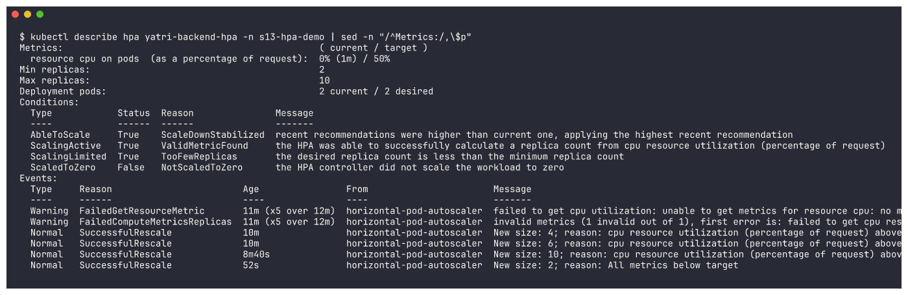

# Session 13: Kubernetes Storage, HPA & Probes - Homework

All tasks were done hands-on on a local **minikube** cluster (Kubernetes v1.37.0, containerd, arm64,
`metrics-server` addon, default `standard` StorageClass). Every command shown in the READMEs was actually
run; each one has its real (sometimes trimmed) output and a **screenshot** directly under it. Raw output of
every command is also saved in each folder's `outputs/` directory.

The work follows the instructor's reference repo (`devops-heros/session-13-storage-hpa-probes`): its
manifests are reused where they exist and adapted where needed (changes are explained in each README).

## Contents

| Folder | Task | What's inside |
|---|---|---|
| [`01-kubernetes-volumes/`](01-kubernetes-volumes/README.md) | **Task 1 - Volume documentation** | emptyDir (shared by 2 containers), hostPath, static PV + PVC, StorageClass, dynamic provisioning, data surviving Pod deletion, reclaim policies - 23 screenshots |
| [`02-hpa/`](02-hpa/README.md) | **Task 2 - HPA hands-on** | `hpa.yml`, load generator (`load-generator.yaml` + `load_generator.sh`), `kubectl get hpa` / `top pods` / `describe hpa` / `get pods` BEFORE, DURING (2 -> 4 -> 8 -> 10 and 2 -> 4 -> 6 -> 10 Pods) and AFTER load (10 -> 2) |
| [`03-probes/`](03-probes/README.md) | Probes (session topic) | liveness / readiness / startup - healthy and failing versions, restarts vs. endpoint removal |
| [`mini-project/`](mini-project/README.md) | **Task 3 - Mini project** | `production-webapp`: namespace, PVC, Deployment with all 3 probes, Service, HPA - deployed and verified (persistence, Service, HPA) |

## Deliverables checklist

| Deliverable | Where |
|---|---|
| Volume documentation | [01-kubernetes-volumes/README.md](01-kubernetes-volumes/README.md) |
| HPA YAML | [02-hpa/hpa.yml](02-hpa/hpa.yml) (instructor original in [02-hpa/instructor-original/](02-hpa/instructor-original/)) |
| Load generator | [02-hpa/load-generator.yaml](02-hpa/load-generator.yaml), [02-hpa/load_generator.sh](02-hpa/load_generator.sh) |
| HPA output | [02-hpa/README.md](02-hpa/README.md) + [02-hpa/outputs/](02-hpa/outputs/) |
| Screenshots | `screenshots/` in every folder (one per command) |
| Mini-project implementation | [mini-project/](mini-project/) (YAML + README) |
| README documentation | this file + one README per folder |

---

## Task 1 - Kubernetes Volumes (summary)

Full write-up with every command: **[01-kubernetes-volumes/README.md](01-kubernetes-volumes/README.md)**

| Concept | What it is | What I verified |
|---|---|---|
| **emptyDir** | Scratch directory created with the Pod, deleted with the Pod | A `writer` (busybox) and `web` (nginx) container shared one emptyDir - nginx served the file the writer produced; after recreating the Pod the old content was gone |
| **hostPath** | Directory from the node's filesystem | File written in the Pod was visible via `minikube ssh` on the node and survived Pod recreation |
| **PersistentVolume** | Cluster-wide piece of storage with capacity, access mode and reclaim policy | `s13-static-pv` (1Gi, `Retain`) went `Available -> Bound -> Released` |
| **PersistentVolumeClaim** | A namespaced request for storage | `static-pvc` (500Mi) bound to the 1Gi PV; data survived Pod deletion |
| **StorageClass** | Template that tells a provisioner how to create PVs | `standard (default)`, provisioner `k8s.io/minikube-hostpath`, `Delete`, `Immediate` |
| **Dynamic provisioning** | PVC + StorageClass -> PV created automatically | `dynamic-pvc` created `pvc-a370513e-...` on its own; data survived the Deployment replacing its Pod |


---

## Task 2 - HPA hands-on (summary)

Full write-up: **[02-hpa/README.md](02-hpa/README.md)**

`hpa.yml` deploys the `yatri-backend` app (CPU request 200m) + Service + the instructor's HPA
(`min 2, max 10, 50% CPU`). Three in-cluster busybox workers hammer the Service.

| Phase | HPA `TARGETS` | Replicas |
|---|---|---|
| Before load | `5%/50%` | 2 |
| During load | `190%/50%` | 2 -> 4 -> 8 |
| During load | `66%` -> `103%/50%` | 8 -> **10 (max)** |
| Load stopped | `74%/50%`, CPU per Pod dropping | 10 |
| Run 2 - after load | `54%` -> `1%/50%`, then 5-min stabilization window | **10 -> 2** (`New size: 2; reason: All metrics below target`) |

The first run's scale-down could not be observed (metrics-server went down, then the namespace was
removed during a cluster cleanup), so I re-ran the same `hpa.yml` once metrics were healthy and captured
the full cycle: 2 -> 4 -> 6 -> 10 during load and 10 -> 2 about 5 minutes after the load stopped.

```text
Events:
  Normal   SuccessfulRescale   horizontal-pod-autoscaler  New size: 4; reason: cpu resource utilization (percentage of request) above target
  Normal   SuccessfulRescale   horizontal-pod-autoscaler  New size: 8; reason: cpu resource utilization (percentage of request) above target
  Normal   SuccessfulRescale   horizontal-pod-autoscaler  New size: 10; reason: cpu resource utilization (percentage of request) above target
```





---

## Probes (summary)

Full write-up: **[03-probes/README.md](03-probes/README.md)**

| Probe | Demo | Result |
|---|---|---|
| Liveness | probe on a 404 path | container killed and restarted (19 restarts after an hour, CrashLoopBackOff) |
| Readiness | probe on a 404 path | Pod `Running` but `0/1`, **0 restarts**, removed from Service endpoints |
| Startup | app needs 20s to boot | liveness/readiness held back until `/tmp/started` existed, no restart |


---

## Task 3 - Mini project (summary)

Full write-up: **[mini-project/README.md](mini-project/README.md)**

`production-webapp` namespace with PVC `web-data` (dynamically provisioned), Deployment `web-app`
(2 replicas, startup/readiness/liveness probes, CPU/memory requests and limits, `/data` on the PVC),
ClusterIP Service `web-service`, and HPA `web-app-hpa` (2-5 replicas, 50% CPU).

* Persistence verified: a file written from one Pod was still there in the replacement Pod after deleting it.
* Service verified through `kubectl port-forward` (nginx welcome page).
* HPA: see the note below.


---

## Honest note about the cluster

The minikube node was **shared** with several other workloads (Argo CD, a Prometheus/Grafana stack and
other namespaces - around 90 Pods on one node) and the Mac's load average stayed at 20-40 the whole
time. Effects that show up in the screenshots, all real:

* The node went `NotReady` twice; the kubelet's metrics endpoint took up to 71 s to respond.
* **metrics-server** repeatedly failed its liveness probe and ended in `CrashLoopBackOff`, so `kubectl top`
  / HPA metrics were often `<unknown>`. The HPA hands-on scale-up was captured during a window when
  metrics were available, and the full scale-up + scale-down cycle was re-run and captured once
  metrics-server recovered; the mini-project HPA never got metrics while its load generator ran.
* Healthy probe demos picked up restarts because 1-2 s probe timeouts were exceeded on the starved node -
  documented as a real-world lesson in the probes README.

I did not touch any cluster-wide component (metrics-server, CoreDNS, addons) because the cluster was shared.
All my namespaces (`s13-volumes`, `s13-probes`, `s13-hpa-demo`, `production-webapp`) were deleted after
the evidence was captured.
