# Session 13: Kubernetes Storage, HPA & Probes

> Work in progress: the full write-up for this session is being finalised. Every screenshot below is real output from commands run on a local minikube cluster / Docker / GitHub Actions.

## 01-kubernetes-volumes

### 01-apply-emptydir

```bash
kubectl apply -f 00-namespace.yaml -f 01-emptydir-pod.yaml
```


### 02-wait-emptydir

```bash
kubectl wait --for=condition=Ready pod/emptydir-demo -n s13-volumes --timeout=180s && kubectl get pod emptydir-demo -n s13-volumes -o wide
```


### 03-emptydir-read-from-web

```bash
kubectl exec emptydir-demo -n s13-volumes -c web -- cat /usr/share/nginx/html/index.html
```


### 04-emptydir-curl

```bash
kubectl exec emptydir-demo -n s13-volumes -c web -- curl -s localhost
```


### 05-emptydir-both-mounts

```bash
kubectl exec emptydir-demo -n s13-volumes -c writer -- ls -l /shared; kubectl exec emptydir-demo -n s13-volumes -c web -- ls -l /usr/share/nginx/html; kubectl describe pod emptydir-demo -n s13-volumes | grep -A4 "^Volumes:"
```


### 06-emptydir-delete-recreate

```bash
kubectl delete pod emptydir-demo -n s13-volumes && kubectl apply -f 01-emptydir-pod.yaml && kubectl wait --for=condition=Ready pod/emptydir-demo -n s13-volumes --timeout=120s && sleep 3 && kubectl exec emptydir-demo -n s13-volumes -c web -- cat /usr/share/nginx/html/index.html
```


### 07-apply-hostpath

```bash
kubectl apply -f 02-hostpath-pod.yaml && kubectl wait --for=condition=Ready pod/hostpath-demo -n s13-volumes --timeout=120s && kubectl get pod hostpath-demo -n s13-volumes -o wide
```


### 08-hostpath-write

```bash
kubectl exec hostpath-demo -n s13-volumes -- sh -c "echo hello-from-hostpath-pod > /data/hello.txt && cat /data/hello.txt"
```


### 09-hostpath-on-node

```bash
minikube ssh "ls -l /tmp/s13-hostpath-data && cat /tmp/s13-hostpath-data/hello.txt"
```


### 10-hostpath-delete-recreate

```bash
kubectl delete pod hostpath-demo -n s13-volumes && kubectl apply -f 02-hostpath-pod.yaml && kubectl wait --for=condition=Ready pod/hostpath-demo -n s13-volumes --timeout=120s && kubectl exec hostpath-demo -n s13-volumes -- cat /data/hello.txt
```


### 11-apply-pv

```bash
kubectl apply -f 03-pv.yaml && kubectl get pv s13-static-pv
```


### 12-apply-pvc-bound

```bash
kubectl apply -f 04-pvc.yaml && sleep 3 && kubectl get pv s13-static-pv && kubectl get pvc static-pvc -n s13-volumes
```


### 13-describe-pvc

```bash
kubectl describe pvc static-pvc -n s13-volumes
```


### 14-pvc-pod-write

```bash
kubectl apply -f 05-pvc-pod.yaml && kubectl wait --for=condition=Ready pod/static-storage-demo -n s13-volumes --timeout=120s && kubectl exec static-storage-demo -n s13-volumes -- sh -c "echo student-data-on-static-pv > /data/student.txt && cat /data/student.txt"
```


### 15-pvc-pod-delete-recreate

```bash
kubectl delete pod static-storage-demo -n s13-volumes && kubectl apply -f 05-pvc-pod.yaml && kubectl wait --for=condition=Ready pod/static-storage-demo -n s13-volumes --timeout=120s && kubectl exec static-storage-demo -n s13-volumes -- cat /data/student.txt
```


### 16-storageclass

```bash
kubectl get storageclass && kubectl describe storageclass standard
```


### 17-dynamic-pvc

```bash
kubectl apply -f 06-dynamic-pvc.yaml && sleep 5 && kubectl get pvc dynamic-pvc -n s13-volumes && kubectl get pv
```


### 18-dynamic-pvc-describe

```bash
kubectl describe pvc dynamic-pvc -n s13-volumes | tail -8
```


### 19-dynamic-deploy-write

```bash
kubectl apply -f 07-dynamic-deployment.yaml && kubectl rollout status deployment/dynamic-storage-app -n s13-volumes --timeout=120s && POD=$(kubectl get pod -n s13-volumes -l app=dynamic-storage-app -o jsonpath="{.items[0].metadata.name}") && echo "pod: $POD" && kubectl exec $POD -n s13-volumes -- sh -c "echo order-123-saved-at-$(date +%H:%M:%S) > /data/orders.txt && cat /data/orders.txt"
```


### 20-dynamic-delete-pod-data-survives

```bash
OLD=$(kubectl get pod -n s13-volumes -l app=dynamic-storage-app -o jsonpath="{.items[0].metadata.name}") && kubectl delete pod $OLD -n s13-volumes && kubectl rollout status deployment/dynamic-storage-app -n s13-volumes --timeout=120s && NEW=$(kubectl get pod -n s13-volumes -l app=dynamic-storage-app --field-selector=status.phase=Running -o jsonpath="{.items[0].metadata.name}") && echo "old pod: $O ...
```


### 21-all-storage

```bash
kubectl get pv && kubectl get pvc,pods -n s13-volumes -o wide
```


### 22-reclaim-policy

```bash
kubectl delete namespace s13-volumes && sleep 5 && kubectl get pv
```


### 23-cleanup-static-pv

```bash
kubectl delete pv s13-static-pv && kubectl get pv
```


## 02-hpa

### 01-deploy-app-and-hpa

```bash
kubectl apply -f hpa.yml
```

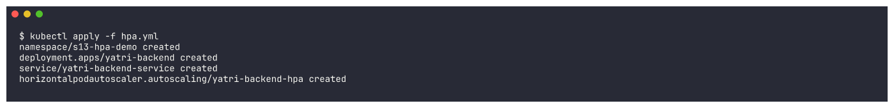

### 02-rollout

```bash
kubectl rollout status deployment/yatri-backend -n s13-hpa-demo --timeout=180s && kubectl get deploy,svc,hpa,pods -n s13-hpa-demo -o wide
```

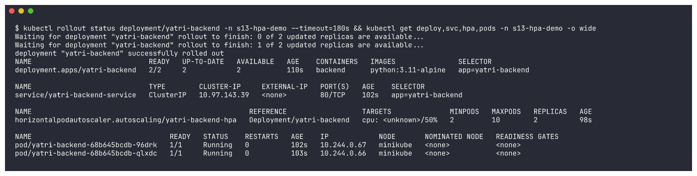

### 03-before-get-hpa

```bash
kubectl get hpa -n s13-hpa-demo
```

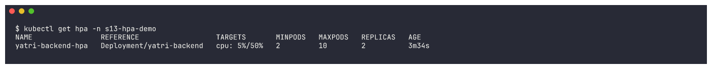

### 04-before-top-pods

```bash
kubectl top pods -n s13-hpa-demo
```

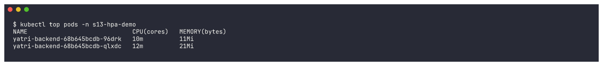

### 05-before-get-pods

```bash
kubectl get pods -n s13-hpa-demo -o wide
```

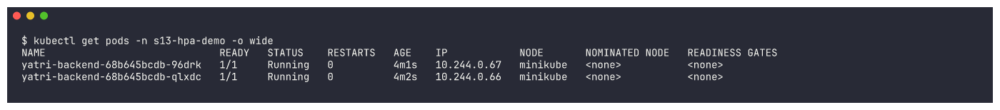

### 06-before-describe-hpa

```bash
kubectl describe hpa yatri-backend-hpa -n s13-hpa-demo
```

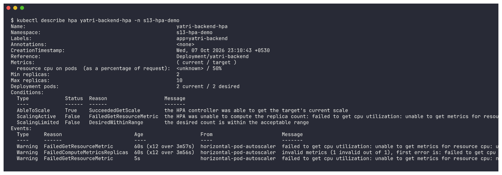

### 07-verify-service

```bash
kubectl run curl-test -n s13-hpa-demo --rm -i --restart=Never --image=curlimages/curl:8.6.0 -- sh -c "time curl -s http://yatri-backend-service"
```

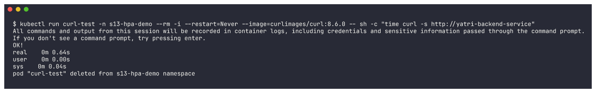

### 08-start-load-generator

```bash
./load_generator.sh start 3
```


### 09-load-generator-pods

```bash
sleep 20; kubectl get pods -n s13-hpa-demo -l app=load-generator; kubectl logs -n s13-hpa-demo deploy/load-generator --tail=3
```

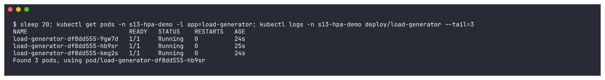

### 10-during-1

```bash
date +%T; kubectl get hpa -n s13-hpa-demo; echo; kubectl top pods -n s13-hpa-demo -l app=yatri-backend; echo; kubectl get pods -n s13-hpa-demo -l app=yatri-backend
```

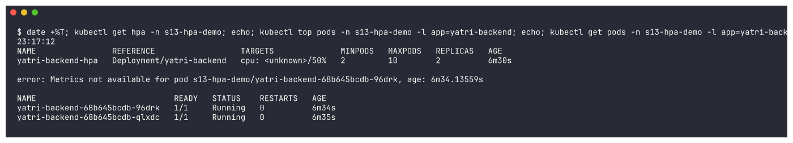

### 10-during-2

```bash
date +%T; kubectl get hpa -n s13-hpa-demo; echo; kubectl top pods -n s13-hpa-demo -l app=yatri-backend; echo; kubectl get pods -n s13-hpa-demo -l app=yatri-backend
```

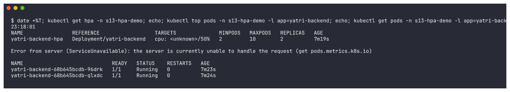

### 10-during-3

```bash
date +%T; kubectl get hpa -n s13-hpa-demo; echo; kubectl top pods -n s13-hpa-demo -l app=yatri-backend; echo; kubectl get pods -n s13-hpa-demo -l app=yatri-backend
```

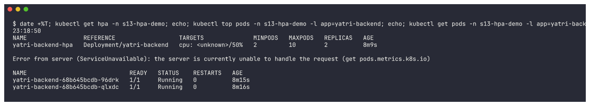

### 10-during-4

```bash
date +%T; kubectl get hpa -n s13-hpa-demo; echo; kubectl top pods -n s13-hpa-demo -l app=yatri-backend; echo; kubectl get pods -n s13-hpa-demo -l app=yatri-backend
```

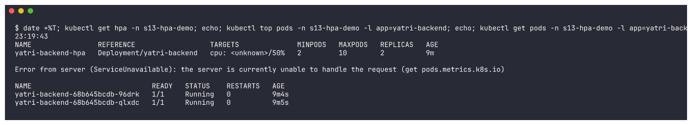

### 10-during-5

```bash
date +%T; kubectl get hpa -n s13-hpa-demo; echo; kubectl top pods -n s13-hpa-demo -l app=yatri-backend; echo; kubectl get pods -n s13-hpa-demo -l app=yatri-backend
```

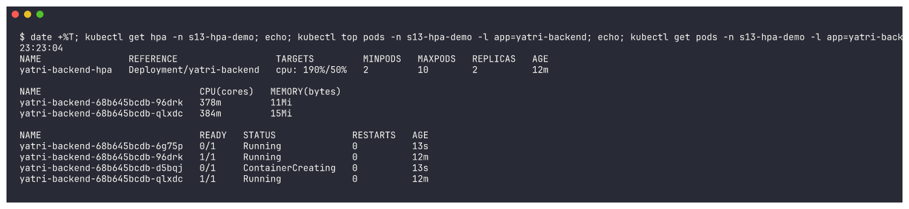

### 10-during-6

```bash
date +%T; kubectl get hpa -n s13-hpa-demo; echo; kubectl top pods -n s13-hpa-demo -l app=yatri-backend; echo; kubectl get pods -n s13-hpa-demo -l app=yatri-backend
```

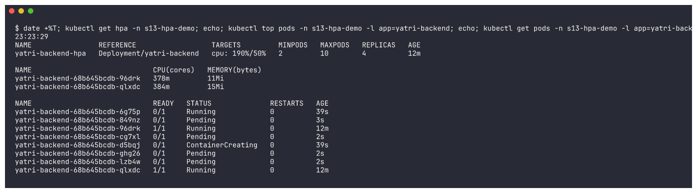

### 10-during-7

```bash
date +%T; kubectl get hpa -n s13-hpa-demo; echo; kubectl top pods -n s13-hpa-demo -l app=yatri-backend; echo; kubectl get pods -n s13-hpa-demo -l app=yatri-backend
```

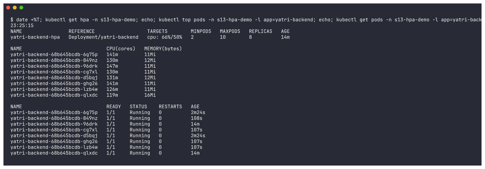

### 10-during-8

```bash
date +%T; kubectl get hpa -n s13-hpa-demo; echo; kubectl top pods -n s13-hpa-demo -l app=yatri-backend; echo; kubectl get pods -n s13-hpa-demo -l app=yatri-backend
```

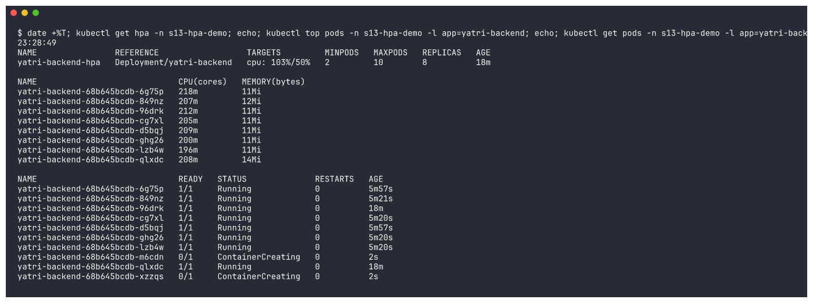

### 10-during-9

```bash
date +%T; kubectl get hpa -n s13-hpa-demo; echo; kubectl top pods -n s13-hpa-demo -l app=yatri-backend; echo; kubectl get pods -n s13-hpa-demo -l app=yatri-backend
```

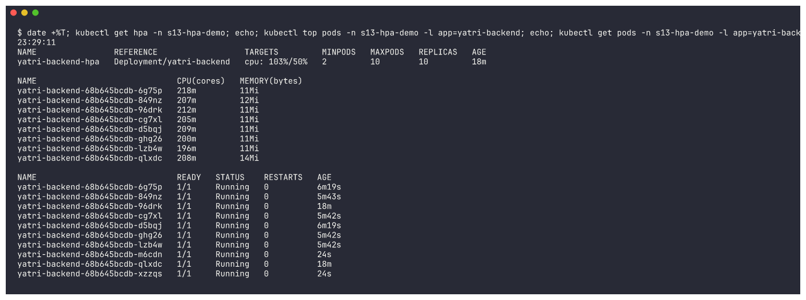

### 11-during-describe-hpa

```bash
kubectl describe hpa yatri-backend-hpa -n s13-hpa-demo
```

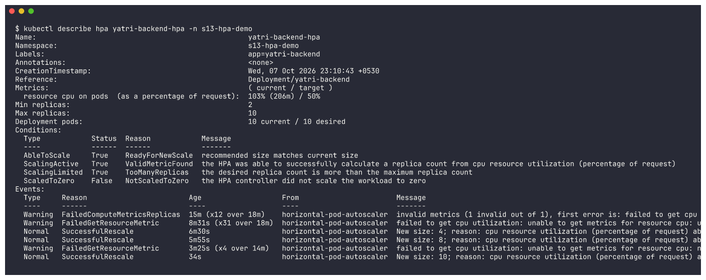

### 12-during-top-node

```bash
kubectl top pods -n s13-hpa-demo; kubectl get deploy yatri-backend -n s13-hpa-demo
```

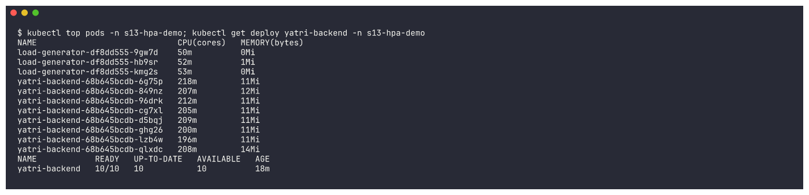

### 13-stop-load-generator

```bash
./load_generator.sh stop
```


### 14-after-1

```bash
date +%T; kubectl get hpa -n s13-hpa-demo; echo; kubectl top pods -n s13-hpa-demo -l app=yatri-backend; echo; kubectl get pods -n s13-hpa-demo -l app=yatri-backend
```

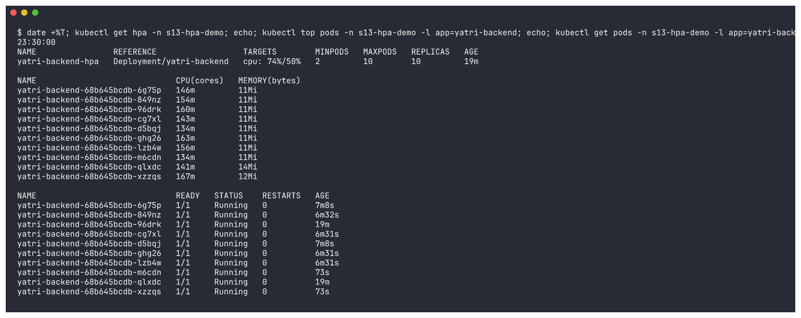

### 14-after-2

```bash
date +%T; kubectl get hpa -n s13-hpa-demo; echo; kubectl top pods -n s13-hpa-demo -l app=yatri-backend; echo; kubectl get pods -n s13-hpa-demo -l app=yatri-backend
```

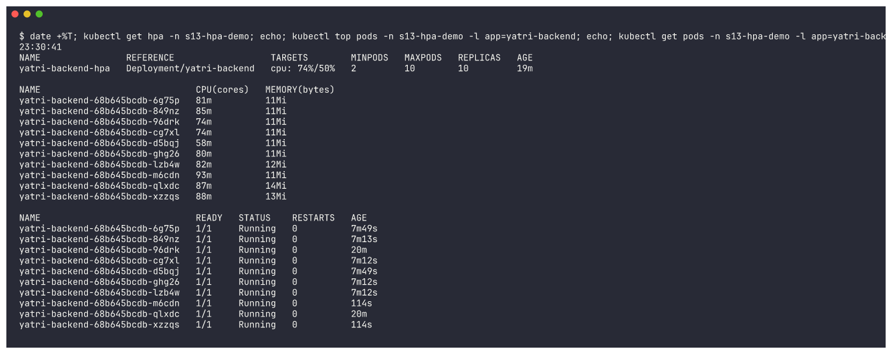

### 15-after-scaled-down

```bash
date +%T; kubectl get hpa -n s13-hpa-demo; echo; kubectl top pods -n s13-hpa-demo; echo; kubectl get pods -n s13-hpa-demo
```


## 03-probes

### 01-apply-healthy-probes

```bash
kubectl apply -f 00-namespace.yaml -f 01-liveness.yaml -f 02-readiness.yaml -f 03-startup.yaml
```


### 02-wait-healthy

```bash
kubectl wait --for=condition=Ready pod --all -n s13-probes --timeout=180s; kubectl get pods -n s13-probes
```


### 03-describe-liveness

```bash
kubectl describe pod liveness-demo -n s13-probes | grep -E "Liveness|Readiness|Startup|State|Ready|Restart Count"
```


### 04-describe-startup

```bash
kubectl describe pod startup-demo -n s13-probes | grep -E "Liveness|Readiness|Startup|Restart Count"
```


### 05-apply-failing-probes

```bash
kubectl apply -f 04-liveness-fail.yaml -f 05-readiness-fail.yaml -f 06-slow-startup.yaml
```


### 06-slow-startup-not-ready

```bash
sleep 8; kubectl get pod slow-startup-demo -n s13-probes; kubectl describe pod slow-startup-demo -n s13-probes | grep -E "Startup probe failed" | tail -2
```


### 07-slow-startup-ready

```bash
kubectl get pod slow-startup-demo -n s13-probes; kubectl logs slow-startup-demo -n s13-probes
```


### 08-liveness-fail-restarts

```bash
kubectl get pods liveness-fail-demo readiness-fail-demo -n s13-probes
```


### 09-slow-startup-events

```bash
kubectl get pod slow-startup-demo -n s13-probes; kubectl events -n s13-probes --for pod/slow-startup-demo
```


### 10-liveness-fail-events

```bash
kubectl events -n s13-probes --for pod/liveness-fail-demo | tail -8
```


### 11-readiness-fail-events

```bash
kubectl events -n s13-probes --for pod/readiness-fail-demo | tail -4
```


### 12-endpoints-compare

```bash
kubectl get endpointslices -n s13-probes; echo; kubectl describe svc readiness-fail-svc -n s13-probes | grep -i endpoints; kubectl describe svc readiness-demo-svc -n s13-probes | grep -i endpoints
```


### 12b-endpointslice-conditions

```bash
kubectl get endpointslices -n s13-probes -o custom-columns=NAME:.metadata.name,SERVICE:.metadata.labels.kubernetes\.io/service-name,IP:.endpoints[*].addresses[0],READY:.endpoints[*].conditions.ready
```


### 13-all-probe-pods

```bash
kubectl get pods -n s13-probes -o wide
```

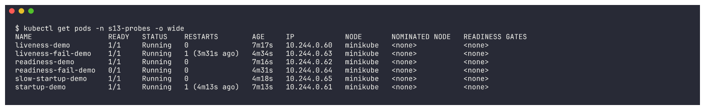

### 14-liveness-fail-restarts-later

```bash
kubectl get pod liveness-fail-demo -n s13-probes; kubectl describe pod liveness-fail-demo -n s13-probes | grep -E "Restart Count|Last State|Reason"
```

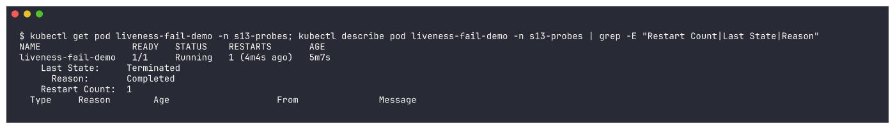

### 15-final-state

```bash
kubectl get pods -n s13-probes; kubectl get pod liveness-fail-demo -n s13-probes -o jsonpath="liveness-fail-demo restartCount={.status.containerStatuses[0].restartCount}"; echo
```


### 16-cleanup

```bash
kubectl delete namespace s13-probes --wait=false
```


## mini-project

### 01-namespace

```bash
kubectl apply -f namespace.yaml
```


### 02-pvc

```bash
kubectl apply -f pvc.yaml && sleep 5 && kubectl get pvc -n production-webapp
```


### 03-deploy-and-service

```bash
kubectl apply -f deployment.yaml && kubectl apply -f service.yaml && kubectl rollout status deployment/web-app -n production-webapp --timeout=240s && kubectl get pods -n production-webapp -o wide
```


### 04-hpa

```bash
kubectl apply -f hpa.yaml && kubectl get hpa -n production-webapp
```


### 05-get-all

```bash
kubectl get all,pvc -n production-webapp
```


### 06-describe-pod-probes

```bash
kubectl describe pod -n production-webapp -l app=web-app | grep -E "^Name:|Liveness|Readiness|Startup|Requests|Limits|cpu|memory|/data|ClaimName" | head -20
```


### 07-endpoints

```bash
kubectl describe svc web-service -n production-webapp | grep -E "Selector|TargetPort|Endpoints"
```


### 08-write-student-file

```bash
POD_NAME=$(kubectl get pods -n production-webapp -l app=web-app -o jsonpath="{.items[0].metadata.name}"); echo "pod: $POD_NAME"; kubectl exec -n production-webapp "$POD_NAME" -- sh -c "echo \"Student: Tanish Kothari\" > /data/student.txt"; kubectl exec -n production-webapp "$POD_NAME" -- cat /data/student.txt
```


### 09-delete-pod

```bash
POD_NAME=$(kubectl get pods -n production-webapp -l app=web-app -o jsonpath="{.items[0].metadata.name}"); kubectl delete pod -n production-webapp "$POD_NAME"; sleep 3; kubectl get pods -n production-webapp
```


### 10-data-survives

```bash
kubectl rollout status deployment/web-app -n production-webapp --timeout=180s; kubectl wait --for=condition=Ready pod -l app=web-app -n production-webapp --timeout=180s; kubectl get pods -n production-webapp; for p in $(kubectl get pods -n production-webapp -l app=web-app -o jsonpath="{.items[*].metadata.name}"); do echo "--- $p"; kubectl exec -n production-webapp $p -- cat /data/student.txt; done ...
```


### 11-port-forward-curl

```bash
(kubectl port-forward -n production-webapp svc/web-service 18080:80 >/tmp/pf-s13.log 2>&1 &) ; sleep 4; curl -s http://localhost:18080 | head -6; pkill -f "port-forward -n production-webapp svc/web-service 18080:80"; cat /tmp/pf-s13.log
```


### 12-hpa-baseline

```bash
kubectl get hpa -n production-webapp; kubectl top pods -n production-webapp
```


### 13-start-load

```bash
kubectl run load-generator -n production-webapp --image=busybox:1.36 --restart=Never -- /bin/sh -c "while true; do wget -q -O- http://web-service > /dev/null; done"; sleep 5; kubectl get pod load-generator -n production-webapp
```


### 14-hpa-during-load

```bash
date +%T; kubectl get hpa -n production-webapp; kubectl get pods -n production-webapp; kubectl top pods -n production-webapp; kubectl -n kube-system get pods -l k8s-app=metrics-server; kubectl describe hpa web-app-hpa -n production-webapp | grep -A4 "^Conditions:"
```


### 15-stop-load

```bash
kubectl delete pod load-generator -n production-webapp --wait=false
```


