# Task 3: Mini Project - Production-Ready Kubernetes Web App

The Session 13 capstone from the reference repo: a web app that combines everything from this session.

1. **State persistence** - a PVC so `/data` outlives Pod deletion.
2. **Elastic scaling** - an HPA on CPU (2 to 5 replicas, 50% target).
3. **Health checks** - startup, readiness and liveness probes.

```text
                      [ Service: web-service :80 ]
                                  |
                 +----------------+----------------+
                 v                                 v
         [ Pod: web-app-1 ]                [ Pod: web-app-2 ]   ... up to 5 (HPA)
         startup / readiness / liveness    startup / readiness / liveness
         requests 100m CPU, 64Mi           requests 100m CPU, 64Mi
                 |                                 |
                 +---------> /data <---------------+
                               |
                 PVC web-data (500Mi, RWO, StorageClass standard)
                               |
                 PV pvc-46143c7e-... (dynamically provisioned, k8s.io/minikube-hostpath)

         [ HPA web-app-hpa: min 2, max 5, 50% CPU ] <- metrics-server
```

## Files (from the reference repo, unchanged)

| File | Content |
|---|---|
| `namespace.yaml` | namespace `production-webapp` |
| `pvc.yaml` | PVC `web-data`, 500Mi, ReadWriteOnce (default StorageClass) |
| `deployment.yaml` | `web-app`: 2 x nginx:1.27, `strategy: Recreate`, CPU/memory requests+limits, `/data` from the PVC, startup + readiness + liveness HTTP probes |
| `service.yaml` | ClusterIP `web-service` :80 -> 80 |
| `hpa.yaml` | `web-app-hpa`: min 2, max 5, 50% CPU |

`strategy: Recreate` is there because the PVC is `ReadWriteOnce`: during a rolling update a new Pod
could land on another node and fail to attach the volume, so old Pods are stopped first.

---

## Step 1: Namespace
```bash
kubectl apply -f namespace.yaml
```
```text
namespace/production-webapp created
```
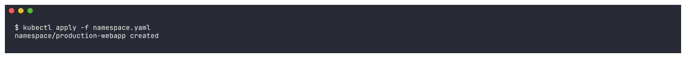

## Step 2: PersistentVolumeClaim
```bash
kubectl apply -f pvc.yaml && sleep 5 && kubectl get pvc -n production-webapp
```
```text
persistentvolumeclaim/web-data created
NAME       STATUS   VOLUME                                     CAPACITY   ACCESS MODES   STORAGECLASS   VOLUMEATTRIBUTESCLASS   AGE
web-data   Bound    pvc-46143c7e-ae75-4a7b-af80-74426243ba79   500Mi      RWO            standard       <unset>                 5s
```
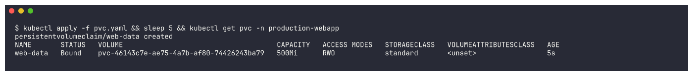

Bound within 5 seconds - dynamically provisioned by the default `standard` StorageClass.

## Step 3: Deployment and Service
```bash
kubectl apply -f deployment.yaml && kubectl apply -f service.yaml && kubectl rollout status deployment/web-app -n production-webapp --timeout=240s && kubectl get pods -n production-webapp -o wide
```
```text
deployment.apps/web-app created
service/web-service created
deployment "web-app" successfully rolled out
NAME                      READY   STATUS    RESTARTS   AGE   IP             NODE
web-app-d45775485-tqzgh   1/1     Running   0          10s   10.244.0.125   minikube
web-app-d45775485-z92fs   1/1     Running   0          10s   10.244.0.126   minikube
```
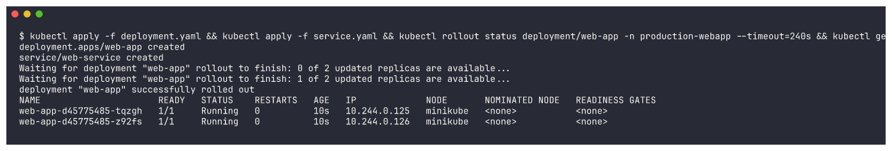

## Step 4: HPA
```bash
kubectl apply -f hpa.yaml && kubectl get hpa -n production-webapp
```
```text
horizontalpodautoscaler.autoscaling/web-app-hpa created
NAME          REFERENCE            TARGETS              MINPODS   MAXPODS   REPLICAS   AGE
web-app-hpa   Deployment/web-app   cpu: <unknown>/50%   2         5         2          1s
```
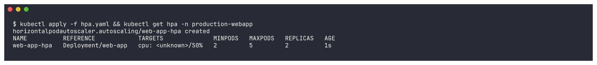

## Everything together
```bash
kubectl get all,pvc -n production-webapp
```
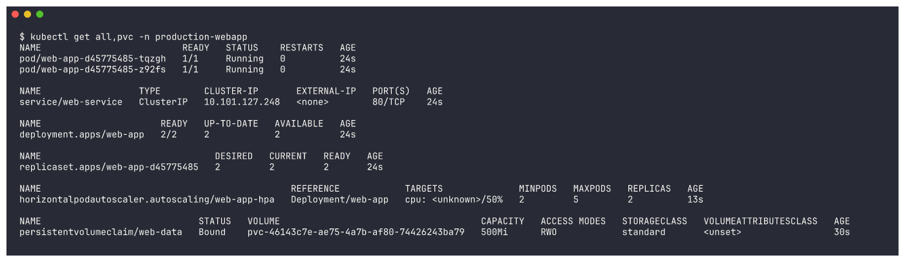

Probes, resources and the volume as Kubernetes sees them:
```bash
kubectl describe pod -n production-webapp -l app=web-app | grep -E "^Name:|Liveness|Readiness|Startup|Requests|Limits|cpu|memory|/data|ClaimName"
```
```text
Name:             web-app-d45775485-tqzgh
    Limits:
      cpu:     200m
      memory:  128Mi
    Requests:
      cpu:        100m
      memory:     64Mi
    Liveness:     http-get http://:80/ delay=5s timeout=2s period=5s successThreshold=1 failureThreshold=3
    Readiness:    http-get http://:80/ delay=5s timeout=2s period=5s successThreshold=1 failureThreshold=2
    Startup:      http-get http://:80/ delay=0s timeout=1s period=2s successThreshold=1 failureThreshold=30
      /data from persistent-storage (rw)
    ClaimName:  web-data
```
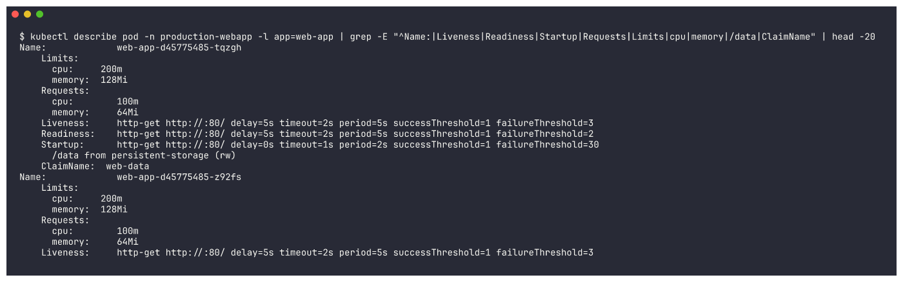

```bash
kubectl describe svc web-service -n production-webapp | grep -E "Selector|TargetPort|Endpoints"
```
```text
Selector:                 app=web-app
TargetPort:               80/TCP
Endpoints:                10.244.0.125:80,10.244.0.126:80
```
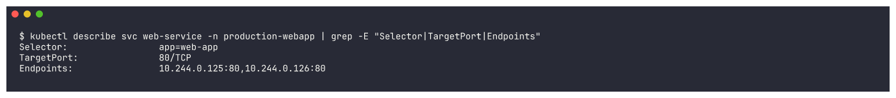

Both Pods passed their readiness probe, so both are Service endpoints.

---

## Verification Task 1: Storage persistence

Write a file through one Pod:
```bash
POD_NAME=$(kubectl get pods -n production-webapp -l app=web-app -o jsonpath="{.items[0].metadata.name}")
kubectl exec -n production-webapp "$POD_NAME" -- sh -c "echo \"Student: Tanish Kothari\" > /data/student.txt"
kubectl exec -n production-webapp "$POD_NAME" -- cat /data/student.txt
```
```text
pod: web-app-d45775485-tqzgh
Student: Tanish Kothari
```
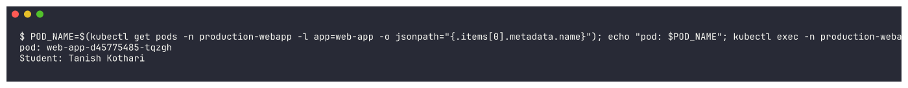

Delete that Pod - the Deployment immediately creates a replacement:
```bash
kubectl delete pod -n production-webapp "$POD_NAME"; sleep 3; kubectl get pods -n production-webapp
```
```text
pod "web-app-d45775485-tqzgh" deleted from production-webapp namespace
NAME                      READY   STATUS    RESTARTS   AGE
web-app-d45775485-79ppb   0/1     Running   0          4s
web-app-d45775485-z92fs   1/1     Running   0          34s
```
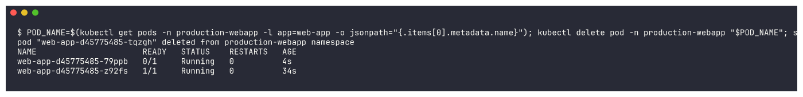

The new Pod is `0/1` for a few seconds - the startup/readiness probes hold it out of the Service until
nginx answers. Then read the file from **every** Pod:
```bash
for p in $(kubectl get pods -n production-webapp -l app=web-app -o jsonpath="{.items[*].metadata.name}"); do echo "--- $p"; kubectl exec -n production-webapp $p -- cat /data/student.txt; done
```
```text
--- web-app-d45775485-79ppb
Student: Tanish Kothari
--- web-app-d45775485-z92fs
Student: Tanish Kothari
```
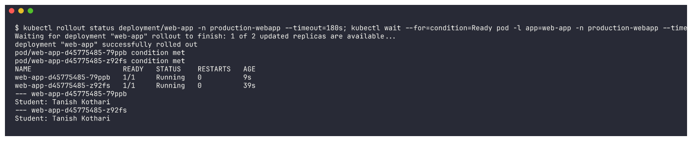

The brand-new Pod `79ppb` sees the file written by the deleted Pod `tqzgh`: the data lives on the
PersistentVolume, not in the container. (Both replicas share it because the hostpath volume is on the
single minikube node.)

## Verification Task 2: Service

```bash
kubectl port-forward -n production-webapp svc/web-service 18080:80 &
curl -s http://localhost:18080 | head -6
```
```text
<!DOCTYPE html>
<html>
<head>
<title>Welcome to nginx!</title>
Forwarding from 127.0.0.1:18080 -> 80
Handling connection for 18080
```
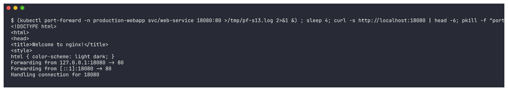

(Local port 18080 instead of 8080 because 8080 was already in use on this machine.)

## Verification Task 3: HPA under load

Baseline right after deploying (metrics not collected yet):
```bash
kubectl get hpa -n production-webapp; kubectl top pods -n production-webapp
```
```text
web-app-hpa   Deployment/web-app   cpu: <unknown>/50%   2         5         2          42s
error: metrics not available yet
```
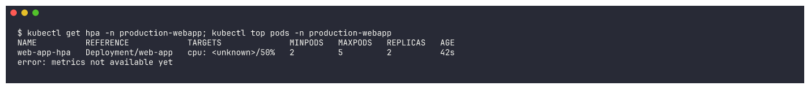

Start the load generator from the reference README:
```bash
kubectl run load-generator -n production-webapp --image=busybox:1.36 --restart=Never -- /bin/sh -c "while true; do wget -q -O- http://web-service > /dev/null; done"
```
```text
pod/load-generator created
NAME             READY   STATUS    RESTARTS   AGE
load-generator   1/1     Running   0          6s
```
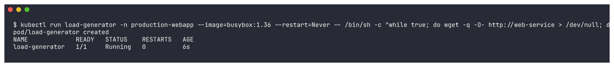

**Result: the HPA could not act here.** From this point on, the shared minikube node was so overloaded
that metrics-server stayed down (it went into `CrashLoopBackOff` because the kubelet took up to 71s to
serve metrics). 83 minutes later the HPA still had no CPU reading:
```bash
kubectl get hpa -n production-webapp; kubectl get pods -n production-webapp; kubectl top pods -n production-webapp
kubectl -n kube-system get pods -l k8s-app=metrics-server
kubectl describe hpa web-app-hpa -n production-webapp | grep -A4 "^Conditions:"
```
```text
00:54:41
web-app-hpa   Deployment/web-app   cpu: <unknown>/50%   2         5         2          84m
load-generator            1/1     Running            0                83m
web-app-d45775485-79ppb   0/1     Running            11 (36s ago)     84m
web-app-d45775485-z92fs   0/1     CrashLoopBackOff   10 (4m25s ago)   84m
error: Metrics API not available
metrics-server-768f9f6999-2ss5q   0/1     Running   21 (4m32s ago)   148m
  ScalingActive   False   FailedGetResourceMetric  the HPA was unable to compute the replica count: failed to get cpu utilization:
                  unable to get metrics for resource cpu: unable to fetch metrics from resource metrics API: the server is currently unable to handle the request
```
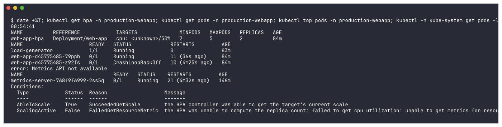

Two lessons in that output:

1. **No metrics -> no scaling.** `ScalingActive False / FailedGetResourceMetric`: the HPA keeps the
   current replica count when it cannot read the metric. (The same HPA logic *did* scale my
   [HPA hands-on](../02-hpa/README.md) app from 2 to 10 Pods while metrics-server was still up.)
2. **Liveness probes vs. an overloaded node.** The `web-app` Pods were restarted 10-11 times - nginx was
   fine, but under load on a starved node it answered the probe slower than `timeoutSeconds: 2`:

```bash
kubectl describe pod <web-app-pod> -n production-webapp | grep -E "Last State|Reason|Exit Code|Restart Count"
kubectl events -n production-webapp --for pod/<web-app-pod> --types=Warning | tail -6
```
```text
    Last State:     Terminated
      Reason:       Completed
      Exit Code:    0
    Restart Count:  11
Warning   NodeNotReady   Pod/web-app-d45775485-79ppb   Node is not ready
Warning   Unhealthy      Pod/web-app-d45775485-79ppb   Readiness probe failed: Get "http://10.244.0.130:80/": context deadline exceeded (Client.Timeout exceeded while awaiting headers)
Warning   Unhealthy      Pod/web-app-d45775485-79ppb   Liveness probe failed: Get "http://10.244.0.130:80/": context deadline exceeded (Client.Timeout exceeded while awaiting headers)
```
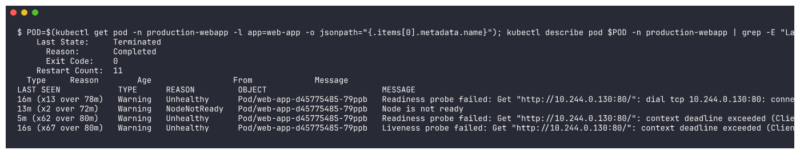

`Exit Code: 0` / `Completed` means nginx did not crash - the **kubelet killed it** because of the
liveness probe timeouts, which made capacity even worse. In production I would give the liveness probe a
larger `timeoutSeconds`/`failureThreshold` than the readiness probe (readiness should fail fast and
remove the Pod from traffic; liveness should only fire when the process is truly stuck).

Stop the load:
```bash
kubectl delete pod load-generator -n production-webapp --wait=false
```
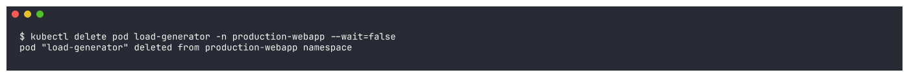

## Probe reference

| Probe | Question | On failure |
|---|---|---|
| Startup | Has the process finished initialising? | Restart after `30 x 2s`; other probes disabled until it passes |
| Readiness | Can it take traffic now? | Removed from Service endpoints (no restart) |
| Liveness | Is it alive? | Container restarted by the kubelet |

## Troubleshooting guide (from the reference, checked against what I saw)

| Symptom | Check | Cause / fix |
|---|---|---|
| PVC `Pending` | `kubectl describe pvc web-data -n production-webapp` | no default StorageClass / provisioner down -> `kubectl get sc` |
| HPA `TARGETS <unknown>/50%` | `kubectl top pods`, `kubectl -n kube-system get pods -l k8s-app=metrics-server` | metrics-server not serving (what happened here) or no `resources.requests.cpu` |
| Pods restarting, `Exit Code 0` | `kubectl events --for pod/<p>` | liveness probe failing/timing out -> fix path/port or relax `timeoutSeconds` |
