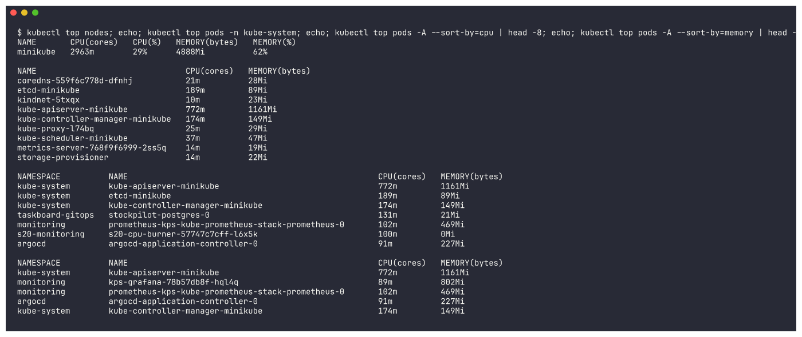

# Task 1: Kubernetes Troubleshooting Commands

Hands-on practice with the core troubleshooting commands: `get`, `describe`, `logs`, `exec`,
`events`, `explain`, `top` and `get -o wide`. Everything ran in the namespace `s14-commands` on minikube.

## Files

| File | Purpose |
|---|---|
| `web-pod.yaml` | `get-demo` nginx Pod (from the reference `01-kubectl-get`) |
| `logs-pod.yaml` | `logs-demo` busybox Pod that prints log lines every 5s (reference `03-kubectl-logs`) |
| `deployment.yaml` | `web` Deployment with 2 nginx replicas (exposed as Service `web`) |

## Setup

```bash
kubectl create namespace s14-commands && kubectl apply -n s14-commands -f web-pod.yaml -f logs-pod.yaml -f deployment.yaml && kubectl expose deployment web --port=80 -n s14-commands
```
```text
namespace/s14-commands created
pod/get-demo created
pod/logs-demo created
deployment.apps/web created
service/web exposed
```


```bash
kubectl wait --for=condition=Ready pod --all -n s14-commands --timeout=180s
```


---

## 1. `kubectl get` - "what is happening?"

Quick, one-line-per-object status. First command to run in any investigation.

```bash
kubectl get pods -n s14-commands
```
```text
NAME                   READY   STATUS    RESTARTS   AGE
get-demo               1/1     Running   0          4s
logs-demo              1/1     Running   0          4s
web-7f98c7b879-gz4x2   1/1     Running   0          4s
web-7f98c7b879-hh5wj   1/1     Running   0          4s
```


`READY` = ready containers / total, `STATUS` = phase or waiting reason (CrashLoopBackOff, ImagePullBackOff...),
`RESTARTS` = container restarts (a rising number is a red flag).

### `kubectl get -o wide` - extra columns: Pod IP and node
```bash
kubectl get pods -n s14-commands -o wide
```
```text
NAME                   READY   STATUS    RESTARTS   AGE   IP             NODE       NOMINATED NODE   READINESS GATES
get-demo               1/1     Running   0          6s    10.244.0.140   minikube   <none>           <none>
logs-demo              1/1     Running   0          6s    10.244.0.142   minikube   <none>           <none>
web-7f98c7b879-gz4x2   1/1     Running   0          6s    10.244.0.143   minikube   <none>           <none>
web-7f98c7b879-hh5wj   1/1     Running   0          6s    10.244.0.141   minikube   <none>           <none>
```


The Pod IP is what you test connectivity against; the node tells you where to look for node problems.

```bash
kubectl get nodes -o wide; kubectl get svc,endpoints -n s14-commands -o wide
```
```text
NAME       STATUS   ROLES           AGE   VERSION   INTERNAL-IP    EXTERNAL-IP   OS-IMAGE                         KERNEL-VERSION             CONTAINER-RUNTIME
minikube   Ready    control-plane   67m   v1.37.0   192.168.49.2   <none>        Debian GNU/Linux 12 (bookworm)   6.12.65-linuxkit (arm64)   containerd://2.3.4

NAME          TYPE        CLUSTER-IP     EXTERNAL-IP   PORT(S)   AGE   SELECTOR
service/web   ClusterIP   10.102.169.5   <none>        80/TCP    15s   app=web

NAME            ENDPOINTS                         AGE
endpoints/web   10.244.0.141:80,10.244.0.143:80   15s
```


`-o wide` on a Service shows its **selector**, and the endpoints are the Pod IPs it actually sends traffic to.

### Other useful `get` forms
```bash
kubectl get all -n s14-commands
```


```bash
kubectl get pods -n s14-commands --show-labels; kubectl get pods -n s14-commands -l app=web
```
```text
NAME                   READY   STATUS    RESTARTS   AGE   LABELS
get-demo               1/1     Running   0          9s    app=get-demo
logs-demo              1/1     Running   0          9s    <none>
web-7f98c7b879-gz4x2   1/1     Running   0          9s    app=web,pod-template-hash=7f98c7b879
web-7f98c7b879-hh5wj   1/1     Running   0          9s    app=web,pod-template-hash=7f98c7b879
```


```bash
kubectl get pod get-demo -n s14-commands -o yaml | head -45      # the full object as stored in the API
```


```bash
kubectl get pods -n s14-commands -o custom-columns=NAME:.metadata.name,STATUS:.status.phase,IP:.status.podIP,NODE:.spec.nodeName,IMAGE:.spec.containers[0].image
```
```text
NAME                   STATUS    IP             NODE       IMAGE
get-demo               Running   10.244.0.140   minikube   nginx:1.27
logs-demo              Running   10.244.0.142   minikube   busybox:1.36
web-7f98c7b879-gz4x2   Running   10.244.0.143   minikube   nginx:1.27
web-7f98c7b879-hh5wj   Running   10.244.0.141   minikube   nginx:1.27
```


---

## 2. `kubectl describe` - "why is it in this state?"

Human-readable detail of one object: configuration, container state, conditions, volumes and
**Events** at the bottom (usually where the answer is).

```bash
kubectl describe pod get-demo -n s14-commands
```
```text
Name:             get-demo
Namespace:        s14-commands
Node:             minikube/192.168.49.2
Status:           Running
IP:               10.244.0.140
Containers:
  nginx:
    Image:          nginx:1.27
    State:          Running
    Ready:          True
    Restart Count:  0
Conditions:
  Ready                       True
QoS Class:                   BestEffort
Events:
  Normal  Scheduled  25s   default-scheduler  Successfully assigned s14-commands/get-demo to minikube
  Normal  Pulled     24s   kubelet            spec.containers{nginx}: Container image "nginx:1.27" already present on machine ...
  Normal  Created    24s   kubelet            spec.containers{nginx}: Container created
  Normal  Started    24s   kubelet            spec.containers{nginx}: Container started
```


```bash
kubectl describe deployment web -n s14-commands
```


```bash
kubectl describe service web -n s14-commands
```
```text
Selector:                 app=web
TargetPort:               80/TCP
Endpoints:                10.244.0.143:80,10.244.0.141:80
```


```bash
kubectl describe node minikube | grep -A12 "Allocated resources"
```
```text
  Resource           Requests      Limits
  cpu                4150m (41%)   10100m (101%)
  memory             2638Mi (33%)  6780Mi (86%)
```


`describe node` shows how much CPU/memory is already **requested** - the scheduler uses this, which is why
Pods go `Pending` with "Insufficient cpu".

---

## 3. `kubectl logs` - "what did the application say?"

```bash
kubectl logs logs-demo -n s14-commands
```
```text
Application started
Connecting to database...
Database connection successful
Application is running
Application is healthy
...
```


```bash
kubectl logs logs-demo -n s14-commands --tail=3 --timestamps
```
```text
2026-10-07T18:02:52.408710959Z Application is healthy
2026-10-07T18:02:57.409741753Z Application is healthy
2026-10-07T18:03:02.409462381Z Application is healthy
```


Follow live logs (`-f`), stopped after 12 seconds:
```bash
kubectl logs -f logs-demo -n s14-commands --since=5s & PID=$!; sleep 12; kill $PID
```


Logs of a Deployment / of every Pod matching a label:
```bash
kubectl exec get-demo -n s14-commands -- curl -s -o /dev/null http://web
kubectl logs deployment/web -n s14-commands --tail=3
kubectl logs -l app=web -n s14-commands --tail=2 --prefix
```
```text
[pod/web-7f98c7b879-hh5wj/nginx] 10.244.0.140 - - [07/Oct/2026:18:03:10 +0000] "GET / HTTP/1.1" 200 615 "-" "curl/7.88.1" "-"
```


The access-log line shows the request I sent from `get-demo` (10.244.0.140) through the Service.
`kubectl logs --previous` (logs of the *crashed* container) is shown in
[02-crashloopbackoff](../02-crashloopbackoff/README.md).

---

## 4. `kubectl exec` - "let me look from inside"

Run a command inside a running container.
```bash
kubectl exec get-demo -n s14-commands -- nginx -v
kubectl exec get-demo -n s14-commands -- hostname
kubectl exec get-demo -n s14-commands -- cat /etc/resolv.conf
```
```text
nginx version: nginx/1.27.5
get-demo
search s14-commands.svc.cluster.local svc.cluster.local cluster.local
nameserver 10.96.0.10
options ndots:5
```


```bash
kubectl exec get-demo -n s14-commands -- curl -s localhost | head -4
```


An interactive-style shell session (`kubectl exec -it <pod> -- sh` in a terminal; here the commands are
fed on stdin):
```bash
kubectl exec -i get-demo -n s14-commands -- sh <<EOF
echo "--- inside container: \$(hostname)"
ls /usr/share/nginx/html
echo "KUBERNETES_SERVICE_HOST=\$KUBERNETES_SERVICE_HOST  WEB_SERVICE_HOST=\$WEB_SERVICE_HOST"
curl -s -o /dev/null -w "web service HTTP %{http_code}\n" http://web
exit
EOF
```
```text
--- inside container: get-demo
50x.html
index.html
KUBERNETES_SERVICE_HOST=10.96.0.1  WEB_SERVICE_HOST=10.102.169.5
web service HTTP 200
```


> The first time I ran this, the last line printed `web service HTTP 000` with curl exit code 6
> ("could not resolve host"): the overloaded node had just gone `NotReady` and CoreDNS was unready.
> Re-running after the node recovered gave `HTTP 200`. A good reminder to check cluster health
> (`kubectl get nodes`, `kubectl get pods -n kube-system`) when "everything" suddenly breaks.

---

## 5. Events - `kubectl events` / `kubectl get events`

Events are short-lived records (kept ~1 hour) of what the scheduler, kubelet and controllers did.
```bash
kubectl events -n s14-commands | tail -15
```
```text
20m         Normal    Started             Pod/web-7f98c7b879-hh5wj    Container started
11m         Warning   NodeNotReady        Pod/logs-demo               Node is not ready
11m         Warning   NodeNotReady        Pod/web-7f98c7b879-gz4x2    Node is not ready
10m         Warning   NodeNotReady        Pod/web-7f98c7b879-hh5wj    Node is not ready
10m         Warning   NodeNotReady        Pod/get-demo                Node is not ready
```


Events for one object, and only warnings:
```bash
kubectl events -n s14-commands --for pod/get-demo
kubectl get events -n s14-commands --field-selector type=Warning --sort-by=.lastTimestamp | tail -5
```


The events captured a real incident: the shared minikube node went `NotReady` (host overloaded) and
every Pod got a `NodeNotReady` warning.

---

## 6. `kubectl explain` - built-in API documentation

When you don't remember a field name or what it does:
```bash
kubectl explain pod.spec.containers.livenessProbe | head -30
```
```text
FIELD: livenessProbe <Probe>
DESCRIPTION:
    Periodic probe of container liveness. Container will be restarted if the
    probe fails. Cannot be updated.
FIELDS:
  exec	<ExecAction>
  failureThreshold	<integer>
  grpc	<GRPCAction>
  httpGet	<HTTPGetAction>
  initialDelaySeconds	<integer>
```


```bash
kubectl explain deployment.spec.strategy; kubectl explain service.spec --recursive | head -25
```


---

## 7. `kubectl top` - live CPU / memory (needs metrics-server)

metrics-server was crash-looping on the overloaded node for most of the session (`error: Metrics API
not available`), so this was captured later, once it was serving again (the `s14-commands` namespace was
already deleted, so the Pod view uses `kube-system` and all namespaces):
```bash
kubectl top nodes
kubectl top pods -n kube-system
kubectl top pods -A --sort-by=cpu | head -8
kubectl top pods -A --sort-by=memory | head -6
```
```text
NAME       CPU(cores)   CPU(%)   MEMORY(bytes)   MEMORY(%)
minikube   2963m        29%      4888Mi          62%

NAME                               CPU(cores)   MEMORY(bytes)
coredns-559f6c778d-dfnhj           21m          28Mi
etcd-minikube                      189m         89Mi
kube-apiserver-minikube            772m         1161Mi
metrics-server-768f9f6999-2ss5q    14m          19Mi
...
NAMESPACE          NAME                                                    CPU(cores)   MEMORY(bytes)
kube-system        kube-apiserver-minikube                                 772m         1161Mi
kube-system        etcd-minikube                                           189m         89Mi
kube-system        kube-controller-manager-minikube                        174m         149Mi
taskboard-gitops   stockpilot-postgres-0                                   131m         21Mi
monitoring         prometheus-kps-kube-prometheus-stack-prometheus-0       102m         469Mi
...
NAMESPACE          NAME                                                    CPU(cores)   MEMORY(bytes)
kube-system        kube-apiserver-minikube                                 772m         1161Mi
monitoring         kps-grafana-78b57db8f-hql4q                             89m          802Mi
monitoring         prometheus-kps-kube-prometheus-stack-prometheus-0       102m         469Mi
```


`--sort-by=cpu|memory` is the quickest way to find the noisy neighbour: here the API server
(772m CPU, 1.1Gi) and the monitoring stack were the heaviest consumers on the shared node.

---

## Cleanup

```bash
kubectl delete namespace s14-commands s14-crash s14-image s14-pending s14-cc s14-svc --wait=false
```


## Cheat sheet

| Command | Use it to answer |
|---|---|
| `kubectl get pods -o wide` | What is the status, IP and node of each Pod? |
| `kubectl describe pod <p>` | Why is it Pending / not Ready / restarting? (read **Events**) |
| `kubectl logs <p> [--previous] [-f]` | What did the app print (before it crashed)? |
| `kubectl exec -it <p> -- sh` | What does the world look like from inside the container? |
| `kubectl events --for pod/<p>` | What did Kubernetes do to this object, in order? |
| `kubectl explain <path>` | What does this YAML field mean / what fields exist? |
| `kubectl top pods/nodes` | Who is using the CPU/memory right now? |
