# Session 14: Kubernetes Troubleshooting

> Work in progress: the full write-up for this session is being finalised. Every screenshot below is real output from commands run on a local minikube cluster / Docker / GitHub Actions.

## 01-kubectl-commands

### 01-setup

```bash
kubectl create namespace s14-commands && kubectl apply -n s14-commands -f web-pod.yaml -f logs-pod.yaml -f deployment.yaml && kubectl expose deployment web --port=80 -n s14-commands
```


### 02-wait

```bash
kubectl wait --for=condition=Ready pod --all -n s14-commands --timeout=180s
```


### 03-get-pods

```bash
kubectl get pods -n s14-commands
```


### 04-get-pods-wide

```bash
kubectl get pods -n s14-commands -o wide
```


### 05-get-all

```bash
kubectl get all -n s14-commands
```


### 06-get-labels

```bash
kubectl get pods -n s14-commands --show-labels; echo; kubectl get pods -n s14-commands -l app=web
```


### 07-get-yaml

```bash
kubectl get pod get-demo -n s14-commands -o yaml | head -45
```


### 08-get-jsonpath

```bash
kubectl get pods -n s14-commands -o custom-columns=NAME:.metadata.name,STATUS:.status.phase,IP:.status.podIP,NODE:.spec.nodeName,IMAGE:.spec.containers[0].image
```


### 09-get-nodes-wide

```bash
kubectl get nodes -o wide; echo; kubectl get svc,endpoints -n s14-commands -o wide
```


### 10-describe-pod

```bash
kubectl describe pod get-demo -n s14-commands
```


### 11-describe-deployment

```bash
kubectl describe deployment web -n s14-commands
```


### 12-describe-service

```bash
kubectl describe service web -n s14-commands
```


### 13-describe-node

```bash
kubectl describe node minikube | grep -A12 "Allocated resources"
```


### 14-logs

```bash
kubectl logs logs-demo -n s14-commands
```


### 15-logs-tail-timestamps

```bash
kubectl logs logs-demo -n s14-commands --tail=3 --timestamps
```


### 16-logs-follow

```bash
kubectl logs -f logs-demo -n s14-commands --since=5s & PID=$!; sleep 12; kill $PID; echo "(stopped following after 12s)"
```


### 17-logs-deployment-label

```bash
kubectl exec get-demo -n s14-commands -- curl -s -o /dev/null http://web; kubectl logs deployment/web -n s14-commands --tail=3; echo; kubectl logs -l app=web -n s14-commands --tail=2 --prefix
```


### 18-exec-commands

```bash
kubectl exec get-demo -n s14-commands -- nginx -v; kubectl exec get-demo -n s14-commands -- hostname; kubectl exec get-demo -n s14-commands -- cat /etc/resolv.conf
```

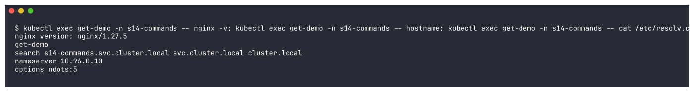

### 19-exec-curl-localhost

```bash
kubectl exec get-demo -n s14-commands -- curl -s localhost | head -4
```

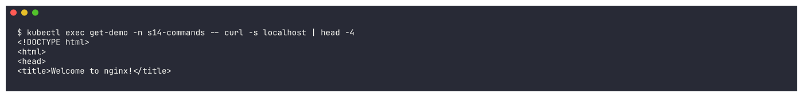

### 20-exec-shell

```bash
kubectl exec -i get-demo -n s14-commands -- sh <<EOF
```

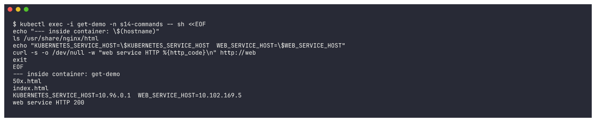

### 21-events

```bash
kubectl events -n s14-commands | tail -15
```

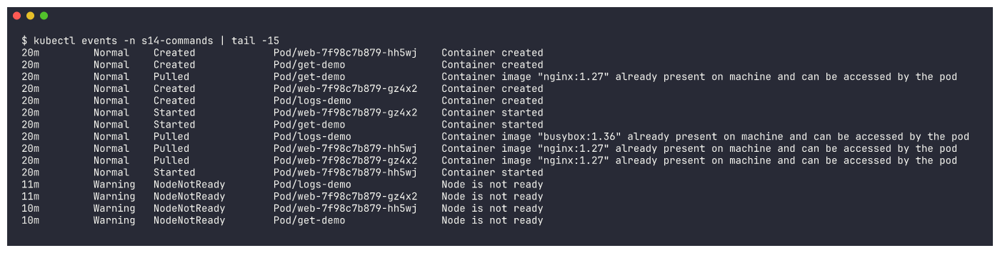

### 22-events-for-pod-and-warnings

```bash
kubectl events -n s14-commands --for pod/get-demo; echo; kubectl get events -n s14-commands --field-selector type=Warning --sort-by=.lastTimestamp | tail -5
```

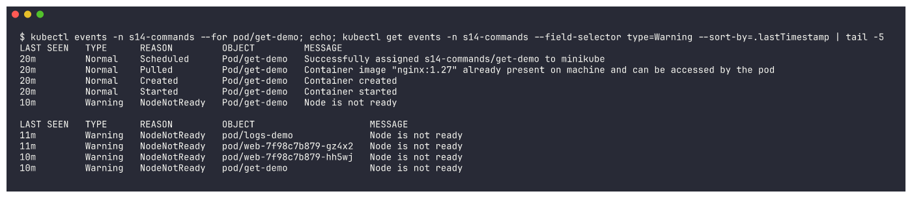

### 23-explain-pod

```bash
kubectl explain pod.spec.containers.livenessProbe | head -30
```

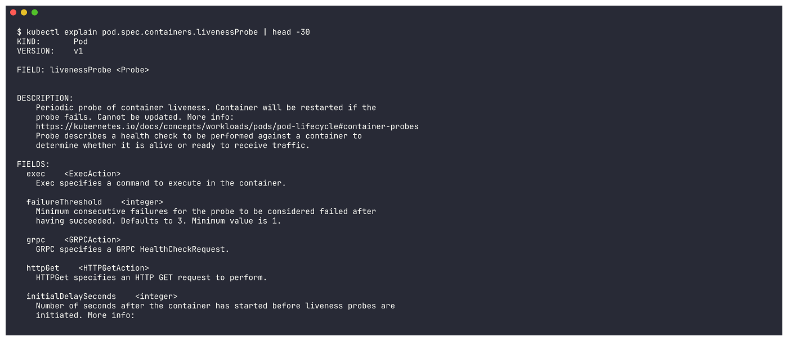

### 24-explain-deployment

```bash
kubectl explain deployment.spec.strategy; echo; kubectl explain service.spec --recursive | head -25
```

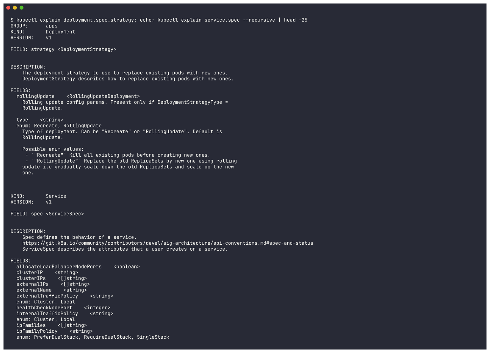

### 26-cleanup

```bash
kubectl delete namespace s14-commands s14-crash s14-image s14-pending s14-cc s14-svc --wait=false
```

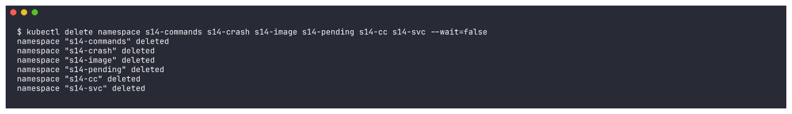

## 02-crashloopbackoff

### 01-apply-broken

```bash
kubectl create namespace s14-crash && kubectl apply -n s14-crash -f broken-pod.yaml -f broken-app-missing-env.yaml
```

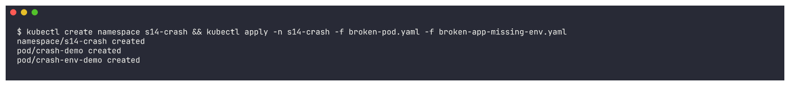

### 02-get-pods-crashloop

```bash
kubectl get pods -n s14-crash
```

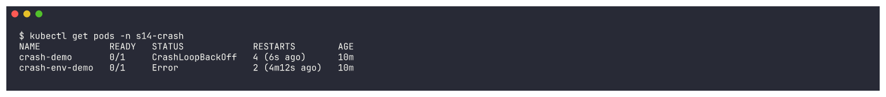

### 03-describe

```bash
kubectl describe pod crash-demo -n s14-crash | grep -E -A5 "^    State:|Last State:|Restart Count" | head -16; echo ...; kubectl describe pod crash-demo -n s14-crash | grep -A12 "^Events:"
```

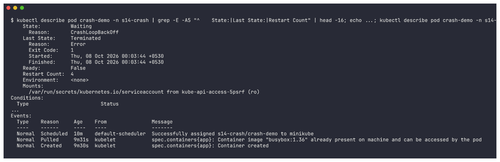

### 04-logs-previous

```bash
kubectl logs crash-demo -n s14-crash --previous
```

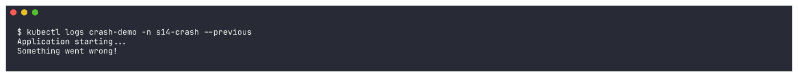

### 05-logs-env-app

```bash
kubectl logs crash-env-demo -n s14-crash --previous; kubectl get pod crash-env-demo -n s14-crash -o jsonpath="{.status.containerStatuses[0].lastState.terminated.reason} exitCode={.status.containerStatuses[0].lastState.terminated.exitCode}"; echo
```

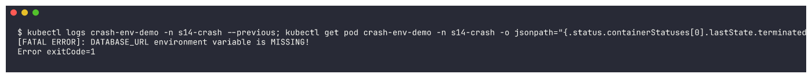

### 06-fix-delete-apply

```bash
kubectl delete pod crash-demo crash-env-demo -n s14-crash && kubectl apply -n s14-crash -f fixed-pod.yaml -f fixed-app-with-env.yaml
```

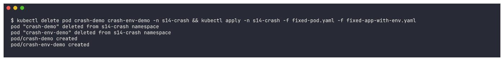

### 07-verify-fixed

```bash
kubectl get pods -n s14-crash; echo; kubectl logs crash-demo -n s14-crash; kubectl logs crash-env-demo -n s14-crash
```

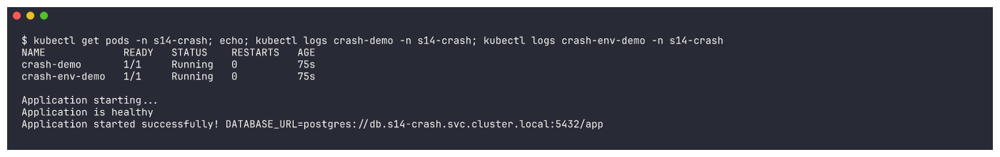

## 03-imagepullbackoff-errimagepull

### 01-apply-broken

```bash
kubectl create namespace s14-image && kubectl apply -n s14-image -f broken-pod.yaml -f broken-pod-bad-repo.yaml
```

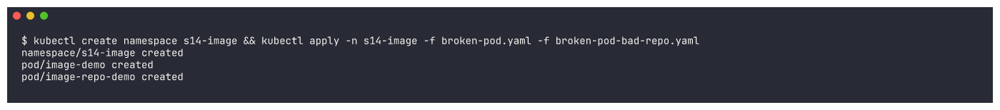

### 02-get-pods-errimagepull

```bash
kubectl get pods -n s14-image
```

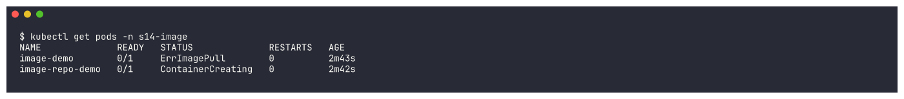

### 03-describe-events

```bash
kubectl get pods -n s14-image; echo; kubectl describe pod image-demo -n s14-image | grep -E -A3 "^    State:"; kubectl describe pod image-demo -n s14-image | grep -A10 "^Events:"
```

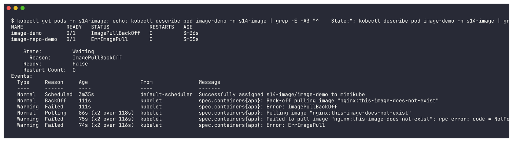

### 04-describe-bad-repo

```bash
kubectl describe pod image-repo-demo -n s14-image | grep -E "Image:|Reason:"; kubectl events -n s14-image --for pod/image-repo-demo | tail -5
```

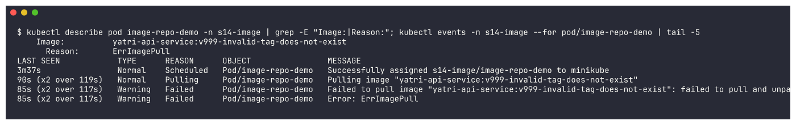

### 05-check-tag-exists

```bash
minikube ssh "sudo crictl pull nginx:1.27" 2>&1 | tail -1; minikube ssh "sudo crictl pull nginx:this-image-does-not-exist" 2>&1 | grep -o "not found" | head -1
```

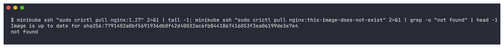

### 06-fix

```bash
kubectl delete pod image-demo -n s14-image && kubectl apply -n s14-image -f fixed-pod.yaml && kubectl set image pod/image-repo-demo web-app=nginx:1.27 -n s14-image
```

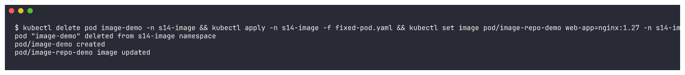

### 07-verify

```bash
kubectl get pods -n s14-image; kubectl get pod image-repo-demo -n s14-image -o jsonpath="image-repo-demo image now: {.spec.containers[0].image}"; echo
```

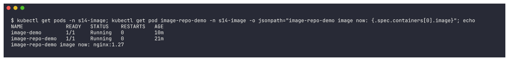

## 04-pending

### 01-apply-broken

```bash
kubectl create namespace s14-pending && kubectl apply -n s14-pending -f broken-pod.yaml -f broken-pod-resources.yaml
```

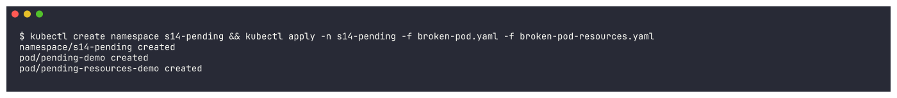

### 02-get-pods-pending

```bash
kubectl get pods -n s14-pending -o wide
```

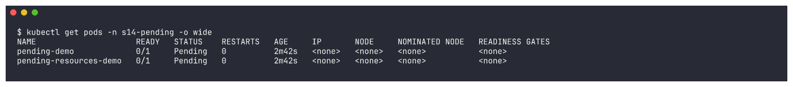

### 03-describe-nodeselector

```bash
kubectl describe pod pending-demo -n s14-pending | grep -E "Node-Selectors|Status:" ; kubectl describe pod pending-demo -n s14-pending | grep -A5 "^Events:"
```

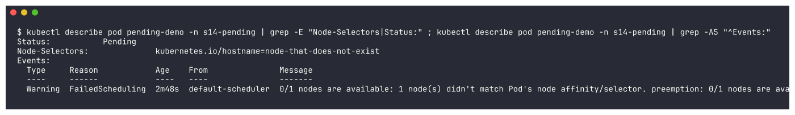

### 04-describe-resources

```bash
kubectl describe pod pending-resources-demo -n s14-pending | grep -A4 "Requests:"; kubectl describe pod pending-resources-demo -n s14-pending | grep -A5 "^Events:"
```

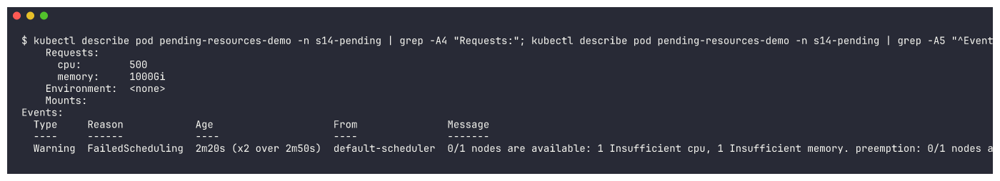

### 05-node-labels-capacity

```bash
kubectl get nodes --show-labels | tr "," "\n" | grep -E "NAME|hostname"; kubectl describe node minikube | grep -A3 "^Allocatable:"; kubectl describe node minikube | grep -A4 "Allocated resources:"
```

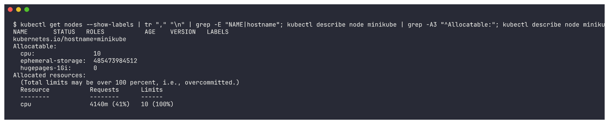

### 06-fix

```bash
kubectl delete pod pending-demo pending-resources-demo -n s14-pending && kubectl apply -n s14-pending -f fixed-pod.yaml -f fixed-pod-resources.yaml
```

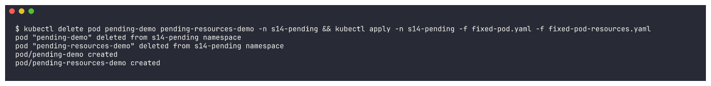

### 07-verify

```bash
kubectl get pods -n s14-pending -o wide
```

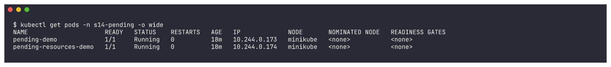

## 05-containercreating

### 01-apply-broken

```bash
kubectl create namespace s14-cc && kubectl apply -n s14-cc -f broken-pod.yaml
```

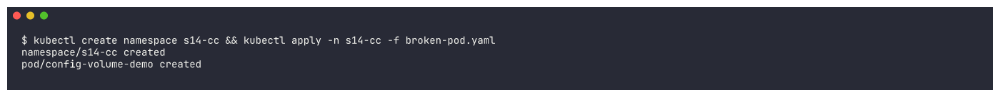

### 02-get-pods

```bash
kubectl get pods -n s14-cc
```

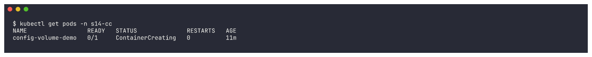

### 03-describe

```bash
kubectl describe pod config-volume-demo -n s14-cc | grep -E -A3 "^    State:"; kubectl describe pod config-volume-demo -n s14-cc | grep -A8 "^Volumes:"; kubectl describe pod config-volume-demo -n s14-cc | grep -A8 "^Events:"
```

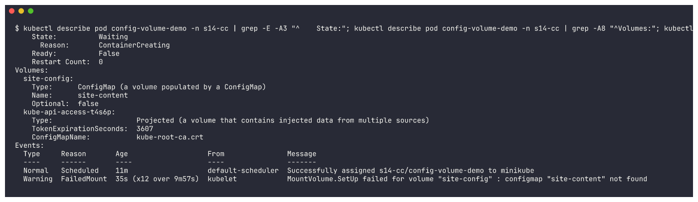

### 04-check-configmap

```bash
kubectl get configmap -n s14-cc; kubectl get configmap site-content -n s14-cc
```

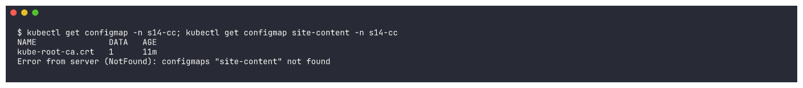

### 05-fix-create-configmap

```bash
kubectl apply -n s14-cc -f configmap.yaml
```

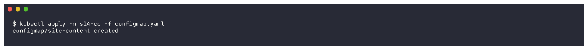

### 06-verify

```bash
kubectl get pods -n s14-cc; kubectl describe pod config-volume-demo -n s14-cc | grep -A6 "^Events:" | tail -3; kubectl exec config-volume-demo -n s14-cc -- curl -s localhost
```

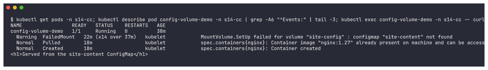

## 06-service-connectivity

### 01-apply-app-broken-service

```bash
kubectl create namespace s14-svc && kubectl apply -n s14-svc -f deployment.yaml -f broken-service-selector.yaml -f client-pod.yaml
```

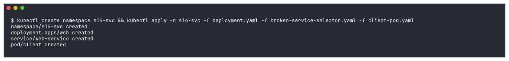

### 02-get-all

```bash
kubectl get pods,svc -n s14-svc -o wide --show-labels
```

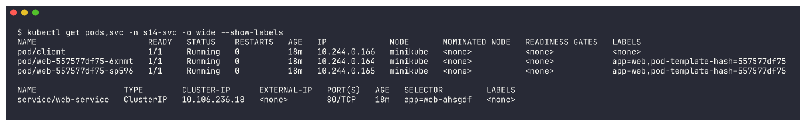

### 03-test-connection

```bash
kubectl exec client -n s14-svc -- curl -s -m 5 http://web-service; echo "curl exit code: $?"
```

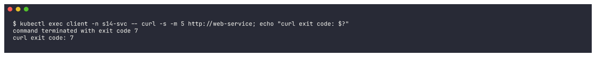

### 04-endpoints-empty

```bash
kubectl get endpointslices -n s14-svc -l kubernetes.io/service-name=web-service; kubectl describe svc web-service -n s14-svc | grep -E "Selector|TargetPort|Endpoints"
```

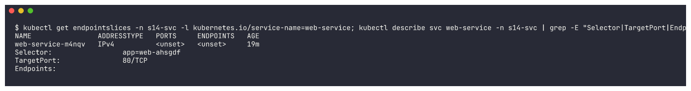

### 05-compare-labels

```bash
kubectl get pods -n s14-svc -l app=web --show-labels; echo; kubectl get pods -n s14-svc -l app=web-ahsgdf
```

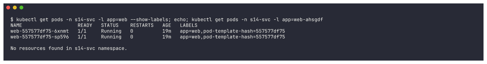

### 06-apply-targetport-bug

```bash
kubectl apply -n s14-svc -f broken-service-targetport.yaml && sleep 3 && kubectl describe svc web-service -n s14-svc | grep -E "Selector|TargetPort|Endpoints"
```

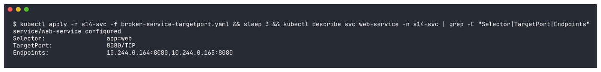

### 07-test-connection-refused

```bash
kubectl exec client -n s14-svc -- curl -sS -m 5 http://web-service; echo "curl exit code: $?"; POD=$(kubectl get pod -n s14-svc -l app=web -o jsonpath="{.items[0].metadata.name}"); kubectl get pod $POD -n s14-svc -o jsonpath="{.spec.containers[0].ports}"; echo; kubectl exec $POD -n s14-svc -- sh -c "cat /proc/net/tcp | awk 'NR>1 && \$4==\"0A\" {print \$2}'"
```

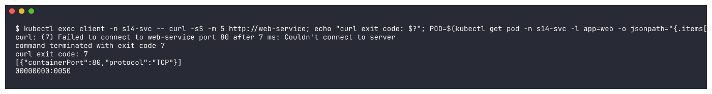

### 08-fix

```bash
kubectl apply -n s14-svc -f fixed-service.yaml && sleep 3 && kubectl describe svc web-service -n s14-svc | grep -E "Selector|TargetPort|Endpoints"
```

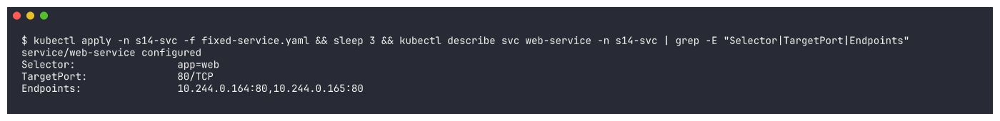

### 09-verify

```bash
kubectl exec client -n s14-svc -- curl -s -m 5 http://web-service | head -4; kubectl exec client -n s14-svc -- curl -s -m 5 -o /dev/null -w "HTTP %{http_code} from web-service.s14-svc.svc.cluster.local\n" http://web-service.s14-svc.svc.cluster.local
```

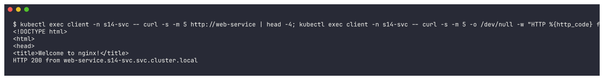

## 07-dns

### 01-apply-backend-and-broken-frontend

```bash
kubectl apply -f backend.yaml -f broken-frontend.yaml -f dns-test-pod.yaml
```

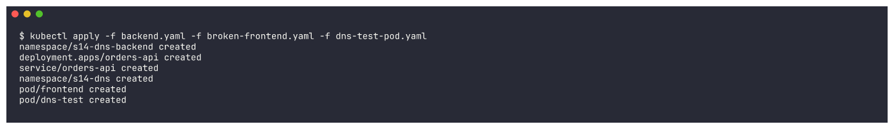

### 02-get-pods-logs

```bash
kubectl get pods -n s14-dns; kubectl get pods -n s14-dns-backend; echo; kubectl logs frontend -n s14-dns --tail=6
```

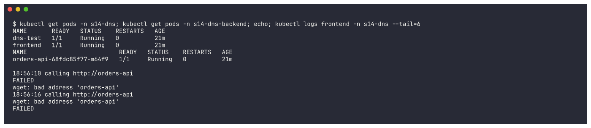

### 03-nslookup-short-name

```bash
kubectl exec dns-test -n s14-dns -- nslookup orders-api; echo "exit: $?"; kubectl exec dns-test -n s14-dns -- cat /etc/resolv.conf
```

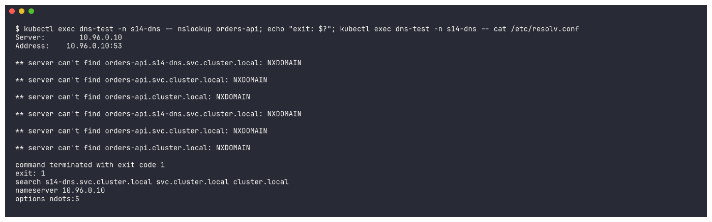

### 04-find-service

```bash
kubectl get svc -A | grep -E "NAMESPACE|orders-api"
```

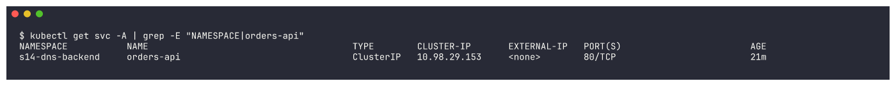

### 05-nslookup-fqdn

```bash
kubectl get pods -n kube-system -l k8s-app=kube-dns; kubectl exec dns-test -n s14-dns -- nslookup orders-api.s14-dns-backend.svc.cluster.local; kubectl exec dns-test -n s14-dns -- nslookup orders-api.s14-dns-backend
```

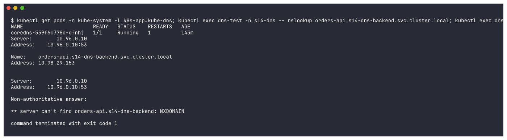

### 06-coredns-health

```bash
kubectl get pods -n kube-system -l k8s-app=kube-dns; kubectl get svc kube-dns -n kube-system; kubectl get endpointslices -n kube-system -l kubernetes.io/service-name=kube-dns; kubectl exec dns-test -n s14-dns -- nslookup kubernetes.default
```

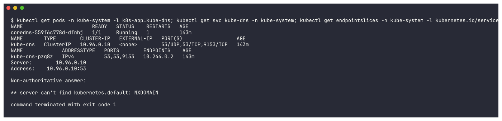

### 07-fix

```bash
kubectl delete pod frontend -n s14-dns && kubectl apply -f fixed-frontend.yaml && kubectl wait --for=condition=Ready pod/frontend -n s14-dns --timeout=240s
```


### 08-verify

```bash
kubectl get pod frontend -n s14-dns -o jsonpath="BACKEND_URL={.spec.containers[0].env[0].value}"; echo; kubectl logs frontend -n s14-dns --tail=6
```


## 08-pod-networking

### 01-apply-broken-server

```bash
kubectl create namespace s14-net && kubectl apply -n s14-net -f broken-server.yaml -f client-pod.yaml
```


### 02-get-pods

```bash
kubectl wait --for=condition=Ready pod --all -n s14-net --timeout=240s >/dev/null; kubectl get pods -n s14-net -o wide
```


### 03-client-cannot-connect

```bash
IP=$(kubectl get pod api-server -n s14-net -o jsonpath="{.status.podIP}"); echo "api-server pod IP: $IP"; kubectl exec client -n s14-net -- curl -sS -m 5 http://$IP:8080/; echo "curl exit code: $?"
```


### 04-works-inside-pod

```bash
kubectl exec api-server -n s14-net -- wget -qO- http://localhost:8080/ | head -3
```


### 05-netstat

```bash
kubectl exec api-server -n s14-net -- netstat -tln; kubectl get pod api-server -n s14-net -o jsonpath="{.spec.containers[0].command}"; echo
```


### 06-fix

```bash
kubectl delete pod api-server -n s14-net && kubectl apply -n s14-net -f fixed-server.yaml && kubectl wait --for=condition=Ready pod/api-server -n s14-net --timeout=300s && kubectl get pods -n s14-net -o wide
```


### 07-verify

```bash
kubectl get pods -n s14-net -o wide; IP=$(kubectl get pod api-server -n s14-net -o jsonpath="{.status.podIP}"); echo "api-server pod IP: $IP"; kubectl exec client -n s14-net -- curl -sS -m 5 http://$IP:8080/ | head -4; kubectl exec api-server -n s14-net -- netstat -tln; kubectl logs api-server -n s14-net
```


### 08-apply-deny-all

```bash
kubectl apply -n s14-net -f deny-all-networkpolicy.yaml && kubectl get networkpolicy -n s14-net && sleep 10 && IP=$(kubectl get pod api-server -n s14-net -o jsonpath="{.status.podIP}"); kubectl exec client -n s14-net -- curl -sS -m 5 -o /dev/null -w "HTTP %{http_code}\n" http://$IP:8080/; echo "curl exit code: $?"
```


### 09-investigate-netpol

```bash
kubectl get networkpolicy -n s14-net; kubectl describe networkpolicy default-deny-ingress -n s14-net; kubectl get pods -n s14-net --show-labels
```


### 10-fix-allow-policy

```bash
kubectl apply -n s14-net -f allow-client-networkpolicy.yaml && kubectl describe networkpolicy allow-client-to-api -n s14-net | sed -n "1,20p"
```


### 11-verify-allowed

```bash
sleep 5; IP=$(kubectl get pod api-server -n s14-net -o jsonpath="{.status.podIP}"); kubectl exec client -n s14-net -- curl -sS -m 5 -o /dev/null -w "client (role=client) -> api-server: HTTP %{http_code}\n" http://$IP:8080/; kubectl run intruder -n s14-net --image=curlimages/curl:8.6.0 --restart=Never --rm -i -- curl -sS -m 5 -o /dev/null -w "intruder (no label) -> api-server: HTTP %{http_code}\n"  ...
```


## 09-configuration

### 01-apply-broken

```bash
kubectl create namespace s14-config && kubectl apply -n s14-config -f broken-deployment.yaml
```


### 02-get-pods

```bash
kubectl get pods -n s14-config
```


### 03-describe

```bash
kubectl describe pod -n s14-config -l app=config-app | grep -E -A3 "^    State:"; kubectl describe pod -n s14-config -l app=config-app | grep -A8 "^Events:"
```


### 04-check-config-objects

```bash
kubectl get configmap app-config -n s14-config -o yaml | grep -A3 "^data:"; kubectl get secret db-credentials -n s14-config
```


### 05-fix

```bash
kubectl apply -n s14-config -f fixed-deployment.yaml && kubectl rollout status deployment/config-app -n s14-config --timeout=240s
```


### 06-verify

```bash
kubectl rollout status deployment/config-app -n s14-config --timeout=300s; kubectl get pods -n s14-config; kubectl logs deployment/config-app -n s14-config
```


### 07-cleanup

```bash
kubectl delete namespace s14-config s14-dns s14-dns-backend s14-net --wait=false
```


## mini-project

### 01-deploy

```bash
kubectl create namespace s14-mini && kubectl apply -n s14-mini -f deployment.yaml && kubectl apply -n s14-mini -f service.yaml
```


