# Session 14: Kubernetes Troubleshooting

> Work in progress: the full write-up for this session is being finalised. Every screenshot below is real output from commands run on a local minikube cluster / Docker / GitHub Actions.

## 01-kubectl-commands

### 01-setup

```bash
kubectl create namespace s14-commands && kubectl apply -n s14-commands -f web-pod.yaml -f logs-pod.yaml -f deployment.yaml && kubectl expose deployment web --port=80 -n s14-commands
```

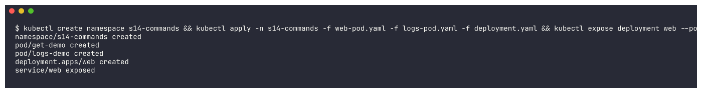

### 02-wait

```bash
kubectl wait --for=condition=Ready pod --all -n s14-commands --timeout=180s
```

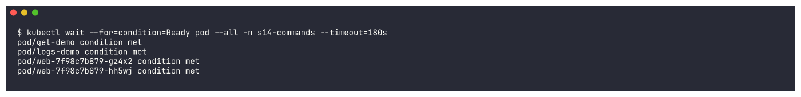

### 03-get-pods

```bash
kubectl get pods -n s14-commands
```

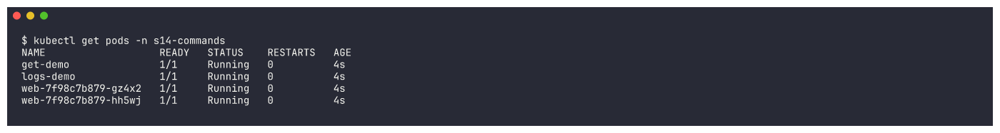

### 04-get-pods-wide

```bash
kubectl get pods -n s14-commands -o wide
```

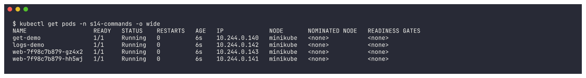

### 05-get-all

```bash
kubectl get all -n s14-commands
```

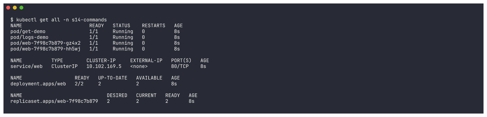

### 06-get-labels

```bash
kubectl get pods -n s14-commands --show-labels; echo; kubectl get pods -n s14-commands -l app=web
```

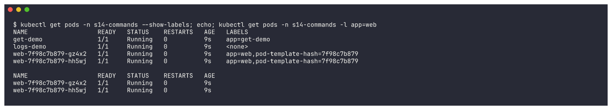

### 07-get-yaml

```bash
kubectl get pod get-demo -n s14-commands -o yaml | head -45
```

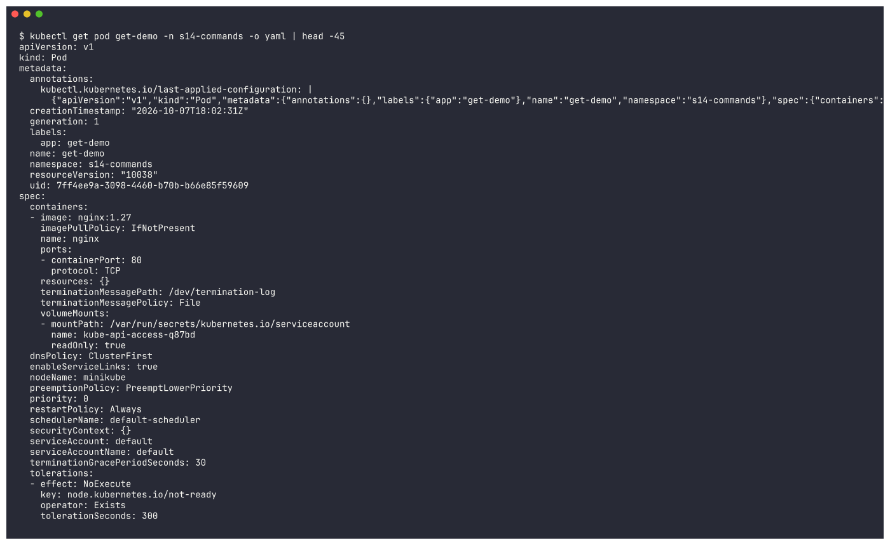

### 08-get-jsonpath

```bash
kubectl get pods -n s14-commands -o custom-columns=NAME:.metadata.name,STATUS:.status.phase,IP:.status.podIP,NODE:.spec.nodeName,IMAGE:.spec.containers[0].image
```

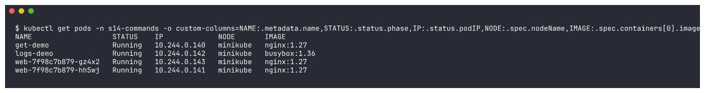

### 09-get-nodes-wide

```bash
kubectl get nodes -o wide; echo; kubectl get svc,endpoints -n s14-commands -o wide
```

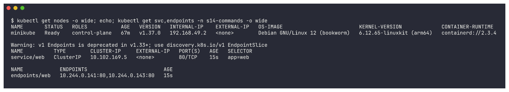

### 10-describe-pod

```bash
kubectl describe pod get-demo -n s14-commands
```

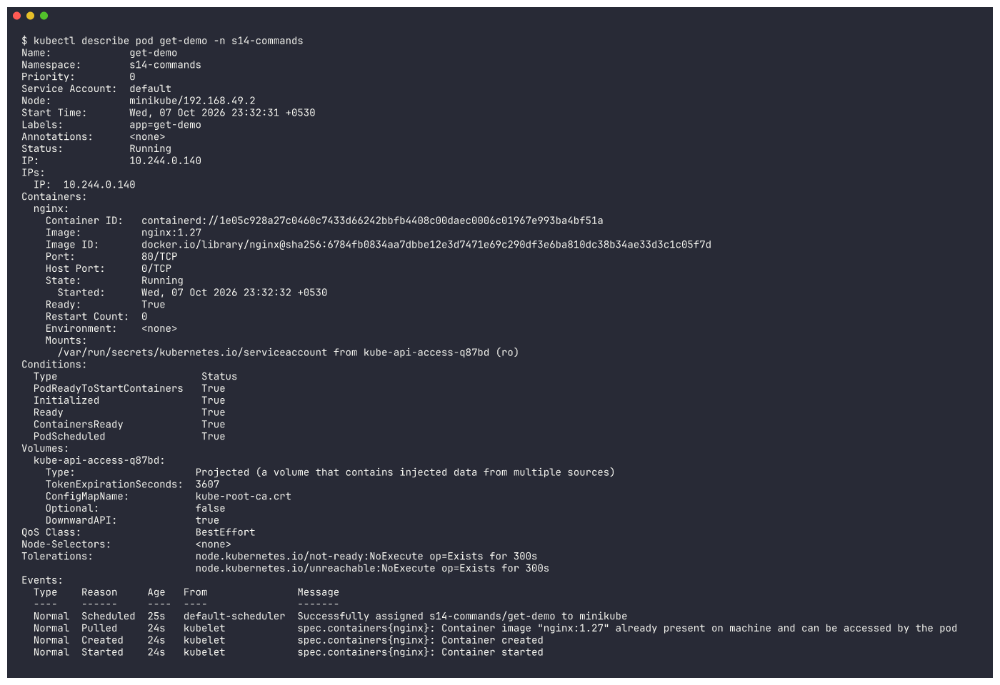

### 11-describe-deployment

```bash
kubectl describe deployment web -n s14-commands
```

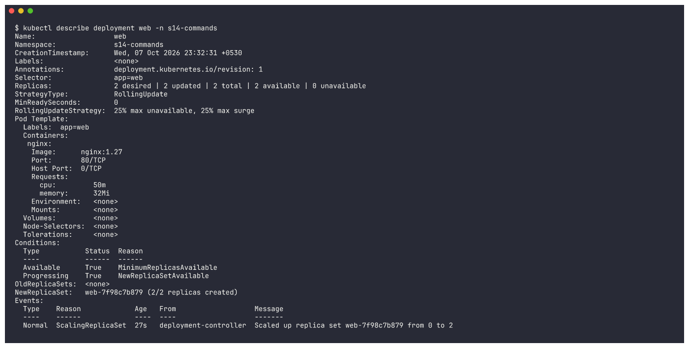

### 12-describe-service

```bash
kubectl describe service web -n s14-commands
```

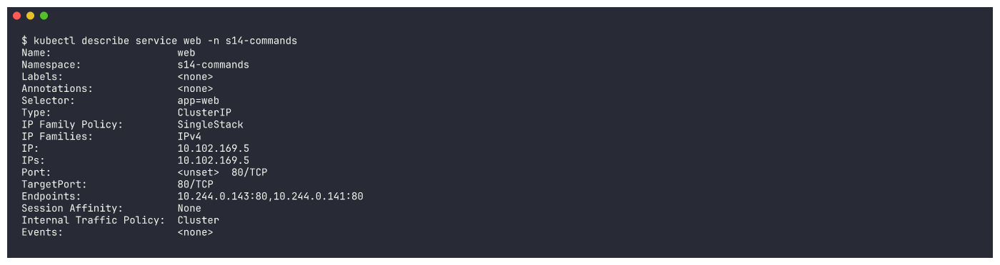

### 13-describe-node

```bash
kubectl describe node minikube | grep -A12 "Allocated resources"
```

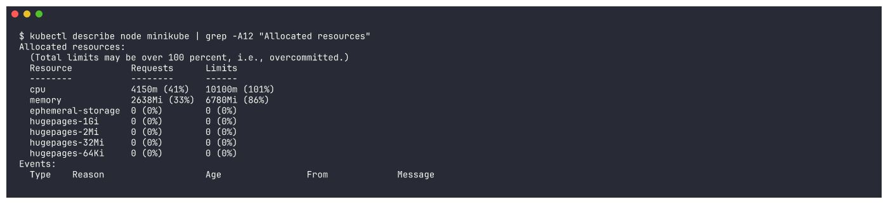

### 14-logs

```bash
kubectl logs logs-demo -n s14-commands
```

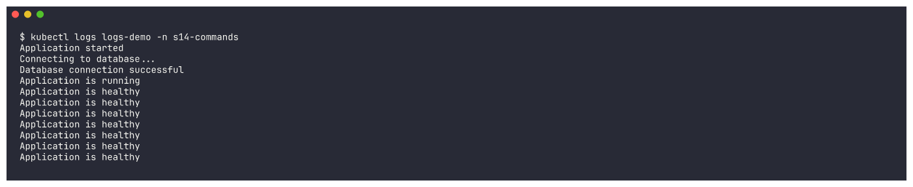

### 15-logs-tail-timestamps

```bash
kubectl logs logs-demo -n s14-commands --tail=3 --timestamps
```

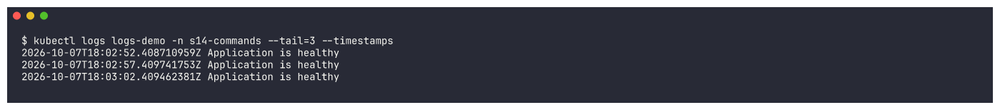

### 16-logs-follow

```bash
kubectl logs -f logs-demo -n s14-commands --since=5s & PID=$!; sleep 12; kill $PID; echo "(stopped following after 12s)"
```

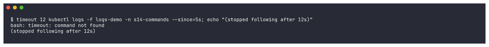

### 17-logs-deployment-label

```bash
kubectl exec get-demo -n s14-commands -- curl -s -o /dev/null http://web; kubectl logs deployment/web -n s14-commands --tail=3; echo; kubectl logs -l app=web -n s14-commands --tail=2 --prefix
```

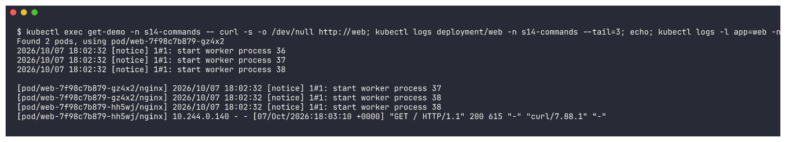
