# Task 3: Kubernetes Troubleshooting Challenge (Mini Project)

The reference mini project: a simple nginx app (Deployment + Service) that the team says "is broken".
Workflow: **Deploy -> Observe -> Break -> Investigate -> Find root cause -> Fix -> Verify.**

Namespace: `s14-mini`

| File | Description |
|---|---|
| `deployment.yaml` | `troubleshooting-app`, 2 x nginx:1.27, label `app=troubleshooting-app` (reference) |
| `service.yaml` | `troubleshooting-service`, selector `app=troubleshooting-app`, 80 -> 80 (reference) |
| `broken-pod.yaml` | `project-broken-pod` with `nginx:this-tag-does-not-exist` (reference) |
| `service-broken-selector.yaml` | the service with selector changed to `app: wrong-app` (challenge step 8) |

---

## 1. Deploy the application

```bash
kubectl create namespace s14-mini && kubectl apply -n s14-mini -f deployment.yaml && kubectl apply -n s14-mini -f service.yaml
```
```text
namespace/s14-mini created
deployment.apps/troubleshooting-app created
service/troubleshooting-service created
```


```bash
kubectl get pods -n s14-mini; kubectl get service -n s14-mini
```
```text
NAME                                   READY   STATUS    RESTARTS   AGE
troubleshooting-app-59d4957864-q57j8   1/1     Running   0          2m24s
troubleshooting-app-59d4957864-s56xd   1/1     Running   0          2m25s
NAME                      TYPE        CLUSTER-IP       EXTERNAL-IP   PORT(S)   AGE
troubleshooting-service   ClusterIP   10.101.203.132   <none>        80/TCP    2m27s
```
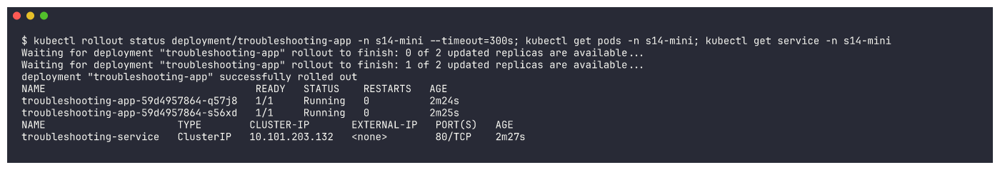

## 2. Check the application

```bash
kubectl get pods -n s14-mini -o wide
```
```text
NAME                                   READY   STATUS    RESTARTS   AGE     IP             NODE
troubleshooting-app-59d4957864-q57j8   1/1     Running   0          2m26s   10.244.0.238   minikube
troubleshooting-app-59d4957864-s56xd   1/1     Running   0          2m27s   10.244.0.241   minikube
```
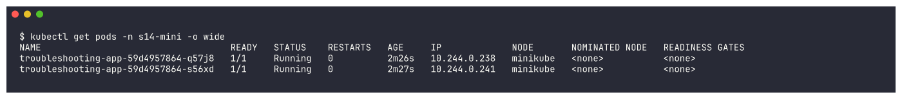

```bash
kubectl describe pod troubleshooting-app-59d4957864-q57j8 -n s14-mini
```
```text
Status:           Running
IP:               10.244.0.238
    Image:          nginx:1.27
    Port:           80/TCP
    State:          Running
    Ready:          True
    Restart Count:  0
Events:
  Normal  Scheduled  2m27s  default-scheduler  Successfully assigned s14-mini/troubleshooting-app-59d4957864-q57j8 to minikube
  Normal  Pulled     65s    kubelet            spec.containers{app}: Container image "nginx:1.27" already present on machine ...
  Normal  Created    59s    kubelet            spec.containers{app}: Container created
  Normal  Started    43s    kubelet            spec.containers{app}: Container started
```
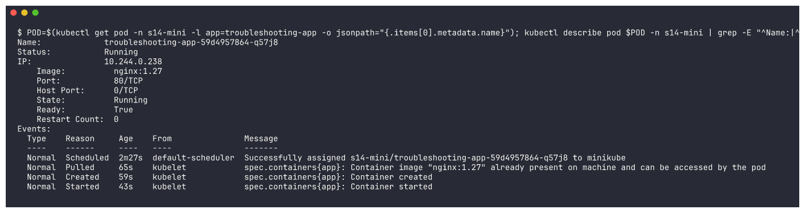

```bash
kubectl logs troubleshooting-app-59d4957864-q57j8 -n s14-mini | tail -5
```
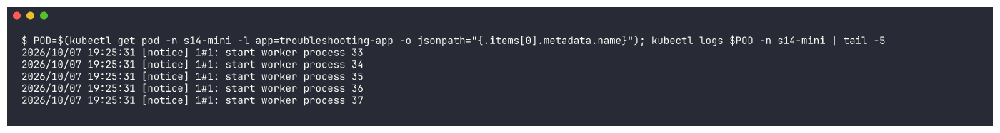

```bash
kubectl exec -i troubleshooting-app-59d4957864-q57j8 -n s14-mini -- bash -c "hostname; curl -s localhost | grep -i title"
```
```text
troubleshooting-app-59d4957864-q57j8
<title>Welcome to nginx!</title>
```
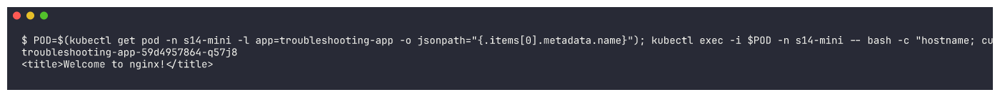

## 3. Check the Service / 4. Check endpoints

```bash
kubectl describe service troubleshooting-service -n s14-mini | grep -E "Selector|TargetPort|Endpoints"
```
```text
Selector:                 app=troubleshooting-app
TargetPort:               80/TCP
Endpoints:                10.244.0.238:80,10.244.0.241:80
```
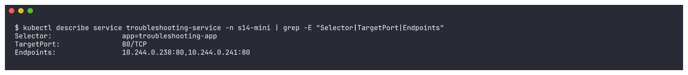

```bash
kubectl get endpoints troubleshooting-service -n s14-mini
```
```text
NAME                      ENDPOINTS                         AGE
troubleshooting-service   10.244.0.238:80,10.244.0.241:80   2m55s
```
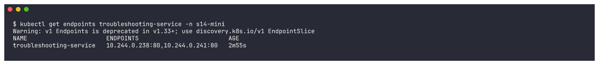

The endpoints are exactly the two Pod IPs from `get pods -o wide` - healthy baseline.

## 5. Create a broken Pod

```bash
kubectl apply -n s14-mini -f broken-pod.yaml && sleep 30 && kubectl get pod project-broken-pod -n s14-mini
```
```text
pod/project-broken-pod created
NAME                 READY   STATUS             RESTARTS   AGE
project-broken-pod   0/1     ImagePullBackOff   0          30s
```
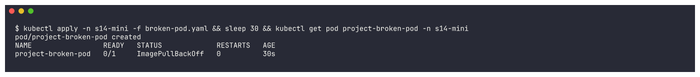

## 6. Troubleshoot it (no YAML changes before investigating)

```bash
kubectl get pod project-broken-pod -n s14-mini
kubectl describe pod project-broken-pod -n s14-mini
```
```text
NAME                 READY   STATUS         RESTARTS   AGE
project-broken-pod   0/1     ErrImagePull   0          46s
    Image:          nginx:this-tag-does-not-exist
      Reason:       ErrImagePull
Events:
  Normal   Scheduled  47s                default-scheduler  Successfully assigned s14-mini/project-broken-pod to minikube
  Normal   Pulling    24s (x2 over 43s)  kubelet            Pulling image "nginx:this-tag-does-not-exist"
  Warning  Failed     21s (x2 over 41s)  kubelet            Failed to pull image "nginx:this-tag-does-not-exist": rpc error: code = NotFound desc = failed to pull and unpack image
                                                            "docker.io/library/nginx:this-tag-does-not-exist": failed to resolve reference ...: not found
  Warning  Failed     21s (x2 over 41s)  kubelet            Error: ErrImagePull
  Normal   BackOff    8s (x2 over 39s)   kubelet            Back-off pulling image "nginx:this-tag-does-not-exist"
  Warning  Failed     8s (x2 over 39s)   kubelet            Error: ImagePullBackOff
```
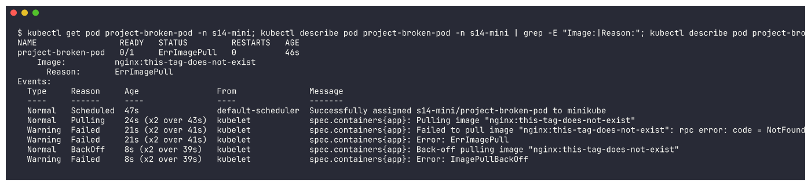

(The status alternates between `ImagePullBackOff` and `ErrImagePull` as the kubelet retries.)

## 7. Your task - answers

**Question 1: What is the Pod status?**
`ImagePullBackOff` (alternating with `ErrImagePull` on each retry), `READY 0/1`, 0 restarts - the container never started.

**Question 2: What is the actual error?**
`Failed to pull image "nginx:this-tag-does-not-exist": ... docker.io/library/nginx:this-tag-does-not-exist: not found`

**Question 3: Which command helped you find the reason?**
`kubectl describe pod project-broken-pod` - the **Events** section. (`kubectl logs` is useless here
because the container never ran.)

**Question 4: What is wrong with the image?**
The repository `nginx` exists, but the **tag** `this-tag-does-not-exist` does not exist on Docker Hub,
so the registry returns *not found*.

**Question 5: How would you fix it?**
Use a valid tag such as `nginx:1.27` - either fix `broken-pod.yaml` and recreate the Pod, or patch it in
place (image is a mutable Pod field):
```bash
kubectl set image pod/project-broken-pod app=nginx:1.27 -n s14-mini && sleep 20 && kubectl get pod project-broken-pod -n s14-mini
```
```text
pod/project-broken-pod image updated
NAME                 READY   STATUS    RESTARTS   AGE
project-broken-pod   1/1     Running   0          71s
```
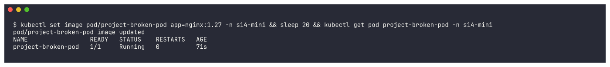

## 8. Service troubleshooting challenge - break the selector

`service-broken-selector.yaml` is `service.yaml` with the selector changed to `app: wrong-app`:
```bash
diff service.yaml service-broken-selector.yaml
kubectl apply -n s14-mini -f service-broken-selector.yaml && kubectl get service -n s14-mini && kubectl get endpoints troubleshooting-service -n s14-mini
```
```text
9c9
<     app: troubleshooting-app
---
>     app: wrong-app
service/troubleshooting-service configured
NAME                      TYPE        CLUSTER-IP       EXTERNAL-IP   PORT(S)   AGE
troubleshooting-service   ClusterIP   10.101.203.132   <none>        80/TCP    4m15s
NAME                      ENDPOINTS   AGE
troubleshooting-service   <none>      4m13s
```
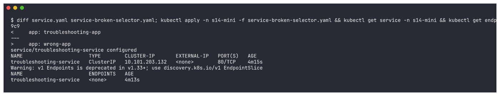

`kubectl get service` still looks perfectly normal - only the endpoints reveal the problem: `<none>`.

## 9. Find the root cause

```bash
kubectl get pods -n s14-mini --show-labels
kubectl describe service troubleshooting-service -n s14-mini | grep -E "Selector|Endpoints"
```
```text
NAME                                   READY   STATUS    RESTARTS   AGE     LABELS
project-broken-pod                     1/1     Running   0          78s     <none>
troubleshooting-app-59d4957864-q57j8   1/1     Running   0          4m15s   app=troubleshooting-app,pod-template-hash=59d4957864
troubleshooting-app-59d4957864-s56xd   1/1     Running   0          4m16s   app=troubleshooting-app,pod-template-hash=59d4957864
Selector:                 app=wrong-app
Endpoints:
```
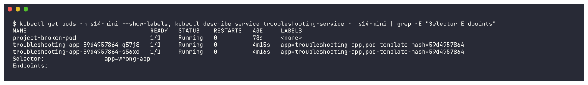

**Mismatch:** Pod label `app=troubleshooting-app` vs. Service selector `app=wrong-app`.

**Fix and verify:**
```bash
kubectl apply -n s14-mini -f service.yaml && sleep 3 && kubectl get endpoints troubleshooting-service -n s14-mini
kubectl run curl-check -n s14-mini --image=curlimages/curl:8.6.0 --restart=Never --rm -i -- curl -s -o /dev/null -w "troubleshooting-service -> HTTP %{http_code}\n" http://troubleshooting-service
```
```text
service/troubleshooting-service configured
NAME                      ENDPOINTS                         AGE
troubleshooting-service   10.244.0.238:80,10.244.0.241:80   4m29s
troubleshooting-service -> HTTP 200
```
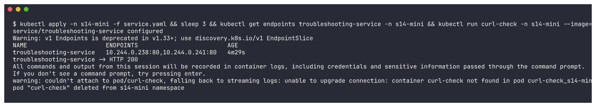

## 10. Cleanup
```bash
kubectl delete namespace s14-mini --wait=false
```
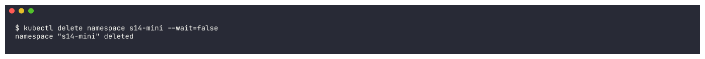

---

## 11. Troubleshooting table

| Problem | What I saw | Command I used | Root cause | Fix |
| :--- | :--- | :--- | :--- | :--- |
| **Broken Pod** | `project-broken-pod 0/1 ImagePullBackOff`, 0 restarts | `kubectl get pod`, `kubectl describe pod` (Events) | Container image can't be pulled, so the container never starts | Point the Pod at a valid image (`kubectl set image ... app=nginx:1.27`) |
| **Service Problem** | Service exists with a ClusterIP but `ENDPOINTS <none>` | `kubectl get endpoints`, `kubectl describe service`, `kubectl get pods --show-labels` | Selector `app=wrong-app` doesn't match Pod label `app=troubleshooting-app` | Restore selector `app: troubleshooting-app` -> endpoints back, HTTP 200 |
| **Image Problem** | `Failed to pull image "nginx:this-tag-does-not-exist" ... not found` | `kubectl describe pod` / `kubectl events --for pod/...` | Tag doesn't exist in the `nginx` repository | Use an existing tag (`1.27`) |

## 12. README questions (in my own words)

1. **What does `kubectl get` tell us?** A one-line summary per object - is it running, how many
   containers are ready, how many restarts, how old. It answers *"what is happening?"* across many objects at once.
2. **Difference between `get` and `describe`?** `get` is a short status table (or the raw object with
   `-o yaml`); `describe` is a detailed, human-readable report of *one* object including container states,
   last termination reason, conditions, volumes and - most importantly - the **Events** that explain *why*.
3. **Why use `kubectl logs`?** To see what the application itself printed (stdout/stderr): stack traces,
   "missing env var", connection errors. `--previous` shows the logs of the last crashed container.
4. **When would you use `kubectl exec`?** When the Pod runs but behaves wrongly and I need to look from
   inside: test `curl localhost`, check which ports are listening, read config files, test DNS (`nslookup`).
5. **What does `CrashLoopBackOff` mean?** The container starts and exits again and again; the kubelet
   restarts it with an increasing delay (back-off). The image is fine - the process is failing.
6. **What does `ImagePullBackOff` mean?** The kubelet failed to pull the image (wrong name/tag, private
   registry without credentials, network) and is waiting before retrying. `ErrImagePull` is the same failure at the moment it happens.
7. **Why can a Pod remain `Pending`?** The scheduler can't find a node for it: not enough CPU/memory,
   `nodeSelector`/affinity matches no node, taints without tolerations, or an unbound PVC.
8. **Why can a Service have no endpoints?** No *Ready* Pod matches its selector - wrong selector/labels,
   Pods in another namespace, or Pods failing their readiness probe.
9. **Relationship between a Service selector and Pod labels?** The Service continuously selects every Pod
   whose labels contain all the selector's key/values, and those Pods' IPs (if Ready) become its endpoints.
   One typo on either side and the link is broken.
10. **What is Kubernetes DNS?** CoreDNS running in `kube-system` behind the `kube-dns` Service
    (10.96.0.10). It gives every Service a name `<svc>.<namespace>.svc.cluster.local`; Pods use it via
    `/etc/resolv.conf`, whose search domains let you use the short name inside the same namespace.

## 13. Final architecture

```text
                    Kubernetes Cluster (namespace s14-mini)
                            |
                  +-------------------------+
                  | troubleshooting-service |  ClusterIP 10.101.203.132:80
                  +------------+------------+
                               |
                 selector app=troubleshooting-app
                               |
              +----------------+----------------+
              v                                 v
   troubleshooting-app-...q57j8      troubleshooting-app-...s56xd
        10.244.0.238:80                    10.244.0.241:80
              \_______________ nginx:1.27 _____/
```
