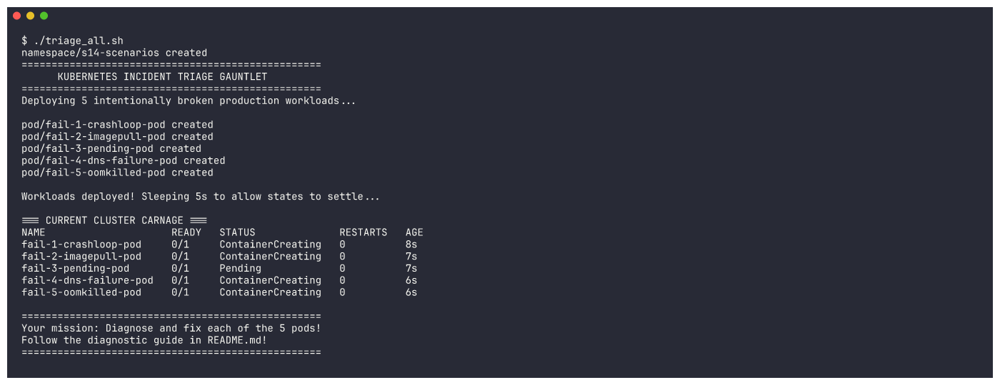
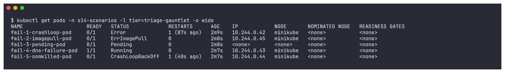
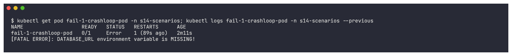
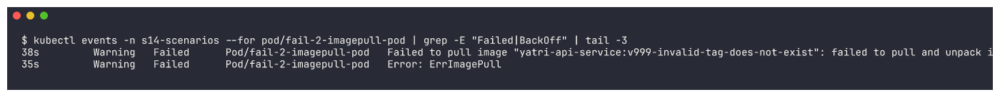
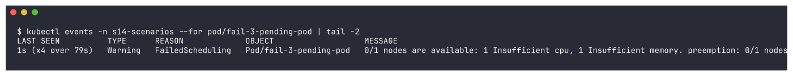
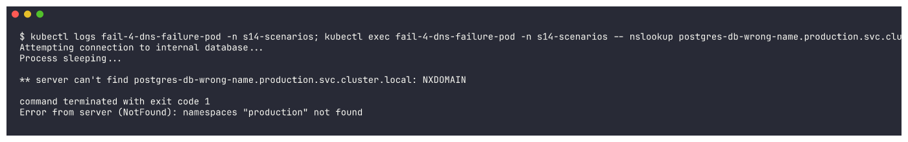
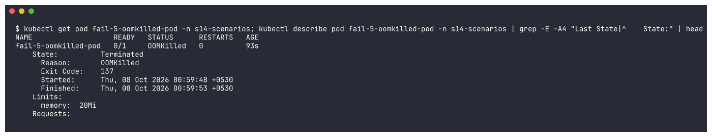
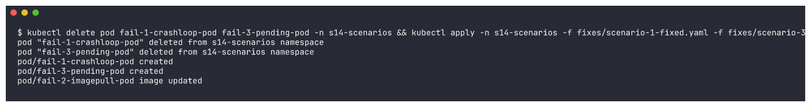
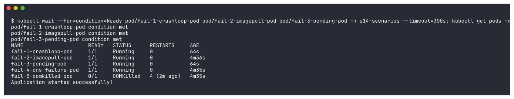
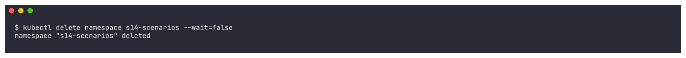

# Triage Gauntlet (reference `scenarios/`)

The instructor's `triage_all.sh` deploys five intentionally broken Pods at once. I made the script deploy
into its own namespace (`NAMESPACE`, default `s14-scenarios`) instead of `default`, since the cluster is
shared. Everything else is unchanged.

| Scenario | File | Bug |
|---|---|---|
| 1 | `scenario-1-crashloop/broken.yaml` | Python app exits because `DATABASE_URL` is missing |
| 2 | `scenario-2-imagepull/broken.yaml` | image `yatri-api-service:v999-invalid-tag-does-not-exist` |
| 3 | `scenario-3-pending/broken.yaml` | requests `cpu: 500`, `memory: 1000Gi` |
| 4 | `scenario-4-dns-failure/broken.yaml` | curls `postgres-db-wrong-name.production.svc.cluster.local` |
| 5 | `scenario-5-oomkilled/broken.yaml` | allocates ~1GB with a `20Mi` memory limit |

Fixes I applied: `fixes/scenario-1-fixed.yaml`, `fixes/scenario-3-fixed.yaml`, and `kubectl set image` for #2.

## Deploy

```bash
./triage_all.sh
```
```text
namespace/s14-scenarios created
==================================================
      KUBERNETES INCIDENT TRIAGE GAUNTLET
==================================================
pod/fail-1-crashloop-pod created
pod/fail-2-imagepull-pod created
pod/fail-3-pending-pod created
pod/fail-4-dns-failure-pod created
pod/fail-5-oomkilled-pod created
=== CURRENT CLUSTER CARNAGE ===
NAME                     READY   STATUS              RESTARTS   AGE
fail-1-crashloop-pod     0/1     ContainerCreating   0          8s
...
```


## Triage

```bash
kubectl get pods -n s14-scenarios -l tier=triage-gauntlet -o wide
```
```text
NAME                     READY   STATUS             RESTARTS      AGE    IP            NODE
fail-1-crashloop-pod     0/1     Error              1 (87s ago)   2m9s   10.244.0.42   minikube
fail-2-imagepull-pod     0/1     ErrImagePull       0             2m8s   10.244.0.45   minikube
fail-3-pending-pod       0/1     Pending            0             2m8s   <none>        <none>
fail-4-dns-failure-pod   1/1     Running            0             2m7s   10.244.0.43   minikube
fail-5-oomkilled-pod     0/1     CrashLoopBackOff   1 (40s ago)   2m7s   10.244.0.44   minikube
```


Note scenario 4: `Running 1/1` - the most dangerous kind of failure, because nothing *looks* broken.

### 1 - CrashLoop
```bash
kubectl get pod fail-1-crashloop-pod -n s14-scenarios; kubectl logs fail-1-crashloop-pod -n s14-scenarios --previous
```
```text
fail-1-crashloop-pod   0/1     Error   1 (89s ago)   2m11s
[FATAL ERROR]: DATABASE_URL environment variable is MISSING!
```


### 2 - ImagePull
```bash
kubectl events -n s14-scenarios --for pod/fail-2-imagepull-pod | grep -E "Failed|BackOff" | tail -3
```
```text
Warning   Failed   Pod/fail-2-imagepull-pod   Failed to pull image "yatri-api-service:v999-invalid-tag-does-not-exist": ... failed to resolve reference ...
Warning   Failed   Pod/fail-2-imagepull-pod   Error: ErrImagePull
```


### 3 - Pending
```bash
kubectl events -n s14-scenarios --for pod/fail-3-pending-pod | tail -2
```
```text
Warning   FailedScheduling   Pod/fail-3-pending-pod   0/1 nodes are available: 1 Insufficient cpu, 1 Insufficient memory. ...
```


### 4 - DNS failure (silent)
```bash
kubectl logs fail-4-dns-failure-pod -n s14-scenarios
kubectl exec fail-4-dns-failure-pod -n s14-scenarios -- nslookup postgres-db-wrong-name.production.svc.cluster.local
kubectl get ns production
```
```text
Attempting connection to internal database...
Process sleeping...
** server can't find postgres-db-wrong-name.production.svc.cluster.local: NXDOMAIN
command terminated with exit code 1
Error from server (NotFound): namespaces "production" not found
```


The app swallows the error (`curl -s ... || true`) so the logs look harmless. `nslookup` shows NXDOMAIN,
and there isn't even a `production` namespace: the hostname is wrong in both the service-name and the
namespace part.

### 5 - OOMKilled
```bash
kubectl get pod fail-5-oomkilled-pod -n s14-scenarios
kubectl describe pod fail-5-oomkilled-pod -n s14-scenarios | grep -E -A4 "Last State|^    State:"
kubectl describe pod fail-5-oomkilled-pod -n s14-scenarios | grep -A2 "Limits:"
```
```text
fail-5-oomkilled-pod   0/1     OOMKilled   0          93s
    State:          Terminated
      Reason:       OOMKilled
      Exit Code:    137
    Limits:
      memory:  20Mi
```


Exit code **137** = 128 + 9 (SIGKILL): the kernel killed the process for exceeding its 20Mi cgroup limit.

## Fixes

```bash
kubectl delete pod fail-1-crashloop-pod fail-3-pending-pod -n s14-scenarios && \
kubectl apply -n s14-scenarios -f fixes/scenario-1-fixed.yaml -f fixes/scenario-3-fixed.yaml && \
kubectl set image pod/fail-2-imagepull-pod web-app=nginx:alpine -n s14-scenarios
```


```bash
kubectl wait --for=condition=Ready pod/fail-1-crashloop-pod pod/fail-2-imagepull-pod pod/fail-3-pending-pod -n s14-scenarios --timeout=300s
kubectl get pods -n s14-scenarios -l tier=triage-gauntlet; kubectl logs fail-1-crashloop-pod -n s14-scenarios
```
```text
NAME                     READY   STATUS      RESTARTS     AGE
fail-1-crashloop-pod     1/1     Running     0            64s
fail-2-imagepull-pod     1/1     Running     0            4m36s
fail-3-pending-pod       1/1     Running     0            64s
fail-4-dns-failure-pod   1/1     Running     0            4m35s
fail-5-oomkilled-pod     0/1     OOMKilled   4 (2m ago)   4m35s
Application started successfully!
```


## Triage summary

| # | Symptom | Key command | Root cause | Fix |
|---|---|---|---|---|
| 1 | `Error` / `CrashLoopBackOff` | `kubectl logs --previous` | `DATABASE_URL` not set | add the env var (applied, now `Running`) |
| 2 | `ErrImagePull` | `kubectl events --for pod/...` | repository/tag doesn't exist | valid image (applied with `kubectl set image`) |
| 3 | `Pending`, no node | `kubectl events` (FailedScheduling) | requests 500 CPU / 1000Gi | realistic requests (applied, now `Running`) |
| 4 | `Running` but app can't reach DB | `kubectl logs` + `nslookup` from the Pod | wrong hostname / namespace (NXDOMAIN) | point it at the real service FQDN `<svc>.<ns>.svc.cluster.local` - not applied, there is no database Service in this demo to point at |
| 5 | `OOMKilled`, exit 137 | `kubectl describe pod` (Last State) | allocates ~1GB with a 20Mi limit | raise `limits.memory` to what the app needs or fix the memory leak - not applied: the script really allocates ~1GB, which I didn't want to add to the already memory-starved shared node |

## Cleanup
```bash
kubectl delete namespace s14-scenarios --wait=false
```

