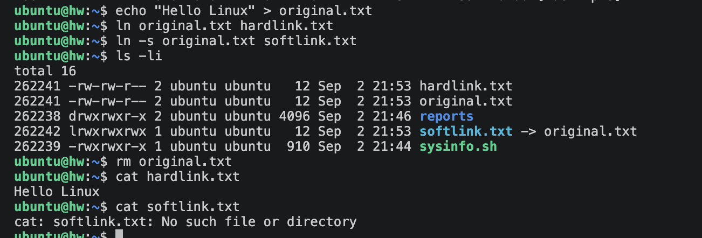
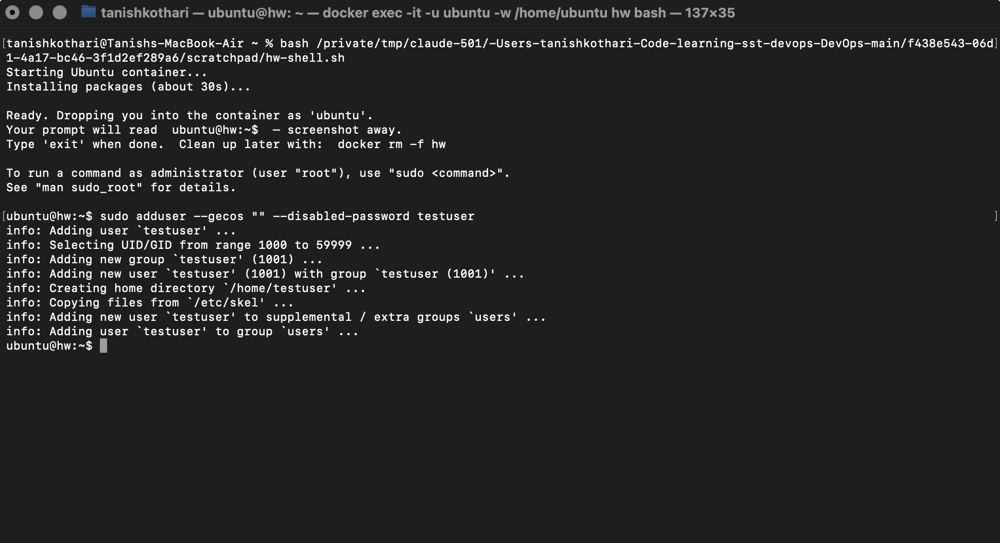
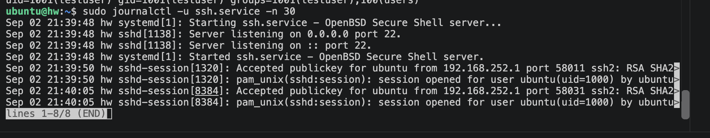
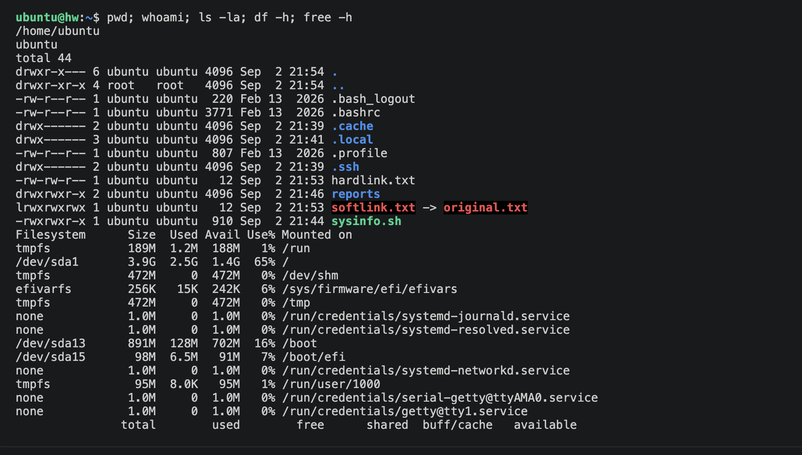
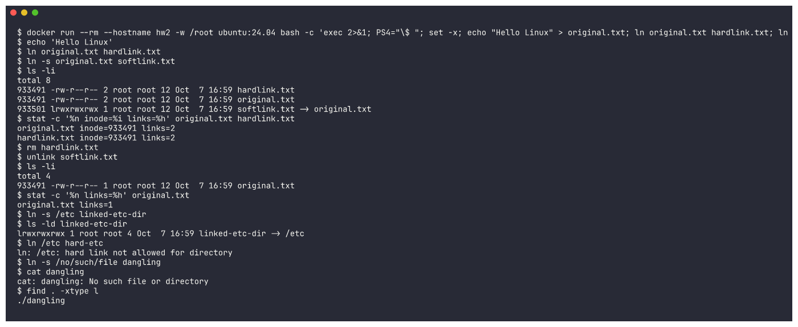
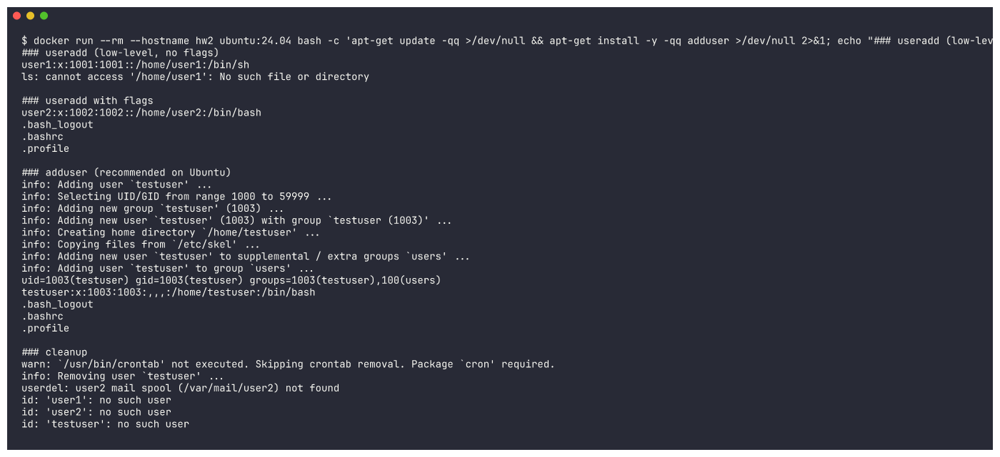
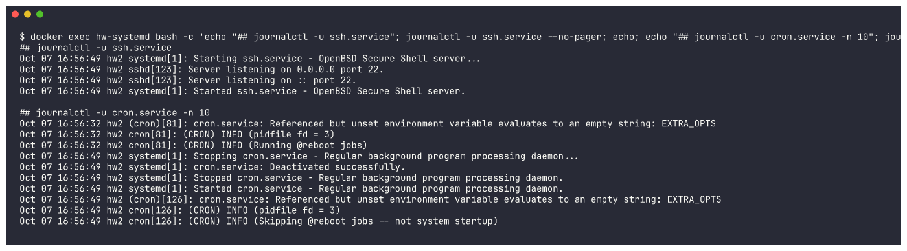
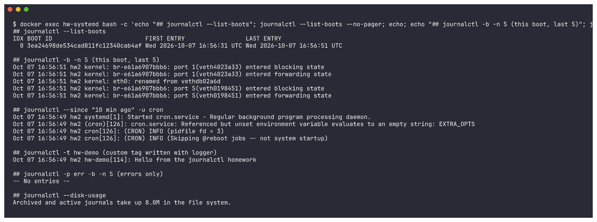
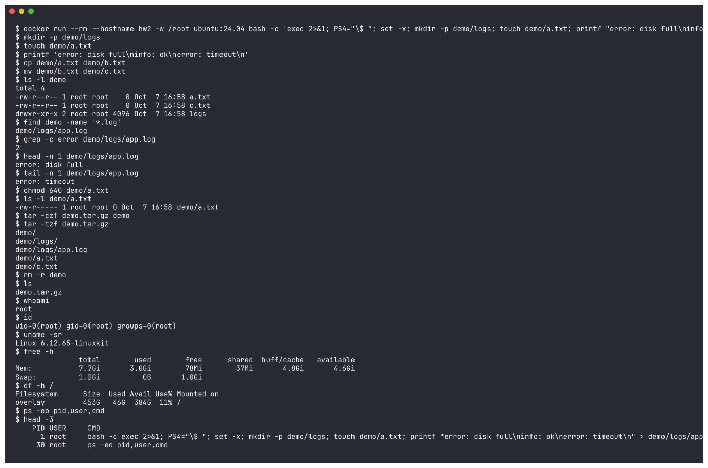

# Linux Fundamentals - Homework

Write-up of four Linux exercises I worked through: linking files, adding users, reading system logs with journalctl, and building a reference sheet of everyday commands.

## Task 1: Soft Link and Hard Link

### Hard Link
- Refers straight to the inode, meaning the real data blocks on disk rather than a name.
- The underlying data survives until every hard link pointing at it has been removed.
- Restricted to a single filesystem; it cannot span partitions.
- Directories cannot be hard linked.
- Carries the exact same inode number as the file it was made from.

### Soft Link (Symbolic Link)
- Stores the path of another file, behaving much like a shortcut.
- Removing the original leaves the symlink pointing at nothing, a so-called dangling link.
- Works fine across separate filesystems and partitions.
- Directories can be linked this way.
- Gets an inode of its own, and `ls -l` displays it in the form `link -> target`.

### Difference

| Feature | Hard Link | Soft Link |
|---|---|---|
| Points to | Inode (data) | Pathname (filename) |
| Cross filesystem | No | Yes |
| Link to directory | No | Yes |
| If original deleted | Data still accessible | Link breaks |
| Inode number | Same as original | Different |

### Commands
Create a hard link:
```bash
ln original.txt hardlink.txt
```

Create a soft link:
```bash
ln -s original.txt softlink.txt
```

Delete a link:
```bash
rm hardlink.txt
unlink softlink.txt
```

### Practice
```bash
echo "Hello Linux" > original.txt

ln    original.txt hardlink.txt
ln -s original.txt softlink.txt

ls -li          # compare inode numbers and link counts

rm original.txt
cat hardlink.txt     # still prints "Hello Linux"
cat softlink.txt     # No such file or directory
```

### Screenshot



## Task 2: adduser vs useradd

### Difference

| | useradd | adduser |
|---|---|---|
| Type | Low-level binary | High-level script (wraps useradd) |
| Interactive | No, needs flags | Yes, prompts for details |
| Home directory | Only with `-m` | Created automatically |
| Password | Set separately with passwd | Prompts during creation |
| Default shell | Often /bin/sh | Sets /bin/bash |

### Which is preferred on Ubuntu and why
On Ubuntu and Debian the recommended tool is `adduser`, since a single command handles everything: it makes the home directory, pulls in the template files from `/etc/skel`, assigns a sensible shell, and asks for the password along with the account details. Underneath it all sits `useradd`, the lower-level command that `adduser` calls, and that one is the better fit when writing scripts.

### Create a test user
```bash
sudo adduser testuser
```

Verify:
```bash
id testuser
grep testuser /etc/passwd
ls -la /home/testuser
```

Remove the account afterwards:
```bash
sudo deluser --remove-home testuser
```

### Screenshot



## Task 3: journalctl

The `journalctl` command reads the logs that systemd's journal daemon (systemd-journald) gathers. On any systemd-based system it is the single place to go for boot messages, kernel output, and per-service logs.

### Usage
View all logs:
```bash
journalctl
```

Skip to the newest entries, or stream them as they arrive:
```bash
journalctl -e
journalctl -f
```

Logs for a specific service:
```bash
journalctl -u ssh.service
```

Logs since last boot:
```bash
journalctl -b
```

Filter by time:
```bash
journalctl --since "1 hour ago"
journalctl --since today
```

Only errors:
```bash
journalctl -p err
```

Last 50 lines:
```bash
journalctl -n 50
```

### Practice: logs for a specific service
```bash
sudo journalctl -u ssh.service -e
```

### Screenshot



## Task 4: Linux Command Cheat Sheet

### Files and Directories
| Command | Purpose |
|---|---|
| `pwd` | Print current directory |
| `ls -la` | List all files with details |
| `cd /path` | Change directory |
| `mkdir dir` | Create a directory |
| `rm file` | Remove a file (`-r` recursive) |
| `cp src dst` | Copy files |
| `mv src dst` | Move or rename files |
| `touch file` | Create empty file |
| `find /path -name "*.txt"` | Search for files |

### Viewing and Editing
| Command | Purpose |
|---|---|
| `cat file` | Print a file |
| `less file` | Scroll through a file |
| `head -n 20 file` | First 20 lines |
| `tail -n 20 file` | Last 20 lines (`-f` to follow) |
| `nano` / `vim` | Text editors |
| `grep "pattern" file` | Search inside files |

### Permissions
| Command | Purpose |
|---|---|
| `chmod 755 file` | Change permissions |
| `chown user:group file` | Change owner |
| `ls -l` | View permissions |

### Users
| Command | Purpose |
|---|---|
| `whoami` | Current username |
| `id` | User and group IDs |
| `sudo adduser name` | Add a user |
| `passwd` | Change a password |
| `su - user` | Switch user |

### Processes and System
| Command | Purpose |
|---|---|
| `ps aux` | List running processes |
| `top` | Live process monitor |
| `kill PID` | Terminate a process |
| `df -h` | Disk usage |
| `free -h` | Memory usage |
| `uname -a` | System info |

### Networking
| Command | Purpose |
|---|---|
| `ping host` | Test connectivity |
| `curl url` / `wget url` | Fetch / download |
| `ip a` | Show network interfaces |
| `ss -tulpn` | Listening ports |

### Services
| Command | Purpose |
|---|---|
| `systemctl status svc` | Service status |
| `systemctl restart svc` | Restart a service |
| `journalctl -u svc` | View service logs |

### Extras
| Command | Purpose |
|---|---|
| `man command` | Manual page |
| `history` | Command history |
| `tar -czvf a.tar.gz dir` | Create archive |
| `tar -xzvf a.tar.gz` | Extract archive |
| `apt install pkg` | Install a package |

### Screenshot



---

## Additional Practice (filling the gaps)

The screenshots above came from my Ubuntu VM. A few parts of the tasks were not fully shown there: deleting the links themselves, `useradd` next to `adduser`, `journalctl` filters other than `-u`, and a full cheat-sheet run. I ran these in a throwaway **Ubuntu 24.04 Docker container** (`docker run --rm ubuntu:24.04 ...`) because my laptop runs macOS. For `journalctl` I used an Ubuntu 24.04 container booted with systemd (`/sbin/init`, run `--privileged`) so that journald was running. The full text output of each run is in [`outputs/`](outputs/).

### Task 1: Creating and deleting hard and soft links

```bash
echo "Hello Linux" > original.txt
ln original.txt hardlink.txt          # hard link -> same inode, link count goes to 2
ln -s original.txt softlink.txt       # soft link -> new inode, points to the name
ls -li
rm hardlink.txt                       # delete a hard link (link count drops back to 1)
unlink softlink.txt                   # delete a soft link
ln -s /etc linked-etc-dir             # soft link to a directory works
ln /etc hard-etc                      # hard link to a directory is refused
ln -s /no/such/file dangling          # dangling soft link
find . -xtype l                       # find broken symlinks
```



What the output shows: `original.txt` and `hardlink.txt` share inode `933491` and the link count is `2`. Once both links are deleted, the original's link count goes back to `1` and its data is untouched. `ln /etc hard-etc` fails with `hard link not allowed for directory`, and `find -xtype l` finds the broken symlink.

#### Interview Q&A
- **Q: What is the difference between a hard link and a soft link?** A hard link is another name for the same inode, so it has the same data and the same inode number. A soft link is a separate small file that stores a path.
- **Q: What happens if you delete the original file?** A hard link still works because the data stays until the link count reaches 0. A soft link becomes dangling.
- **Q: Can you hard link a directory or across filesystems?** No to both. A soft link can do either.
- **Q: How do you tell them apart?** Run `ls -li`. Hard links show the same inode number and a link count above 1. Soft links start with `l` and show `-> target`.
- **Q: How do you delete a link safely?** Use `rm link` or `unlink link`. Deleting a symlink never touches the target file.

### Task 2: `useradd` vs `adduser` side by side



- `useradd user1` with no flags created the user with **no home directory** (`ls: cannot access '/home/user1'`) and the shell `/bin/sh`.
- `useradd -m -s /bin/bash user2` needed explicit flags to get a home directory and bash.
- `adduser testuser` created the group, the home directory, copied `/etc/skel`, set `/bin/bash` and added the user to `users`, all in one command. This is why `adduser` is the recommended command on Ubuntu.
- Cleanup: `deluser testuser`, `userdel -r user2`, `userdel user1`. `id` then confirms that all three users are gone.

### Task 3: More `journalctl` practice

Service logs for `ssh.service` and `cron.service`. I started ssh and restarted cron first, so the stop and start lines are visible:



Other useful filters: `--list-boots`, `-b`, `--since`, `-t` (by tag, after writing an entry with `logger -t hw-demo ...`), `-p err` and `--disk-usage`:



> The `kernel:` lines come from the Docker Desktop VM's kernel, because the container was privileged.

### Task 4: Cheat sheet commands practised

`mkdir`, `touch`, `cp`, `mv`, `ls -l`, `find`, `grep -c`, `head`, `tail`, `chmod`, `tar -czf/-tzf`, `rm -r`, `whoami`, `id`, `uname`, `free -h`, `df -h` and `ps`:


