# Session 20: Monitoring, Observability & GitOps - Homework

Monitoring, observability and GitOps on a local **minikube** cluster:

- **Task 1 - Monitoring:** `kube-prometheus-stack` (Prometheus, Alertmanager, Grafana, kube-state-metrics,
  node-exporter) watching a demo app. It covers metrics, logs, alerts, CPU, memory and application health,
  plus a full incident drill: **healthy -> under load -> app down (alert FIRING) -> recovered (alert resolved)**.
- **Task 2 - Observability:** written up in [`observability/README.md`](observability/README.md). It covers
  metrics, logs and traces, why observability is needed, common tools, and Kubernetes observability.
- **Task 3 - GitOps:** **Argo CD** syncs this GitHub repo into the cluster. The demo shows the first sync,
  a change made through Git (replicas 2 -> 3, nginx 1.27 -> 1.28), self-heal after a manual
  `kubectl scale`, and a rollback through a `revert:` commit.

Every screenshot below is a capture of a command I actually ran. The raw text of each one is in
[`outputs/`](outputs/), and the web screenshots come from headless Chrome pointed at the real UIs.

> **About the environment.** The minikube node (6 CPU / 6.5 GB) was **shared with many other lab
> workloads** while I worked. At its worst the node hit a load average of ~270, swap filled up and the
> API server timed out (you can see this in the Node Exporter dashboard, [w07](#16-cpu--memory-utilisation)).
> I had to make several real fixes because of it: a longer scrape timeout, a Grafana OOMKill,
> liveness-probe timeouts, and a lighter kubelet scrape. Each fix is documented in
> [Keeping the stack healthy on a crowded node](#keeping-the-stack-healthy-on-a-crowded-node).
> Some Grafana CPU and memory panels have gaps for the minutes when the kubelet could not be scraped.

## Layout

```text
Monitoring-Observability-GitOps/
├── README.md                     <- this write-up
├── monitoring/
│   ├── kps-values.yaml           <- helm values for kube-prometheus-stack (light + tuned for a shared node)
│   ├── demo-app.yaml             <- s20-monitoring: podinfo (probes + /metrics), loadgen, cpu-burner, crashloop
│   ├── servicemonitor.yaml       <- tells Prometheus to scrape podinfo /metrics
│   ├── alert-rules.yaml          <- PrometheusRule: S20PodCrashLooping, S20HighCPUUsage, S20HighMemoryUsage, S20AppDown, S20PodNotReady
│   ├── grafana-dashboard.yaml    <- "S20 - podinfo App Health" dashboard (ConfigMap picked up by the Grafana sidecar)
│   └── loadtest-job.yaml         <- 3-minute, 8-worker load burst
├── observability/README.md       <- Task 2 documentation
├── gitops/
│   ├── README.md                 <- how the Argo CD app is wired
│   ├── argocd-application.yaml   <- Argo CD Application (applied once, by hand)
│   └── app/                      <- desired state that Argo CD syncs: namespace, deployment, service
├── screenshots/                  <- m* = monitoring, g* = gitops, w* = web UI screenshots
└── outputs/                      <- plain-text output of every terminal screenshot
```

## Environment and access

| Component | Where | How I reached it |
|---|---|---|
| Kubernetes | minikube v1.37.0, docker driver, metrics-server addon | `kubectl config use-context minikube` |
| kube-prometheus-stack | helm release **`kps`**, namespace **`monitoring`**, chart 92.1.0 | see below |
| Prometheus | `svc/kps-kube-prometheus-stack-prometheus` | `kubectl port-forward -n monitoring svc/kps-kube-prometheus-stack-prometheus 19090:9090` -> http://localhost:19090 |
| Alertmanager | `svc/kps-kube-prometheus-stack-alertmanager` | `kubectl port-forward -n monitoring svc/kps-kube-prometheus-stack-alertmanager 19093:9093` -> http://localhost:19093 |
| Grafana | `svc/kps-grafana` (anonymous **Viewer**; admin password is set in `kps-values.yaml`, demo only) | `kubectl port-forward -n monitoring svc/kps-grafana 13000:80` -> http://localhost:13000 |
| Argo CD | namespace **`argocd`**, official `stable` install manifest | `kubectl port-forward -n argocd svc/argocd-server 18443:443` (UI optional; evidence below uses kubectl) |
| Demo apps | `s20-monitoring` (monitoring demo), `s20-gitops` (managed by Argo CD) | |

> While the node was overloaded, `kubectl port-forward` (which tunnels through the API server) kept dropping
> connections when Grafana loaded its large JS bundle. For the **web screenshots only**, I opened an SSH
> tunnel to the minikube node (`ssh -i $(minikube ssh-key) -p <minikube ssh port> docker@127.0.0.1 -L 13001:<grafana pod IP>:3000 ...`).
> That tunnel reaches the same pods directly, so the UIs in the `w*` screenshots run on ports 13001/19091/19094.

---

## Task 1: Monitoring

### 1.1 Cluster

```bash
kubectl config current-context && kubectl get nodes -o wide && minikube addons list | grep -E "metrics-server|ingress |storage-provisioner "
```


### 1.2 Install kube-prometheus-stack

```bash
helm repo add prometheus-community https://prometheus-community.github.io/helm-charts
helm repo update prometheus-community
helm search repo prometheus-community/kube-prometheus-stack
```


Main settings in [`monitoring/kps-values.yaml`](monitoring/kps-values.yaml): `retention: 6h`, small resource requests,
and `serviceMonitorSelectorNilUsesHelmValues / podMonitorSelectorNilUsesHelmValues / ruleSelectorNilUsesHelmValues: false`.
With those three set to `false`, Prometheus picks up **every** ServiceMonitor and PrometheusRule in the cluster
(including mine in `s20-monitoring`). Grafana has anonymous Viewer access turned on, so dashboards can be
screenshotted without logging in.

```bash
helm upgrade --install kps prometheus-community/kube-prometheus-stack -n monitoring --create-namespace -f monitoring/kps-values.yaml --wait --timeout 10m
```
The first install **timed out**. The objects were created, but Grafana and kube-state-metrics were still pulling
images on the busy node when `--wait` gave up:


I re-ran the same command once the images were pulled, and the release became `deployed`:


```bash
helm list -n monitoring
kubectl get pods -n monitoring
kubectl get svc -n monitoring
kubectl get prometheus,alertmanager -n monitoring -o custom-columns='KIND:.kind,NAME:.metadata.name,RETENTION:.spec.retention,VERSION:.spec.version'
```


### 1.3 Demo application

[`monitoring/demo-app.yaml`](monitoring/demo-app.yaml) creates the namespace `s20-monitoring` with four workloads:

| Workload | What it does | Used to show |
|---|---|---|
| `s20-podinfo` (2 replicas) | Go web app with `/healthz`, `/readyz`, `/metrics`, and JSON request logs | app health (probes, `up`), request metrics, logs |
| `s20-loadgen` | busybox: `GET /` and `GET /status/500` once a second | steady traffic and a 500-error series |
| `s20-cpu-burner` | `while true; do :; done`, CPU limit 100m | CPU utilisation + `S20HighCPUUsage` alert |
| `s20-crashloop` | prints `FATAL: DATABASE_URL is not set` and exits 1 | crash logs, events, `S20PodCrashLooping` alert |

It also creates a [`ServiceMonitor`](monitoring/servicemonitor.yaml) (scrape podinfo every 15s), the
[`PrometheusRule`](monitoring/alert-rules.yaml), and the [Grafana dashboard ConfigMap](monitoring/grafana-dashboard.yaml).

```bash
kubectl apply -f monitoring/demo-app.yaml -f monitoring/servicemonitor.yaml -f monitoring/alert-rules.yaml -f monitoring/grafana-dashboard.yaml
```


```bash
kubectl get pods -n s20-monitoring -o wide
kubectl get deploy,svc,endpointslices -n s20-monitoring
kubectl get servicemonitor,prometheusrule -n s20-monitoring
```


### 1.4 Reaching Prometheus / Alertmanager / Grafana, and scrape targets

```bash
kubectl port-forward -n monitoring svc/kps-kube-prometheus-stack-prometheus 19090:9090 &
kubectl port-forward -n monitoring svc/kps-grafana 13000:80 &
kubectl port-forward -n monitoring svc/kps-kube-prometheus-stack-alertmanager 19093:9093 &
curl -s http://localhost:19090/-/ready; curl -s http://localhost:19093/-/ready; curl -s http://localhost:13000/api/health
```


**Prometheus -> Status -> Target health:** every scrape pool is **UP**. This includes the two podinfo pods
discovered through my ServiceMonitor, kube-state-metrics, node-exporter, and the kubelet `/metrics/resource`
endpoint that supplies container CPU and memory. The last pool, `taskboard/stockpilot-backend`, belongs to
another workload on the shared cluster; Prometheus picked it up because of the selector settings above.


The same page filtered to `s20`:
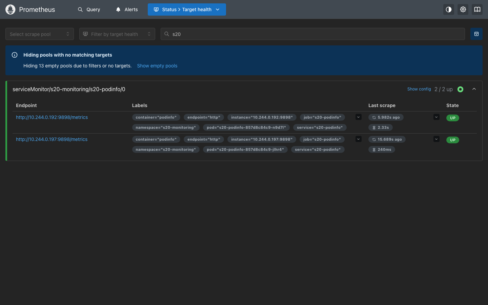

### 1.5 Application health

Health is checked in two places:

1. **Kubernetes probes.** The kubelet calls `/healthz` (liveness: restart the container if it fails) and
   `/readyz` (readiness: stop sending Service traffic if it fails).
2. **Prometheus.** `up{job="s20-podinfo"}` is 1 when the `/metrics` scrape succeeds, and
   `kube_deployment_status_replicas_available` comes from kube-state-metrics. Both feed the `S20AppDown` alert.

```bash
kubectl describe deploy s20-podinfo -n s20-monitoring | grep -E "Liveness|Readiness|Limits|Requests|cpu|memory"
kubectl exec -n s20-monitoring deploy/s20-loadgen -- wget -qO- http://s20-podinfo:9898/healthz
kubectl exec -n s20-monitoring deploy/s20-loadgen -- wget -qO- http://s20-podinfo:9898/readyz
kubectl get pods -n s20-monitoring -l app=s20-podinfo -o custom-columns='POD:.metadata.name,READY:.status.containerStatuses[0].ready,RESTARTS:.status.containerStatuses[0].restartCount,PHASE:.status.phase'
```


The 3-4 restarts above are probes doing their job. While the node was overloaded, `/healthz` did not answer
within the original 1s probe timeout, so the kubelet restarted podinfo. The events below show this. I later
raised the probe timeouts to 5s in `demo-app.yaml`. I also restarted podinfo once to get fresh containers after
those restarts (one restarted container had stopped reporting per-container CPU):

```bash
kubectl rollout restart deployment/s20-podinfo -n s20-monitoring
kubectl rollout status deployment/s20-podinfo -n s20-monitoring --timeout=180s
kubectl get pods -n s20-monitoring -l app=s20-podinfo
```


Health status through PromQL (after the incident drill in 1.10):

```bash
curl -s localhost:19090/api/v1/query --data-urlencode 'query=up{job="s20-podinfo"}' | jq ...
curl -s localhost:19090/api/v1/query --data-urlencode 'query=kube_deployment_status_replicas_available{namespace="s20-monitoring"}' | jq ...
curl -s localhost:19090/api/v1/query --data-urlencode 'query=sum by (status) (rate(http_request_duration_seconds_count{namespace="s20-monitoring"}[2m]))' | jq ...
curl -s localhost:19090/api/v1/query --data-urlencode 'query=histogram_quantile(0.95, sum by (le) (rate(http_request_duration_seconds_bucket{namespace="s20-monitoring"}[5m])))' | jq ...
curl -s localhost:19090/api/v1/query --data-urlencode 'query=sum by (pod) (kube_pod_container_status_restarts_total{namespace="s20-monitoring"})' | jq ...
```
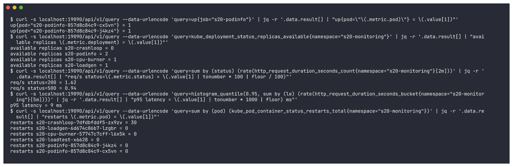

### 1.6 CPU & memory utilisation

**`kubectl top`** reads live data from metrics-server. The cpu-burner sits at exactly its **100m** limit,
because the kernel throttles it there:

```bash
kubectl top nodes
kubectl top pods -n s20-monitoring
kubectl top pods -n s20-monitoring --containers --sort-by=cpu
kubectl top pods -n monitoring --sort-by=memory
```


**PromQL through the Prometheus HTTP API.** This shows per-pod CPU (cores, and % of the limit), per-pod
memory working set, and node CPU and memory %:

```bash
curl -s localhost:19090/api/v1/query --data-urlencode 'query=sum by (pod) (rate(container_cpu_usage_seconds_total{namespace="s20-monitoring",container!=""}[2m]))'
curl -s localhost:19090/api/v1/query --data-urlencode 'query=100 * sum by (pod) (rate(container_cpu_usage_seconds_total{namespace="s20-monitoring",container!=""}[2m])) / sum by (pod) (kube_pod_container_resource_limits{namespace="s20-monitoring",resource="cpu"})'
curl -s localhost:19090/api/v1/query --data-urlencode 'query=sum by (pod) (container_memory_working_set_bytes{namespace="s20-monitoring",container!=""}) / 1024 / 1024'
curl -s localhost:19090/api/v1/query --data-urlencode 'query=100 * (1 - avg(rate(node_cpu_seconds_total{mode="idle"}[2m])))'
curl -s localhost:19090/api/v1/query --data-urlencode 'query=100 * (1 - node_memory_MemAvailable_bytes / node_memory_MemTotal_bytes)'
```


**Grafana -> Node Exporter / Nodes** (last 1h). Node CPU, load average and memory are all here, and so is
the overload: load average reached ~270 around 19:08 UTC and then dropped back down.
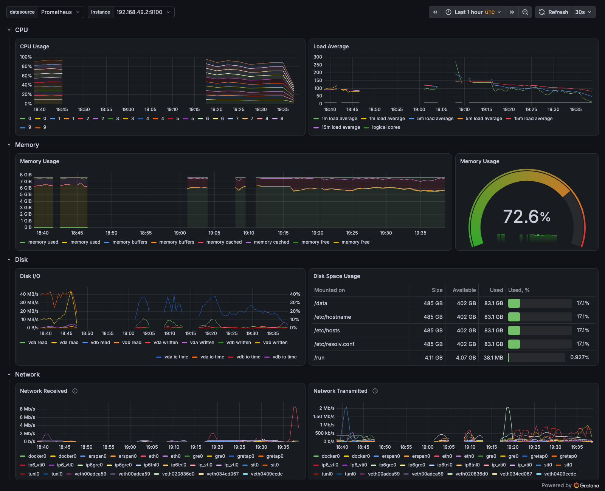

**Grafana -> Kubernetes / Compute Resources / Namespace (Pods)** for `s20-monitoring` shows CPU and memory
per pod with their requests and limits. The usage graphs only cover 19:10-19:33 UTC. That is the window when
the kubelet's cAdvisor endpoint could still be scraped, before I switched to `/metrics/resource` (see the tuning
section; this built-in dashboard filters on the cAdvisor job, so it goes blank after the switch). The
CPU/memory quota tables are complete.
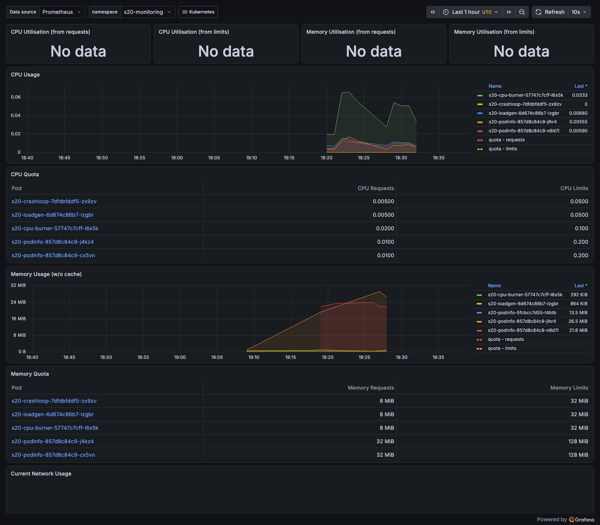

### 1.7 Metrics: PromQL graph

**Prometheus -> Query -> Graph**: podinfo request rate split by HTTP status (`200` from `/`, `500` from
`/status/500`). The gap around 19:15 UTC is the period when Prometheus itself was restarted during the overload.
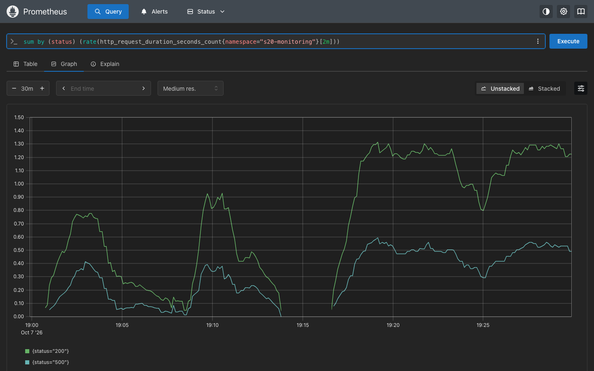

### 1.8 Logs

```bash
kubectl logs deploy/s20-podinfo -n s20-monitoring --tail=4                                  # structured JSON request logs
kubectl logs -n s20-monitoring -l app=s20-podinfo --prefix --tail=200 | grep -c '/status/500'
kubectl logs deploy/s20-loadgen -n s20-monitoring --tail=6                                  # client side: 200s and expected 500s
kubectl logs deploy/s20-cpu-burner -n s20-monitoring
kubectl logs deploy/s20-crashloop -n s20-monitoring --previous                              # log of the container that crashed
```


Events are the cluster's own log. They show the BackOff of the crash-looping pod, the probe failures, and
the crashed container's exit code:

```bash
kubectl get events -n s20-monitoring --field-selector reason=BackOff -o custom-columns='LAST:.lastTimestamp,COUNT:.count,OBJECT:.involvedObject.name,MESSAGE:.message' | tail -3
kubectl get events -n s20-monitoring --field-selector reason=Unhealthy -o custom-columns='LAST:.lastTimestamp,COUNT:.count,OBJECT:.involvedObject.name,MESSAGE:.message' | tail -4
kubectl describe pod -n s20-monitoring -l app=s20-crashloop | grep -A6 "Last State"
```


### 1.9 Alerts

The custom rules in [`monitoring/alert-rules.yaml`](monitoring/alert-rules.yaml), all labelled `session: "20"`:

| Alert | Expression (short) | for | Fires when |
|---|---|---|---|
| `S20PodCrashLooping` | `max_over_time(kube_pod_container_status_waiting_reason{reason="CrashLoopBackOff"}[5m]) >= 1` | 1m | a container keeps crashing |
| `S20HighCPUUsage` | CPU rate / CPU limit `> 0.8` | 1m | a container uses >80% of its CPU limit |
| `S20HighMemoryUsage` | working set / memory limit `> 0.9` | 2m | a container is close to OOMKill |
| `S20AppDown` | `absent(up{namespace="s20-monitoring", job="s20-podinfo"} == 1)` | 1m | no healthy podinfo target (all down **or** scaled to 0) |
| `S20PodNotReady` | `kube_pod_status_ready{condition="false"} == 1` | 1m | a pod fails its readiness probe |

The operator loaded the rules, and Prometheus evaluates them (state for each rule):

```bash
kubectl get prometheusrule s20-demo-alerts -n s20-monitoring -o jsonpath='{range .spec.groups[0].rules[*]}{.alert}{"\n"}{end}'
curl -s localhost:19090/api/v1/rules | jq -r '.data.groups[] | select(.name=="s20-demo.rules") | .rules[] | "\(.name)\tstate=\(.state)\thealth=\(.health)\tactive=\(.alerts | length)"'
```


The crash-loop, high-CPU and not-ready alerts are **FIRING** in Prometheus and have reached **Alertmanager**:

```bash
curl -s localhost:19090/api/v1/alerts | jq -r '.data.alerts[] | select(.labels.session=="20") | ...'
curl -s localhost:19093/api/v2/alerts | jq -r '.[] | select(.labels.session=="20") | ...'
```


### 1.10 Incident drill: healthy -> under load -> app down -> recovered

My custom dashboard **"S20 - podinfo App Health"** ([`grafana-dashboard.yaml`](monitoring/grafana-dashboard.yaml))
shows `up` targets, available replicas, request rate, firing alerts, request rate by status, p95 latency,
CPU and memory per pod, restarts, and alert states.

**State 1 - healthy.** 2/2 targets UP, 2 replicas, ~1.3 req/s from the load generator. The p95 spikes and the
gaps earlier in the 30-minute window are from the overload period.


At this point `S20AppDown` is **INACTIVE** (green) in Prometheus -> Alerts:
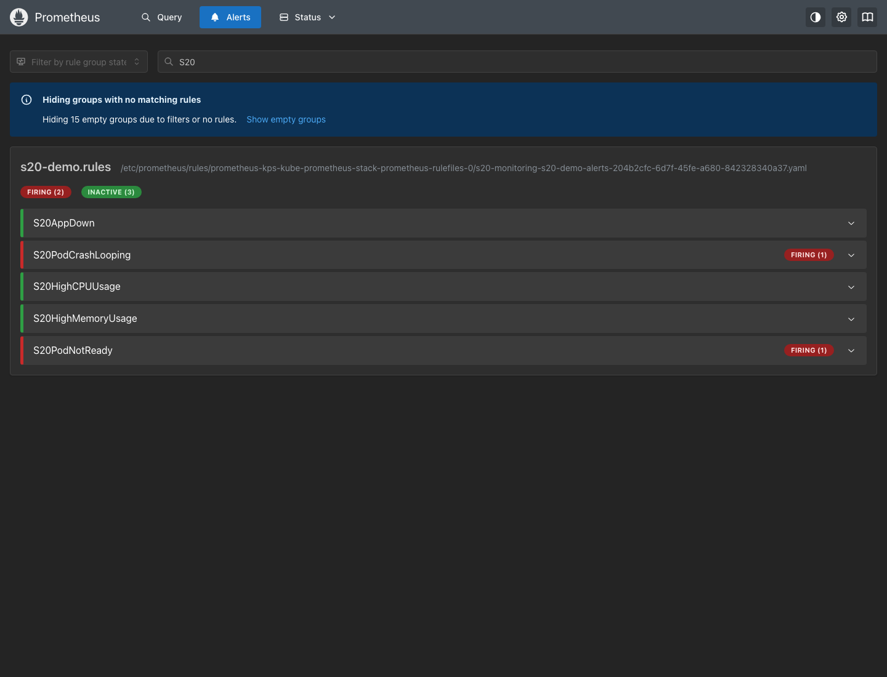

**State 2 - under load.** I ran a 3-minute burst with 8 parallel workers ([`loadtest-job.yaml`](monitoring/loadtest-job.yaml)):

```bash
kubectl apply -f monitoring/loadtest-job.yaml
kubectl wait --for=condition=Ready pod -l app=s20-loadtest -n s20-monitoring --timeout=180s   # raced the pod creation
kubectl get pods -n s20-monitoring -l app=s20-loadtest
kubectl logs job/s20-loadtest -n s20-monitoring
```
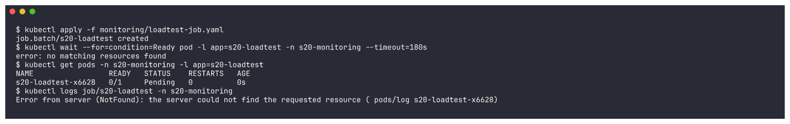
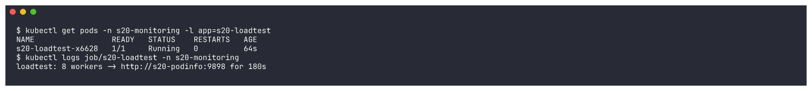

Request rate went from ~1.3 to **~20 req/s**:

```bash
kubectl top pods -n s20-monitoring          # metrics-server was briefly unavailable on the busy node
curl -s localhost:19090/api/v1/query --data-urlencode 'query=sum by (status) (rate(http_request_duration_seconds_count{namespace="s20-monitoring"}[1m]))' | jq ...
curl -s localhost:19090/api/v1/query --data-urlencode 'query=sum by (pod) (rate(container_cpu_usage_seconds_total{namespace="s20-monitoring",container!=""}[2m]))' | jq ...
```
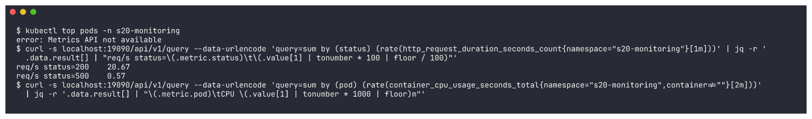

> At this moment `kubectl top` returned "Metrics API not available" and the per-pod CPU query came back
> empty. Both depend on the kubelet's resource endpoint, which was timing out under the node's load. The
> request-rate metrics come from podinfo itself and were unaffected.

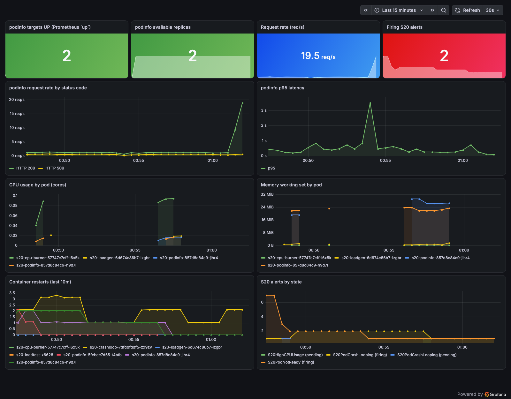

```bash
kubectl wait --for=condition=complete job/s20-loadtest -n s20-monitoring --timeout=300s
kubectl logs job/s20-loadtest -n s20-monitoring
```
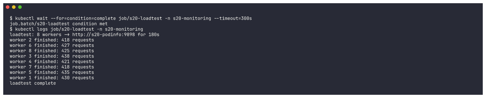

**State 3 - app down.** I broke the app by scaling it to 0. This is the same as a bad deploy that takes
every pod down:

```bash
kubectl scale deployment s20-podinfo -n s20-monitoring --replicas=0
kubectl rollout status deployment/s20-podinfo -n s20-monitoring --timeout=120s
kubectl get deploy s20-podinfo -n s20-monitoring
kubectl get endpointslices -n s20-monitoring -l kubernetes.io/service-name=s20-podinfo
```
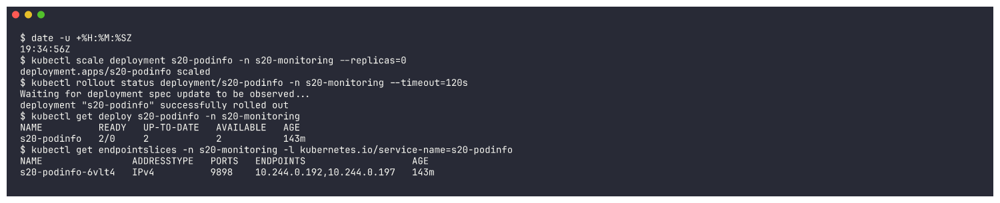

`S20AppDown` went **inactive -> pending (19:35:54Z) -> firing (19:36:55Z)**. That is about 1 minute,
matching `for: 1m`. The load generator logs show `Connection refused` from the client's side:

```bash
for i in $(seq 1 40); do s=$(curl -s localhost:19090/api/v1/rules | jq -r '... select(.name=="S20AppDown") | .state'); echo "$(date -u +%H:%M:%SZ)  S20AppDown state=$s"; [ "$s" = "firing" ] && break; sleep 15; done
curl -s localhost:19090/api/v1/alerts | jq -r '.data.alerts[] | select(.labels.alertname=="S20AppDown") | ...'
kubectl logs deploy/s20-loadgen -n s20-monitoring --tail=4
```
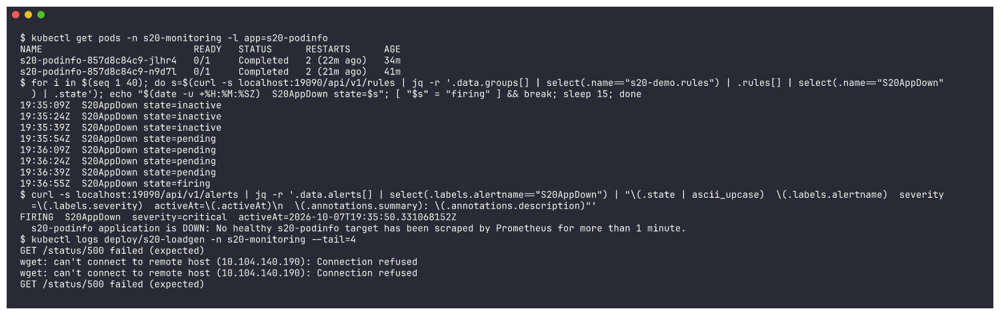

Prometheus -> Alerts: `S20AppDown` **FIRING**.
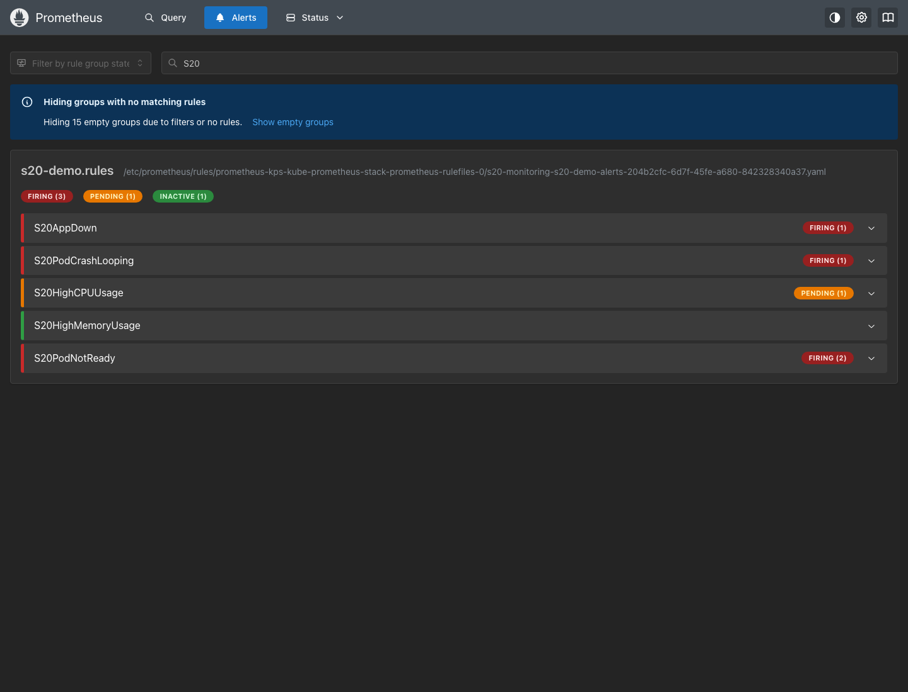

Alertmanager UI filtered to `session="20"`: the critical `S20AppDown` alert has arrived next to the others.
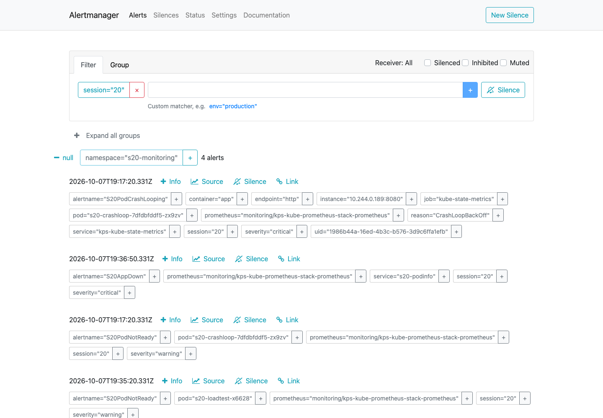

Grafana: targets UP **0**, available replicas **0**, request rate **0 req/s**, and 4 firing alerts. The load-test
peak is visible just before the drop.
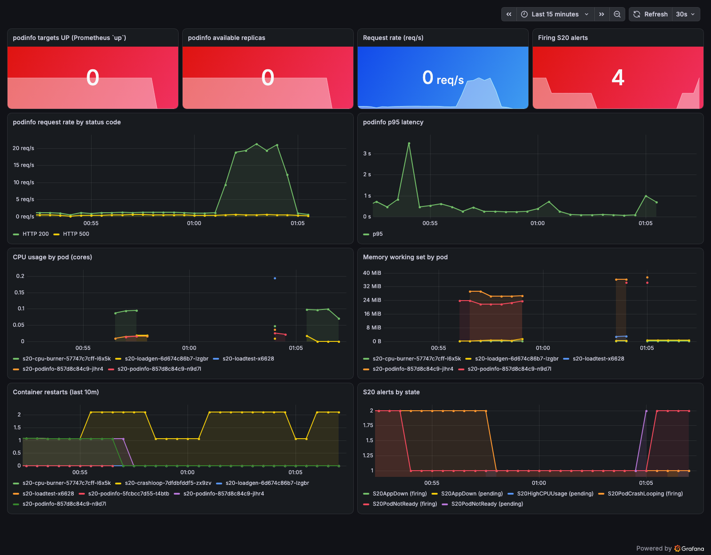

**State 4 - recovered.** I scaled back to 2. Prometheus scraped the new pods within ~20s, and the alert went
**firing -> inactive** and disappeared from Alertmanager:

```bash
kubectl scale deployment s20-podinfo -n s20-monitoring --replicas=2
kubectl rollout status deployment/s20-podinfo -n s20-monitoring --timeout=300s
kubectl get pods -n s20-monitoring -l app=s20-podinfo
for i in $(seq 1 40); do ...; echo "$(date -u +%H:%M:%SZ)  S20AppDown state=$s  sum(up)=$u"; [ "$s" = "inactive" ] && break; sleep 15; done
curl -s localhost:19093/api/v2/alerts | jq -r '[.[] | select(.labels.alertname=="S20AppDown")] | "Alertmanager active S20AppDown alerts: \(length)"'
```
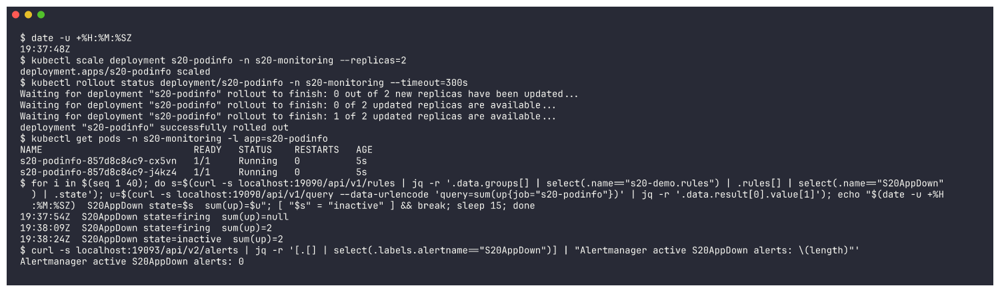

Prometheus -> Alerts: `S20AppDown` is back to **INACTIVE**. Crash-loop, high-CPU and not-ready keep firing
because those demo workloads are still broken on purpose.
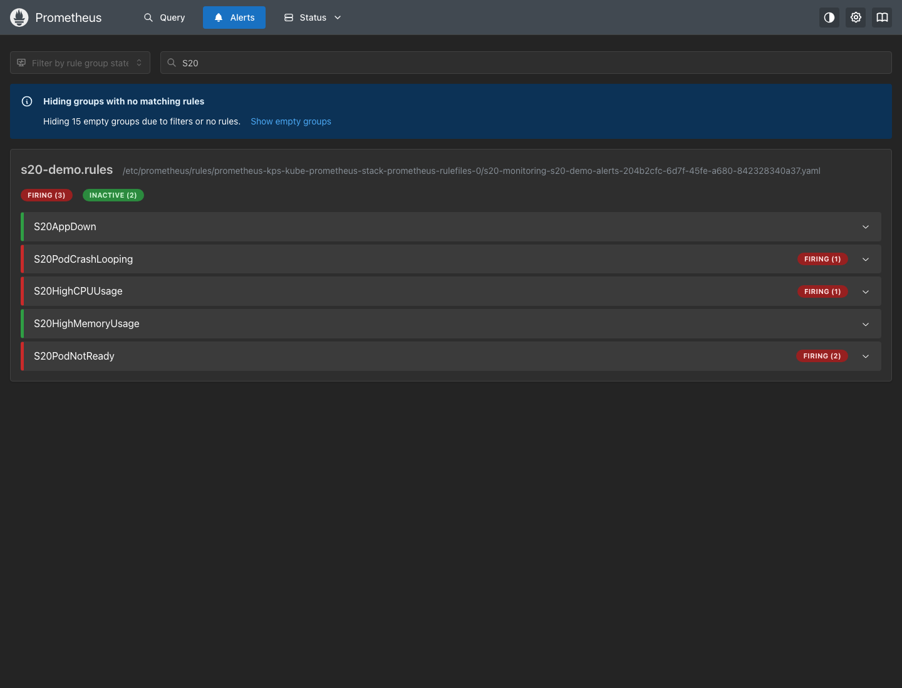

Grafana: 2 targets UP and 2 replicas again, with traffic flowing:
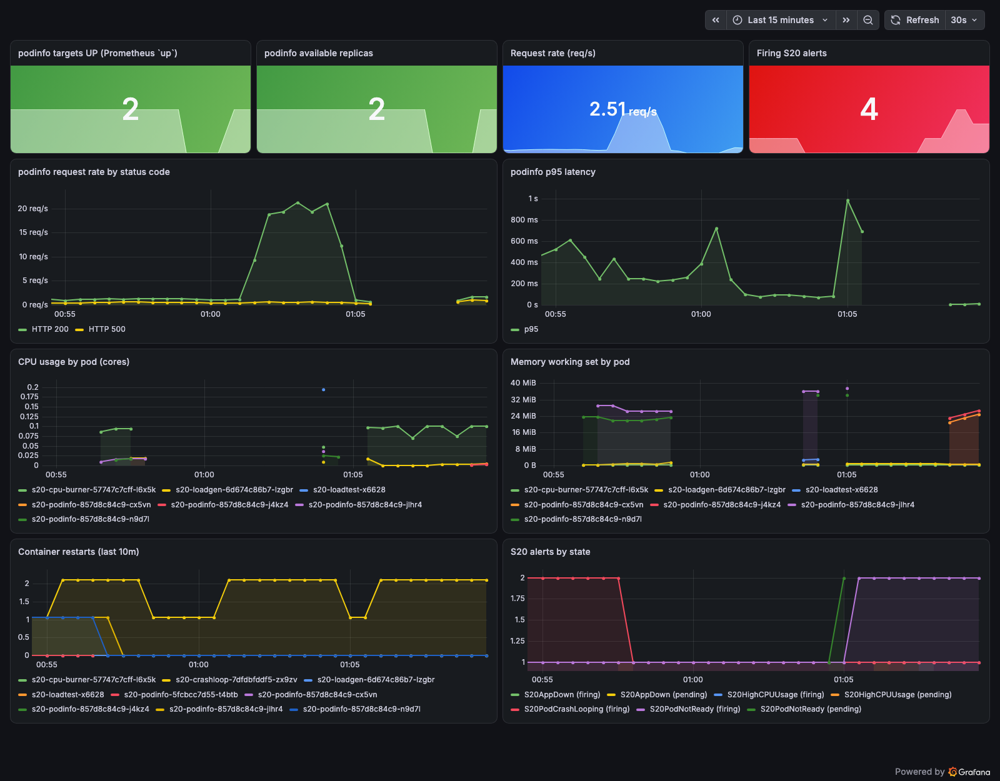

Final state with `kubectl top` working again:

```bash
kubectl top nodes
kubectl top pods -n s20-monitoring
kubectl get pods -n s20-monitoring
curl -s localhost:19090/api/v1/alerts | jq -r '.data.alerts[] | select(.labels.session=="20") | ...'
```
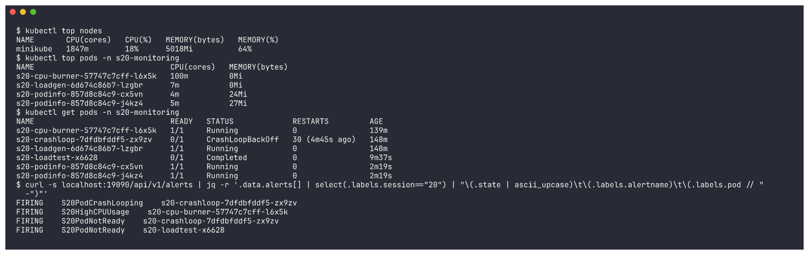

> Observation: `S20PodNotReady` also fired for the **Completed** load-test pod, because a finished pod
> reports `ready=false`. A production version of the rule should only consider pods in phase `Running`,
> for example by joining with `kube_pod_status_phase{phase="Running"}`.

Afterwards I stopped the two deliberately broken demos so they would not keep loading the shared node.
podinfo and the load generator are still running:

```bash
kubectl scale deployment s20-cpu-burner s20-crashloop -n s20-monitoring --replicas=0
kubectl get deploy -n s20-monitoring; kubectl get pods -n monitoring; kubectl get pods -n argocd; kubectl get applications -n argocd
```
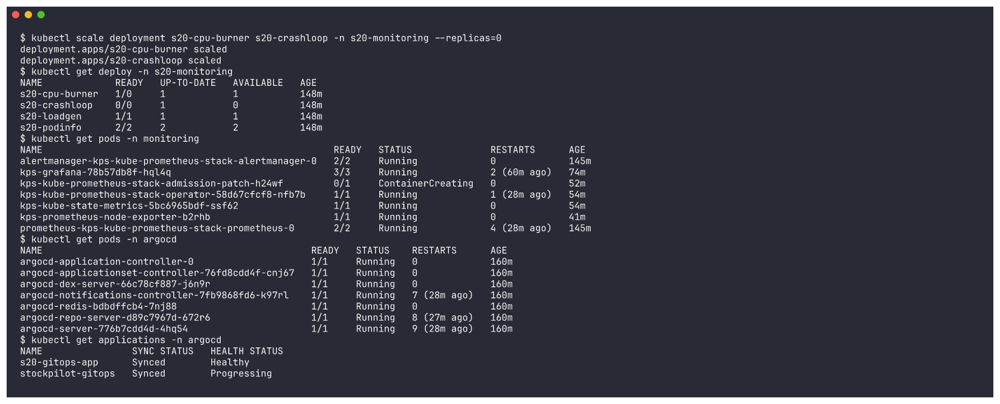

### Keeping the stack healthy on a crowded node

Every problem in this table showed up in the monitoring data itself, so the stack ended up debugging its
own cluster. Each fix is now part of [`kps-values.yaml`](monitoring/kps-values.yaml):

| Symptom (seen in) | Cause | Fix |
|---|---|---|
| kubelet target **DOWN**: `context deadline exceeded` (Targets page) | kubelet `/metrics` took >10s to answer on the busy node | `prometheusSpec.scrapeTimeout: 25s` |
| Grafana pod **OOMKilled** (`kubectl get pods`), "Grafana has failed to load its application files" | 384Mi limit too small for Grafana 13 | Grafana memory limit raised to 768Mi |
| operator / node-exporter / kube-state-metrics / podinfo restarting: `Liveness probe failed ... context deadline exceeded` (events) | default 1s probe timeouts on a CPU-starved node | probe `timeoutSeconds: 10` (podinfo: 5s) |
| API server scrape taking ~17s; kubelet `/metrics` and `/metrics/cadvisor` timing out even at 25s | very large metric pages on a node at load average 100-270 | API server scraping and kubelet `/metrics` turned off; container CPU and memory now come from the small kubelet `/metrics/resource` endpoint (the same source `kubectl top` uses) |
| `helm upgrade --wait` timing out / post-upgrade hook stuck | node too slow to roll pods within the timeout; the hook's ServiceAccount was already deleted | `helm upgrade --no-hooks` once the pods were healthy; deleted the orphaned hook Job |

```bash
helm upgrade kps prometheus-community/kube-prometheus-stack -n monitoring -f monitoring/kps-values.yaml --wait --timeout 10m | head -8   # scrapeTimeout 25s
```


```bash
helm upgrade kps ... -f monitoring/kps-values.yaml --wait --timeout 10m      # Grafana 768Mi - applied, but --wait timed out on the slow node
```
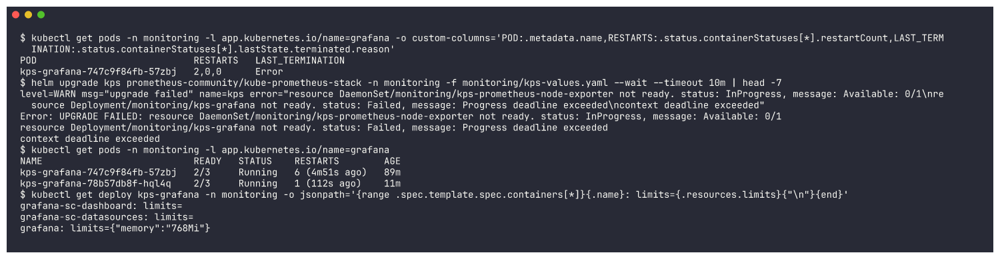

```bash
helm upgrade kps ... -f monitoring/kps-values.yaml        # probe timeouts + cAdvisor interval - resources applied, the post-upgrade hook timed out
kubectl apply -f monitoring/demo-app.yaml                 # podinfo probe timeouts 1s -> 5s
```
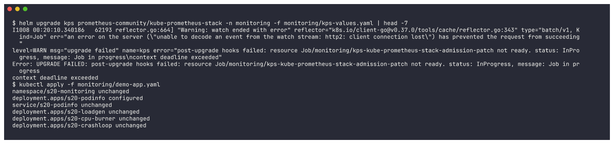

```bash
helm upgrade kps ... -f monitoring/kps-values.yaml --no-hooks --timeout 15m   # stop scraping the API server
```
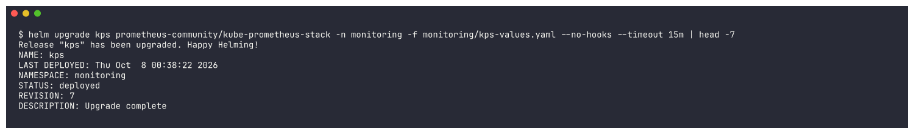

```bash
helm upgrade kps ... -f monitoring/kps-values.yaml --no-hooks --timeout 15m   # drop a Grafana readiness override so the healthy pod is kept
kubectl get rs -n monitoring -l app.kubernetes.io/name=grafana; kubectl get pods -n monitoring
```
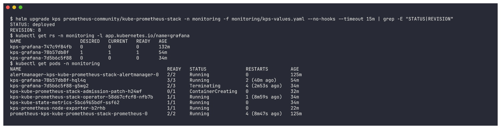

```bash
helm upgrade kps ... --no-hooks    # stop scraping kubelet /metrics (kept timing out)
```
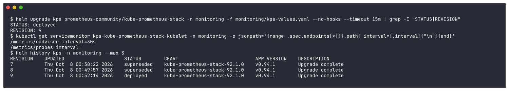

```bash
helm upgrade kps ... --no-hooks    # container CPU/memory from kubelet /metrics/resource instead of /metrics/cadvisor
```
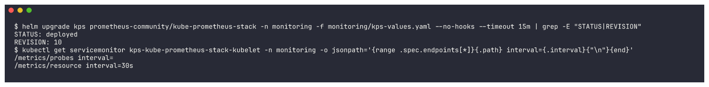

```bash
kubectl delete job kps-kube-prometheus-stack-admission-patch -n monitoring   # orphaned hook Job: its ServiceAccount no longer exists
helm status kps -n monitoring | head -6
```
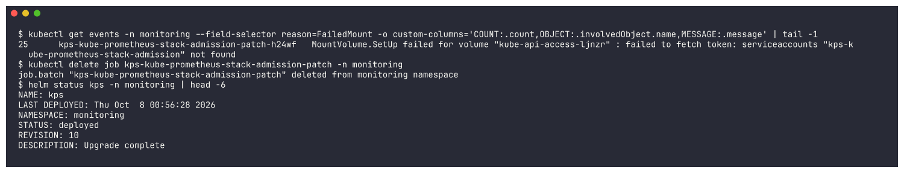

---

## Task 2: Observability

The full documentation is in **[`observability/README.md`](observability/README.md)**:

- **Monitoring vs observability.** Monitoring tells you *that* something is wrong; observability lets you
  find out *why*.
- **The three pillars:**
  - **Metrics** are numbers over time (CPU, request rate, `up`). They answer "how much / how often?".
  - **Logs** are timestamped events (`FATAL: DATABASE_URL is not set`). They answer "what happened?".
  - **Traces** follow one request across services. They answer "where did the time go?".
- **Why observability is needed:** distributed and ephemeral systems, faster MTTD/MTTR, unknown unknowns,
  capacity and cost, SLOs, safe deploys, audit.
- **Common tools:** Prometheus, Grafana, Alertmanager, Loki, ELK/EFK, Fluent Bit, Jaeger, Tempo,
  OpenTelemetry, CloudWatch, Datadog.
- **Kubernetes observability:** the layers to watch (cluster, node, pod, object, app), built-in signals
  (`kubectl get/describe/logs/top/events`, probes), and the full stack (node-exporter, cAdvisor,
  kube-state-metrics, ServiceMonitor and PrometheusRule CRDs, log agents, OTel collector).

Task 1 above uses all of this hands-on: metrics (Prometheus/PromQL, `kubectl top`), logs (`kubectl logs`,
events), alerts (PrometheusRule -> Alertmanager), and dashboards (Grafana).

---

## Task 3: GitOps

### What is GitOps?

GitOps is a way of running infrastructure and applications where **the desired state of the whole system is
stored as declarative files in Git**. An **agent running inside the cluster** (Argo CD or Flux) keeps pulling
that state and making the cluster match it. Nobody runs `kubectl apply` against production by hand: changes go
through commits and pull requests, and the agent applies them.

The four GitOps principles (OpenGitOps):

1. **Declarative.** The system is described as *what* it should be, not *how* to get there.
2. **Versioned and immutable.** That description lives in Git, so every change has an author, a review, a
   diff and a way to undo it.
3. **Pulled automatically.** An agent in the cluster pulls the desired state. CI does not need cluster
   credentials to push.
4. **Continuously reconciled.** The agent keeps comparing desired and actual state and fixes any drift.

### Git as the source of truth

- **The repo is the single place that defines what runs.** If the YAML in `gitops/app/` says 2 replicas of
  nginx 1.27, then that is what should be running. Anything different in the cluster is *drift*.
- **History and audit for free.** `git log` shows who changed what, when and why (see [g11](#g11-git-history--deployment-history)).
- **Rollback is a commit.** Use `git revert` or edit the file back, and the cluster follows (see [g10](#g10-rollback-through-git-revert-commit)).
- **Disaster recovery.** Point Argo CD at the repo on a fresh cluster and it rebuilds everything.
- **Review before deploy.** Pull requests become the change-approval process.

### Declarative configuration

```yaml
# Imperative - a sequence of commands; the end state lives only in someone's shell history
kubectl create deployment web --image=nginx:1.27-alpine
kubectl scale deployment web --replicas=3

# Declarative - describe the end state; the tool works out how to get there (gitops/app/deployment.yaml)
apiVersion: apps/v1
kind: Deployment
metadata: { name: s20-gitops-app, namespace: s20-gitops }
spec:
  replicas: 2
  template:
    spec:
      containers:
        - name: app
          image: nginx:1.27-alpine
```

Applying a declarative file a second time changes nothing (it is *idempotent*), and the same file can be
diffed against the live cluster. That diff is exactly what Argo CD shows as `Synced` or `OutOfSync`.

### Continuous reconciliation

```text
          desired state (Git)                       actual state (cluster)
                 │                                          │
                 └────────────►  Argo CD compares  ◄────────┘
                                       │
                         same? ── yes ──► Synced (do nothing)
                                       │
                                       no  (new commit OR someone ran kubectl by hand)
                                       │
                                       ▼
                         apply the difference (sync) ──► Synced again
```

Argo CD polls Git about every 3 minutes (or on a webhook or a manual refresh) and watches the live objects.
`selfHeal: true` makes it reverse manual changes, and `prune: true` makes it delete objects whose YAML was
removed from Git.

### GitOps workflow

```text
 Developer                 GitHub repo                     Argo CD (in cluster)                Kubernetes
 ─────────                 ───────────                     ────────────────────                ──────────
 edit gitops/app/*.yaml
 git commit + push  ───►   main @ new SHA
                            DevOps-main/.../gitops/app
                                     │   poll / refresh
                                     └──────────────────►  fetch manifests at SHA
                                                           diff vs live objects ──OutOfSync──►
                                                           sync (kubectl apply)  ────────────►  Deployment/Service updated
                                                           health checks        ◄────────────   pods Ready
                                                           status: Synced / Healthy
                     (someone runs kubectl scale)  ──────────────────────────────────────────►  drift!
                                                           selfHeal: re-apply Git state ─────►  back to Git's value
```

### Kubernetes + GitOps: how this repo is wired

- [`gitops/app/`](gitops/app/) holds a `Namespace` (`s20-gitops`), a `Deployment` (`s20-gitops-app`, nginx,
  probes and resources), and a `Service`.
- [`gitops/argocd-application.yaml`](gitops/argocd-application.yaml) is the Argo CD `Application`:
  `repoURL: https://github.com/tanishkothari9/DevOps.git`, `targetRevision: main`,
  `path: DevOps-main/Monitoring-Observability-GitOps/gitops/app`, `syncPolicy.automated {prune, selfHeal}`,
  `CreateNamespace=true`. It sits **outside** `app/` so Argo CD does not try to manage its own definition.
- More detail is in [`gitops/README.md`](gitops/README.md).

> Pushing: other homework folders live in the same repo, so I committed and pushed **only this folder**
> with a small helper script (`gitpush.sh "<message>" <path>`). It runs `git add <path>`, `git commit`
> and `git push origin main`. That is the `.../tools/gitpush.sh` line in the g07 and g10 screenshots.

### GitOps demo

#### g01: install Argo CD
```bash
kubectl create namespace argocd
kubectl apply -n argocd --server-side --force-conflicts -f https://raw.githubusercontent.com/argoproj/argo-cd/stable/manifests/install.yaml
```


#### g02: Argo CD pods, services and CRDs
```bash
kubectl get pods -n argocd -o wide
kubectl get svc -n argocd
kubectl get crd | grep argoproj.io
```


#### g03: manifests pushed to GitHub first
The manifests were committed and pushed **before** Argo CD was told about them. GitHub serves exactly that file:
```bash
git log --oneline -3 -- gitops/
git ls-remote origin refs/heads/main
ls gitops/app
curl -s https://raw.githubusercontent.com/tanishkothari9/DevOps/main/DevOps-main/Monitoring-Observability-GitOps/gitops/app/deployment.yaml | head -24
```


#### g04: register the app (the only manual `kubectl apply`)
```bash
cat gitops/argocd-application.yaml
kubectl apply -f gitops/argocd-application.yaml
kubectl get applications -n argocd
```


#### g05: Synced / Healthy
Argo CD fetched the repo and created everything in `app/`. The revision is the commit SHA it deployed:
```bash
kubectl get applications -n argocd
kubectl get application s20-gitops-app -n argocd -o custom-columns='SYNC:.status.sync.status,HEALTH:.status.health.status,REVISION:.status.sync.revision,PHASE:.status.operationState.phase,PATH:.spec.source.path'
kubectl get application s20-gitops-app -n argocd -o jsonpath='{range .status.resources[*]}{.kind}/{.name} -> {.status}{"\n"}{end}'
```


#### g06: resources created from Git
Argo CD created these. I never ran `kubectl apply` on `gitops/app/`. Each object carries Argo CD's `tracking-id`:
```bash
kubectl get all -n s20-gitops -o wide
kubectl get deploy s20-gitops-app -n s20-gitops -o jsonpath='tracking-id annotation set by Argo CD: {.metadata.annotations.argocd\.argoproj\.io/tracking-id}{"\n"}'
kubectl exec -n s20-gitops deploy/s20-gitops-app -- wget -qO- http://localhost | grep -i "<title>"
```


#### g07: change the desired state **in Git** (replicas 2 -> 3, nginx 1.27 -> 1.28)
```bash
sed -i '' -e 's/replicas: 2/replicas: 3/' -e 's/nginx:1.27-alpine/nginx:1.28-alpine/' gitops/app/deployment.yaml
git diff -- gitops/app/deployment.yaml
gitpush.sh "feat(gitops): scale s20-gitops-app to 3 replicas and bump nginx to 1.28-alpine" DevOps-main/Monitoring-Observability-GitOps/gitops/app
```


#### g08: Argo CD reconciles automatically
I only asked Argo CD to re-check Git right away (`refresh=hard`, which saves waiting for the ~3 min poll).
I did not touch the Deployment myself. About 25s later the spec changed to `3 replicas / nginx:1.28-alpine`,
the rollout completed, and the app's revision equals the new commit `b03556f`:
```bash
git log --oneline -1 origin/main -- gitops/app
kubectl get deploy s20-gitops-app -n s20-gitops -o wide
kubectl annotate application s20-gitops-app -n argocd argocd.argoproj.io/refresh=hard --overwrite
for i in $(seq 1 60); do ...print readyReplicas/replicas and image every 5s...; done
kubectl get applications -n argocd -o custom-columns='NAME:.metadata.name,SYNC:.status.sync.status,HEALTH:.status.health.status,REVISION:.status.sync.revision'
kubectl get deploy,pods -n s20-gitops -o wide
```


#### g09: self-heal: a manual `kubectl scale` is reverted
Someone "fixes" production by hand and scales to 1. Git still says 3, so Argo CD detects the drift
(`Synced -> OutOfSync`), re-applies Git's value (`spec.replicas=3` about 18s later), and reports `Synced` again:
```bash
kubectl get applications -n argocd
kubectl scale deployment s20-gitops-app -n s20-gitops --replicas=1
kubectl get deploy s20-gitops-app -n s20-gitops
for i in $(seq 1 60); do r=$(kubectl get deploy s20-gitops-app -n s20-gitops -o jsonpath='{.spec.replicas}'); echo "t+$((i*2))s  spec.replicas=$r"; [ "$r" = "3" ] && break; sleep 2; done
kubectl rollout status deployment/s20-gitops-app -n s20-gitops --timeout=120s
kubectl get deploy s20-gitops-app -n s20-gitops
kubectl get events -n argocd --field-selector involvedObject.name=s20-gitops-app --sort-by=.lastTimestamp -o custom-columns='TIME:.lastTimestamp,REASON:.reason,MESSAGE:.message' | tail -4
```


#### g10: rollback through Git (`revert:` commit)
To roll back, I changed the file back and pushed. Argo CD followed:
```bash
sed -i '' -e 's/replicas: 3/replicas: 2/' -e 's/nginx:1.28-alpine/nginx:1.27-alpine/' gitops/app/deployment.yaml
git diff -- gitops/app/deployment.yaml
gitpush.sh "revert: roll s20-gitops-app back to 2 replicas and nginx 1.27-alpine" DevOps-main/Monitoring-Observability-GitOps/gitops/app
kubectl annotate application s20-gitops-app -n argocd argocd.argoproj.io/refresh=hard --overwrite
for i in $(seq 1 60); do ...print spec replicas + image every 5s...; done
kubectl rollout status deployment/s20-gitops-app -n s20-gitops --timeout=180s
kubectl get deploy s20-gitops-app -n s20-gitops -o wide
```


#### g11: Git history = deployment history
Each Argo CD sync matches a commit, which gives a full audit trail:
```bash
git log --oneline -4 origin/main -- gitops/app
kubectl get application s20-gitops-app -n argocd -o jsonpath='{range .status.history[*]}id={.id}  deployedAt={.deployedAt}  revision={.revision}{"\n"}{end}'
kubectl get applications -n argocd -o custom-columns='NAME:.metadata.name,SYNC:.status.sync.status,HEALTH:.status.health.status,REVISION:.status.sync.revision'
kubectl get all -n s20-gitops
```


| Argo CD history id | Commit | What changed |
|---|---|---|
| 0 | `501b12c` (main at first sync; contains `f6041a2`) | initial deploy: 2 x nginx 1.27 |
| 1 | `b03556f` | 3 x nginx 1.28 |
| 2 | `dca89a6` | `revert:` back to 2 x nginx 1.27 |

---

## What I learned

- **Monitoring needs all the signals together.** The alert told me *that* podinfo was down. The logs (`Connection
  refused` in the load generator) and events (probe failures, BackOff) told me *why*. Metrics showed *how much*:
  request rate, CPU against the limit, restarts.
- **`absent()` matters for "app down" alerts.** When every pod is gone, the `up` series disappears instead of
  becoming 0, so `up == 0` alone would never fire. `absent(up{...} == 1)` covers both cases.
- **Probes and limits need room.** On a CPU-starved node, 1s probe timeouts restarted perfectly healthy pods,
  and a too-small memory limit OOMKilled Grafana. Monitoring data caught both problems.
- **GitOps turns operations into Git operations.** Deploy = commit, rollback = revert commit,
  drift = automatically undone, audit = `git log`. The cluster stopped being the place where changes are made;
  it became a copy of the repo.

## Cleanup (not run: the stack is left up on purpose for the next session)

```bash
kubectl delete -f gitops/argocd-application.yaml          # prune removes s20-gitops too
kubectl delete namespace s20-monitoring
helm uninstall kps -n monitoring
kubectl delete -n argocd -f https://raw.githubusercontent.com/argoproj/argo-cd/stable/manifests/install.yaml
```
