# Session 20: Monitoring, Observability & GitOps

> Work in progress: the full write-up for this session is being finalised. Every screenshot below is real output from commands run on a local minikube cluster / Docker / GitHub Actions.

## Evidence

### g01-install-argocd

```bash
kubectl create namespace argocd && kubectl apply -n argocd --server-side --force-conflicts -f https://raw.githubusercontent.com/argoproj/argo-cd/stable/manifests/install.yaml | tail -25
```

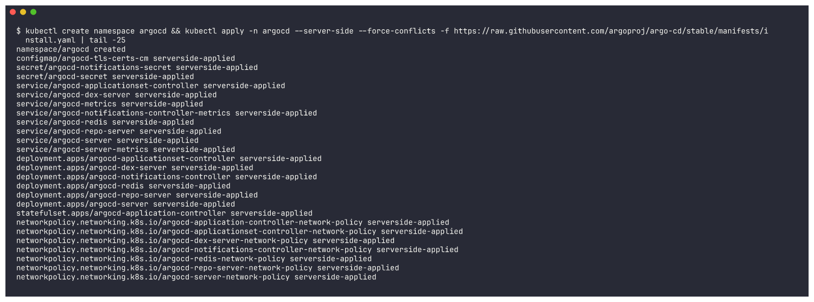

### g02-argocd-pods

```bash
kubectl get pods -n argocd -o wide | cut -c1-120 && echo && kubectl get svc -n argocd && echo && kubectl get crd | grep argoproj.io
```

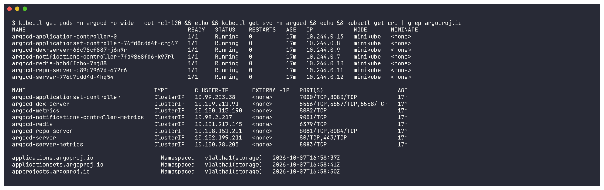

### g03-manifests-in-git

```bash
git log --oneline -3 -- gitops/ && git ls-remote origin refs/heads/main && ls gitops/app && echo "--- deployment.yaml as served by GitHub ---" && curl -s https://raw.githubusercontent.com/tanishkothari9/DevOps/main/DevOps-main/Monitoring-Observability-GitOps/gitops/app/deployment.yaml | head -24
```

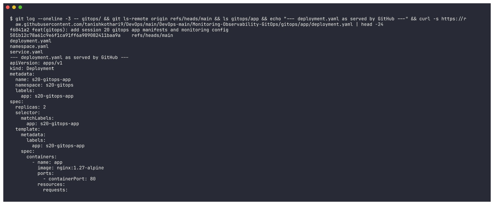

### g04-register-app

```bash
cat gitops/argocd-application.yaml && kubectl apply -f gitops/argocd-application.yaml && kubectl get applications -n argocd
```

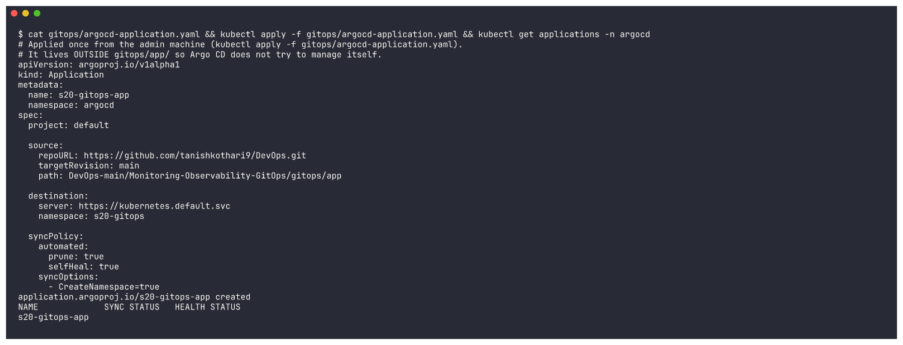

### g05-app-synced

```bash
kubectl get applications -n argocd
```

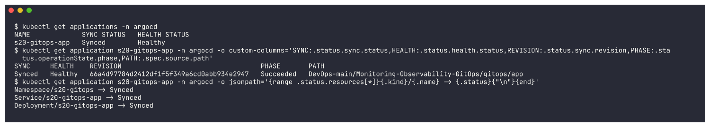

### g06-resources-from-git

```bash
kubectl get all -n s20-gitops -o wide
```

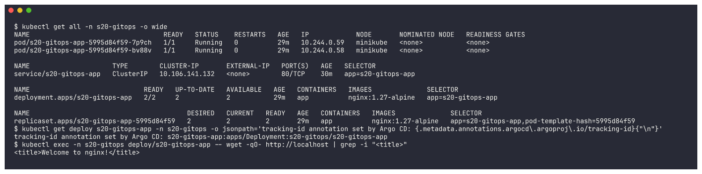

### g07-change-in-git

```bash
sed -i '' -e 's/replicas: 2/replicas: 3/' -e 's/nginx:1.27-alpine/nginx:1.28-alpine/' gitops/app/deployment.yaml
```

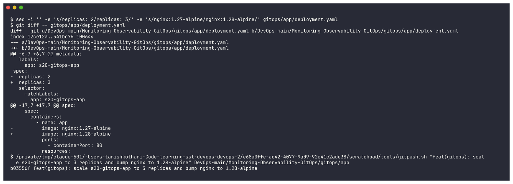

### g08-auto-sync

```bash
git log --oneline -1 origin/main -- gitops/app
```

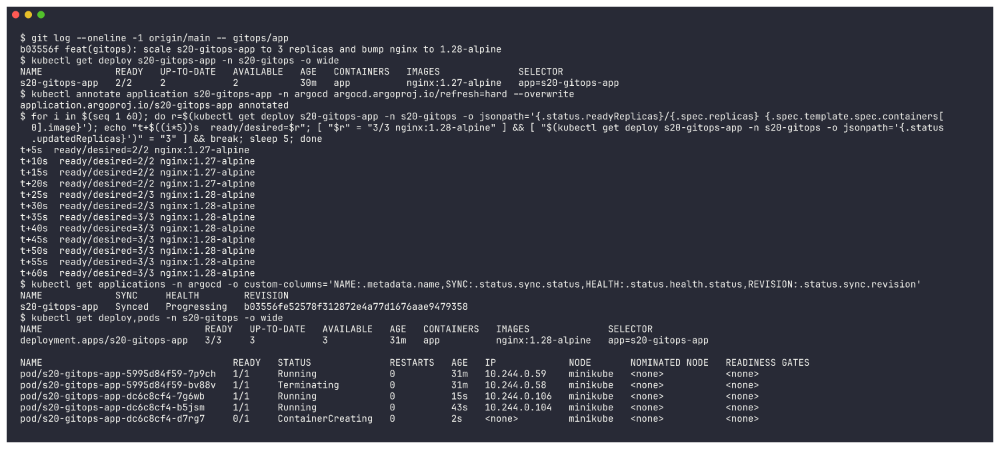

### g08b-auto-sync-done

```bash
kubectl rollout status deployment/s20-gitops-app -n s20-gitops --timeout=180s
```

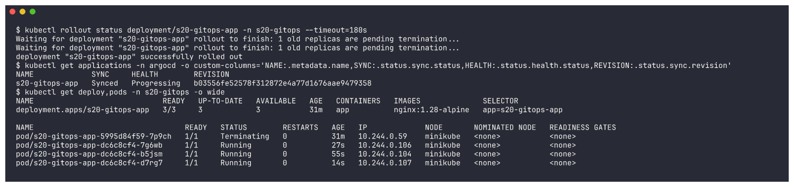

### g09-self-heal

```bash
kubectl get applications -n argocd
```

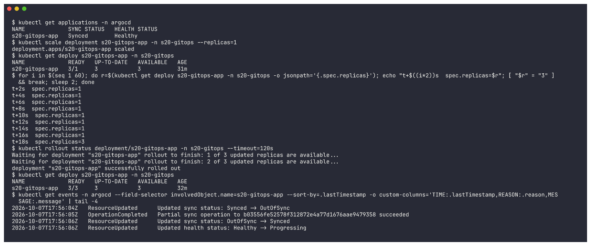

### g10-rollback-via-git

```bash
sed -i '' -e 's/replicas: 3/replicas: 2/' -e 's/nginx:1.28-alpine/nginx:1.27-alpine/' gitops/app/deployment.yaml
```

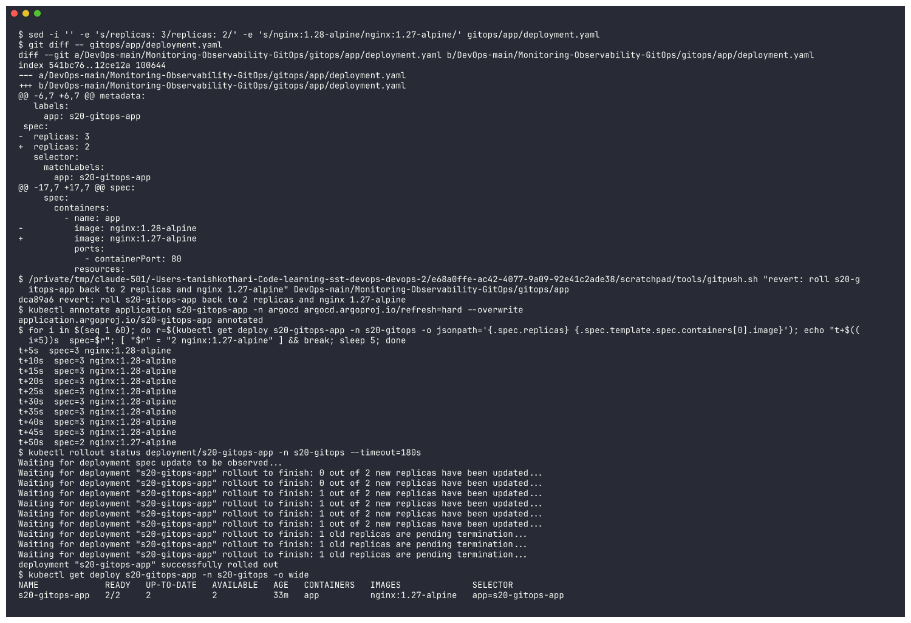

### g11-history

```bash
git log --oneline -4 origin/main -- gitops/app
```

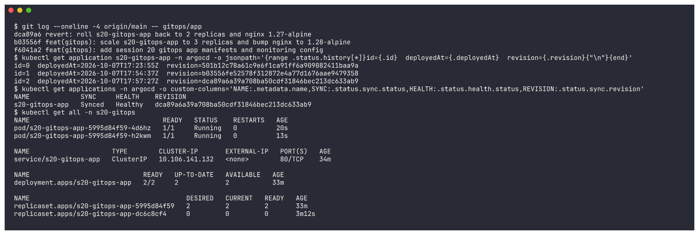

### m01-cluster

```bash
kubectl config current-context && kubectl get nodes -o wide && minikube addons list | grep -E "metrics-server|ingress |storage-provisioner "
```

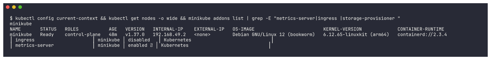

### m02-helm-repo-add

```bash
helm repo add prometheus-community https://prometheus-community.github.io/helm-charts && helm repo update prometheus-community && helm search repo prometheus-community/kube-prometheus-stack
```

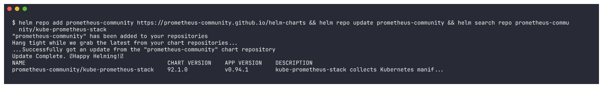

### m03-helm-install-kps

```bash
cd /Users/tanishkothari/Code/learning/sst/devops/DevOps-main/Monitoring-Observability-GitOps && helm upgrade --install kps prometheus-community/kube-prometheus-stack -n monitoring --create-namespace -f monitoring/kps-values.yaml --wait --timeout 10m
```

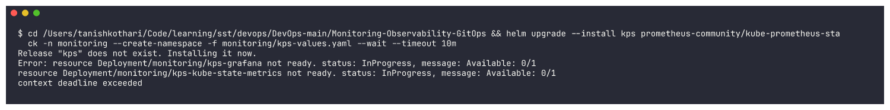

### m03b-helm-upgrade-kps

```bash
helm upgrade --install kps prometheus-community/kube-prometheus-stack -n monitoring -f monitoring/kps-values.yaml --wait --timeout 10m && helm list -n monitoring
```

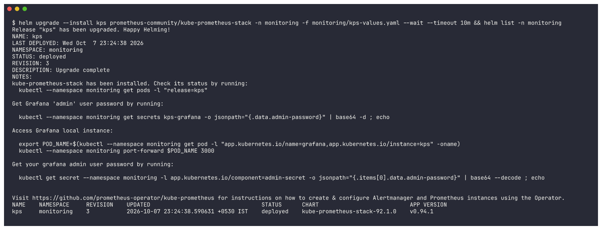

### m03c-helm-upgrade-scrape-timeout

```bash
helm upgrade kps prometheus-community/kube-prometheus-stack -n monitoring -f monitoring/kps-values.yaml --wait --timeout 10m | head -8
```

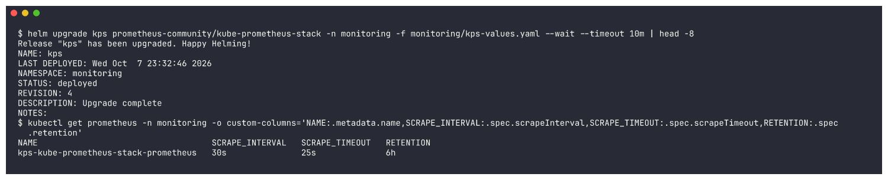

### m04-kps-pods

```bash
helm list -n monitoring
```

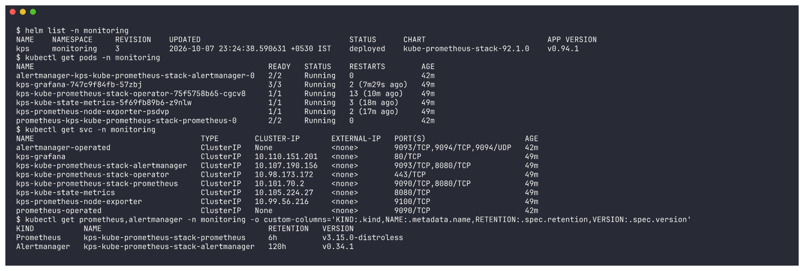

### m05-apply-demo-app

```bash
cd /Users/tanishkothari/Code/learning/sst/devops/DevOps-main/Monitoring-Observability-GitOps && kubectl apply -f monitoring/demo-app.yaml -f monitoring/servicemonitor.yaml -f monitoring/alert-rules.yaml -f monitoring/grafana-dashboard.yaml
```

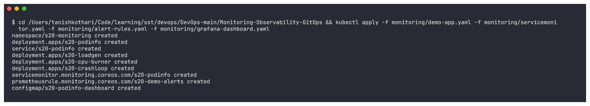

### m06-port-forwards

```bash
ps -eo command | grep "^kubectl --context minikube port-forward"
```

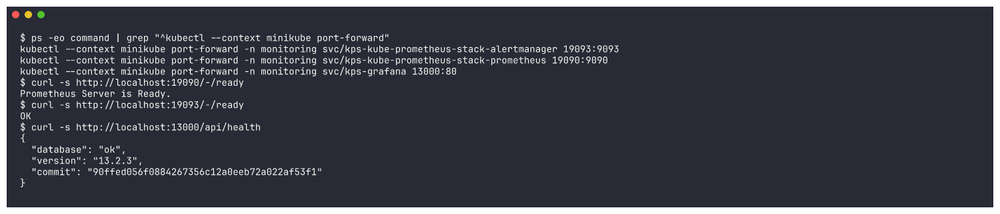

### m07-demo-pods

```bash
kubectl get pods -n s20-monitoring -o wide
```

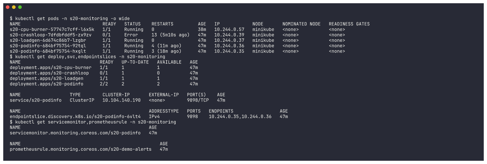

### m08-app-health-probes

```bash
kubectl describe deploy s20-podinfo -n s20-monitoring | grep -E "Liveness|Readiness|Limits|Requests|cpu|memory"
```

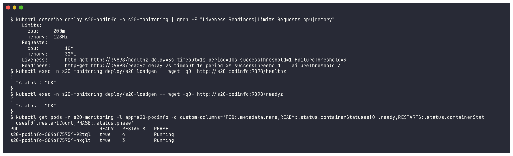

### m08b-podinfo-restart

```bash
kubectl rollout restart deployment/s20-podinfo -n s20-monitoring
```

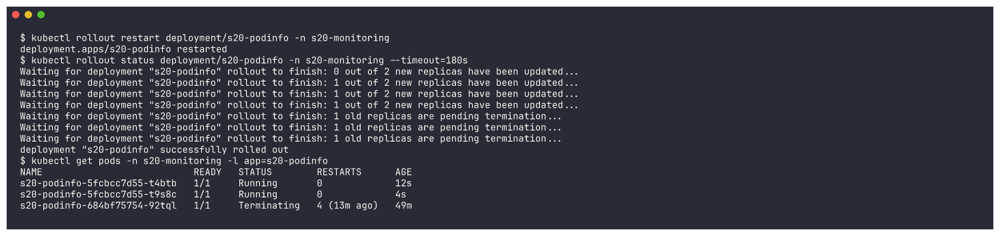

### m09-kubectl-top

```bash
kubectl top nodes
```

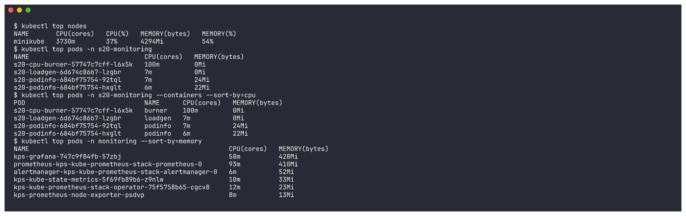

### m10-promql-cpu-memory

```bash
echo "### CPU (cores) used per pod - rate(container_cpu_usage_seconds_total[2m])"
```

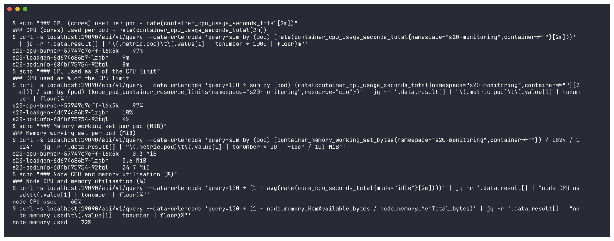

### m12-logs

```bash
kubectl logs deploy/s20-podinfo -n s20-monitoring --tail=4
```

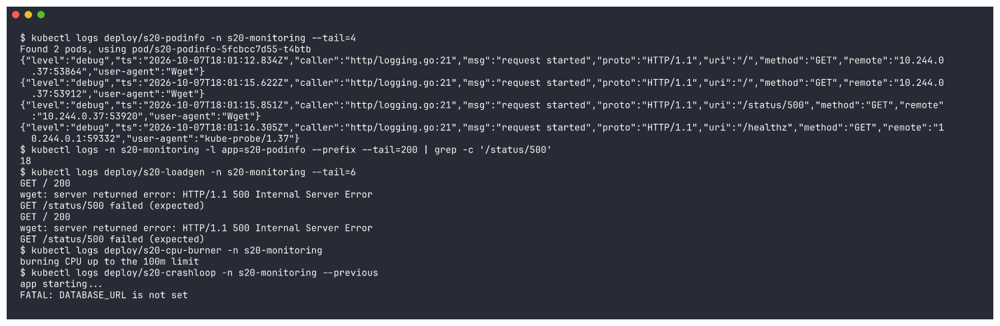

### m13-events

```bash
kubectl get events -n s20-monitoring --field-selector reason=BackOff -o custom-columns='LAST:.lastTimestamp,COUNT:.count,OBJECT:.involvedObject.name,MESSAGE:.message' | tail -3
```

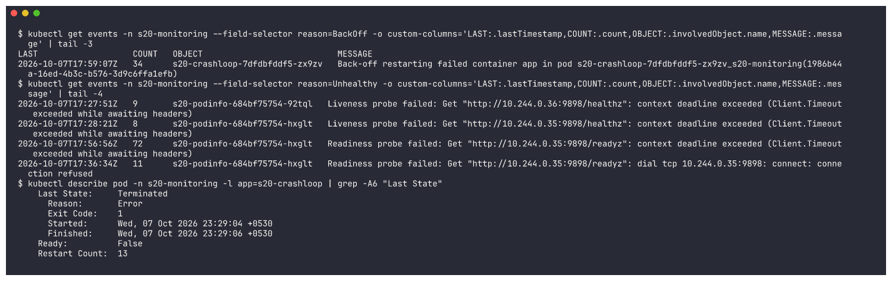

### m14-alert-rules

```bash
kubectl get prometheusrule s20-demo-alerts -n s20-monitoring -o jsonpath='{range .spec.groups[0].rules[*]}{.alert}{"\n"}{end}'
```

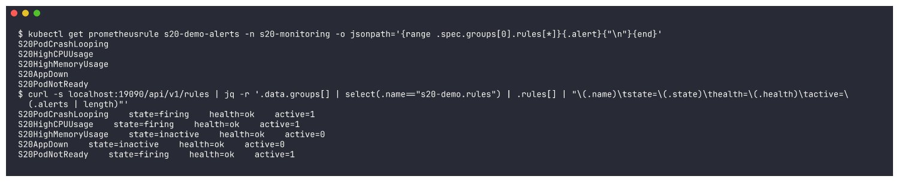

### m15-alerts-firing

```bash
curl -s localhost:19090/api/v1/alerts | jq -r '.data.alerts[] | select(.labels.session=="20") | "\(.state | ascii_upcase)\t\(.labels.alertname)\t\(.labels.pod // "-")\tsince \(.activeAt)\t\(.annotations.summary)"'
```

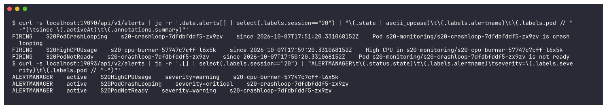

### w01-prometheus-targets

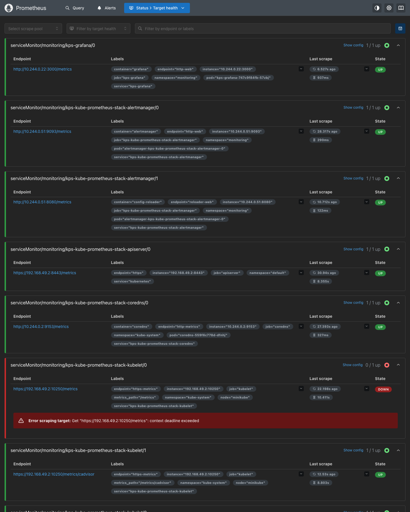

### w05-grafana-1-healthy


