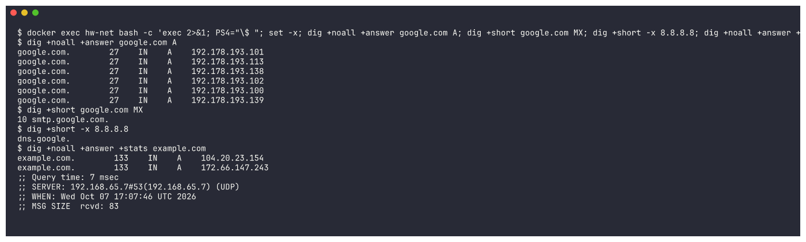
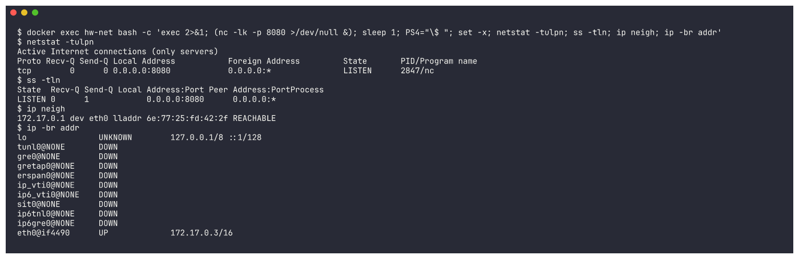
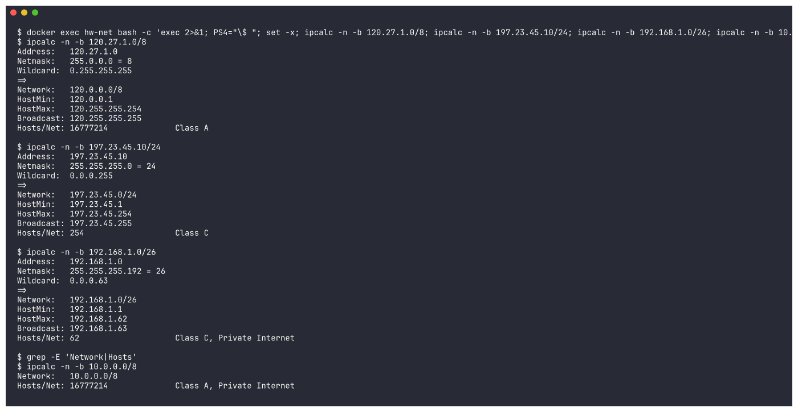

# Networking Fundamentals - Homework

Hands-on run through the networking commands used most often on Linux, showing what each one printed and what it is actually for.

## 1. ping
```bash
ping -c 4 google.com
```
Fires ICMP echo requests at a target host to find out whether it responds and how long the round trip takes. It is the standard way to confirm basic reachability and get a feel for latency. Adding `-c 4` stops it after four packets.

**What I understood:** `ping` is my first check on whether a host is alive and how quickly it answers. Missing replies or dropped packets point to either a broken route or a DNS issue.


## 2. ip a (ip address)
```bash
ip a
```
Lists every network interface the machine has, together with its IP address, hardware (MAC) address, and whether the link is up or down. It supersedes the older `ifconfig` command.

**What I understood:** This is what I run to find my own IP and to see which interfaces the system has, such as `eth0` and the `lo` loopback.


## 3. ip route / route
```bash
ip route
```
Prints the kernel routing table, which includes the default gateway - the router everything bound for the internet is handed off to.

**What I understood:** It tells me how traffic gets out of my network. The entry beginning `default via` names my router.


## 4. netstat / ss
```bash
ss -tulpn
```
Reports active connections, ports in a listening state, and which process owns each one. It is a much faster stand-in for the older `netstat`. The flags mean: `-t` TCP, `-u` UDP, `-l` listening sockets, `-p` owning process, `-n` numeric output.

**What I understood:** It reveals every open port and the service sitting behind it, which is handy for confirming something like SSH is really listening on port 22.


## 5. curl
```bash
curl -I https://www.google.com
```
Moves data to and from a server over the network. With `-I` it requests nothing but the HTTP response headers. It is a staple for poking at APIs and web endpoints.

**What I understood:** `curl` gives me a way to speak to a web server straight from the shell. Reading the headers shows me the status code, such as `200 OK`, along with details about the server.


## 6. wget
```bash
wget https://example.com/index.html
```
Retrieves files across HTTP, HTTPS, or FTP. Where curl prints to the terminal, wget writes the result straight to a file on disk.

**What I understood:** I reach for `wget` when the goal is to pull a page or file down onto my machine.


## 7. nslookup / dig
```bash
nslookup google.com
```
Asks DNS to turn a domain name into an IP address, and can do the reverse lookup as well.

**What I understood:** This exposes the DNS step that converts a hostname into an address. When the lookup fails, the name simply cannot be resolved.


## 8. traceroute
```bash
traceroute google.com
```
Maps out every router along the way to a destination, listing each hop together with how long that hop took.

**What I understood:** It lays out each intermediate stop on the way to a target, making it much easier to spot where things slow down or stop working.


## 9. hostname
```bash
hostname
hostname -I
```
Displays the machine's own name; passing `-I` prints the addresses assigned to it instead.

**What I understood:** A fast way to check what this machine is called and what address it holds.


---

## Extra practice: commands from the devops-hero repo

Task 1 asks for practice with the commands and notes shared in the devops-hero repo (`session4-networking/ip.md`, which covers IP classes and subnetting, plus the networking repos). The section headings above mention `dig` and `netstat`, but only `nslookup` and `ss` were captured, and subnetting was not practised at all. I ran these in an **Ubuntu 24.04 Docker container** (`dnsutils`, `net-tools`, `ipcalc` and `iproute2` installed), because my laptop runs macOS. The raw output is in [`outputs/`](outputs/).

## 10. dig
```bash
dig +noall +answer google.com A      # A records only
dig +short google.com MX             # mail server
dig +short -x 8.8.8.8                # reverse lookup (IP -> name)
dig +noall +answer +stats example.com
```
`dig` is a more detailed DNS tool than `nslookup`. You can ask for one record type (A, MX, NS, TXT and so on), do reverse lookups with `-x`, and see the TTL, the DNS server that answered, and the query time.

**What I understood:** `dig` shows the actual DNS records. The number after the name, e.g. `27`, is the TTL in seconds. The `;; SERVER:` line shows which resolver answered, here Docker's built-in DNS at `192.168.65.7`. `-x 8.8.8.8` returned `dns.google.`, which is a reverse (PTR) lookup.



## 11. netstat (with ss, ip neigh, ip -br addr)
```bash
nc -lk -p 8080 &        # start a test listener
netstat -tulpn          # old tool (net-tools)
ss -tln                 # modern replacement
ip neigh                # ARP / neighbour table
ip -br addr             # brief interface list
```
**What I understood:** `netstat -tulpn` and `ss -tln` both show that a process (`nc`) is listening on `0.0.0.0:8080`. `netstat` comes from the older `net-tools` package, while `ss` is faster and installed by default. `ip neigh` shows the ARP table, which maps the gateway IP `172.17.0.1` to its MAC address. `ip -br addr` gives a one-line-per-interface summary: the container's `eth0` has `172.17.0.3/16`.



## 12. IP addressing and subnetting (ipcalc)
I used the examples from the repo notes (`120.27.1.0/8`, `197.23.45.10/24`) plus one smaller subnet:
```bash
ipcalc -n -b 120.27.1.0/8
ipcalc -n -b 197.23.45.10/24
ipcalc -n -b 192.168.1.0/26
ipcalc -n -b 10.0.0.0/8
```
| CIDR | Netmask | Network | Broadcast | Usable hosts | Class |
|---|---|---|---|---|---|
| 120.27.1.0/8 | 255.0.0.0 | 120.0.0.0 | 120.255.255.255 | 16,777,214 (2^24 - 2) | A |
| 197.23.45.10/24 | 255.255.255.0 | 197.23.45.0 | 197.23.45.255 | 254 (2^8 - 2) | C |
| 192.168.1.0/26 | 255.255.255.192 | 192.168.1.0 | 192.168.1.63 | 62 (2^6 - 2) | C, private |
| 10.0.0.0/8 | 255.0.0.0 | 10.0.0.0 | - | 16,777,214 | A, private |

**What I understood:**
- An IPv4 address is 32 bits. The number after `/` is how many bits belong to the network part, and the remaining bits are the host part.
- Usable hosts = 2^(host bits) - 2, because the network address and the broadcast address cannot be given to hosts. `/8` leaves 24 host bits, so 2^24 - 2 = 16,777,214, which matches the repo notes.
- Class ranges from the notes: A = 1-127, B = 128-191, C = 192-223, D = 224-239 (multicast).
- Private ranges: `10.0.0.0/8`, `172.16.0.0/12` and `192.168.0.0/16`. `ipcalc` labels these "Private Internet".
- Borrowing more bits for the network, e.g. `/26` instead of `/24`, splits a network into smaller subnets: 4 subnets of 62 hosts each.


