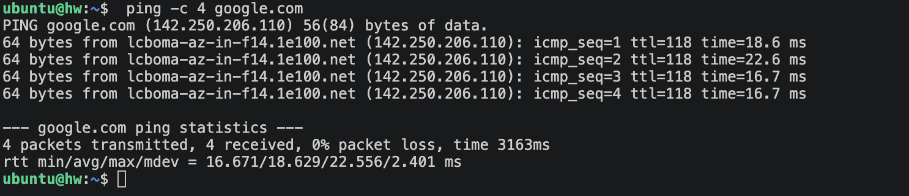
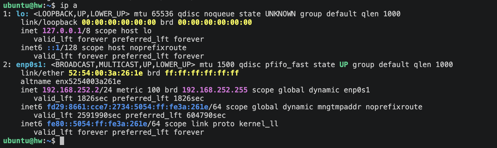
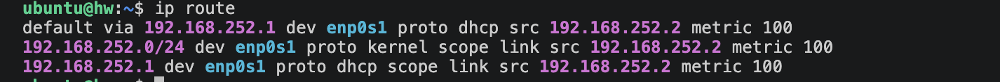
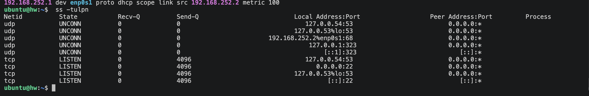
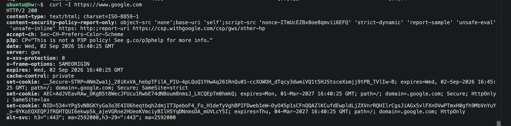
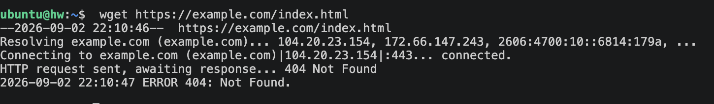
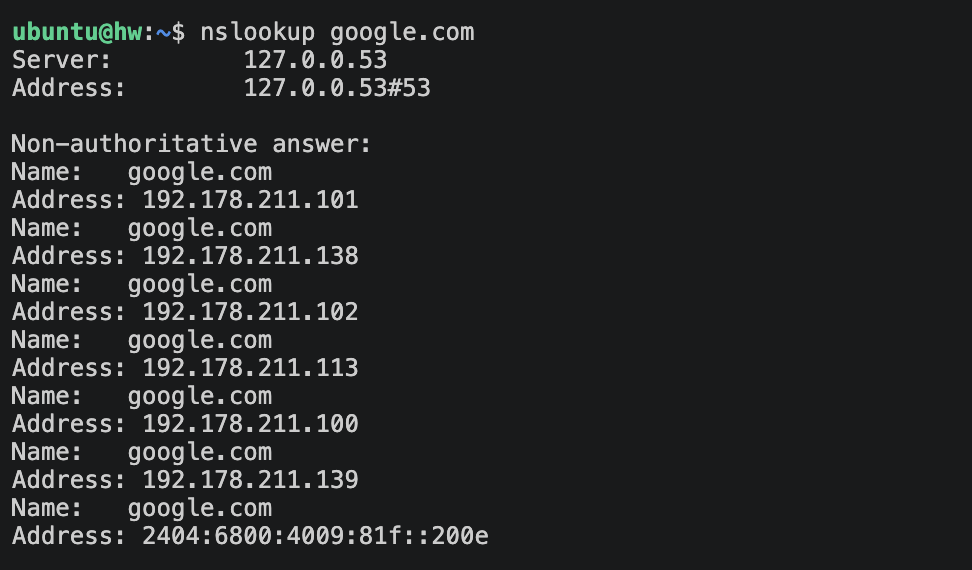
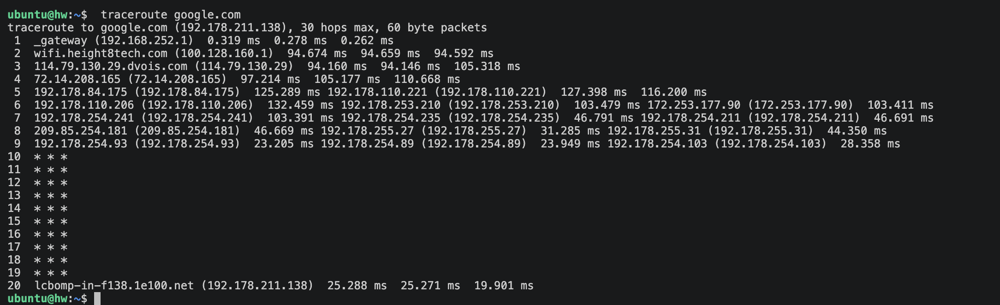
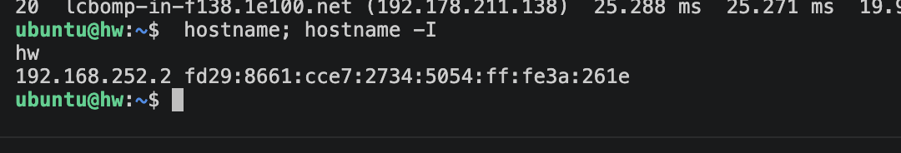

# Networking Fundamentals - Homework

Hands-on run through the networking commands used most often on Linux, showing what each one printed and what it is actually for.

## 1. ping
```bash
ping -c 4 google.com
```
Fires ICMP echo requests at a target host to find out whether it responds and how long the round trip takes. It is the standard way to confirm basic reachability and get a feel for latency. Adding `-c 4` stops it after four packets.

**What I understood:** `ping` is my first check on whether a host is alive and how quickly it answers. Missing replies or dropped packets point to either a broken route or a DNS issue.



## 2. ip a (ip address)
```bash
ip a
```
Lists every network interface the machine has, together with its IP address, hardware (MAC) address, and whether the link is up or down. It supersedes the older `ifconfig` command.

**What I understood:** This is what I run to find my own IP and to see which interfaces the system has, such as `eth0` and the `lo` loopback.



## 3. ip route / route
```bash
ip route
```
Prints the kernel routing table, which includes the default gateway - the router everything bound for the internet is handed off to.

**What I understood:** It tells me how traffic gets out of my network. The entry beginning `default via` names my router.



## 4. netstat / ss
```bash
ss -tulpn
```
Reports active connections, ports in a listening state, and which process owns each one. It is a much faster stand-in for the older `netstat`. The flags mean: `-t` TCP, `-u` UDP, `-l` listening sockets, `-p` owning process, `-n` numeric output.

**What I understood:** It reveals every open port and the service sitting behind it, which is handy for confirming something like SSH is really listening on port 22.



## 5. curl
```bash
curl -I https://www.google.com
```
Moves data to and from a server over the network. With `-I` it requests nothing but the HTTP response headers. It is a staple for poking at APIs and web endpoints.

**What I understood:** `curl` gives me a way to speak to a web server straight from the shell. Reading the headers shows me the status code, such as `200 OK`, along with details about the server.



## 6. wget
```bash
wget https://example.com/index.html
```
Retrieves files across HTTP, HTTPS, or FTP. Where curl prints to the terminal, wget writes the result straight to a file on disk.

**What I understood:** I reach for `wget` when the goal is to pull a page or file down onto my machine.



## 7. nslookup / dig
```bash
nslookup google.com
```
Asks DNS to turn a domain name into an IP address, and can do the reverse lookup as well.

**What I understood:** This exposes the DNS step that converts a hostname into an address. When the lookup fails, the name simply cannot be resolved.



## 8. traceroute
```bash
traceroute google.com
```
Maps out every router along the way to a destination, listing each hop together with how long that hop took.

**What I understood:** It lays out each intermediate stop on the way to a target, making it much easier to spot where things slow down or stop working.



## 9. hostname
```bash
hostname
hostname -I
```
Displays the machine's own name; passing `-I` prints the addresses assigned to it instead.

**What I understood:** A fast way to check what this machine is called and what address it holds.


