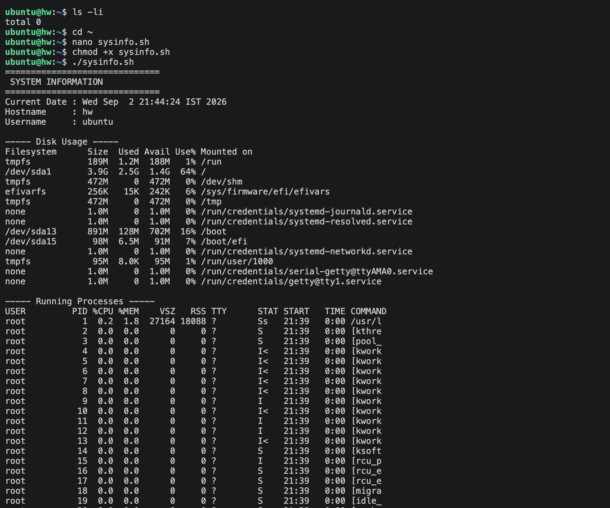
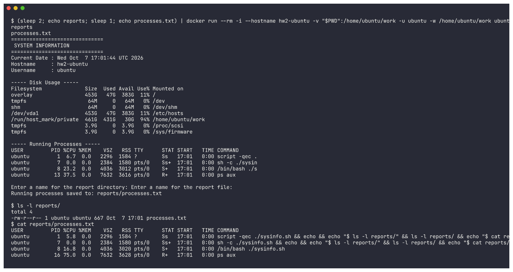

# System Information Script

A bash script that reports basic details about the system, prompts the user for input, makes a directory and a file from that input, and writes the process list into that file through output redirection.

## What the script does
- Shows today's date
- Shows the machine's hostname
- Shows the logged-in user
- Shows how much disk space is in use
- Shows the processes currently running
- Keeps values in variables so they can be reused
- Collects user input through `read -p`
- Makes a directory with `mkdir`
- Makes a file with `touch`
- Writes the process list into that file by redirecting output with `>`

## Commands used
`mkdir`, `touch`, `echo`, `df`, `ps`, `read -p`, variables, `>` output redirection

## The script (sysinfo.sh)
```bash
#!/bin/bash
# System Information Script

# Store data in variables
CURRENT_DATE=$(date)
HOST_NAME=$(hostname)
USER_NAME=$(whoami)

echo "=============================="
echo " SYSTEM INFORMATION"
echo "=============================="

echo "Current Date : $CURRENT_DATE"
echo "Hostname     : $HOST_NAME"
echo "Username     : $USER_NAME"

echo ""
echo "----- Disk Usage -----"
df -h

echo ""
echo "----- Running Processes -----"
ps aux

# Take input from the user
read -p "Enter a name for the report directory: " DIR_NAME
read -p "Enter a name for the report file: " FILE_NAME

# Create directory and file
mkdir -p "$DIR_NAME"
touch "$DIR_NAME/$FILE_NAME"

# Store running processes in the file using output redirection
ps aux > "$DIR_NAME/$FILE_NAME"

echo ""
echo "Running processes saved to: $DIR_NAME/$FILE_NAME"
```

## How to run
```bash
chmod +x sysinfo.sh
./sysinfo.sh
```

## Sample output
```
==============================
 SYSTEM INFORMATION
==============================
Current Date : Wed Sep  2 21:38:56 IST 2026
Hostname     : my-machine
Username     : student

----- Disk Usage -----
Filesystem      Size  Used Avail Use% Mounted on
/dev/sda1        50G   16G   32G  34% /
tmpfs           2.0G     0  2.0G   0% /dev/shm

----- Running Processes -----
USER     PID  %CPU %MEM    VSZ   RSS TTY   STAT START   TIME COMMAND
root       1   0.0  0.1 168000 11000 ?     Ss   09:10   0:01 /sbin/init
student  842   0.3  0.5  95000 40000 pts/0 S+   09:38   0:00 bash sysinfo.sh
...

Enter a name for the report directory: reports
Enter a name for the report file: processes.txt

Running processes saved to: reports/processes.txt
```

## Result
Once the script finishes there is a new `reports/` folder holding `processes.txt`, and inside that file sits the complete `ps aux` listing that the `>` operator redirected into it.

## Screenshots

The script executing, with the date, hostname, user, disk figures, and process list on display:



The tail of the process listing, followed by the two `read -p` prompts and the message confirming the save:


A look inside the generated file, proving the process list was captured through `>` redirection:


---

## Full captured output (re-run)

The "Sample output" section above is trimmed and illustrative. The assignment asks for **all command output** in the README, so I ran the same unchanged `sysinfo.sh` again, this time in a clean **Ubuntu 24.04 Docker container** (my laptop runs macOS), and copied in the output exactly as it was printed. The answers `reports` and `processes.txt` were piped into the script. They appear at the top because the terminal echoes piped input as soon as it arrives. After the script finishes, the same run lists the new directory and prints the file to prove that the `>` redirection worked.

Command used:
```bash
(sleep 2; echo reports; sleep 1; echo processes.txt) | \
  docker run --rm -i --hostname hw2-ubuntu -v "$PWD":/home/ubuntu/work -u ubuntu -w /home/ubuntu/work \
  ubuntu:24.04 script -qec './sysinfo.sh && ls -l reports/ && cat reports/processes.txt' /dev/null
```

Output:
```
reports
processes.txt
==============================
 SYSTEM INFORMATION
==============================
Current Date : Wed Oct  7 17:01:44 UTC 2026
Hostname     : hw2-ubuntu
Username     : ubuntu

----- Disk Usage -----
Filesystem              Size  Used Avail Use% Mounted on
overlay                 453G   47G  383G  11% /
tmpfs                    64M     0   64M   0% /dev
shm                      64M     0   64M   0% /dev/shm
/dev/vda1               453G   47G  383G  11% /etc/hosts
/run/host_mark/private  461G  431G   30G  94% /home/ubuntu/work
tmpfs                   3.9G     0  3.9G   0% /proc/scsi
tmpfs                   3.9G     0  3.9G   0% /sys/firmware

----- Running Processes -----
USER         PID %CPU %MEM    VSZ   RSS TTY      STAT START   TIME COMMAND
ubuntu         1  6.7  0.0   2296  1584 ?        Ss   17:01   0:00 script -qec .
ubuntu         7  0.0  0.0   2384  1580 pts/0    Ss+  17:01   0:00 sh -c ./sysin
ubuntu         8 23.2  0.0   4036  3012 pts/0    S+   17:01   0:00 /bin/bash ./s
ubuntu        13 37.5  0.0   7632  3616 pts/0    R+   17:01   0:00 ps aux

Enter a name for the report directory: Enter a name for the report file: 
Running processes saved to: reports/processes.txt

$ ls -l reports/
total 4
-rw-r--r-- 1 ubuntu ubuntu 667 Oct  7 17:01 processes.txt
$ cat reports/processes.txt
USER         PID %CPU %MEM    VSZ   RSS TTY      STAT START   TIME COMMAND
ubuntu         1  5.8  0.0   2296  1584 ?        Ss   17:01   0:00 script -qec ./sysinfo.sh && ...
ubuntu         7  0.0  0.0   2384  1580 pts/0    Ss+  17:01   0:00 sh -c ./sysinfo.sh && ...
ubuntu         8 16.8  0.0   4036  3020 pts/0    S+   17:01   0:00 /bin/bash ./sysinfo.sh
ubuntu        16 75.0  0.0   7632  3628 pts/0    R+   17:01   0:00 ps aux
```
(In the last block, the two long `script`/`sh -c` command lines are shortened with `...`. The untouched version is in [`outputs/hw2-sysinfo-run.txt`](outputs/hw2-sysinfo-run.txt).)

A container runs only a few processes, so the `ps aux` list is short. The full list from my VM is in the screenshots above.



### Requirement checklist
| Requirement | Where in `sysinfo.sh` |
|---|---|
| Current date | `CURRENT_DATE=$(date)` then `echo` |
| Hostname | `HOST_NAME=$(hostname)` |
| Username | `USER_NAME=$(whoami)` |
| Disk usage | `df -h` |
| Running processes | `ps aux` |
| Variables | `CURRENT_DATE`, `HOST_NAME`, `USER_NAME`, `DIR_NAME`, `FILE_NAME` |
| User input | `read -p "Enter a name for the report directory: " DIR_NAME` |
| Create directory | `mkdir -p "$DIR_NAME"` |
| Create file | `touch "$DIR_NAME/$FILE_NAME"` |
| `>` redirection | `ps aux > "$DIR_NAME/$FILE_NAME"` |
