# Terraform S3 Demo - Session 18, Task 1

This project creates an **AWS S3 bucket with Terraform** and walks through the full Terraform workflow:
`init -> fmt -> validate -> plan -> apply -> show -> output -> destroy`.

Every output and screenshot below comes from commands I actually ran. The raw text of each command is saved in [`outputs/`](outputs/) and the terminal screenshots are in [`screenshots/`](screenshots/).

> **Note - where this was run:** no AWS account credentials are configured on this machine, so I ran the project against
> **[LocalStack](https://github.com/localstack/localstack)**. LocalStack is a local AWS emulator that runs in Docker and serves the
> real AWS APIs on `http://localhost:4566`. The Terraform code is ordinary AWS code. The only LocalStack-specific
> part is a block in `provider.tf` controlled by one variable (`use_localstack`). Setting it to `false` sends
> the same code to real AWS (see [Running against real AWS](#running-against-real-aws)).

## Project structure

```text
terraform-s3-demo/
|-- provider.tf        # terraform block (required providers) + AWS provider config
|-- variables.tf       # input variable declarations (with types, defaults, validation)
|-- terraform.tfvars   # values for the variables
|-- main.tf            # resources: S3 bucket + versioning + encryption + public access block
|-- outputs.tf         # values printed after apply (bucket name, ARN, region ...)
|-- README.md          # this file
|-- .gitignore         # ignores .terraform/ and *.tfstate*
|-- outputs/           # raw text output of every command
`-- screenshots/       # terminal screenshots of every command
```

| File | Purpose |
|---|---|
| `provider.tf` | Pins Terraform `>= 1.6` and the `hashicorp/aws ~> 6.0` provider, sets the region and default tags, and holds the LocalStack switch |
| `variables.tf` | Declares `aws_region`, `bucket_name` (with a naming-rule validation), `environment`, `enable_versioning`, `use_localstack`, `localstack_endpoint` |
| `terraform.tfvars` | Sets the variable values, e.g. `bucket_name = "tanish-terraform-s3-demo-2026"` |
| `main.tf` | `aws_s3_bucket`, `aws_s3_bucket_versioning`, `aws_s3_bucket_server_side_encryption_configuration`, `aws_s3_bucket_public_access_block` |
| `outputs.tf` | `bucket_name`, `bucket_arn`, `bucket_region`, `bucket_domain_name`, `versioning_status` |

## The code

### main.tf

```hcl
# The S3 bucket itself.
resource "aws_s3_bucket" "demo" {
  bucket        = var.bucket_name
  force_destroy = true # lets `terraform destroy` delete the bucket even if it holds objects

  tags = {
    Name        = var.bucket_name
    Environment = var.environment
  }
}

# Object versioning (keeps every version of an object).
resource "aws_s3_bucket_versioning" "demo" {
  bucket = aws_s3_bucket.demo.id

  versioning_configuration {
    status = var.enable_versioning ? "Enabled" : "Suspended"
  }
}

# Default encryption at rest with S3-managed keys (SSE-S3 / AES-256).
resource "aws_s3_bucket_server_side_encryption_configuration" "demo" {
  bucket = aws_s3_bucket.demo.id

  rule {
    apply_server_side_encryption_by_default {
      sse_algorithm = "AES256"
    }
  }
}

# Block every form of public access to the bucket.
resource "aws_s3_bucket_public_access_block" "demo" {
  bucket = aws_s3_bucket.demo.id

  block_public_acls       = true
  block_public_policy     = true
  ignore_public_acls      = true
  restrict_public_buckets = true
}
```

### provider.tf

```hcl
terraform {
  required_version = ">= 1.6.0"

  required_providers {
    aws = {
      source  = "hashicorp/aws"
      version = "~> 6.0"
    }
  }
}

# The AWS provider.
#
# When use_localstack = true (the default in terraform.tfvars) every AWS API call
# is sent to LocalStack, a local AWS emulator running in Docker on port 4566,
# with dummy credentials. When use_localstack = false all of the overrides below
# switch off and the provider behaves exactly like a normal AWS provider, picking
# up real credentials from `aws configure` / environment variables.
provider "aws" {
  region = var.aws_region

  # ---- LocalStack overrides (all disabled when use_localstack = false) ----
  access_key                  = var.use_localstack ? "test" : null
  secret_key                  = var.use_localstack ? "test" : null
  skip_credentials_validation = var.use_localstack
  skip_metadata_api_check     = var.use_localstack
  skip_requesting_account_id  = var.use_localstack
  s3_use_path_style           = var.use_localstack

  dynamic "endpoints" {
    for_each = var.use_localstack ? [var.localstack_endpoint] : []
    content {
      s3  = endpoints.value
      iam = endpoints.value
      sts = endpoints.value
      ec2 = endpoints.value
    }
  }
  # -------------------------------------------------------------------------

  default_tags {
    tags = {
      ManagedBy = "Terraform"
      Project   = "Session18-terraform-s3-demo"
    }
  }
}
```

### variables.tf

```hcl
variable "aws_region" {
  description = "AWS region where the S3 bucket will be created."
  type        = string
  default     = "us-east-1"
}

variable "bucket_name" {
  description = "Globally unique name of the S3 bucket."
  type        = string

  validation {
    condition     = can(regex("^[a-z0-9][a-z0-9.-]{1,61}[a-z0-9]$", var.bucket_name))
    error_message = "Bucket names must be 3-63 chars of lowercase letters, numbers, dots and hyphens."
  }
}

variable "environment" {
  description = "Environment tag applied to the bucket."
  type        = string
  default     = "dev"
}

variable "enable_versioning" {
  description = "Turn on S3 object versioning for the bucket."
  type        = bool
  default     = true
}

variable "use_localstack" {
  description = "Send AWS API calls to LocalStack (local AWS emulator) instead of real AWS."
  type        = bool
  default     = false
}

variable "localstack_endpoint" {
  description = "URL of the LocalStack edge endpoint (only used when use_localstack = true)."
  type        = string
  default     = "http://localhost:4566"
}
```

### terraform.tfvars

```hcl
aws_region        = "us-east-1"
bucket_name       = "tanish-terraform-s3-demo-2026"
environment       = "dev"
enable_versioning = true

# No AWS account credentials are configured on this machine, so the demo runs
# against LocalStack (local AWS emulator). Set this to false to deploy to real AWS.
use_localstack = true
```

### outputs.tf

```hcl
output "bucket_name" {
  description = "Name of the S3 bucket."
  value       = aws_s3_bucket.demo.bucket
}

output "bucket_arn" {
  description = "ARN of the S3 bucket."
  value       = aws_s3_bucket.demo.arn
}

output "bucket_region" {
  description = "Region the bucket lives in."
  value       = aws_s3_bucket.demo.region
}

output "bucket_domain_name" {
  description = "Bucket domain name."
  value       = aws_s3_bucket.demo.bucket_domain_name
}

output "versioning_status" {
  description = "Versioning status of the bucket."
  value       = aws_s3_bucket_versioning.demo.versioning_configuration[0].status
}
```

## How the pieces connect

```text
terraform.tfvars --> variables.tf --> provider.tf  (region, credentials, LocalStack endpoints)
                          |
                          v
                       main.tf
                 aws_s3_bucket.demo
                   ^      ^      ^
                   |      |      |      each of these uses aws_s3_bucket.demo.id
                   |      |      |      -> implicit dependency, bucket is created first
     ..._versioning  ..._server_side_encryption_configuration  ..._public_access_block
                          |
                          v
                     outputs.tf --> terraform output
```

## Prerequisites

| Tool | Version used |
|---|---|
| Terraform | v1.16.4 (darwin_arm64) |
| AWS provider | hashicorp/aws v6.67.0 |
| AWS CLI | aws-cli/2.37.10 (used to verify the bucket) |
| Docker + LocalStack | `localstack/localstack:3.8` (community 3.8.1) |

Start LocalStack (only S3, EC2, IAM and STS are needed):

```bash
docker run -d --name localstack -p 4566:4566 \
  -e SERVICES=s3,ec2,iam,sts localstack/localstack:3.8
```

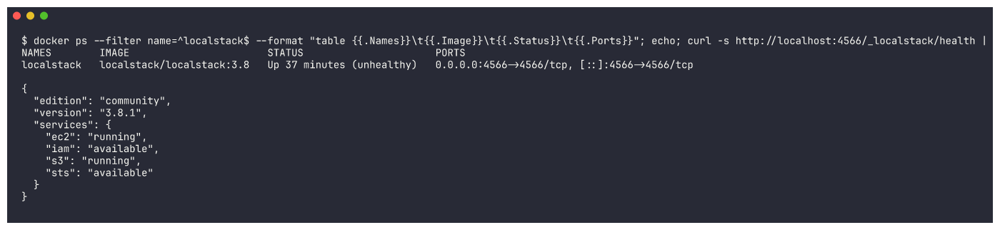

```text
$ docker ps --filter name=^localstack$ --format "table {{.Names}}\t{{.Image}}\t{{.Status}}\t{{.Ports}}"; echo; curl -s http://localhost:4566/_localstack/health | jq "{edition, version, services: (.services | with_entries(select(.value != \"disabled\")))}"
NAMES        IMAGE                       STATUS                      PORTS
localstack   localstack/localstack:3.8   Up 37 minutes (unhealthy)   0.0.0.0:4566->4566/tcp, [::]:4566->4566/tcp

{
  "edition": "community",
  "version": "3.8.1",
  "services": {
    "ec2": "running",
    "iam": "available",
    "s3": "running",
    "sts": "available"
  }
}
```

> Docker shows `(unhealthy)` only because LocalStack's built-in healthcheck command took longer than its 5 s timeout
> on this busy machine (`docker inspect` shows `Health check exceeded timeout (5s)`). The health endpoint above
> shows that `s3`, `ec2`, `iam` and `sts` are up, and every command below talked to it without problems.

---

## The Terraform workflow

### Step 1 - `terraform init`

`init` prepares the working directory. It reads the `required_providers` block, downloads the AWS provider plugin
into `.terraform/`, and writes `.terraform.lock.hcl`, which pins the exact provider version and checksums. You run it
once per project, and again whenever providers, modules or the backend change.

```bash
terraform init
```

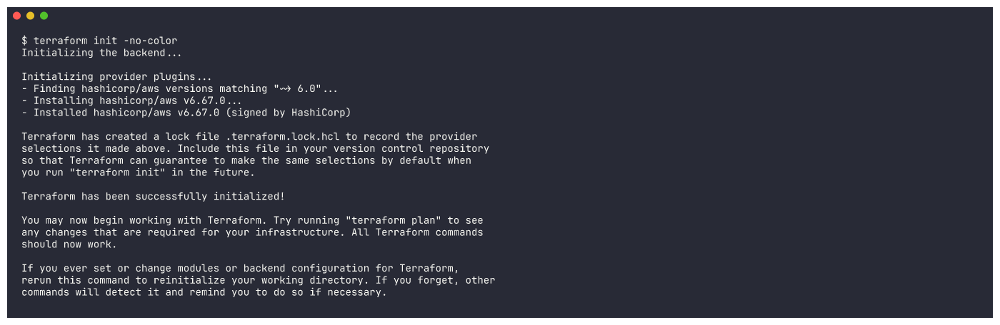

```text
$ terraform init -no-color
Initializing the backend...

Initializing provider plugins...
- Finding hashicorp/aws versions matching "~> 6.0"...
- Installing hashicorp/aws v6.67.0...
- Installed hashicorp/aws v6.67.0 (signed by HashiCorp)

Terraform has created a lock file .terraform.lock.hcl to record the provider
selections it made above. Include this file in your version control repository
so that Terraform can guarantee to make the same selections by default when
you run "terraform init" in the future.

Terraform has been successfully initialized!

You may now begin working with Terraform. Try running "terraform plan" to see
any changes that are required for your infrastructure. All Terraform commands
should now work.

If you ever set or change modules or backend configuration for Terraform,
rerun this command to reinitialize your working directory. If you forget, other
commands will detect it and remind you to do so if necessary.
```

### Step 2 - `terraform fmt`

`fmt` rewrites `.tf` files into the standard HCL style (indentation, aligned `=` signs). `-check` changes nothing.
It only exits non-zero if a file needs formatting, which is useful in CI. My files were already formatted, so
`fmt` printed no file names. (The Session 19 project shows `fmt` actually fixing a file.)

```bash
terraform fmt -recursive -diff
terraform fmt -check
```

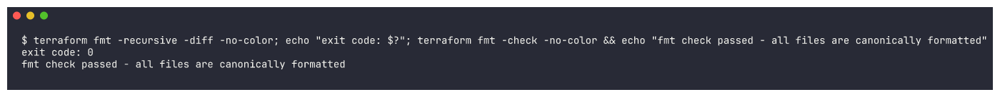

```text
$ terraform fmt -recursive -diff -no-color; echo "exit code: $?"; terraform fmt -check -no-color && echo "fmt check passed - all files are canonically formatted"
exit code: 0
fmt check passed - all files are canonically formatted
```

### Step 3 - `terraform validate`

`validate` checks syntax, argument names, types and references without calling AWS. It catches typos such as
`aws_s3_bukcet` or a missing required argument before anything is planned.

```bash
terraform validate
```

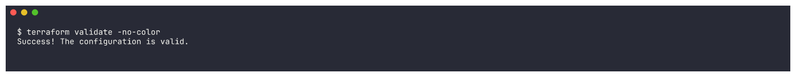

```text
$ terraform validate -no-color
Success! The configuration is valid.
```

### Step 4 - `terraform plan`

`plan` refreshes the current state, compares it with the configuration, and prints the actions it would take.
`+` means create, `~` update in place, `-` destroy, and `-/+` replace. `-out` saves the plan, so `apply` later runs
exactly the actions that were reviewed.

```bash
terraform plan -out=tfplan.tfplan
```

Summary of the plan: 4 resources to add.

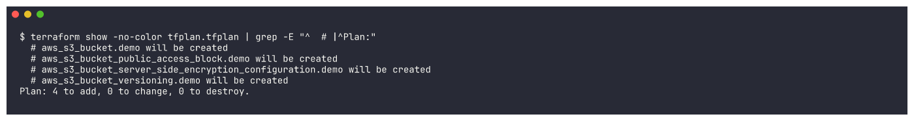

```text
$ terraform show -no-color tfplan.tfplan | grep -E "^  # |^Plan:"
  # aws_s3_bucket.demo will be created
  # aws_s3_bucket_public_access_block.demo will be created
  # aws_s3_bucket_server_side_encryption_configuration.demo will be created
  # aws_s3_bucket_versioning.demo will be created
Plan: 4 to add, 0 to change, 0 to destroy.
```

The full plan (the screenshot shows the first part, and the complete text is below):

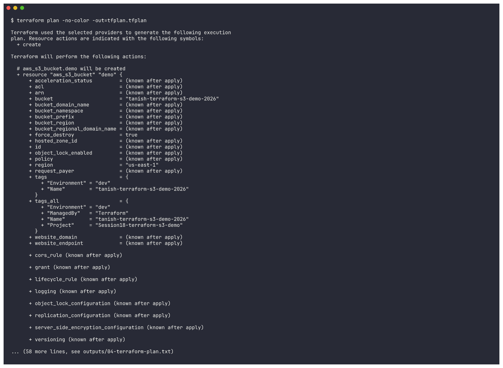

<details>
<summary>Full output (113 lines) - click to expand</summary>

```text
$ terraform plan -no-color -out=tfplan.tfplan

Terraform used the selected providers to generate the following execution
plan. Resource actions are indicated with the following symbols:
  + create

Terraform will perform the following actions:

  # aws_s3_bucket.demo will be created
  + resource "aws_s3_bucket" "demo" {
      + acceleration_status         = (known after apply)
      + acl                         = (known after apply)
      + arn                         = (known after apply)
      + bucket                      = "tanish-terraform-s3-demo-2026"
      + bucket_domain_name          = (known after apply)
      + bucket_namespace            = (known after apply)
      + bucket_prefix               = (known after apply)
      + bucket_region               = (known after apply)
      + bucket_regional_domain_name = (known after apply)
      + force_destroy               = true
      + hosted_zone_id              = (known after apply)
      + id                          = (known after apply)
      + object_lock_enabled         = (known after apply)
      + policy                      = (known after apply)
      + region                      = "us-east-1"
      + request_payer               = (known after apply)
      + tags                        = {
          + "Environment" = "dev"
          + "Name"        = "tanish-terraform-s3-demo-2026"
        }
      + tags_all                    = {
          + "Environment" = "dev"
          + "ManagedBy"   = "Terraform"
          + "Name"        = "tanish-terraform-s3-demo-2026"
          + "Project"     = "Session18-terraform-s3-demo"
        }
      + website_domain              = (known after apply)
      + website_endpoint            = (known after apply)

      + cors_rule (known after apply)

      + grant (known after apply)

      + lifecycle_rule (known after apply)

      + logging (known after apply)

      + object_lock_configuration (known after apply)

      + replication_configuration (known after apply)

      + server_side_encryption_configuration (known after apply)

      + versioning (known after apply)

      + website (known after apply)
    }

  # aws_s3_bucket_public_access_block.demo will be created
  + resource "aws_s3_bucket_public_access_block" "demo" {
      + block_public_acls       = true
      + block_public_policy     = true
      + bucket                  = (known after apply)
      + id                      = (known after apply)
      + ignore_public_acls      = true
      + region                  = "us-east-1"
      + restrict_public_buckets = true
    }

  # aws_s3_bucket_server_side_encryption_configuration.demo will be created
  + resource "aws_s3_bucket_server_side_encryption_configuration" "demo" {
      + bucket = (known after apply)
      + id     = (known after apply)
      + region = "us-east-1"

      + rule {
          + blocked_encryption_types = (known after apply)
          + bucket_key_enabled       = (known after apply)

          + apply_server_side_encryption_by_default {
              + kms_master_key_id = (known after apply)
              + sse_algorithm     = "AES256"
            }
        }
    }

  # aws_s3_bucket_versioning.demo will be created
  + resource "aws_s3_bucket_versioning" "demo" {
      + bucket = (known after apply)
      + id     = (known after apply)
      + region = "us-east-1"

      + versioning_configuration {
          + mfa_delete = (known after apply)
          + status     = "Enabled"
        }
    }

Plan: 4 to add, 0 to change, 0 to destroy.

Changes to Outputs:
  + bucket_arn         = (known after apply)
  + bucket_domain_name = (known after apply)
  + bucket_name        = "tanish-terraform-s3-demo-2026"
  + bucket_region      = "us-east-1"
  + versioning_status  = "Enabled"

─────────────────────────────────────────────────────────────────────────────

Saved the plan to: tfplan.tfplan

To perform exactly these actions, run the following command to apply:
    terraform apply "tfplan.tfplan"
```

</details>

### Step 5 - `terraform apply`

`apply` makes the API calls that create the resources, then records them in `terraform.tfstate`. The bucket
is created first. Versioning, encryption and the public access block are then created **in parallel**, because each of them
depends only on the bucket.

```bash
terraform apply -auto-approve tfplan.tfplan
```

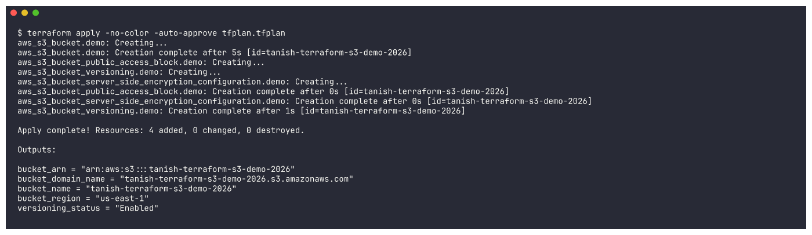

```text
$ terraform apply -no-color -auto-approve tfplan.tfplan
aws_s3_bucket.demo: Creating...
aws_s3_bucket.demo: Creation complete after 5s [id=tanish-terraform-s3-demo-2026]
aws_s3_bucket_public_access_block.demo: Creating...
aws_s3_bucket_versioning.demo: Creating...
aws_s3_bucket_server_side_encryption_configuration.demo: Creating...
aws_s3_bucket_public_access_block.demo: Creation complete after 0s [id=tanish-terraform-s3-demo-2026]
aws_s3_bucket_server_side_encryption_configuration.demo: Creation complete after 0s [id=tanish-terraform-s3-demo-2026]
aws_s3_bucket_versioning.demo: Creation complete after 1s [id=tanish-terraform-s3-demo-2026]

Apply complete! Resources: 4 added, 0 changed, 0 destroyed.

Outputs:

bucket_arn = "arn:aws:s3:::tanish-terraform-s3-demo-2026"
bucket_domain_name = "tanish-terraform-s3-demo-2026.s3.amazonaws.com"
bucket_name = "tanish-terraform-s3-demo-2026"
bucket_region = "us-east-1"
versioning_status = "Enabled"
```

### Step 6 - `terraform show`

`show` prints the current state in readable form: every attribute Terraform knows about each managed
resource, including values that were only known after apply (ARN, domain names, hosted zone ID ...).

```bash
terraform show
```

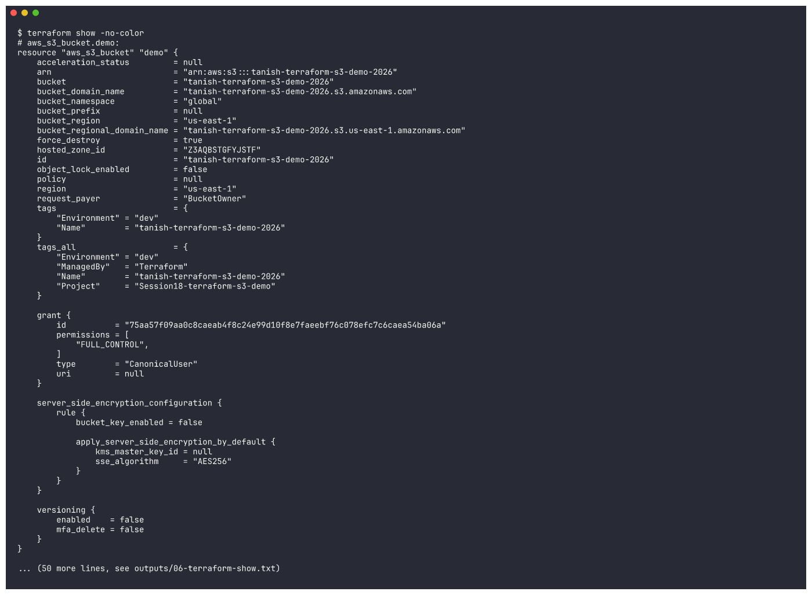

<details>
<summary>Full output (105 lines) - click to expand</summary>

```text
$ terraform show -no-color
# aws_s3_bucket.demo:
resource "aws_s3_bucket" "demo" {
    acceleration_status         = null
    arn                         = "arn:aws:s3:::tanish-terraform-s3-demo-2026"
    bucket                      = "tanish-terraform-s3-demo-2026"
    bucket_domain_name          = "tanish-terraform-s3-demo-2026.s3.amazonaws.com"
    bucket_namespace            = "global"
    bucket_prefix               = null
    bucket_region               = "us-east-1"
    bucket_regional_domain_name = "tanish-terraform-s3-demo-2026.s3.us-east-1.amazonaws.com"
    force_destroy               = true
    hosted_zone_id              = "Z3AQBSTGFYJSTF"
    id                          = "tanish-terraform-s3-demo-2026"
    object_lock_enabled         = false
    policy                      = null
    region                      = "us-east-1"
    request_payer               = "BucketOwner"
    tags                        = {
        "Environment" = "dev"
        "Name"        = "tanish-terraform-s3-demo-2026"
    }
    tags_all                    = {
        "Environment" = "dev"
        "ManagedBy"   = "Terraform"
        "Name"        = "tanish-terraform-s3-demo-2026"
        "Project"     = "Session18-terraform-s3-demo"
    }

    grant {
        id          = "75aa57f09aa0c8caeab4f8c24e99d10f8e7faeebf76c078efc7c6caea54ba06a"
        permissions = [
            "FULL_CONTROL",
        ]
        type        = "CanonicalUser"
        uri         = null
    }

    server_side_encryption_configuration {
        rule {
            bucket_key_enabled = false

            apply_server_side_encryption_by_default {
                kms_master_key_id = null
                sse_algorithm     = "AES256"
            }
        }
    }

    versioning {
        enabled    = false
        mfa_delete = false
    }
}

# aws_s3_bucket_public_access_block.demo:
resource "aws_s3_bucket_public_access_block" "demo" {
    block_public_acls       = true
    block_public_policy     = true
    bucket                  = "tanish-terraform-s3-demo-2026"
    id                      = "tanish-terraform-s3-demo-2026"
    ignore_public_acls      = true
    region                  = "us-east-1"
    restrict_public_buckets = true
}

# aws_s3_bucket_server_side_encryption_configuration.demo:
resource "aws_s3_bucket_server_side_encryption_configuration" "demo" {
    bucket                = "tanish-terraform-s3-demo-2026"
    expected_bucket_owner = null
    id                    = "tanish-terraform-s3-demo-2026"
    region                = "us-east-1"

    rule {
        blocked_encryption_types = []
        bucket_key_enabled       = false

        apply_server_side_encryption_by_default {
            kms_master_key_id = null
            sse_algorithm     = "AES256"
        }
    }
}

# aws_s3_bucket_versioning.demo:
resource "aws_s3_bucket_versioning" "demo" {
    bucket                = "tanish-terraform-s3-demo-2026"
    expected_bucket_owner = null
    id                    = "tanish-terraform-s3-demo-2026"
    region                = "us-east-1"

    versioning_configuration {
        mfa_delete = "Disabled"
        status     = "Enabled"
    }
}


Outputs:

bucket_arn = "arn:aws:s3:::tanish-terraform-s3-demo-2026"
bucket_domain_name = "tanish-terraform-s3-demo-2026.s3.amazonaws.com"
bucket_name = "tanish-terraform-s3-demo-2026"
bucket_region = "us-east-1"
versioning_status = "Enabled"
```

</details>

### Step 7 - `terraform output`

`output` prints the values declared in `outputs.tf`. `-raw` prints a single value without quotes, which is handy
in scripts. `-json` gives machine-readable output for CI/CD pipelines.

```bash
terraform output
terraform output -raw bucket_arn
terraform output -json
```

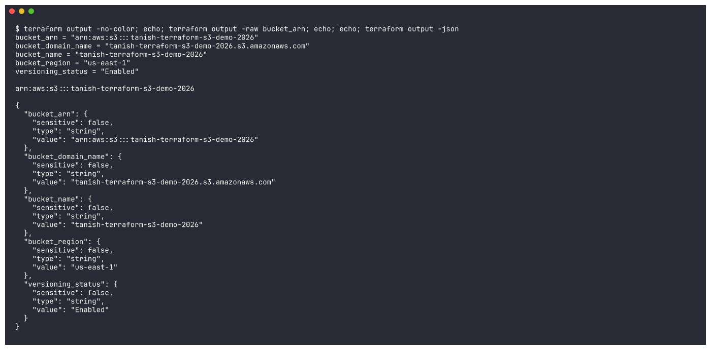

```text
$ terraform output -no-color; echo; terraform output -raw bucket_arn; echo; echo; terraform output -json
bucket_arn = "arn:aws:s3:::tanish-terraform-s3-demo-2026"
bucket_domain_name = "tanish-terraform-s3-demo-2026.s3.amazonaws.com"
bucket_name = "tanish-terraform-s3-demo-2026"
bucket_region = "us-east-1"
versioning_status = "Enabled"

arn:aws:s3:::tanish-terraform-s3-demo-2026

{
  "bucket_arn": {
    "sensitive": false,
    "type": "string",
    "value": "arn:aws:s3:::tanish-terraform-s3-demo-2026"
  },
  "bucket_domain_name": {
    "sensitive": false,
    "type": "string",
    "value": "tanish-terraform-s3-demo-2026.s3.amazonaws.com"
  },
  "bucket_name": {
    "sensitive": false,
    "type": "string",
    "value": "tanish-terraform-s3-demo-2026"
  },
  "bucket_region": {
    "sensitive": false,
    "type": "string",
    "value": "us-east-1"
  },
  "versioning_status": {
    "sensitive": false,
    "type": "string",
    "value": "Enabled"
  }
}
```

### Step 8 - Verify the bucket with the AWS CLI

I used the AWS CLI, independently of Terraform, to confirm the bucket really exists with the settings from `main.tf`:
versioning on, AES256 default encryption, all public access blocked, and the tags (including the `default_tags` from the
provider). I also uploaded a test object.

```bash
export AWS_ENDPOINT_URL=http://localhost:4566   # LocalStack; omit for real AWS
B=$(terraform output -raw bucket_name)
aws s3 ls
aws s3api get-bucket-versioning   --bucket $B
aws s3api get-bucket-encryption   --bucket $B
aws s3api get-public-access-block --bucket $B
aws s3api get-bucket-tagging      --bucket $B
echo "hello from terraform" | aws s3 cp - s3://$B/hello.txt
aws s3 ls s3://$B/
```

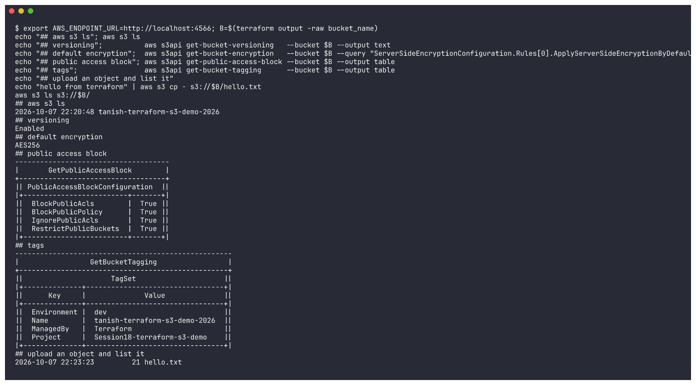

```text
$ export AWS_ENDPOINT_URL=http://localhost:4566; B=$(terraform output -raw bucket_name)
echo "## aws s3 ls"; aws s3 ls
echo "## versioning";          aws s3api get-bucket-versioning   --bucket $B --output text
echo "## default encryption";  aws s3api get-bucket-encryption   --bucket $B --query "ServerSideEncryptionConfiguration.Rules[0].ApplyServerSideEncryptionByDefault" --output text
echo "## public access block"; aws s3api get-public-access-block --bucket $B --output table
echo "## tags";                aws s3api get-bucket-tagging      --bucket $B --output table
echo "## upload an object and list it"
echo "hello from terraform" | aws s3 cp - s3://$B/hello.txt
aws s3 ls s3://$B/
## aws s3 ls
2026-10-07 22:20:48 tanish-terraform-s3-demo-2026
## versioning
Enabled
## default encryption
AES256
## public access block
-------------------------------------
|       GetPublicAccessBlock        |
+-----------------------------------+
|| PublicAccessBlockConfiguration  ||
|+-------------------------+-------+|
||  BlockPublicAcls        |  True ||
||  BlockPublicPolicy      |  True ||
||  IgnorePublicAcls       |  True ||
||  RestrictPublicBuckets  |  True ||
|+-------------------------+-------+|
## tags
----------------------------------------------------
|                 GetBucketTagging                 |
+--------------------------------------------------+
||                     TagSet                     ||
|+--------------+---------------------------------+|
||      Key     |              Value              ||
|+--------------+---------------------------------+|
||  Environment |  dev                            ||
||  Name        |  tanish-terraform-s3-demo-2026  ||
||  ManagedBy   |  Terraform                      ||
||  Project     |  Session18-terraform-s3-demo    ||
|+--------------+---------------------------------+|
## upload an object and list it
2026-10-07 22:23:23         21 hello.txt
```

### Step 9 - (extra) `terraform state list`

This lists every resource address Terraform is tracking in its state file.

```bash
terraform state list
```

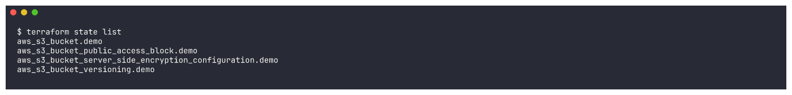

```text
$ terraform state list
aws_s3_bucket.demo
aws_s3_bucket_public_access_block.demo
aws_s3_bucket_server_side_encryption_configuration.demo
aws_s3_bucket_versioning.demo
```

### Step 10 - `terraform destroy`

`destroy` plans the deletion of everything in the state and then removes it in **reverse dependency order**. The
versioning, encryption and public-access-block resources go first, then the bucket. Because of
`force_destroy = true`, the bucket is deleted even though it still holds `hello.txt` from step 8.

```bash
terraform destroy -auto-approve
```

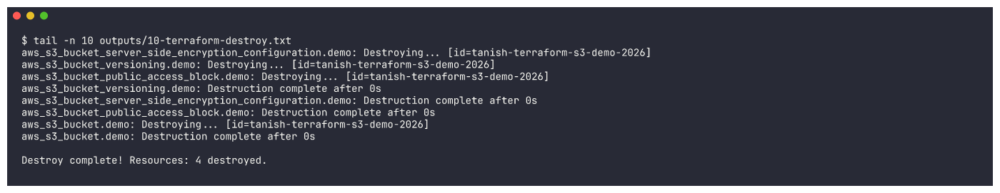

```text
$ tail -n 10 outputs/10-terraform-destroy.txt
aws_s3_bucket_server_side_encryption_configuration.demo: Destroying... [id=tanish-terraform-s3-demo-2026]
aws_s3_bucket_versioning.demo: Destroying... [id=tanish-terraform-s3-demo-2026]
aws_s3_bucket_public_access_block.demo: Destroying... [id=tanish-terraform-s3-demo-2026]
aws_s3_bucket_versioning.demo: Destruction complete after 0s
aws_s3_bucket_server_side_encryption_configuration.demo: Destruction complete after 0s
aws_s3_bucket_public_access_block.demo: Destruction complete after 0s
aws_s3_bucket.demo: Destroying... [id=tanish-terraform-s3-demo-2026]
aws_s3_bucket.demo: Destruction complete after 0s

Destroy complete! Resources: 4 destroyed.
```

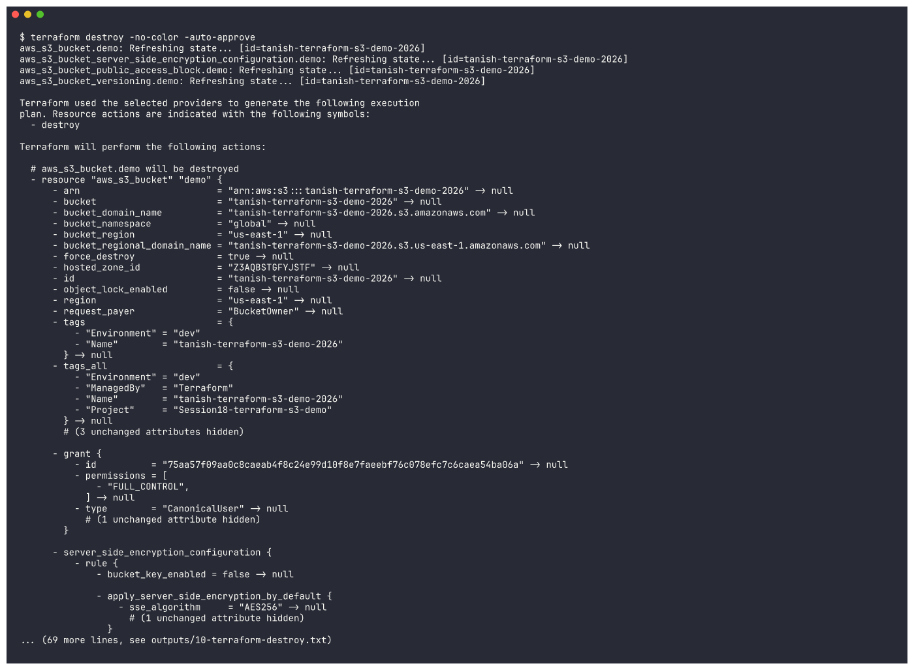

<details>
<summary>Full output (124 lines) - click to expand</summary>

```text
$ terraform destroy -no-color -auto-approve
aws_s3_bucket.demo: Refreshing state... [id=tanish-terraform-s3-demo-2026]
aws_s3_bucket_server_side_encryption_configuration.demo: Refreshing state... [id=tanish-terraform-s3-demo-2026]
aws_s3_bucket_public_access_block.demo: Refreshing state... [id=tanish-terraform-s3-demo-2026]
aws_s3_bucket_versioning.demo: Refreshing state... [id=tanish-terraform-s3-demo-2026]

Terraform used the selected providers to generate the following execution
plan. Resource actions are indicated with the following symbols:
  - destroy

Terraform will perform the following actions:

  # aws_s3_bucket.demo will be destroyed
  - resource "aws_s3_bucket" "demo" {
      - arn                         = "arn:aws:s3:::tanish-terraform-s3-demo-2026" -> null
      - bucket                      = "tanish-terraform-s3-demo-2026" -> null
      - bucket_domain_name          = "tanish-terraform-s3-demo-2026.s3.amazonaws.com" -> null
      - bucket_namespace            = "global" -> null
      - bucket_region               = "us-east-1" -> null
      - bucket_regional_domain_name = "tanish-terraform-s3-demo-2026.s3.us-east-1.amazonaws.com" -> null
      - force_destroy               = true -> null
      - hosted_zone_id              = "Z3AQBSTGFYJSTF" -> null
      - id                          = "tanish-terraform-s3-demo-2026" -> null
      - object_lock_enabled         = false -> null
      - region                      = "us-east-1" -> null
      - request_payer               = "BucketOwner" -> null
      - tags                        = {
          - "Environment" = "dev"
          - "Name"        = "tanish-terraform-s3-demo-2026"
        } -> null
      - tags_all                    = {
          - "Environment" = "dev"
          - "ManagedBy"   = "Terraform"
          - "Name"        = "tanish-terraform-s3-demo-2026"
          - "Project"     = "Session18-terraform-s3-demo"
        } -> null
        # (3 unchanged attributes hidden)

      - grant {
          - id          = "75aa57f09aa0c8caeab4f8c24e99d10f8e7faeebf76c078efc7c6caea54ba06a" -> null
          - permissions = [
              - "FULL_CONTROL",
            ] -> null
          - type        = "CanonicalUser" -> null
            # (1 unchanged attribute hidden)
        }

      - server_side_encryption_configuration {
          - rule {
              - bucket_key_enabled = false -> null

              - apply_server_side_encryption_by_default {
                  - sse_algorithm     = "AES256" -> null
                    # (1 unchanged attribute hidden)
                }
            }
        }

      - versioning {
          - enabled    = true -> null
          - mfa_delete = false -> null
        }
    }

  # aws_s3_bucket_public_access_block.demo will be destroyed
  - resource "aws_s3_bucket_public_access_block" "demo" {
      - block_public_acls       = true -> null
      - block_public_policy     = true -> null
      - bucket                  = "tanish-terraform-s3-demo-2026" -> null
      - id                      = "tanish-terraform-s3-demo-2026" -> null
      - ignore_public_acls      = true -> null
      - region                  = "us-east-1" -> null
      - restrict_public_buckets = true -> null
    }

  # aws_s3_bucket_server_side_encryption_configuration.demo will be destroyed
  - resource "aws_s3_bucket_server_side_encryption_configuration" "demo" {
      - bucket                = "tanish-terraform-s3-demo-2026" -> null
      - id                    = "tanish-terraform-s3-demo-2026" -> null
      - region                = "us-east-1" -> null
        # (1 unchanged attribute hidden)

      - rule {
          - blocked_encryption_types = [] -> null
          - bucket_key_enabled       = false -> null

          - apply_server_side_encryption_by_default {
              - sse_algorithm     = "AES256" -> null
                # (1 unchanged attribute hidden)
            }
        }
    }

  # aws_s3_bucket_versioning.demo will be destroyed
  - resource "aws_s3_bucket_versioning" "demo" {
      - bucket                = "tanish-terraform-s3-demo-2026" -> null
      - id                    = "tanish-terraform-s3-demo-2026" -> null
      - region                = "us-east-1" -> null
        # (1 unchanged attribute hidden)

      - versioning_configuration {
          - mfa_delete = "Disabled" -> null
          - status     = "Enabled" -> null
        }
    }

Plan: 0 to add, 0 to change, 4 to destroy.

Changes to Outputs:
  - bucket_arn         = "arn:aws:s3:::tanish-terraform-s3-demo-2026" -> null
  - bucket_domain_name = "tanish-terraform-s3-demo-2026.s3.amazonaws.com" -> null
  - bucket_name        = "tanish-terraform-s3-demo-2026" -> null
  - bucket_region      = "us-east-1" -> null
  - versioning_status  = "Enabled" -> null
aws_s3_bucket_server_side_encryption_configuration.demo: Destroying... [id=tanish-terraform-s3-demo-2026]
aws_s3_bucket_versioning.demo: Destroying... [id=tanish-terraform-s3-demo-2026]
aws_s3_bucket_public_access_block.demo: Destroying... [id=tanish-terraform-s3-demo-2026]
aws_s3_bucket_versioning.demo: Destruction complete after 0s
aws_s3_bucket_server_side_encryption_configuration.demo: Destruction complete after 0s
aws_s3_bucket_public_access_block.demo: Destruction complete after 0s
aws_s3_bucket.demo: Destroying... [id=tanish-terraform-s3-demo-2026]
aws_s3_bucket.demo: Destruction complete after 0s

Destroy complete! Resources: 4 destroyed.
```

</details>

### Step 11 - Verify everything is gone

```bash
aws s3 ls
terraform state list
aws s3api head-bucket --bucket tanish-terraform-s3-demo-2026
```

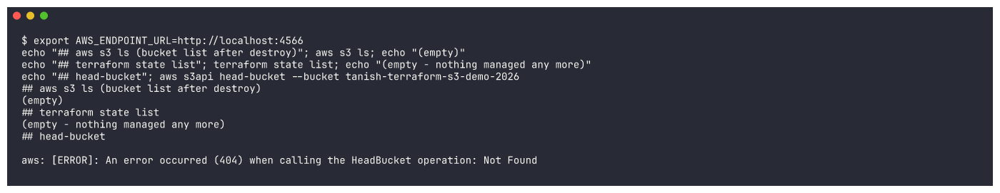

```text
$ export AWS_ENDPOINT_URL=http://localhost:4566
echo "## aws s3 ls (bucket list after destroy)"; aws s3 ls; echo "(empty)"
echo "## terraform state list"; terraform state list; echo "(empty - nothing managed any more)"
echo "## head-bucket"; aws s3api head-bucket --bucket tanish-terraform-s3-demo-2026
## aws s3 ls (bucket list after destroy)
(empty)
## terraform state list
(empty - nothing managed any more)
## head-bucket

aws: [ERROR]: An error occurred (404) when calling the HeadBucket operation: Not Found
```

The bucket list is empty, the state has no resources, and `head-bucket` returns **404 Not Found**.

---

## Workflow summary

| # | Command | What it does | Result in this run |
|---|---|---|---|
| 1 | `terraform init` | Downloads providers, creates `.terraform/` + lock file | hashicorp/aws v6.67.0 installed |
| 2 | `terraform fmt` | Formats code to the canonical style | Already formatted |
| 3 | `terraform validate` | Static check of the configuration | `Success! The configuration is valid.` |
| 4 | `terraform plan` | Shows what will change | `Plan: 4 to add, 0 to change, 0 to destroy.` |
| 5 | `terraform apply` | Creates the resources, writes state | `Apply complete! Resources: 4 added` |
| 6 | `terraform show` | Shows the state in readable form | All bucket attributes listed |
| 7 | `terraform output` | Prints output values | Bucket name, ARN, region, domain, versioning |
| 8 | `aws s3 ...` | Independent verification | Bucket, versioning, encryption, PAB and tags confirmed |
| 9 | `terraform destroy` | Deletes everything in state | `Destroy complete! Resources: 4 destroyed.` |

## Running against real AWS

1. Configure credentials: `aws configure` (or `export AWS_PROFILE=...`) and check them with `aws sts get-caller-identity`.
2. In `terraform.tfvars` set `use_localstack = false`. This turns off the dummy credentials, the `skip_*` flags, path-style S3
   and the `endpoints` block, so the provider becomes a plain `provider "aws" { region = var.aws_region }`. You can
   also delete the "LocalStack overrides" section from `provider.tf`.
3. Change `bucket_name` to a globally unique name. S3 bucket names are shared by every AWS account.
4. Run the same commands: `terraform init && terraform plan && terraform apply`. Leave out `AWS_ENDPOINT_URL` for the CLI checks.
5. Run `terraform destroy` when you are done, so nothing is left running.

## What I learned

- **Infrastructure as Code**: the bucket and all its settings live in version-controlled files. Running `apply` on the same files
  always gives the same result, and the plan shows every change before it happens.
- **Declarative**: I describe the end state ("a versioned, encrypted, private bucket") and Terraform works out the API calls and
  their order from the references between resources.
- **Providers** turn HCL into API calls. Swapping only the endpoint (LocalStack vs AWS) shows that the code itself does not depend on
  where it runs.
- **Variables + tfvars** keep values out of the code. **Outputs** expose the useful values to people and to other tools.
- **State** (`terraform.tfstate`) is how Terraform maps code to real resources. It can contain sensitive data, so it is git-ignored
  here. In a team it belongs in a remote backend such as S3 with locking.
- In AWS provider v4+ the bucket's sub-settings (versioning, encryption, public access block) are **separate resources**,
  not arguments of `aws_s3_bucket`.
